# 아키텍처

## 목적

이 문서는 현재 구현되는 코드의 설계와 구조를 지속적으로 기록한다.

코드 구조가 바뀌거나 새 하위 시스템이 추가되면, 해당 작업의 설계 문서와 함께 이 문서를 갱신해야 한다.

## Purpose

This document continuously records the design and structure of the code currently being implemented.

When code structure changes or a new subsystem is added, this document must be updated together with the task design document.

## 현재 상태

현재 저장소는 문서와 원본 자산 중심이며, 첫 C++ 구현으로 비실행 실행 파일 분석 도구를 추가한다.

첫 구현 대상은 `MASTER\PIU_1ST\PIU.EXE`를 실행하지 않고 분석하는 도구이다.

## Current State

The repository currently contains documentation and original assets, and the first C++ implementation adds a non-executing executable analysis tool.

The first implementation target is a non-executing analysis tool for `MASTER\PIU_1ST\PIU.EXE`.

## 예정 구조

예정된 공용 구조:

* `include/`: 외부에서 참조 가능한 프로젝트 C++ 헤더
* `src/`: 플랫폼 공용 로더와 런타임 코어
* `src/platform/win32/`: Win32 전용 실행, 메모리, 창, 입력, 파일 시스템 세부 구현
* `src/platform/linux/`: Linux 전용 세부 구현
* `src/platform/web/`: Web 전용 세부 구현

현재 추가되는 디렉터리:

* `include/repiu/exe/`: MZ/LE 실행 파일 분석용 공용 헤더
* `include/repiu/hle/`: 정적 HLE profile과 서비스 범위 공용 헤더
* `include/repiu/target/`: 정적 target profile과 target registry 공용 헤더
* `scripts/`: 반복 검증용 빌드 스크립트
* `src/exe/`: MZ/LE 파서 구현
* `src/hle/`: 정적 HLE profile 등록 구현
* `src/platform/win32/`: Win32 전용 실행 메모리 정책과 이후 실행 backend 구현 위치
* `src/target/`: 정적 target profile 등록 구현
* `src/tools/exe_analyzer/`: 비실행 콘솔 분석 도구

예정된 주요 모듈:

* `TargetRegistry`: 게임 타깃과 버전 선택. 현재 단계에서는 정적 C++ 등록 구조로 `piu_1st`, `pumpit1`, `pumpit2`, `pumpit3`을 제공한다.
* `TargetProfile`: 실행 파일 경로, 작업 디렉터리, 자산 루트, 포맷 힌트, HLE 프로파일 id, 버전별 메타데이터
* `HleProfileRegistry`: target이 참조하는 HLE 프로파일 선택. 현재 단계에서는 정적 C++ 등록 구조로 `piu_common`을 제공한다.
* `HleProfile`: target이 요구하는 DOS/DPMI/하드웨어 HLE 서비스 범위
* `ExecutableReader`: 원본 실행 파일과 관련 파일을 읽는 공용 파일 입력 계층
* `MzParser`: DOS MZ 헤더와 LE/LX 위치 파악
* `Dos4gwExecutableLoader`: target profile을 기준으로 MZ/LE 파싱, 이미지 매핑, fixup 분석, 내부 relocation dry-run을 하나의 load result로 묶는다.
* `LeParser`: LE 헤더, 오브젝트 테이블, 페이지 테이블, fixup page table, fixup record table 범위, 1차 fixup record 디코딩, 엔트리 포인트 파싱
* `ImageMapper`: 원본 보호 모드 코드가 기대하는 메모리 이미지 구성. 현재 단계에서는 `Dos4gwExecutableLoader`를 통해 내부 relocation dry-run, skipped source 관찰 정보, full source type 분포를 제공한다.
* `RuntimeMemory`: 실행 메모리, 스택, 힙, selector 추상화, HLE 영역 관리. 현재 단계에서는 실행 메모리를 할당하지 않고 object region, entry, stack top, HLE reserve base를 계산하는 dry-run을 제공한다.
* `Win32RuntimeMemoryPolicy`: Win32 host pointer size, 32-bit direct execution 가능 여부, preferred allocation base, reserve size를 보고한다. 현재 단계에서는 실제 메모리를 할당하지 않는다.
* `Win32 x86 Build`: 원본 32-bit x86 entry 직접 실행을 준비하기 위해 `scripts/build_win32_x86.bat`로 `build\win32_x86_debug` multi-config 트리를 생성하고 검증한다. `-Configuration` 인자로 구성을 고르며 `scripts/build_win32_x86_release.bat`이 Release 진입점이다. 정확성 검증은 Debug, 성능 측정은 Release로 나눈다(Task 330의 Debug 계수 11.34배와 단계 순위 역전).
* `ExecutionEngine`: 원본 32-bit x86 코드로 제어 이전
* `HleDispatcher`: DOS, DPMI, 타이머, 입력, 그래픽, 오디오, 파일 시스템 호출 처리
* `TraceLogger`: 로더 결정, HLE 호출, 예외, 실행 단계 기록
* `LeResidentName`: LE resident-name/ordinal과 decorated `@N` 인자 크기를 asset에서 복원한다.
* `VirtualGlideModule`: `glide2x.ovl`의 hardware code를 실행하지 않고 LINEXE handle과 asset-validated export gate를 제공한다.
* `GlideGateDispatcher`: `{linear address, client CS}` procedure pointer를 제공하고 ordinal별 trap에서 guest stdcall ABI를 해석한다. 현재 init/query/select까지 관찰 기반 최소 의미를 제공하며 `grSstWinOpen` presentation 정책이 다음 경계다.
* `GlideHle` (`include/repiu/hle/glide_hle.h`, `src/hle/glide_hle.cpp`): asset-derived export registry, ordinal gate image, decorated argument size, resolution decoding과 플랫폼 공용 논리 상태를 담당한다.
* `Win32GlideOpenGlBackend` (`include/repiu/platform/win32/glide_opengl_backend.h`, `src/platform/win32/glide_opengl_backend.cpp`): SDL3 resizable host window, OpenGL context, texture cache, GLSL combine/perspective/fog, LFB presentation과 event pump를 담당한다. Glide 논리 해상도는 640×480으로 유지하고 host window는 기본 2배이며 `Alt+1..4`로 1–4배를 선택한다. 실행기 메인 스레드가 SDL video/GL을 소유하고 게스트 작업 스레드의 Glide 호출은 동기 명령 큐로 전달된다.
* `Win32ExecutionTrampoline`은 Glide 구현을 직접 소유하지 않고 guest stack/register ABI를 공용 Glide HLE와 platform backend에 연결한다.
* `GlideSignatureCatalog`: 실제 관찰된 API의 stack byte count와 void/EAX/x87 반환 kind를 중앙에서 관리하며 asset `@N`과 교차 검증한다.
* `GlideLogicalState`는 lazy OpenGL texture object와 독립적으로 8 MiB virtual TMU 범위(`0..0x007FFFF8`)와 LFB pixel-format 상태를 보존한다.
* `GlideLfb` (`include/repiu/hle/glide_lfb.h`, `src/hle/glide_lfb.cpp`): LFB staging surface, `GrLfbInfo_t` 직렬화, color-format 인식 565↔RGBA8 변환을 담당하는 플랫폼 공용 계층이다. `grLfbLock`은 게스트가 네이티브 명령으로 직접 기록할 실제 주소를 건네므로, HLE 경계가 함수가 아니라 **메모리 표면**이 되는 유일한 Glide 경로다. staging buffer는 아레나가 아닌 호스트 소유 할당이며(게스트는 flat DS로 네이티브 실행), 모든 lock에서 현재 framebuffer로 seeding해 write lock이 기존 화면을 지우지 않게 한다. ARGB/RGBA lock은 RGB565, ABGR/BGRA lock은 BGR565로 encode/decode하며 `grSstWinOpen`의 color format을 기본값으로, `grLfbWriteColorFormat` 상태를 write lock override로 사용한다.
* Glide 텍스처 크기 규약(`GrLOD_t`는 열거값이며 `GR_LOD_256`=0)은 `docs/kb/glide-texture-lod-and-formats.md`에서 관리한다. `grTexTextureMemRequired`의 반환값은 게스트가 자기 TMU 배치를 결정하는 입력이므로 정확성이 게스트 동작에 직접 전파된다.
* `Win32X87Context` (`include/repiu/platform/win32/x87_context.h`, `src/platform/win32/x87_context.cpp`): SEH `CONTEXT`의 x87 TOP/tag/80-bit register를 갱신하여 guest float 반환을 독립적으로 처리한다.

## Planned Structure

Planned shared structure:

* `include/`: project C++ headers intended for external inclusion
* `src/`: platform-neutral loader and runtime core
* `src/platform/win32/`: Win32-specific execution, memory, window, input, and filesystem details
* `src/platform/linux/`: Linux-specific details
* `src/platform/web/`: Web-specific details

Directories added now:

* `include/repiu/exe/`: public headers for MZ/LE executable analysis
* `include/repiu/hle/`: public headers for static HLE profiles and service scopes
* `include/repiu/target/`: public headers for static target profiles and target registry
* `scripts/`: build scripts for repeated verification
* `src/exe/`: MZ/LE parser implementation
* `src/hle/`: static HLE profile registration implementation
* `src/platform/win32/`: Win32-specific executable memory policy and future execution backend location
* `src/target/`: static target profile registration implementation
* `src/tools/exe_analyzer/`: non-executing console analysis tool
* `src/host/win32/`: Win32 loader application entry point. This is the practical loader path that selects a target, loads the DOS/4GW executable, builds a relocated image, places it in Win32 process memory, and performs the current minimal execution attempt.

Planned major modules:

* `TargetRegistry`: game target and version selection. The current step provides `piu_1st` through static C++ registration.
* `TargetProfile`: executable path, working directory, asset root, format hint, HLE profile id, optional ROM-set id, version metadata, and target-specific early runtime reservation hints
* `HleProfileRegistry`: HLE profile selection referenced by targets. The current step provides `piu_common` through static C++ registration.
* `HleProfile`: DOS/DPMI/hardware HLE service scope required by a target
* `ExecutableReader`: shared file input layer for original executables and related files
* `MzParser`: DOS MZ header and LE/LX location
* `Dos4gwExecutableLoader`: groups MZ/LE parsing, image mapping, fixup analysis, and internal relocation dry-run into one load result based on the target profile.
* `LeParser`: LE header, object table, page table, fixup page table, fixup record table range, first-pass fixup record decoding, and entry point parsing
* `ImageMapper`: memory image expected by the original protected-mode code. The current step provides internal relocation dry-run, skipped source observability, and full source type distribution through `Dos4gwExecutableLoader`.
* `RuntimeMemory`: executable memory, stack, heap, selector abstraction, and HLE regions. The current step provides a dry-run that calculates object regions, entry, stack top, and HLE reserve base without allocating executable memory.
* `RuntimeMemoryArenaPlan`: shared runtime arena reserve planning. It combines the current image reserve size with observed expansion slack so DOS/4G post-resize writes can be backed by host memory. The Win32 loader uses this reserve size for relocated-base probing and image placement.
* The Win32 traced memory-store path keeps narrowly bounded shadow memory for observed allocator failure metadata outside the committed arena. A `C7 /0` dword sentinel store of `0xFFFFFFFF` is accepted only within 1 MiB after the arena end; unrelated out-of-arena stores remain fatal so missing mappings are not hidden.
* An `89 /r` store may extend that allocator shadow only when the first header value exactly equals the distance to the existing sentinel, or when a later field falls inside or immediately after the resulting shadow range. This preserves allocator metadata relationships without turning shadow memory into a general substitute for missing guest mappings.
* Objects whose base register is inside the final 64 bytes of the arena may preserve `C7 /0`, `89 /r`, and `D9 /2-/3` fields that cross no more than 64 bytes beyond arena end. The base must remain inside real guest memory; objects whose base is already outside the arena are not covered by this boundary-tail policy.
* A contiguous object array may continue that boundary tail when each next base exactly matches the recorded frontier. Its span is derived from the observed `ESI` count times `EDX` stride, accepted only between 64 bytes and 1 MiB, and otherwise falls back to 4 KiB. An explicit `REPIU_EXECUTION_TIMEOUT_MS` budget remains the final observation bound; since Task 435 the default is unlimited, so a run that needs one states it.
* An unprefixed `8B /r` low-memory read inside the first 4 KiB uses zero-backed DOS memory after real-arena and shadow-memory misses when a guest `DS` selector is active. It does not add the relocated image base to a guest low-memory offset.
* A faulting `03 /r` with a complete dword source in shadow memory performs the 32-bit ADD on the ModRM-selected register and restores `CF/PF/AF/ZF/SF/OF`; mapped-memory ADD remains on the direct CPU path.
* A faulting `83 /1` no-SIB dword destination in shadow memory performs OR as a read-modify-write, records the resulting store, clears `CF/OF`, updates `PF/ZF/SF`, and preserves undefined `AF`.
* A faulting `38 /r` no-SIB byte source in shadow memory compares it with the ModRM-selected legacy byte register and restores `CF/PF/AF/ZF/SF/OF` without modifying either operand.
* The allocator probe at relocated offset `0xF7A71` records only the confirmed request sizes `0x2C` and `0x1008`. The header OR at `0xF7AD4` then binds that request to a block and exposes only `[block+4, block+size-4)` as zero-backed shadow payload. Explicit shadow bytes override zero backing; unconfirmed sizes and unrelated holes remain faults.
* `RelocatableRuntimeImage`: primary execution memory direction after fixed low-address reservation proved unreliable in Win32 x86. This subsystem maps original LE object bases to a safe runtime base, reapplies LE relocation records for the new addresses, and calculates relocated entry and stack addresses while preserving original game code. The current dry-run uses `0x01000000` as the relocated image base and does not allocate or write executable memory.
* `RelocatedRuntimeImage`: materialized C++ buffer form of the relocatable plan. It copies each mapped LE object into owned buffers and writes supported 32-bit internal relocation values for the relocated base. This still does not allocate executable OS memory or call original code.
* `Win32RelocatedImagePlacement`: Win32 process-memory placement for relocated image buffers. It reserves and commits the relocated image range, copies object buffers, applies minimal object protection from LE flags, and releases the range without transferring control to original code.
* `Win32MinimalExecutionTrampoline`: first observation-only execution path. It calls the relocated entry from a separate thread, catches SEH exceptions, and reports return/exception/timeout. It does not yet switch to the guest stack or dispatch HLE traps.
* `Win32ExecutionSnapshot`: grouped x86 guest register observation state used by the Win32 execution path. Timeout handling now exposes a `timeout_snapshot` output slot and reports whether it was captured. Forced `SuspendThread`/`GetThreadContext` capture is not enabled for the current `piu_1st` timeout state because it hangs the loader; follow-up work should use a safer sampling watcher or HLE-routed trace to fill this structure.
* `Win32ExceptionDispatchLiveness`: the vectored exception route atomically counts valid handler entries and RAII-guarded exits and records the last entry EIP. It does not suspend the guest or alter dispatch. An outstanding count of one at quiet timeout proves that polling expired while one handler invocation had not returned; equal counts prove no dispatch remained active.
* `Win32AllocatorProbeObservation`: a diagnostic-only 16-entry ring for exact relocated offset `0xF7A71`. It records EAX, ESI/decoded source, DS, pending allocation state before/after, and the handling result. Sequence numbers preserve chronological output after overwrite without allowing trace memory to grow.
* `Win32AllocatorControlFlowObservation`: a diagnostic-only 32-entry ring for exception entries in relocated allocator range `[0xF7A71, 0xF7AD5)`. It records exception code, four opcode bytes, core allocator registers, flags, and pending state without modifying dispatch. The range exposes free-list traversal and metadata update paths while keeping storage bounded.
* `Win32ShadowWriteProvenance`: an allocation-free 256-entry ring that records recent shadow writes and correlates complete dword allocator reads with a writer when one retained write covers all four bytes. A dynamic `unordered_map` prototype was rejected after causing `0xC0000374` heap corruption in the exception path.
* `DosLowMemory`: shared fixed 64 KiB DOS low-memory backing with checked little-endian byte/word/dword reads and up-to-dword writes. It starts zeroed and does not synthesize IVT, BIOS, environment, extender-private, or allocator state.
* `SelectorTable` now provides checked selector base/limit translation. Observed segment loads provisionally register a present base-zero, 64 KiB descriptor until DPMI descriptor lifecycle services are modeled. Win32 FS-word and generic DS low-memory reads use this translation instead of an implicit numeric-offset zero fallback.
* `Win32SegmentLoadObservation`: a diagnostic-only 16-entry ring for segment-load HLE events. It records relocated EIP, target segment register, selector, and source, exposing the stable PIU sequence that loads DS/FS selector `0x2C` from image address `0x021A664D`.
* `Win32RuntimeMemoryPolicy`: reports Win32 host pointer size, 32-bit direct execution support, preferred allocation base, and reserve size. The current step does not allocate memory.
* `Win32AddressRangeProbe`: checks the required Win32 runtime address range with `VirtualQuery` before any allocation. It reports whether the fixed DOS/4GW image range is free and records the first blocking memory block when it is occupied. This is a dry-run only and does not reserve executable memory.
* `Win32AddressRangeReservation`: attempts to reserve the fixed original runtime address range with `VirtualAlloc(MEM_RESERVE)` and reports success or the Windows error code without executing original code.
* `Win32HostImageBasePolicy`: configures 32-bit Win32 executable targets so the host image base stays outside both the original DOS/4GW fixed image range and the relocated image range. The current baseline applies `/BASE:0x10000000` and `/DYNAMICBASE:NO` to Win32 x86 host targets.
* `Win32LoaderApp`: dedicated Win32 loader executable target named `repiu_loader_win32`. It owns the current loader orchestration path: target selection, executable read, DOS/4GW load, relocated image planning, relocated buffer creation, Win32 process-memory placement, and minimal execution trampoline invocation. In addition to built-in target ids, it can accept a direct DOS/4GW executable path and run it through a temporary `direct_executable` target using the `dos4gw_console_sample` HLE profile. This keeps local sample testing from adding one target profile per executable.
* `DosVirtualFileSystem`: shared HLE state for DOS path resolution and file handles. It treats the target profile working directory as the virtual DOS drive root, keeps a virtual current directory without changing the host process current directory, and currently handles `INT 21h AH=0x3B` chdir plus `INT 21h AH=0x3D` open path resolution/handle allocation.
* `Win32SegmentMemoryLoadHle`: observation-driven segment override memory access HLE in the Win32 execution trampoline. The current scope handles the traced `26 8A 4F FF` byte load as `ES:[EDI - 1]`, returns the DOS command tail length byte for `ES:0x80`, and records the handled segment memory load in the execution attempt.
* `Win32 x86 Build`: prepares direct original 32-bit x86 entry execution by generating and verifying the multi-config `build\win32_x86_debug` tree through `scripts/build_win32_x86.bat`. A `-Configuration` parameter selects the configuration and `scripts/build_win32_x86_release.bat` is the Release entry point; correctness verification stays on Debug while every performance number comes from Release, because Task 330 measured an 11.34x Debug factor that inverts the stage ranking.
* `OpenWatcomLocalSampleSuite`: script-driven compatibility report for local OpenWatcom samples. `scripts/build_openwatcom_samples.ps1` enumerates every source in the selected local `tools/openwatcom/samples/clibexam` and `tools/openwatcom/samples/cplbexam` suites, applies a DOS/4GW console build plan for known option-sensitive samples, explicitly marks samples outside that target as skipped, builds the remaining sources into Git-excluded `build/openwatcom_samples/`, and writes a stable manifest. The script can also skip the Win32 host rebuild with `-SkipHostBuild` when only sample build-plan validation is needed. `scripts/test_openwatcom_samples.ps1` then runs the manifest's built EXEs through the loader direct path, writes an HTML pass-rate report plus summary JSON under `build/openwatcom_sample_report/`, and can compare against or update the Git-tracked baseline at `tests/baselines/openwatcom_samples.json`. Baseline updates also append dated, versioned milestone JSON and matching HTML reports under `tests/history/openwatcom_samples/` for future dashboard and inspection use. OpenWatcom sample sources and EXEs are not committed because their license is not the project default BSD 3-Clause baseline.
* `ExecutionEngine`: control transfer to original 32-bit x86 code
* `HleDispatcher`: DOS, DPMI, timer, input, graphics, audio, and filesystem calls
* `TraceLogger`: loader decisions, HLE calls, exceptions, and execution milestones
* `LeResidentName`: recovers LE resident names, ordinals, and decorated `@N` argument sizes from the user asset.
* `VirtualGlideModule`: exposes a LINEXE handle and asset-validated export gates without executing `glide2x.ovl` hardware code.
* `GlideGateDispatcher`: returns `{linear address, client CS}` procedure pointers and decodes guest stdcall ABI at ordinal traps. Observation-backed init/query/select semantics are present; `grSstWinOpen` presentation policy is the next boundary.
* `GlideHle` (`include/repiu/hle/glide_hle.h`, `src/hle/glide_hle.cpp`) owns the asset-derived export registry, ordinal gate image, decorated argument sizes, resolution decoding, and platform-neutral logical state.
* `Win32GlideOpenGlBackend` (`include/repiu/platform/win32/glide_opengl_backend.h`, `src/platform/win32/glide_opengl_backend.cpp`) owns the SDL3 resizable host window, OpenGL context, texture cache, GLSL combine/perspective/fog, LFB presentation, and event pump. Glide remains logically 640×480, while the host window defaults to 2× and `Alt+1..4` selects 1×–4×. The executor main thread owns SDL video/GL, and synchronous commands carry guest-worker Glide calls to it.
* `Win32ExecutionTrampoline` does not own Glide implementation details; it connects guest stack/register ABI to shared Glide HLE and the platform backend.
* `GlideSignatureCatalog` centrally records observed API stack-byte counts and void/EAX/x87 return kinds, cross-checked against asset `@N` metadata.
* `GlideLogicalState` exposes an 8 MiB virtual TMU range (`0..0x007FFFF8`) independently of lazy OpenGL texture objects and retains LFB pixel-format state.
* `GlideLfb` (`include/repiu/hle/glide_lfb.h`, `src/hle/glide_lfb.cpp`) is the platform-neutral LFB layer: staging surface, `GrLfbInfo_t` serialization, and color-format-aware 565↔RGBA8 conversion. `grLfbLock` hands the guest a real address it writes with native instructions, making this the one Glide path whose HLE boundary is a **memory surface** rather than a function. The staging buffer is a host-owned allocation rather than an arena carve (the guest executes natively under a flat DS) and is seeded from the current framebuffer on every lock so a write lock never erases existing content. ARGB/RGBA locks encode and decode RGB565, while ABGR/BGRA locks use BGR565; `grSstWinOpen` supplies the default and `grLfbWriteColorFormat` overrides write-lock state.
* Glide texture sizing rules (`GrLOD_t` is an enumeration with `GR_LOD_256` = 0) are maintained in `docs/kb/glide-texture-lod-and-formats.md`. `grTexTextureMemRequired`'s return value is an input to the guest's own TMU layout, so its accuracy propagates directly into guest behavior.
* `Win32X87Context` (`include/repiu/platform/win32/x87_context.h`, `src/platform/win32/x87_context.cpp`) independently updates x87 TOP, tags, and 80-bit registers in an SEH `CONTEXT` for guest float returns.

## 갱신 규칙

* 코드 구조가 추가되거나 변경되면 이 문서를 같은 작업 단위에서 갱신한다.
* 플랫폼 공용 구조와 플랫폼별 세부 구조를 분리해서 기록한다.
* 임시 구현이라도 후속 정리 방향을 적는다.

## Update Rules

* Update this document in the same task unit whenever code structure is added or changed.
* Record platform-neutral structure separately from platform-specific details.
* Even for temporary implementation, record the intended follow-up direction.

## Glide GLSL renderer boundary

`GlideLogicalState`는 원본 Glide enum과 초기 raster state를 플랫폼 중립적으로 보존합니다. `GlideOpenGlBackend`는 메인 스레드 소유 SDL3 window/OpenGL context와 상태 변환을 담당하고, 별도 `GlideOpenGlShader`가 shader entry-point 해석, compile/link, program과 combine uniform을 소유합니다. 게스트 작업 스레드의 호출은 backend의 동기 명령 큐를 거쳐 메인 스레드에서 실행됩니다.

Glide 비교 함수 `0..7`은 backend에서 OpenGL `GL_NEVER..GL_ALWAYS`로 변환합니다. `grDepthBufferMode`가 depth test 활성 여부를 소유하고 `grDepthBufferFunction`은 비교 함수만 선택합니다. guest 반환 주소와 catalog signature가 검증된 뒤 specialized gate handler가 실패하면 공용 decline 경로가 보수적 반환값과 stdcall EIP/ESP 정리를 수행합니다. 반환 주소 불량과 signature 불일치는 ABI를 신뢰할 수 없으므로 hard reject로 유지합니다.

플랫폼 공용 `GlideImplementationIssueTracker`는 미구현 함수, 미지원 인자, backend 실패, ABI reject를 분류하고 함수·인자 조합별 반복 횟수를 합칩니다. 미구현과 미지원은 즉시 `[repiu-fatal]` 및 종료 시 `critical/FATAL`로 출력하지만, 검증된 stdcall ABI는 정상 정리 후 계속 실행합니다. 최대 128개 고유 record와 첫 8개 인자를 보존하며 분류별 total과 overflow는 별도로 누적합니다.

창 배율 또는 일반 resize가 발생하면 drawable pixel 크기로 viewport와 full-window scissor를 갱신합니다. 확대된 framebuffer의 LFB readback은 drawable 전체를 읽은 뒤 논리 해상도로 최근접 축소하여 원본 게스트의 LFB 크기와 row 순서를 보존합니다.

SDL 창 제목은 루트 `VERSION`에서 CMake가 검증·주입한 `REPIU_VERSION`, backend 컴파일 날짜 `__DATE__`, 현재 `ExecutionBackend` 이름, 실측 FPS를 조합합니다. 실행 orchestration이 플랫폼 공용 backend enum을 `GlideOpenGlBackend`에 전달하며, backend는 성공한 guest buffer swap을 단조 시간 기준 약 1초 구간으로 집계합니다. 제목 생성과 갱신은 모두 SDL window를 소유한 실행기 메인 스레드에서 수행됩니다. `VERSION` 파일은 configure dependency이므로 변경 시 build system이 자동 재구성됩니다.

`SDL_EVENT_QUIT`과 `SDL_EVENT_WINDOW_CLOSE_REQUESTED`는 모두 host 종료 요청으로 기록됩니다. 실행기 polling loop가 요청을 감지하면 timeout과 동일한 context-recovery 절차로 guest worker를 먼저 멈추고, main thread에서 SDL/OpenGL과 translation worker를 정리합니다. event handler는 직접 process exit이나 resource 파괴를 수행하지 않습니다.

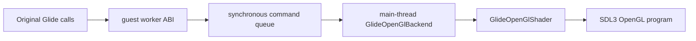

## Glide GLSL renderer boundary

`GlideLogicalState` preserves original Glide enums and initial raster state without platform dependencies. `GlideOpenGlBackend` owns the main-thread SDL3 window/OpenGL context and state translation, while the separate `GlideOpenGlShader` owns shader entry-point resolution, compilation/linking, the program, and combine uniforms. A synchronous backend queue executes guest-worker calls on the main thread.

The backend maps Glide comparison values `0..7` to OpenGL `GL_NEVER..GL_ALWAYS`. `grDepthBufferMode` owns depth-test enablement, while `grDepthBufferFunction` selects only the comparison. After the guest return address and catalog signature have both been validated, any specialized-handler failure uses a common decline path that supplies a conservative return and performs normal stdcall EIP/ESP cleanup. Invalid return addresses and signature mismatches remain hard rejects because their ABI is not trustworthy.

The platform-neutral `GlideImplementationIssueTracker` classifies unimplemented functions, unsupported arguments, backend failures, and ABI rejects while coalescing repeat counts by function/argument combination. Unimplemented and unsupported calls print immediate `[repiu-fatal]` lines and final `critical/FATAL` records, but verified stdcall ABIs still clean up normally and continue. It retains at most 128 unique records plus the first eight arguments, with separate per-category totals and overflow accounting.

Window-scale and ordinary resize events update the viewport and full-window scissor to the drawable pixel size. LFB readback samples the complete enlarged framebuffer and nearest-neighbor downsamples it to the logical dimensions, preserving the original guest-visible LFB size and row ordering.

The SDL window title combines the CMake-validated `REPIU_VERSION` from the root `VERSION` file, the backend compilation date from `__DATE__`, the active `ExecutionBackend` name, and measured FPS. Execution orchestration passes the platform-neutral backend enum to `GlideOpenGlBackend`, which measures successful guest buffer swaps over roughly one-second monotonic-time periods. Title creation and updates both run on the executor main thread that owns the SDL window. `VERSION` is a configure dependency, so changing it automatically regenerates the build system.

Both `SDL_EVENT_QUIT` and `SDL_EVENT_WINDOW_CLOSE_REQUESTED` record a host exit request. The executor polling loop detects the request, stops the guest worker through the same context-recovery procedure used by timeout teardown, and then cleans up SDL/OpenGL and the translation worker on the main thread. The event handler never exits the process or destroys resources directly.

Glide gate live telemetry version 5 publishes ordinal, ESP, EBX/ECX/EDX, and eight stack dwords. This diagnostic boundary preserves caller evidence when an unimplemented gate terminates the child. Screen width/height return integer values in EAX as proven by the original caller; documented API type assumptions never override binary call-site evidence.

Glide2 state save/restore uses a fixed 312-byte platform-neutral image. Shared HLE code owns deterministic little-endian serialization and validation; guest ABI code only performs range-checked transfer and stdcall return. The image contains no host pointer. Unknown bytes are zero, and unencoded logical fields are preserved during the currently observed immediate opaque round-trip. Renderer backend replay is required before supporting Get/Set pairs with intervening state mutations.

Observed dither mode 2 is stored in `GlideLogicalState`, serialized in state-image version 2, and delegated to host `GL_DITHER`. This is a compatibility stage, not a pixel-fidelity claim. A future replaceable shader policy may implement verified Voodoo ordered dithering without changing guest ABI integration.

### 원근 텍스처와 table fog 계약 (Task 359)

PIU의 확인된 60-byte `GrVertex` producer에서 dword 8은 공용 `oow`, dword 9/10은
TMU0 `sow/tow`입니다. boundary는 이 값을 `GlideDrawVertex`에 분리해 전달하고,
backend는 `sow/tow`만 Glide coordinate extent로 정규화합니다. vertex shader가
분자와 공용 `oow`를 선형 보간한 뒤 fragment shader가 UV를 `oow`로 나누므로,
직교 host projection을 유지하면서 원본 Glide의 perspective correction을 보존합니다.
dword 11..14는 PIU 표본에서 아직 유효한 per-TMU reciprocal-w로 확인되지 않았으므로
projected-texture 증거가 생기기 전에는 사용하지 않습니다.

`GlideLogicalState`는 `grFogTable`의 64바이트를 즉시 복사하며, 플랫폼 공용
`glide_fog`가 공식 `W(i)` knot와 선형 보간을 정의합니다. Win32 shader는 관측된
`GR_FOG_DISABLE`과 `GR_FOG_WITH_TABLE`만 지원하고, fog color와 table을 uniform으로
소유합니다. LFB 표시는 같은 shader의 전용 blit mode로 geometry combine/fog를
bypass하고 depth, blend, cull, alpha test, scissor, color mask, draw buffer, texture
binding을 일시 격리합니다.

### Perspective texture and table-fog contract (Task 359)

In PIU's confirmed 60-byte `GrVertex` producer, dword 8 is shared `oow` and
dwords 9/10 are TMU0 `sow/tow`. The boundary carries them separately in
`GlideDrawVertex`, and the backend normalizes only `sow/tow` by the Glide
coordinate extent. The vertex shader linearly interpolates the numerators and
shared `oow`; the fragment shader divides UV by `oow`, preserving Glide
perspective correction under the host's orthographic projection. Dwords 11--14
remain unused until producer evidence confirms a projected-texture layout.

`GlideLogicalState` immediately copies the 64 bytes passed to `grFogTable`, and
platform-neutral `glide_fog` defines the documented `W(i)` knots and linear
interpolation. The Win32 shader supports the observed `GR_FOG_DISABLE` and
`GR_FOG_WITH_TABLE` modes and owns fog color/table uniforms. LFB presentation
uses a dedicated shader blit mode that bypasses geometry combine/fog while
temporarily isolating depth, blend, cull, alpha test, scissor, color mask, draw
buffer, and texture binding.

### 선 primitive와 cull 변환 (Task 374)

플랫폼 공용 `glide_vertex`가 관측된 60바이트 producer image를
`GlideDrawVertex`로 decode합니다. Win32 boundary는 guest 범위를 검증하고 로컬 image로
복사한 뒤 decoder를 호출합니다. `grDrawLine`과 `grDrawTriangle`은 backend의 같은
primitive 제출 경로를 사용하므로 색, texture extent, perspective, fog 입력이 같습니다.
line은 `GL_LINES`와 폭 1로 제출합니다.

`TranslateGlideOpenGlCullMode`는 Glide mode와 window origin을 함께 받아 OpenGL
front/back face로 변환합니다. lower-left에서 negative/positive는 back/front이고,
upper-left에서는 반대입니다. mode 0은 face culling을 끕니다.

### Line primitives and cull translation (Task 374)

Platform-neutral `glide_vertex` decodes the observed 60-byte producer image into
`GlideDrawVertex`. The Win32 boundary validates and copies guest memory before
decoding. `grDrawLine` and `grDrawTriangle` share backend primitive submission,
so color, texture extent, perspective, and fog inputs stay identical; lines use
one-pixel `GL_LINES`.

`TranslateGlideOpenGlCullMode` combines the Glide mode with the window origin.
Lower-left negative/positive map to OpenGL back/front, upper-left reverses the
mapping, and mode zero disables face culling.

`_GRTEXTEXTUREMEMREQUIRED@8`는 guest `GrTexInfo`를 읽는 플랫폼 공용 계산으로 모델링하며 검증된 8-byte 정렬 texture 크기를 EAX로 반환합니다. 관측된 texture download/source/sampler/combine 호출은 OpenGL texture cache와 GLSL sampler/combine으로 연결됩니다. 미관측 포맷과 projected-texture layout은 검증 증거 없이 지원으로 확장하지 않습니다.

`_GRTEXTEXTUREMEMREQUIRED@8` is modeled as a platform-neutral calculation over
guest `GrTexInfo`, returning a validated eight-byte-aligned texture size in
EAX. Observed texture download/source/sampler/combine calls feed the OpenGL
texture cache and GLSL sampler/combine path. Unobserved formats and the
projected-texture layout are not claimed without validation evidence.

## Win32 로더 앱 배치

현재 실제 Win32 로더 executable target은 `repiu_loader_win32`이다.

진입점은 `src/host/win32/main.cpp`에 두며, `src/tools/` 아래의 분석 도구와 구분한다.

이 진입점은 현재 target profile 선택, 원본 executable 읽기, DOS/4GW load result 생성, relocated runtime image plan 생성, relocated image buffer 생성, Win32 process memory 배치, minimal execution trampoline 호출을 순서대로 담당한다.

`src/tools/exe_analyzer/`는 계속 비실행 분석 도구로 남긴다.

## Win32 Loader App Layout

The current practical Win32 loader executable target is `repiu_loader_win32`.

Its entry point lives in `src/host/win32/main.cpp`, separate from analysis tools under `src/tools/`.

This entry point currently owns target profile selection, original executable reading, DOS/4GW load result creation, relocated runtime image planning, relocated image buffer creation, Win32 process-memory placement, and minimal execution trampoline invocation.

`src/tools/exe_analyzer/` remains a non-executing analysis tool.

## Win32 execution_trampoline 분해 / Win32 execution_trampoline decomposition

`src/platform/win32/execution_trampoline.cpp`는 한때 12,117줄 단일 파일이었으나, Task 233(Phase 1)에서 동작 보존 리팩토링으로 서브시스템별 모듈로 분해했다(약 3,200줄로 축소). 트램폴린에는 VEH 디스패치 코어, 실행 드라이버(`RunWin32ExecutionThread`/`AttemptWin32*`), 여러 모듈이 공유하는 substrate만 남겼다. 모듈들은 `src/platform/win32/` 아래 서브디렉토리로 그룹화되며, 짧은 이름 include는 CMake include 경로로 해석된다.

Originally a single 12,117-line file, `execution_trampoline.cpp` was decomposed in Task 233 (Phase 1) via behavior-preserving refactoring into per-subsystem modules (down to ~3,200 lines). The trampoline retains only the VEH dispatch core, the execution driver, and the substrate shared across modules. Modules are grouped into subdirectories under `src/platform/win32/`; short-name includes resolve via CMake include directories.

| 디렉토리 / directory | 모듈 / module | 책임 / responsibility |
|---|---|---|
| `execution/` | `execution_trampoline.cpp`, `thread_context.h`, `execution_internal.h`, `win32_thread_api.h` | VEH 디스패치·실행 드라이버·공유 상태(ThreadContext)·경계 선언·kernel32 스레드 API |
| `exception/` | `exception_rescue_win32` | VEH 엔트리, `ExceptionDispatchScope`, 복구 전역 |
| `io/` | `port_io_emulator` | IN/OUT 포트 I/O 트랩 |
| `dos/` | `dos_int21_services`, `dpmi_mscdex_services` | DOS INT 21h/2Fh, DPMI INT 31h, 마우스 INT 33h, MSCDEX |
| `cpu_emul/` | `instruction_emulation`, `guest_memory_access` | 레지스터/플래그/디코드·세그먼트·traced 메모리·REP 명령 에뮬, 게스트/섀도 메모리 접근 |
| `aot/` | `aot_runtime_dispatch` | AOT 번역 워커·전이/재진입 디스패치·코드쓰기 watch |
| `boundary/` | `linexe_glide_boundary` | linexe far-transfer·Glide 게이트·allocator 제어흐름 |
| `telemetry/` | `live_telemetry_snapshot` | 라이브 텔레메트리 매핑·실행 스냅샷 |

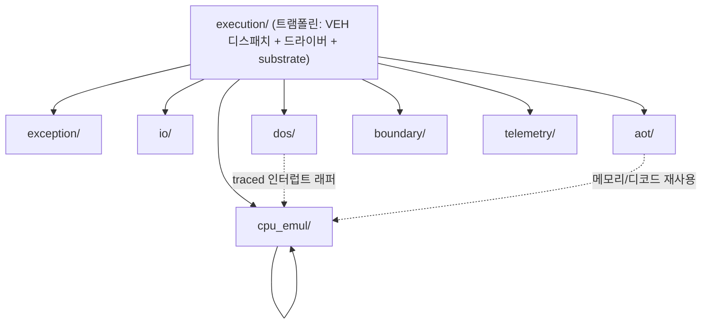

크로스-TU 경계 함수(예: `WriteGuestBytes`, `IsAotCacheAddress`, `RecordHandledDosInterrupt`, `ResolveSegmentLinearRange`)는 익명 네임스페이스 밖으로 승격해 외부 링크로 만들고 `execution_internal.h`에 선언한다. Phase 2(중립 `GuestCpuFrame` seam)·3(서비스 의미론의 플랫폼 중립화)은 두 번째 플랫폼 백엔드가 필요해질 때 착수한다.

Cross-TU boundary functions (e.g., `WriteGuestBytes`, `IsAotCacheAddress`, `RecordHandledDosInterrupt`, `ResolveSegmentLinearRange`) are promoted out of the anonymous namespace to external linkage and declared in `execution_internal.h`. Phase 2 (a neutral `GuestCpuFrame` seam) and Phase 3 (making service semantics platform-neutral) are deferred until a second platform backend is needed.

## Win32 Loader Log Level Policy

Win32 loader logs use levels to separate normal progress from the current implementation blocker.

The loader log pattern is `[%X.%e] [%8l] [%n] %v`.
This prints millisecond timestamps, fixed-width level names, logger name, and message text.

`info` is used for normal loader progress, selected runtime addresses, successful placement, handled HLE/DOS/segment counts, and normal guest output.

`warn` is used for expected host-environment constraints that the loader can work around, such as fixed low-address range probe or reservation failure followed by relocated execution.

`error` is used for loader-stage failures and for the current original-code execution blocker. When original entry execution stops with a caught SEH exception, the exception registers, relocated byte window, unknown instruction classification, and current blocker message are printed as `error` while preserving the existing observation-oriented process exit behavior.
# DOS4GW object selector allocation / DOS4GW object selector 할당

PIU의 외부 DOS4GW `LINEXE.EXP` loader는 LE object마다 DPMI descriptor를 동적으로 하나씩 할당하고 base, limit, access rights를 설정한다. Runtime image materialization은 이 순서를 `SelectorAllocator`로 모델링하고, 할당 결과를 16:16 far-pointer fixup 및 실행 `SelectorTable`에 동일하게 사용한다. PIU 프로필의 첫 object selector `0x1C`는 관찰된 object 2=`0x24`, object 3=`0x2C`에서 역산한 초기 DPMI 상태이며 LE object 번호의 고정 공식이 아니다.

The external DOS4GW `LINEXE.EXP` loader dynamically allocates one DPMI descriptor per LE object, then sets its base, limit, and access rights. Runtime image materialization models this order with `SelectorAllocator` and uses each allocation result for both 16:16 far-pointer fixups and the execution `SelectorTable`. The PIU profile's first object selector, `0x1C`, is inferred from the observed object 2=`0x24` and object 3=`0x2C` values; it is initial DPMI state, not a fixed formula derived from the object index.

## Live execution telemetry / 실시간 실행 telemetry

Single-step PIU 실행은 guest/host 공유 atomic heartbeat를 사용한다. host poll은 시작 시점과 1초 간격으로 stderr snapshot을 출력할 수 있다. quiet timeout은 poll iteration 수가 아니라 1초의 wall-clock 정체로 판단한다. quiet timeout과 wall-clock 예산은 같은 스위치를 공유한다 — 예산이 무제한(`REPIU_EXECUTION_TIMEOUT_MS=0`, Task 435부터 기본값)이면 두 판정 모두 꺼지고 게스트는 창을 닫을 때까지 계속 실행된다. timeout observation은 guest thread를 종료하고 join한 뒤 복사하여 guest가 수정 중인 비원자 container와의 data race를 방지한다.

Single-step PIU execution uses atomic heartbeat state shared by the guest and host. The host poll can emit stderr snapshots at startup and once per second. Quiet timeout is based on one second of wall-clock inactivity rather than poll iteration count. The quiet timeout and the wall-clock budget share one switch: an unlimited budget (`REPIU_EXECUTION_TIMEOUT_MS=0`, the default since Task 435) disables both, and the guest keeps running until the window is closed. Timeout observations are copied only after terminating and joining the guest, preventing races with non-atomic containers still being modified by the guest.

Child 내부 telemetry를 회수할 수 없는 경우 `repiu_supervisor_win32`가 named shared memory를 생성하고 mapping 이름을 환경 변수로 전달한다. loader의 host/guest는 고정 버전 POD에 interlocked write하고 supervisor는 child 출력과 독립적으로 snapshot을 읽고 deadline에 child를 terminate/join한다.

When child-local telemetry cannot be recovered, `repiu_supervisor_win32` creates named shared memory and passes its mapping name through the environment. Loader host/guest paths use interlocked writes into a versioned POD, while the supervisor reads snapshots independently of child output and terminates/joins the child at a deadline.

## Contiguous allocator arena / 연속 allocator arena

PIU 프로필은 LE image reserve 뒤에 16 MiB의 실제 contiguous expansion을 둔다. 현재 Win32 placement는 전체 `0x015D7000` 범위를 reserve/commit하여 원본 guest load/store가 arena 확장 객체를 직접 접근하게 한다. shadow memory는 실제 arena 밖의 진단 안전망이며 정상 allocator backing을 대신하지 않는다.

The PIU profile provides 16 MiB of real contiguous expansion after the LE image reserve. Current Win32 placement reserves and commits the full `0x015D7000` range so original guest loads/stores directly access expanded allocator objects. Shadow memory remains a diagnostic safety net outside the real arena and does not replace normal allocator backing.

## Shadow segment synchronization / Shadow segment 동기화

Single-step HLE가 처리한 segment load는 `ThreadContext` shadow selector를 변경한다. 원본 코드가 stack으로 selector를 복원하는 관찰된 32비트 `POP DS`도 HLE가 `[ESP]`의 selector를 읽고 shadow DS 및 ESP/EIP를 함께 갱신한다. access-violation HLE 뒤에도 후속 segment 복원을 관찰할 수 있도록 single-step 모드에서는 guest exception dispatch가 TF를 보존한다.

Segment loads handled by single-step HLE update the shadow selector in `ThreadContext`. For the observed 32-bit POP DS restoration, HLE reads the selector from `[ESP]` and updates shadow DS, ESP, and EIP together. Guest exception dispatch preserves TF in single-step mode so later segment restoration remains observable after access-violation HLE.

연속된 지원 segment load는 한 single-step dispatch에서 함께 처리하여 첫 명령을 건너뛴 뒤 두 번째 명령이 shadow 갱신 없이 native 실행되는 것을 막는다. 관찰된 EAX=0/DF=0 `REP STOSD`는 전체 destination span이 guest arena 안일 때 일괄 zero-fill한다.

Adjacent supported segment loads are consumed in one single-step dispatch so the second instruction cannot execute natively without a shadow update after the first is skipped. The observed EAX-zero/DF-clear REP STOSD is batched only when its entire destination span lies inside the guest arena.

관찰된 register-direct `MOV r16,Sreg`는 Win32 실제 segment selector가 guest로 누출되지 않도록 shadow selector를 목적 register 하위 16비트에 기록한다.

Observed register-direct MOV r16,Sreg instructions write the shadow selector into the destination register's low 16 bits so native Win32 segment selectors cannot leak into guest state.

Descriptor-backed segment byte reads translate selector+offset through `SelectorTable`, use DOS low-memory backing below 64 KiB, and otherwise read only validated guest arena memory. Observed ES-prefixed byte MOV and CMP forms use shadow registers and x86 byte arithmetic flags.

## 원본 fatal tail 실행 / Original fatal-tail execution

guest breakpoint는 기본적으로 중단한다. 단, 원본 image 내부에서 `CC 52 E8 rel32 F4` fatal-tail signature가 확인되면 breakpoint 주소와 `EDX` ASCIZ message를 기록한 뒤 원본 `push edx; call error-printer`로 재개한다. 이 경로에서 관찰된 DOS `AH=09h`, low-memory register-frame `REP MOVS`, 제한된 DPMI `AX=0300h/BL=2Fh`를 HLE하고, 원본 DOS terminate를 우선한다.

Guest breakpoints stop by default. Only a confirmed `CC 52 E8 rel32 F4` fatal-tail signature inside the original image records the breakpoint and bounded `EDX` ASCIZ message, then resumes the original `push edx; call error-printer`. The observed DOS `AH=09h`, low-memory register-frame `REP MOVS`, and narrowly scoped DPMI `AX=0300h/BL=2Fh` path are handled while preserving the original DOS termination path.

## Win32 VEH and host recovery boundary

The guest worker owns one process-global active VEH context because guest execution is serialized per loader process. The parent removes the VEH only after joining the worker. Guest-stack recovery records the entry-time segment selectors and clears TF/DF; reliable DS/FS restoration before returning to compiler-generated C++ remains the current recovery frontier.

Host recovery now saves entry-time selectors in serialized global recovery slots and reads them with a `CS:` override before returning to C++. Residual single-step exceptions at host addresses clear TF and continue without nested guest recovery. The executor main thread creates, services, and destroys SDL3/OpenGL resources; the guest worker blocks on synchronous rendering commands. The parent removes the VEH after joining the worker. DOS stdout and stderr are accumulated separately and emitted through an executable-name spdlog logger at info and error levels.

DOS file diagnostics include a bounded 64-entry read/seek ring. It preserves chronological handle, path, position, size, result, guest EIP/ESP, eight stack dwords, and bounded read-prefix evidence without changing guest-visible file behavior. The protected-mode DOS/4GW `INT 21h AH=3Fh` bridge consumes the 32-bit byte count in `ECX` and returns the 32-bit byte count in `EAX`; reducing these values to real-mode `CX/AX` breaks large Watcom reads.

Win32 native execution uses a fail-closed function return fast path implemented by `native_fast_path.*` and `verified_region_analyzer.*`. Pinned Zydis v4.1.1 decodes observed direct-call targets in legacy 32-bit mode; rePIU recursively verifies runtime-bounded direct control flow and rejects privileged, interrupt, I/O, system, segment-dependent, indirect, far, or undecodable paths. An approved function runs with Trap Flag cleared until an x86 hardware execution breakpoint at its validated guest return address reenters VEH. Any intermediate exception restores debug registers and single-step state and permanently rejects that function for the current run.

Task 275의 `native_linear_span.*`은 함수 진입으로 증명되지 않은 일반 single-step
지점의 coverage를 보완합니다. Zydis가 다음 민감 명령, 제어 전이, 명시적 memory write를
경계로 찾고 그 앞에 일반 명령이 두 개 이상이면 Dr0 실행 breakpoint를 경계에 설치한 뒤
TF를 끕니다. 경계 #DB는 debug register와 TF를 복원하고 기존 single-step/HLE chain에
경계 명령을 넘깁니다. memory write는 span 밖에서 실행되며 scan 결과를 cache하지 않아
self-modifying code 뒤의 stale decode를 재사용하지 않습니다. 예상하지 않은 exception도
같은 fail-closed 복원 경로를 사용합니다.

Task 288 Stage 1은 이 기본 동작을 유지하면서 `REPIU_NATIVE_LINEAR_SPAN_CACHE=1`일 때만
entry EIP별 스캔 결과를 실험적으로 캐시합니다. 캐시 가능한 항목은 같은 4 KiB 페이지
안에서 끝나고, 그 페이지가 write-watch로 보호되며 active AOT generation을 가진 경우로
제한됩니다. 키에 page generation을 포함하므로 새 generation 발행 뒤에는 stale 항목을
지우고 재스캔합니다. retired, quarantined, 미추적, cross-page 항목은 항상 재스캔합니다.
60초 supervisor/direct 예비 A/B에서 hit가 0이었으므로 이 캐시는 기본 OFF이며, 기존
`dynamic` span 기본 정책에는 영향을 주지 않습니다.

Task 288 Stage 2는 `REPIU_NATIVE_LINEAR_SPAN_WRITES=1`에서만 memory-write 통과를
실험합니다. 스캐너가 지나는 모든 코드 page가 write-watch로 덮여야 하며, entry 자체의
write, 같은 span에서 base/index register가 먼저 바뀐 write, guest runtime 밖 또는
read-only/uncommitted target은 기존 경계로 남깁니다. target page 보호 결과는 process
수명 동안 캐시하고 write-watch page는 동기 fault로 기존 coherence 경로에 되돌립니다.
예상 write fault는 일반 cancel과 별도 집계합니다. 240초 direct pilot에서 draw/swap이
약 20% 감소했으므로 이 기능도 기본 OFF입니다.

Task 288 Stage 3은 `REPIU_NATIVE_LINEAR_SPAN_JUMPS=1`에서만 in-range 전방 near direct
`jmp rel`의 target으로 스캔을 이어갑니다. HLE boundary 또는 quarantined page target,
indirect/far jump와 역방향 jump는 기존 경계로 남습니다. 60초 A/B에서 forward chain은
0회, backward stop은 703회였으므로 기본 OFF이며 conditional-branch Dr1 확장도 진행하지
않습니다.

Task 287의 반복 A/B 뒤 `dynamic`는 환경 변수 미지정 시 이 span을 기본 활성화합니다.
다른 backend의 기본값은 계속 OFF입니다. `REPIU_NATIVE_LINEAR_SPAN=1|on|true`는
backend와 무관하게 ON, `0|off|false`는 OFF이며 알 수 없는 값도 fail-closed OFF입니다.
프로그램 전체의 기본 실행 backend는 이 정책으로 바뀌지 않습니다.

The Task 275 `native_linear_span.*` path extends coverage from ordinary single-step
sites that cannot enter a verified function. Zydis finds the next sensitive instruction,
control transfer, or explicit memory write; when at least two ordinary instructions precede
it, Dr0 guards that boundary while TF is clear. The boundary #DB restores debug state and
TF, then passes the boundary instruction to the existing single-step/HLE chain. Memory
writes stay outside spans and results are not cached, preventing stale decoded spans after
self-modification. Unexpected exceptions use the same fail-closed restoration.

Task 288 Stage 1 adds an experimental per-entry scan cache only when
`REPIU_NATIVE_LINEAR_SPAN_CACHE=1`. A result is cacheable only when its boundary remains on
the same 4 KiB page and that page is both write-watched and backed by an active AOT
generation. The page generation is part of the key, so generation replacement discards a
stale entry and rescans. Retired, quarantined, untracked, and cross-page results always
rescan. The cache remains default off because 60-second supervisor and direct-loader pilot
runs observed zero hits; the existing `dynamic` span default is unchanged.

Task 288 Stage 2 experimentally crosses memory writes only under
`REPIU_NATIVE_LINEAR_SPAN_WRITES=1`. Every traversed code page must be write-watched. A write
at the entry, a write whose base/index register changed earlier in the span, or a target
outside guest runtime or on a read-only/uncommitted non-watched page remains at the old
boundary. Target-page protection results are cached for the process lifetime; a write to a
watched page faults synchronously back into the existing coherence path. Expected write
faults are counted separately from ordinary cancellation. This feature also remains default
off because a 240-second direct pilot reduced draw/swap by about 20%.

Task 288 Stage 3 chains an in-range forward near direct `jmp rel` only under
`REPIU_NATIVE_LINEAR_SPAN_JUMPS=1`. Targets that are HLE boundaries or quarantined pages,
indirect/far jumps, and backward jumps retain the old boundary. A 60-second A/B observed
zero forward chains and 703 backward stops, so the feature remains default off and the
conditional-branch Dr1 extension is not pursued.

After Task 287's repeated A/B, `dynamic` enables spans by default when the environment is
unset; other backends remain off by default. `REPIU_NATIVE_LINEAR_SPAN=1|on|true` enables
the path for any backend, `0|off|false` disables it, and unknown values fail closed to
disabled. This policy does not change the program-wide default execution backend.
## Reentrancy-safe guest bulk copy

Win32 VEH instruction handling must not directly dereference a guest range when the access can recursively enter the handler. `REP MOVS` reads through a temporary buffer with `ReadProcessMemory` and writes through the guest-write helper, which temporarily applies writable page protection and restores it afterward.


## Host exceptions in the guest VEH

The Win32 guest VEH owns exceptions only when they belong to guest execution or an explicit HLE boundary. Host `DBG_PRINTEXCEPTION_C/W` events are consumed without guest recovery, while the Visual C++ thread-name exception is passed onward. Optional supervisor `debug-exceptions` mode observes first-chance events externally and preserves worker VEH ownership.

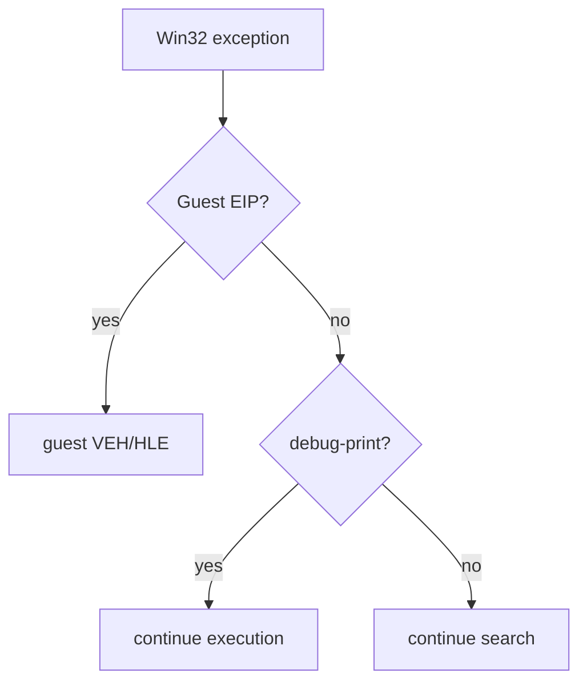
## Supervisor-owned execution deadline

Supervised Win32 execution disables the loader's wall-clock and quiet timeouts with `REPIU_EXECUTION_TIMEOUT_MS=0`. The supervisor owns the deadline and terminates the complete child process, preventing `TerminateThread` from racing active VEH or host-call state.

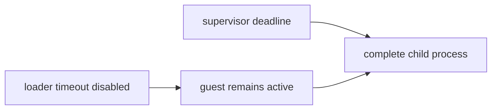
## Synchronous system timer tick HLE / 동기식 시스템 타이머 틱 HLE

BDA 선형 주소 `0x46C`의 BIOS tick과 프로그래밍 가능한 IRQ0 주기는 분리합니다.
플랫폼 공용 `hle::PitChannel0`은 포트 `0x43`/`0x40`의 채널 0 제어어와 reload
바이트를 보존하고, 원자적 generation/divisor snapshot을 게시합니다.
`PollThreadUntilExit`의 `hle::PitIrqSchedule`은 단조 증가 시계와
`1,193,280 / divisor` 비율로 IRQ0 만료를 계산합니다. `PIU.EXE`가 기록하는
divisor `4,972`는 정확히 `240Hz`입니다. BDA tick은 기본 divisor `65,536`으로
별도 계산합니다.

The BIOS tick at BDA linear address `0x46C` is separate from programmable
IRQ0 cadence. Platform-neutral `hle::PitChannel0` preserves channel-0 control
and reload bytes written to ports `0x43`/`0x40`, publishing an atomic
generation/divisor snapshot. `hle::PitIrqSchedule` in `PollThreadUntilExit`
derives expirations from monotonic time and `1,193,280 / divisor`. The
`PIU.EXE` divisor `4,972` is exactly `240Hz`; BDA time remains separately
derived from default divisor `65,536`.

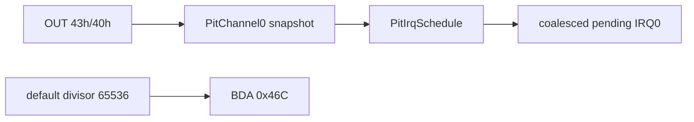
## MAME CHD asset mount

PIU ROM-set target은 asset container 해석과 guest 실행을 분리합니다. `TargetProfile::rom_set_id`가 게임 ID 분기 없이 공용 ZIP/CHD mount를 선택합니다. 공용 ISO9660 reader는 루트 자기 참조 레코드에서 signed extent-LBA bias를 찾아 single-session과 multisession data track을 같은 경로로 처리합니다. data track 밖의 audio extent는 file cache에서 제외하고 MSCDEX/CD-DA가 담당합니다. 원본 ROM/CHD는 읽기 전용이며 Git 밖에 유지합니다.

PIU ROM-set targets separate asset-container decoding from guest execution. `TargetProfile::rom_set_id` selects the shared ZIP/CHD mount without title-ID branching. Pinned libchdr exposes raw CHD CD frames, and the project-owned ISO9660 reader discovers a signed extent-LBA bias from the root self-record so single-session and multisession data tracks share one path. External audio extents are skipped by the file cache and remain available through MSCDEX/CD-DA. A deterministic build cache supplies the existing filesystem-based DOS VFS; original ROM/CHD files remain read-only and outside Git.

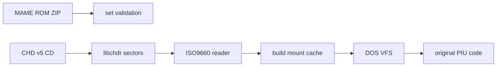
# MSCDEX CHD CD audio

`pumpit1` CHD는 ISO9660 mount source와 가상 MSCDEX disc를 동시에 제공합니다. `media::ChdCdImage`가 CHT2/CHTR track 및 raw sector를 담당하고, execution trampoline이 원본 `INT 2Fh AX=1500h/1510h` request를 해석하며, 호환 이름을 유지한 `CdAudioWaveOut` 내부의 SDL3 audio stream이 CD-DA PCM 출력만 담당합니다. Glide gate 관찰은 ordinal별 count와 최초 인자를 누적합니다.

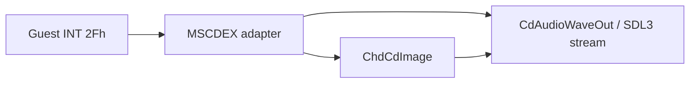

A PIU target CHD is both the ISO9660 mount source and a virtual MSCDEX disc. `media::ChdCdImage` owns track metadata and raw sectors, the execution trampoline adapts original `AX=1500h/1510h` requests, and the SDL3 audio stream inside the compatibility-named `CdAudioWaveOut` owns only CD-DA PCM output. Glide observation accumulates counts and first arguments per ordinal.
# PIU10 YMZ280B board sound

CD-DA가 배경 음악을 담당하는 것과 별개로, 코인·메뉴 효과음은 PIU10 ISA 보드의 Yamaha YMZ280B가 `roms/pumpit1.zip`의 `piu10.u9` 샘플 ROM에서 재생합니다. 책임은 네 계층으로 분리되어 있습니다. `assets::ExtractRomZipEntry`가 ZIP 엔트리를 CRC 검증과 함께 추출하고, `sound::LoadPiu10SampleRom`이 4 MiB `0xFF` 주소 공간에 배치하며, 플랫폼 공용 `sound::Ymz280bDevice`가 레지스터 파일·8보이스·ADPCM 디코드·믹싱을 88200 Hz 스테레오로 수행하고, Win32 backend `Ymz280bAudioOut`이 워커 스레드와 뮤텍스로 SDL3 stream에 밀어 넣습니다. 게스트 ABI 연결은 `piu10_sound_port`가 담당하며 ISA 16비트 버스의 바이트 레인 규칙에 따라 `0x02A0`을 칩 오프셋 0, `0x02A2`를 오프셋 1로 디코드합니다. 사운드 창은 JAMMA 입력 범위 안에 있으므로 `HandlePortIoInstruction`에서 입력 분기보다 먼저 처리하며, 레지스터 쓰기는 NOP 패치 없이 EIP만 전진시켜 매번 재트랩합니다.

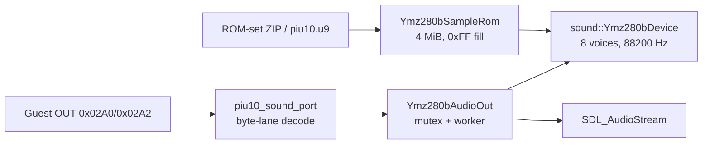

Separately from CD-DA background music, coin and menu effects are played by the Yamaha YMZ280B on the PIU10 ISA board from the `piu10.u9` sample ROM inside the target ROM-set ZIP. Responsibilities are split across four layers: `assets::ExtractRomZipEntry` extracts the ZIP entry with CRC verification, `sound::LoadPiu10SampleRom` places it in a 4 MiB `0xFF`-filled address space, the platform-neutral `sound::Ymz280bDevice` owns the register file, eight voices, ADPCM decode, and mixing at 88200 Hz stereo, and the Win32 backend `Ymz280bAudioOut` pushes generated PCM into an SDL3 stream from a worker thread under a mutex. `piu10_sound_port` provides the guest ABI glue, decoding `0x02A0` as chip offset 0 and `0x02A2` as offset 1 per the ISA 16-bit byte-lane rule. Because the sound window lies inside the JAMMA input range, `HandlePortIoInstruction` handles it before the input branch, and register writes advance EIP and re-trap rather than being NOP-patched.
# AOT translation planning prototype

`runtime::BuildAotTranslationPlan`은 relocated DOS/4GW LE image의 entry/direct edge에서 reachable CFG를 Zydis로 복원하고 copy, direct relocation, HLE boundary, return, indirect exit를 분류합니다. 이 단계는 실행 경로를 바꾸지 않으며 `repiu_aot_probe`가 coverage와 planning time을 측정합니다.

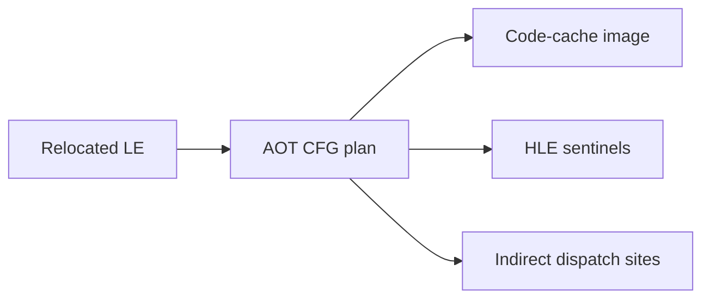

`runtime::BuildAotTranslationPlan` recovers a reachable Zydis CFG from relocated DOS/4GW LE images and classifies copy operations, direct relocations, HLE boundaries, returns, and indirect exits. It does not alter execution yet; `repiu_aot_probe` measures coverage and planning time.

plan builder는 선택적 자기 계측을 가집니다(Task 330). `AotPlanBuildProfile` 포인터를
받으면 decode, record 생성, 분류, walk, sweep 단계를 공용 `runtime::ReadCycleCounter`로
귀속하고, `nullptr`이면 timestamp를 전혀 읽지 않습니다. 플랫폼 계층은 이 POD를 누적만
하므로 공용 파일에 Win32 헤더가 들어가지 않습니다. `repiu_aot_probe`의
`plan_build_bench_*` 그룹은 같은 코드를 Debug와 Release로 측정해 **빌드 구성 왜곡을
분리**합니다. 이 구분이 필요한 이유는 두 구성에서 단계 순위가 뒤집히기 때문입니다.

The plan builder carries optional self-attribution (Task 330): given an `AotPlanBuildProfile` it
attributes decode, record build, classify, walk, and sweep through the neutral
`runtime::ReadCycleCounter`, and reads no timestamp when the pointer is null. The platform layer
only accumulates that POD, so no Win32 header enters platform-neutral code. The probe's
`plan_build_bench_*` group measures the same code in Debug and Release to separate build
configuration distortion, which matters because the stage ranking inverts between them.

## AOT code-cache emission

`runtime::BuildAotCodeCacheImage`는 instruction-level plan에서 플랫폼 공용 비실행
byte image를 만듭니다. 일반 명령과 return을 보존하고 direct call/jump/Jcc를
`rel32`로 정규화하며, guest-address/cache-offset map으로 내부 edge를 해결합니다.
HLE 또는 간접 경계는 외부 sentinel fixup으로 남깁니다. basic-block 끝의 일반
copy 명령에는 명시적인 `rel32` fall-through를 추가하므로 cache layout이 guest의
선형 제어 흐름을 바꾸지 않습니다.

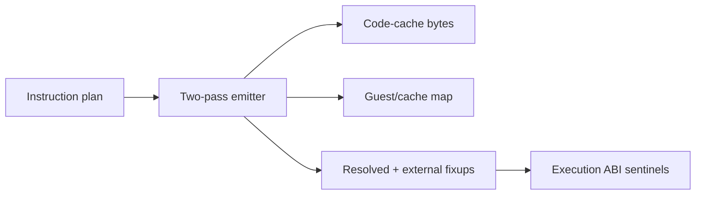

`runtime::BuildAotCodeCacheImage` consumes instruction-level plan records and
builds a platform-neutral, non-executable byte image. It preserves ordinary
instructions and returns, normalizes direct call/jump/Jcc edges to `rel32`,
resolves internal edges through a guest-address/cache-offset map, and leaves HLE
or indirect boundaries as external sentinel fixups. Explicit `rel32` fall-through
links preserve guest linear control flow independently of cache layout.

`platform::win32::PlaceWin32AotCodeCache`는 별도 Win32 cache allocation과
RW copy 후 RX 전환, instruction-cache flush, 양방향 guest/cache lookup을
담당합니다. Task 435부터 `dynamic`이 기본 backend이며, 정적 cache bridge와 live
arena에서 arbitrary-entry CFG를 덧붙이는 동적 번역을 함께 활성화합니다.
`REPIU_EXECUTION_BACKEND=legacy`는 회귀 대조군으로 남아 single-step 경로를
선택합니다. cache sentinel은 기존 VEH/HLE dispatcher로 복귀하며, 해결할 수 없는
target은 legacy single-step으로 fail-closed합니다.

The Win32 placement layer owns executable cache allocation, RW copy followed by
RX protection, instruction-cache flushing, and bidirectional guest/cache lookup.
Since Task 435 `dynamic` is the default backend, enabling both the static cache
bridge and the dynamic translation that appends an arbitrary-entry CFG from the
live arena; `REPIU_EXECUTION_BACKEND=legacy` remains as the regression control
and selects the single-step path. Cache sentinels return through the existing
VEH/HLE dispatcher, and unresolved targets fail closed to legacy single-step
execution.

## 실행 backend 명명 규칙 / Execution backend naming layers

세 이름이 자주 함께 나오지만 서로 다른 층을 가리킵니다. `dynamic` backend를
`REPIU_AOT_*` 노브로 조율하는 구조가 처음에는 어긋나 보이므로 여기서 정리합니다.

| 층위 | 이름 | 가리키는 것 |
|---|---|---|
| 실행 정책 | `legacy` / `dynamic` | 사용자가 `REPIU_EXECUTION_BACKEND`로 고르는 노브 |
| 하위 시스템 | `AOT` | 실행 전에 code cache를 계획·생성·배치하는 단계 |
| 번역 계층 | `DBT` | 그 cache 위에서 런타임에 동작하는 번역·dispatch |

`AOT`는 여전히 정확한 이름입니다. `dynamic` backend에서도 게스트 실행 **전에**
`BuildAotTranslationPlan` → `BuildAotCodeCacheImage` → `PlaceWin32AotCodeCache`가
수행되어 `Win32 AOT cache base/bytes/entry`를 남깁니다. backend 이름이 `dynamic`인
것은 실행 중에도 번역이 계속된다는 뜻이지, 정적 단계가 없다는 뜻이 아닙니다.

Task 425는 backend를 `legacy`와 `dynamic` 둘로 줄였습니다. 옛 이름 `aot`,
`aot-dynamic`, `aot-dbt`는 별칭이 아니라 거부이며, 지정하면 실행 전에 exit 1로
종료합니다.

The three names appear together often but denote different layers, and a `dynamic`
backend tuned through `REPIU_AOT_*` knobs reads as a contradiction until they are
separated: `legacy`/`dynamic` name the **execution policy** the user selects,
`AOT` names the **subsystem** that plans, builds, and places the code cache before
execution, and `DBT` names the **translation layer** operating on that cache at
runtime.

`AOT` remains accurate. Even under `dynamic`, `BuildAotTranslationPlan`,
`BuildAotCodeCacheImage`, and `PlaceWin32AotCodeCache` all complete **before** the
guest starts and log `Win32 AOT cache base/bytes/entry`. The backend being called
`dynamic` means translation continues during execution, not that the static stage
is absent.

Task 425 reduced the backends to `legacy` and `dynamic`. The old names `aot`,
`aot-dynamic`, and `aot-dbt` are rejected rather than aliased, exiting 1 before
execution.

동적 translation은 arena를 복사하지 않고 **직접 참조**합니다(Task 329).
`RelocatedRuntimeObject`는 소유 바이트(`memory`) 또는 외부 뷰(`external_bytes`) 중
하나를 담고 읽기 경로는 `RelocatedRuntimeObjectBytes` / `...ByteCount` 접근자를
통과하므로, 보이는 범위가 같아 plan은 이전 스냅샷 시절과 바이트 단위로 동일합니다.
외부 뷰의 안전성은 **동기 rendezvous로 guest가 차단되어 있다는 사실에 의존**하므로,
번역을 비동기로 바꾸려면 먼저 복사를 복원해야 합니다.

동적 translation, inline-cache patch, guest-page retirement는 guest가 VEH 경계에서
대기하는 동안 serialized host-stack worker가 수행합니다. AOT VEH는 native 실행
전에 near indirect `FF /2`, `FF /4`, `C3/C2`를 해석합니다. call은 guest
fallthrough를 push하고 return은 guest/cache target을 명시적으로 map하므로 native
return 주소와 guest return 주소를 추측으로 섞지 않습니다. segment-register
operand는 명시적인 HLE boundary입니다.

Dynamic translation references the arena directly instead of copying it (Task 329). A
`RelocatedRuntimeObject` carries either owned bytes or an external view, and read paths go
through the `RelocatedRuntimeObjectBytes`/`ByteCount` accessors, so the visible range is
unchanged and plans stay byte-for-byte identical to the snapshot era. The view's safety depends
on the guest being blocked by the synchronous rendezvous, so making translation asynchronous
must restore a copy first.

Dynamic translation, inline-cache patching, and guest-page retirement run on a
serialized host-stack worker while the guest waits at a VEH boundary. Before
native execution, the AOT VEH resolves near indirect `FF /2` calls, `FF /4`
jumps, and `C3/C2` returns. Calls push guest fallthrough addresses, returns map
guest or cache targets explicitly, and segment-register operands remain HLE
boundaries. The dispatcher never scans for a plausible return address.

## AOT-DBT 실행 정책 기반 / AOT-DBT execution-policy foundation

Task 276은 플랫폼 공용 `runtime::ExecutionBackend`에 실행 정책을 정의하고,
Task 425가 이를 `legacy`와 `dynamic` 둘로 정리했습니다. Win32 host, 실행 trampoline과
thread context가 같은 정책 값을 전달하므로 backend 문자열, 정적 cache 사용, 동적
append, DBT 전용 dispatch 기능을 한 곳에서 판정합니다. `dynamic`은 별도 실행기나 코드
복제가 아니라 기존 AOT planner/emitter/cache/worker/SMC/HLE를 공유하는 정책입니다.

backend가 둘뿐이므로 정적 cache 생성·동적 번역·HLE 직후 즉시 재진입은 모두 같은
조건이며, `ExecutionBackendUsesDynamicTranslation` 하나로 판정합니다.

첫 DBT increment는 cache sentinel의 HLE 명령이 완전히 emulate되어 EIP가 전진한 뒤,
기존 cache entry로 즉시 복귀할 수 있으면 다음 원본 명령의 TF single-step을 생략합니다.
Zydis preflight가 첫 control transfer 전의 등록된 HLE boundary, decode/read 실패와
64명령 상한을 거부합니다. 방금 처리한 명령이 segment register를 쓴 경우에도 selector
변경 뒤의 HLE 의미를 보존하기 위해 기존 TF bridge를 유지합니다. cache miss,
quarantine과 모든 검증 실패는 원본 single-step fallback으로 fail-closed합니다.

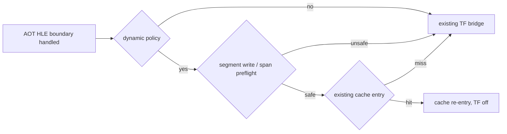

Task 276의 30초 graceful 관측에서는 즉시 복귀 `5,670/2,335`
시도/성공, fatal 0, DBT legacy fallback 0을 기록했습니다. 성공마다 TF 명령 하나를
제거하므로 같은 실행 내부 proxy는 약 1.8% 절감입니다. 초기화 시점 차이가 있는
단일 A/B의 원시 누적값은 wall-clock 향상으로 사용하지 않으며, 완전한 DBT의
return/indirect/cache-miss host dispatcher는 후속 범위입니다.

Task 289 Stage 1은 Task 264 segment-override guard의 live resolution을
`selector/base/limit/flags/policy`로 확장합니다. selector 0과 전체 linear range가 DOS
low-memory 안에 있는 descriptor는 cache site를 `INT3` HLE boundary로 유지하고, 정상
nonzero flat descriptor와 검증된 GS non-flat base-add descriptor만 guard 네이티브로
활성화합니다. segment load, DPMI descriptor 변경, DOS/LINEXE shadow selector 변경은
전체 fingerprint가 달라질 때 site를 재패치합니다. 60초 smoke에서 native/HLE site가
각각 누적 193,288/120,668, 실제 HLE exit 7,554, mismatch 0이었고 fatal/legacy fallback은
0이었습니다.

Task 289 Stage 2의 `REPIU_AOT_DBT_POST_HLE_TRANSLATE=1`은 생성 CFG 전체의 HLE record가
실제 `INT3` 또는 mismatch-to-`INT3` selector guard인지 검증한 뒤 post-HLE cache miss를
번역합니다. segment-write와 quarantine 장벽은 유지됩니다. 60초 A/B에서 번역 시도가
0회였으므로 기본 OFF입니다.

Task 276 defines the execution policy in the platform-neutral
`runtime::ExecutionBackend`, which Task 425 reduced to `legacy` and `dynamic`. The
Win32 host, trampoline, and thread context carry the same policy value, while
`dynamic` shares the existing planner, emitter, cache, worker, SMC coherency, and
HLE implementation rather than forking an executor. With only two backends,
building the static cache, translating dynamically, and re-entering immediately
after an HLE boundary are one condition, decided by
`ExecutionBackendUsesDynamicTranslation`.

The first DBT increment skips the next TF instruction only when a fully emulated
HLE boundary can re-enter an existing cache entry safely. Zydis preflight rejects
a registered HLE boundary before the first control transfer, decode/read failure,
or the 64-instruction cap. A just-emulated segment-register write also retains the
TF bridge. Cache misses, quarantine, and all validation failures fail closed to
the established original-code single-step path. A 30-second graceful observation
recorded 5,670/2,335 attempts/successes, zero fatal state, and zero DBT legacy
fallback; one skipped TF instruction per success is about 1.8% within-run proxy
reduction. Wall-clock improvement remains unconfirmed, and exception-free
return/indirect/cache-miss dispatch remains follow-up work.

Task 289 Stage 1 extends Task 264's live segment-override resolution to fingerprint
`selector/base/limit/flags/policy`. Selector zero and descriptors whose complete linear
range lies in DOS low memory keep an `INT3` HLE boundary; valid nonzero flat descriptors and
the proven GS non-flat base-add descriptor retain guarded-native execution. Segment loads,
DPMI descriptor changes, and DOS/LINEXE shadow-selector changes re-patch sites only when the
complete fingerprint changes. A 60-second smoke recorded cumulative native/HLE site counts
of 193,288/120,668, 7,554 actual HLE exits, zero mismatches, and zero fatal/legacy fallback.

Under `REPIU_AOT_DBT_POST_HLE_TRANSLATE=1`, Task 289 Stage 2 validates that every HLE record
in a complete generated CFG is an actual `INT3` or a selector guard whose mismatch reaches
`INT3`, then translates a post-HLE cache miss. Segment-write and quarantine barriers remain.
The feature stays default off because a 60-second A/B recorded zero translation attempts.

### AOT-DBT return miss host dispatch

Task 277은 `dynamic` return inline-cache miss tail만 `INT3` 대신 Win32 x86
host-stack thunk로 연결합니다. 플랫폼 공용 emitter는 guest source, miss 주소와
success/fallback continuation의 image-relative metadata를 만들고, Win32 placement와
dynamic append가 RW 구간에서 cache 절대 주소와 host thunk `rel32`를 해결합니다.
다른 backend는 기존 `popfd; INT3` layout을 그대로 사용합니다.

thunk는 `pushfd`/`pushad`로 guest 상태를 저장하고 entry trampoline이 보존한 host
ESP와 TEB stack bounds로 전환한 뒤 기존 `HandleAotReturnTransfer`를 호출합니다.
성공 continuation은 `ret imm16`으로 원본 `C3`/`C2` stack pop과 cache target 이동을
동시에 재현합니다. 검증·해석 실패는 `LEA ESP`로 DBT metadata만 제거하고 같은
return instruction의 provenance `INT3`로 돌아가므로 기존 VEH dispatcher가 처리합니다.

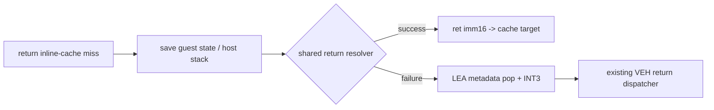

15초 통제 실행에서 `dynamic`는 return host dispatch `5,507/849/4,658`
시도/성공/fallback, fatal 0, legacy fallback 0을 기록했습니다. 대조군은 당시 존재하던
`aot-dynamic` backend(Task 425에서 제거)로, 새 카운터 `0/0/0`과 기존 layout을
유지했습니다. 두 실행의 격리 EEPROM SHA-256은 원본과 같았습니다.

Task 277 connects only the `dynamic` return inline-cache miss tail to a Win32 x86
host-stack thunk. The platform-neutral emitter records image-relative source,
miss, and continuation metadata; Win32 placement and dynamic append resolve the
absolute cache address and host-thunk `rel32` in their existing writable windows.
Other backends retain the byte-identical `popfd; INT3` tail.

The thunk saves guest registers and flags, switches to the entry trampoline's
saved host ESP and TEB stack bounds, and invokes the established return handler.
A successful continuation uses `ret imm16` to reproduce the original `C3`/`C2`
pop and transfer to the cache target. Any failure removes only DBT metadata with
`LEA ESP` and reaches the provenance `INT3`, preserving the existing VEH fallback.
A controlled 15-second run recorded 5,507/849/4,658 attempts/successes/fallbacks,
zero fatal state, and zero legacy fallback; the contrast arm was the then-existing
`aot-dynamic` backend, removed in Task 425, which recorded 0/0/0 and kept its
existing layout. Isolated EEPROM hashes remained unchanged.

Task 280은 AOT-DBT 후속 순서를 네 단계로 고정합니다. (1) Task 276 HLE 후 기존
cache 즉시 복귀와 (2) Task 277 RET miss host dispatch는 완료됐습니다. 다음은
(3) RET fallback 원인의 배타적 계측·분류이며, 그 결과를 입력으로 (4) indirect
call/jump miss host dispatch를 설계합니다. 상세 완료 조건과 공통 A/B 기준은
`docs/design/20260724-280-aot-dbt-four-stage-roadmap.md`에서 관리합니다.

Task 280 fixes the AOT-DBT follow-up order into four stages: (1) the completed
Task 276 immediate existing-cache re-entry after HLE; (2) the completed Task 277
RET-miss host dispatch; (3) exclusive instrumentation and classification of RET
fallback causes; and then (4) host dispatch for indirect call/jump misses.
Detailed completion criteria and controlled A/B rules live in
`docs/design/20260724-280-aot-dbt-four-stage-roadmap.md`.

### AOT-DBT return fallback 원인 회계 / return fallback cause accounting

Task 281은 3단계로 RET fallback을 배타적 원인 하나로 회계합니다. 공개 실행 결과와
`ThreadContext`가 같은 고정 10칸 순서(site, state, opcode, stack, zero, HLE,
quarantine, non-guest, translation, unknown)를 공유하고, `RecordAotDbtReturnFallback`
하나만 total과 reason 하나를 함께 증가시킵니다. adapter는 site 검증 이전에 attempt를
기록하며, `HandleAotReturnTransfer`는 기본값이 `nullptr`인 선택적 출력 인자로 원인을
전달하므로 기존 호출자 동작은 그대로입니다. `INT3` 기반 provenance fallback은 변경
없이 유지됩니다.

격리 EEPROM `dynamic` 15초와 120초 hot phase 실행에서 fallback은
`5,413/5,413`과 `8,034/8,034` 모두 `quarantined target` 한 칸이었고, 나머지 8개 원인은
0이었습니다. quarantine은 자기 수정 페이지의 정확성 장치이므로 RET 경로에서 완화하지
않습니다. 같은 hot phase의 indirect boundary는 34,851회로 RET fallback의 약 4.3배이며,
이것이 4단계 대상을 indirect call/jump host dispatch로 확정한 근거입니다.

Task 281 implements Stage 3: the public execution result and `ThreadContext` share
one fixed ten-slot cause order, and a single helper increments the fallback total
together with exactly one reason. The adapter accounts the attempt before site
validation, and `HandleAotReturnTransfer` reports the cause through a defaulted
optional output parameter, so existing callers and the provenance `INT3` fallback
are unchanged. Two isolated-EEPROM runs classified every fallback as a quarantined
return target (5,413/5,413 and 8,034/8,034) with all other causes zero. Quarantine
protects self-modifying pages and therefore stays fail-closed on the RET path; the
same hot phase produced 34,851 indirect boundaries, about 4.3x the RET fallbacks,
which fixes Stage 4 on indirect call/jump host dispatch.

### AOT-DBT indirect call/jump host dispatch (Stage 4, opt-in) / 4단계 (opt-in)

Task 282는 4단계를 A안으로 구현합니다. `FF /2`/`FF /4` inline-cache miss tail을 3슬롯
프레임(return addr / miss / guest source)으로 방출해 Task 277 host-stack thunk로
연결하고, adapter가 저장된 guest `CONTEXT`로 기존 `HandleAotIndirectTransfer`를
재사용합니다. call은 `C3`, jump은 `C2 04 00` continuation으로 스택 의미를 재현하며,
실패는 `lea esp,[esp+8]; INT3`로 fail-closed합니다. fallback 원인 enum은 return과 공용
(`AotDbtDispatchFallbackReason`, slot 3=`kUnreadableSource`)이고, 보고 attempt는 두 경로
모두 `success + fallback`으로 도출합니다.

합성 probe(`dbt_indirect_dispatch_all`)는 통과하지만, 실제 `dynamic`에서 활성화하면 Glide
attract 경로에서 결정적으로 크래시합니다. 성공 전이의 최종 상태는 VEH
`CONTINUE_EXECUTION` 경로와 증명상 동일한데도 누적 손상이 발생하며, layout·inline cache
patch·FPU/SSE는 통제 실험으로 근인에서 배제됐습니다. 따라서 이 경로는 **기본 비활성
(opt-in, `REPIU_AOT_DBT_INDIRECT=1`)** 이며, 기본 `dynamic`는 Task 281 상태를 유지합니다.
상세는 `docs/analysis/current-execution-frontier.md` Task 282 항목을 참조합니다.

Task 282 implements Stage 4 (option A): the `FF /2` / `FF /4` inline-cache miss tail
emits a three-slot frame and routes to the Task 277 host-stack thunk, whose adapter
reuses `HandleAotIndirectTransfer` from the saved guest `CONTEXT`; calls use a `C3`
continuation and jumps a `C2 04 00`, and failures fail closed to `lea esp,[esp+8]; INT3`.
The fallback-cause enum is shared with the RET path, and the reported attempt is derived
as `success + fallback` for both paths. The synthetic probe passes, but enabling the path
live deterministically crashes the Glide attract path even though the success transfer's
final state is provably identical to the VEH `CONTINUE_EXECUTION` path; layout, patching,
and FPU/SSE were ruled out. The path is therefore opt-in and disabled by default
(`REPIU_AOT_DBT_INDIRECT=1`), and the default `dynamic` keeps its Task 281 behavior.

### AOT-DBT 미해결 direct edge dispatch / unresolved direct-edge dispatch

Task 395는 완성된 정적 image에 target이 없는 direct call, direct jump, conditional branch,
block fall-through만 `dynamic` 전용 tail stub로 연결합니다. 이미 address map에 있는 target은
기존 `rel32` 직결을 유지하며, 다른 AOT backend는 image 생성을 fail-closed합니다. 따라서
정적 CFG의 보수적 과잉 탐색이 전체 AOT-DBT image를 폐기하지 않으면서도 일반 AOT의
완결성 계약은 바뀌지 않습니다.

stub은 dispatch 절대 주소와 guest target을 push하고 Win32 x86 host-stack thunk로
진입합니다. resolver는 site metadata를 검증한 뒤 공용 `ResolveAotTransferTarget`만
호출합니다. 성공 시 cache target으로 `ret`하며, 실패 시 metadata 한 칸을 제거하고 전용
INT3에 도달합니다. re-entry는 address map에 가짜 code entry를 만들지 않고 site의 fallback
offset으로 원래 guest target을 복원합니다. static placement와 dynamic append는 동일한
image-relative metadata를 patch·이동합니다.

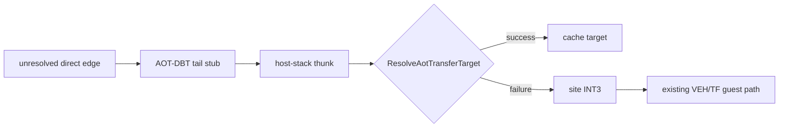

Task 395 connects only direct calls, direct jumps, conditional branches, and block
fall-throughs whose targets are absent from a completed static image to an AOT-DBT tail
stub. Mapped targets remain direct `rel32` edges, while other AOT backends keep rejecting
incomplete images. The Win32 x86 thunk validates site metadata and calls the shared
`ResolveAotTransferTarget`; success returns to a cache target and failure reaches a
site-owned INT3. Re-entry recovers the original guest target from site metadata rather
than publishing a fake address-map entry. Static placement and dynamic append patch and
relocate the same image-relative metadata.
### AOT-DBT CALL/RET 결정적 진단 경계 / deterministic CALL/RET diagnostic boundary

Task 284는 indirect host-dispatch CALL 크래시를 추적하기 위해 Win32 전용
`aot_dbt_call_return_trace`를 추가합니다. 이 진단은
`REPIU_AOT_DBT_CALL_TRACE=1`에서만 켜지며, 공용 indirect/return handler에 들어온
dispatcher-visible event를 고정 256칸 ring과 누적 카운터에 기록합니다. CALL은
VEH/host origin, source, target, return address와 entry ESP를 보존합니다. RET 전체는
누적하지만, ring에는 반환주소 target으로 기존 CALL sequence를 확정할 수 있는 RET만
보존합니다. 해당 RET의 expected ESP는 `call_entry_esp - 4`이며 불일치는 별도 sticky
first-divergence에 남습니다.

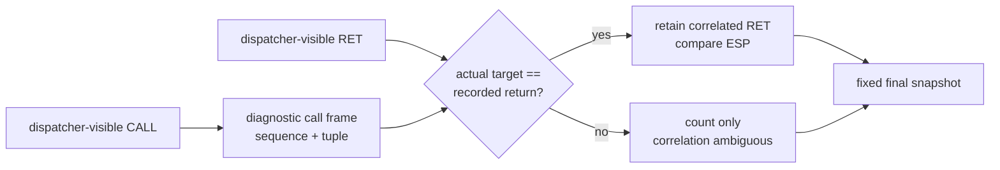

이 계층은 resolver hot path에서 allocation, lock, 파일 I/O나 형식화 로그를 사용하지
않고, guest byte·code-cache layout·target·stack write·레지스터 결과를 변경하지
않습니다. guest thread 종료 뒤 `Win32MinimalExecutionAttempt`로 POD snapshot을
복사해 최종 로그에서만 출력합니다. inline-cache hit로 C++ resolver를 건너뛴 CALL/RET은
의도적으로 이 경계 밖입니다. 240초 A/B에서 크래시 전 30개 CALL tuple과 공통 26개
상관 RET tuple이 control과 모두 일치했으므로, 다음 관측 계층은 emitter의
inline-cache-hit/물리적 `C3` continuation입니다.

Task 284 adds the Win32-only `aot_dbt_call_return_trace` to diagnose the indirect
host-dispatch CALL crash. It is enabled only by `REPIU_AOT_DBT_CALL_TRACE=1` and records
dispatcher-visible events in a fixed 256-entry ring plus aggregate counters. CALLs retain
origin, source, target, return address, and entry ESP. Every RET is counted, but only a RET
whose actual target identifies a recorded CALL is retained and compared against
`call_entry_esp - 4`; the first correlated ESP mismatch is sticky.

The resolver hot path performs no allocation, locking, file I/O, or formatted logging, and
the layer changes no guest byte, cache layout, transfer target, stack write, or register
result. State is copied as POD into `Win32MinimalExecutionAttempt` after guest-thread exit
and printed only in the final log. C++-resolver-bypassing inline-cache hits are deliberately
outside the boundary. The 240-second A/B found all 30 pre-crash CALL tuples and all 26
common correlated RET tuples identical to control, so the next observation layer is the
emitted inline-cache-hit/physical `C3` continuation path.

Task 285는 선택한 host CALL에만 saved EFLAGS.TF를 켜 synthetic `C3` 직전·직후를
관측하고, DR0/DR1으로 cache/guest return continuation을 잡는 제한 probe를 추가합니다.
이 probe는 guest/cache byte를 패치하지 않으며 return watch 동안에만 새 native fast
path의 debug-register 사용을 억제합니다. sequence 27/30/33은 세 phase가 모두
일치했지만 sequence 56은 pre-C3 continuation이 `0xEB53DDDD`로 오염됐습니다.

이 결과는 adapter 수명 계약을 새로 확정합니다. placement의 dispatch-site 벡터 원소를
가리키는 포인터나 참조는 `HandleAotIndirectTransfer`/`HandleAotReturnTransfer` 호출을
가로질러 보존할 수 없습니다. 두 handler는 동적 번역을 append하여 같은 site 벡터를
재할당할 수 있기 때문입니다. resolver 진입 전에 필요한 site metadata를 값으로
snapshot해야 하며, resolver 뒤에는 placement 벡터 원소 포인터를 재사용하지 않습니다.

Task 285 adds a bounded probe that sets saved EFLAGS.TF only for selected host CALLs,
captures state before and after the synthetic `C3`, and uses DR0/DR1 to catch cache/guest
return continuations. It patches no guest or cache byte and suppresses new native-fast-path
debug-register ownership only during the return watch. Sequences 27/30/33 matched through
all three phases, while sequence 56 exposed a poisoned `0xEB53DDDD` pre-C3 continuation.

This establishes a new adapter lifetime contract: a pointer or reference into a placement
dispatch-site vector must never survive a call to `HandleAotIndirectTransfer` or
`HandleAotReturnTransfer`, because either resolver may dynamically append and reallocate
the same vector. Required site metadata must be snapshotted by value before resolver entry,
and no placement-vector element pointer may be reused afterward.

Task 286은 이 계약을 indirect와 RET host adapter에 적용했습니다. 두
`FindDispatchSite`는 더 이상 vector 원소 포인터를 반환하지 않고 caller-owned local
value에 site 전체를 복사합니다. fallback/success continuation을 포함해 resolver 전후의
모든 site field 접근은 이 snapshot만 사용합니다. sequence 56의 pre/post/return 상태는
전부 일치했고, calls-only 실제 실행은 수정 전 30~50초 Glide AV 없이 240초를
완주했습니다.

CALL host dispatch는 수명 결함 수정 뒤에도 opt-in입니다. 실측에서 33,741회 시도 중
성공은 60회(약 0.18%)였고, 단일 240초 실행의 progress 차이만으로는 성능 이득을
입증할 수 없습니다. 기본 활성화는 의미 있는 fallback 감소 또는 반복 성능 검증 뒤
별도 정책 결정으로 다룹니다.

Task 286 applies this contract to both indirect and RET host adapters. Each
`FindDispatchSite` now copies the complete site into caller-owned local storage instead of
returning a vector-element pointer. Every pre- and post-resolver field access, including
fallback and success continuations, uses only that snapshot. Sequence 56 matched through
pre-C3, post-C3, and return completion, and the calls-only workload ran for 240 seconds
without the former 30-to-50-second Glide AV.

CALL host dispatch remains opt-in after the lifetime fix. Only 60 of 33,741 measured
attempts succeeded (about 0.18%), and a single 240-second progress difference does not
establish a performance benefit. Default enablement is a separate policy decision after a
meaningful fallback reduction or repeated performance validation.

## AOT worker inline cache

반복되는 prefix 없는 legacy-32 `FF /2`, `FF /4`, `C3`, `C2 iw` 경계는
platform-neutral emitter가 guarded inline-cache slot과 patch metadata로 만듭니다.
첫 miss는 기존 VEH dispatcher에서 guest/cache target을 확인하고, serialized
Win32 worker가 cache를 RX에서 RW로 바꿔 target과 rel32 edge를 기록한 다음 guard를
마지막에 공개합니다. 이후 RX 복원과 `FlushInstructionCache`를 완료하기 전에는
guest가 재개되지 않습니다.

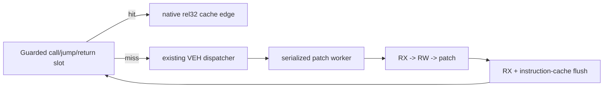

call hit는 guest fallthrough를 push하며, return hit는 `[ESP]`가 학습한 guest
return과 일치할 때만 `LEA`로 원래 pop을 수행합니다. operand/return 값이 바뀌거나
encoding을 안전하게 변환할 수 없으면 기존 dispatcher로 fail-closed합니다.
code cache는 RWX가 되지 않으며, 현재 page-wide protection 전환은 단일 guest
실행 thread 전제를 사용합니다.

Prefix-free legacy-32 `FF /2`, `FF /4`, `C3`, and `C2 iw` boundaries are emitted
as guarded slots with platform-neutral patch metadata. The existing VEH resolves
the first miss, and a serialized Win32 worker performs RX-to-RW patching, restores
RX, and flushes the instruction cache before the guest resumes. Calls preserve
guest fallthrough addresses; returns bypass the dispatcher only when the guarded
guest return value matches. Unsupported or changed values fail closed. The cache
never uses RWX, and the current page-wide protection transition assumes one guest
execution thread per loader process.

Task 273부터 간접 call/jump와 return site는 공통 `entries` 메타데이터로 최대 4개의
target을 기억합니다. 각 활성 guard의 불일치는 다음 entry compare로 이어지고 마지막
entry만 공통 miss tail로 이동합니다. worker는 같은 target 재사용, 첫 빈 슬롯 채움,
round-robin 교체 순으로 entry를 선택합니다. 동적 image append는 모든 entry offset을
재배치하고, guest page retire는 해당 page를 target으로 가진 모든 entry guard를
miss 형태로 되돌립니다. 기존 단일 슬롯 필드는 entry 0 offset을 복제해 호환성을
유지합니다.

Since Task 273, indirect call/jump and return sites retain up to four targets through
shared `entries` metadata. A mismatching active guard chains to the next entry compare,
and only the final entry reaches the common miss tail. The worker refreshes an existing
target, fills the first empty entry, then round-robin replaces. Dynamic append relocates
every entry offset, while guest-page retirement resets every guard targeting that page.
Legacy single-entry fields mirror entry zero for compatibility.

Task 274부터 간접 call/jump cache의 entry 수는 정적 image 생성 시 결정되는 명시적
build policy입니다. Win32 host는 `REPIU_AOT_INDIRECT_CACHE_SLOTS=1|4`를 읽고, 이 값을
정적 배치와 이후의 모든 동적 append에 동일하게 전달합니다. 기본값은 4이며 잘못된 값은
실행 전에 거부합니다. 이 선택은 emitter layout만 바꾸고 guest 코드, target 해석, patch
순서와 page-retirement coherence는 바꾸지 않습니다. 통제 성능 측정은 각 실행에 격리된
`REPIU_EEPROM_PATH` 사본을 제공하고 shared live telemetry의 window-open, texture, draw,
swap one-shot milestone을 사용합니다.

Since Task 274, the indirect call/jump entry count is an explicit build policy selected when
the static image is emitted. The Win32 host parses `REPIU_AOT_INDIRECT_CACHE_SLOTS=1|4` and
propagates it through static placement and every later dynamic append. Four remains the
default, and invalid values fail before execution. The policy changes only emitter layout;
guest code, target resolution, patch ordering, and page-retirement coherence remain shared.
Controlled measurements isolate persistent state with `REPIU_EEPROM_PATH` and use one-shot
window-open, texture, draw, and swap milestones from shared live telemetry.

## AOT build option toggle 관례 / AOT build-option toggle convention

Task 424는 환경 변수 하나로 기능을 켜고 끄는 관례를 플랫폼 공용
`runtime::env_toggle`로 모읍니다. 두 함수 모두 참 값은 `1`, `on`, `true` 세 가지뿐이고
대소문자 변환을 하지 않으며, 알 수 없는 값은 fail-closed OFF입니다. 오타가 조용히 ON으로
통과하면 A/B 결과를 잘못 읽게 되므로 이 성질이 중요합니다.

| 함수 | 미지정·빈 값 | 용도 |
|---|---|---|
| `ResolvePromotedToggle` | ON | A/B로 승격이 끝난 기능. 명시적 `0|off|false`만 진단용 opt-out |
| `ResolveOptInToggle` | OFF | 아직 기본값이 아닌 기능 |

Task 424는 backend 값만으로 결정되던 세 build option에 각각 toggle을 부여합니다.
셋 다 `ResolvePromotedToggle` 계열입니다.

| 환경 변수 | build option |
|---|---|
| `REPIU_AOT_DBT_RETURN_MISS_DISPATCH` | `enable_dbt_return_miss_dispatch` |
| `REPIU_AOT_DBT_DIRECT_EDGE_DISPATCH` | `enable_dbt_direct_edge_dispatch` |
| `REPIU_AOT_DBT_TIMER_SAFE_POINTS` | `enable_timer_safe_points` |

**확인됨 (Task 424):** direct-edge dispatch는 이미지에 따라 필수입니다. pumpit3의
`PIU.EXE`에는 cache 밖을 가리키는 direct edge가 10개 있어, 이 기능을 끄면 emitter가
그 edge를 표현하지 못해 `direct control-flow target is outside the cache`로 이미지
생성이 실패합니다. 그런 edge가 0개인 pumpit1은 꺼도 정상 빌드됩니다. 이 실패는
실행 전에 exit 1로 드러나므로 조용한 오동작이 아닙니다.

Task 424 collects the single-variable gating convention into the platform-neutral
`runtime::env_toggle`. Both functions accept only `1`, `on`, and `true` as true, neither folds
case, and any unrecognized value is a fail-closed OFF — a typo must never pass silently as ON,
or an A/B result is read wrong. `ResolvePromotedToggle` reads unset and empty as ON for
features already promoted by measurement, leaving explicit `0|off|false` as the diagnostic
opt-out; `ResolveOptInToggle` reads them as OFF for features that are not yet defaults.

The three options that were previously decided by the backend value alone now each carry a
promoted-style toggle: `REPIU_AOT_DBT_RETURN_MISS_DISPATCH`,
`REPIU_AOT_DBT_DIRECT_EDGE_DISPATCH`, and `REPIU_AOT_DBT_TIMER_SAFE_POINTS`.

**Confirmed (Task 424):** direct-edge dispatch is mandatory for some images. pumpit3's
`PIU.EXE` contains ten direct edges whose targets fall outside the cache, so disabling the
feature leaves the emitter unable to represent them and image construction fails with
`direct control-flow target is outside the cache`. pumpit1, which has none, builds either way.
The failure surfaces as exit 1 before execution rather than as silent misbehaviour.

## AOT bounded jump table 번역 / AOT bounded jump-table translation

Watcom switch문 관용구(`cmp reg,imm; ja default; jmp dword ptr cs:[reg*4+disp32]`)는
planner가 cmp/ja guard로 테이블 크기(`imm+1`, 최대 61)를 확정하고 relocated image에서
전 엔트리가 image 내부임을 검증한 뒤 `kJumpTable`로 분류해 각 target을 CFG에
포함시킵니다. 방문 순서에 무관하도록 walk 후 재분류 스윕이 수렴까지 반복됩니다.
emitter는 `jmp [reg*4+native_table]` + INT3 fallback + 인라인 포인터 테이블을
방출하고, Win32 배치·동적 추가의 RW 윈도우에서 절대 주소를 기록합니다.
미번역 target 엔트리는 INT3 fallback을 가리켜 dispatcher로 fail-closed합니다.

The planner recognizes the Watcom switch idiom, derives the table bound from the
cmp/ja guard (up to 61 entries), validates every relocated table entry as
in-image, classifies the branch `kJumpTable`, and enqueues each target into the
CFG, with a post-walk reclassification sweep making the result independent of
block visit order. The emitter produces `jmp [reg*4+native_table]` with an INT3
fallback and an inline pointer table; Win32 placement and dynamic append resolve
absolute addresses in their RW windows, and untranslated entries fail closed to
the dispatcher.

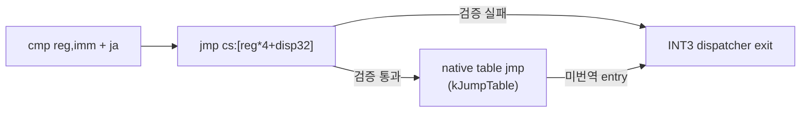

## AOT self-modifying page 세대

AOT placement는 각 address-map entry의 guest page, 세대, active 상태와 영구적인
cache-to-guest provenance를 별도로 보관합니다. 번역된 명령 범위와 겹치는 guest
write가 확인되면 serialized worker가 그 page의 active entry 첫 바이트를 `INT3`로
바꾸고 active guest lookup에서 제외합니다. 기존 cache 주소는 삭제하지 않으므로
이미 연결된 direct edge나 inline cache가 도달해도 guest 주소를 복원할 수 있습니다.
같은 writable 구간에서 retire page를 guest target으로 학습한 모든 inline-cache
guard를 초기 `E9 → miss tail` 형태로 복원해(Task 245, 설계 238), 학습된 hit이
retired entry의 `INT3`로 영구 trap하는 대신 다음 전송이 dispatcher의 정상 miss
재패치 프로토콜을 타게 합니다.

다른 page에서 patch한 retired page로 다음에 진입할 때 live guest byte를 snapshot해
새 세대를 발행합니다. 길이가 5바이트 이상인 오래된 entry는 최신 entry로 가는
`E9 rel32`로 재연결하고, 짧은 entry는 provenance trap으로 남깁니다. 같은 page의
self-modification은 해당 page만 legacy quarantine하고, 번역·발행 실패는 아래
세대 실패 정책을 따릅니다. 정상 경로는 inactive map이 없으면 추가 탐색을 하지
않으며, 재연결도 inactive index만 순회합니다.

**세대 실패의 범위 (Task 415).** 재번역 실패는 예전에 그 entry의 guest page 전체를
영구 quarantine했고, 그러면 같은 page의 다른 routine이 전부 single-step으로
떨어졌습니다. 실패한 것은 entry 하나이므로 지금은 **실패한 guest 주소만** 억제
집합(용량 256)에 넣고 다시 시도하지 않습니다. 재시도 storm을 막는다는 quarantine의
성질은 유지하면서 나머지 page는 계속 cache에서 돕니다.
`REPIU_AOT_QUARANTINE_ON_GENERATION_FAILURE=1`이거나 억제 집합이 가득 차면 예전
page 단위 격리로 돌아갑니다. 정책은 `aot_generation_failure_policy.h`가 노출하는
counter(실패 주소 수, 건너뛴 시도, page 격리 횟수, 걸친 활성화 횟수)로 보고합니다.

**page 경계를 걸친 요청 항목 (Task 417).** 그 세대 실패의 근인이 여기였습니다.
`CanActivateWin32AotAddressMapEntry`는 entry가 걸친 page가 retired면 활성화를
거부하는데 **요청 page만 예외**였으므로, 이웃 page가 retired된 뒤에는 경계를 걸친
요청 entry가 다시는 활성화되지 못하고 실행이 arena로 떨어졌습니다. append 루프는
이제 **요청 항목 하나에 한해**, quarantined page를 걸치지 않는 한 활성으로 둡니다.
지금 막 현재 guest byte로 번역한 image이고 `RegisterAddressMapPages`가 걸친 **모든**
page에 등록하므로 이후 어느 page에 써도 같은 entry가 retire됩니다. 나머지 entry는
규칙 그대로이며 `REPIU_AOT_STRICT_SPANNING_ENTRY=1`이면 예전 거부 규칙입니다.

`aot_page_coherence_win32`는 translated instruction이 있는 guest page를
`PAGE_EXECUTE_READ`로 감시합니다. native guest/cache store의 write fault에서는
Zydis로 store 폭을 계산하고 관련 page만 한 명령 동안
`PAGE_EXECUTE_READWRITE`로 전환한 뒤 Trap Flag 완료 시 다시 RX로 복원합니다.
`WriteGuest*` HLE helper는 write와 보호 복원이 성공한 뒤 같은 retirement 정책에
통지합니다. code cache 자체는 worker만 RX→RW→RX로 바꾸고 수정 후 항상
`FlushInstructionCache`를 호출합니다.

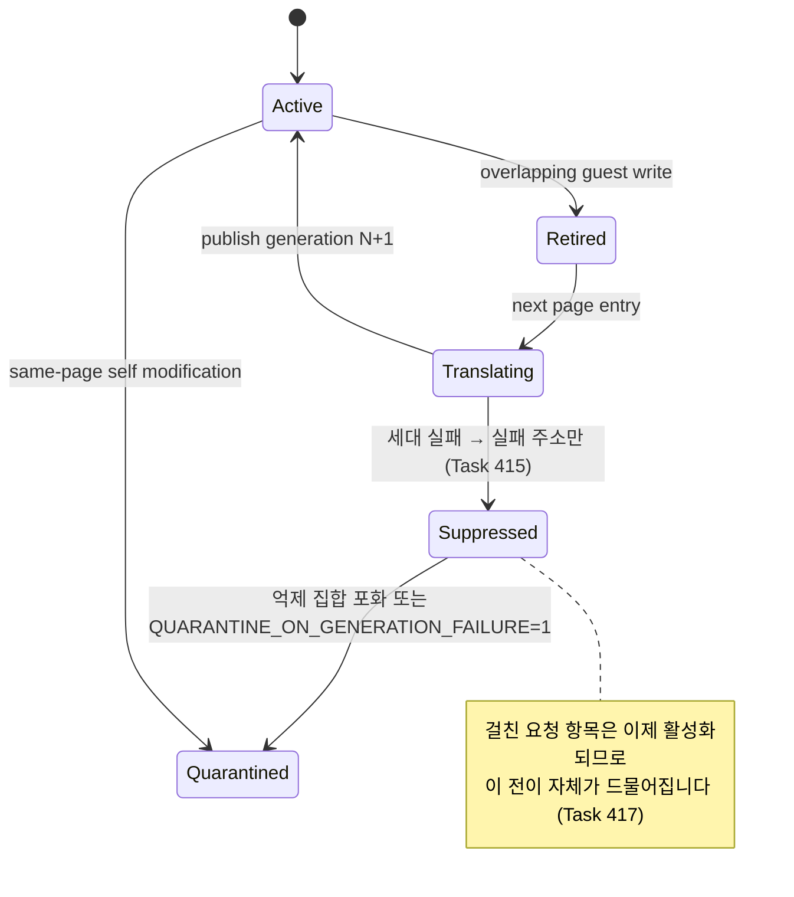

## Glide host-thread rendezvous의 스핀 대기

Glide 명령은 GL 컨텍스트를 소유한 host thread에서 실행되므로, 게스트 스레드는
`InvokeOnHostThread`에서 명령을 publish하고 완료를 기다립니다. Task 418이 pumpit3에서
그 대기가 **gate 시간의 65.9%**(wake 35.2% + complete 30.5%)임을 측정했습니다. 호출당
왕복 고정비가 약 70,000 cycle인데 호출당 GL 작업은 34,745 cycle이라, **작은 호출이
왕복에 묻히는** 구조였습니다. 호출이 훨씬 크고 드문 pumpit1은 같은 지점이 7.6%입니다.

Task 419가 대기 세 곳(publish 전 pending 대기, 완료 대기, host의 pending 대기)을
**짧은 스핀 후 조건변수 폴백**으로 바꿨습니다. 스핀은 `_mm_pause`로 돌며 두 플래그의
`std::atomic<bool>` 미러를 읽고, 예산은 `REPIU_GLIDE_RENDEZVOUS_SPIN_US`(기본 20 µs,
`0`이면 예전 동작)입니다.

**원자 미러는 힌트일 뿐입니다.** 스핀이 조건을 관측해도 반드시 뮤텍스를 잡고 기존
조건변수 술어로 재확인하며, 술어 자체는 바뀌지 않습니다. 이 규칙이 lost wakeup을
막습니다. 미러는 원래 플래그와 **같은 임계구역에서** 갱신되므로 락 밖에서 읽어도
순서가 뒤집히지 않습니다.

측정(60초 A/B, pumpit3): `wake+complete` 65.4~66.3% → **5.3~12.9%**, 프레임
2,399 → **3,063 중앙값(+27.7%)**. rendezvous 처리량이 +20%이고 프레임당 호출 수는
그대로이므로, gate가 짧아진 것이 아니라 **대기가 작업으로 바뀐 것**입니다.
스핀 hit율은 게스트측 99.5% 이상, host측 약 94%입니다.

플랫폼 공용 번역 계획은 HLE가 소유한 guest 범위를 제외 범위로 받을 수 있습니다.
LINEXE/Glide 합성 gate는 복사된 `UD2`로 실행하지 않고 cache sentinel에서 원본
guest 주소로 나온 뒤 기존 HLE dispatcher가 처리합니다.

파일 책임은 다음과 같습니다.

* `aot_page_coherence_win32`: page index/state, overlap query, retirement,
  write-watch 보호 전환
* `aot_code_cache_win32`: placement, dynamic append, generation publication,
  stale-entry relink 조율
* `execution_trampoline`: exception을 guest-write event와 serialized worker 요청으로
  연결하는 adapter

현재 안전성은 loader process당 guest 실행 thread 하나를 전제로 합니다. retired
provenance와 generation은 cache 수명 동안 유지되며 reclamation은 아직 없습니다.
REP/string store가 여러 page를 넘는 일반 경우와 multi-thread publication은 후속
검증 범위입니다.

### AOT self-modifying page generations

AOT placement keeps guest-page provenance, generation, and active state separate
from the immutable address map. A write overlapping translated instruction bytes
causes the serialized worker to replace active entry bytes with `INT3` and remove
them from active guest lookup while preserving cache-to-guest provenance. In the
same writable window, every learned inline-cache guard whose guest target lies on
the retired page is restored to its initial `E9 → miss tail` form (Task 245,
design 238), so learned hits re-enter the dispatcher's normal miss-repatch
protocol instead of trapping forever on the retired entry's `INT3`. Entry
into the retired page snapshots live bytes and publishes the next generation.
Stale entries of at least five bytes are relinked with `E9 rel32`; shorter entries
remain provenance traps. Same-page modification quarantines only that page, while
translation or publication failure follows the generation-failure policy below.
The common path performs no inactive-entry scan.

**Generation-failure scope (Task 415).** A failed re-translation used to quarantine
the entry's whole guest page permanently, dropping every other routine on that page
to single-stepping. One entry is what failed, so the penalty is now the **failing
guest address alone**, held in a 256-entry suppression set and never retried — which
keeps the retry-storm property quarantine provided while the rest of the page keeps
running from the cache. `REPIU_AOT_QUARANTINE_ON_GENERATION_FAILURE=1`, or a full
suppression set, restores the old page-wide quarantine. `aot_generation_failure_policy.h`
exposes the counters: failed addresses, skipped attempts, page quarantines, and
spanning activations.

**A requested entry straddling a page boundary (Task 417)** was the root of those
failures. `CanActivateWin32AotAddressMapEntry` refuses an entry that spans a retired
page and exempted **only the requested page**, so once a neighbour retired, a
boundary-straddling requested entry could never activate again and execution fell
back to the arena. The append loop now keeps **the requested entry alone** active
unless it spans a *quarantined* page: the image was just translated from current
guest bytes, and `RegisterAddressMapPages` records the entry under **every** page it
spans, so a later write to either page still retires it. Every other entry keeps the
old rule, and `REPIU_AOT_STRICT_SPANNING_ENTRY=1` restores the refusal.

### Spin-then-wait for the Glide host-thread rendezvous

Glide commands run on the host thread that owns the GL context, so the guest thread
publishes through `InvokeOnHostThread` and waits for completion. Task 418 measured that
wait at **65.9% of gate time** in pumpit3 (35.2% wake plus 30.5% complete): the fixed
round trip costs about 70,000 cycles against 34,745 cycles of GL work per call, so
**small calls drown in the round trip**. pumpit1, whose calls are far larger and rarer,
spends 7.6% there.

Task 419 replaced the three waits — the pending wait before publishing, the completion
wait, and the host's own pending wait — with a **short spin that falls back to the
condition variable**. The spin pauses with `_mm_pause` while reading `std::atomic<bool>`
mirrors of the two flags, on a budget from `REPIU_GLIDE_RENDEZVOUS_SPIN_US` (default
20 µs, `0` restoring the old behaviour).

**The mirrors are hints only.** A spin that observes its condition still takes the mutex
and re-tests the original condition-variable predicate, which is left unchanged; that is
what prevents lost wakeups. The mirrors are published inside the same critical section as
the flags they mirror, so reading them outside the lock cannot reorder against it.

Measured over a 60-second A/B on pumpit3, `wake + complete` falls from 65.4-66.3% to
**5.3-12.9%** and frames rise from 2,399 to a **median 3,063 (+27.7%)**. Rendezvous
throughput rises 20% while calls per frame stay constant, so the gate did not shrink —
**waiting turned into working**. Spin hit rates are above 99.5% on the guest side and
about 94% on the host side.

The dedicated `aot_page_coherence_win32` subsystem write-watches guest pages that
contain translated instructions as `PAGE_EXECUTE_READ`. On a native guest/cache
store fault, Zydis estimates the write width, only the affected pages become
`PAGE_EXECUTE_READWRITE` for one instruction, and Trap Flag completion restores
RX before retirement is reported. Successful `WriteGuest*` HLE writes report to
the same policy after restoring protection. Only the worker changes the code
cache from RX to RW and back, followed by `FlushInstructionCache`.

The platform-neutral planner also accepts HLE-owned excluded guest ranges.
Synthetic LINEXE/Glide gates become cache sentinels that return to the original
guest address and existing HLE dispatcher instead of copied `UD2` instructions.

`aot_page_coherence_win32` owns page indexing, state, overlap queries,
retirement, and write-watch protection transitions. `aot_code_cache_win32`
orchestrates placement, dynamic append, generation publication, and stale-entry
relinking. The execution trampoline only adapts exceptions into guest-write
events and serialized worker requests. The current safety model assumes one guest
execution thread per loader process. Retired provenance is retained for the cache
lifetime; reclamation, cross-page REP/string stores, and multi-thread publication
remain follow-up work.

## AOT cache breakpoint provenance

guest opcode 기반 boundary reason과 cache `INT3`의 생성 원인은 별도입니다. AOT placement는
정적 image와 동적 append 시 immutable breakpoint offset을 planner HLE, selector guard,
inline-cache fallback, jump-table fallback, other planner fixup으로 O(1) index에 등록합니다.
실행 시점의 retired/inactive entry와 명시적 probe sentinel은 이 index보다 우선합니다.
미등록 주소는 unknown으로 fail-closed합니다. 이 구조는 범용 host dispatch가 HLE나 SMC
provenance를 오인하지 않게 하는 사전 조건이며, hot breakpoint에서는 vector scan을 하지
않습니다.

## AOT cache breakpoint provenance (English)

Guest-opcode boundary reasons and the structural origin of a cache `INT3` are separate.
During static placement and dynamic append, immutable breakpoint offsets are indexed in O(1)
as planner HLE, selector guard, inline-cache fallback, jump-table fallback, or another planner
fixup. Runtime retired/inactive entries and explicit probe sentinels take precedence; an
unindexed address is unknown and fails closed. This prevents a generic host dispatcher from
mistaking HLE or SMC provenance and avoids vector scans on the hot breakpoint path.

## Guarded AOT segment-pop fast path

Task 291은 plain `POP ES/DS/FS/GS`를 planner의 전용 `kGuardedSegmentPop` record로
분류합니다. 플랫폼 공용 emitter는 물리 segment selector, 원래 guest stack word,
shadow selector가 모두 같은 경우에만 EAX/EFLAGS를 보존한 채 guest ESP를 4 증가시키고
cache fallthrough로 이동합니다. 불일치하면 register/flags/ESP를 진입 상태로 복원한 뒤
기존 `INT3`/VEH segment-pop HLE로 fail-closed합니다. `POP SS`와 prefixed form은 기존 HLE
경계입니다.

Win32 정적 배치와 dynamic append는 shadow selector 및 success/fallback counter 주소를
site metadata로 patch합니다. selector table을 아직 사용할 수 없거나 주소를 해결할 수
없으면 slot 시작을 `INT3`로 유지합니다. whole-CFG 검증은 시작 opcode, guard 주소,
fallback `INT3`를 확인하고 cache breakpoint provenance는 fallback을 planner HLE로
계속 집계합니다.

55초 OFF/ON에서 progress는 `37,606 → 39,571`(+5.23%), triangle draw는
`412 → 468`(+13.59%), AOT boundary는 `74,724 → 59,334`(-20.60%)였습니다. ON의
success/fallback은 `21,011/1,593`(92.95% 성공)였고 fatal/AOT legacy fallback은 0,
EEPROM hash는 일치했습니다. 따라서 `dynamic`에서는 기본 ON이며
`REPIU_AOT_GUARDED_SEGMENT_POP=0|off|false` 또는 알 수 없는 값으로 fail-closed
비활성화합니다.

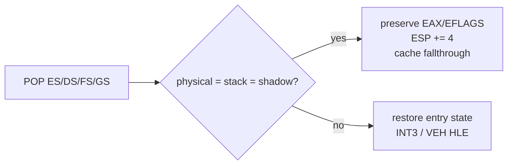

Task 291 classifies plain `POP ES/DS/FS/GS` as dedicated `kGuardedSegmentPop` planner records.
The platform-neutral emitter advances the guest ESP by four and reaches cache fallthrough
only when the physical segment selector, original guest-stack word, and shadow selector are
all equal, preserving EAX and EFLAGS. A mismatch restores registers, flags, and ESP to their
entry state before the existing INT3/VEH segment-pop HLE. `POP SS` and prefixed forms remain
ordinary HLE boundaries.

Static Win32 placement and dynamic append patch shadow-selector and success/fallback counter
addresses through site metadata. An unavailable selector table or unresolved address keeps
the slot entry as INT3. Whole-CFG validation checks the entry opcode, patch locations, and
fallback INT3, while breakpoint provenance continues to classify the fallback as planner HLE.
The 55-second comparison improved progress by 5.23% and triangle draws by 13.59%, reduced AOT
boundaries by 20.60%, and observed a 92.95% guarded success rate with zero fatal/AOT legacy
fallback and matching EEPROM hashes. The path is default-on for `dynamic`; setting
`REPIU_AOT_GUARDED_SEGMENT_POP=0|off|false`, or an unknown value, disables it
fail-closed.

## 네이티브 span 음성 캐시 / Native-span negative cache

Task 304는 기본 native linear-span scan이 0~1개 일반 명령 뒤 정적 경계에서 거절한
결과를 entry EIP별로 저장합니다. 항목은 최대 30바이트의 guest snapshot을 가지며, 현재
바이트가 완전히 같을 때만 Zydis 재디코딩을 생략하고 기존 single-step fallback을
선택합니다. 바이트가 다르면 stale 항목을 삭제하고 재스캔합니다. 캐시는 어떤 명령도
추가로 native 실행하지 않으므로 SMC/AOT generation 정책보다 보수적인 fallback
최적화입니다.

write/jump 실험 mode는 register·page·target 상태에 의존하므로 캐시를 우회하고, 항목
수는 65,536개로 제한합니다. 세 번의 60초 A/B에서 거절 hit율은 99.68~99.69%였고
texture milestone 중앙값은 1,031ms(약 4.9%) 빨라졌습니다. fatal/legacy fallback은 0,
EEPROM hash는 일치했습니다. 따라서 `dynamic` 기본 ON이며 다른 backend는 기본 OFF입니다.
`REPIU_NATIVE_LINEAR_SPAN_REJECT_CACHE=0|off|false` 또는 알 수 없는 값은 비활성화합니다.

Task 304 caches default native linear-span scans that reject at a static boundary after zero
or one ordinary instruction. Each entry holds up to 30 guest bytes. Only an exact byte match
skips Zydis decoding and selects the existing single-step fallback; a mismatch erases the
stale entry and rescans. A hit never permits additional native execution, making this a
conservative fallback optimization independent of SMC/AOT generation state.

Register/page/target-dependent write and jump experiments bypass the cache, which is capped
at 65,536 entries. Three 60-second A/B pairs observed a 99.68-99.69% rejection hit rate and a
1,031ms median texture-milestone improvement (about 4.9%), with zero fatal/legacy fallback
and matching EEPROM hashes. It is default-on for `dynamic`, default-off elsewhere, and
disabled by `0|off|false` or unknown settings.

## Retired trap 즉시 native span 후보 / Immediate native span after retired traps

Task 305는 retired cache `INT3`에서 active/new generation 해결이 실패한 경우, guest EIP를
복원한 직후 기존 native linear-span scanner를 선택적으로 호출합니다. 기능은
`REPIU_AOT_RETIRED_SPAN_REENTRY=1|on|true`에서만 켜집니다. scan 거절은 기존 Trap-Flag
경로를 그대로 사용하며, 성공해도 `aot_reentry_pending`과 single-step trace 정책을
보존합니다. Dr0 경계에서 기존 AOT/HLE chain이 재개되어 RET, segment, store 및 다른 민감
경계를 기존 handler가 처리합니다.

세 번의 30초 교차 A/B에서 ON은 시도의 95.28~95.46%를 span으로 전환하고 single-step을
중앙값 2.86% 줄였습니다. 그러나 progress 개선 중앙값은 0.35%, texture 개선 중앙값은
17ms에 불과했습니다. 모든 유효 실행은 fatal 0과 EEPROM hash 일치를 유지했지만 반복
처리량 개선이 작아 기본값은 OFF입니다. live/final telemetry의 `retired_span=attempt/success`
로 실사용 기회를 확인할 수 있습니다.

Task 305 optionally calls the existing native linear-span scanner immediately after a retired
cache `INT3` cannot resolve to an active or new generation. It is enabled only by
`REPIU_AOT_RETIRED_SPAN_REENTRY=1|on|true`. Rejection keeps the existing Trap-Flag path;
success also preserves pending-reentry and single-step policy so the Dr0 boundary resumes the
same AOT/HLE chain for RET, segment, store, and other sensitive instructions.

Across three 30-second alternating pairs, ON converted 95.28-95.46% of attempts into spans and
reduced single-step count by a 2.86% median. Median progress improvement was only 0.35%, while
median texture improvement was 17ms. All valid runs kept zero fatal events and matching EEPROM
hashes, but the throughput gain was too small for default promotion. Live/final telemetry
reports the opportunity as `retired_span=attempt/success`.

## Retired trap hotset 계측 / Retired-trap hotset profiling

Task 306은 `REPIU_AOT_RETIRED_TRAP_PROFILE=1|on|true`에서 retired cache `INT3`의
guest/cache 주소, inactive entry 세대, guest/emitted 길이와 resolver 결과를 집계합니다.
guest/cache histogram은 각각 65,536개 주소로 제한되며 초과 횟수를 별도로 보존합니다.
종료 snapshot은 guest/cache 상위 16개와 guest top-16 coverage, 5바이트 relink 가능 여부,
active/generation/quarantine/failure/fallback/trace 결과별 횟수를 출력합니다. 기본값은
OFF이며 비활성 상태에서는 histogram lookup을 수행하지 않습니다.

60초 profile은 retired trap `7,401`회 중 `7,293`회(98.54%)가 emitted length 1~4인
짧은 entry이고 동일하게 quarantine 결과였음을 확인했습니다. 상위 guest 16개는 전체의
98.24%, `0x030F4A94`와 `0x030F507C` 두 주소는 64.06%를 차지했습니다. relink 가능한
108회는 generation publish 107회와 failure 1회로 분리됐습니다. 따라서 기존 5바이트
`E9 rel32` 재연결을 확대하는 것보다 짧은 retired entry를 예외 없이 우회하는 공용
side-table/dispatch 경계가 다음 후보입니다.

Task 306 profiles retired cache `INT3` events only under
`REPIU_AOT_RETIRED_TRAP_PROFILE=1|on|true`. It records guest/cache addresses, inactive-entry
generation and lengths, and resolver outcomes in separately capped 65,536-entry histograms.
The final snapshot reports guest/cache top 16 lists, guest top-16 coverage, five-byte relink
eligibility, and active/generation/quarantine/failure/fallback/trace counts. Profiling defaults
off and performs no histogram lookup while disabled.

The 60-second profile found that 7,293 of 7,401 retired traps (98.54%) came from one-to-four
byte entries and resolved as quarantine. The top 16 guest addresses covered 98.24%; just
`0x030F4A94` and `0x030F507C` covered 64.06%. The 108 relinkable traps split into 107
generation publications and one failure. A shared side-table or dispatch boundary that
redirects short retired entries without an exception is therefore the next candidate, rather
than extending the existing five-byte `E9 rel32` relink.

## Exception-free superblock 검증 경계 / Exception-free superblock validation boundary

Task 308은 기존 AOT planner/emitter가 이미 cache-local direct call/jump, conditional,
fallthrough와 backward edge를 연결한다는 사실을 기준으로 합니다. 새 superblock은
기본 블록 형식을 다시 만드는 기능이 아니라, 일반 planner HLE `INT3`를 정상 host-call
dispatch slot으로 대체하는 opt-in 실행 경계입니다.

`REPIU_AOT_DBT_SUPERBLOCK=1|on|true`에서 Win32 x86 thunk는 GPR/EFLAGS와
x87/MMX/SSE를 저장하고 host stack 및 TIB stack bounds로 전환한 뒤 기존 공용 HLE
handler chain을 호출합니다. 처리된 다음 guest EIP에 활성 cache entry가 있으면 직접
복귀합니다. segment register write, invalid site, 미처리 HLE, target miss 또는 상태
계약 실패는 기존 planner-HLE provenance `INT3`로 fail-closed합니다. SMC write-watch와
generation publication은 기존 정책을 그대로 사용합니다.

Task 308 is based on the confirmed fact that the existing AOT planner and emitter already
chain cache-local direct calls/jumps, conditional branches, fallthroughs, and backward edges.
The new superblock boundary is therefore an opt-in replacement of ordinary planner-HLE
`INT3` exits with a normal host-call dispatch slot, not a second basic-block format.

Under `REPIU_AOT_DBT_SUPERBLOCK=1|on|true`, the Win32 x86 thunk preserves GPR/EFLAGS
and x87/MMX/SSE state, switches to the host stack and TIB stack bounds, and invokes the
shared HLE handler chain. A handled next guest EIP resumes at an active cache entry.
Segment-register writes, invalid sites, unhandled HLE, target misses, and state-contract
failures fail closed through the existing planner-HLE provenance `INT3`. Existing SMC
write-watch and generation-publication policy remains unchanged.

첫 unrestricted 실행은 정상 호출 ABI의 안전 범위를 추가로 확인했습니다.
`0x030F5D27: INT 21h AH=25h`를 직접 처리하면 INT 8 vector selector가 기존 VEH
경로의 `002B` 대신 `0023`으로 저장되어 후속 `0x03042EBE` AV를 만들었습니다.
따라서 first slice는 segment/ESP write 외에 모든 `INT/IRET`도 VEH 경계에 남깁니다.
target miss는 HLE가 이미 committed된 경우 source를 재실행하지 않고 처리된 다음
guest EIP에서 TF bridge로 들어갑니다.

60초 OFF/ON 검증 결과는 다음과 같습니다.

| 지표 | OFF | ON | 변화 |
|---|---:|---:|---:|
| progress | 44,977 | 45,716 | +1.64% |
| single-step | 276,680 | 254,889 | -7.88% |
| AOT boundary | 66,245 | 41,224 | -37.77% |
| host-call HLE success/fallback | 0/0 | 25,134/19,196 | - |

양쪽 모두 exception/legacy fallback 0, Glide gate 4,582/4,582, 동일한 Glide gap
count와 EEPROM hash를 유지했습니다. 정상 호출 HLE 경계는 안전 subset에서 유효하지만
5배 whole-run go/no-go에는 실패했습니다. 일반 HLE 예외 제거를 60배 목표의 주
아키텍처로 확장하지 않습니다.

The unrestricted run showed that direct `INT 21h AH=25h` changes the established INT 8
selector contract and later faults. All `INT/IRET` forms therefore remain VEH-mediated
along with segment/ESP writes; a post-commit target miss resumes the handled next EIP through
the TF bridge. The controlled 60-second pair reduced single-step by 7.88% and AOT boundaries
by 37.77%, but improved progress only 1.64%. Both runs preserved zero exception/legacy
fallback, identical Glide activity and gap counts, and matching EEPROM hashes. The safe
normal-call boundary is viable, but fails the 5x architecture gate.

## Single-step hotspot latency 계측 / Single-step hotspot latency profiling

Task 309는 기본 OFF인 `REPIU_SINGLE_STEP_HOTSPOT_PROFILE=1|on|true` 계측을
추가합니다. 계측을 켠 실행만 8,192-slot open-addressing table을 heap에 할당하며,
guest thread는 allocation과 lock 없이 `HandleSingleStepTrace` 진입 EIP별 count,
total/max TSC tick과 HLE/timer/native/TF outcome을 누적합니다.

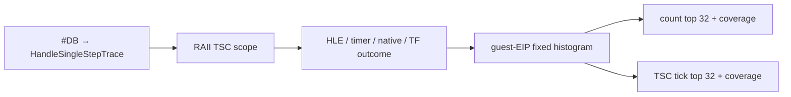

종료 시에만 histogram을 snapshot하고 count와 TSC tick 순위를 독립 정렬합니다.
계측 범위는 handler body이며 kernel의 #DB 진입 전과 VEH 복귀 후를 포함하지 않습니다.
또한 thread preemption이 sample latency를 늘릴 수 있으므로 값을 순수 CPU cycle 또는
전체 예외 전환 비용으로 해석하지 않습니다.

60초 검증에서는 HLE가 event의 33.60%와 handler tick의 84.82%를 차지했습니다.
상위 주소는 segment-register move와 port-I/O HLE에 분산됐고 cycle 상위 32 coverage는
67.21%였습니다. 단일 loop의 exception-free generation은 80% gate를 통과하지
못했으므로, 다음 single-step 작업은 상위 HLE의 opcode-directed dispatch/decode
비용과 계측 범위 밖 exception transition 비용을 먼저 분리합니다.

Task 309 adds an opt-in `REPIU_SINGLE_STEP_HOTSPOT_PROFILE=1|on|true` profile. Enabled runs
allocate an 8,192-slot open-addressing table on the heap. The guest thread records per-entry
EIP count, total/max TSC ticks, and HLE/timer/native/TF outcomes without allocation or locks.
The final snapshot independently sorts the top 32 by count and by ticks.

The scope covers the handler body, not kernel #DB entry or the path after VEH returns, and
preemption can inflate latency. In the 60-second profile, HLE accounted for 33.60% of events
and 84.82% of handler ticks. Segment-register and port-I/O HLE sites were distributed across
the ranking, and the top 32 covered 67.21%, below the 80% gate for generating one
exception-free loop. The next single-step task must first separate hot-HLE dispatch/decode
work from the exception-transition cost outside this scope.

## 포트 I/O 지연 루프 batching / Port I/O delay-loop batching

Task 414는 **결과를 쓰지 않는 포트 폴링 루프**를 인식해 반복을 건너뜁니다. pumpit3의
타이머 ISR은 tick(240 Hz)마다 `inc r; sub eax,eax; in ax,dx; cmp r,imm; jl` 루프를 200회
돌고, 루프 종료 직후 `mov eax,[...]`가 EAX를 덮어씁니다. 즉 읽은 값은 **한 번도 쓰이지
않는** 순수 지연이며, 우리에겐 반복마다 CPU fault 1회입니다.

```mermaid
flowchart LR
    F["in ax,dx → fault"] --> E["기존 포트 emulate"]
    E --> M{"루프 모양 일치?"}
    M -->|아니오| R["예전 경로 그대로"]
    M -->|예| C["카운터 := limit - step"]
    C --> G["게스트가 마지막 반복 1회를 직접 실행"]
    G --> X["cmp/jcc가 자연스럽게 종료"]
```

* **레지스터 하나만 씁니다.** EIP·EFLAGS·EAX·EDX를 만들지 않으므로 종료 상태가 원래
  실행과 같고, 플래그 합성의 등가성을 증명할 필요가 없습니다.
* 일치 조건: `IN` 뒤가 `cmp r32, imm` + **뒤로 가는 signed 조건 분기**, 본문은
  `inc`/`dec`/자기 0화(`sub r,r`·`xor r,r`)뿐, 본문이 `IN` 앞에서 EAX를 0으로 만들 것
  (**건너뛰는 읽기가 죽은 값이라는 증명**), 카운터가 EAX·EDX가 아닐 것, 남은 반복 2회
  이상, 디코드 범위가 읽기 가능할 것. 하나라도 어긋나면 **아무 상태도 바꾸지 않습니다.**
* **부수 효과 없는 입력 경로에서만** 시도합니다(JAMMA 입력). EEPROM·YMZ280B 창은 앞선
  분기에서 처리되므로 대상이 아닙니다.
* `REPIU_PORT_IO_DELAY_LOOP=0`이면 예전 동작이며, 통계(시도·batch·건너뛴 반복·불일치
  사유)를 로그로 냅니다.

Task 414 recognises a **port polling loop whose result is never used** and skips its
iterations. pumpit3's timer ISR runs `inc r; sub eax,eax; in ax,dx; cmp r,imm; jl` 200 times
per 240 Hz tick and overwrites EAX immediately after the loop, so the reads are a pure delay
that cost us one CPU fault each. On a match the handler writes **one register** — the
counter — so the guest executes its own final iteration and the exit state is identical
without synthesising flags. The match requires `cmp r32, imm` plus a backward signed branch
after the `IN`, a body of only `inc`, `dec`, or self-zeroing `sub`/`xor`, that body zeroing
EAX before the `IN` (**the proof that skipped reads are dead**), a counter that is neither
EAX nor EDX, at least two iterations remaining, and readable bytes; any mismatch changes
nothing. It is attempted **only on the side-effect-free JAMMA input path**, since the EEPROM
and YMZ280B windows are handled by earlier branches. `REPIU_PORT_IO_DELAY_LOOP=0` restores
the old behaviour, and the attempt, batch, skipped-iteration, and refusal-reason counts are
logged.

## 게스트 위치 census / Guest position census

Task 411은 기본 OFF인 `REPIU_GUEST_POSITION_CENSUS=1|on|true` 계측을 추가합니다.
위 single-step 핫스팟 계측과 목적이 다릅니다 — **표본 시점이 예외에 묶여 있지
않습니다.** poll thread가 `REPIU_GUEST_POSITION_CENSUS_MS`(기본 10, 1~1000으로 clamp)
간격마다 게스트 스레드를 정지시켜 EIP를 읽고, 4,096-slot open-addressing table에
누적합니다.

```mermaid
flowchart LR
    P["poll thread<br/>간격 만료"] --> S["SuspendThread<br/>GetThreadContext"]
    S --> M{"EIP 위치"}
    M -->|"cache 범위"| G["FindAotGuestAddress<br/>→ guest 주소"]
    M -->|"arena 범위"| A["guest 주소 그대로"]
    M -->|"그 외"| H["host 주소"]
    G --> T["주소별 histogram + origin"]
    A --> T
    H --> T
    T --> D["종료 시 상위 16 로그 + 전체 덤프"]
```

* 캡처는 기존 `CaptureWin32NativePhaseSample`을 재사용하며, suspend와 resume 사이에서
  할당·락·I/O를 하지 않습니다. 역매핑은 EIP가 캐시 범위일 때만 수행합니다 — 번역
  worker는 게스트 스레드가 자신을 기다릴 때만 placement를 바꾸므로 그때 address map은
  안정입니다.
* `origin`(arena / cache-mapped / cache-unmapped / host)별 합계를 따로 세어
  **`합 == total` 검산**을 로그에 함께 출력합니다. 검산이 깨지면 분포로 읽지 않습니다.
* 캐시 표본은 게스트 주소로 접혀 arena 표본과 같은 축에서 합산되므로, 같은 게스트
  코드가 두 실행 방식으로 나뉘어도 한 줄로 보입니다.
* 기존 `REPIU_NATIVE_SAMPLING` 표본기는 **예외 dispatch가 1초간 조용해야** 발화하므로
  멈춘 실행에서는 한 번도 동작하지 않습니다. 이 census는 그 게이트를 쓰지 않습니다.
* census를 켠 실행은 suspend/resume 비용이 붙으므로 **wall·프레임을 인용하지
  않습니다.**

Task 412는 여기에 **host 시간 귀속**을 더합니다.

* **스레드 CPU 시간** — 표본마다 `GetThreadTimes`를 읽어 kernel/user 시간과 wall을
  함께 보고합니다. host 표본이 많을 때 **"커널에서 바쁨"과 "어딘가에서 막힘"을 가르는
  단일 판정**입니다.
* **host 호출 지점** — 표본이 host이면 정지 상태에서 `ESP`부터 최대 64 dword를 훑어
  **로더 모듈 범위 안의 첫 값**을 별도 표(1,024 slot)에 누적합니다. 프레임 체인을
  신뢰하지 않는 후보 탐색이므로 **정식 스택 워크가 아니며**, 상위 몇 개를 분포로
  읽습니다. 읽기는 C++ 객체 없는 함수에서 SEH로 감싸고, 결과는
  `sited`/`no-site`/`failed` 셋 중 정확히 하나로 계상되어 **합이 host 표본 수와 같아야
  합니다.**
* **모듈·심볼** — 종료 후 `GetModuleHandleExA`로 모듈을, `dbghelp`로 함수명을
  해석합니다. Release는 `/Zi` + `/DEBUG`로 PDB를 만들되 **최적화 플래그는 그대로**라
  코드 생성은 바뀌지 않습니다. 심볼이 없으면 `모듈+offset`으로 물러섭니다.

Task 412 adds **host-time attribution** on top: `GetThreadTimes` per sample, reported
against wall clock, is the single split between "busy in the kernel" and "blocked
somewhere"; host samples also get a shallow scan of up to 64 dwords from `ESP` for the
first value inside the loader's image, accumulated in a separate 1,024-entry table — a
candidate search rather than a stack walk, read as a distribution, wrapped in SEH inside a
function with no C++ objects, and counted as exactly one of `sited`, `no-site`, or `failed`
so the three must sum to the host sample count. Modules are resolved with
`GetModuleHandleExA` and symbols with `dbghelp` after the run; Release now carries `/Zi`
and `/DEBUG` for the PDB while **keeping every optimisation flag**, so code generation is
unchanged and a missing symbol degrades to `module+offset`.

Task 411 adds an opt-in `REPIU_GUEST_POSITION_CENSUS` census whose sampling instant is
**not tied to an exception**, unlike the single-step hotspot profile above. The poll thread
suspends the guest thread every `REPIU_GUEST_POSITION_CENSUS_MS` milliseconds (default 10,
clamped to 1-1000), reads EIP, and accumulates it in a 4,096-slot open-addressing table.
Capture reuses `CaptureWin32NativePhaseSample` and allocates, locks, and performs no I/O
between suspend and resume; the reverse map runs only for cache-range addresses, where the
translation worker cannot be mutating the placement. Per-origin totals (arena, cache-mapped,
cache-unmapped, host) are counted separately so the log can print the **`sum == total`**
check, and cache samples fold onto their guest address so one guest location reads as one
row regardless of where it executed. The existing `REPIU_NATIVE_SAMPLING` sampler requires
a full second with no exception dispatch and therefore never fires in a stalled run; this
census uses no such gate. Runs with it enabled are not quotable for wall time or frames.

## AOT back-edge 타이머 safe point / AOT back-edge timer safe point

Task 348은 자연 VEH 경계가 없는 AOT busy-wait에서도 원본 INT 8 ISR을 계속 실행하기
위한 협력형 rendezvous를 추가합니다. `dynamic` emitter는 direct/conditional back edge
앞에 `pushfd`/request compare/`popfd` guard를 생성하고, 요청이 있을 때만 placement에
등록된 전용 `INT3`로 진입합니다. 정상 경로와 trap 경로 모두 원래 GPR/ESP/EFLAGS를
보존한 상태에서 기존 translated branch로 이어집니다.

```mermaid
sequenceDiagram
    participant P as Poll thread
    participant C as AOT cache
    participant V as Guest-thread VEH
    participant I as Common INT 8 injector
    P->>P: pending=true, request=1
    C->>V: back-edge safe-point INT3
    V->>V: request=0, EIP=ExceptionAddress+1
    V->>I: IF/vector 검증과 IRET frame 작성
    I-->>C: original ISR/IRETD 뒤 branch 재개
```

request word와 site index는 `Win32AotCodeCachePlacement`가 소유하며 initial placement와
dynamic append가 공유합니다. poll thread는 `InterlockedExchange`로 요청만 게시하고
guest context, TF, stack을 수정하지 않습니다. safe-point handler는 일반 AOT reentry보다
먼저 실행되며 실제 frame 작성은 기존 `InjectPendingInterrupts`만 담당합니다. 자연 경계에서
pending이 먼저 소비된 경우 request도 함께 지워 stale trap을 막습니다. 종료 로그는
site 수와 trap/injected/deferred를 분리해 기록합니다.

Task 348 adds a cooperative rendezvous that keeps the original INT 8 ISR running even inside
an AOT busy-wait with no natural VEH boundary. The `dynamic` emitter places a
`pushfd`/request-compare/`popfd` guard before direct and conditional back edges and enters a
placement-registered dedicated `INT3` only when requested. Both paths preserve the original
GPRs, ESP, and EFLAGS before continuing with the translated branch.

The request word and site index belong to `Win32AotCodeCachePlacement` and are shared by the
initial placement and dynamic appends. The poll thread publishes only the request with
`InterlockedExchange`; it never edits guest context, TF, or stack. The dedicated handler runs
before generic AOT reentry, explicitly resumes at `ExceptionAddress + 1`, and delegates all
frame creation to `InjectPendingInterrupts`. Natural-boundary delivery also clears the request
to prevent a stale trap. Final diagnostics report site and trap/injected/deferred counts.

## AOT timer source 귀속 / AOT timer-source attribution

Task 351의 opt-in `REPIU_AOT_TIMER_SOURCE_PROFILE=1`은 Task 348 safe point를
원본 guest source별 interrupt-delivery 관측점으로 사용합니다. initial AOT placement와
dynamic append는 기존 breakpoint set 옆에 `breakpoint_offset -> guest_source` map을
유지합니다. handler는 정확한 source를 찾은 뒤에만 고정 크기 profile을 갱신합니다.

```mermaid
sequenceDiagram
    participant P as PIT scheduler
    participant L as Due-tick ledger
    participant S as AOT safe point
    participant I as Common injector
    participant R as Fixed source profile
    P->>L: 만료 tick saturating-add
    S->>I: pending INT 8 주입 시도
    alt 주입 성공
        I->>L: exchange(0)
        I-->>S: 소비 tick 수
        S->>R: source에 tick 귀속
    else 주입 보류
        I-->>S: 0
        S->>R: deferred만 기록
    end
```

기존 `last_timer_injection_ticks`는 누적 진단값이고, 새
`timer_interrupt_due_ticks`는 아직 어느 전달 경로에도 귀속되지 않은 만료 tick입니다.
공용 `InjectPendingInterrupts`가 모든 성공 경로에서 due ledger를 소비하고 그 수를
반환합니다. natural VEH 경계는 반환값을 기록하지 않아 오래된 tick을 다음 safe point에
잘못 붙이지 않습니다. 동시 scheduler add가 `exchange` 뒤에 발생하면 다음 주입을 위해
남으므로 tick을 잃지 않습니다.

profile은 VEH hot path에서 allocation과 lock을 피하기 위해 1,024-entry 고정 배열을
사용하며 source, trap/injected/deferred count, 귀속 tick, first/last global tick을
보존합니다. 종료 시에만 전체 entry를 tick 순으로 정렬해 attempt summary에 출력합니다.
이 기능은 기본적으로 꺼져 있고 원본 executable, ISR, IRET frame, tick 값과 cadence를
바꾸지 않습니다. 귀속 tick의 주기 환산은 해당 source가 정적으로 tick-wait임이 확인된
경우에만 pacing 상한으로 사용합니다.

Task 351's opt-in `REPIU_AOT_TIMER_SOURCE_PROFILE=1` reuses Task 348 safe
points as per-original-source interrupt-delivery observations. Initial AOT
placement and dynamic append maintain a
`breakpoint_offset -> guest_source` map beside the existing breakpoint set.
Only an exactly resolved source updates the fixed profile.

The existing `last_timer_injection_ticks` remains a cumulative diagnostic,
while `timer_interrupt_due_ticks` contains expirations not yet consumed by any
delivery path. Common `InjectPendingInterrupts` consumes that ledger on every
successful injection and returns the consumed count. Natural VEH boundaries
discard the return value, preventing stale ticks from being attached to a
later safe point. A scheduler add concurrent with the exchange remains for the
next injection.

The profile uses a fixed 1,024-entry array to avoid allocation and locks in the
VEH hot path, retaining source, trap/injected/deferred counts, attributed
ticks, and first/last global tick. Only final reporting sorts and prints all
entries. The feature is disabled by default and changes neither the original
executable, ISR, IRET frame, tick values, nor cadence. Period conversion is
treated as a pacing upper bound only for a source whose original disassembly
proves a tick-wait dependency.

## Glide ordinal 시간 귀속 / Glide ordinal time attribution

Task 353의 기본 OFF `REPIU_GLIDE_ORDINAL_TIME_PROFILE=1`은 decoded Glide gate
cycle과 기존 Task 333 rendezvous interval을 ordinal 0~255 고정 배열에 귀속합니다.
global `ExecutionTimeScope`는 optional completed-cycle output을 제공하며 ordinal
finalizer가 그 값을 재사용하므로 TSC를 추가로 읽지 않습니다. backend도 이미 보유한
enter/publish/host-start/host-finish/resume timestamp를 현재 bound ordinal에 직접
누적합니다.

```mermaid
flowchart LR
    G["decoded Glide gate"] --> S["global ExecutionTimeScope"]
    G --> B["bound ordinal"]
    B --> H["host command timestamps"]
    S --> P["fixed ordinal entry"]
    H --> P
    P --> F["final sorted snapshot"]
```

hot path는 allocation, lock, 정렬이 없고 종료 시에만 39개 활성 entry를 cycle 순으로
출력합니다. timeout에서 열린 command 하나는 global partial interval만 가질 수 있으므로
완료 count는 handled gate와 대조하고 global-minus-ordinal delta는 열린 gate가 하나일
때만 허용합니다. 최종 60초 A/B의 global Glide coverage는 평균 99.970%, observer
impact는 -0.67%였습니다.

`grBufferSwap`은 Glide gate의 50.21%, 현재 wall-clock의 약 17.32%이며 backend
interval의 99.09%가 host work입니다. `swap_interval=1`은 현재 backend에서 사용되지
않고 `SDL_GL_SwapWindow`가 호출됩니다. 다음 분해는 원본 swap 의미를 보존하면서 실제
swap interval과 present blocking을 관측해야 합니다.

Task 353's disabled-by-default `REPIU_GLIDE_ORDINAL_TIME_PROFILE=1` attributes
decoded Glide gate cycles and existing Task 333 rendezvous intervals to a
fixed direct-indexed ordinal array. The global `ExecutionTimeScope` exposes
its completed cycle count, so the ordinal finalizer adds no timestamp reads;
the backend likewise reuses its existing handoff timestamps. The hot path
allocates, locks, and sorts nothing, while final reporting orders all active
entries.

One command open at timeout may leave only global partial intervals; completed
counts are checked against handled gates and such deltas are accepted only
with one open gate. Final mean global coverage was 99.970% with -0.67%
observer impact. `grBufferSwap` owns 50.21% of the gate and about 17.32% of
wall time, with 99.09% of its backend interval in host work. Its received
`swap_interval=1` is currently unused before `SDL_GL_SwapWindow`, so the next
decomposition must measure actual swap state and present blocking without
changing original swap semantics.

## Glide buffer swap 시간 분해 / Glide buffer-swap time decomposition

Task 354의 기본 OFF `REPIU_GLIDE_SWAP_TIME_PROFILE=1`은 guest gate에서 온
`BufferSwap`만 setup, `SDL_GL_SwapWindow`, FPS accounting, finalize로 분해합니다.
LFB 경로가 host thread에서 직접 호출하는 internal present는 이 profile에서 제외합니다.
첫 profile swap에서 현재 context의 `SDL_GL_GetSwapInterval`을 한 번 관측하지만
`SDL_GL_SetSwapInterval`은 호출하지 않습니다.

```mermaid
flowchart LR
    G["guest grBufferSwap"] --> Q["host command"]
    Q --> S["setup + interval query"]
    S --> P["SDL_GL_SwapWindow"]
    P --> A["FPS accounting"]
    A --> F["finalize/result"]
    S --> T["fixed swap profile"]
    P --> T
    A --> T
    F --> T
```

최종 3×60초 Release profile의 내부 total은 ordinal 85 host-work를 평균 99.940%
덮었고, present가 내부 시간의 평균 99.589%였습니다. 4,030개 요청은 모두 interval
1이었고 실제 SDL interval도 세 실행 모두 1이었습니다. 현재 호스트에서 원본 요청과
실제 context가 일치하므로 성능을 위해 swap 동기화를 끄거나 프레임을 drop하지
않습니다. interval을 명시적으로 적용하는 변경은 다른 환경에서 불일치가 확인된 뒤
별도 fidelity 계약으로 검증합니다.

Task 354's disabled-by-default `REPIU_GLIDE_SWAP_TIME_PROFILE=1` decomposes
only guest-gate `BufferSwap` calls into setup, `SDL_GL_SwapWindow`, FPS
accounting, and finalize. Internal LFB presentation is excluded. The first
profiled swap observes `SDL_GL_GetSwapInterval` once without calling
`SDL_GL_SetSwapInterval`.

Across the final three 60-second Release runs, internal totals covered mean
99.940% of ordinal 85 host work and present averaged 99.589% of internal
time. All 4,030 requests used interval 1 and SDL reported interval 1 in every
run. The current host therefore matches the original request; synchronization
is not disabled and frames are not dropped for performance. Explicit interval
application requires a separate fidelity contract after a host mismatch is
observed.

## Glide setter 반복률과 GL phase 계측 / Glide setter census and GL phase instrumentation

Task 364는 기본 OFF 계측 두 개를 서로 다른 스레드에 나눠 둡니다. 반복률 census는
clock을 전혀 쓰지 않고, GL phase 분해만 새 timestamp를 만들기 때문에 환경 변수도
분리해 관측자 영향을 따로 판정합니다.

| 계측 | 환경 변수 | 소유자 | 스레드 | 추가 clock read |
|---|---|---|---|---:|
| setter 반복률 census | `REPIU_GLIDE_SETTER_CENSUS=1` | `ThreadContext` | guest | 0 |
| GL phase 분해 | `REPIU_GLIDE_SETTER_PHASE=1` | `GlideOpenGlBackend` | host | 호출당 3~4 |

census는 `HandleGlideGateBoundary` 한 곳에서 scope 객체로만 동작하며 setter dispatch
case를 수정하지 않습니다. gate stack mirror에서 고정 크기 key를 만들고, 변경하지 않은
dispatch가 끝난 뒤 `glide_gate_handled_count`와 implementation-issue 누적치 차이로
결과를 분류합니다. 따라서 census는 구조적으로 dispatch 결과를 바꿀 수 없습니다.

```mermaid
flowchart TD
    E["gate 진입"] --> K["고정 크기 key 캡처"]
    K --> D["변경 없는 dispatch"]
    D --> C{"handled 증가 & issue 증가 없음?"}
    C -->|"아니오"| V["applied 기록 무효화"]
    C -->|"예"| M{"applied key와 동일?"}
    M -->|"예"| S["same++"]
    M -->|"아니오"| G["changed++, applied 갱신"]
```

applied 기록은 "요청됨"이 아니라 **host에서 성공적으로 적용됨**을 뜻합니다. backend
실패와 retain된 unsupported 인수는 기록을 무효화하고, `grSstWinOpen`/`grSstWinClose`/
`grGlideInit`/`grGlideShutdown`/`grGlideSetState`/`grRenderBuffer`는 전체를
무효화합니다. texture 상태 key는 census 내부 monotonic generation을 포함하며 texture
download마다 증가하므로, 인수가 같아도 download를 가로질러 동일 판정이 나오지
않습니다. 이 규칙은 Task 365의 생략 규칙과 같아야 하며, 그래서 census가 재는 값이
실제 상한이 됩니다.

GL phase 분해는 timestamp 네 개로 `drain`/`apply`/`error`를 정확히 분할하므로
`drain + apply + error == total`이 항등식으로 성립합니다. clock은 backend가 이미 쓰는
`ReadGlideGateTimingCycles()`를 공유하고, `message_` 대입은 timed 구간 밖으로 옮겨
문자열 비용이 GL에 섞이지 않게 합니다.

census entry는 ordinal당 수백 바이트이고 배열이 256칸이므로 snapshot은 집계만
전달하고 per-ordinal 항목은 profile에서 직접 읽습니다. 값 복사 snapshot은 복사마다 약
100KB를 스택에 올립니다.

측정 entry point는 `scripts/task364_glide_setter_state_census.ps1`이며 Task 347 축을
control/profile로 각 3회 실행하고 항등식·overflow·관측자 gate를 검사합니다.

Task 364 splits two disabled-by-default instruments across the threads that own
them. The repetition census adds no clock reads at all, while only the GL phase
split creates new timestamps, so each carries its own opt-in and its own
observer verdict. The census operates purely as a scope object at the single
gate boundary and edits no setter dispatch case: it captures a fixed-size key
from the gate stack mirror and classifies the outcome after the unmodified
dispatch from the change in `glide_gate_handled_count` and the
implementation-issue totals, so it structurally cannot alter a result.

An applied record means state successfully applied on the host, not merely
requested. Backend failures and retained unsupported arguments void it; window
open/close, Glide init/shutdown, set-state, and render-buffer changes void every
record; and texture-state keys carry a census-local monotonic generation that
each texture download increments, so identical arguments do not compare equal
across a download. These are deliberately the same rules Task 365 must obey,
which is what makes the measured repetition rate a real ceiling.

Four timestamps partition the OpenGL interval so `drain + apply + error ==
total` holds by construction, the clock is the backend's existing
`ReadGlideGateTimingCycles()`, and the `message_` assignment sits outside the
timed region. Census snapshots carry aggregates only, with per-ordinal entries
read from the profile, because a by-value copy of the 256-entry array would put
about 100KB on the stack. The measurement entry point is
`scripts/task364_glide_setter_state_census.ps1`, which runs the Task 347 axis
three times each with the instruments off and on and checks the identities,
overflow counters, and observer gate.

## Timer tick 전달 회계 / Timer tick delivery accounting

Task 366은 guest가 프로그램한 timer tick과 실제로 전달된 tick의 차이를 상시 counter로
회계합니다. `PitIrqSchedule::Poll`은 밀린 tick 수를 정확히 돌려주지만
`timer_interrupt_pending`이 `std::atomic<bool>`이라 due가 몇이든 `INT 8`은 한 번만
전달됩니다. 실측 결손은 **11.9%** 입니다.

```mermaid
flowchart TD
    P["host poll loop"] --> S["PitIrqSchedule::Poll → due"]
    S --> R["RecordTimerTicksDue"]
    R --> B["timer_interrupt_pending = true"]
    B --> I["InjectPendingInterrupts"]
    I --> C{"safe point 조건<br/>IF, guest EIP"}
    C -->|"불충족"| DF["deferred (지연, 손실 아님)"]
    C -->|"충족"| J["INT 8 주입"]
    J --> K["RecordTimerTickInjected"]
```

counter는 `due`, `injected`, `coalesced`, `dropped`, `deferred`, `max_backlog`,
`backlog`이며 **항등식 `due == injected + coalesced + dropped + backlog`** 가 분해
경계의 근거입니다. `deferred`는 지연이지 손실이 아니므로 항등식 밖입니다.

`REPIU_TIMER_TICK_BACKLOG=1`은 bool을 상한 64의 counter로 바꿔 밀린 tick을 safe point
마다 하나씩 소진합니다. **기본 OFF이며 성능 목적으로 켜서는 안 됩니다** — Task 366
측정에서 전달률은 91.8%로 올랐지만 프레임이 16.4% 떨어졌습니다. 원인은 주입 자체가
아니라 밀린 tick이 남아 있는 동안 `ArmAotTimerSafePoint`가 상시 활성이 되어
safe-point trap이 20% 늘기 때문입니다. 후속 설계의 대조군으로만 남깁니다.

Task 366 accounts, with always-on counters, for the gap between the timer ticks the
guest programmed and the ones it received. `PitIrqSchedule::Poll` returns the exact
owed count, but `timer_interrupt_pending` is a boolean, so one `INT 8` is delivered
regardless of how many were owed; the measured shortfall is 11.9%. The counters are
owed, injected, coalesced, dropped, deferred, peak backlog, and outstanding
backlog, and the identity `due == injected + coalesced + dropped + backlog` is what
makes the decomposition trustworthy — deferrals sit outside it because they are
delays rather than losses.

`REPIU_TIMER_TICK_BACKLOG=1` replaces the boolean with a counter capped at 64 that
drains one owed tick per safe point. It is **off by default and must not be enabled
for performance**: it raised delivery to 91.8% while costing 16.4% of frames, not
because injections are expensive but because an outstanding owed tick keeps
`ArmAotTimerSafePoint` permanently active and raises safe-point traps 20%. It is
retained only as the control arm for a future drain that does not hold the safe
point armed.

## 동일 Glide 상태 생략 / Eliding already-applied Glide state

Task 365는 반복률 99.9% 이상인 7종 setter(`grColorMask`, `grAlphaBlendFunction`,
`grClipWindow`, `grAlphaTestFunction`, `grFogMode`, `grCullMode`,
`grDepthBufferFunction`)에서 **정확한 동일 상태의 host rendezvous만** 생략합니다.
기본 ON이며 `REPIU_GLIDE_SETTER_ELIDE=0`으로 기존 경로를 복원합니다.

`glide_setter_state_cache`는 "요청됨"이 아니라 **host에서 성공적으로 적용됨**을
기록합니다. 규칙은 `glide_setter_state_model`에만 있고 census(관측자)와
cache(행위자)가 같은 함수를 쓰므로 둘이 어긋날 수 없습니다.

```mermaid
flowchart TD
    G["guest 호출"] --> X["AOT→HLE 예외 경계"]
    X --> V["반환 주소·signature·인수 크기 검증"]
    V --> M{"직전 성공 적용과 정확히 같은가?"}
    M -->|"아니오"| D["dispatch → backend → InvokeOnHostThread"]
    D --> S{"적용 성공?"}
    S -->|"예"| A["applied 기록"]
    S -->|"아니오"| Z["기록 무효화"]
    M -->|"예"| E["rendezvous만 생략"]
    A --> R["stdcall 정리 후 복귀"]
    Z --> R
    E --> R
```

유지되는 것은 예외 경계 진입, 세 가지 ABI 검증, `glide_gate_handled_count`,
stdcall 정리(`Esp += 4 + 인수 바이트`), 반환 주소, 호출 순서입니다. batch 1은 전부
void 반환이라 `Eax`는 건드리지 않습니다. host 소유 `backend.message_`는 생략 경로에서
쓰지 않습니다(guest thread에서 쓰면 경합).

`glide_state` mirror 쓰기를 건너뛰어도 안전한 근거는 **멱등성**입니다. 이 mirror는
`grGlideGetState`가 `BuildGlideStateImage`로 guest에 돌려주므로 실제로 읽히지만, key가
인수 dword 전체를 담으므로 직전 적용이 이미 동일한 값을 썼습니다.

측정 entry point는 `scripts/task365_glide_setter_state_elision.ps1`이며 OFF/ON 각
3회에 더해 짧은 시각 검증 pass를 수행합니다. 핵심 gate는 **census `same` ==
cache `elided`** 로, 동작을 바꾸지 않는 관측자가 센 중복과 실제 생략이 일치함을
증명합니다.

Task 365 elides only the host rendezvous, and only for an exact repeat of state
already applied successfully, across the seven setters Task 364 measured at 99.9%
or better repetition. It is on by default with `REPIU_GLIDE_SETTER_ELIDE=0`
restoring the original path. The cache records successful host application rather
than a request, and its rules live solely in `glide_setter_state_model` so the
observing census and the acting cache cannot diverge.

Exception boundary entry, all three ABI validations, the handled count, the
stdcall cleanup, the return address, and call order are unchanged, and `Eax` is
untouched because batch one returns void throughout. The host-owned
`backend.message_` is never written from the guest thread. Skipping the
`glide_state` mirror write is safe by idempotence: it is genuinely read back
through `BuildGlideStateImage`, but the key holds every argument dword, so the
application this key matches already wrote identical values.

The measurement entry point is `scripts/task365_glide_setter_state_elision.ps1`,
which runs three samples per configuration plus a short visual pass. Its decisive
gate is `census same == cache elided`, proving the behaviour-neutral observer's
duplicate count equals what was actually skipped.

## Release 실행 축 측정 계약 / Release execution-axis measurement contract

Task 347의 `scripts/task347_release_axis_reattribution.ps1`은 runtime 의미를 바꾸지 않는
Release 측정 entry point입니다. 같은 seed의 격리 EEPROM 세 개, `dynamic`,
`REPIU_EXECUTION_TIME_PROFILE=1`, 60초 direct-loader timeout을 사용하고 실행별
stdout/stderr, JSON과 전체 CSV를 `build/benchmarks/release-axis/`에 남깁니다.

배타 예외 census는 `exception_dispatch_entry_count`와 비교하지 않습니다. 그 계수는
AOT write/timer/reentry/transfer early handler 뒤에서 시작하는 late-dispatch scope입니다.
전체 VEH 대조값은 함수 진입부의 `kVehTotal` profile count이며, timeout snapshot에서
열린 scope 한 건 때문에 census가 1 클 수 있습니다.

현재 Task 348/349 이후 Release 60초 3회 중앙값은 guest 실행 추정 60.72%, Glide gate
21.73%, VEH-exclusive 9.70%, 커널 전이 추정 6.83%입니다. 모든 single-step run이
길이 1입니다. Task 351은 그 guest 유도값 가운데 정적으로 확인된 240Hz timer pacing
상한을 9.83%p로 분리했고, 50.89%p를 active/unresolved 잔여로 남겼습니다.

active guest 주소 귀속에는 guest thread `SuspendThread` 표본과 “요청 뒤 처음 만나는
AOT back edge” 협력형 표본을 사용하지 않습니다. 전자는 syscall 경계와 정지 교란에,
후자는 first-eligible topology와 호출 빈도에 편향됨이 각각 확인됐습니다. 특히 짧은
arm-to-hit latency와 실행 간 안정된 순위는 instruction residency의 충분조건이
아닙니다. 향후 이 축은 정확한 executed-edge/instruction-count 계측이나 외부
PMU처럼 이 두 편향을 피하는 방법에서만 다시 엽니다.

Task 347's `scripts/task347_release_axis_reattribution.ps1` is a Release
measurement entry point that changes no runtime semantics. It uses three
EEPROM copies from one seed, `dynamic`,
`REPIU_EXECUTION_TIME_PROFILE=1`, and a 60-second direct-loader timeout,
then writes per-run logs and JSON plus aggregate CSV under
`build/benchmarks/release-axis/`.

The exclusive exception census is not compared with
`exception_dispatch_entry_count`, whose scope begins after AOT write, timer,
re-entry, and transfer early handlers. The whole-VEH reference is the
function-entry `kVehTotal` profile count; one open scope at the timeout snapshot
can leave the census one count higher.

On the current post-Task-348/349 build, three Release runs put median estimated
guest execution at 60.72%, the Glide gate at 21.73%, VEH-exclusive work at
9.70%, and estimated kernel transitions at 6.83%. Every single-step run has
length one. Task 351 separated a statically confirmed 9.83-percentage-point
upper bound for 240 Hz timer pacing from that derived guest share, leaving
50.89 percentage points as active/unresolved guest time.

Active guest address attribution must not use either cross-thread
`SuspendThread` sampling or cooperative "first AOT back edge after request"
sampling. The former is biased toward syscall boundaries and perturbs the
target through suspension; the latter is biased toward first-eligible
topology and call frequency. Short arm-to-hit latency and stable rankings are
not sufficient evidence of instruction residency. This axis may be reopened
only with exact executed-edge/instruction-count instrumentation or an
external PMU-class method that avoids both biases.

## AOT-DBT Glide gate direct dispatch / AOT-DBT Glide 게이트 직접 디스패치

Win32 `dynamic`는 `REPIU_AOT_DBT_GLIDE_GATE_DISPATCH`가 미설정이거나 `1|on|true`이면 자산 유래 Glide gate metadata와 합성 stub 원본을 검증한 뒤 `CALL host-stack thunk + RET argument_bytes` stub을 설치합니다. 첫 cache boundary는 같은 gate를 가리키는 direct fixup과 indirect inline-cache target을 executable LINEXE gate로 재연결하며, 이후 transfer resolution도 검증된 gate를 직접 반환합니다. 일반 excluded range, opt-out, 검증 실패는 기존 `INT3`/VEH 경로를 보존합니다.

On Win32 `dynamic`, an unset `REPIU_AOT_DBT_GLIDE_GATE_DISPATCH` or `1|on|true` validates asset-derived Glide metadata and the original synthetic stub, then installs a `CALL host-stack thunk + RET argument_bytes` stub. The first cache boundary relinks matching direct fixups and indirect inline-cache targets to the executable LINEXE gate, and later transfer resolution returns validated gates directly. General excluded ranges, opt-out, and validation failures preserve the existing `INT3`/VEH path.

### Glide gate 직접 dispatch 기본 정책 / Glide-gate direct-dispatch default policy

`0|off|false`, 빈 문자열, 알 수 없는 값은 fail-closed opt-out입니다. 자산 유래 gate/ABI 검증 실패와 `dynamic` 이외 backend는 기존 UD2/INT3/VEH 경로를 유지합니다.

`0|off|false`, an empty string, and unknown values are fail-closed opt-outs. Asset-derived gate/ABI validation failures and backends other than `dynamic` retain the existing UD2/INT3/VEH path.

## Guarded segment-load fast path / Guarded segment-load fast path

Win32 `dynamic`에서 `REPIU_AOT_GUARDED_SEGMENT_LOAD`가 없거나 `1|on|true`이면 register-source `MOV Sreg, r16` 중 ES/DS/FS/GS를 전용 cache slot으로 처리합니다. source selector가 실제 CPU selector와 HLE shadow에 모두 같은 경우만 selector 상태를 바꾸지 않고 fallthrough합니다. SS, ESP source, memory source, selector 불일치, patch 실패는 원래 EFLAGS/GPR을 복구한 뒤 기존 INT3/VEH HLE를 사용합니다. `0|off|false`와 알 수 없는 값은 fail-closed opt-out입니다.

On Win32 `dynamic`, an unset `REPIU_AOT_GUARDED_SEGMENT_LOAD` or `1|on|true` handles register-source `MOV Sreg, r16` for ES/DS/FS/GS in a dedicated cache slot. It leaves selector state unchanged and falls through only when the source selector equals both the physical CPU selector and HLE shadow. SS, ESP sources, memory sources, selector mismatches, and patch failures restore original EFLAGS/GPRs and retain the existing INT3/VEH HLE path. `0|off|false` and unknown values are fail-closed opt-outs.

## Hybrid segment-override dispatch / Hybrid segment-override dispatch

Win32 `dynamic`에서 `REPIU_AOT_DBT_SEGMENT_OVERRIDE_DISPATCH=1|on|true`이면 Zydis가 분류한 `kSegmentOverrideMem`에 기존 selector-guard native slot과 fail-closed HLE companion slot을 함께 생성합니다. live segment resolution이 `NativeFolded`이면 native entry를 복원하고, `HleLowMemory`이면 companion slot으로 `JMP rel32`를 패치하며, unresolved이면 기존 `INT3`를 유지합니다. native guard의 selector mismatch도 companion으로 이동하고 지원하지 않거나 안전하지 않은 명령은 기존 INT3/VEH bridge로 복구합니다.

이 정책은 PIU 주소나 게임 상태를 사용하지 않고 명령 형식과 live segment policy만 사용합니다. Task 391의 모든 segment override를 dispatcher로 보내는 broad 정책은 장시간 측정에서 회귀하여 폐기했습니다. 미설정 기본값은 장시간 hybrid 검증 전까지 OFF이며, 비활성화하면 기존 selector-guard native folding과 low-memory INT3/VEH HLE 경로가 유지됩니다.

On Win32 `dynamic`, `REPIU_AOT_DBT_SEGMENT_OVERRIDE_DISPATCH=1|on|true` emits both the existing selector-guard native slot and a fail-closed HLE companion for Zydis-classified `kSegmentOverrideMem`. Live segment resolution restores the native entry for `NativeFolded`, patches a `JMP rel32` to the companion for `HleLowMemory`, and retains `INT3` for unresolved state. A native-guard selector mismatch also enters the companion; unsupported or unsafe instructions recover through the existing INT3/VEH bridge.

The policy uses instruction form and live segment policy rather than PIU addresses or game state. Task 391's broad policy of routing every segment override through the dispatcher was rejected after a long-run regression. The unset default remains OFF pending long hybrid validation; disabled mode preserves selector-guard native folding and the low-memory INT3/VEH HLE path.
### 장시간 정책 판정 / Long-run policy decision

`pumpit1` 장시간 검증에서 hybrid는 기준보다 frame 처리량이 21.13% 낮고 frame당 전체 예외, guest-run, VEH, Glide gate 비용이 모두 증가했습니다. 따라서 broad와 hybrid segment-override dispatch는 모두 기본 승격 대상에서 제외합니다. opt-in은 기본 OFF 진단 경로로만 유지하며 일반 실행은 기존 selector-guard/INT3/VEH 경로를 사용합니다.

In long `pumpit1` validation, hybrid routing delivered 21.13% fewer frames and increased per-frame total exceptions, guest-run, VEH, and Glide-gate cost. Both broad and hybrid segment-override dispatch are therefore excluded from default promotion. The opt-in remains only as a default-OFF diagnostic path; normal execution uses the existing selector-guard/INT3/VEH path.

## Port I/O 주소 census와 arena 진입 추적 / Port I/O address census and arena entry tracing

Tasks 405~409은 port I/O 예외의 위치와 원인을 귀속하기 위한 계측 묶음을 추가합니다.
`HandlePortIoInstruction` 한 곳에서만 기록하며 동작을 바꾸지 않습니다.

```mermaid
flowchart TD
    V["VEH 관문<br/>RecordVehExceptionCensus"] --> H["last_veh → prev_veh 한 칸 이동"]
    H --> P["HandlePortIoInstruction"]
    P --> A["주소별 census<br/>count / cache / mapped / reentry"]
    P --> E{"arena fault이고<br/>직전이 0xC0000096이 아님"}
    E -->|"예"| S["진입 표본 1건 + 4분류 히스토그램"]
    E -->|"예"| R["전역 ring 최신 16건"]
```

| 항목 | 기본값 | 내용 |
|---|---|---|
| 주소별 count/cache | 상시 ON | 32칸 선형 표. `cache`는 AOT 캐시 안에서 실행됐는지 |
| `mapped`/`reentry` | `REPIU_PORT_IO_CENSUS_MAPPING` (OFF) | `FindAotCacheAddress` 조회가 붙어 약 5.8% 느려집니다. **켠 실행의 wall·프레임은 인용 금지** |
| 진입 표본 1건 + 히스토그램 | 상시 ON | 주소별 첫 전이와 직전 예외 4분류 |
| 전역 진입 ring | 상시 ON | 최신 16건. 주소별 표본과 판정식을 공유합니다 |

**주소별과 전역을 함께 두는 이유:** 전역 버퍼는 가장 시끄러운 주소가 차지하므로 특정
주소를 겨냥할 수 없고(Task 407), 주소별 표본은 "마지막에 무슨 일이 있었나"를 답하지
못합니다. 서로 대체하지 않습니다.

**계측 주의:** profiled `kPortIoDevice` count와 cycles는 port I/O를 과대 계상합니다.
`ExecutionTimeScope`가 함수 진입 시 생성되어 opcode 검사에서 빠져나가는 호출까지 세기
때문이며, 차이는 single-step 횟수를 따라갑니다. **실제 횟수는 census 쪽입니다.**

Tasks 405-409 add one instrumentation cluster that attributes where port I/O exceptions occur
and why, recorded at a single site in `HandlePortIoInstruction` with no behaviour change. The
per-address census, its first entry sample, the four-way predecessor histogram, and the global
entry ring are always on; only the `mapped`/`reentry` fields are opt-in under
`REPIU_PORT_IO_CENSUS_MAPPING`, because their `FindAotCacheAddress` lookup costs about 5.8% and
would distort the measurement it serves — **wall time and frame counts from enabled runs are
not quotable**.

Per-address and global buffers coexist deliberately: a global buffer is taken by the noisiest
address and cannot target a specific one (Task 407), while a per-address sample cannot say what
happened most recently. They share one transition test so they can never disagree about what an
entry is.

**Measurement caveat:** the profiled `kPortIoDevice` count and cycles over-count port I/O,
because `ExecutionTimeScope` is constructed on entry and so counts calls that bail at the
opcode check; the gap tracks the single-step count. **The census is the accurate count.**

## 지속적 통합과 릴리스 아티팩트 / Continuous integration and release artifacts

CI는 GitHub Actions 호스티드 러너에서만 돌고, 워크플로는 둘입니다
([Task 434](docs/design/20260806-434-github-actions-release-ci.md)).

| 워크플로 | 트리거 | 하는 일 |
|---|---|---|
| `.github/workflows/ci.yml` | `main` push, pull request | Win32 **Debug** 빌드 + probe 2종 |
| `.github/workflows/release.yml` | `v*` 태그, 수동 실행 | 버전 게이트 → Win32 **Release** 빌드 → probe 2종 → OpenWatcom 819샘플 → 아티팩트 2종 → Release 첨부 |

**검증 범위의 경계가 이 설계의 핵심입니다.** `roms/`와 `MASTER/`는 저작물이라 CI에
없으므로 **pumpit1·pumpit3 실행 검증과 모든 성능 수치는 로컬 전용**입니다. CI가 볼 수
있는 것은 빌드, probe 두 개, 그리고 OpenWatcom 샘플 회귀입니다.

* `repiu_aot_probe`는 CI에서 **`--timer-safe-point` 모드로만** 부릅니다. 전체 단정
  묶음은 `argv[1]`로 DOS4GW 이미지를 받고 `PIU.EXE`를 전제로 하며, CI가 만들 수 있는
  어떤 이미지로도 캐시 방출 단계를 통과하지 못합니다.
* 샘플 스위트는 **Release 로더로** 돌립니다. 배포하는 바이너리를 그대로 검증하기
  위해서입니다. `test_openwatcom_samples.ps1 -Configuration`의 기본값은 Debug이며,
  로컬 절차와 기존 기준선의 의미는 그대로입니다.
* 샘플마다 **기본 10초**의 하네스 시간 상한이 있고, 넘기면 프로세스를 kill하고
  **실패로 집계**합니다. 로더의 1,000 ms는 게스트 실행 예산이라 호스트 쪽 블록을 막지
  못합니다 — 표준 입력을 읽는 샘플에서 실제로 39.4분·CPU 1.0초의 정지가 관측됐습니다.
  stdin은 빈 파일로 redirect합니다.
* 통과 판정은 timeout을 실패로 세므로 **구성이 다르면 비교가 성립하지 않습니다.**
  summary와 baseline에 `RunCriterion`과 `Configuration`을 함께 기록하고,
  `-CompareBaseline`이 어느 한쪽이라도 다르면 경고합니다.
* 러너 이미지는 `windows-2022`로 **고정**합니다. `build_win32_x86.ps1`이 설치된 Visual
  Studio major 버전으로 생성기를 고르므로, 이미지가 떠다니면 릴리스 산출물의 툴체인이
  조용히 바뀝니다.

아티팩트는 `scripts/package_release.ps1`이 만들고 두 개입니다 —
`rePIU-v<version>-win32.zip`(정적 링크된 실행 파일과 고지 문서)과
`openwatcom-samples-v<version>.zip`(샘플 리포트). **회귀로 job이 실패해도 리포트는
업로드**하며, 반대로 **리포트 없이는 릴리스를 발행하지 않습니다.**

CI runs only on GitHub-hosted runners, through two workflows
([Task 434](docs/design/20260806-434-github-actions-release-ci.md)): `ci.yml` builds Win32
**Debug** and runs two probes on pushes to `main` and on pull requests, while `release.yml`
runs on `v*` tags with a version gate, a Win32 **Release** build, the same probes, the 819
OpenWatcom samples, and two artifacts attached to the release.

**The verification boundary is the point of the design.** `roms/` and `MASTER/` are
copyrighted and absent from CI, so **pumpit1 and pumpit3 execution checks and every
performance figure stay local**; CI sees the build, the two probes, and sample regression.
`repiu_aot_probe` is invoked **only as `--timer-safe-point`**, because its full assertion set
takes a DOS4GW image as `argv[1]`, presumes `PIU.EXE`, and clears the cache-emission stage on
no image CI can build. Each sample carries a **10-second harness time bound**, past which the
process is killed and **scored as a failure**: the loader's own 1,000 ms budget governs guest
execution and cannot catch a host-side block, one of which was measured at 39.4 minutes on 1.0
second of CPU in a sample reading standard input, which is now redirected from an empty file.
The sample suite runs **against the Release loader** so the shipped
binary is the tested one, while `-Configuration` defaults to Debug locally so existing
procedures and the recorded baseline keep their meaning. Because the pass criterion counts a
timeout as a failure, a run is not comparable across configurations, so `RunCriterion` and
`Configuration` are both recorded in the summary and the baseline and `-CompareBaseline` warns
on either mismatch. The runner image is **pinned** to `windows-2022`, since
`build_win32_x86.ps1` selects its generator from the installed Visual Studio major version.

`scripts/package_release.ps1` produces both artifacts — `rePIU-v<version>-win32.zip` with the
statically linked executables and the notices, and `openwatcom-samples-v<version>.zip` with the
sample report. **The report uploads even when regressions fail the job**, and conversely **no
release is published without it.**
