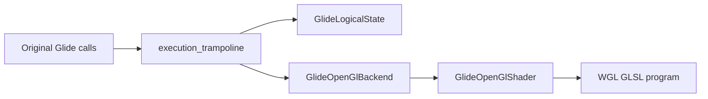

# 아키텍처

## 목적

이 문서는 현재 구현되는 코드의 설계와 구조를 지속적으로 기록한다.

코드 구조가 바뀌거나 새 하위 시스템이 추가되면, 해당 작업의 설계 문서와 함께 이 문서를 갱신해야 한다.

## Purpose

This document continuously records the design and structure of the code currently being implemented.

When code structure changes or a new subsystem is added, this document must be updated together with the task design document.

## 현재 상태

현재 저장소는 문서와 원본 자산 중심이며, 첫 C++ 구현으로 비실행 실행 파일 분석 도구를 추가한다.

첫 구현 대상은 `MASTER\PIU_1ST\PIU.EXE`를 실행하지 않고 분석하는 도구이다.

## Current State

The repository currently contains documentation and original assets, and the first C++ implementation adds a non-executing executable analysis tool.

The first implementation target is a non-executing analysis tool for `MASTER\PIU_1ST\PIU.EXE`.

## 예정 구조

예정된 공용 구조:

* `include/`: 외부에서 참조 가능한 프로젝트 C++ 헤더
* `src/`: 플랫폼 공용 로더와 런타임 코어
* `src/platform/win32/`: Win32 전용 실행, 메모리, 창, 입력, 파일 시스템 세부 구현
* `src/platform/linux/`: Linux 전용 세부 구현
* `src/platform/web/`: Web 전용 세부 구현

현재 추가되는 디렉터리:

* `include/repiu/exe/`: MZ/LE 실행 파일 분석용 공용 헤더
* `include/repiu/hle/`: 정적 HLE profile과 서비스 범위 공용 헤더
* `include/repiu/target/`: 정적 target profile과 target registry 공용 헤더
* `scripts/`: 반복 검증용 빌드 스크립트
* `src/exe/`: MZ/LE 파서 구현
* `src/hle/`: 정적 HLE profile 등록 구현
* `src/platform/win32/`: Win32 전용 실행 메모리 정책과 이후 실행 backend 구현 위치
* `src/target/`: 정적 target profile 등록 구현
* `src/tools/exe_analyzer/`: 비실행 콘솔 분석 도구

예정된 주요 모듈:

* `TargetRegistry`: 게임 타깃과 버전 선택. 현재 단계에서는 정적 C++ 등록 구조로 `piu_1st`를 제공한다.
* `TargetProfile`: 실행 파일 경로, 작업 디렉터리, 자산 루트, 포맷 힌트, HLE 프로파일 id, 버전별 메타데이터
* `HleProfileRegistry`: target이 참조하는 HLE 프로파일 선택. 현재 단계에서는 정적 C++ 등록 구조로 `piu_common`을 제공한다.
* `HleProfile`: target이 요구하는 DOS/DPMI/하드웨어 HLE 서비스 범위
* `ExecutableReader`: 원본 실행 파일과 관련 파일을 읽는 공용 파일 입력 계층
* `MzParser`: DOS MZ 헤더와 LE/LX 위치 파악
* `Dos4gwExecutableLoader`: target profile을 기준으로 MZ/LE 파싱, 이미지 매핑, fixup 분석, 내부 relocation dry-run을 하나의 load result로 묶는다.
* `LeParser`: LE 헤더, 오브젝트 테이블, 페이지 테이블, fixup page table, fixup record table 범위, 1차 fixup record 디코딩, 엔트리 포인트 파싱
* `ImageMapper`: 원본 보호 모드 코드가 기대하는 메모리 이미지 구성. 현재 단계에서는 `Dos4gwExecutableLoader`를 통해 내부 relocation dry-run, skipped source 관찰 정보, full source type 분포를 제공한다.
* `RuntimeMemory`: 실행 메모리, 스택, 힙, selector 추상화, HLE 영역 관리. 현재 단계에서는 실행 메모리를 할당하지 않고 object region, entry, stack top, HLE reserve base를 계산하는 dry-run을 제공한다.
* `Win32RuntimeMemoryPolicy`: Win32 host pointer size, 32-bit direct execution 가능 여부, preferred allocation base, reserve size를 보고한다. 현재 단계에서는 실제 메모리를 할당하지 않는다.
* `Win32 x86 Build`: 원본 32-bit x86 entry 직접 실행을 준비하기 위해 `scripts/build_win32_x86.bat`로 `build\vs2022_win32_debug` 구성을 생성하고 검증한다.
* `ExecutionEngine`: 원본 32-bit x86 코드로 제어 이전
* `HleDispatcher`: DOS, DPMI, 타이머, 입력, 그래픽, 오디오, 파일 시스템 호출 처리
* `TraceLogger`: 로더 결정, HLE 호출, 예외, 실행 단계 기록
* `LeResidentName`: LE resident-name/ordinal과 decorated `@N` 인자 크기를 asset에서 복원한다.
* `VirtualGlideModule`: `glide2x.ovl`의 hardware code를 실행하지 않고 LINEXE handle과 asset-validated export gate를 제공한다.
* `GlideGateDispatcher`: `{linear address, client CS}` procedure pointer를 제공하고 ordinal별 trap에서 guest stdcall ABI를 해석한다. 현재 init/query/select까지 관찰 기반 최소 의미를 제공하며 `grSstWinOpen` presentation 정책이 다음 경계다.
* `GlideHle` (`include/repiu/hle/glide_hle.h`, `src/hle/glide_hle.cpp`): asset-derived export registry, ordinal gate image, decorated argument size, resolution decoding과 플랫폼 공용 논리 상태를 담당한다.
* `Win32GlideOpenGlBackend` (`include/repiu/platform/win32/glide_opengl_backend.h`, `src/platform/win32/glide_opengl_backend.cpp`): resizable 640×480 client window, WGL context, pixel/depth format, initial clear와 message pump를 담당한다.
* `Win32ExecutionTrampoline`은 Glide 구현을 직접 소유하지 않고 guest stack/register ABI를 공용 Glide HLE와 platform backend에 연결한다.
* `GlideSignatureCatalog`: 실제 관찰된 API의 stack byte count와 void/EAX/x87 반환 kind를 중앙에서 관리하며 asset `@N`과 교차 검증한다.
* `GlideLogicalState`는 lazy OpenGL texture object와 독립적으로 8 MiB virtual TMU 범위(`0..0x007FFFF8`)와 LFB pixel-format 상태를 보존한다.
* `Win32X87Context` (`include/repiu/platform/win32/x87_context.h`, `src/platform/win32/x87_context.cpp`): SEH `CONTEXT`의 x87 TOP/tag/80-bit register를 갱신하여 guest float 반환을 독립적으로 처리한다.

## Planned Structure

Planned shared structure:

* `include/`: project C++ headers intended for external inclusion
* `src/`: platform-neutral loader and runtime core
* `src/platform/win32/`: Win32-specific execution, memory, window, input, and filesystem details
* `src/platform/linux/`: Linux-specific details
* `src/platform/web/`: Web-specific details

Directories added now:

* `include/repiu/exe/`: public headers for MZ/LE executable analysis
* `include/repiu/hle/`: public headers for static HLE profiles and service scopes
* `include/repiu/target/`: public headers for static target profiles and target registry
* `scripts/`: build scripts for repeated verification
* `src/exe/`: MZ/LE parser implementation
* `src/hle/`: static HLE profile registration implementation
* `src/platform/win32/`: Win32-specific executable memory policy and future execution backend location
* `src/target/`: static target profile registration implementation
* `src/tools/exe_analyzer/`: non-executing console analysis tool
* `src/host/win32/`: Win32 loader application entry point. This is the practical loader path that selects a target, loads the DOS/4GW executable, builds a relocated image, places it in Win32 process memory, and performs the current minimal execution attempt.

Planned major modules:

* `TargetRegistry`: game target and version selection. The current step provides `piu_1st` through static C++ registration.
* `TargetProfile`: executable path, working directory, asset root, format hint, HLE profile id, version metadata, and target-specific early runtime reservation hints
* `HleProfileRegistry`: HLE profile selection referenced by targets. The current step provides `piu_common` through static C++ registration.
* `HleProfile`: DOS/DPMI/hardware HLE service scope required by a target
* `ExecutableReader`: shared file input layer for original executables and related files
* `MzParser`: DOS MZ header and LE/LX location
* `Dos4gwExecutableLoader`: groups MZ/LE parsing, image mapping, fixup analysis, and internal relocation dry-run into one load result based on the target profile.
* `LeParser`: LE header, object table, page table, fixup page table, fixup record table range, first-pass fixup record decoding, and entry point parsing
* `ImageMapper`: memory image expected by the original protected-mode code. The current step provides internal relocation dry-run, skipped source observability, and full source type distribution through `Dos4gwExecutableLoader`.
* `RuntimeMemory`: executable memory, stack, heap, selector abstraction, and HLE regions. The current step provides a dry-run that calculates object regions, entry, stack top, and HLE reserve base without allocating executable memory.
* `RuntimeMemoryArenaPlan`: shared runtime arena reserve planning. It combines the current image reserve size with observed expansion slack so DOS/4G post-resize writes can be backed by host memory. The Win32 loader uses this reserve size for relocated-base probing and image placement.
* The Win32 traced memory-store path keeps narrowly bounded shadow memory for observed allocator failure metadata outside the committed arena. A `C7 /0` dword sentinel store of `0xFFFFFFFF` is accepted only within 1 MiB after the arena end; unrelated out-of-arena stores remain fatal so missing mappings are not hidden.
* An `89 /r` store may extend that allocator shadow only when the first header value exactly equals the distance to the existing sentinel, or when a later field falls inside or immediately after the resulting shadow range. This preserves allocator metadata relationships without turning shadow memory into a general substitute for missing guest mappings.
* Objects whose base register is inside the final 64 bytes of the arena may preserve `C7 /0`, `89 /r`, and `D9 /2-/3` fields that cross no more than 64 bytes beyond arena end. The base must remain inside real guest memory; objects whose base is already outside the arena are not covered by this boundary-tail policy.
* A contiguous object array may continue that boundary tail when each next base exactly matches the recorded frontier. Its span is derived from the observed `ESI` count times `EDX` stride, accepted only between 64 bytes and 1 MiB, and otherwise falls back to 4 KiB. The independent one-second execution timeout remains the final observation bound.
* An unprefixed `8B /r` low-memory read inside the first 4 KiB uses zero-backed DOS memory after real-arena and shadow-memory misses when a guest `DS` selector is active. It does not add the relocated image base to a guest low-memory offset.
* A faulting `03 /r` with a complete dword source in shadow memory performs the 32-bit ADD on the ModRM-selected register and restores `CF/PF/AF/ZF/SF/OF`; mapped-memory ADD remains on the direct CPU path.
* A faulting `83 /1` no-SIB dword destination in shadow memory performs OR as a read-modify-write, records the resulting store, clears `CF/OF`, updates `PF/ZF/SF`, and preserves undefined `AF`.
* A faulting `38 /r` no-SIB byte source in shadow memory compares it with the ModRM-selected legacy byte register and restores `CF/PF/AF/ZF/SF/OF` without modifying either operand.
* The allocator probe at relocated offset `0xF7A71` records only the confirmed request sizes `0x2C` and `0x1008`. The header OR at `0xF7AD4` then binds that request to a block and exposes only `[block+4, block+size-4)` as zero-backed shadow payload. Explicit shadow bytes override zero backing; unconfirmed sizes and unrelated holes remain faults.
* `RelocatableRuntimeImage`: primary execution memory direction after fixed low-address reservation proved unreliable in Win32 x86. This subsystem maps original LE object bases to a safe runtime base, reapplies LE relocation records for the new addresses, and calculates relocated entry and stack addresses while preserving original game code. The current dry-run uses `0x01000000` as the relocated image base and does not allocate or write executable memory.
* `RelocatedRuntimeImage`: materialized C++ buffer form of the relocatable plan. It copies each mapped LE object into owned buffers and writes supported 32-bit internal relocation values for the relocated base. This still does not allocate executable OS memory or call original code.
* `Win32RelocatedImagePlacement`: Win32 process-memory placement for relocated image buffers. It reserves and commits the relocated image range, copies object buffers, applies minimal object protection from LE flags, and releases the range without transferring control to original code.
* `Win32MinimalExecutionTrampoline`: first observation-only execution path. It calls the relocated entry from a separate thread, catches SEH exceptions, and reports return/exception/timeout. It does not yet switch to the guest stack or dispatch HLE traps.
* `Win32ExecutionSnapshot`: grouped x86 guest register observation state used by the Win32 execution path. Timeout handling now exposes a `timeout_snapshot` output slot and reports whether it was captured. Forced `SuspendThread`/`GetThreadContext` capture is not enabled for the current `piu_1st` timeout state because it hangs the loader; follow-up work should use a safer sampling watcher or HLE-routed trace to fill this structure.
* `Win32ExceptionDispatchLiveness`: the vectored exception route atomically counts valid handler entries and RAII-guarded exits and records the last entry EIP. It does not suspend the guest or alter dispatch. An outstanding count of one at quiet timeout proves that polling expired while one handler invocation had not returned; equal counts prove no dispatch remained active.
* `Win32AllocatorProbeObservation`: a diagnostic-only 16-entry ring for exact relocated offset `0xF7A71`. It records EAX, ESI/decoded source, DS, pending allocation state before/after, and the handling result. Sequence numbers preserve chronological output after overwrite without allowing trace memory to grow.
* `Win32AllocatorControlFlowObservation`: a diagnostic-only 32-entry ring for exception entries in relocated allocator range `[0xF7A71, 0xF7AD5)`. It records exception code, four opcode bytes, core allocator registers, flags, and pending state without modifying dispatch. The range exposes free-list traversal and metadata update paths while keeping storage bounded.
* `Win32ShadowWriteProvenance`: an allocation-free 256-entry ring that records recent shadow writes and correlates complete dword allocator reads with a writer when one retained write covers all four bytes. A dynamic `unordered_map` prototype was rejected after causing `0xC0000374` heap corruption in the exception path.
* `DosLowMemory`: shared fixed 64 KiB DOS low-memory backing with checked little-endian byte/word/dword reads and up-to-dword writes. It starts zeroed and does not synthesize IVT, BIOS, environment, extender-private, or allocator state.
* `SelectorTable` now provides checked selector base/limit translation. Observed segment loads provisionally register a present base-zero, 64 KiB descriptor until DPMI descriptor lifecycle services are modeled. Win32 FS-word and generic DS low-memory reads use this translation instead of an implicit numeric-offset zero fallback.
* `Win32SegmentLoadObservation`: a diagnostic-only 16-entry ring for segment-load HLE events. It records relocated EIP, target segment register, selector, and source, exposing the stable PIU sequence that loads DS/FS selector `0x2C` from image address `0x021A664D`.
* `Win32RuntimeMemoryPolicy`: reports Win32 host pointer size, 32-bit direct execution support, preferred allocation base, and reserve size. The current step does not allocate memory.
* `Win32AddressRangeProbe`: checks the required Win32 runtime address range with `VirtualQuery` before any allocation. It reports whether the fixed DOS/4GW image range is free and records the first blocking memory block when it is occupied. This is a dry-run only and does not reserve executable memory.
* `Win32AddressRangeReservation`: attempts to reserve the fixed original runtime address range with `VirtualAlloc(MEM_RESERVE)` and reports success or the Windows error code without executing original code.
* `Win32HostImageBasePolicy`: configures 32-bit Win32 executable targets so the host image base stays outside both the original DOS/4GW fixed image range and the relocated image range. The current baseline applies `/BASE:0x10000000` and `/DYNAMICBASE:NO` to Win32 x86 host targets.
* `Win32LoaderApp`: dedicated Win32 loader executable target named `repiu_loader_win32`. It owns the current loader orchestration path: target selection, executable read, DOS/4GW load, relocated image planning, relocated buffer creation, Win32 process-memory placement, and minimal execution trampoline invocation. In addition to built-in target ids, it can accept a direct DOS/4GW executable path and run it through a temporary `direct_executable` target using the `dos4gw_console_sample` HLE profile. This keeps local sample testing from adding one target profile per executable.
* `DosVirtualFileSystem`: shared HLE state for DOS path resolution and file handles. It treats the target profile working directory as the virtual DOS drive root, keeps a virtual current directory without changing the host process current directory, and currently handles `INT 21h AH=0x3B` chdir plus `INT 21h AH=0x3D` open path resolution/handle allocation.
* `Win32SegmentMemoryLoadHle`: observation-driven segment override memory access HLE in the Win32 execution trampoline. The current scope handles the traced `26 8A 4F FF` byte load as `ES:[EDI - 1]`, returns the DOS command tail length byte for `ES:0x80`, and records the handled segment memory load in the execution attempt.
* `Win32 x86 Build`: prepares direct original 32-bit x86 entry execution by generating and verifying the `build\vs2022_win32_debug` configuration through `scripts/build_win32_x86.bat`.
* `OpenWatcomLocalSampleSuite`: script-driven compatibility report for local OpenWatcom samples. `scripts/build_openwatcom_samples.ps1` enumerates every source in the selected local `tools/openwatcom/samples/clibexam` and `tools/openwatcom/samples/cplbexam` suites, applies a DOS/4GW console build plan for known option-sensitive samples, explicitly marks samples outside that target as skipped, builds the remaining sources into Git-excluded `build/openwatcom_samples/`, and writes a stable manifest. The script can also skip the Win32 host rebuild with `-SkipHostBuild` when only sample build-plan validation is needed. `scripts/test_openwatcom_samples.ps1` then runs the manifest's built EXEs through the loader direct path, writes an HTML pass-rate report plus summary JSON under `build/openwatcom_sample_report/`, and can compare against or update the Git-tracked baseline at `tests/baselines/openwatcom_samples.json`. Baseline updates also append dated, versioned milestone JSON and matching HTML reports under `tests/history/openwatcom_samples/` for future dashboard and inspection use. OpenWatcom sample sources and EXEs are not committed because their license is not the project default BSD 3-Clause baseline.
* `ExecutionEngine`: control transfer to original 32-bit x86 code
* `HleDispatcher`: DOS, DPMI, timer, input, graphics, audio, and filesystem calls
* `TraceLogger`: loader decisions, HLE calls, exceptions, and execution milestones
* `LeResidentName`: recovers LE resident names, ordinals, and decorated `@N` argument sizes from the user asset.
* `VirtualGlideModule`: exposes a LINEXE handle and asset-validated export gates without executing `glide2x.ovl` hardware code.
* `GlideGateDispatcher`: returns `{linear address, client CS}` procedure pointers and decodes guest stdcall ABI at ordinal traps. Observation-backed init/query/select semantics are present; `grSstWinOpen` presentation policy is the next boundary.
* `GlideHle` (`include/repiu/hle/glide_hle.h`, `src/hle/glide_hle.cpp`) owns the asset-derived export registry, ordinal gate image, decorated argument sizes, resolution decoding, and platform-neutral logical state.
* `Win32GlideOpenGlBackend` (`include/repiu/platform/win32/glide_opengl_backend.h`, `src/platform/win32/glide_opengl_backend.cpp`) owns the resizable 640×480 client window, WGL context, pixel/depth format, initial clear, and message pump.
* `Win32ExecutionTrampoline` does not own Glide implementation details; it connects guest stack/register ABI to shared Glide HLE and the platform backend.
* `GlideSignatureCatalog` centrally records observed API stack-byte counts and void/EAX/x87 return kinds, cross-checked against asset `@N` metadata.
* `GlideLogicalState` exposes an 8 MiB virtual TMU range (`0..0x007FFFF8`) independently of lazy OpenGL texture objects and retains LFB pixel-format state.
* `Win32X87Context` (`include/repiu/platform/win32/x87_context.h`, `src/platform/win32/x87_context.cpp`) independently updates x87 TOP, tags, and 80-bit registers in an SEH `CONTEXT` for guest float returns.

## 갱신 규칙

* 코드 구조가 추가되거나 변경되면 이 문서를 같은 작업 단위에서 갱신한다.
* 플랫폼 공용 구조와 플랫폼별 세부 구조를 분리해서 기록한다.
* 임시 구현이라도 후속 정리 방향을 적는다.

## Update Rules

* Update this document in the same task unit whenever code structure is added or changed.
* Record platform-neutral structure separately from platform-specific details.
* Even for temporary implementation, record the intended follow-up direction.

## Glide GLSL renderer boundary

`GlideLogicalState`는 원본 Glide enum과 초기 raster state를 플랫폼 중립적으로 보존합니다. `GlideOpenGlBackend`는 WGL window/context와 OpenGL 상태 변환을 소유하고, 별도 `GlideOpenGlShader`가 shader entry-point 해석, compile/link, program과 combine uniform을 소유합니다. `execution_trampoline`은 guest stack ABI 해석과 상태 전달만 담당합니다.

## Glide GLSL renderer boundary

`GlideLogicalState` preserves original Glide enums and initial raster state without platform dependencies. `GlideOpenGlBackend` owns the WGL window/context and OpenGL state translation, while the separate `GlideOpenGlShader` owns shader entry-point resolution, compilation/linking, the program, and combine uniforms. `execution_trampoline` is limited to guest stack ABI decoding and state forwarding.

Glide gate live telemetry version 5 publishes ordinal, ESP, EBX/ECX/EDX, and eight stack dwords. This diagnostic boundary preserves caller evidence when an unimplemented gate terminates the child. Screen width/height return integer values in EAX as proven by the original caller; documented API type assumptions never override binary call-site evidence.

Glide2 state save/restore uses a fixed 312-byte platform-neutral image. Shared HLE code owns deterministic little-endian serialization and validation; guest ABI code only performs range-checked transfer and stdcall return. The image contains no host pointer. Unknown bytes are zero, and unencoded logical fields are preserved during the currently observed immediate opaque round-trip. Renderer backend replay is required before supporting Get/Set pairs with intervening state mutations.

Observed dither mode 2 is stored in `GlideLogicalState`, serialized in state-image version 2, and delegated to host `GL_DITHER`. This is a compatibility stage, not a pixel-fidelity claim. A future replaceable shader policy may implement verified Voodoo ordered dithering without changing guest ABI integration.

## Win32 로더 앱 배치

현재 실제 Win32 로더 executable target은 `repiu_loader_win32`이다.

진입점은 `src/host/win32/main.cpp`에 두며, `src/tools/` 아래의 분석 도구와 구분한다.

이 진입점은 현재 target profile 선택, 원본 executable 읽기, DOS/4GW load result 생성, relocated runtime image plan 생성, relocated image buffer 생성, Win32 process memory 배치, minimal execution trampoline 호출을 순서대로 담당한다.

`src/tools/exe_analyzer/`는 계속 비실행 분석 도구로 남긴다.

## Win32 Loader App Layout

The current practical Win32 loader executable target is `repiu_loader_win32`.

Its entry point lives in `src/host/win32/main.cpp`, separate from analysis tools under `src/tools/`.

This entry point currently owns target profile selection, original executable reading, DOS/4GW load result creation, relocated runtime image planning, relocated image buffer creation, Win32 process-memory placement, and minimal execution trampoline invocation.

`src/tools/exe_analyzer/` remains a non-executing analysis tool.

## Win32 Loader Log Level Policy

Win32 loader logs use levels to separate normal progress from the current implementation blocker.

The loader log pattern is `[%X.%e] [%8l] [%n] %v`.
This prints millisecond timestamps, fixed-width level names, logger name, and message text.

`info` is used for normal loader progress, selected runtime addresses, successful placement, handled HLE/DOS/segment counts, and normal guest output.

`warn` is used for expected host-environment constraints that the loader can work around, such as fixed low-address range probe or reservation failure followed by relocated execution.

`error` is used for loader-stage failures and for the current original-code execution blocker. When original entry execution stops with a caught SEH exception, the exception registers, relocated byte window, unknown instruction classification, and current blocker message are printed as `error` while preserving the existing observation-oriented process exit behavior.
# DOS4GW object selector allocation / DOS4GW object selector 할당

PIU의 외부 DOS4GW `LINEXE.EXP` loader는 LE object마다 DPMI descriptor를 동적으로 하나씩 할당하고 base, limit, access rights를 설정한다. Runtime image materialization은 이 순서를 `SelectorAllocator`로 모델링하고, 할당 결과를 16:16 far-pointer fixup 및 실행 `SelectorTable`에 동일하게 사용한다. PIU 프로필의 첫 object selector `0x1C`는 관찰된 object 2=`0x24`, object 3=`0x2C`에서 역산한 초기 DPMI 상태이며 LE object 번호의 고정 공식이 아니다.

The external DOS4GW `LINEXE.EXP` loader dynamically allocates one DPMI descriptor per LE object, then sets its base, limit, and access rights. Runtime image materialization models this order with `SelectorAllocator` and uses each allocation result for both 16:16 far-pointer fixups and the execution `SelectorTable`. The PIU profile's first object selector, `0x1C`, is inferred from the observed object 2=`0x24` and object 3=`0x2C` values; it is initial DPMI state, not a fixed formula derived from the object index.

## Live execution telemetry / 실시간 실행 telemetry

Single-step PIU 실행은 guest/host 공유 atomic heartbeat를 사용한다. host poll은 시작 시점과 1초 간격으로 stderr snapshot을 출력할 수 있다. quiet timeout은 poll iteration 수가 아니라 1초의 wall-clock 정체로 판단한다. timeout observation은 guest thread를 종료하고 join한 뒤 복사하여 guest가 수정 중인 비원자 container와의 data race를 방지한다.

Single-step PIU execution uses atomic heartbeat state shared by the guest and host. The host poll can emit stderr snapshots at startup and once per second. Quiet timeout is based on one second of wall-clock inactivity rather than poll iteration count. Timeout observations are copied only after terminating and joining the guest, preventing races with non-atomic containers still being modified by the guest.

Child 내부 telemetry를 회수할 수 없는 경우 `repiu_supervisor_win32`가 named shared memory를 생성하고 mapping 이름을 환경 변수로 전달한다. loader의 host/guest는 고정 버전 POD에 interlocked write하고 supervisor는 child 출력과 독립적으로 snapshot을 읽고 deadline에 child를 terminate/join한다.

When child-local telemetry cannot be recovered, `repiu_supervisor_win32` creates named shared memory and passes its mapping name through the environment. Loader host/guest paths use interlocked writes into a versioned POD, while the supervisor reads snapshots independently of child output and terminates/joins the child at a deadline.

## Contiguous allocator arena / 연속 allocator arena

PIU 프로필은 LE image reserve 뒤에 16 MiB의 실제 contiguous expansion을 둔다. 현재 Win32 placement는 전체 `0x015D7000` 범위를 reserve/commit하여 원본 guest load/store가 arena 확장 객체를 직접 접근하게 한다. shadow memory는 실제 arena 밖의 진단 안전망이며 정상 allocator backing을 대신하지 않는다.

The PIU profile provides 16 MiB of real contiguous expansion after the LE image reserve. Current Win32 placement reserves and commits the full `0x015D7000` range so original guest loads/stores directly access expanded allocator objects. Shadow memory remains a diagnostic safety net outside the real arena and does not replace normal allocator backing.

## Shadow segment synchronization / Shadow segment 동기화

Single-step HLE가 처리한 segment load는 `ThreadContext` shadow selector를 변경한다. 원본 코드가 stack으로 selector를 복원하는 관찰된 32비트 `POP DS`도 HLE가 `[ESP]`의 selector를 읽고 shadow DS 및 ESP/EIP를 함께 갱신한다. access-violation HLE 뒤에도 후속 segment 복원을 관찰할 수 있도록 single-step 모드에서는 guest exception dispatch가 TF를 보존한다.

Segment loads handled by single-step HLE update the shadow selector in `ThreadContext`. For the observed 32-bit POP DS restoration, HLE reads the selector from `[ESP]` and updates shadow DS, ESP, and EIP together. Guest exception dispatch preserves TF in single-step mode so later segment restoration remains observable after access-violation HLE.

연속된 지원 segment load는 한 single-step dispatch에서 함께 처리하여 첫 명령을 건너뛴 뒤 두 번째 명령이 shadow 갱신 없이 native 실행되는 것을 막는다. 관찰된 EAX=0/DF=0 `REP STOSD`는 전체 destination span이 guest arena 안일 때 일괄 zero-fill한다.

Adjacent supported segment loads are consumed in one single-step dispatch so the second instruction cannot execute natively without a shadow update after the first is skipped. The observed EAX-zero/DF-clear REP STOSD is batched only when its entire destination span lies inside the guest arena.

관찰된 register-direct `MOV r16,Sreg`는 Win32 실제 segment selector가 guest로 누출되지 않도록 shadow selector를 목적 register 하위 16비트에 기록한다.

Observed register-direct MOV r16,Sreg instructions write the shadow selector into the destination register's low 16 bits so native Win32 segment selectors cannot leak into guest state.

Descriptor-backed segment byte reads translate selector+offset through `SelectorTable`, use DOS low-memory backing below 64 KiB, and otherwise read only validated guest arena memory. Observed ES-prefixed byte MOV and CMP forms use shadow registers and x86 byte arithmetic flags.

## 원본 fatal tail 실행 / Original fatal-tail execution

guest breakpoint는 기본적으로 중단한다. 단, 원본 image 내부에서 `CC 52 E8 rel32 F4` fatal-tail signature가 확인되면 breakpoint 주소와 `EDX` ASCIZ message를 기록한 뒤 원본 `push edx; call error-printer`로 재개한다. 이 경로에서 관찰된 DOS `AH=09h`, low-memory register-frame `REP MOVS`, 제한된 DPMI `AX=0300h/BL=2Fh`를 HLE하고, 원본 DOS terminate를 우선한다.

Guest breakpoints stop by default. Only a confirmed `CC 52 E8 rel32 F4` fatal-tail signature inside the original image records the breakpoint and bounded `EDX` ASCIZ message, then resumes the original `push edx; call error-printer`. The observed DOS `AH=09h`, low-memory register-frame `REP MOVS`, and narrowly scoped DPMI `AX=0300h/BL=2Fh` path are handled while preserving the original DOS termination path.

## Win32 VEH and host recovery boundary

The guest worker owns one process-global active VEH context because guest execution is serialized per loader process. The parent removes the VEH only after joining the worker. Host-side WGL exception `0x406D1388` is passed to the Windows exception chain. Guest-stack recovery records the entry-time segment selectors and clears TF/DF; reliable DS/FS restoration before returning to compiler-generated C++ remains the current recovery frontier.

Host recovery now saves entry-time selectors in serialized global recovery slots and reads them with a `CS:` override before returning to C++. Residual single-step exceptions at host addresses clear TF and continue without nested guest recovery. The worker that created WGL resources closes them after recovery; the parent removes the VEH after join. DOS stdout and stderr are accumulated separately and emitted through an executable-name spdlog logger at info and error levels.

DOS file diagnostics include a bounded 64-entry read/seek ring. It preserves chronological handle, path, position, size, result, guest EIP/ESP, eight stack dwords, and bounded read-prefix evidence without changing guest-visible file behavior. The protected-mode DOS/4GW `INT 21h AH=3Fh` bridge consumes the 32-bit byte count in `ECX` and returns the 32-bit byte count in `EAX`; reducing these values to real-mode `CX/AX` breaks large Watcom reads.
