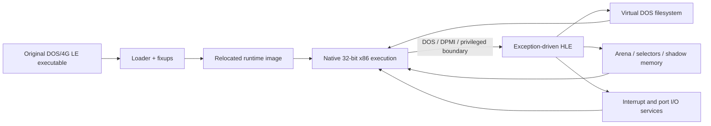

# rePIU


rePIU는 DOSBox나 전체 PC 에뮬레이터를 포함하지 않고, 원본 DOS/4G 기반 PIU 실행 파일의 32비트 x86 코드를 네이티브로 실행하기 위한 실험적 런타임입니다. 게임 로직은 원본 코드에 남겨 두고 DOS, DPMI, 메모리, 파일 시스템과 하드웨어 경계만 High Level Emulation(HLE)으로 제공합니다.

현재 버전은 [VERSION](VERSION)에서 확인할 수 있습니다.

*rePIU is an experimental runtime for executing the original 32-bit x86 code of DOS/4G-based PIU binaries without embedding DOSBox or a full PC emulator. Original game logic remains authoritative; only DOS, DPMI, memory, file-system, and hardware boundaries are replaced with High Level Emulation (HLE). See [VERSION](VERSION) for the current version.*

> [!WARNING]
> 현재는 연구·개발 단계이며 완성된 게임 런처가 아닙니다. 기본 실행 호스트는 32비트 Windows이고, 타이틀별 호환성은 계속 개발 중입니다.
>
> *This is research-stage software, not a finished game launcher. The current execution host is 32-bit Windows, and per-title compatibility remains under development.*

## 주요 특징 / Why rePIU

* **원본 로직 보존:** 게임플레이를 C++로 재작성하지 않고 원본 x86 코드를 주 실행 경로로 유지합니다.
* **선별적 HLE:** 관찰된 DOS interrupt, DPMI, port I/O와 메모리 동작만 좁은 범위로 대체합니다.
* **DOS/4GW LE 분석:** executable object, fixup, relocation과 runtime image 배치를 분석할 수 있습니다.
* **교체 가능한 구조:** loader, runtime memory, selector, DOS filesystem, HLE profile과 target profile을 분리합니다.
* **재현 가능한 진척 기록:** 설계, 작업 지시, 실행 분석과 기술 지식을 저장소 문서로 누적합니다.

*The project preserves original x86 game logic, applies narrowly scoped HLE at observed environment boundaries, analyzes DOS/4GW LE images and relocations, separates replaceable runtime subsystems, and keeps reproducible design and reverse-engineering records.*

## 동작 방식 / How it works



DOS 날짜는 실행 context 안에서 가상화됩니다. `INT 21h/AH=2Bh`로 날짜를 설정하면
이후 `AH=2Ah` 조회에 반영되지만 Windows host의 시스템 날짜는 변경하지 않습니다.

*The DOS date is virtualized per execution context. A date set through
`INT 21h/AH=2Bh` is returned by later `AH=2Ah` queries without changing the
Windows host system date.*

현재 내장 타깃은 검증 sample과 22개 MAME PIU profile입니다.

| 타깃 | 용도 | 상태 |
| --- | --- | --- |
| `dos4gw_hello` | OpenWatcom으로 빌드하는 최소 DOS/4GW 검증 프로그램 | 실행 및 출력 검증 |
| `pumpit1`~`pumpipx3b` | 사용자가 제공한 MAME 형식 PIU ROM/CHD 자산 | 타이틀별 HLE 호환성 개발 중 |

*The built-in targets are the minimal OpenWatcom `dos4gw_hello` validation program and 22 MAME-format PIU profiles from `pumpit1` through `pumpipx3b`.*

## 요구 사항 / Prerequisites

* Windows 10/11 x64 호스트
* Visual Studio 2019 이상 또는 Build Tools의 **Desktop development with C++** 워크로드와 x86 toolchain
* CMake 3.20 이상
* Git for Windows와 Windows PowerShell
* 최초 의존성 준비를 위한 인터넷 연결
* 게임 실행 시 합법적으로 보유한 해당 MAME ROM ZIP과 CHD

빌드는 반드시 `Win32`/x86로 생성됩니다. CMake는 설치된 `spdlog`를 먼저 찾고, 없으면 configure 과정에서 `spdlog` 1.14.1을 가져옵니다. 테스트 setup은 OpenWatcom을 `tools/openwatcom/`에 로컬 설치할 수 있습니다.

*Builds target Win32/x86. CMake uses an installed `spdlog` package or fetches version 1.14.1 during configuration. Test setup can install OpenWatcom locally under `tools/openwatcom/`.*

## 시작하기 / Getting started

### 1. 저장소 복제 / Clone

```powershell
git clone https://github.com/nworkers/rePIU.git
cd rePIU
```

### 2. 원본 자산 배치 / Supply original assets

MAME 형식 asset으로 실행하려면 다음처럼 배치합니다. `roms/` 전체는 Git에서 제외됩니다.

```text
roms/
├── <rom-set>.zip
└── <rom-set>/
    └── <disc>.chd
```

지원하는 MAME CHD profile은 `pumpit1`, `pumpit2`, `pumpit2a`, `pumpit3`, `pumpit3a`,
`pumpito`, `pumpitc`, `pumpitpc`, `pumpitpr`, `pumpitpru`, `pumpite`, `pumpitea`,
`pumpitpx`, `pumpit8`, `pumpitp2`, `pumpipx2`, `pumpipx2p`, `pumpitp3`, `pumpitp3a`,
`pumpipx3`, `pumpipx3a`, `pumpipx3b`입니다. 각 profile은 자신의 ZIP/CHD와
`build/runtime_mounts/<rom-set>/` mount를 유지합니다. CAT702 항목이 현재 세트 이름으로
없으면 profile에 명시된 부모 이름을 같은 ZIP에서 확인하고, 이어서 형제 경로의 부모
ZIP을 확인합니다. 항목 없음만 fallback하며 읽기·추출·CRC 오류는 실패로 유지합니다.
CHD identity가 같으면 materialized ISO9660 cache를 재사용합니다.

*The 22 supported MAME CHD profiles follow the catalog order from `pumpit1` through
`pumpipx3b`, including clone/date variants. Each validates the required entries in its matching
ROM set, mounts the CHD's ISO9660 tree under `build/runtime_mounts/<rom-set>/`, and starts
`PIU/PIU.EXE`. Each clone retains its own ZIP/CHD and mount. If its current-named CAT702
member is absent, setup checks the parent-named member in the same ZIP and then the sibling
parent ZIP. Only a missing member permits fallback; read, extraction, and CRC failures remain
fatal. An unchanged CHD identity reuses the cache.*

PIU10 profile의 MP3 시작 지연 기본값은 0 ms입니다. 실행 전에 `REPIU_PIU10_MP3_LATENCY_MS`를 0~500의 정수로 지정하면 밀리초 단위로 덮어쓸 수 있습니다. `REPIU_PIU10_DAC_AUDIT=1`은 DAC3350A 제어 transaction과 그 순간의 PCM queue, audio device buffer, compressed ring, decoder pending 상태를 기록합니다. 반복 측정과 해석 절차는 [PIU10 DAC audio backlog 감사 가이드](docs/guides/piu10-dac-audio-backlog-audit.md)를 따릅니다.

*PIU10 profiles default to zero milliseconds of MP3 startup latency. Set `REPIU_PIU10_MP3_LATENCY_MS` to an integer from 0 through 500 before launch to override it in milliseconds. `REPIU_PIU10_DAC_AUDIT=1` records DAC3350A control transactions together with the PCM queue, audio-device buffer, compressed ring, and decoder-pending state at that instant. Follow the [PIU10 DAC audio backlog audit guide](docs/guides/piu10-dac-audio-backlog-audit.md) for repeatable capture and interpretation.*

### 3. 환경 준비와 전체 검증 / Set up and test

PowerShell에서 저장소 루트를 기준으로 실행합니다.

```powershell
powershell -ExecutionPolicy Bypass -File scripts/setup_test_environment.ps1
powershell -ExecutionPolicy Bypass -File scripts/test_all.ps1 -SkipSetup
```

첫 명령은 Git, CMake, Visual Studio x86 도구와 `pumpit1` 자산을 확인하고 필요하면
OpenWatcom을 설치합니다. 두 번째 명령은 Win32 host와 sample을 빌드하고 target registry
probe를 검증합니다.

### 4. 빌드만 수행 / Build only

```powershell
cmd /c scripts\build_win32_x86.bat
```

출력은 `build/win32_x86_debug/Debug/`에 생성됩니다.

### 6. Linux 빌드 / Linux build

플랫폼 공용 코어, 실행 엔진, 로더와 probe는 Linux에서 i386으로 빌드됩니다. Task 506부터
기본 `dynamic` AOT backend도 Linux에서 실행되며, WSLg의 `pumpit1`에서 실제 Glide 버퍼 스왑과
non-black 픽셀이 확인되었습니다.

*The platform-neutral core, execution engine, loader, and probes build as i386 on Linux. Since
Task 506 the default `dynamic` AOT backend runs there as well; real Glide buffer swaps and non-black
pixels have been confirmed with `pumpit1` under WSLg.*

```bash
sudo apt update && sudo apt install -y gcc-multilib g++-multilib libc6-dev-i386
scripts/build_linux_i386.sh --config Debug --target repiu --target repiu_core_probe
build/linux_i386/repiu_core_probe
REPIU_GLIDE_PIXEL_DIAG=1 build/linux_i386/repiu pumpit1
```

`repiu_core_probe`는 플랫폼에 의존하지 않는 probe 15개를 담고 **양쪽 OS에서 모두**
빌드되므로, 같은 코드가 두 환경에서 같은 결과를 내는지 직접 비교할 수 있습니다. Windows
에서는 `repiu_aot_probe`가 같은 probe를 계속 포함합니다.

*`repiu_core_probe` contains 15 platform-independent probes and builds on both operating systems,
so the same contracts can be compared directly. On Windows, `repiu_aot_probe` continues to include
the same probes.*

런처는 Linux에서도 뜹니다. 32비트 데스크톱 개발 패키지가 필요합니다.

```bash
sudo dpkg --add-architecture i386 && sudo apt update
sudo apt install -y libx11-dev:i386 libxext-dev:i386 libxrandr-dev:i386   libxi-dev:i386 libxcursor-dev:i386 libxfixes-dev:i386 libxkbcommon-dev:i386   libgl1-mesa-dev:i386 libasound2-dev:i386
scripts/build_linux_i386.sh --config Debug --target repiu_launcher
build/linux_i386/repiu_launcher
```

독립 `repiu_launcher`의 롬셋 목록과 옵션은 Windows와 같은 코드입니다. 게임은 위의 `repiu`
실행 파일로 직접 시작합니다. 데스크톱 패키지 없이 코어와 probe만 빌드하려면 `--headless`를
주십시오.

*The standalone `repiu_launcher` shares its ROM-set list and options with Windows. Start games
directly through the `repiu` executable shown above. Pass `--headless` when only the core and probes
are needed without desktop packages.*

### 5. Release 빌드 / Release build

```powershell
cmd /c scripts\build_win32_x86_release.bat
```

출력은 `build/win32_x86_debug/Release/`에 생성됩니다. 빌드 트리는 multi-config이므로
디렉터리 이름은 과거 명칭이며 두 구성이 같은 트리를 공유합니다.

특정 타깃만 빌드하려면 다음처럼 인자를 넘깁니다.

```powershell
powershell -ExecutionPolicy Bypass -File scripts/build_win32_x86.ps1 -Configuration Release -Target repiu_aot_probe
```

**정확성 검증은 Debug, 성능 측정은 Release로 나눕니다.** Task 330에서 plan build의
Debug 계수가 11.34배였고 단계 순위까지 뒤집혔기 때문에, Debug에서 측정한 시간은
최적화 근거로 쓸 수 없습니다.

*Correctness work stays on Debug for its assertions; every performance number must come from the
Release build, because Task 330 measured an 11.34x Debug factor that also inverts the stage
ranking. Both configurations share one multi-config build tree, so the directory name is
historical.*

## 사용 예 / Usage

### 런처 / Launcher

인자 없이 실행하면 런처가 열려 롬셋 목록을 보여주고, 고른 롬셋을 같은 프로세스에서
실행합니다.

```powershell
build\win32_x86_debug\Debug\repiu.exe
```

목록에는 내장 카탈로그의 롬셋이 **전부** 나오고, 실행할 수 없는 것은 사유와 함께 흐리게
표시됩니다(`roms\<id>.zip` 없음, 필수 PIU10 엔트리 없음, `roms\<id>\` 없음, CHD 없음,
CHD가 둘 이상). 어떤 디스크가 왜 안 되는지 목록에서 바로 확인할 수 있습니다.

vsync와 사운드 게인은 런처에서 바꿔 `cfg\repiu.ini`에 저장합니다. **같은 의미의 환경
변수가 설정돼 있으면 환경 변수가 이깁니다** — 측정 스크립트와 진단 절차가 계속 우선권을
갖습니다.

게임을 끝내면 런처로 돌아오므로 다른 롬셋을 이어서 고를 수 있습니다. 종료는 런처의
Quit입니다.

인자를 하나라도 주면 런처는 뜨지 않고 기존 동작 그대로이며, **게임이 끝나면 프로세스도
완전히 종료됩니다**(복귀 루프는 단독 실행에만 있습니다). 인자 없이 실행하는 자동화를
위해 `REPIU_LAUNCHER=0`을 주면 런처를 건너뛰고 기존 기본값(`pumpit1`)으로 갑니다.

*Running with no arguments opens the launcher, which lists the ROM sets and starts the selected
one in the same process. Every catalog entry is listed, and the ones that cannot run are dimmed
with the reason — missing `roms\<id>.zip`, missing PIU10 entries, missing `roms\<id>\`, no CHD,
or more than one CHD — so it is clear why a disc is unavailable. Vertical sync and sound gain are
edited there and stored in `cfg\repiu.ini`; an environment variable of the same meaning always
wins, so measurement scripts keep control. Finishing a game returns to the launcher so another ROM set can be chosen, and Quit ends the
session. Passing any argument keeps today's behavior exactly and **ends the process when the game
ends**, since the return loop exists only for a standalone run; `REPIU_LAUNCHER=0` skips the
launcher for automation that runs the binary bare.*

### DOS/4GW sample 실행

```powershell
cmd /c scripts\build_dos4gw_hello.bat
build\win32_x86_debug\Debug\repiu.exe dos4gw_hello
```

정상 출력에는 다음 문자열이 포함됩니다.

```text
Hello, world!
```

### Pump It Up 실행 관찰

```powershell
build\win32_x86_debug\Debug\repiu.exe pumpit1
```

인자 없이 실행해도 기본 타깃 `pumpit1`을 선택합니다. 이전 임시 프로필 `piu_1st`는
내장 registry에서 제거됐습니다.

*Launching without an argument also selects the default `pumpit1` target. The former
temporary `piu_1st` profile is no longer part of the built-in registry.*

MAME CHD profile은 supervisor로 실행합니다.

```powershell
build\win32_x86_debug\Debug\repiu_supervisor_win32.exe pumpit1 600000
```

현재 이 명령은 완전한 게임 세션이 아니라 loader/HLE 진척과 진단 로그를 관찰하기 위한 개발 경로입니다.

### 키 설정 / Key configuration

롬셋마다 `cfg/<롬셋 ID>.ini`에서 발판과 캐비닛 버튼의 키를 바꿀 수 있습니다. 파일이 없으면
첫 실행 때 기본값이 주석 처리된 상태로 생성되므로, 바꾸고 싶은 줄의 `;`만 지우면 됩니다.

*Each ROM set can remap its stage panels and cabinet buttons through
`cfg/<rom-set-id>.ini`. The file is created on first run with every entry commented out,
so changing a binding means deleting the leading `;` on that line.*

```ini
[Input]
P1_UP_LEFT = Q
TEST       = Ctrl+F1
```

전체 키 이름 목록, 조합키 문법, 여러 롬셋에 한 번에 적용하는 방법은
[docs/guides/romset-config-files.md](docs/guides/romset-config-files.md)를 참고하세요.

*See [docs/guides/romset-config-files.md](docs/guides/romset-config-files.md) for the full
key name list, the combination syntax, and how to apply a setting to several ROM sets at
once.*

### 실행 파일 분석

```powershell
build\win32_x86_debug\Debug\repiu_exe_analyzer.exe pumpit1
build\win32_x86_debug\Debug\repiu_exe_analyzer.exe pumpit1 path\to\PIU.EXE
build\win32_x86_debug\Debug\repiu_exe_analyzer.exe path\to\another.exe
```

analyzer는 target profile, LE header/object, fixup, relocation, runtime memory dry-run 정보를 출력합니다.

## 진단 및 디버깅 / Diagnostics and debugging

rePIU는 런타임 동작 진단 및 문제 해결을 위해 다음과 같은 환경변수를 지원합니다.

* **`REPIU_DUMP_TEXTURE_BMP`**: `1`로 설정하면 Glide를 통해 로딩되는 텍스처를 디코딩하여 `build/texture_dumps/` 경로에 32비트 BGRA BMP 파일로 자동 저장합니다.
* **`REPIU_GLIDE_TEX_DIAG`**: 활성화하면 텍스처 업로드 시점의 원본 포맷과 dimensions 정보를 stderr 로그로 출력합니다 (최대 16회).
* **`REPIU_EXECUTION_BACKEND`**: 실행 backend를 `legacy` 또는 `dynamic`으로 고릅니다. 기본값은 `dynamic`이며, `legacy`는 회귀 대조군으로 남아 있습니다. 그 밖의 값(옛 이름 `aot`, `aot-dbt` 포함)은 오류로 종료합니다.
* **`REPIU_EXECUTION_TIMEOUT_MS`**: 게스트 프로그램의 최대 실행 시간(밀리초)을 제한합니다. `0`으로 세팅 시 제한을 해제(무제한)합니다. **기본값은 `0`(무제한)** 이므로, 상한이 필요한 자동화는 값을 명시하십시오.
* **`REPIU_AOT_INDIRECT_CACHE_SLOTS`**: AOT 간접 call/jump inline cache를 `1` 또는 `4`슬롯으로 선택합니다. 기본값은 `4`이며, 통제 A/B 진단용 옵션입니다.
* **`REPIU_AOT_DIRECT_RETURN_TABLE`**: 번역된 RET이 host로 넘어가기 전에 공용 memo table에서 return 대상을 찾아 그대로 돌아갑니다. pumpit8 A/B(60초 × 3쌍)에서 프레임 37,385 → 59,586(**+59.4%**), host return 왕복 5,700만 → 약 2,900회로 확인돼 **기본값은 켜짐**이며, `0`으로 끄면 이 기능이 없던 때와 같은 캐시 바이트를 냅니다. 표 크기는 `REPIU_AOT_DIRECT_RETURN_TABLE_BITS`로 8~18(기본 15)을 줍니다. 종료 요약의 `AOT direct-return table` 줄에서 적중률과 덮어쓰기를 확인합니다.
* **`REPIU_AOT_INLINE_CACHE_PATCH_INLINE`**: inline cache 패치를 워커 스레드에 맡기지 않고 게스트 스레드가 직접 수행합니다. pumpit2 A/B에서 fps 69.3 → 107.2(+54.7%), cycle당 swap +54.8%로 확인돼 **기본값은 켜짐**이며, `0`으로 끄면 워커 왕복 대조군이 됩니다. 로더 요약의 `AOT inline cache patch direct/worker`로 어느 경로가 쓰였는지 확인합니다.
* **`REPIU_GLIDE_SETTER_ELIDE`**: 값이 같은 Glide 상태 setter의 host rendezvous를 생략합니다. 기본값은 켜짐이며, `0`으로 끄면 A/B 대조군이 됩니다.
* **`REPIU_GLIDE_SETTER_ELIDE_TEXTURE`**: 위 생략을 텍스처 상태 setter(`grTexClampMode`·`grTexFilterMode`·`grTexMipMapMode`)까지 넓힙니다. A/B에서 이 셋이 99.76% 중복으로 확인돼 **기본값은 켜짐**이며, `0`으로 끄면 대조군이 됩니다.
* **`REPIU_GLIDE_SETTER_ELIDE_BATCH3`**: 생략을 `grTexSource`·`grConstantColorValue`·`grDepthMask`까지 넓힙니다. gameplay 6회 A/B에서 `grTexSource` 호출당 −20.9%, `grDepthMask` −86% 왕복이 확인돼 **기본값은 켜짐**입니다.
* **`REPIU_GLIDE_SETTER_ELIDE_BATCH4`**: `grFogColorValue`·`grDitherMode`까지 넓힙니다. 둘 다 서로 다른 값이 **1개**뿐인데 프레임당 13.3회·4.5회 불립니다. A/B에서 `grDitherMode` 호출당 −95%가 확인돼 **기본값은 켜짐**입니다.
* **`REPIU_GLIDE_DRAW_BATCH`**: 삼각형·선·점을 모아 순서 경계에서 한 번에 넘깁니다. gameplay A/B에서 배치 평균 16.02개, Glide gate 비중 10.35% → 8.40%로 확인돼 **기본값은 켜짐**이며, `0`으로 끄면 삼각형당 왕복 경로로 돌아갑니다.
* **`REPIU_EEPROM_PATH`**: 기본 `eeprom.dat` 대신 사용할 EEPROM 파일 경로를 지정합니다. 반복 측정에서 실행별 상태를 격리할 때 사용합니다.
* **`REPIU_NATIVE_LINEAR_SPAN`**: 설정하면 일반 single-step 지점 사이의 검증된 직선 명령을 하드웨어 breakpoint 경계까지 네이티브로 실행합니다. 현재 성능 실험용이며 기본값은 꺼짐입니다.
* **`REPIU_YMZ_WAV_PATH`**: 지정하면 YMZ280B가 생성한 88200 Hz 스테레오 PCM을 해당 경로에 WAV로 캡처합니다. 소리가 실제로 나왔는지 사후 확인할 때 사용합니다.
* **`REPIU_YMZ_VOLUME`**: YMZ280B 출력 이득을 조정합니다. 기본값은 `1.0`이며 허용 범위를 벗어난 값은 무시됩니다.

*rePIU supports the following environment variables for diagnosing runtime behavior and troubleshooting:*
* *`REPIU_DUMP_TEXTURE_BMP`: Set to `1` to decode and dump loaded Glide textures as 32-bit BGRA BMP files under `build/texture_dumps/`.*
* *`REPIU_GLIDE_TEX_DIAG`: Enable to print source format and dimension info of uploaded textures to stderr (up to 16 occurrences).*
* *`REPIU_EXECUTION_BACKEND`: Selects the execution backend, `legacy` or `dynamic`. The default is `dynamic`; `legacy` remains available as the regression control. Any other value, including the retired `aot` and `aot-dbt` names, exits with an error.*
* *`REPIU_EXECUTION_TIMEOUT_MS`: Limits the maximum execution time of the guest program in milliseconds. Set to `0` to disable the timeout. **The default is `0`, meaning no limit**, so automation that needs a bound must state one.*
* *`REPIU_AOT_INDIRECT_CACHE_SLOTS`: Selects `1` or `4` entries for AOT indirect call/jump inline caches. The default is `4`; this is primarily for controlled A/B diagnostics.*
* *`REPIU_AOT_DIRECT_RETURN_TABLE`: Resolves a translated RET from a shared guest-to-cache memo table in generated code instead of crossing to the host. **On by default** after a pumpit8 A/B of three 60-second pairs measured 37,385 against 59,586 frames, **+59.4%**, with host return round trips falling from about 57 million to about 2,900; `0` restores the exact cache bytes of a build without the feature. `REPIU_AOT_DIRECT_RETURN_TABLE_BITS` sizes the table from 8 to 18 bits, defaulting to 15. The `AOT direct-return table` summary line reports hit share and overwrites.*
* *`REPIU_AOT_INLINE_CACHE_PATCH_INLINE`: Patches an indirect inline cache on the guest thread instead of asking the worker thread to do it. **On by default** after a pumpit2 A/B measured 69.3 against 107.2 frames per second, +54.7%, with swaps per guest cycle agreeing at +54.8%; `0` restores the worker round trip as a control. The loader summary's `AOT inline cache patch direct/worker` line says which path ran.*
* *`REPIU_GLIDE_SETTER_ELIDE`: Skips the host rendezvous for a Glide state setter called with the value already applied. On by default; `0` restores the unconditional rendezvous as an A/B control.*
* *`REPIU_GLIDE_SETTER_ELIDE_TEXTURE`: Extends that elision to the texture-state setters (`grTexClampMode`, `grTexFilterMode`, `grTexMipMapMode`). **On by default** after an A/B measured those three as 99.76% redundant; `0` restores them as a control.*
* *`REPIU_GLIDE_SETTER_ELIDE_BATCH3`: Extends the elision to `grTexSource`, `grConstantColorValue` and `grDepthMask`. **On by default** after six gameplay runs measured 20.9% off `grTexSource` per call and 86% of `grDepthMask`'s round trips removed.*
* *`REPIU_GLIDE_SETTER_ELIDE_BATCH4`: Extends it to `grFogColorValue` and `grDitherMode`, each measured with a **single distinct value** yet called 13.3 and 4.5 times per frame. **On by default** after an A/B measured 95% off `grDitherMode` per call.*
* *`REPIU_GLIDE_DRAW_BATCH`: Queues triangles, lines and points and hands them over once per ordering boundary. **On by default** after a gameplay A/B measured batches averaging 16.02 primitives and the Glide gate falling from 10.35% to 8.40% of guest-run; `0` restores the per-triangle round trip.*
* *`REPIU_EEPROM_PATH`: Overrides the default `eeprom.dat` path so repeated runs can use isolated persistent state.*
* *`REPIU_NATIVE_LINEAR_SPAN`: Runs verified straight-line instructions between ordinary single-step sites up to a hardware-breakpoint boundary. This remains an opt-in performance experiment and is off by default.*
* *`REPIU_YMZ_WAV_PATH`: Captures the 88200 Hz stereo PCM generated by the YMZ280B to the given path as a WAV file, for confirming after the fact that sound was actually produced.*
* *`REPIU_YMZ_VOLUME`: Adjusts YMZ280B output gain. The default is `1.0`; out-of-range values are ignored.*

## 프로젝트 구조 / Repository layout

| 경로 | 내용 |
| --- | --- |
| `include/repiu/`, `src/` | C++20 loader, runtime, HLE와 platform 구현 |
| `src/host/win32/` | Win32 x86 loader application |
| `src/tools/exe_analyzer/` | 비실행 DOS/4GW LE 분석 도구 |
| `samples/dos4gw_hello/` | 최소 DOS/4GW 검증 sample |
| `scripts/` | setup, build와 regression entry points |
| `docs/analysis/` | PIU 바이너리와 실행에서 확인한 프로젝트 고유 분석 |
| `docs/kb/` | DOS/4GW, DPMI, x86와 HLE 배경 지식 |
| `docs/design/`, `docs/work-orders/`, `docs/work-logs/` | 설계와 작업 이력 |

자세한 구성은 [ARCHITECTURE.md](ARCHITECTURE.md)를 참고하십시오.

## 문서와 지원 / Documentation and support

* [프로젝트 헌장](docs/PROJECT_CHARTER.md) — 목표와 비목표
* [아키텍처](ARCHITECTURE.md) — 현재 subsystem과 실행 구조
* [포팅 계획](docs/DOS4G_HLE_PORTING_PLAN.md) — 장기 구현 단계
* [바이너리 분석 색인](docs/analysis/README.md) — 확인된 실행 파일 분석과 현재 frontier
* [기술 지식 기반](docs/kb/README.md) — DOS/4GW, DPMI, x86, interrupt와 memory 용어
* [코딩 스타일](docs/CODING_STYLE.md) — C++20 스타일과 디렉터리 정책
* [작업 규칙](AGENTS.md) — 설계 우선 개발, 문서화와 Git workflow

질문, 재현 가능한 결함 보고와 제안은 [GitHub Issues](https://github.com/nworkers/rePIU/issues)에 남겨 주십시오. 보안 문제나 비공개 연락 경로는 아직 별도로 정의되어 있지 않습니다.

*Use the linked architecture, analysis, knowledge-base, style, and workflow documents for project guidance. Questions and reproducible bug reports belong in GitHub Issues; a private security-reporting channel has not yet been defined.*

## 유지보수와 기여 / Maintainers and contributing

이 프로젝트는 GitHub의 [nworkers/rePIU](https://github.com/nworkers/rePIU) 저장소 maintainers가 관리합니다. 기여 전 다음 흐름을 따라 주십시오.

1. 기존 issue와 [현재 분석 frontier](docs/analysis/current-execution-frontier.md)를 확인합니다.
2. 동작 변경 전에 `docs/design/`에 설계를, `docs/work-orders/`에 구현 계획을 작성합니다.
3. 원본 실행 코드를 주 경로로 유지하고 게임 로직 재구현을 피합니다.
4. 코드 변경에는 범위에 맞는 테스트와 `docs/work-logs/` 작업 로그를 포함합니다.
5. [코딩 스타일](docs/CODING_STYLE.md)과 [AGENTS.md](AGENTS.md)의 전체 규칙을 확인한 뒤 pull request를 제출합니다.

상세 기여 절차를 분리한 `CONTRIBUTING.md`는 아직 없습니다. 큰 변경은 구현 전에 issue에서 범위를 논의해 주십시오.

*The repository maintainers at `nworkers/rePIU` maintain the project. Review existing issues and the current execution frontier, document design and work order before behavioral changes, preserve original executable logic, include appropriate tests and a work log, follow the coding and repository rules, and discuss large changes in an issue before implementation. A standalone `CONTRIBUTING.md` is not yet available.*

## 라이선스 / License

프로젝트 정책은 BSD 3-Clause를 기본 라이선스 기준으로 정하고 있지만, 현재 저장소 루트에는 정식 `LICENSE` 파일이 없습니다. 파일이 추가되기 전에는 재배포 조건을 추정하지 말고 maintainers에게 확인하십시오. 원본 PIU 실행 파일과 자산은 rePIU에 포함되지 않으며 각 권리자의 조건을 따릅니다.

Vendored dependencies and their license locations are listed in [THIRD_PARTY_NOTICES.md](THIRD_PARTY_NOTICES.md).

*The project policy names BSD 3-Clause as its license baseline, but the repository currently has no formal `LICENSE` file. Do not assume redistribution terms until one is added; confirm with the maintainers. Original PIU binaries and assets are not part of rePIU and remain subject to their owners' terms.*
