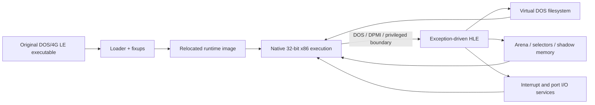

# rePIU


rePIU는 DOSBox나 전체 PC 에뮬레이터를 포함하지 않고, 원본 DOS/4G 기반 PIU 실행 파일의 32비트 x86 코드를 네이티브로 실행하기 위한 실험적 런타임입니다. 게임 로직은 원본 코드에 남겨 두고 DOS, DPMI, 메모리, 파일 시스템과 하드웨어 경계만 High Level Emulation(HLE)으로 제공합니다.

현재 버전은 [VERSION](VERSION)에서 확인할 수 있습니다.

*rePIU is an experimental runtime for executing the original 32-bit x86 code of DOS/4G-based PIU binaries without embedding DOSBox or a full PC emulator. Original game logic remains authoritative; only DOS, DPMI, memory, file-system, and hardware boundaries are replaced with High Level Emulation (HLE). See [VERSION](VERSION) for the current version.*

> [!WARNING]
> 현재는 연구·개발 단계이며 완성된 게임 런처가 아닙니다. 기본 실행 호스트는 32비트 Windows이고, `piu_1st`는 아직 완전한 게임 실행에 도달하지 않았습니다.
>
> *This is research-stage software, not a finished game launcher. The current execution host is 32-bit Windows, and `piu_1st` does not yet reach complete gameplay.*

## 주요 특징 / Why rePIU

* **원본 로직 보존:** 게임플레이를 C++로 재작성하지 않고 원본 x86 코드를 주 실행 경로로 유지합니다.
* **선별적 HLE:** 관찰된 DOS interrupt, DPMI, port I/O와 메모리 동작만 좁은 범위로 대체합니다.
* **DOS/4GW LE 분석:** executable object, fixup, relocation과 runtime image 배치를 분석할 수 있습니다.
* **교체 가능한 구조:** loader, runtime memory, selector, DOS filesystem, HLE profile과 target profile을 분리합니다.
* **재현 가능한 진척 기록:** 설계, 작업 지시, 실행 분석과 기술 지식을 저장소 문서로 누적합니다.

*The project preserves original x86 game logic, applies narrowly scoped HLE at observed environment boundaries, analyzes DOS/4GW LE images and relocations, separates replaceable runtime subsystems, and keeps reproducible design and reverse-engineering records.*

## 동작 방식 / How it works



현재 내장 타깃은 다음 두 가지입니다.

| 타깃 | 용도 | 상태 |
| --- | --- | --- |
| `dos4gw_hello` | OpenWatcom으로 빌드하는 최소 DOS/4GW 검증 프로그램 | 실행 및 출력 검증 |
| `piu_1st` | 사용자가 제공한 PIU 1st 원본 자산 | HLE 호환성 개발 중 |

*The built-in targets are `dos4gw_hello`, a minimal OpenWatcom validation program, and `piu_1st`, the actively developed compatibility target using user-supplied original assets.*

## 요구 사항 / Prerequisites

* Windows 10/11 x64 호스트
* Visual Studio 2019 이상 또는 Build Tools의 **Desktop development with C++** 워크로드와 x86 toolchain
* CMake 3.20 이상
* Git for Windows와 Windows PowerShell
* 최초 의존성 준비를 위한 인터넷 연결
* `piu_1st` 실행 시 합법적으로 보유한 원본 PIU 1st 파일

빌드는 반드시 `Win32`/x86로 생성됩니다. CMake는 설치된 `spdlog`를 먼저 찾고, 없으면 configure 과정에서 `spdlog` 1.14.1을 가져옵니다. 테스트 setup은 OpenWatcom을 `tools/openwatcom/`에 로컬 설치할 수 있습니다.

*Builds target Win32/x86. CMake uses an installed `spdlog` package or fetches version 1.14.1 during configuration. Test setup can install OpenWatcom locally under `tools/openwatcom/`.*

## 시작하기 / Getting started

### 1. 저장소 복제 / Clone

```powershell
git clone https://github.com/nworkers/rePIU.git
cd rePIU
```

### 2. 원본 자산 배치 / Supply original assets

`piu_1st`를 사용하려면 직접 소유한 원본 자산 트리를 다음 위치에 배치합니다.

```text
MASTER/
└── PIU_1ST/
    └── PIU/
        └── PIU.EXE
```

`MASTER/`는 Git에서 제외됩니다. rePIU는 원본 게임 실행 파일이나 자산을 배포하지 않습니다. `dos4gw_hello` 자체만 빌드하려면 PIU 자산이 필요 없지만, 통합 setup/test 스크립트는 현재 `PIU.EXE` 존재 여부를 검사합니다.

*Original game files are not distributed and `MASTER/` is ignored by Git. The standalone hello sample does not need PIU assets, but the integrated setup and test scripts currently verify that `PIU.EXE` exists.*

### MAME CHD asset

MAME 형식 asset으로 실행하려면 다음처럼 배치합니다. `roms/` 전체는 Git에서 제외됩니다.

```text
roms/
├── pumpit1.zip
└── pumpit1/
    └── 19990930.chd
```

`pumpit1` profile은 ZIP의 ROM entry를 확인하고 CHD v5 Mode2 CD의 ISO9660 tree를 `build/runtime_mounts/pumpit1/`에 materialize합니다. 이후 실행에서는 CHD identity가 같으면 cache를 재사용합니다.

*The `pumpit1` profile validates the MAME ROM set, mounts the CHD's ISO9660 tree under the ignored build cache, and starts `PIU/PIU.EXE`.*

### 3. 환경 준비와 전체 검증 / Set up and test

PowerShell에서 저장소 루트를 기준으로 실행합니다.

```powershell
powershell -ExecutionPolicy Bypass -File scripts/setup_test_environment.ps1
powershell -ExecutionPolicy Bypass -File scripts/test_all.ps1 -SkipSetup
```

첫 명령은 Git, CMake, Visual Studio x86 도구와 원본 자산을 확인하고 필요하면 OpenWatcom을 설치합니다. 두 번째 명령은 Win32 host와 sample을 빌드하고 두 내장 타깃의 현재 관찰 지점을 검증합니다.

### 4. 빌드만 수행 / Build only

```powershell
cmd /c scripts\build_win32_x86.bat
```

출력은 `build/win32_x86_debug/Debug/`에 생성됩니다.

## 사용 예 / Usage

### DOS/4GW sample 실행

```powershell
cmd /c scripts\build_dos4gw_hello.bat
build\win32_x86_debug\Debug\repiu_loader_win32.exe dos4gw_hello
```

정상 출력에는 다음 문자열이 포함됩니다.

```text
Hello, world!
```

### PIU 1st 실행 관찰

```powershell
build\win32_x86_debug\Debug\repiu_loader_win32.exe piu_1st
```

MAME CHD profile은 supervisor로 실행합니다.

```powershell
build\win32_x86_debug\Debug\repiu_supervisor_win32.exe pumpit1 600000
```

현재 이 명령은 완전한 게임 세션이 아니라 loader/HLE 진척과 진단 로그를 관찰하기 위한 개발 경로입니다.

### 실행 파일 분석

```powershell
build\win32_x86_debug\Debug\repiu_exe_analyzer.exe piu_1st
build\win32_x86_debug\Debug\repiu_exe_analyzer.exe piu_1st path\to\PIU.EXE
build\win32_x86_debug\Debug\repiu_exe_analyzer.exe path\to\another.exe
```

analyzer는 target profile, LE header/object, fixup, relocation, runtime memory dry-run 정보를 출력합니다.

## 진단 및 디버깅 / Diagnostics and debugging

rePIU는 런타임 동작 진단 및 문제 해결을 위해 다음과 같은 환경변수를 지원합니다.

* **`REPIU_DUMP_TEXTURE_BMP`**: `1`로 설정하면 Glide를 통해 로딩되는 텍스처를 디코딩하여 `build/texture_dumps/` 경로에 32비트 BGRA BMP 파일로 자동 저장합니다.
* **`REPIU_GLIDE_TEX_DIAG`**: 활성화하면 텍스처 업로드 시점의 원본 포맷과 dimensions 정보를 stderr 로그로 출력합니다 (최대 16회).
* **`REPIU_EXECUTION_TIMEOUT_MS`**: 게스트 프로그램의 최대 실행 시간(밀리초)을 제한합니다. `0`으로 세팅 시 제한을 해제(무제한)합니다.

*rePIU supports the following environment variables for diagnosing runtime behavior and troubleshooting:*
* *`REPIU_DUMP_TEXTURE_BMP`: Set to `1` to decode and dump loaded Glide textures as 32-bit BGRA BMP files under `build/texture_dumps/`.*
* *`REPIU_GLIDE_TEX_DIAG`: Enable to print source format and dimension info of uploaded textures to stderr (up to 16 occurrences).*
* *`REPIU_EXECUTION_TIMEOUT_MS`: Limits the maximum execution time of the guest program in milliseconds. Set to `0` to disable the timeout.*

## 프로젝트 구조 / Repository layout

| 경로 | 내용 |
| --- | --- |
| `include/repiu/`, `src/` | C++20 loader, runtime, HLE와 platform 구현 |
| `src/host/win32/` | Win32 x86 loader application |
| `src/tools/exe_analyzer/` | 비실행 DOS/4GW LE 분석 도구 |
| `samples/dos4gw_hello/` | 최소 DOS/4GW 검증 sample |
| `scripts/` | setup, build와 regression entry points |
| `docs/analysis/` | PIU 바이너리와 실행에서 확인한 프로젝트 고유 분석 |
| `docs/kb/` | DOS/4GW, DPMI, x86와 HLE 배경 지식 |
| `docs/design/`, `docs/work-orders/`, `docs/work-logs/` | 설계와 작업 이력 |

자세한 구성은 [ARCHITECTURE.md](ARCHITECTURE.md)를 참고하십시오.

## 문서와 지원 / Documentation and support

* [프로젝트 헌장](docs/PROJECT_CHARTER.md) — 목표와 비목표
* [아키텍처](ARCHITECTURE.md) — 현재 subsystem과 실행 구조
* [포팅 계획](docs/DOS4G_HLE_PORTING_PLAN.md) — 장기 구현 단계
* [바이너리 분석 색인](docs/analysis/README.md) — 확인된 실행 파일 분석과 현재 frontier
* [기술 지식 기반](docs/kb/README.md) — DOS/4GW, DPMI, x86, interrupt와 memory 용어
* [코딩 스타일](docs/CODING_STYLE.md) — C++20 스타일과 디렉터리 정책
* [작업 규칙](AGENTS.md) — 설계 우선 개발, 문서화와 Git workflow

질문, 재현 가능한 결함 보고와 제안은 [GitHub Issues](https://github.com/nworkers/rePIU/issues)에 남겨 주십시오. 보안 문제나 비공개 연락 경로는 아직 별도로 정의되어 있지 않습니다.

*Use the linked architecture, analysis, knowledge-base, style, and workflow documents for project guidance. Questions and reproducible bug reports belong in GitHub Issues; a private security-reporting channel has not yet been defined.*

## 유지보수와 기여 / Maintainers and contributing

이 프로젝트는 GitHub의 [nworkers/rePIU](https://github.com/nworkers/rePIU) 저장소 maintainers가 관리합니다. 기여 전 다음 흐름을 따라 주십시오.

1. 기존 issue와 [현재 분석 frontier](docs/analysis/current-execution-frontier.md)를 확인합니다.
2. 동작 변경 전에 `docs/design/`에 설계를, `docs/work-orders/`에 구현 계획을 작성합니다.
3. 원본 실행 코드를 주 경로로 유지하고 게임 로직 재구현을 피합니다.
4. 코드 변경에는 범위에 맞는 테스트와 `docs/work-logs/` 작업 로그를 포함합니다.
5. [코딩 스타일](docs/CODING_STYLE.md)과 [AGENTS.md](AGENTS.md)의 전체 규칙을 확인한 뒤 pull request를 제출합니다.

상세 기여 절차를 분리한 `CONTRIBUTING.md`는 아직 없습니다. 큰 변경은 구현 전에 issue에서 범위를 논의해 주십시오.

*The repository maintainers at `nworkers/rePIU` maintain the project. Review existing issues and the current execution frontier, document design and work order before behavioral changes, preserve original executable logic, include appropriate tests and a work log, follow the coding and repository rules, and discuss large changes in an issue before implementation. A standalone `CONTRIBUTING.md` is not yet available.*

## 라이선스 / License

프로젝트 정책은 BSD 3-Clause를 기본 라이선스 기준으로 정하고 있지만, 현재 저장소 루트에는 정식 `LICENSE` 파일이 없습니다. 파일이 추가되기 전에는 재배포 조건을 추정하지 말고 maintainers에게 확인하십시오. 원본 PIU 실행 파일과 자산은 rePIU에 포함되지 않으며 각 권리자의 조건을 따릅니다.

Vendored dependencies and their license locations are listed in [THIRD_PARTY_NOTICES.md](THIRD_PARTY_NOTICES.md).

*The project policy names BSD 3-Clause as its license baseline, but the repository currently has no formal `LICENSE` file. Do not assume redistribution terms until one is added; confirm with the maintainers. Original PIU binaries and assets are not part of rePIU and remain subject to their owners' terms.*
