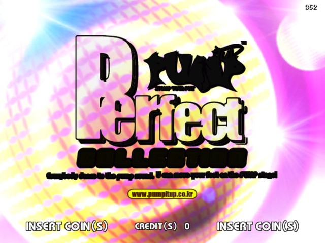
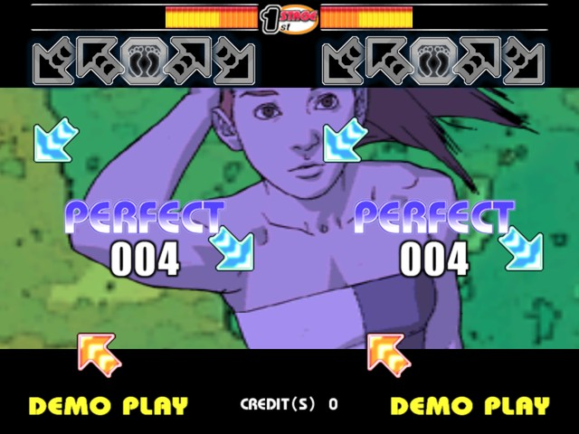
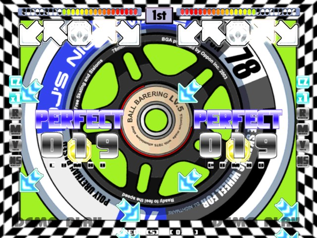
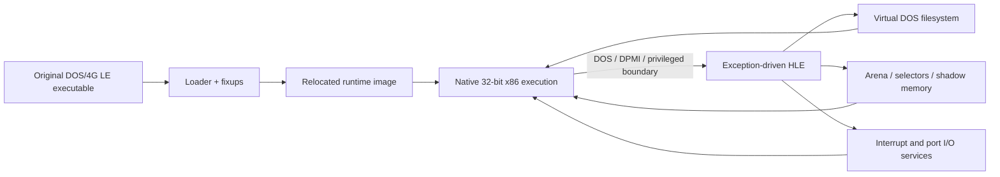

# rePIU


rePIU는 DOSBox나 전체 PC 에뮬레이터를 포함하지 않고, 원본 DOS/4G 기반 PIU 실행 파일의 32비트 x86 코드를 네이티브로 실행하기 위한 실험적 런타임입니다. 게임 로직은 원본 코드에 남겨 두고 DOS, DPMI, 메모리, 파일 시스템과 하드웨어 경계만 High Level Emulation(HLE)으로 제공합니다.

현재 버전은 [VERSION](VERSION)에서 확인할 수 있습니다.

*rePIU is an experimental runtime for executing the original 32-bit x86 code of DOS/4G-based PIU binaries without embedding DOSBox or a full PC emulator. Original game logic remains authoritative; only DOS, DPMI, memory, file-system, and hardware boundaries are replaced with High Level Emulation (HLE). See [VERSION](VERSION) for the current version.*

> [!WARNING]
> 현재는 연구·개발 단계이며 완성된 게임 런처가 아닙니다. 기본 실행 호스트는 32비트 Windows이고, 타이틀별 호환성은 계속 개발 중입니다.
>
> *This is research-stage software, not a finished game launcher. The current execution host is 32-bit Windows, and per-title compatibility remains under development.*

## 스크린샷 / Screenshots

rePIU v0.0.200의 Win32 x86 Release 빌드에서 원본 실행 파일이 그린 화면입니다. 2배 창(1280x960)에서 캡처해 원래 해상도 640x480으로 줄였습니다. 목록과 캡처 방법은 [docs/screenshots](docs/screenshots/README.md)에 있습니다.

*Screens drawn by the original executables under the Win32 x86 Release build of rePIU v0.0.200, captured from the 2x window (1280x960) and scaled back to the original 640x480. The list and how they were taken are in [docs/screenshots](docs/screenshots/README.md).*

| The 1st Dance Floor (`pumpit1`) | The 2nd Dance Floor (`pumpit2a`) | The O.B.G: The 3rd Dance Floor (`pumpit3a`) |
| :---: | :---: | :---: |
|  |  |  |
| **The O.B.G: The Season Evolution (`pumpito`)** | **The Collection (`pumpitc`)** | **The Perfect Collection (`pumpitpc`)** |
|  |  |  |
| **The Premiere (`pumpitpr`)** | **The Premiere USA — demo play (`pumpitpru`)** | **Extra (`pumpitea`)** |
|  |  |  |
| **The PREX (`pumpitpx`)** | **The Rebirth: The 8th Dance Floor (`pumpit8`)** | **The Premiere 2 (`pumpitp2`)** |
|  |  |  |
| **The PREX 2 (`pumpipx2`)** | **EXTRA + Plus (`pumpipx2p`)** | **The Premiere 3 (`pumpitp3`)** |
|  |  |  |
| **The Premiere 3 — demo play (`pumpitp3`)** | **The PREX 3 (`pumpipx3`)** | |
|  |  | |

화면 후처리 shader(`crt`, `scanline`)를 적용한 화면은 [shader 개발 기록](docs/post/2026-10-05-020000-post-process-shaders-wip.md)에 있습니다.

*Screens with the post-processing shaders (`crt`, `scanline`) are in the [shader dev log](docs/post/2026-10-05-020000-post-process-shaders-wip.md).*

## 주요 특징 / Why rePIU

* **원본 로직 보존:** 게임플레이를 C++로 재작성하지 않고 원본 x86 코드를 주 실행 경로로 유지합니다.
* **선별적 HLE:** 관찰된 DOS interrupt, DPMI, port I/O와 메모리 동작만 좁은 범위로 대체합니다.
* **DOS/4GW LE 분석:** executable object, fixup, relocation과 runtime image 배치를 분석할 수 있습니다.
* **교체 가능한 구조:** loader, runtime memory, selector, DOS filesystem, HLE profile과 target profile을 분리합니다.
* **재현 가능한 진척 기록:** 설계, 작업 지시, 실행 분석과 기술 지식을 저장소 문서로 누적합니다.

*The project preserves original x86 game logic, applies narrowly scoped HLE at observed environment boundaries, analyzes DOS/4GW LE images and relocations, separates replaceable runtime subsystems, and keeps reproducible design and reverse-engineering records.*

## 동작 방식 / How it works


```mermaid
flowchart LR
    EXE["Original DOS/4G LE executable"] --> LOAD["Loader + fixups"]
    LOAD --> IMAGE["Relocated runtime image"]
    IMAGE --> CPU["Native 32-bit x86 execution"]
    CPU -->|DOS / DPMI / privileged boundary| HLE["Exception-driven HLE"]
    HLE --> DOS["Virtual DOS filesystem"]
    HLE --> MEM["Arena / selectors / shadow memory"]
    HLE --> IO["Interrupt and port I/O services"]
    DOS --> CPU
    MEM --> CPU
    IO --> CPU
```

DOS 날짜는 실행 context 안에서 가상화됩니다. `INT 21h/AH=2Bh`로 날짜를 설정하면
이후 `AH=2Ah` 조회에 반영되지만 Windows host의 시스템 날짜는 변경하지 않습니다.

*The DOS date is virtualized per execution context. A date set through
`INT 21h/AH=2Bh` is returned by later `AH=2Ah` queries without changing the
Windows host system date.*

현재 내장 타깃은 검증 sample과 22개 MAME PIU profile입니다.

| 타깃 | 용도 | 상태 |
| --- | --- | --- |
| `dos4gw_hello` | OpenWatcom으로 빌드하는 최소 DOS/4GW 검증 프로그램 | 실행 및 출력 검증 |
| `pumpit1`~`pumpipx3b` | 사용자가 제공한 MAME 형식 PIU ROM/CHD 자산 | 타이틀별 HLE 호환성 개발 중 |

*The built-in targets are the minimal OpenWatcom `dos4gw_hello` validation program and 22 MAME-format PIU profiles from `pumpit1` through `pumpipx3b`.*

## 요구 사항 / Prerequisites

* Windows 10/11 x64 호스트
* Visual Studio 2019 이상 또는 Build Tools의 **Desktop development with C++** 워크로드와 x86 toolchain
* CMake 3.20 이상
* Git for Windows와 Windows PowerShell
* 최초 의존성 준비를 위한 인터넷 연결
* 게임 실행 시 합법적으로 보유한 해당 MAME ROM ZIP과 CHD

빌드는 반드시 `Win32`/x86로 생성됩니다. CMake는 설치된 `spdlog`를 먼저 찾고, 없으면 configure 과정에서 `spdlog` 1.14.1을 가져옵니다. 테스트 setup은 OpenWatcom을 `tools/openwatcom/`에 로컬 설치할 수 있습니다.

*Builds target Win32/x86. CMake uses an installed `spdlog` package or fetches version 1.14.1 during configuration. Test setup can install OpenWatcom locally under `tools/openwatcom/`.*

## 시작하기 / Getting started

### 1. 저장소 복제 / Clone

```powershell
git clone https://github.com/nworkers/rePIU.git
cd rePIU
```

### 2. 원본 자산 배치 / Supply original assets

MAME 형식 asset으로 실행하려면 다음처럼 배치합니다. `roms/` 전체는 Git에서 제외됩니다.

```text
roms/
├── <rom-set>.zip
└── <rom-set>/
    └── <disc>.chd
```

지원하는 MAME CHD profile은 `pumpit1`, `pumpit2`, `pumpit2a`, `pumpit3`, `pumpit3a`,
`pumpito`, `pumpitc`, `pumpitpc`, `pumpitpr`, `pumpitpru`, `pumpite`, `pumpitea`,
`pumpitpx`, `pumpit8`, `pumpitp2`, `pumpipx2`, `pumpipx2p`, `pumpitp3`, `pumpitp3a`,
`pumpipx3`, `pumpipx3a`, `pumpipx3b`입니다. 각 profile은 자신의 ZIP/CHD와
`build/runtime_mounts/<rom-set>/` mount를 유지합니다. CAT702 항목이 현재 세트 이름으로
없으면 profile에 명시된 부모 이름을 같은 ZIP에서 확인하고, 이어서 형제 경로의 부모
ZIP을 확인합니다. 항목 없음만 fallback하며 읽기·추출·CRC 오류는 실패로 유지합니다.
CHD identity가 같으면 materialized ISO9660 cache를 재사용합니다.

*The 22 supported MAME CHD profiles follow the catalog order from `pumpit1` through
`pumpipx3b`, including clone/date variants. Each validates the required entries in its matching
ROM set, mounts the CHD's ISO9660 tree under `build/runtime_mounts/<rom-set>/`, and starts
`PIU/PIU.EXE`. Each clone retains its own ZIP/CHD and mount. If its current-named CAT702
member is absent, setup checks the parent-named member in the same ZIP and then the sibling
parent ZIP. Only a missing member permits fallback; read, extraction, and CRC failures remain
fatal. An unchanged CHD identity reuses the cache.*

PIU10 profile의 MP3 시작 지연 기본값은 0 ms입니다. 실행 전에 `REPIU_PIU10_MP3_LATENCY_MS`를 0~500의 정수로 지정하면 밀리초 단위로 덮어쓸 수 있습니다. `REPIU_PIU10_DAC_AUDIT=1`은 DAC3350A 제어 transaction과 그 순간의 PCM queue, audio device buffer, compressed ring, decoder pending 상태를 기록합니다. 반복 측정과 해석 절차는 [PIU10 DAC audio backlog 감사 가이드](docs/guides/piu10-dac-audio-backlog-audit.md)를 따릅니다.

*PIU10 profiles default to zero milliseconds of MP3 startup latency. Set `REPIU_PIU10_MP3_LATENCY_MS` to an integer from 0 through 500 before launch to override it in milliseconds. `REPIU_PIU10_DAC_AUDIT=1` records DAC3350A control transactions together with the PCM queue, audio-device buffer, compressed ring, and decoder-pending state at that instant. Follow the [PIU10 DAC audio backlog audit guide](docs/guides/piu10-dac-audio-backlog-audit.md) for repeatable capture and interpretation.*

### 3. 환경 준비와 전체 검증 / Set up and test

PowerShell에서 저장소 루트를 기준으로 실행합니다.

```powershell
powershell -ExecutionPolicy Bypass -File scripts/setup_test_environment.ps1
powershell -ExecutionPolicy Bypass -File scripts/test_all.ps1 -SkipSetup
```

첫 명령은 Git, CMake, Visual Studio x86 도구와 `pumpit1` 자산을 확인하고 필요하면
OpenWatcom을 설치합니다. 두 번째 명령은 Win32 host와 sample을 빌드하고 target registry
probe를 검증합니다.

### 4. 빌드만 수행 / Build only

```powershell
cmd /c scripts\build_win32_x86.bat
```

출력은 `build/win32_x86_debug/Debug/`에 생성됩니다.

### 6. Linux 빌드 / Linux build

플랫폼 공용 코어, 실행 엔진, 로더와 probe는 Linux에서 i386으로 빌드됩니다. Task 506부터
기본 `dynamic` AOT backend도 Linux에서 실행되며, WSLg의 `pumpit1`에서 실제 Glide 버퍼 스왑과
non-black 픽셀이 확인되었습니다.

*The platform-neutral core, execution engine, loader, and probes build as i386 on Linux. Since
Task 506 the default `dynamic` AOT backend runs there as well; real Glide buffer swaps and non-black
pixels have been confirmed with `pumpit1` under WSLg.*

```bash
sudo apt update && sudo apt install -y gcc-multilib g++-multilib libc6-dev-i386
scripts/build_linux_i386.sh --config Debug --target repiu --target repiu_core_probe
build/linux_i386/repiu_core_probe
REPIU_GLIDE_PIXEL_DIAG=1 build/linux_i386/repiu pumpit1
```

`repiu_core_probe`는 플랫폼에 의존하지 않는 probe 15개를 담고 **양쪽 OS에서 모두**
빌드되므로, 같은 코드가 두 환경에서 같은 결과를 내는지 직접 비교할 수 있습니다. Windows
에서는 `repiu_aot_probe`가 같은 probe를 계속 포함합니다. wasm32에서는 9개만 도는데, 나머지
여섯은 아래 웹 빌드 절을 보십시오.

*`repiu_core_probe` contains 15 platform-independent probes and builds on both operating systems,
so the same contracts can be compared directly. On Windows, `repiu_aot_probe` continues to include
the same probes. Only nine of them run on wasm32; the web build section below says why the other
six do not.*

런처는 Linux에서도 뜹니다. 32비트 데스크톱 개발 패키지가 필요합니다.

```bash
sudo dpkg --add-architecture i386 && sudo apt update
sudo apt install -y libx11-dev:i386 libxext-dev:i386 libxrandr-dev:i386   libxi-dev:i386 libxcursor-dev:i386 libxfixes-dev:i386 libxkbcommon-dev:i386   libgl1-mesa-dev:i386 libasound2-dev:i386
scripts/build_linux_i386.sh --config Debug --target repiu_launcher
build/linux_i386/repiu_launcher
```

독립 `repiu_launcher`의 롬셋 목록과 옵션은 Windows와 같은 코드입니다. 게임은 위의 `repiu`
실행 파일로 직접 시작합니다. 데스크톱 개발 패키지가 없는 호스트에서 코어와 probe만 빌드하려면
`--headless`를 주십시오. 이 스위치는 SDL이 X11/Wayland 개발 패키지 없이도 configure를 통과하게 할
뿐이며, 패키지가 있는 호스트에서는 아무것도 바꾸지 않습니다(Task 739). 구성이 다른 트리는
`--build-dir`로 따로 두십시오.

*The standalone `repiu_launcher` shares its ROM-set list and options with Windows. Start games
directly through the `repiu` executable shown above. Pass `--headless` when only the core and probes
are needed on a host without the desktop development packages; the switch only lets SDL configure
without X11/Wayland development packages and changes nothing on a host that has them (Task 739). Keep
differently configured trees apart with `--build-dir`.*

### 7. 웹(wasm) 빌드 / Web (wasm) build

**게임은 브라우저에서 아직 실행되지 않습니다.** Task 513 Stage 1이 만든 것은 플랫폼 공용
코어의 wasm32 빌드이고, 실행 엔진은 여기 없습니다 — 현재 backend 둘이 모두 네이티브 x86을
실행하기 때문입니다. 브라우저 실행까지의 계획은
[웹 실행 설계](docs/design/20260828-513-web-wasm-execution.md)에 다섯 단계로 있습니다.

***The game does not run in a browser yet.*** *What Task 513 Stage 1 produced is a wasm32 build of
the platform-neutral core; the execution engine is not in it, because both current backends execute
native x86. The five stages toward a browser are in the*
*[web execution design](docs/design/20260828-513-web-wasm-execution.md).*

```bash
git clone --depth 1 https://github.com/emscripten-core/emsdk.git ~/emsdk
cd ~/emsdk && ./emsdk install latest && ./emsdk activate latest && source ~/emsdk/emsdk_env.sh

cd <repo>
scripts/build_web_wasm.sh --target repiu_core_probe
node build/web_wasm/repiu_core_probe.js
```

`repiu_core_probe`는 wasm32에서 probe 9개를 돌고, 성립하지 않는 여섯의 **이름을 함께
출력**합니다 — `guest_cpu_context`, `virtual_memory`, `fault_handler`, `stack_bridge`,
`guest_stack_switch`, `host_thread`. 앞의 둘은 인라인 x86 어셈블리라 컴파일에 닿지 못하고,
나머지는 wasm에 없는 플랫폼 설비를 부릅니다.

*`repiu_core_probe` runs nine probes on wasm32 and prints the **names** of the six that do not hold:
`guest_cpu_context`, `virtual_memory`, `fault_handler`, `stack_bridge`, `guest_stack_switch`, and
`host_thread`. Two of them are inline x86 assembly and never reach the compiler; the rest call
platform facilities wasm does not have.*

### 5. Release 빌드 / Release build

```powershell
cmd /c scripts\build_win32_x86_release.bat
```

출력은 `build/win32_x86_debug/Release/`에 생성됩니다. 빌드 트리는 multi-config이므로
디렉터리 이름은 과거 명칭이며 두 구성이 같은 트리를 공유합니다.

특정 타깃만 빌드하려면 다음처럼 인자를 넘깁니다.

```powershell
powershell -ExecutionPolicy Bypass -File scripts/build_win32_x86.ps1 -Configuration Release -Target repiu_aot_probe
```

**정확성 검증은 Debug, 성능 측정은 Release로 나눕니다.** Task 330에서 plan build의
Debug 계수가 11.34배였고 단계 순위까지 뒤집혔기 때문에, Debug에서 측정한 시간은
최적화 근거로 쓸 수 없습니다.

*Correctness work stays on Debug for its assertions; every performance number must come from the
Release build, because Task 330 measured an 11.34x Debug factor that also inverts the stage
ranking. Both configurations share one multi-config build tree, so the directory name is
historical.*

## 사용 예 / Usage

### 런처 / Launcher

인자 없이 실행하면 런처가 열려 롬셋 목록을 보여주고, 고른 롬셋을 같은 프로세스에서
실행합니다.

```powershell
build\win32_x86_debug\Debug\repiu.exe
```

목록에는 내장 카탈로그의 롬셋이 **전부** 나오고, 실행할 수 없는 것은 사유와 함께 흐리게
표시됩니다(`roms\<id>.zip` 없음, 필수 PIU10 엔트리 없음, `roms\<id>\` 없음, CHD 없음,
CHD가 둘 이상). 어떤 디스크가 왜 안 되는지 목록에서 바로 확인할 수 있습니다.

vsync와 사운드 게인은 런처에서 바꿔 `cfg\repiu.ini`에 저장합니다. vsync는 기본으로 켜져 있고,
런처에서 끄거나 `REPIU_GLIDE_SWAP_INTERVAL=0`을 주면 꺼집니다(Task 766). **같은 의미의 환경
변수가 설정돼 있으면 환경 변수가 이깁니다** — 측정 스크립트와 진단 절차가 계속 우선권을
갖습니다. 인자를 주고 실행할 때도(`repiu pumpitea`) 같은 `cfg\repiu.ini`를 먼저 읽어
적용하며, 로그의 `Launcher settings read from …` 줄이 어느 값이 파일에서 왔고 어느 값이 환경
변수에서 왔는지 말합니다. 드라이버가 swap interval을 거부하면(WSLg의 llvmpipe가 그렇습니다)
엔진이 디스플레이 주사율에 맞춰 swap 간격을 직접 맞추고, 최종 보고의 `Glide swap pacing …`
줄에 거부 사유와 함께 찍습니다. 진짜 vsync는 Wayland 컴포지터 아래 `SDL_VIDEO_DRIVER=wayland`가
받습니다(WSLg는 소켓이 `/mnt/wslg/runtime-dir`에 있으므로 `XDG_RUNTIME_DIR`를 그리 줘야 창이 열립니다;
로그의 `swap interval override … applied/effective: true/1/true/1`이 확인입니다).

화면 shader도 런처의 "Screen shader"에서 고릅니다(Task 768). 기본은 `none`이고, `crt`와
`scanline`이 내장돼 있으며, `shaders\` 폴더에 libretro 단일 pass 형식의 `.glsl` 파일을 넣으면
목록에 함께 나옵니다. 게임 중에는 `Tab` OSD에서 바꾸고 매개변수를 조절할 수 있습니다(그 실행에만
적용). 실행 인자로는 `repiu pumpit8 --post-shader crt`(또는 `--post-shader=crt`, 롬셋 앞뒤 어디든)이고,
환경 변수 `REPIU_POST_SHADER=crt`와 런처 설정보다 우선합니다(Task 771). 형식과 확인 절차는
[후처리 shader 가이드](docs/guides/post-process-shaders.md)에 있습니다.

*The screen shader is chosen in the launcher's "Screen shader" as well (Task 768). The default is
`none`; `crt` and `scanline` are built in, and `.glsl` files in the libretro single-pass layout
dropped into the `shaders\` folder join the list. In game, the `Tab` OSD switches shaders and tunes
their parameters for that run. On the command line it is `repiu pumpit8 --post-shader crt` (or
`--post-shader=crt`, before or after the ROM set), which wins over the environment variable
`REPIU_POST_SHADER=crt` and the launcher setting (Task 771). The format and
a check procedure are in the [post-processing shader guide](docs/guides/post-process-shaders.md).*

**텍스처 원본 정밀도(issue #37).** 게임에 내장된 그래픽 드라이버(Mesa 3.x)는 텍스처를 채널당 4bit(ARGB4444)·5/6bit(RGB565)로 잘라 하드웨어에 넘깁니다. rePIU는 드라이버가 들고 있는 원본 8bit 이미지를 찾아, 원본과 정확히 대응하는 것이 확인될 때만 대신 씁니다. 기본으로 켜져 있고, `Tab` OSD의 "Full-precision textures"나 런처의 같은 항목, `REPIU_GLIDE_TEXTURE_FULL_PRECISION=0`으로 끕니다. 끄면 아케이드 실기와 같은 화면입니다.

*Full-precision textures (issue #37). The graphics driver built into the game (Mesa 3.x) cuts textures to 4 bits (ARGB4444) or 5/6 bits (RGB565) per channel before the hardware sees them. rePIU finds the original 8-bit image the driver still holds and uses it instead, only when it is verified to match exactly. It is on by default; turn it off with "Full-precision textures" in the `Tab` OSD or the launcher, or `REPIU_GLIDE_TEXTURE_FULL_PRECISION=0`, to see what the arcade hardware showed.*

`Tab` OSD 맨 위에는 지금 화면을 그리는 OpenGL renderer, vendor, GL 버전, SDL 비디오 드라이버(`windows`,
`x11`, `wayland`)가 나옵니다(#5). llvmpipe 같은 소프트웨어 렌더러면 빨간 글씨로 "Software rendering: no 3D
acceleration"을 표시합니다. 게임이 유난히 느리면 먼저 여기를 보십시오. OSD는 화면 맨 위에 가로로
펼쳐지고 첫 줄에 이름·버전·빌드 날짜, 둘째 줄에 Target Profile이 나오며, 글자는 창을 키우면 함께
커집니다(#15). 인자 없이 실행했을 때의 런처도 창 크기를 바꾸거나 최대화하면 글자가 함께 커집니다.

*The top of the `Tab` OSD shows the OpenGL renderer drawing the picture, its vendor, the GL version and the SDL
video driver (`windows`, `x11`, `wayland`) (#5). A software renderer such as llvmpipe is shown in red with
"Software rendering: no 3D acceleration". If the game runs unusually slowly, look here first. The OSD
spans the top of the screen, opening with the name, version and build date and then the Target Profile,
and its text grows with the window (#15). The launcher shown without arguments also enlarges its text
when resized or maximised.*

게임 창은 더블클릭 또는 `Alt+Enter`로 전체화면과 창 모드를 오갑니다(Task 769). 전체화면은
디스플레이 해상도를 바꾸지 않는 테두리 없는 창이고, 창 크기를 바꾸든 전체화면이든 원래 4:3 비율을
유지하며 남는 부분은 검은 띠가 됩니다. `Alt+1`~`Alt+4`는 창 모드에서 1~4배 크기를 고릅니다.

*Double-click the game window or press `Alt+Enter` to switch between fullscreen and windowed mode
(Task 769). Fullscreen is a borderless window that leaves the display resolution alone, and both a
resized window and fullscreen keep the original 4:3 ratio with black bars around it. `Alt+1` to
`Alt+4` pick a 1x to 4x window in windowed mode.*

게임을 끝내면 런처로 돌아오므로 다른 롬셋을 이어서 고를 수 있습니다. 종료는 런처의
Quit입니다.

인자를 하나라도 주면 런처는 뜨지 않고 기존 동작 그대로이며, **게임이 끝나면 프로세스도
완전히 종료됩니다**(복귀 루프는 단독 실행에만 있습니다). 인자 없이 실행하는 자동화를
위해 `REPIU_LAUNCHER=0`을 주면 런처를 건너뛰고 기존 기본값(`pumpit1`)으로 갑니다.

*Running with no arguments opens the launcher, which lists the ROM sets and starts the selected
one in the same process. Every catalog entry is listed, and the ones that cannot run are dimmed
with the reason — missing `roms\<id>.zip`, missing PIU10 entries, missing `roms\<id>\`, no CHD,
or more than one CHD — so it is clear why a disc is unavailable. Vertical sync and sound gain are
edited there and stored in `cfg\repiu.ini`. Vertical sync is on by default and is turned off in the
launcher or with `REPIU_GLIDE_SWAP_INTERVAL=0` (Task 766); an environment variable of the same meaning always
wins, so measurement scripts keep control. A run started with arguments (`repiu pumpitea`) reads
and applies the same `cfg\repiu.ini` first, and the log's `Launcher settings read from …` line says
which value came from the file and which from the environment. When the driver refuses the swap
interval (WSLg's llvmpipe does), the engine paces the swaps itself at the display's refresh rate
and says so, with the reason, in the final report's `Glide swap pacing …` line. Real vsync comes from
`SDL_VIDEO_DRIVER=wayland` under a Wayland compositor (on WSLg the socket lives in
`/mnt/wslg/runtime-dir`, so `XDG_RUNTIME_DIR` must point there for the window to open; the log's
`swap interval override … applied/effective: true/1/true/1` confirms it). Finishing a game returns to the launcher so another ROM set can be chosen, and Quit ends the
session. Passing any argument keeps today's behavior exactly and **ends the process when the game
ends**, since the return loop exists only for a standalone run; `REPIU_LAUNCHER=0` skips the
launcher for automation that runs the binary bare.*

### DOS/4GW sample 실행

```powershell
cmd /c scripts\build_dos4gw_hello.bat
build\win32_x86_debug\Debug\repiu.exe dos4gw_hello
```

정상 출력에는 다음 문자열이 포함됩니다.

```text
Hello, world!
```

### Pump It Up 실행 관찰

```powershell
build\win32_x86_debug\Debug\repiu.exe pumpit1
```

인자 없이 실행해도 기본 타깃 `pumpit1`을 선택합니다. 이전 임시 프로필 `piu_1st`는
내장 registry에서 제거됐습니다.

*Launching without an argument also selects the default `pumpit1` target. The former
temporary `piu_1st` profile is no longer part of the built-in registry.*

MAME CHD profile은 supervisor로 실행합니다.

```powershell
build\win32_x86_debug\Debug\repiu_supervisor_win32.exe pumpit1 600000
```

현재 이 명령은 완전한 게임 세션이 아니라 loader/HLE 진척과 진단 로그를 관찰하기 위한 개발 경로입니다.

### 키 설정 / Key configuration

롬셋마다 `cfg/<롬셋 ID>.ini`에서 발판과 캐비닛 버튼의 키를 바꿀 수 있습니다. 파일이 없으면
첫 실행 때 기본값이 주석 처리된 상태로 생성되므로, 바꾸고 싶은 줄의 `;`만 지우면 됩니다.

*Each ROM set can remap its stage panels and cabinet buttons through
`cfg/<rom-set-id>.ini`. The file is created on first run with every entry commented out,
so changing a binding means deleting the leading `;` on that line.*

```ini
[Input]
P1_UP_LEFT = Q
TEST       = Ctrl+F1
```

게임패드와 조이스틱(USB 발판 포함)도 같은 줄에 섞어 쓸 수 있습니다. 표준 게임패드는 설정 없이도
Pad1이 1P, Pad2가 2P로 동작하고, 그 밖의 장치는 `Joy1_Button3`처럼 버튼 번호로 겁니다.

*Gamepads and joysticks, USB dance pads included, mix into the same lines. A standard gamepad
works with no configuration, Pad1 as P1 and Pad2 as P2; other devices are bound by button number,
as in `Joy1_Button3`.*

```ini
[Input]
P1_CENTER = S, Pad1_A, Joy1_Button5
```

전체 키 이름 목록, 조합키 문법, 여러 롬셋에 한 번에 적용하는 방법은
[docs/guides/romset-config-files.md](docs/guides/romset-config-files.md)를 참고하세요.

*See [docs/guides/romset-config-files.md](docs/guides/romset-config-files.md) for the full
key name list, the combination syntax, and how to apply a setting to several ROM sets at
once.*

### 실행 파일 분석

```powershell
build\win32_x86_debug\Debug\repiu_exe_analyzer.exe pumpit1
build\win32_x86_debug\Debug\repiu_exe_analyzer.exe pumpit1 path\to\PIU.EXE
build\win32_x86_debug\Debug\repiu_exe_analyzer.exe path\to\another.exe
```

analyzer는 target profile, LE header/object, fixup, relocation, runtime memory dry-run 정보를 출력합니다.

## 진단 및 디버깅 / Diagnostics and debugging

rePIU는 런타임 동작 진단 및 문제 해결을 위해 다음과 같은 환경변수를 지원합니다.

* **`REPIU_GLIDE_TEX_DUMP`**: Glide로 올라오는 텍스처를 디코딩해 TGA 파일로 저장합니다. `1`이면 `build/texture_dumps/`에, 그 밖의 값은 그 경로에 씁니다. 저장 개수는 기본 512개이고 `REPIU_GLIDE_TEX_DUMP_LIMIT`로 바꿉니다.
* **`REPIU_GLIDE_TEX_DIAG`**: 활성화하면 텍스처 업로드 시점의 원본 포맷과 dimensions 정보를 stderr 로그로 출력합니다 (최대 16회).
* **`REPIU_GLIDE_LONG_FRAME_LOG`**: `1`이면 주기 1.5배(vblank 하나 놓침)를 넘긴 프레임마다, 더 큰 값이면 그 마이크로초를 넘긴 프레임마다 stderr에 `[repiu-glide-swap] long-frame … frame_us= sleep_us= guest_us= present_us=` 한 줄을 찍습니다(직전 페이서 sleep / 게스트 구간 / present). 페이싱 여부와 무관하며, `REPIU_PIU10_MP3_CENSUS_MS=20`과 같은 축에서 읽습니다(Task 748).
* **`REPIU_EVENT_CLOCK`**: 타이머 tick 스케줄과 입력 타임라인은 오디오가 따르는 시계(`steady_clock`, Linux의 `CLOCK_MONOTONIC`)를 따릅니다. `sdl`이면 이전처럼 SDL의 시계(Linux의 `CLOCK_MONOTONIC_RAW`)를 씁니다. 두 시계는 보통 같은 속도지만 WSL2에서는 시간 동기화가 `CLOCK_MONOTONIC`을 몇 %씩 늦출 수 있고, 그때 SDL의 시계를 따르는 tick은 음악보다 빨리 가서 노트가 앞서 나갔다 돌아옵니다. 두 시계가 1초 동안 0.5% 넘게 어긋나면 stderr에 `[repiu-clock] …`이 한 번 찍히고, 최종 보고의 `host clock raw-against-steady tick-clock/total-ppm/worst-second-ppm/seconds/seconds-over-0.5%` 줄이 실행 전체를 말합니다. 음악 자체가 느려졌다 돌아오는 것은 WSL의 시계 보정에서 오며 엔진이 고치지 못합니다(WSL을 다시 시작해도 남았습니다. 실기에서의 확인이 후속 작업입니다)(Task 754). WSL의 사운드 서버는 그 시계로 출력하므로 음악은 실제 시간으로 1~8% 느려지고, 게임의 시간도 같은 시계를 따라 함께 느려집니다. Windows의 시계가 NTP 시각과 다를 때(이 머신은 1.0초, Windows Time 서비스 꺼짐) WSL 안의 두 시간 동기화가 서로를 되돌리는 것이 유력한 원인이며, 다만 Windows의 시계를 동기화해도 음악은 그대로 느렸고, 실기에서의 비교가 있을 때까지 보류합니다(Task 755).
* **`REPIU_JAMMA_REPLAY_FRAME_END`**: tick을 주입할 때 입력 타임라인은 그 tick의 예정 시각을 replay 프레임으로 쌓아 핸들러의 입력 읽기에 그 시각의 키를 돌려줍니다. 프레임은 핸들러의 복귀에서 끝납니다: `iret`을 엔진이 실행하는 곳(Linux x64)에서는 그 `iret`, 게스트가 직접 실행하는 곳(Win32, Linux i386)에서는 return pad(Task 762, 아래 `REPIU_TIMER_RETURN_PAD`). 복귀를 보지 못한 프레임은 스택 비교와 나이(이후 64회 넘는 주입)로 회수됩니다. `0`이면 복귀로 끝내지 않고 스택 비교와 나이에만 맡깁니다. 최종 보고의 `JAMMA timeline frames ended-by-return/retired-stale/latest-state-reads` 줄이 어느 쪽으로 회수됐는지 말합니다(Task 753).
* **`REPIU_JAMMA_TIMELINE_TRACE`**: `1`이면 나이로 회수되는 replay 프레임마다 stderr에 `[repiu-jamma-timeline] stale frame retired frame_esp=… interrupted_eip=…`를 찍습니다. 스택 비교가 닿지 못하는 프레임이 어디서 생겼는지 찾는 진단입니다(Task 753).
* **`REPIU_WSL_D3D12`**: WSL에서는 GPU가 Mesa의 D3D12 드라이버로만 제공되는데 Mesa가 스스로 고르지 않아 소프트웨어 렌더러(llvmpipe)로 그리게 됩니다. `/dev/dxg`와 프로세스의 아키텍처에 맞는 `d3d12_dri.so`가 있고(Task 760) `GALLIUM_DRIVER`·`MESA_LOADER_DRIVER_OVERRIDE`·`LIBGL_ALWAYS_SOFTWARE`를 직접 주지 않았으면 엔진이 `GALLIUM_DRIVER=d3d12`를 고릅니다. `0`이면 Mesa의 선택을 그대로 둡니다. 무엇이 그리는지는 stderr의 `[repiu-glide] GL renderer: …`와 최종 보고의 `Glide GL renderer/wsl-d3d12-chosen` 줄이 말합니다(Task 752).
* **`REPIU_GUEST_CLI_HOLD`**: 게스트의 `cli`부터 `sti`(또는 주입한 프레임의 `iret`)까지 타이머 tick 주입을 미룹니다. 게임이 `cli`로 감싼 보안 칩(CAT702) 통신 한가운데 타이머 핸들러가 끼어들어 검사가 실패하던 것을 막습니다. 기본 켜짐, `0`으로 끕니다. 100 ms를 넘긴 hold는 풀립니다. 최종 보고의 `guest cli hold cli/sti/blocked/expired/max-hold-us/held-at-end`와 `timer IRQ0 after-return …`·`nesting …`·`turn …` 줄이 계수를 말합니다(Task 751).
* **`REPIU_TIMER_RETURN_PAD`**: Win32와 Linux i386은 게스트의 `iret`을 그대로 실행하므로 엔진이 타이머 핸들러의 복귀를 볼 수 없었습니다. 그래서 핸들러가 돌아간 코드가 제자리에서 감독 없이 돌았고, 트랩이 없는 대기 루프에 들어가면 다음 tick이 들어가지 못했습니다(Win32 pumpit8이 곡 로딩 뒤 멈추던 원인, v0.0.191~v0.0.196). 이제 주입한 프레임은 return pad(실행하면 폴트가 나는 주소)로 복귀하고, 엔진이 그 폴트에서 원래 주소로 돌려보내며 제자리 코드는 코드 캐시로 다시 들여보냅니다. 복귀가 보이므로 중첩 금지·차례·연쇄 규칙도 이 호스트들에서 켜집니다. 기본 켜짐, `0`으로 끕니다. 최종 보고의 `timer return pad pushed/returned/supervised/overflow/unmatched/abandoned/depth-max/depth-at-end` 줄이 결과를 말합니다(Task 762).
* **`REPIU_PIU10_CAT702_TRACE`**: `1`이면 CAT702 통신 하나가 끝날 때마다(select 상승) 들어간 비트와 나온 비트를 `[repiu-cat702] #N bits= in= out=`으로 찍습니다(처음 600개). 같은 표를 오프라인으로 대조하려면 `python scripts/cat702_table_check.py <프로필>`을 씁니다.
* **`scripts/survey_romsets.sh <binary> <tag> [초] [프로필…]`**: 롬셋 프로필을 정해진 시간씩 돌려 실행·진행 여부를 `build/survey/<tag>/summary.txt`에 모읍니다(종료 코드, 프레임 수, fps, 5초 간격 화면 샘플의 변화, 폴트, 자산 열기). 입력은 `scripts/input_scripts/survey_generic.txt`. 한 번에 한 호스트만 돌리십시오.
* **`REPIU_GLIDE_SWAP_WAIT_TICKS`**: `grBufferSwap` 게이트가 present(vblank 대기나 페이싱)를 기다리는 동안에도 밀린 타이머 tick을 주입해 ISR을 돌립니다. 실제 기계가 vblank 대기 중에도 IRQ0을 받는 것과 같고, 없으면 게스트가 MP3 frame 경계를 0–16 ms 늦게 봐 노트가 16/33 ms 걸음으로 움직입니다. **Linux x64 전용이며 기본 켜짐**이고 `0`으로 끕니다(Win32에서는 첫 주입 뒤 진행이 멈춰 아직 제공하지 않습니다). 최종 보고의 `Glide swap wait ticks swaps/injections` 줄이 횟수를 말하고, `REPIU_GLIDE_SWAP_WAIT_LOG=1`은 tick을 전달하지 못한 대기를 처음 몇 번 찍습니다(Task 750).
* **`REPIU_PIU10_MP3_POSITION_TRACE`**: `1`이면 MP3 frame-sync 토글마다 `[repiu-mp3-pos] toggle seq= t_us= pos_ms= frame_ms= lag_ms= queued_ms=`, 게스트가 새 값을 처음 읽을 때마다 `[repiu-mp3-pos] seen seq= t_us= delay_us= reads=`를 stderr에 찍습니다. 게스트가 세는 곡 위치를 이벤트 단위로 호스트 시계와 나란히 보는 용도입니다(Task 749).
* **`REPIU_INPUT_SCRIPT`**: `<ms> <키 이름> [hold ms]` 줄(`#` 주석)로 된 파일을 주면 Glide 창이 열린 순간부터 재어 SDL 키 이벤트를 밀어 넣는 스크립트 키보드입니다. 실제 키보드와 같은 펌프·바인딩을 지나며 창 포커스에 의존하지 않습니다. 예: `scripts/input_scripts/pumpitea_play.txt`(SERVICE 5회 → 시작 → 곡 선택 → 확정). 밀어 넣은 이벤트는 SDL의 키보드 상태 배열을 바꾸지 않으므로, 스크립트가 도는 동안 핸들러 밖의 입력 읽기는 입력 타임라인의 최신 상태로 답합니다(Task 753).
* **`REPIU_DOS_ASSET_TRACE`**: 설정하면 DOS 파일 열기·읽기·seek을 stderr에 찍습니다(열기 200·읽기 120·seek 120건까지, 실패와 short read는 항상). 값이 `all`이면 상한을 없앱니다(무겁습니다: ftell 폴링이 초당 수천 줄).
* **`REPIU_EXECUTION_BACKEND`**: 실행 backend를 `legacy` 또는 `dynamic`으로 고릅니다. 기본값은 `dynamic`이며, `legacy`는 회귀 대조군으로 남아 있습니다. 그 밖의 값(옛 이름 `aot`, `aot-dbt` 포함)은 오류로 종료합니다.
* **`REPIU_EXECUTION_TIMEOUT_MS`**: 게스트 프로그램의 최대 실행 시간(밀리초)을 제한합니다. `0`으로 세팅 시 제한을 해제(무제한)합니다. **기본값은 `0`(무제한)** 이므로, 상한이 필요한 자동화는 값을 명시하십시오.
* **`REPIU_AOT_INDIRECT_CACHE_SLOTS`**: AOT 간접 call/jump inline cache를 `1` 또는 `4`슬롯으로 선택합니다. 기본값은 `4`이며, 통제 A/B 진단용 옵션입니다.
* **`REPIU_AOT_DIRECT_RETURN_TABLE_BITS`**: direct return table(번역된 RET이 host로 넘어가기 전에 공용 memo table에서 return 대상을 찾아 그대로 돌아감, 항상 켜짐)의 크기를 8~18비트(기본 15)로 줍니다. 종료 요약의 `AOT direct-return table` 줄에서 적중률과 덮어쓰기를 확인합니다.
* **항상 켜진 최적화**: 다음은 A/B로 승격된 뒤 끄기 스위치를 없애(issue #20) 항상 켜져 있습니다 — direct return table(pumpit8 프레임 **+59.4%**), inline cache 패치의 게스트 스레드 수행(pumpit2 fps +54.7%, 요약의 `AOT inline cache patches` 줄), 같은 값으로 다시 불린 Glide 상태 setter의 host rendezvous 생략(텍스처 상태·`grTexSource`·`grConstantColorValue`·`grDepthMask`·`grFogColorValue`·`grDitherMode`까지), 삼각형·선·점의 draw batch(배치 평균 16.02개). 예전 변수 `REPIU_AOT_DIRECT_RETURN_TABLE`, `REPIU_AOT_INLINE_CACHE_PATCH_INLINE`, `REPIU_GLIDE_SETTER_ELIDE`(`_TEXTURE`·`_BATCH3`·`_BATCH4`), `REPIU_GLIDE_DRAW_BATCH`는 더 이상 읽지 않습니다.
* **`REPIU_EEPROM_PATH`**: 기본 `eeprom.dat` 대신 사용할 EEPROM 파일 경로를 지정합니다. 반복 측정에서 실행별 상태를 격리할 때 사용합니다.
* **`REPIU_NATIVE_LINEAR_SPAN`**: 설정하면 일반 single-step 지점 사이의 검증된 직선 명령을 하드웨어 breakpoint 경계까지 네이티브로 실행합니다. 현재 성능 실험용이며 기본값은 꺼짐입니다.
* **`REPIU_YMZ_WAV_PATH`**: 지정하면 YMZ280B가 생성한 88200 Hz 스테레오 PCM을 해당 경로에 WAV로 캡처합니다. 소리가 실제로 나왔는지 사후 확인할 때 사용합니다.
* **`REPIU_YMZ_VOLUME`**: YMZ280B 출력 이득을 조정합니다. 기본값은 `1.0`이며 허용 범위를 벗어난 값은 무시됩니다.

*rePIU supports the following environment variables for diagnosing runtime behavior and troubleshooting:*
* *`REPIU_GLIDE_TEX_DUMP`: Decode textures uploaded through Glide and save them as TGA files — under `build/texture_dumps/` with `1`, or under the given path otherwise. At most 512 are written by default; `REPIU_GLIDE_TEX_DUMP_LIMIT` changes that.*
* *`REPIU_GLIDE_TEX_DIAG`: Enable to print source format and dimension info of uploaded textures to stderr (up to 16 occurrences).*
* *`REPIU_GLIDE_LONG_FRAME_LOG`: `1` prints one stderr line per frame longer than one and a half periods (a missed vblank), a larger value per frame longer than that many microseconds, `[repiu-glide-swap] long-frame … frame_us= sleep_us= guest_us= present_us=` (the previous pace's sleep, the guest's share, the present). Independent of pacing, and on the same axis as `REPIU_PIU10_MP3_CENSUS_MS=20` (Task 748).*
* *`REPIU_EVENT_CLOCK`: the timer tick schedule and the input timeline follow the clock the audio follows (`steady_clock`, `CLOCK_MONOTONIC` on Linux). `sdl` uses SDL's clock as before (`CLOCK_MONOTONIC_RAW` on Linux). The two normally run at one rate, but on WSL2 time synchronisation can slow `CLOCK_MONOTONIC` by whole percents, and ticks following SDL's clock then run ahead of the music, so arrows run ahead and come back. When the two part by more than 0.5% over a second, `[repiu-clock] …` is printed to stderr once, and the final report's `host clock raw-against-steady tick-clock/total-ppm/worst-second-ppm/seconds/seconds-over-0.5%` line covers the whole run. The music itself slowing and coming back comes from WSL's clock correction and is not something the engine can fix (it remained after WSL was restarted; checking on real hardware is the follow-up) (Task 754). WSL's sound server puts audio out by that clock, so the music runs 1–8% slow in real time, and the game's time follows the same clock and slows with it. The likely cause is two time synchronisations inside WSL undoing each other when the Windows clock differs from NTP time (by 1.0 s on this machine, with the Windows Time service off), but synchronising the Windows clock left the music as slow, and the matter is on hold until it is compared on real hardware (Task 755).*
* *`REPIU_JAMMA_REPLAY_FRAME_END`: when a tick is injected the input timeline pushes a replay frame with the tick's due time and answers the handler's input reads with the keys at that time. A frame ends at its handler's return: the `iret` where the engine executes it (Linux x64), the return pad where the guest does (Win32 and Linux i386; Task 762, see `REPIU_TIMER_RETURN_PAD` below). A frame whose return was not seen is retired by the stack test and by age (more than 64 later injections). `0` leaves frames to the stack test and the age rule alone. The final report's `JAMMA timeline frames ended-by-return/retired-stale/latest-state-reads` line says which way they went (Task 753).*
* *`REPIU_JAMMA_TIMELINE_TRACE`: `1` prints `[repiu-jamma-timeline] stale frame retired frame_esp=… interrupted_eip=…` to stderr for each replay frame retired by age, the diagnostic that finds where a frame the stack test cannot reach came from (Task 753).*
* *`REPIU_WSL_D3D12`: WSL offers the GPU only through Mesa's D3D12 driver, which Mesa does not pick by itself, so drawing falls to the software renderer (llvmpipe). When `/dev/dxg` and the `d3d12_dri.so` of the process's own architecture exist (Task 760) and none of `GALLIUM_DRIVER`, `MESA_LOADER_DRIVER_OVERRIDE` and `LIBGL_ALWAYS_SOFTWARE` is set, the engine chooses `GALLIUM_DRIVER=d3d12`; `0` leaves Mesa's choice alone. What draws is named by stderr's `[repiu-glide] GL renderer: …` and the final report's `Glide GL renderer/wsl-d3d12-chosen` line (Task 752).*
* *`REPIU_GUEST_CLI_HOLD`: holds timer tick injection from the guest's `cli` to its `sti` (or the `iret` of an injected frame), so the timer handler no longer lands in the middle of a security chip (CAT702) transaction the game wrapped in `cli`, which failed the check. On by default; `0` turns it off. A hold older than 100 ms is released. The final report's `guest cli hold cli/sti/blocked/expired/max-hold-us/held-at-end` and the `timer IRQ0 after-return …`, `nesting …` and `turn …` lines carry the counts (Task 751).*
* *`REPIU_TIMER_RETURN_PAD`: Win32 and Linux i386 run the guest's `iret` as it is, so the engine could not see a timer handler return. The code a handler returned to therefore ran in place unsupervised, and once it entered a wait loop without a trap no further tick could go in (why pumpit8 on Win32 stopped after a song had loaded, v0.0.191 to v0.0.196). An injected frame now returns to the return pad, an address that faults when executed; the engine sends the guest on to the real address from that fault and puts code that runs in place back into the code cache. With the return seen, the nesting, turn and chain rules switch on for these hosts as well. On by default; `0` turns it off. The final report's `timer return pad pushed/returned/supervised/overflow/unmatched/abandoned/depth-max/depth-at-end` line says what happened (Task 762).*
* *`REPIU_PIU10_CAT702_TRACE`: `1` prints the bits clocked in and driven out of each CAT702 transaction as it ends (select rising), `[repiu-cat702] #N bits= in= out=`, for the first 600. `python scripts/cat702_table_check.py <profile>` checks the same tables offline.*
* *`scripts/survey_romsets.sh <binary> <tag> [seconds] [profile…]`: runs ROM set profiles for a fixed time each and collects whether they start and progress into `build/survey/<tag>/summary.txt` (exit code, frames, fps, the change across screen samples taken every 5 s, faults, asset opens), driven by `scripts/input_scripts/survey_generic.txt`. One host at a time.*
* *`REPIU_GLIDE_SWAP_WAIT_TICKS`: injects owed timer ticks, running the ISR, while the `grBufferSwap` gate waits for the present (a vblank wait or pacing), as the real machine takes IRQ0 during its vblank wait. Without it the guest sees an MP3 frame boundary 0–16 ms late and the arrows move in 16/33 ms steps. **Linux x64 only, on by default**; `0` turns it off (on Win32 the run stalls after the first injection, so it is not offered there yet). The final report's `Glide swap wait ticks swaps/injections` line counts them, and `REPIU_GLIDE_SWAP_WAIT_LOG=1` names the first few waits that could not deliver a tick (Task 750).*
* *`REPIU_PIU10_MP3_POSITION_TRACE`: `1` prints one stderr line per MP3 frame-sync toggle, `[repiu-mp3-pos] toggle seq= t_us= pos_ms= frame_ms= lag_ms= queued_ms=`, and one per guest read that first sees the new value, `[repiu-mp3-pos] seen seq= t_us= delay_us= reads=`, so the song position the guest counts can be read event by event next to the host clock (Task 749).*
* *`REPIU_INPUT_SCRIPT`: a scripted keyboard. Names a file of `<ms> <key name> [hold ms]` lines (`#` comments), timed from the moment the Glide window opened and pushed as SDL key events through the same pump and bindings as a real keyboard, independent of window focus. Example: `scripts/input_scripts/pumpitea_play.txt` (five SERVICE credits, start, pick a song, confirm). Pushed events do not change SDL's keyboard state array, so while a script runs input reads outside a handler are answered from the input timeline's latest state (Task 753).*
* *`REPIU_DOS_ASSET_TRACE`: when set, prints DOS file opens, reads and seeks to stderr (up to 200 opens, 120 reads and 120 seeks; failures and short reads always). The value `all` lifts the caps (heavy: the ftell polling is thousands of lines a second).*
* *`REPIU_EXECUTION_BACKEND`: Selects the execution backend, `legacy` or `dynamic`. The default is `dynamic`; `legacy` remains available as the regression control. Any other value, including the retired `aot` and `aot-dbt` names, exits with an error.*
* *`REPIU_EXECUTION_TIMEOUT_MS`: Limits the maximum execution time of the guest program in milliseconds. Set to `0` to disable the timeout. **The default is `0`, meaning no limit**, so automation that needs a bound must state one.*
* *`REPIU_AOT_INDIRECT_CACHE_SLOTS`: Selects `1` or `4` entries for AOT indirect call/jump inline caches. The default is `4`; this is primarily for controlled A/B diagnostics.*
* *`REPIU_AOT_DIRECT_RETURN_TABLE_BITS`: Sizes the direct return table (translated RETs resolved from a shared guest-to-cache memo table instead of crossing to the host; always on) from 8 to 18 bits, defaulting to 15. The `AOT direct-return table` summary line reports hit share and overwrites.*
* *Always-on optimizations: promoted by A/B and stripped of their kill switches in issue #20 — the direct return table (pumpit8 frames **+59.4%**), inline-cache patching on the guest thread (pumpit2 +54.7% fps; the `AOT inline cache patches` summary line), skipping the host rendezvous for Glide state setters called again with the applied value (including the texture state, `grTexSource`, `grConstantColorValue`, `grDepthMask`, `grFogColorValue` and `grDitherMode`), and draw batching of triangles, lines and points (16.02 primitives per batch on average). The former variables `REPIU_AOT_DIRECT_RETURN_TABLE`, `REPIU_AOT_INLINE_CACHE_PATCH_INLINE`, `REPIU_GLIDE_SETTER_ELIDE` (with `_TEXTURE`, `_BATCH3`, `_BATCH4`) and `REPIU_GLIDE_DRAW_BATCH` are no longer read.*
* *`REPIU_EEPROM_PATH`: Overrides the default `eeprom.dat` path so repeated runs can use isolated persistent state.*
* *`REPIU_NATIVE_LINEAR_SPAN`: Runs verified straight-line instructions between ordinary single-step sites up to a hardware-breakpoint boundary. This remains an opt-in performance experiment and is off by default.*
* *`REPIU_YMZ_WAV_PATH`: Captures the 88200 Hz stereo PCM generated by the YMZ280B to the given path as a WAV file, for confirming after the fact that sound was actually produced.*
* *`REPIU_YMZ_VOLUME`: Adjusts YMZ280B output gain. The default is `1.0`; out-of-range values are ignored.*

## 프로젝트 구조 / Repository layout

| 경로 | 내용 |
| --- | --- |
| `include/repiu/`, `src/` | C++20 loader, runtime, HLE와 platform 구현 |
| `src/host/loader/` | Win32 x86·Linux 공용 loader application / shared loader application |
| `src/host/win32/`, `src/host/linux/` | 플랫폼 전용 entry point (supervisor, Linux launcher) / platform-only entry points |
| `src/tools/exe_analyzer/` | 비실행 DOS/4GW LE 분석 도구 |
| `samples/dos4gw_hello/` | 최소 DOS/4GW 검증 sample |
| `scripts/` | setup, build와 regression entry points |
| `docs/analysis/` | PIU 바이너리와 실행에서 확인한 프로젝트 고유 분석 |
| `docs/kb/` | DOS/4GW, DPMI, x86와 HLE 배경 지식 |
| `docs/design/`, `docs/work-orders/`, `docs/work-logs/` | 설계와 작업 이력 |
| `docs/sites/`, `scripts/site/` | 프로젝트 사이트 소스와 빌드 / project site source and build |

자세한 구성은 [ARCHITECTURE.md](ARCHITECTURE.md)를 참고하십시오.

## 문서와 지원 / Documentation and support

* [프로젝트 사이트](https://nworkers.github.io/rePIU/) — 소개, 개발 기록과 릴리스 타임라인, 다운로드(한국어/English). 소스는 [docs/sites/](docs/sites/README.md)
* [프로젝트 헌장](docs/PROJECT_CHARTER.md) — 목표와 비목표
* [아키텍처](ARCHITECTURE.md) — 현재 subsystem과 실행 구조
* [포팅 계획](docs/DOS4G_HLE_PORTING_PLAN.md) — 장기 구현 단계
* [바이너리 분석 색인](docs/analysis/README.md) — 확인된 실행 파일 분석과 현재 frontier
* [기술 지식 기반](docs/kb/README.md) — DOS/4GW, DPMI, x86, interrupt와 memory 용어
* [코딩 스타일](docs/CODING_STYLE.md) — C++20 스타일과 디렉터리 정책
* [작업 규칙](AGENTS.md) — 설계 우선 개발, 문서화와 Git workflow

질문, 재현 가능한 결함 보고와 제안은 [GitHub Issues](https://github.com/nworkers/rePIU/issues)에 남겨 주십시오. 보안 문제나 비공개 연락 경로는 아직 별도로 정의되어 있지 않습니다.

*The [project site](https://nworkers.github.io/rePIU/) introduces the project and carries the dev log, the release timeline, and downloads in Korean and English; its source is [docs/sites/](docs/sites/README.md). Use the linked architecture, analysis, knowledge-base, style, and workflow documents for project guidance. Questions and reproducible bug reports belong in GitHub Issues; a private security-reporting channel has not yet been defined.*

## 유지보수와 기여 / Maintainers and contributing

이 프로젝트는 GitHub의 [nworkers/rePIU](https://github.com/nworkers/rePIU) 저장소 maintainers가 관리합니다. 기여 전 다음 흐름을 따라 주십시오.

1. 기존 issue와 [현재 분석 frontier](docs/analysis/current-execution-frontier.md)를 확인합니다.
2. 동작 변경 전에 `docs/design/`에 설계를, `docs/work-orders/`에 구현 계획을 작성합니다.
3. 원본 실행 코드를 주 경로로 유지하고 게임 로직 재구현을 피합니다.
4. 코드 변경에는 범위에 맞는 테스트와 `docs/work-logs/` 작업 로그를 포함합니다.
5. [코딩 스타일](docs/CODING_STYLE.md)과 [AGENTS.md](AGENTS.md)의 전체 규칙을 확인한 뒤 pull request를 제출합니다.

상세 기여 절차를 분리한 `CONTRIBUTING.md`는 아직 없습니다. 큰 변경은 구현 전에 issue에서 범위를 논의해 주십시오.

*The repository maintainers at `nworkers/rePIU` maintain the project. Review existing issues and the current execution frontier, document design and work order before behavioral changes, preserve original executable logic, include appropriate tests and a work log, follow the coding and repository rules, and discuss large changes in an issue before implementation. A standalone `CONTRIBUTING.md` is not yet available.*

## 라이선스 / License

rePIU는 [BSD 3-Clause License](LICENSE)로 배포합니다. 서드파티 구성 요소의 출처와 라이선스는 [THIRD_PARTY_NOTICES.md](THIRD_PARTY_NOTICES.md)에, 프로젝트가 기대어 선 게임·프로젝트·사람들에 대한 감사는 [CREDITS.md](CREDITS.md)에 있습니다. 원본 PIU 실행 파일과 자산은 rePIU에 포함되지 않으며 각 권리자의 조건을 따릅니다.

*rePIU is distributed under the [BSD 3-Clause License](LICENSE). Third-party component origins and licenses are listed in [THIRD_PARTY_NOTICES.md](THIRD_PARTY_NOTICES.md), and acknowledgements in [CREDITS.md](CREDITS.md). Original PIU binaries and assets are not part of rePIU and remain subject to their owners' terms.*
