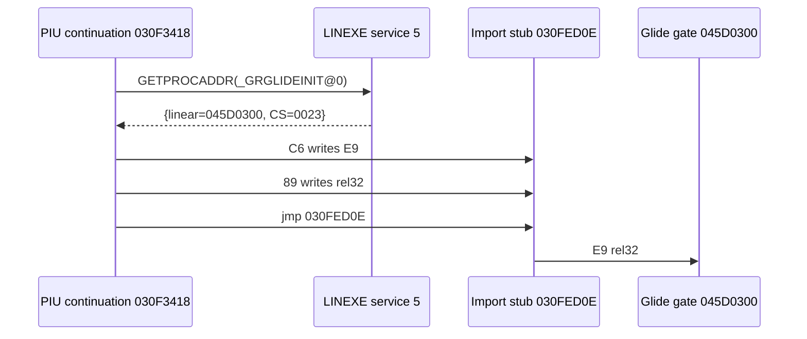

# Executable Design Notes

## Purpose

This document accumulates structures discovered from original executable analysis and loader design decisions.

## Current Findings

Current findings for `MASTER\PIU_1ST\PIU.EXE`:

* The file starts with an `MZ` DOS header.
* The `e_lfanew` value in the `MZ` header is `0x2C90`.
* Offset `0x2C90` contains the `LE` signature.
* `DOS4GW.EXE` exists in the same directory, but the project direction is not to run DOS4GW as an external runtime. The loader should directly analyze the LE image and provide required DOS/DPMI services through HLE.

## Design Direction

* Separate executable analysis into an MZ parser and an LE parser.
* Manage version-specific executable paths and asset roots through target profiles.
* Before first execution, use a non-executing analysis tool to verify the entry point, object table, page table, and fixup information.

## Non-Executing Analysis Tool

The first C++ tool reads `PIU.EXE` without executing it and prints fixed MZ/LE header information.

The initial LE parser interprets these fixed fields:

* byte order
* word order
* CPU type
* OS type
* module flags
* module page count
* entry object/index
* entry offset
* stack object/index
* stack offset
* page size
* object table offset/count
* object page table offset
* fixup page table offset
* fixup record table offset
* data pages offset

Detailed parsing of the object table, page table, and fixup records is accumulated in later stages.

## LE Image Mapping Dry-Run

The observed LE object table in `PIU.EXE` contains four 24-byte records.

The page table uses 4-byte records. The first three bytes are interpreted as a big-endian data page number, and the final byte is interpreted as page flags.

`data_pages_offset` is used as an absolute file offset. Data page number 1 points to `data_pages_offset`, and N points to `data_pages_offset + (N - 1) * page_size`.

The current dry-run mapping creates one buffer per object using `virtual_size`, then copies referenced pages into that buffer. The final page and object end are clamped so copying does not exceed the virtual size.

This step does not interpret fixup records or apply relocations.

## LE Fixup Section Analysis

The LE fixup page table is interpreted as `page_count + 1` 32-bit little-endian offsets.

Each offset is relative to the start of the fixup record table.

The fixup record range for page N starts at `offset[N]` and ends immediately before `offset[N + 1]`.

This step only validates whether the ranges are monotonic, fit inside the fixup record table size, and how large each per-page fixup span is.

The variable-length fixup record structure and relocation application are handled in a later design step.

## LE Fixup Record First-Pass Decoding

Fixup records are variable length, so the current step first supports the internal reference forms observed in `PIU.EXE`.

The common record prefix is interpreted as `source_type`, `target_flags`, and a 16-bit `source_offset`.

Internal targets are interpreted as a 1-byte object number and a target offset. The target offset size is treated as 16-bit or 32-bit depending on the 32-bit offset flag in `target_flags`.

Unsupported flag combinations are counted as unsupported records rather than relocation failures.

## Internal Relocation Dry-Run

All current `PIU.EXE` fixup records decode as internal targets.

The internal relocation value is calculated as the target object's `relocation_base_address` plus `target_offset`.

The source location is converted to an offset inside the owning object buffer using the fixup record's page index and source offset.

The observed source kind `0x07` is handled as a 32-bit little-endian write. Other source kinds need more selector/pointer interpretation, so this step counts them as skipped.

Some records use source offsets that cannot be written directly in the current 4 KB page buffer model, so they are counted as source out-of-range skipped.

## Relocation Skipped Source Analysis

Skipped relocations are not assigned final semantics yet. The analyzer prints counts by source kind and first samples so the next design step can be based on observed data.

The required samples are the first unsupported source kind record and the first source out-of-range record.

Because source kind alone cannot distinguish high source flag meanings, the analyzer also prints counts by full source type.

Unsupported sources print the first sample for each kind so cases such as `source_type=0x13` and plain `source kind 0x05` can be separated.

This step writes only to the analysis LE image buffers, not to executable memory.

## DOS/4GW Loader Result

`Dos4gwLoadResult` is added so the analysis tool and the future runtime can use the same loading flow.

`Dos4gwLoadResult` groups the MZ header, LE header, mapped LE image, fixup section analysis result, fixup record decoding result, and relocation dry-run result.

`LoadDos4gwExecutable` first checks that the target profile format hint is `DOS4GW_LE`, then fills the result using the existing MZ/LE/image/fixup/relocation sequence.

## Runtime Memory Dry-Run

The runtime memory dry-run calculates a pre-execution runtime memory layout plan from `Dos4gwLoadResult`.

The current dry-run records each LE object's relocation base address and virtual size as a runtime object region.

The entry linear address is calculated from the entry object base plus entry offset.

The stack top linear address is calculated from the stack object base plus stack offset. A stack offset equal to the object size is considered valid because it can point to the end of the object.

The HLE reserve base is calculated by rounding the maximum end of all object regions up to a 4 KB boundary.

## Win32/x86 Runtime Memory Policy

The Win32/x86 execution policy reports direct execution capability and the required reserve address range from the runtime memory dry-run result.

Direct control transfer to the original 32-bit x86 entry point is supported only from a 32-bit host process.

In a 64-bit host process, direct entry calls are reported as unsupported, and a future 32-bit helper process or separate execution backend is required.

The preferred allocation base is the lowest base address among runtime object regions.

The required reserve size is the HLE reserve base minus the preferred allocation base.

## Win32 Address Range Dry-Run

The Win32 runtime memory policy now feeds a pre-allocation probe using `preferred_allocation_base` and `required_reserve_size`.

This step does not call `VirtualAlloc`. The Win32-specific `ProbeWin32RuntimeAddressRange` function walks the `[preferred_allocation_base, hle_reserve_base)` range with `VirtualQuery` and checks whether every region is `MEM_FREE`.

If the range contains a non-free region such as `MEM_RESERVE` or `MEM_COMMIT`, the analyzer does not fail. It reports the first blocking block base, size, and state.

This result will guide the later executable memory allocation policy. In particular, if the target range is already occupied, it provides evidence for deciding whether to adjust 32-bit helper process startup order or introduce a relocation fallback.

## Win32 Host Image Base Policy

CMake now provides a `repiu_configure_win32_loader_host` policy function so a Win32 x86 host executable does not directly collide with the fixed address range required by the original DOS/4GW image.

The current `PIU.EXE` runtime memory dry-run places the HLE reserve base at `0x005E7000`, so the Win32 x86 host image base is set higher at `0x01000000`.

For MSVC 32-bit builds, the policy applies `/BASE:0x10000000` and `/DYNAMICBASE:NO`. The policy is applied to `repiu_exe_analyzer` and the dedicated `repiu` target.

This policy does not reserve memory. It reduces the risk that the host executable itself occupies the low address range and prepares the assumptions needed for a later `VirtualAlloc` reservation step.

## Win32 Execution Host Early Reservation

`TargetProfile` now includes `TargetRuntimeReservationHint` so each target can carry its early runtime reservation range.

The current `piu_1st` profile records `base=0x00010000` and `size=0x005D7000` from the previous runtime memory dry-run result.

`repiu` uses this hint to build a Win32 fixed-range policy and attempts to reserve the target range with `VirtualAlloc(MEM_RESERVE)` before reading the executable or copying the LE image.

This step only observes whether the reservation succeeds. Original image copy, page commit/protection, HLE dispatch, and original entry calls are left for later steps.

## Relocation-Based Loading Decision

Reserving the low address range expected by the original DOS/4GW image is not reliable enough to use as the default Win32 x86 path.

# piu_1st Single-Step Trace Observation

The `piu_1st` trap execution path now has a diagnostic path where the guest thread's vectored exception handler processes `EXCEPTION_SINGLE_STEP` and records the last guest `EIP`, instead of forcing thread context capture at timeout.

The current stable last observed location is `0x020F4DC1`, and the byte window focus opcode is `80 3E 00`. This appears to be part of a low-memory string scanning loop.

In the same run, the timeout result accumulates observations for the `FB` privileged trap, `INT 21h`, segment load/store, and traced memory stores. The current observation example is HLE trap count `1`, DOS interrupt count `254`, last DOS AH `0x4A`, and roughly `3k` memory stores.

The next task is to split this low-memory string loop into a clearer helper and keep the single-step diagnostic budget separate from the long-term timeout/execution model.

The next steps will prioritize loading the original LE image at a safe new runtime base using the original relocation metadata.

Fixed-address loading remains a comparison and verification fallback, while the main execution path moves toward a relocatable runtime image.

This does not rewrite original game logic. The original 32-bit x86 code remains the execution target, and the loader only changes memory placement by applying the original relocation metadata.

## Relocatable Runtime Image Dry-Run

The relocatable runtime image dry-run calculates a plan that moves the full image to a new base while preserving the relative placement of original LE objects.

The current default relocated image base is `0x01000000`.

The original image base is treated as the lowest LE object base, `0x00010000`, so the relocation delta is `0x00FF0000`.

Each relocated object base is calculated as `original_object_base + delta`. This preserves object spacing and object-local offsets while avoiding the low-address conflict in Win32 x86.

Entry and stack top are also recalculated from the same object indices and offsets, but using relocated object bases.

The relocation dry-run treats source kind `0x07` records as 32-bit internal pointer writes and calculates the new applied value as `relocated_target_object_base + target_offset`. Other source kinds and source out-of-range records remain skipped so their risk can continue to be tracked.

## Relocated Image Buffer

The relocated image buffer materializes the relocatable runtime image plan into C++ owned buffers.

Each LE object buffer is copied from the existing mapped object memory. The fixup records are then walked again, and source kind `0x07` records write the relocated target address into the source location as a 32-bit little-endian value.

The first applied sample verifies that the existing original relocation value `0x002A4B3D` is replaced with relocated value `0x01294B3D`.

This step still does not use `VirtualAlloc` executable memory and does not call the original entry point.

## Win32 Relocated Image Placement

Win32 relocated image placement places the relocated image buffer into actual Win32 process memory.

The previous Win32 host image base `0x01000000` conflicts with the relocated image base, so the Win32 x86 host image base is moved to `0x10000000`.

The relocated image is allocated at `0x01000000` with `VirtualAlloc(MEM_RESERVE | MEM_COMMIT)`, and each object buffer is copied to its relocated address.

After copying, `VirtualProtect` is applied based on object flags. The current minimal policy uses writable bit `0x2` and executable bit `0x4` to choose one of `PAGE_READWRITE`, `PAGE_EXECUTE_READ`, `PAGE_EXECUTE_READWRITE`, or `PAGE_READONLY`.

This step does not call the original entry point. Its purpose is to verify that the relocated image can be placed in Win32 x86 process memory in an execution-ready layout.

## Minimal Execution Trampoline

The minimal execution trampoline is an observation-only path that calls the relocated entry once from a separate thread after the relocated image has been placed in Win32 x86 process memory.

The current step does not switch to the guest stack. The thread proc calls the relocated entry as a function pointer and wraps it in `__try/__except` so an exception does not immediately terminate the process.

The result is recorded as return, SEH exception, or timeout. Timeout handling is only a first-observation guard and is not a long-term execution model.

This step does not provide HLE dispatch, INT/DPMI traps, or normal game execution.
# Win32 Loader App Entry Point

The current practical loader executable target is `repiu`.

The entry point lives in `src/host/win32/main.cpp`. This path is the host application area that actually loads the original DOS/4GW executable and attempts execution, not an analysis tool location.

The previous `src/tools/win32_execution_host/main.cpp` path and `repiu_win32_execution_host` name were temporary structures from the early execution-observation stage and are no longer the current structural baseline.

`repiu` currently reads `PIU.EXE`, creates the DOS/4GW load result, builds the relocated runtime image plan, builds the relocated image buffer, places it in Win32 process memory, and invokes the minimal execution trampoline in sequence.

# AOT Self-modifying Import Stub

The addresses below are relocated guest linear addresses observed with the
current `pumpit1` profile, not file offsets. LINEXE service 5 GETPROCADDR writes
Glide HLE gate address `0x045D0300` and client CS `0x0023` to result buffer
`0x035D6AA4`, then returns to continuation `0x030F3418`.

After validating the result, the continuation modifies the import stub at
`EDI=0x030FED0E` with two stores and jumps back to it:

```text
030F342C  C6 07 E9       mov byte ptr [edi], 0E9h
030F3432  89 47 01       mov dword ptr [edi+1], eax
030F3436  FF E0          jmp eax
```

The static stub at `0x030FED0E` is an `E8 rel32` call to resolver
`0x030F33B4`. After both stores, its first five bytes are an `E9 rel32` edge to
synthetic Glide gate `0x045D0300`. PIU therefore modifies executable code after
loading; the containing guest page is `0x030FE000`.



A ten-second AOT diagnosis that kept selecting the pre-patch cache entry recorded
19,611 GETPROCADDR calls and zero Glide-gate entries. After page-generation
coherency was implemented, the path recorded two code writes, one retirement of
page `0x030FE000`, one generation publication, two stale-entry relinks, and only
one GETPROCADDR call. These observations separate the correct original ABI from
the stale AOT-cache fault.

Synthetic LINEXE/Glide gates are HLE-owned addresses, not original executable
code. If the AOT CFG copies gate tag bytes `0F 0B 20 00` as ordinary code, the
cache executes `UD2` and raises an illegal instruction. The range must remain a
sentinel HLE boundary.

## Selector-zero and segment-override execution semantics (confirmed)

The original PIU code uses selector zero with DOS-low-memory semantics; for example, it may
load zero into ES and then access `es:[eax]`. Treating that state as an ordinary flat
descriptor with base zero directly accesses host address zero. An AOT segment-override site
guards the `ThreadContext::guest_*` shadow selector and must return to the original HLE
boundary for selector zero or a descriptor whose complete range is DOS low memory. Only a
valid nonzero descriptor and the confirmed GS base-add form use folded-native execution.
A DPMI change to base/limit/flags under the same selector also causes the site to be
re-resolved from the new descriptor fingerprint.

## pumpit3 timer ISR and its slot callback table (confirmed, Task 411)

`pumpit3`'s INT 8 handler walks a **slot table**. Addresses are as executed (arena base
`0x03000000`); subtract `0x02000000` for `repiu_aot_probe`.

The handler enters at `0x0301F7B4` with `pushad` and `push ds,es,fs,gs` followed by `cli`,
walks five slots of stride `0x18` between `0x0301F7CE` and `0x0301F818`, calls each due slot
through `call dword [eax+0x0143ECA4]` at `0x0301F7EE`, chains the previous handler with
`call far [0x0143ED08]` at `0x0301F827`, and ends with the PIC EOI `out dx,al` at
`0x0301F851` before `sti`, the register restore, and `iret`. `RegisterTimerSlot`
(`0x0301F718`) takes the slot index in EAX and the callback in EDX, storing the callback at
`[slot+0xA4]` and the rate `0xB6` at `[slot+0x94]`; `0x0301F85C` initialises the table. A
slot holds an in-use flag at `+0x90`, its rate at `+0x94`, a lock at `+0x98`, an increment
at `+0x9C`, an accumulator at `+0xA0`, and the callback at `+0xA4`; the ISR calls the
callback when the accumulator passes `0x10000` and subtracts that amount, making it a
fixed-point divider.

Slot 0's callback is `0x03010BA4`, registered during boot as
`RegisterTimerSlot(0, 0x03010BA4)` right after `ParseStageCfg("stage.cfg")` — the callback
rides in EDX, which both intervening calls preserve. The registration is followed by
`push 0` / `push 0x406E0000`, the double `240.0`, into `0x0301F6B4`, so **slot 0 is
programmed at 240 Hz**; the 13,173 callback entries measured over 60 seconds (about 220 Hz)
differ from that by the same margin as the 11.9% tick loss Task 366 measured. It bumps the counters at
`0x03183A30`, `0x03183A34`, and `0x03183A38` and then calls the **delay routine
`0x0301DB10`** from `0x03010BCF`.

That routine is the **200-iteration port poll** (`mov ecx,0x02A8`, `in ax,dx`,
`cmp ebx,0xC8`, `jl`), after which it takes the counter at `0x030F9028` modulo four and
branches through the four-entry table at `0x0301DB00`
(`0x0301DB4D`/`0x0301DF8E`/`0x0301D3E3`/`0x0301E816`), each arm writing the multiplexed
output ports `0x02A4`, `0x02A6`, and `0x02A8`.

**This is what `0x0301DB22` — 85.9-97.2% of port I/O cost in Tasks 405-410 — actually is,
and it runs once per timer tick.**

## pumpit2 executable confirmation

The `PIU.EXE` extracted from the pumpit2 CHD through the shared multisession ISO
mount is 1,729,538 bytes with SHA-256
`8DDDD0B8785281D976ADFABCB415A9FF83B159319C36422F9A057A5B01BBDED5`.
It contains four LE objects, has original entry `0x001016B0` and stack top
`0x0059CC90`, and currently reports zero relocation-analysis failures. Asset and
track evidence is maintained in
[`pumpit2-chd-iso9660-mount.md`](analysis/pumpit2-chd-iso9660-mount.md).

## pumpitpc PIU10 MP3 feeder call structure (confirmed, Task 471)

Addresses use the executed arena base `0x03000000`. Feeder loop `0x03019380` compares the source
cursor with available end, then checks the `ECX < 100` and cursor `< 0x76C` service conditions at
`0x030193A3`. The data path at `0x03019442`-`0x03019461` increments the cursor, frame count, and
`ECX`, loads port `0x02DA` into EAX, and calls the byte-output wrapper. After return,
`0x03019466`-`0x03019471` compares frame count/target and branches back to the loop.

The wrapper at `0x030EC74E`-`0x030EC757` is `push ebx; mov ebx,eax; mov al,dl; mov edx,ebx;
out dx,al; pop ebx; ret`; the privileged instruction is at `0x030EC755`. At the `OUT`, the guest
stack therefore contains saved EBX at `[ESP]` and feeder return address `0x03019466` at `[ESP+4]`.
This is an original-executable hardware-call ABI fact. The HLE matcher validates the call/return
and state-update relationships rather than these particular addresses.
