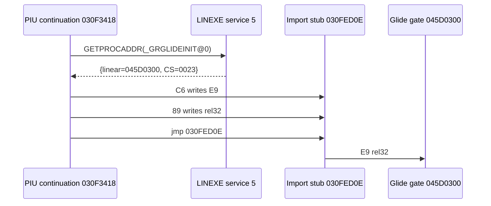

# 실행 파일 설계 노트

## 목적

이 문서는 원본 실행 파일 분석으로 확인한 구조와 로더 설계 결정을 누적 기록한다.

## 현재 확인 사항

`MASTER\PIU_1ST\PIU.EXE`에 대해 현재 확인한 내용:

* 파일은 `MZ` DOS 헤더로 시작한다.
* `MZ` 헤더의 `e_lfanew` 값은 `0x2C90`이다.
* `0x2C90` 위치에는 `LE` 시그니처가 있다.
* 같은 디렉터리에 `DOS4GW.EXE`가 존재하지만, 프로젝트 방향은 DOS4GW를 외부 런타임으로 실행하는 것이 아니라 LE 이미지를 직접 분석하고 필요한 DOS/DPMI 서비스를 HLE로 제공하는 것이다.

## 설계 방향

* 실행 파일 분석은 MZ 파서와 LE 파서로 분리한다.
* 버전별 실행 경로와 자산 루트는 타깃 프로파일로 관리한다.
* 첫 실행 전에는 비실행 분석 도구로 엔트리 포인트, 오브젝트 테이블, 페이지 테이블, fixup 정보를 확인한다.

## 비실행 분석 도구

첫 C++ 도구는 `PIU.EXE`를 실행하지 않고 읽어서 MZ/LE 고정 헤더 정보를 출력한다.

초기 LE 파서는 다음 고정 필드를 해석한다.

* byte order
* word order
* CPU type
* OS type
* module flags
* module page count
* entry object/index
* entry offset
* stack object/index
* stack offset
* page size
* object table offset/count
* object page table offset
* fixup page table offset
* fixup record table offset
* data pages offset

오브젝트 테이블, 페이지 테이블, fixup record의 상세 파싱은 다음 단계에서 누적한다.

## LE 이미지 매핑 Dry-Run

현재 확인한 `PIU.EXE`의 LE 오브젝트 테이블은 24바이트 레코드 4개로 구성된다.

페이지 테이블은 4바이트 레코드이며, 앞 3바이트는 big-endian 형태의 data page 번호, 마지막 1바이트는 page flags로 해석한다.

`data_pages_offset`는 파일 절대 오프셋으로 사용한다. data page 번호 1은 `data_pages_offset`, 번호 N은 `data_pages_offset + (N - 1) * page_size`를 가리킨다.

현재 dry-run 매핑은 각 오브젝트의 `virtual_size`만큼 버퍼를 만들고, 오브젝트가 참조하는 페이지를 해당 버퍼에 복사한다. 마지막 페이지와 오브젝트 끝은 가상 크기를 넘지 않도록 잘라서 복사한다.

이 단계에서는 fixup record를 해석하거나 relocation을 적용하지 않는다.

## LE Fixup Section 분석

LE fixup page table은 `page_count + 1`개의 32-bit little-endian offset으로 해석한다.

각 offset은 fixup record table 시작 기준 상대 offset이다.

page N의 fixup record 범위는 `offset[N]`부터 `offset[N + 1]` 직전까지이다.

현재 단계에서는 이 범위가 단조 증가하는지, fixup record table 크기 안에 들어오는지, page별 fixup span이 얼마나 되는지만 검증한다.

fixup record의 가변 길이 구조와 relocation 적용은 다음 단계에서 별도 설계로 진행한다.

## LE Fixup Record 1차 디코딩

fixup record는 가변 길이이므로, 현재 단계에서는 `PIU.EXE`에서 관찰되는 내부 참조 형태를 우선 지원한다.

공통 record 시작 구조는 `source_type`, `target_flags`, 16-bit `source_offset`으로 해석한다.

내부 target은 1바이트 object 번호와 target offset으로 해석한다. target offset 크기는 `target_flags`의 32-bit offset flag 여부에 따라 16-bit 또는 32-bit로 처리한다.

지원하지 않는 flag 조합은 relocation 실패로 처리하지 않고 unsupported record로 집계한다.

## 내부 Relocation Dry-Run

현재 `PIU.EXE`의 fixup record는 모두 내부 target으로 디코딩된다.

내부 relocation 값은 target object의 `relocation_base_address`와 `target_offset`을 더한 값으로 계산한다.

source 위치는 fixup record의 page index와 source offset을 통해 해당 오브젝트 버퍼 내 offset으로 변환한다.

현재 관찰된 source kind `0x07`은 32-bit little-endian write로 처리한다. 다른 source kind는 selector/포인터 의미가 더 필요하므로 이 단계에서는 skipped로 집계한다.

일부 record는 현재 4KB page buffer 모델에서 직접 write할 수 없는 source offset을 사용하므로 source out-of-range skipped로 집계한다.

## Relocation Skipped Source 분석

skipped relocation은 아직 의미를 확정하지 않고, source kind별 count와 첫 sample을 출력해 다음 단계 설계 근거로 사용한다.

현재 출력해야 하는 sample은 첫 unsupported source kind record와 첫 source out-of-range record이다.

source kind만으로는 상위 source flag 의미를 구분할 수 없으므로 full source type별 count도 함께 출력한다.

unsupported source는 kind별 첫 sample을 출력해 `source_type=0x13`과 순수 `source kind 0x05` 같은 사례를 분리한다.

이 단계는 실행 가능한 메모리에 쓰지 않고, 분석용 LE 이미지 버퍼에만 값을 적용한다.

## DOS/4GW Loader Result

분석 도구와 향후 runtime이 같은 로딩 흐름을 사용하도록 `Dos4gwLoadResult`를 추가한다.

`Dos4gwLoadResult`는 MZ 헤더, LE 헤더, 매핑된 LE 이미지, fixup section 분석 결과, fixup record 디코딩 결과, relocation dry-run 결과를 하나로 묶는다.

`LoadDos4gwExecutable`은 target profile의 format hint가 `DOS4GW_LE`인지 확인한 뒤 기존 MZ/LE/image/fixup/relocation 순서로 결과를 채운다.

## Runtime Memory Dry-Run

`Dos4gwLoadResult`를 입력으로 받아 실행 전 runtime memory 배치 계획을 계산한다.

현재 dry-run은 LE object의 relocation base address와 virtual size를 runtime object region으로 기록한다.

entry linear address는 entry object base와 entry offset을 더해 계산한다.

stack top linear address는 stack object base와 stack offset을 더해 계산한다. stack offset은 object 끝을 가리킬 수 있으므로 object size와 같은 값도 유효하게 본다.

HLE reserve base는 모든 object region 끝의 최댓값을 4KB 단위로 올림 정렬해 계산한다.

## Win32/x86 Runtime Memory Policy

Win32/x86 실행 정책은 runtime memory dry-run 결과를 기반으로 직접 실행 가능성과 필요한 예약 주소 범위를 보고한다.

원본 32-bit x86 entry로 직접 제어를 넘기는 방식은 32-bit host process에서만 지원한다.

64-bit host process에서는 직접 entry 호출을 unsupported로 보고하며, 향후 32-bit helper process 또는 별도 execution backend가 필요하다.

preferred allocation base는 runtime object region 중 가장 낮은 base address이다.

required reserve size는 HLE reserve base에서 preferred allocation base를 뺀 값이다.
## Win32 주소 범위 Dry-Run

Win32 runtime memory policy가 계산한 `preferred_allocation_base`와 `required_reserve_size`를 바탕으로, 실제 메모리 예약 전에 현재 프로세스 주소 공간을 검사한다.

이번 단계는 `VirtualAlloc`을 호출하지 않는다. Win32 전용 `ProbeWin32RuntimeAddressRange` 함수가 `VirtualQuery`로 `[preferred_allocation_base, hle_reserve_base)` 범위를 순회하고, 모든 region이 `MEM_FREE`인지 확인한다.

범위 안에서 `MEM_RESERVE` 또는 `MEM_COMMIT` 등 비어 있지 않은 region이 발견되면 analyzer는 실패하지 않고 첫 blocking block의 base, size, state를 출력한다.

이 결과는 이후 실제 executable memory allocation 정책을 정할 때 사용한다. 특히 목표 주소 범위가 이미 점유된 경우, 32-bit helper process 초기화 순서 조정 또는 relocation fallback 필요 여부를 판단하는 근거가 된다.
# Minimal Execution Trampoline

Minimal execution trampoline은 relocated image가 Win32 x86 process memory에 배치된 뒤 원본 entry를 별도 thread에서 한 번 호출해 보는 관찰용 경로다.

현재 단계는 guest stack 전환을 하지 않는다. thread proc 안에서 relocated entry를 함수 포인터로 호출하고, `__try/__except`로 예외를 잡아 process가 바로 종료되지 않도록 한다.

결과는 정상 return, SEH exception, timeout 중 하나로 기록한다. timeout은 장기 실행 모델이 아니며 첫 관찰을 위한 안전장치다.

이 단계는 HLE dispatcher, INT/DPMI trap, 정상 게임 실행을 제공하지 않는다.

# Win32 Relocated Image Placement

Win32 relocated image placement는 relocated image buffer를 실제 Win32 process memory에 배치한다.

기존 Win32 host image base `0x01000000`은 relocated image base와 충돌하므로, Win32 x86 host image base는 `0x10000000`으로 이동한다.

relocated image는 `0x01000000`에 `VirtualAlloc(MEM_RESERVE | MEM_COMMIT)`으로 확보하고, object별 buffer를 해당 주소로 복사한다.

복사 후 object flags를 기준으로 `VirtualProtect`를 적용한다. 현재 최소 정책은 writable bit `0x2`, executable bit `0x4`를 기준으로 `PAGE_READWRITE`, `PAGE_EXECUTE_READ`, `PAGE_EXECUTE_READWRITE`, `PAGE_READONLY` 중 하나를 선택한다.

이번 단계는 원본 entry를 호출하지 않는다. 목표는 relocated image가 Win32 x86 process memory 안에 실행 준비 형태로 배치될 수 있는지 확인하는 것이다.

# Relocated Image Buffer

Relocated image buffer는 relocatable runtime image plan을 실제 C++ owned buffer로 구체화한다.

각 LE object buffer는 기존 mapped object memory에서 복사한다. 그 뒤 fixup record를 다시 순회하면서 source kind `0x07` record에 대해 relocated target address를 source 위치에 32-bit little-endian 값으로 기록한다.

첫 적용 sample은 기존 original relocation 값 `0x002A4B3D`가 relocated 값 `0x01294B3D`로 교체되는지 확인하는 기준으로 사용한다.

이번 단계는 아직 `VirtualAlloc` executable memory를 사용하지 않으며, 원본 entry도 호출하지 않는다.

# Relocatable Runtime Image Dry-Run

Relocatable runtime image dry-run은 원본 LE object의 상대 배치를 유지하면서 전체 image를 새 base로 이동하는 계획을 계산한다.

현재 기본 relocated image base는 `0x01000000`이다.

원본 image base는 가장 낮은 LE object base인 `0x00010000`으로 보고, relocation delta는 `0x00FF0000`으로 계산한다.

각 object의 새 base는 `original_object_base + delta`로 계산한다. 이 방식은 object 사이 간격과 object 내부 offset을 유지하면서 Windows 32-bit 낮은 주소 충돌을 피하기 위한 것이다.

entry와 stack top도 같은 object index와 offset을 사용해 새 object base 기준으로 다시 계산한다.

relocation dry-run은 source kind `0x07` record를 32-bit internal pointer write로 보고, target object의 relocated base와 target offset을 더한 값을 새 적용 값으로 계산한다. 나머지 source kind와 source out-of-range record는 기존과 같이 skipped로 남겨 위험을 추적한다.

# Relocation 기반 로드 결정

Win32 x86 프로세스에서 원본 DOS/4GW 이미지가 기대하는 낮은 주소 범위를 그대로 예약하는 방식은 안정적인 기본 경로로 보기 어렵다.

따라서 다음 단계부터는 원본 LE relocation 정보를 사용해 안전한 새 runtime base에 이미지를 올리는 방식을 우선 설계한다.

원본 주소 고정 로드는 비교와 검증용 fallback으로 남기며, 실행 주 경로는 relocatable runtime image로 이동한다.

이 방식은 원본 게임 로직을 재작성하는 것이 아니다. 원본 32-bit x86 코드는 그대로 실행 대상으로 유지하고, loader가 원본 relocation metadata를 적용해 주소 배치만 바꾼다.

# Win32 Execution Host 초기 예약

`TargetProfile`에 `TargetRuntimeReservationHint`를 추가하여 target별 초기 runtime 예약 범위를 보관한다.

현재 `piu_1st`는 이전 runtime memory dry-run 결과를 바탕으로 `base=0x00010000`, `size=0x005D7000`을 예약 힌트로 가진다.

`repiu_win32_execution_host`는 실행 파일을 읽거나 LE image를 복사하기 전에 이 힌트를 사용해 Win32 fixed range policy를 만들고, `VirtualAlloc(MEM_RESERVE)`로 목표 범위 예약을 시도한다.

이번 단계는 예약 성공 여부만 관찰한다. 원본 image copy, page commit/protection, HLE dispatcher, 원본 entry 호출은 이후 단계에서 추가한다.

# Win32 Host Image Base 정책

Win32 x86 host executable이 원본 DOS/4GW 이미지의 고정 주소 범위와 직접 충돌하지 않도록 CMake에 `repiu_configure_win32_execution_host` 정책 함수를 추가한다.

현재 `PIU.EXE` runtime memory dry-run의 HLE reserve base는 `0x005E7000`이므로, Win32 x86 host image base는 이보다 높은 `0x01000000`으로 지정한다.

MSVC 32-bit 빌드에서는 `/BASE:0x01000000`과 `/DYNAMICBASE:NO`를 적용한다. 현재는 dedicated execution host가 없으므로 `repiu_exe_analyzer`에 먼저 적용하고, 이후 실행 전용 host target이 생기면 같은 정책을 재사용한다.

이 정책은 실제 메모리 예약을 수행하지 않는다. host executable 자체가 낮은 주소 범위를 차지하는 위험을 줄이고, 이후 `VirtualAlloc` 기반 예약 단계의 전제 조건을 정리하기 위한 것이다.
# Win32 로더 앱 진입점

현재 실제 로더 executable target은 `repiu_loader_win32`이다.

진입점은 `src/host/win32/main.cpp`에 둔다. 이 경로는 분석 도구가 아니라 원본 DOS/4GW executable을 실제로 로드하고 실행을 시도하는 host 애플리케이션 영역이다.

기존 `src/tools/win32_execution_host/main.cpp` 위치와 `repiu_win32_execution_host` 이름은 초기 실행 관찰 단계의 임시 구조였으므로 더 이상 현재 구조 기준으로 사용하지 않는다.

`repiu_loader_win32`는 현재 `PIU.EXE` 읽기, DOS/4GW load result 생성, relocated runtime image plan 생성, relocated image buffer 생성, Win32 process memory placement, minimal execution trampoline 호출을 순서대로 수행한다.
# piu_1st Single-Step Trace 관측

`piu_1st` trap 실행 경로에는 timeout 순간의 강제 thread context capture 대신, guest thread 내부의 vectored exception handler가 `EXCEPTION_SINGLE_STEP`를 처리하며 마지막 guest `EIP`를 기록하는 진단 경로를 추가했다.

현재 안정적으로 관측되는 마지막 위치는 `0x020F4DC1`이며, byte window의 focus opcode는 `80 3E 00`이다. 이 지점은 low-memory 문자열 검사 루프로 보인다.

같은 실행에서 `FB` privileged trap, `INT 21h`, segment load/store, traced memory store가 timeout 결과에 누적 출력된다. 현재 관측 예시는 HLE trap count `1`, DOS interrupt count `254`, 마지막 DOS AH `0x4A`, memory store count 약 `3천` 회 수준이다.

다음 작업은 이 low-memory 문자열 루프를 더 명확한 helper로 분리하고, single-step 진단 budget과 timeout 판정을 장기 실행 모델과 분리하는 것이다.

# AOT self-modifying import stub

아래 주소는 file offset이 아니라 현재 `pumpit1` profile에서 관찰한 relocated guest
linear address다. LINEXE service 5 GETPROCADDR은 결과 buffer `0x035D6AA4`에
Glide HLE gate linear address `0x045D0300`과 client CS `0x0023`을 기록한 뒤
continuation `0x030F3418`로 복귀한다.

continuation은 반환값을 확인한 뒤 `EDI=0x030FED0E`인 import stub을 다음 두 store로
직접 수정한다.

```text
030F342C  C6 07 E9       mov byte ptr [edi], 0E9h
030F3432  89 47 01       mov dword ptr [edi+1], eax
030F3436  FF E0          jmp eax
```

정적 원본의 `0x030FED0E`는 resolver `0x030F33B4`를 호출하는 `E8 rel32` stub이다.
두 store가 끝나면 첫 5바이트는 `E9 rel32`가 되어 합성 Glide gate
`0x045D0300`으로 직접 이동한다. 따라서 PIU 원본은 load 후 실행 코드를 수정하며,
해당 page는 `0x030FE000`이다.



10초 AOT 진단에서 수정 전 cache entry를 계속 선택했을 때 GETPROCADDR은
19,611회, Glide gate 진입은 0회였다. page generation 일관성 구현 후에는 두
code write, page `0x030FE000` retirement 1회, generation publish 1회, stale entry
relink 2회가 확인됐고 GETPROCADDR은 1회로 수렴했다. 이 수치는 원본 ABI 사실과
AOT cache 일관성 문제를 구분하는 검증 증거다.

합성 LINEXE/Glide gate는 원본 executable 코드가 아니라 HLE 소유 주소다. AOT CFG가
gate tag `0F 0B 20 00`을 일반 명령으로 복사하면 cache에서 `UD2` illegal instruction이
발생하므로, 해당 범위는 sentinel HLE boundary로 남겨야 한다.

## selector 0 및 segment-override 실행 의미 (확인됨)

PIU 원본은 selector 0을 DOS low-memory 의미로 사용하며, 예를 들어 `mov es, ax`로 ES를
0으로 만든 뒤 `es:[eax]`를 접근할 수 있습니다. 이 상태를 descriptor base 0의 일반
flat 접근과 동일하게 취급하면 host 주소 0을 직접 접근하게 됩니다. AOT
segment-override site는 `ThreadContext::guest_*` shadow selector를 guard하고, selector
0 또는 전체 범위가 DOS low-memory인 descriptor에서는 반드시 원본 HLE 경계로
되돌아갑니다. selector가 0이 아닌 정상 descriptor와 확인된 GS base-add 접근만 folded
native 경로를 사용합니다. 같은 selector의 base/limit/flags가 DPMI로 변경되는 경우도
새 descriptor fingerprint로 site를 재해석합니다.

## pumpit2 실행 파일 확인

`pumpit2` CHD에서 공용 멀티세션 ISO mount로 추출한 `PIU.EXE`는 1,729,538
바이트이고 SHA-256은
`8DDDD0B8785281D976ADFABCB415A9FF83B159319C36422F9A057A5B01BBDED5`이다.
LE object는 4개, 원본 entry는 `0x001016B0`, stack top은 `0x0059CC90`이며 현재
loader의 relocation 분석은 실패 0건이다. 세부 asset/track 근거는
[`pumpit2-chd-iso9660-mount.md`](analysis/pumpit2-chd-iso9660-mount.md)에 둔다.