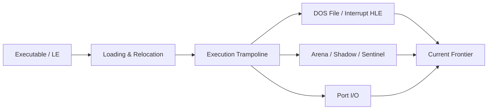

# rePIU 바이너리 분석 색인

이 디렉터리는 원본 PIU 실행 파일과 rePIU 실행 결과에서 직접 확인한 프로젝트 고유 사실을 주제별로 누적합니다. 시간순 작업 증거는 `docs/work-logs/`에 남기고, 여기에는 현재 유효한 결론을 통합합니다.

표기 기준:

* **확인됨**: 정적 분석, register/byte dump, 반복 실행 또는 코드로 직접 검증
* **추정**: 관측과 정황은 일치하지만 원본 환경 대조가 더 필요함
* **미확정**: 다음 분석에서 검증해야 할 가설 또는 blocker

## 문서

* [실행 파일 로딩과 relocation](executable-loading-and-relocation.md)
* [Win32 실행 trampoline과 예외 기반 HLE](execution-trampoline-and-hle.md)
* [Runtime arena, shadow memory, sentinel 분석](memory-arena-shadow-and-sentinel.md)
* [DOS 파일 I/O와 INT3 해결 이력](dos-file-io-and-int3.md)
* [Interrupt와 port I/O 관찰](interrupts-and-port-io.md)
* [현재 실행 frontier와 다음 분석 대상](current-execution-frontier.md)
* [DOS4GW loader와 selector 할당 분석](dos4gw-loader-selector-allocation.md)
* [DOS/4G DLL loader와 INT 21h AX=FF00h 역추적](dll-loader-int21-ff00.md)

# rePIU Binary Analysis Index

This directory accumulates project-specific facts directly confirmed from the original PIU executable and rePIU execution. Chronological evidence remains in `docs/work-logs/`; these files consolidate the currently valid conclusions by topic.

Status labels are **Confirmed**, **Inferred**, and **Unresolved**. See the linked Korean-first documents above; each includes an English section.
