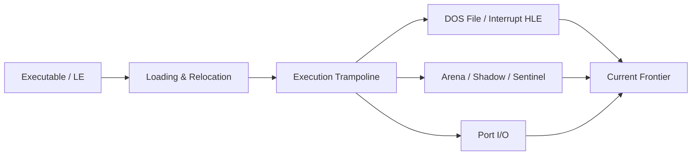

# rePIU 바이너리 분석 색인

이 디렉터리는 원본 PIU 실행 파일과 rePIU 실행 결과에서 직접 확인한 프로젝트 고유 사실을 주제별로 누적합니다. 시간순 작업 증거는 `docs/work-logs/`에 남기고, 여기에는 현재 유효한 결론을 통합합니다.

표기 기준:

* **확인됨**: 정적 분석, register/byte dump, 반복 실행 또는 코드로 직접 검증
* **추정**: 관측과 정황은 일치하지만 원본 환경 대조가 더 필요함
* **미확정**: 다음 분석에서 검증해야 할 가설 또는 blocker

## 문서

* [실행 파일 로딩과 relocation](executable-loading-and-relocation.md)
* [Win32 실행 trampoline과 예외 기반 HLE](execution-trampoline-and-hle.md)
* [Runtime arena, shadow memory, sentinel 분석](memory-arena-shadow-and-sentinel.md)
* [DOS 파일 I/O와 INT3 해결 이력](dos-file-io-and-int3.md)
* [Interrupt와 port I/O 관찰](interrupts-and-port-io.md)
* [펌프 잇 업 (PIU) I/O 포트 사양 분석 및 유지 지침](piu-io-port-specification.md)
* [현재 실행 frontier와 다음 분석 대상](current-execution-frontier.md)
* [실행 frontier 과거 원문 색인](history/README.md)
* [DOS4GW loader와 selector 할당 분석](dos4gw-loader-selector-allocation.md)
* [DOS/4G DLL loader와 INT 21h AX=FF00h 역추적](dll-loader-int21-ff00.md)
* [DOS4GW 결합 EXP module과 segment map](dos4gw-bound-module-map.md)
* [DOS/16M resident copy/relocation table 정적 복원](dos16m-resident-copy-relocation-table.md)
* [DOS/16M loader symbolic replay와 service 0 mapping](dos16m-symbolic-replay.md)
* [DOS/4G AX=FF00h saved frame과 반환 데이터 흐름](dos4g-service-zero-frame-dataflow.md)
* [DOS/4G client GS와 GS:0x42 private environment](dos4g-client-gs-private-environment.md)
* [Glide2x.ovl과 OpenGL HLE 분석](glide2x-ovl-and-opengl-hle.md)
* [Glide gate 비용 귀속 / Glide gate cost attribution](glide-gate-cost-attribution.md)
* [RES/PTX resource loading과 size truncation 분석](res-ptx-resource-loading.md)

# rePIU Binary Analysis Index

* [AOT return stack divergence](aot-return-stack-divergence.md)
* [AOT worker inline cache / AOT worker-backed inline cache](aot-worker-inline-cache.md)
* [AOT self-modifying code 일관성 / AOT self-modifying code coherency](aot-self-modifying-code.md)
* [AOT 기본 블록 fall-through / AOT basic-block fall-through](aot-basic-block-fallthrough.md)
* [AOT 조건 분기 dispatcher / AOT conditional transfer dispatcher](aot-conditional-transfer-dispatch.md)
* [AOT 간접 전송 dispatcher / AOT indirect transfer dispatcher](aot-indirect-transfer-dispatch.md)
* [Runtime AOT 동적 변환 / Runtime AOT dynamic translation](runtime-aot-dynamic-translation.md)
* [AOT 실행 backend 준비 / AOT execution backend preparation](aot-execution-backend.md)
* [AOT 코드 캐시 생성 분석 / AOT code-cache emission](aot-code-cache-emission.md)
* [AOT-DBT HLE 후 즉시 복귀 / AOT-DBT immediate post-HLE re-entry](aot-dbt-post-hle-reentry.md)
* [AOT-DBT return miss host dispatch](aot-dbt-return-miss-dispatch.md)

* [pumpit1 CHD/ISO9660 mount 분석 / pumpit1 CHD/ISO9660 mount](pumpit1-chd-iso9660-mount.md)

* [REP MOVS와 장시간 실행 경계 / REP MOVS and long-runtime boundary](rep-movs-and-long-runtime-boundary.md)

* [PIU LINEXE call-gate ABI](piu-linexe-call-gate-abi.md)
* [CAT702 PIU lock check / CAT702 PIU 보안 검사](cat702-piu-lock-check.md)
* [LINEXE arena runtime frontier](linexe-arena-runtime-frontier.md)
* [RES/PTX resource loading analysis](res-ptx-resource-loading.md)

The DOS/4G DLL loader analysis also records the [DOS/32A behavioral cross-reference and clean-room boundary](dll-loader-int21-ff00.md#dos32a-교차-확인과-적용-한계).

This directory accumulates project-specific facts directly confirmed from the original PIU executable and rePIU execution. Chronological evidence remains in `docs/work-logs/`; these files consolidate the currently valid conclusions by topic.

Status labels are **Confirmed**, **Inferred**, and **Unresolved**. See the linked Korean-first documents above; each includes an English section.
## 추가 분석 / Additional Analysis

* [네이티브 실행 single-step 병목 / Native execution single-step bottleneck](native-execution-single-step-overhead.md)
# MSCDEX / CD audio

* [pumpit1 MSCDEX 및 CHD CD 오디오](pumpit1-mscdex-cd-audio.md)
* [AOT 변환 계획 coverage](aot-translation-plan-coverage.md)
* [AOT dynamic ���� ���� ��dz �м� / AOT dynamic stack exception storm](20260713-aot-dynamic-stack-exception-storm.md)

* [pumpit2 CHD/ISO9660 mount 분석 / pumpit2 CHD/ISO9660 mount](pumpit2-chd-iso9660-mount.md)
* [pumpit3 bring-up: 프로필 추가에서 렌더 루프까지 / pumpit3 bring-up](pumpit3-bring-up.md)
* [pumpit3 기동 중 멈춤 / pumpit3 startup stall](pumpit3-startup-stall.md)
* [pumpito CHD/ISO9660 마운트 분석 / pumpito CHD/ISO9660 mount](pumpito-chd-iso9660-mount.md)
* [pumpite CHD/ISO9660 마운트 분석 / pumpite CHD/ISO9660 mount](pumpite-chd-iso9660-mount.md)
