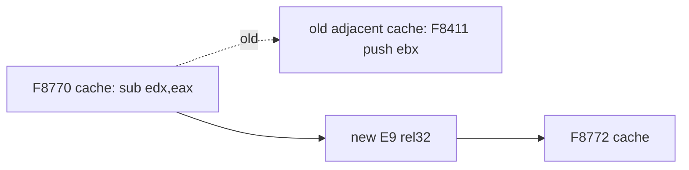

# AOT 기본 블록 fall-through 분석

## 확인됨

* PIU `0x000F8770`의 cache entry는 `29 C2`(`sub edx,eax`) 두 바이트만 발행했고, 바로 다음 cache offset에는 무관한 `0x000F8411`의 `53`(`push ebx`)가 있었습니다.
* basic block 끝의 정상 선형 흐름을 명시적으로 연결하지 않아 CPU가 물리적으로 인접한 다른 block을 실행했습니다.
* 그 결과 `0x000F8460`에서 두 번째 `RET`가 return address 대신 stack value `1`을 읽었습니다.
* block tail `kCopy` 뒤에 `E9 rel32`를 넣은 뒤 return trace는 `0x000F845B -> 0x000F8770` 및 `0x000F87AA -> 0x000F8636`을 포함해 일치했습니다.
* 3초 `aot-dynamic` 관찰은 예외 없이 `INTRO.ANI`, `STAGE.CFG`, `SPR.RES`를 열고 읽었으며, 같은 구간의 legacy 관찰과 같은 resource-loading 단계에 도달했습니다.

## 현재 성능 frontier

direct edge는 image 내부 `rel32`로 복원했습니다. 그러나 실행 중 동적으로 발견된 `FF /2` indirect call과 `RET`는 아직 각각 dispatcher를 통과합니다. 3초 관찰에서 반복된 `0x030F514F -> 0x0301E140` call과 `0x0301E186 -> 0x030F5153` return이 수만 회 나타났습니다. 이는 다음 일반화 가능한 최적화 대상입니다.

# AOT Basic-Block Fall-through Analysis

## Confirmed

* The PIU cache entry at `0x000F8770` emitted only `29 C2` (`sub edx,eax`); the next physical cache offset held unrelated `0x000F8411` `53` (`push ebx`).
* Normal linear flow at a basic-block end was not linked, so the CPU executed a physically adjacent unrelated block.
* Consequently the second `RET` at `0x000F8460` read stack value `1` rather than a return address.
* Adding an `E9 rel32` after a tail `kCopy` produced matching return traces, including `0x000F845B -> 0x000F8770` and `0x000F87AA -> 0x000F8636`.
* A three-second `aot-dynamic` observation opened and read `INTRO.ANI`, `STAGE.CFG`, and `SPR.RES` without an exception, reaching the same resource-loading stage as legacy.

## Current performance frontier

Internal direct edges again use `rel32`. Dynamically discovered `FF /2` calls and `RET` still pass through the dispatcher individually. The repeated `0x030F514F -> 0x0301E140` call and `0x0301E186 -> 0x030F5153` return appeared tens of thousands of times in three seconds and are the next general optimization target.
