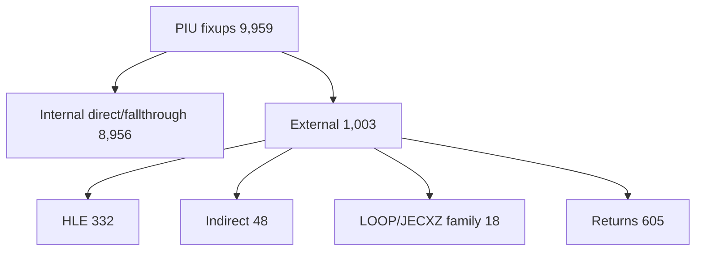

# AOT 코드 캐시 생성 분석

## 확인됨

플랫폼 공용 emitter가 PIU의 계획 레코드 26,710개를 118,701바이트 code-cache image로 변환했습니다. direct target과 명시적 fallthrough fixup 8,956개는 모두 cache 내부 주소로 해결됐고 emitted instruction의 Zydis 재디코딩 실패는 0개였습니다.

OpenWatcom의 mapped LE 표본 792개도 모두 cache 생성과 재디코딩 검증에 성공했습니다. 총 931,644개 direct/fallthrough fixup이 해결됐고 decode 실패는 0개였습니다. cache 생성은 Win32 x86 Debug에서 평균 7,847.2us, 최대 22,505us였습니다. 이전과 동일하게 mapped LE object가 없는 `clibexam_exec_c` 한 개는 입력 단계에서 제외됐습니다.

## 추정

정적 layout과 direct relocation 비용은 실행 시작 시간의 병목이 아닙니다. 이
분석 시점의 후속 요소였던 간접 target/return dispatch와 code-cache 보호 정책은
이후 worker-backed 실행 경로에서 구현됐습니다. `LOOP/JECXZ` 의미 보존, 전체 HLE
callback state ABI, 장기 cache reclamation은 계속 별도 범위입니다.

task 191에서 runtime code modification은 immutable address map과 별도
active/generation metadata, page retirement, cache-to-guest provenance 유지로
처리했습니다. 정적 emitter output 형식은 바꾸지 않고 Win32 placement/coherence
계층이 live generation을 관리합니다. HLE 소유 guest 범위는 translation plan에서
sentinel boundary로 분류되어 합성 gate byte를 code cache에 복사하지 않습니다.

## 미확정

* HLE 진입과 복귀 때 보존할 GPR, EFLAGS, x87, shadow selector의 정확한 ABI
* 아직 개별 HLE boundary에서 확인하지 못한 전체 callback state ABI
* `LOOP/JECXZ` family와 far transfer의 일반 실행 정책
* retired generation의 cache capacity 회수와 여러 guest thread publication

# AOT Code Cache Emission Analysis

The emitter converts all returns into dispatcher sentinels so mixed guest/cache
return addresses cannot escape unchecked. PIU has 1,003 external boundaries: 332
HLE sites, 48 indirect exits, 18 LOOP/JECXZ-family branches, and 605 returns. Its
8,956 direct-target and explicit-fallthrough fixups remain fully resolved with
zero decode failures. Later worker-backed execution implemented indirect and
return dispatch plus cache protection. General LOOP/JECXZ handling, unverified
HLE callback state, far transfers, and long-term cache reclamation remain open.

Task 191 keeps the immutable emitter address map and manages self-modifying code
in the Win32 placement/coherency layer through parallel active/generation state,
page retirement, and persistent cache-to-guest provenance. HLE-owned guest ranges
become sentinel boundaries instead of copied synthetic gate bytes. Long-term
generation reclamation and multi-thread publication remain unresolved.
