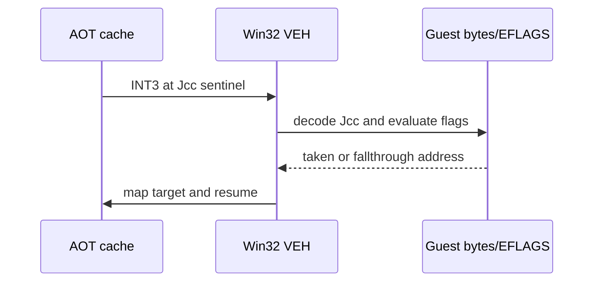

# AOT 조건 분기 dispatcher 분석

## 확인됨

* PIU differential probe에서 `0x000F8460`의 두 번째 `RET`는 예상한 caller return address 대신 `0x00000001`을 읽었습니다.
* 해당 시점 전의 direct call entry와 call-site register/stack snapshot은 legacy와 같았습니다. 따라서 단순 호출 push 규칙만으로 원인을 설명할 수 없습니다.
* 기존 cache emitter는 Jcc를 호스트 native Jcc와 unconditional cache jump로 발행했습니다. 이 구조에서는 분기 선택을 transfer ring에 남기지 못합니다.

## 구현 결론

표준 Jcc를 `INT3` sentinel로 발행하고, bridge가 원본 guest bytes와 `CONTEXT::EFlags`로 x86 조건을 판정하도록 변경했습니다. 선택된 게스트 주소는 direct call/jump/return과 같은 resolver를 사용합니다. 이는 특정 PIU 주소를 하드코딩하지 않습니다.

## 미확정

이 변경이 `0x00000001` return-value divergence를 제거하는지는 PIU 재실행으로 확인해야 합니다. `LOOP`/`JCXZ`, prefix가 있는 조건 분기, 그리고 self-modified code는 아직 별도 처리 대상입니다.

# AOT Conditional Transfer Dispatcher Analysis

## Confirmed

* At the second `RET` at `0x000F8460`, the PIU differential probe read `0x00000001` instead of the caller return address.
* The direct-call entry and call-site register/stack snapshots immediately beforehand matched legacy, so the cause is not explained by call-push semantics alone.
* The prior cache emitter generated native Jcc plus an unconditional cache jump, which did not expose branch choices to the transfer ring.

## Implementation conclusion

Standard Jcc is emitted as an `INT3` sentinel. The bridge decodes original guest bytes and evaluates the x86 condition from `CONTEXT::EFlags`, then uses the common resolver for the selected guest target. No PIU address is hard-coded.

## Unresolved

PIU must be rerun to determine whether this removes the `0x00000001` return divergence. `LOOP`/`JCXZ`, prefixed conditional branches, and self-modifying code remain separate concerns.
