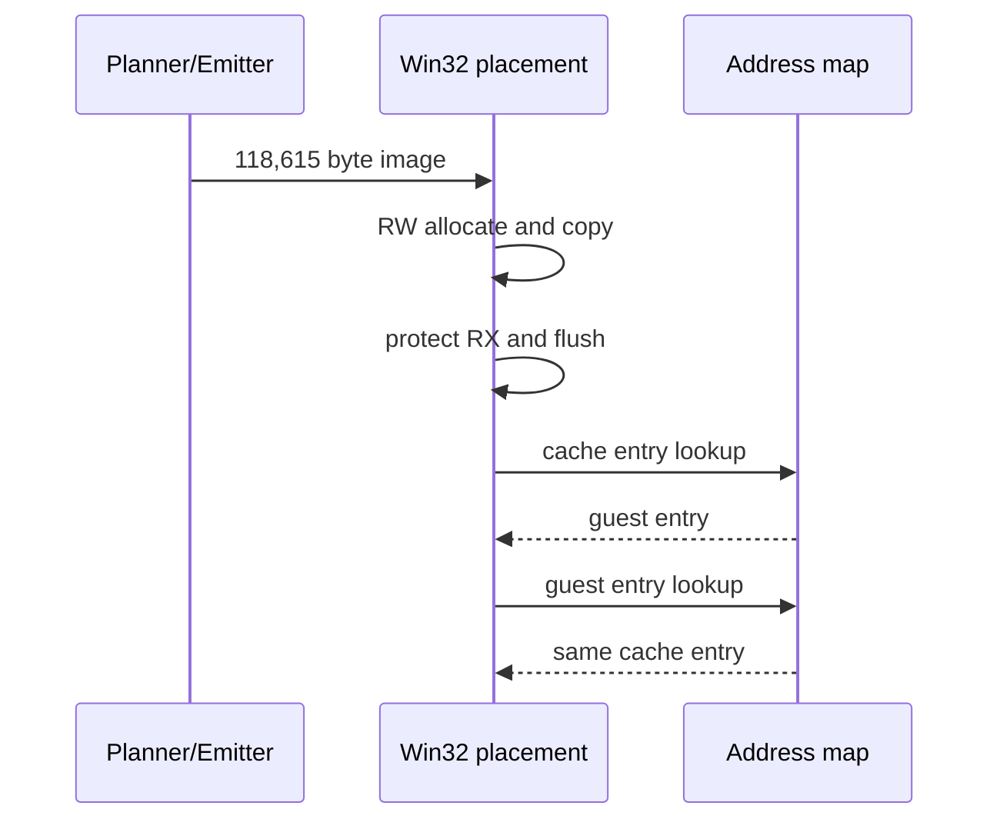

# AOT 실행 backend 준비 분석

## 확인됨

Win32 x86 Debug에서 PIU의 118,615바이트 cache image를 `PAGE_READWRITE`로 할당·복사한 뒤 `PAGE_EXECUTE_READ`로 전환하고 instruction cache를 flush할 수 있습니다. cache entry에서 guest entry로 역매핑하고 다시 같은 cache entry로 정방향 매핑하는 round-trip도 성공했습니다.

181-A에서는 execution trampoline과 legacy single-step backend를 수정하지 않고 RX placement만 검증했습니다.

181-B에서 `REPIU_EXECUTION_BACKEND=aot` opt-in bridge를 연결했습니다. PIU는 cache entry에서 시작해 최초 8개 sentinel 경계 중 7개를 cache로 재진입했고, 기존 HLE를 통해 DOS interrupt와 SPR.RES 읽기까지 예외 없이 진행했습니다. 첫 정적 map 누락 target `0x040FB6B5`에서 legacy fallback이 한 번 발생한 뒤에는 legacy 실행을 유지했습니다.

5초 동일 조건 비교:

| backend | diagnostic progress | single-step | AOT boundary/reentry/fallback |
|---|---:|---:|---:|
| legacy | 85,734 | 567,181 | 0 / 0 / 0 |
| aot prototype | 85,736 | 562,433 | 8 / 7 / 1 |

현재 성능은 사실상 동일합니다. 시작 직후 runtime arena의 동적 코드로 이동하면서 정적 AOT coverage를 벗어나기 때문입니다.

## 미확정

* runtime-generated/copied block을 최초 target 관찰 시 변환하는 범용 dynamic translator
* 동적 cache page의 RX/RW 갱신과 invalidation 정책
* self-modifying code 탐지

# AOT Execution Backend Preparation Analysis

The opt-in bridge now executes the PIU cache, maps sentinels through the existing HLE handlers, and re-enters the cache. Seven of the first eight boundaries re-entered successfully; the first missing target was runtime arena code at `0x040FB6B5`, after which execution correctly fell back to legacy single-step. Five-second AOT and legacy progress were effectively identical because the static cache is left almost immediately. A generic on-demand translator for runtime-generated code is the next requirement.
