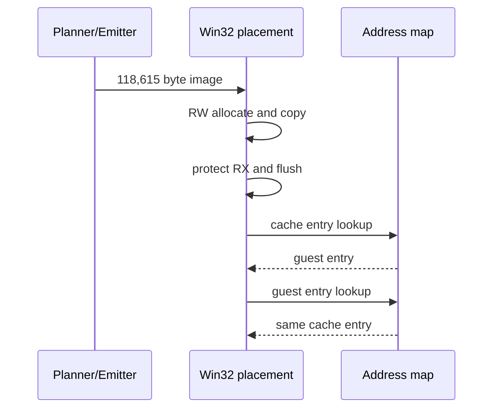

# AOT 실행 backend 준비 분석

## 확인됨

Win32 x86 Debug에서 PIU의 118,615바이트 cache image를 `PAGE_READWRITE`로 할당·복사한 뒤 `PAGE_EXECUTE_READ`로 전환하고 instruction cache를 flush할 수 있습니다. cache entry에서 guest entry로 역매핑하고 다시 같은 cache entry로 정방향 매핑하는 round-trip도 성공했습니다.

181-A에서는 execution trampoline과 legacy single-step backend를 수정하지 않고 RX placement만 검증했습니다.

181-B에서 `REPIU_EXECUTION_BACKEND=aot` opt-in bridge를 연결했습니다. PIU는 cache entry에서 시작해 최초 8개 sentinel 경계 중 7개를 cache로 재진입했고, 기존 HLE를 통해 DOS interrupt와 SPR.RES 읽기까지 예외 없이 진행했습니다. 첫 정적 map 누락 target `0x040FB6B5`에서 legacy fallback이 한 번 발생한 뒤에는 legacy 실행을 유지했습니다.

5초 동일 조건 비교:

| backend | diagnostic progress | single-step | AOT boundary/reentry/fallback |
|---|---:|---:|---:|
| legacy | 85,734 | 567,181 | 0 / 0 / 0 |
| aot prototype | 85,736 | 562,433 | 8 / 7 / 1 |

현재 성능은 사실상 동일합니다. 시작 직후 runtime arena의 동적 코드로 이동하면서 정적 AOT coverage를 벗어나기 때문입니다.

## 미확정

* runtime-generated/copied block을 최초 target 관찰 시 변환하는 범용 dynamic translator
* 동적 cache page의 RX/RW 갱신과 invalidation 정책
* self-modifying code 탐지

# AOT Execution Backend Preparation Analysis

The opt-in bridge now executes the PIU cache, maps sentinels through the existing HLE handlers, and re-enters the cache. Seven of the first eight boundaries re-entered successfully; the first missing target was runtime arena code at `0x040FB6B5`, after which execution correctly fell back to legacy single-step. Five-second AOT and legacy progress were effectively identical because the static cache is left almost immediately. A generic on-demand translator for runtime-generated code is the next requirement.

## 2026-07-30 Task 367: boundary opcode의 실명 귀속 — 최대 인구는 Glide gate trap

**확인됨:** `hle` provenance breakpoint는 전체 예외의 42.5%인 최대 인구인데, 그 안의
최대 클래스는 **guest 명령이 아니라 우리가 만든 Glide gate trap**입니다.

기존 census는 `RecordAotOtherBoundarySample`에서 `bytes[0]`만 기록했습니다. 그 최다
항목 `0F`는 **두 바이트 opcode escape**이고 `66`/`26`은 **prefix**이므로, 상위 인구의
74%가 명령이 아니라 escape 바이트와 prefix로 집계되고 있었습니다. prefix를 건너뛰고
escape 두 번째 바이트를 기록하자 정체가 드러났습니다.

| opcode | 명령 | 중앙값 | 표본 대비 |
|---|---|---:|---:|
| **`0F 0B`** | **UD2 — Glide gate trap** | **91,975** | **55.21%** |
| `8C` | `MOV r/m, Sreg` | 17,464 | 10.49% |
| `8E` | `MOV Sreg, r/m` | 16,009 | 9.62% |
| `ED` | `IN eAX, DX` | 11,841 | 7.11% |
| `EE` | `OUT DX, AL` | 5,381 | 3.23% |
| `CF` | `IRET` | 5,377 | 3.23% |
| `EF` | `OUT DX, eAX` | 4,681 | 2.81% |
| `88` | `MOV r/m8, r8` | 3,859 | 2.32% |

기계별로 묶으면 Glide gate UD2 **55.21%**, segment register move(`8C`/`8E`)
**20.11%**, port I/O(`ED`/`EE`/`EF`) **13.15%** 로 세 덩어리가 88.5%입니다.

**확인됨(결정적):** UD2 횟수가 Glide gate 진입 횟수와 3회 실행 모두 **정확히**
일치했습니다(94,493 / 93,874 / 87,533). **Glide API 호출 하나가 예외 하나를 만듭니다.**

**이것이 Task 365를 설명합니다.** 동일 상태 setter 생략은 host rendezvous 41,368회를
없앴지만 gate 예외는 그대로 남겼고, 그래서 프레임이 변하지 않았습니다. 호출당 남은
비용이 UD2 예외 + VEH dispatch입니다.

**재계산됨:** Task 336의 TF/`INT3` 제거 상한 1.38~1.44배는 VEH 진입 1,307,096회
기준이었습니다. 현재 예외는 약 370,000회로 **3.5배 줄었으므로** 같은 전이 가격에서
전이 총비용은 wall의 약 6.4%, 상한은 약 1.07배입니다. 다만 예외 1회의 실제 비용은
VEH handler 본문을 포함합니다(Task 347: VEH 전체 32.47%).

**미확정:** UD2 예외 1회 비용의 분해. segment/port I/O 인구의 제거 가능성.

[작업 로그](../work-logs/20260730-367-hle-boundary-opcode-attribution.md)

## 2026-07-30 Task 367: Naming the boundary opcodes — the largest population is our own Glide gate trap

**Confirmed:** `hle`-provenance breakpoints are the largest exception population at
42.5% of all exceptions, and the largest class inside them is **not a guest
instruction but the Glide gate trap we emit**. The census recorded only `bytes[0]`,
whose top entry `0F` is the two-byte opcode escape and whose `66` and `26` entries
are prefixes, so 74% of the leading population was counted as escape bytes and
prefixes. Resolving past prefixes and recording the escape's second byte identifies
it as `0F 0B` (UD2) at 55.21% of samples, followed by `MOV r/m,Sreg` at 10.49%,
`MOV Sreg,r/m` at 9.62%, and `IN eAX,DX` at 7.11%. By mechanism: Glide gate trap
55.21%, segment register moves 20.11%, port I/O 13.15% — 88.5% together.

**Decisive:** the UD2 count equalled the Glide gate entry count exactly in all three
runs, so **each Glide API call costs one exception**. This explains Task 365:
eliding repeated setter state removed 41,368 host rendezvous but left the gate
exception, which is why frames did not move.

**Recomputed:** Task 336's 1.38-1.44x bound assumed 1,307,096 VEH entries; the count
is now about 370,000, 3.5x fewer, putting transitions near 6.4% of wall and their
removal at about 1.07x — though the real per-exception cost includes the VEH handler
body, which Task 347 measured at 32.47% of wall for the whole VEH.

**Unresolved:** the cost decomposition of a single UD2 exception, and whether the
segment-move and port-I/O populations can be removed.
