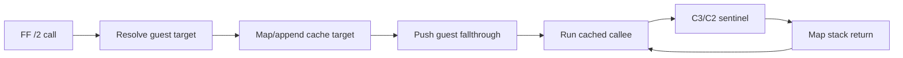

# AOT 간접 전송 dispatcher 분석

## 확인됨

`FF /2` near indirect call과 `FF /4` near indirect jump의 register/ModRM memory target을 원본 실행 전에 해석하는 dispatcher가 동작합니다. `aot-dynamic` PIU 실행에서 indirect dispatch 7회와 return dispatch 8회가 성공했고, 이전 `FF D0` 직접 실행 access violation을 넘었습니다.

stable `aot` 1초 실행은 예외 없이 timeout까지 진행됐고 dynamic attempt는 0, 기존 legacy fallback은 1회로 유지됐습니다.

## 추정

동적 mode의 다음 예외는 guest 주소가 아니라 `ntdll` 내부에서 발생했습니다. 당시 dynamic append 8회, indirect dispatch 7회, return dispatch 8회가 완료된 상태였습니다. live arena 전체 snapshot, Zydis planning, heap vector 확장, `VirtualProtect`를 VEH와 guest stack 문맥 안에서 수행하는 것이 host allocator 또는 중첩 예외에 안전하지 않을 가능성이 높습니다. 아직 단일 원인으로 확정하지 않습니다.

## 미확정

* host exception이 VEH 내부 heap/VirtualProtect 재진입인지 guest 상태 손상인지
* 동적 변환 요청을 worker로 전달할 때 guest thread suspend/resume와 CONTEXT 소유권
* cache mutation 동안 실행 page를 안전하게 유지하는 방법
* far indirect transfer와 selector:offset ABI

# AOT Indirect Transfer Dispatcher Analysis

Pre-execution dispatch now handles register/memory `FF /2` calls, `FF /4` jumps, and `C3/C2` returns. PIU passed seven indirect calls and eight returns, clearing the previous direct-execution blocker. The next failure occurred inside `ntdll`, not guest code, after eight dynamic appends. This suggests—but does not yet prove—that heap-heavy snapshot/planning/cache mutation inside VEH on the guest stack is unsafe. Stable static AOT remains unaffected.
