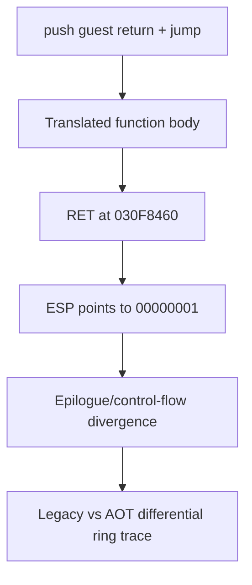

# AOT return stack divergence 분석

## 확인됨

segment-register operand를 HLE boundary로 추가 분류하자 PIU `aot-dynamic`의 boundary는 22개에서 54개로 증가했고 이전 segment load host exception을 통과했습니다. direct call은 cache return과 guest return을 섞지 않도록 `push guest_fallthrough; jmp cache_target`으로 통일했습니다.

그럼에도 guest `0x030F8460`의 near `RET`에서 stack은 다음과 같았습니다.

```text
ESP+00  0x00000001
ESP+04  0x00000000
ESP+08  0x031A7B08
ESP+0C  0x030F8636  (mapped guest continuation)
```



return dispatcher가 성공적으로 처리한 이전 return은 9회입니다. worker 분리 전후 동일한 stack divergence가 재현됐으므로 VEH 내부 heap 작업이 직접 원인이라는 가설은 기각됐습니다. worker 분리는 host-stack 안전 경계로 유지합니다.

## 추정

올바른 return이 네 번째 dword에 남아 있다는 것은 guest 함수가 push한 세 값이 epilogue에서 제거되지 않았거나 잘못된 조건 분기로 `RET`에 도달했음을 의미합니다. flags, conditional branch, segment HLE 후 재진입 중 어느 단계에서 처음 달라지는지는 미확정입니다.

## 금지한 임시 해결

stack에서 “주소처럼 보이는 값”을 검색해 return으로 선택하지 않습니다. 이는 원본 stack semantics와 손상 탐지를 숨기며 다른 executable에서 재사용할 수 없습니다.

# AOT Return Stack Divergence Analysis

Segment-register operand classification and a unified guest-return direct-call ABI cleared earlier blockers. At `RET` guest address `0x030F8460`, however, ESP points to `1` while the mapped guest continuation remains three dwords deeper. The same result with a host-stack worker rejects the in-VEH-allocation hypothesis. A legacy/AOT differential control-flow and ESP ring trace is required; scanning the stack for a plausible return is explicitly rejected.
