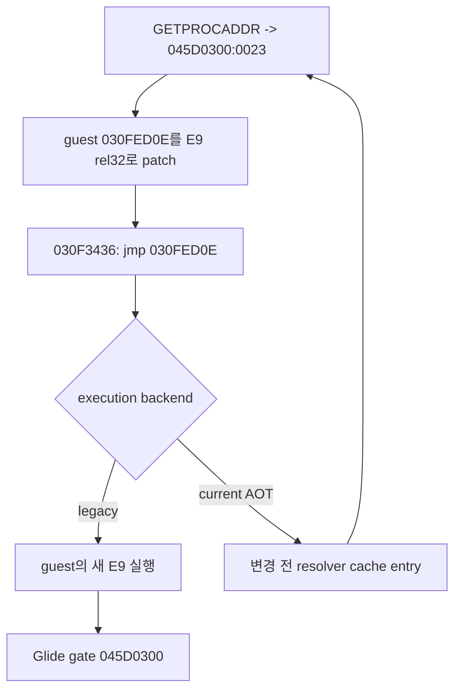
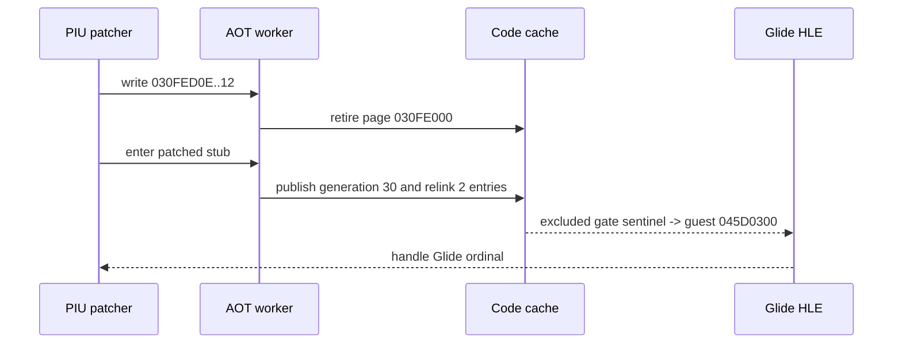

# AOT self-modifying code 일관성 분석

## 확인됨: LINEXE 반환 ABI는 정상입니다

10초 `pumpit1` `aot-dynamic` 관찰에서 LINEXE service 5는
`_GRGLIDEINIT@0`을 19,611회 해석했고 매번 합성 gate `0x045D0300`을
반환했습니다. 마지막 bridge frame은 다음 값을 포함했습니다.

| stack index | 값 | 의미 |
|---:|---:|---|
| 8 | `0x030FED0E` | import stub / 복원할 EDI |
| 10 | `0x030F3418` | GETPROCADDR 뒤 continuation |
| 11 | `0x00000001` | virtual module handle |
| 12 | `0x030FE52B` | `_GRGLIDEINIT@0` 문자열 |
| 13 | `0x035D6AA4` | 8-byte 결과 buffer |
| 14 | `0x045D0300` | 기록된 gate linear address |
| 15 | `0x00000023` | 기록된 client CS |

따라서 handler의 `{linear address, client CS}` output과 wrapper frame 복원은
성공했습니다.

## 확인됨: guest patch와 stale cache의 분기

continuation의 원본 명령은 결과를 검사한 뒤 import stub을 직접 바꿉니다.

```text
030F342C  C6 07 E9       mov byte ptr [edi], 0E9h
030F3432  89 47 01       mov [edi+1], eax
030F3436  FF E0          jmp eax
```

이 시점의 `EDI`와 마지막 indirect target은 모두 `0x030FED0E`입니다. 정적
원본 stub은 다음 resolver call입니다.

```text
030FED0E  E8 ...         call 030F33B4
```

guest memory에서는 첫 5바이트가 `E9 rel32`로 바뀌어 Glide gate로 가야 하지만,
AOT cache에는 변환 시점의 `push guest_fallthrough; jmp resolver-cache-target`이
남습니다. `FindAotCacheAddress(0x030FED0E)`가 이 stale entry를 반환하므로
resolver가 다시 실행됩니다.



10초 실행은 예외와 legacy fallback 없이 indirect dispatcher 33회, return
dispatcher 1,089회, inline-cache patch 1,122/1,122를 유지했습니다. 동시에
LINEXE GETPROCADDR 19,611회와 Glide gate 0회를 기록했습니다. 따라서 반복의
원인은 dispatcher 성능이나 LINEXE 결과가 아니라 self-modifying guest code와
code cache 사이의 일관성 부재입니다.

## 필요한 일반 정책

특정 PIU 주소를 예외 처리해서는 안 됩니다. translated guest address에 대한
write를 탐지하고, 해당 page에서 파생된 cache entry를 더 이상 정상 entry로
사용하지 않도록 해야 합니다. 이미 RX인 PIU code object에 대한 `C6/89` write는
access violation 경로의 generic memory-store HLE가 수행하므로, 이 handler가
cache mapping과 write destination의 교차 여부를 알 수 있습니다. HLE helper를
통한 write도 같은 정책에 연결해야 합니다.

## 결정됨

새 page generation 재번역을 주 경로로 사용하고 legacy-only 격리를 안전
fallback으로 유지합니다. 다른 page에서 수행한 multi-store patch는 수정된
page의 다음 진입까지 재번역을 지연합니다. 같은 page를 현재 실행하면서
수정하거나 translation/publication이 실패하면 해당 page만 격리합니다.

## 확인됨: 세대 재번역이 반복을 제거했습니다

구현 후 같은 경로는 code write 2회, page retirement 1회, generation publish 1회,
stale entry relink 2회를 기록했습니다. generation failure, quarantine, retired-entry
trap은 모두 0이었고 GETPROCADDR는 19,611회에서 1회로 줄었습니다. 새 세대 ID는
30이었으며 앞선 29개 일반 동적 translation 다음에 발행됐습니다.

첫 번째 구현 관찰에서는 새 CFG가 patched stub의 `E9` target인 합성 Glide gate
`0x045D0300`까지 따라가 `0F 0B 20 00`을 code cache로 복사했습니다. 따라서
cache에서 `0xC000001D`가 발생했고 cache-to-guest provenance가 원인을 정확히
gate 주소로 역매핑했습니다. HLE 소유 범위를 번역 계획에서 제외한 뒤 gate는
`INT3` sentinel을 통해 기존 HLE dispatcher로 전달됐습니다.



10초 bounded 실행은 비정상 종료 없이 supervisor timeout까지 계속됐고 heartbeat는
약 228만까지 증가했습니다. Glide ordinal은 0에서 `0x20`, 이어서 `0x2D`로
진행했습니다. 3초 Debug 관찰의 heartbeat는 변경 전 기준 80,228 대비 74,050으로,
inactive map이 없는 hot path의 전체-map scan을 제거한 뒤 기존 수준에 근접했습니다.

## 확인됨: native span write-cross의 write-watch coverage

Task 288 Stage 2의 최종 60초 실행에서 write-watch가 덮은 span code page에서 explicit
memory write 48,633개를 통과했고, 실제 watched-page write 24회는 동기 access violation로
span을 중단한 뒤 기존 coherence 경로에 들어갔습니다. guard 미커버 code page 진입은
0회였습니다. 따라서 현재 단일 guest thread 경로에서 “watched code page alias는 write
완료 전에 fault한다”는 전제는 실측과 일치합니다.

다만 이 사실은 write-cross의 성능 승격 근거가 아닙니다. 240초 direct pilot의
draw/swap이 약 20% 감소해 기능은 opt-in으로 남았습니다. 또한 write-watch 밖의
read-only/uncommitted guest target은 별도 preflight가 없으면 일반 access violation을
일으킬 수 있으므로, 최종 후보는 target page 보호 상태도 보수적으로 확인합니다.

## 확인됨: 짧은 retired entry가 trap의 대부분입니다

Task 306의 60초 profile에서 retired trap 7,401회 중 7,293회(98.54%)는 emitted length
1~4의 짧은 entry였고 resolver는 이를 모두 quarantined page로 판정했습니다. 기존
재연결은 entry 자체를 `E9 rel32`로 덮을 5바이트가 필요하므로 이 hotset에는 적용할 수
없습니다. relink 가능한 108회는 generation publish 107회와 failure 1회였습니다.

guest 상위 16개가 98.24%를 차지했고 상위 두 주소만 64.06%였습니다. 특히
`0x030F507C`는 generation 216, 196, 160, 151 등 여러 retired cache entry로 분산되어
반복 생성·retirement가 함께 나타났습니다. 다음 coherence 성능 후보는 기존 entry를
덮는 patch가 아니라 짧은 inactive entry 주소를 최신 generation 또는 guest fallback으로
리디렉션하는 side table/공용 dispatch 경계입니다. 다중 guest thread와 cache reclamation이
미확정이므로 이 경로도 serialized publication과 fail-closed quarantine 계약을 유지해야 합니다.

## 구현 경계와 미확정

* code cache는 serialized worker만 `PAGE_EXECUTE_READ`와 `PAGE_READWRITE` 사이에서
  전환하며 수정 후 `FlushInstructionCache`를 호출합니다.
* translated guest page의 native store를 감지하기 위해 guest page는 평상시 RX이고,
  faulting store 한 명령 동안만 RWX가 된 뒤 Trap Flag 완료에서 RX로 복원됩니다.
  따라서 “RWX를 사용하지 않는다”는 보장은 code cache에만 적용됩니다.
* page write-watch는 exact translated instruction range와 겹칠 때만 retire하지만,
  code와 data가 같은 page에 있으면 data-only write도 AV/TF 비용을 냅니다.
* REP/string store가 여러 page를 넘는 경우, 여러 guest thread가 같은 cache를
  실행하는 경우, retired generation의 cache reclamation은 아직 일반 검증되지
  않았습니다.
* live retranslation은 target page만 복사하는 것이 아니라 현재 runtime arena를
  snapshot한 뒤 target에서 reachable CFG를 다시 만듭니다. 이미 retired 또는
  quarantined된 다른 page에 닿는 entry는 inactive sentinel로 남깁니다.

# AOT Self-modifying Code Coherency Analysis

The LINEXE result ABI is correct. Service 5 writes gate `0x045D0300` and client
CS `0x23` to the requested stack buffer, returns to `0x030F3418`, and PIU patches
the import stub at `0x030FED0E` from a resolver call to `E9 rel32`. The following
indirect jump targets that stub.

Legacy executes the modified guest bytes. AOT instead resolves the guest address
to the pre-patch cache entry, which still invokes the resolver. A ten-second run
therefore performed 19,611 successful GETPROCADDR calls and zero Glide-gate
entries without an exception or fallback. General translated-page write tracking
and stale-entry retirement are required; executable-specific patch addresses are
not acceptable.

## Selected Policy

New page-generation translation is the primary path, with legacy-only page
quarantine retained as a fail-closed fallback. Cross-page multi-store patches are
not translated after the first store; publication waits until the next entry into
the retired page so the worker snapshots completed live bytes. Same-page or
unknown-source modification, translation failure, cache exhaustion, or unsafe
publication quarantines only the affected page.

## Confirmed Implementation Result

The generation path observed two code writes, one page retirement, one generation
publication, and two stale-entry relinks, with zero generation failures,
quarantines, or retired-entry traps. GETPROCADDR dropped from 19,611 calls to one.
The first generated CFG also exposed a separate boundary issue: it copied the
synthetic Glide `UD2` gate into the cache. Cache-to-guest provenance mapped the
illegal instruction back to guest `0x045D0300`. Passing the HLE-owned gate range
as an excluded planner range replaced that copy with a sentinel and restored the
existing Glide HLE path. A bounded ten-second run then continued to supervisor
timeout, reached Glide ordinals `0x20` and `0x2D`, and exceeded 2.28 million
heartbeats.

The initial generation number was 30 because 29 ordinary dynamic translations
had already been published. A three-second Debug comparison reached 74,050
heartbeats versus the prior 80,228 baseline after the common path stopped
scanning inactive maps and relinking was limited to inactive indices.

## Confirmed native-span write-watch coverage

In the final 60-second Task 288 Stage 2 run, native spans crossed 48,633 explicit writes on
write-watched code pages. Twenty-four real writes to watched pages faulted synchronously,
stopped the span, and entered the existing coherence path; no span reached an uncovered code
page. This confirms the current single-guest-thread assumption that an aliasing store to a
watched code page faults before completion.

This is not a promotion result: the 240-second direct pilot reduced draw/swap by about 20%,
so write crossing remains opt-in. Read-only or uncommitted guest targets outside the watch
set can still raise ordinary access violations without target preflight, so the final
candidate also checks target-page protection conservatively.

## Confirmed short retired-entry concentration

In Task 306's 60-second profile, 7,293 of 7,401 retired traps (98.54%) came from entries with
one-to-four emitted bytes, and the resolver classified every one as a quarantined-page result.
The current relink needs five bytes to overwrite the entry with `E9 rel32`, so it cannot serve
this hotset. The remaining 108 relinkable events produced 107 generation publications and one
failure.

The top 16 guest addresses covered 98.24%, and the first two alone covered 64.06%.
`0x030F507C` was spread across retired cache entries from generations 216, 196, 160, 151, and
others, showing repeated generation/retirement activity. The next coherence performance
candidate is therefore a side table or shared dispatch boundary that redirects short inactive
entry addresses to the newest generation or guest fallback, rather than an in-place patch.
Because multiple guest threads and cache reclamation remain unresolved, that path must retain
serialized publication and fail-closed quarantine semantics.

## Implementation Boundaries and Unresolved Cases

Only the serialized worker changes the code cache between RX and RW, restoring RX
and calling `FlushInstructionCache`. Native stores to translated guest pages are
detected by keeping those guest pages RX, temporarily making only the affected
pages RWX for one faulting instruction, and restoring RX at Trap Flag completion.
The no-RWX statement therefore applies to the code cache, not to this guest-page
write-watch interval. Data-only writes on a mixed code/data page still incur the
AV/TF observation cost even when no translated instruction overlaps.

Cross-page REP/string stores, multiple guest threads sharing a cache, and retired
generation reclamation are not yet generally verified. Live retranslation
snapshots the current runtime arena and rebuilds the reachable CFG from the
target; it is not a single-page byte copy. Entries touching other retired or
quarantined pages remain inactive sentinels.
