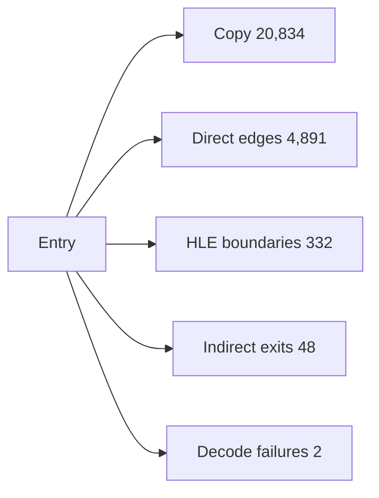

# AOT 변환 계획 coverage 분석

## 확인됨

Zydis legacy-32 CFG analyzer가 EXE 이름이나 고정 주소 없이 relocated LE image의 entry와 direct edge를 따라 변환 계획을 생성합니다.

실제 `pumpit1` PIU.EXE 결과:

* blocks: 6,695
* instructions: 26,710
* source code bytes: 88,881
* estimated emitted bytes: 103,872
* copy-compatible instructions: 20,834
* direct calls/jumps/conditional branches: 1,551 / 790 / 2,550
* returns: 605
* HLE boundaries: 332
* unresolved indirect exits: 48
* decode failures: 2
* Debug planning time: 50,136us, 재실행 0.1ms 수준의 초기 잘못 제한된 결과는 제외

OpenWatcom built sample 793개 중 792개가 성공했습니다. 평균 5,983.9us, 최대 14,854us였고 전체 analyzer CPU 시간 합은 약 4.74초입니다. `clibexam_exec_c`는 relocation 단계에서 mapped LE object가 없어 현재 DOS/4GW LE AOT 대상에서 제외됩니다.

## 추정

실제 byte emitter, relocation table, HLE stub table을 추가해도 최초 PIU 변환은 Debug에서 0.1~1초, Release에서 그 이하일 가능성이 높습니다. 변환 시간은 문제가 아니며 indirect target과 guest-address/code-cache-address 양방향 mapping이 실제 실행 prototype의 핵심입니다.

## 미확정

* 48개 indirect exit의 runtime target 집합
* decode failure 2개가 data fallthrough인지 실제 instruction인지
* translated return과 guest callback 주소의 mapping ABI
* code cache에서 HLE stub 호출 후 flags/x87/segment 상태 보존

## Task 591: dynamic coverage 실패 주소 귀속

### 한국어

**확인됨:** `ValidateAotCodeCacheHleCoverage()`는 실패한 boundary의 guest 주소를
out-parameter로 반환합니다. Task 591 전에는 dynamic append가 이 값을 버려서 Linux x64
return trace가 일반적인 coverage 실패만 보였습니다. append result message에 nonzero 주소를
붙인 watched `pumpit2a` 실행에서, `0x010F4AD1`에서 시작한 plan의 실패 boundary는
`0x010F4ACD`로 확인됐습니다.

**확인됨:** 이 관측 변경은 validator의 false 결과를 바꾸지 않았습니다. image는 append되지
않고 return resolver는 zero를 돌려주며 thunk는 기존 INT3 fail-closed 경로를 유지합니다.

**후속:** 이 record의 kind와 coverage 계약은 Task 592에서 확인됐습니다. 다음 분석 대상은
그 뒤에 드러난 raw guest `SIGSEGV` `0x010F010C`입니다.

### English

**Confirmed:** `ValidateAotCodeCacheHleCoverage()` returns the failing boundary's
guest address through an out parameter. Before Task 591, dynamic append discarded
that value. After preserving a nonzero address in the append-result message, a
watched `pumpit2a` run established that the plan entered at `0x010F4AD1` fails at
`0x010F4ACD`.

**Confirmed:** This observability change does not alter the validator's false
result: no image is appended, the return resolver returns zero, and the thunk
retains the existing INT3 fail-closed path.

**Follow-up:** Task 592 resolved this record's kind and coverage contract. The
next target is the raw-guest `SIGSEGV` at `0x010F010C` exposed afterward.

## Task 592: long-mode guarded segment-pop coverage

### 한국어

**확인됨:** `0x010F4ACD`는 `pop es` (`0x07`)로 분류되는
`kGuardedSegmentPop`입니다. Linux x64 long-mode emitter의 실제 slot은 i386의 46-byte
slot이 아니라 lowered guest-flags save/restore를 포함하는 56-byte sequence입니다. Task 592는
validator가 이 sequence와 shadow offset, mismatch INT3, `lea r15d,[r15+4]`, resolved
fallthrough fixup을 검사하게 했습니다. fallback을 손상한 synthetic image는 같은 guest
주소로 reject됩니다.

**확인됨:** watched `pumpit2a`에서 `0x010F4AD1` dynamic append는 `0x2004FB64`로 resolve되어
`0x010F4ACD` coverage 거절을 통과했습니다. 이전 signal-5/signal-4 return-thunk 종료는
발생하지 않았습니다.

**미확정:** 이어진 raw guest `SIGSEGV` `0x010F010C`의 dispatch/resolver 원인은 별도
frontier입니다.

### English

**Confirmed:** `0x010F4ACD` is `pop es` (`0x07`), classified as
`kGuardedSegmentPop`. Its Linux x64 slot is a 56-byte sequence containing
lowered guest-flags save/restore, not the i386 46-byte slot. Task 592 validates
that sequence, its shadow offset, mismatch INT3, `lea r15d,[r15+4]`, and the
resolved fallthrough fixup. A corrupted fallback is rejected at the same guest
address.

**Confirmed:** watched `pumpit2a` resolved the dynamic append from
`0x010F4AD1` to `0x2004FB64`, passing the former `0x010F4ACD` coverage failure
without the earlier signal-5/signal-4 return-thunk termination.

**Unresolved:** the following raw-guest `SIGSEGV` at `0x010F010C` is a separate
frontier in resolver or dispatch behavior.

# AOT Translation Plan Coverage Analysis

The executable-independent Zydis planner recovered 26,710 reachable PIU instructions in 6,695 blocks, with 20,834 copy-compatible instructions, 4,891 direct control edges, 332 HLE boundaries, 48 unresolved indirect exits, and two decode failures. Debug planning took about 50ms. It succeeded for 792 of 793 built OpenWatcom samples at a 6.0ms average and 14.9ms maximum; the remaining sample had no mapped LE object. Translation time is therefore not the blocker. Indirect targets and bidirectional guest/code-cache address mapping are the next execution-prototype boundary.

## Task 467: pumpito zlib byte-guard jump table

### 한국어

**확인됨:** Release 실행 로그에서 AOT boundary `0x030E49E4`의 `2E FF 24 8D`가
12,260,580회 관측됐습니다. relocation 전 명령은 `jmp dword ptr
cs:[ecx*4+0x010E4968]`이며, 직전 명령열은 `cmp cl,9; jnbe; and ecx,0xff`입니다. 함수 뒤의
`inflate 1.1.3 Copyright` 문자열과 0..9 상태 분기로 이 코드는 정적으로 포함된 zlib 1.1.3
`inflate_codes()` dispatcher임을 확인했습니다.

기존 matcher는 32-bit compare와 jump 사이에 명령이 없는 형태만 인식했습니다. low-byte
compare와 정확한 `and parent-r32,0xff` 관계를 검증하여 guard를 한 명령 전달하도록 확장한
뒤, `0x010E49D3`에서 시작한 실제 PIU.EXE 계획은 jump table 1개/target 10개, HLE boundary
0개, 유효한 cache jump-table site 1개를 생성했습니다. synthetic probe는 다른 mask,
다른 destination register, high-byte compare와 정규화 생략을 모두 거부하며 기존 32-bit
형태도 유지합니다.

**미확정:** 실제 pumpito Release 실행에서 로딩 시간과 exception 수가 얼마나 감소하는지는
새 binary 실행 로그로 확인해야 합니다.

### English

**Confirmed:** the Release log observed the AOT boundary at `0x030E49E4`, opcode `2E FF 24
8D`, 12,260,580 times. Before relocation it is `jmp dword ptr cs:[ecx*4+0x010E4968]`, preceded
by `cmp cl,9; jnbe; and ecx,0xff`. The following `inflate 1.1.3 Copyright` string and the
ten-state dispatch identify it as the statically linked zlib 1.1.3 `inflate_codes()` dispatcher.

The former matcher recognized only a 32-bit compare immediately followed by the table jump. After
extending it to propagate a guard across an exactly verified `and parent-r32,0xff`, a plan starting
at `0x010E49D3` in the real PIU.EXE produces one jump table with ten targets, zero HLE boundaries,
and one valid cache jump-table site. Synthetic probes reject a different mask, a different
destination register, a high-byte compare, and omitted normalization while preserving the existing
32-bit form.

**Unresolved:** the reduction in loading time and exception count must be measured from a new
pumpito Release run log.
