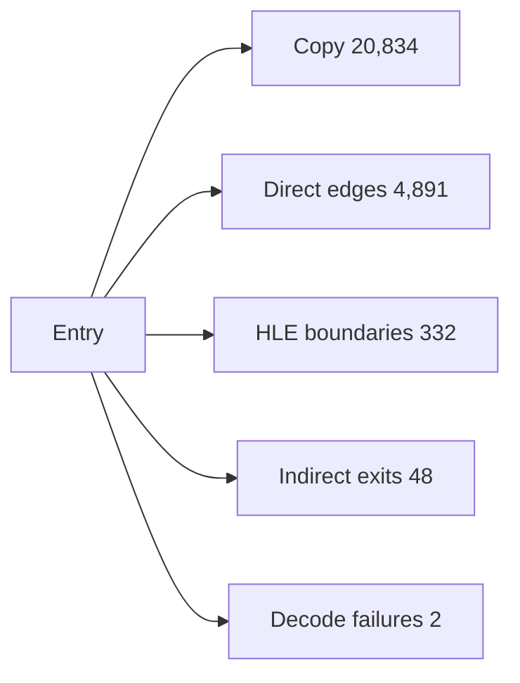

# AOT 변환 계획 coverage 분석

## 확인됨

Zydis legacy-32 CFG analyzer가 EXE 이름이나 고정 주소 없이 relocated LE image의 entry와 direct edge를 따라 변환 계획을 생성합니다.

실제 `pumpit1` PIU.EXE 결과:

* blocks: 6,695
* instructions: 26,710
* source code bytes: 88,881
* estimated emitted bytes: 103,872
* copy-compatible instructions: 20,834
* direct calls/jumps/conditional branches: 1,551 / 790 / 2,550
* returns: 605
* HLE boundaries: 332
* unresolved indirect exits: 48
* decode failures: 2
* Debug planning time: 50,136us, 재실행 0.1ms 수준의 초기 잘못 제한된 결과는 제외

OpenWatcom built sample 793개 중 792개가 성공했습니다. 평균 5,983.9us, 최대 14,854us였고 전체 analyzer CPU 시간 합은 약 4.74초입니다. `clibexam_exec_c`는 relocation 단계에서 mapped LE object가 없어 현재 DOS/4GW LE AOT 대상에서 제외됩니다.

## 추정

실제 byte emitter, relocation table, HLE stub table을 추가해도 최초 PIU 변환은 Debug에서 0.1~1초, Release에서 그 이하일 가능성이 높습니다. 변환 시간은 문제가 아니며 indirect target과 guest-address/code-cache-address 양방향 mapping이 실제 실행 prototype의 핵심입니다.

## 미확정

* 48개 indirect exit의 runtime target 집합
* decode failure 2개가 data fallthrough인지 실제 instruction인지
* translated return과 guest callback 주소의 mapping ABI
* code cache에서 HLE stub 호출 후 flags/x87/segment 상태 보존

# AOT Translation Plan Coverage Analysis

The executable-independent Zydis planner recovered 26,710 reachable PIU instructions in 6,695 blocks, with 20,834 copy-compatible instructions, 4,891 direct control edges, 332 HLE boundaries, 48 unresolved indirect exits, and two decode failures. Debug planning took about 50ms. It succeeded for 792 of 793 built OpenWatcom samples at a 6.0ms average and 14.9ms maximum; the remaining sample had no mapped LE object. Translation time is therefore not the blocker. Indirect targets and bidirectional guest/code-cache address mapping are the next execution-prototype boundary.
