# 현재 실행 frontier와 다음 분석 대상

## 2026-07-15 종료 예외 재판정: 디코드 루프 store가 진짜 사인 / Terminal exception re-attributed: the decode-loop store is the real killer (Task 205)

**수정됨:** 아래 Task 204 항목의 "`POP ES`가 종료 원인"이라는 결론을 정정한다. `Relocated exception byte window` 로그는 SEH 예외 주소가 아니라 **마지막으로 디스패치된 예외의 stale `last_guest_eip`** 로 focus를 계산하므로, 정상 처리된 마지막 디스패치 지점(POP ES)을 사인처럼 표시했다. 실제 SEH 종료 예외는 `Win32 AOT exception cache/guest mapping`이 가리키는 **guest `0x030873F4`** 이며, 이는 Task 202~203에서 분석한 65,536-레코드 디코드 루프 내부의 출력 스토어다. POP ES 수정 전(run7)과 후(205 run1) 모두 동일한 지점·동일한 레지스터로 종료됐다.

**확인됨 (종료 예외의 실체):**

```asm
; guest 0x030873F4 (cache 사본 바이트: 88 04 2B 8B 46 34 ...)
mov [ebx+ebp], al        ; 88 04 2B — 디코드 결과 바이트 기록
mov eax, [esi+0x34]      ; 8B 46 34 — 출력 배열 포인터 재적재
```

* 종료 시 레지스터: `EBX=0x045D3EB0`(출력 버퍼 포인터), `EBP=0`(인덱스), `ECX=0x1908`(디코드 태그, `0x1900~0x190A` 범위), `ESI=0x041B6B50`, `EAX=0x2FD`.
* 쓰기 대상 `0x045D3EB0`은 미매핑 영역이라 0xC0000005가 발생하고, 이 형태(`88 04 2B` SIB byte store)는 현 traced memory-store HLE 범위 밖이라 디스패치가 거절되어 SEH catch → 게스트 스레드 종료(exit code 2)로 이어진다.
* 직전에 4바이트 아래 주소로의 `or-imm8` 스토어(`0x045D3EAC`, 값 `0x00040009`)는 **처리 성공**(`applied: true`)으로 기록돼 있어, 이 영역이 shadow/boundary-object 계열 HLE와 이미 접점이 있다.

**확인됨 (Task 205 자체 결과):** `HandleSegmentPopInstruction`을 `07`(ES)/`0F A1`(FS)/`0F A9`(GS)로 확장한 변경은 정상 동작한다. 세그먼트 로드 trace에 guest `+0xF5070`(GS), `+0xF5074`(ES) 처리 기록이 남았고 처리 건수가 8,481 → 11,443으로 증가했으며 회귀는 없다. 다만 이 에필로그는 종료 원인이 아니었으므로 실행 진행 자체는 바뀌지 않았다.

**미확정 (다음 분석 대상):**

1. `EBX=0x045D3EB0` 출력 버퍼의 provenance — 게스트 allocator가 어느 경로로 이 포인터를 얻었는지, 원본 환경이라면 어떤 할당(DPMI/DOS resize)이 이 영역을 commit했어야 하는지.
2. 대응 방향의 선택: (a) 해당 할당을 실제 commit하는 arena/DPMI 모델 확장(정확성 우선, 기존 원칙 부합) vs (b) `88 04 2B` 형태의 traced byte-store HLE 추가(디코드 루프가 레코드마다 fault → dispatcher 왕복하므로 처리량상 부적합할 가능성).
3. 진단 결함 수정: `Relocated exception byte window`가 SEH 예외의 AOT 매핑 guest 주소를 사용하도록 정정 (이번 오판정의 근본 원인).

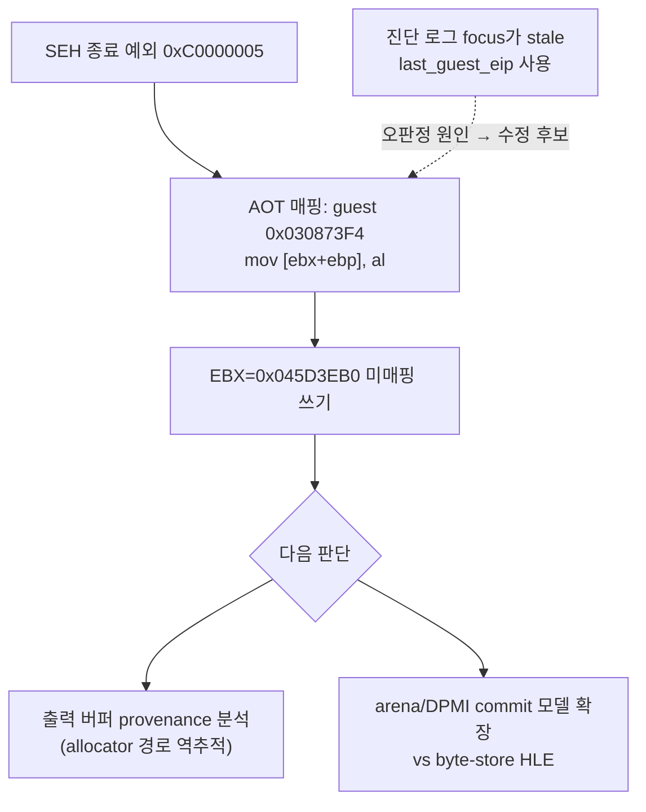

**Corrected:** the Task 204 conclusion below ("POP ES is the killer") is re-attributed. The `Relocated exception byte window` log derives its focus from the stale `last_guest_eip` of the last dispatched (and successfully handled) exception rather than from the SEH exception address, so it displayed the POP ES site. The actual terminal exception maps (via `AOT exception cache/guest mapping`) to **guest `0x030873F4`** — the output byte store `mov [ebx+ebp], al` (`88 04 2B`) of the 65,536-record decode loop — identically before and after the POP fix, with `EBX=0x045D3EB0` (unmapped output pointer), `EBP=0`, `ECX=0x1908`. The write target is unmapped and this SIB byte-store form is outside current traced memory-store HLE, so the dispatch declines and the guest thread dies. The Task 205 segment-pop extension itself works (trace entries at guest `+0xF5070`/`+0xF5074`, handled loads 8,481 → 11,443, no regression) but was not the blocker. Next: trace the provenance of the `0x045D3EB0` output buffer and choose between committing the corresponding allocation in the arena/DPMI model (preferred by project principles) versus adding a byte-store HLE (throughput-hostile inside the decode loop); also fix the byte-window diagnostic to use the SEH exception's mapped guest address.

## 2026-07-15 EIP 샘플링 결과: 침묵 상태의 정체 확정 / EIP sampling result: silent state identified (Task 204)

**확인됨:** Task 204의 네이티브 구간 EIP 샘플링(로더 내부 폴러 + supervisor 외부 크로스 프로세스 샘플러)을 적용한 뒤 200~300초 구동을 반복해 다음을 확정했다.

1. **사이클 내부의 "무디스패치 네이티브 구간"은 순수 네이티브 실행이 아니다.** 경량 VEH AOT 경로(inline-cache miss·reentry: `ExceptionDispatchScope` 없이 처리되어 dispatch 카운터에 잡히지 않음)가 **초당 약 4,500~5,100회** 동작하고 있었다. 이 구간의 EIP 샘플은 대부분 로더 VEH 코드(`0x101679xx`)와 ntdll(`0x774C9xxx`)에 위치하며, 마지막 간접 전이는 `0x030DAEC3→0x03085E9C`(초기), `0x030842E0→0x0305686C`(후기) 등이었다. 즉 wall time의 대부분이 예외 처리에 소모되는 **inline-cache churn 처리량 병목**이다.
2. **150초 이후의 "디스패치 침묵 상태"는 게스트 스레드 종료다.** 2026-07-14의 세 후보(폴링 대기/번역 결함 무한 루프/장시간 연산)는 모두 철회한다. +143 디스패치 burst의 마지막 예외 0xC0000005(cache `0x06BF4334` = guest `0x030F5074`)가 처리되지 못해 SEH catch로 게스트 스레드가 **exit code 2로 종료**했고(OpenThread가 `ERROR_INVALID_PARAMETER(87)` 반환으로 스레드 소멸 확인), 로더는 약 151초에 `original entry raised a caught exception`과 예외 바이트 창을 정상 로그로 남겼다.
3. ~~**종료 지점 명령은 세그먼트 복원 에필로그의 `POP ES`(0x07)다.**~~ **수정됨 (같은 날 Task 205):** 이 판정은 `Relocated exception byte window` 진단이 stale `last_guest_eip`를 사용한 데서 온 오판정이다. 실제 종료 예외는 guest `0x030873F4`의 디코드 루프 스토어다 — 위 Task 205 항목 참조. (에필로그 바이트 관찰 자체는 유효: guest `0x030F5064` 주변은 `83 C4 04 5D 0F A9 0F A1 [07] 5F 5E 5A 59 5B C3`의 세그먼트 복원 에필로그이며, 이 POP ES/FS/GS 형태가 HLE 범위 밖이던 것도 사실이고 Task 205에서 처리를 추가했다.)
4. **새 결함: 게스트 종료 후 로더가 hang된다.** trampoline teardown(phase 10~14)은 완주하지만, 결과 로그 출력 후 main 경로의 후속 단계에서 ntdll `0x774CA07C`의 INFINITE 대기에 걸려 프로세스가 종료되지 않는다(supervisor timeout이 강제 종료). 이전 600초 관측이 "게스트 fatal 없음"으로 기록된 것은 이 hang과 PowerShell stderr 캡처 중단이 겹쳐 로더의 fatal 로그를 놓쳤기 때문이다. `dos4gw_hello`는 phase 14 후 정상 종료하므로 pumpit1 경로(Glide/WGL 정리 등)의 후속 단계가 유력하다.

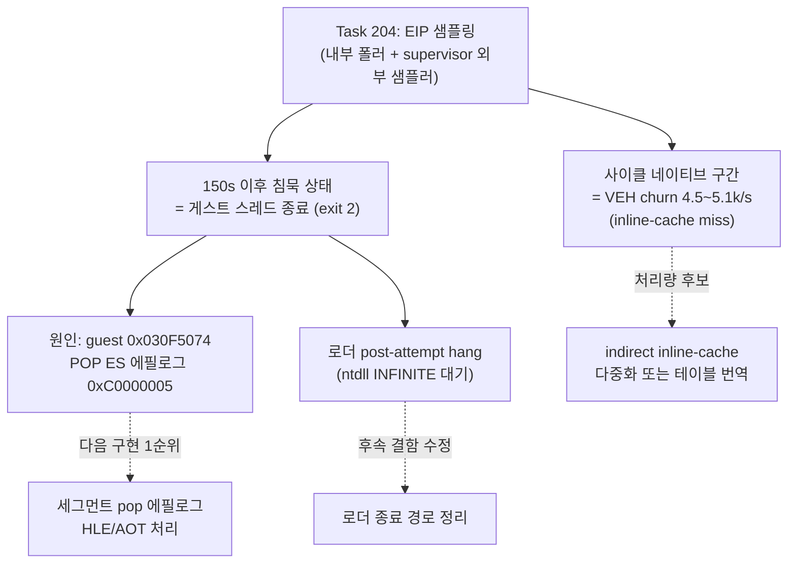

**다음 단계:** (1) guest `0x030F5074` 형태의 세그먼트 복원 에필로그(`POP ES/FS/GS`)를 AOT/VEH에서 처리하는 것이 실행 진행의 1순위 frontier다. (2) 게스트 종료 후 로더 hang(후속 정리 단계의 INFINITE 대기)을 수정해야 장기 관측이 왜곡되지 않는다. (3) 사이클 처리량은 inline-cache 다중화 또는 해당 간접 전이의 테이블형 번역이 후보다.

**Confirmed (Task 204):** With native-phase EIP sampling (an in-process poller plus a cross-process supervisor sampler), repeated 200–300 s runs establish: (1) the in-cycle "zero-dispatch native phases" are not pure native execution but lightweight VEH AOT handling (inline-cache misses/reentries, invisible to dispatch counters) at ~4,500–5,100 events/s, with samples concentrated in loader VEH and ntdll code — an inline-cache churn throughput bottleneck; (2) the post-150 s "dispatch-silent state" is guest-thread termination, withdrawing all three 2026-07-14 candidates — the final 0xC0000005 at cache `0x06BF4334` (guest `0x030F5074`) is SEH-caught and the thread exits with code 2 (thread disappearance confirmed by OpenThread `ERROR_INVALID_PARAMETER`), with the loader logging `original entry raised a caught exception` at ~151 s; (3) the terminal instruction is `POP ES` (byte `07`) inside a segment-restore epilogue (`pop ebp; pop gs; pop fs; pop es; pop edi; pop esi; pop edx; pop ecx; pop ebx; ret`), a form outside current HLE coverage; (4) a new defect: after logging, the loader main thread blocks forever in an INFINITE ntdll wait past teardown phase 14 (pumpit1 path only; `dos4gw_hello` exits cleanly), which — combined with a PowerShell stderr capture artifact — caused the earlier 600 s run to be misread as "no guest fatal." Next steps: segment-pop epilogue handling (primary frontier), the loader post-attempt hang fix, and inline-cache churn reduction.

## 2026-07-14 600초 장기 관측 / 600-second extended observation

**수정됨 (2026-07-15):** 아래의 "무디스패치 순수 네이티브 상태" 해석과 세 후보는 Task 204 EIP 샘플링으로 철회되었다. 실제로는 guest `0x030F5074` `POP ES`의 미처리 0xC0000005로 게스트 스레드가 종료된 뒤 로더가 hang된 상태였다. 위 2026-07-15 항목 참조. / **Corrected (2026-07-15):** the "dispatch-silent pure-native state" reading below and its three candidates are withdrawn by Task 204 EIP sampling; the guest thread had terminated on an unhandled 0xC0000005 at the `POP ES` of guest `0x030F5074`, followed by a loader hang. See the 2026-07-15 entry above.

**확인됨:** Task 203 반영 빌드로 600초 supervisor 구동을 수행했다. 자산 처리 사이클(+105 디스패치 blip)은 37초부터 약 137초까지 총 8회 관측된 뒤 **150초에 종료**됐다. 150초에 +143 디스패치와 함께 semantic progress 카운터가 14에서 73으로 뛰었는데(+59), 이는 REP MOVS/STOS bulk 연산과 저주소(`ESI/EDI=0x40000`) 접근 HLE가 집중 처리된 새 단계 진입을 뜻한다. 마지막 디스패치는 cache 주소 `0x06BF4334`에서 정상 처리 완료된 access violation(0xC0000005)이며 dispatch entry/exit는 53,300/53,300으로 균형이다.

**확인됨:** 150초부터 600초까지 **450초(7.5분) 동안 디스패치·heartbeat·single-step이 완전히 정지**한 순수 네이티브 상태가 지속됐다. Glide ordinal은 `0x5E`에 머물렀고 그리기 게이트는 미도달이다. 게스트 fatal이나 크래시는 없었다.

**미확정:** 이 무디스패치 상태의 정체. 후보는 다음 세 가지이며 현 텔레메트리로는 구분할 수 없다.

1. 초장시간 네이티브 연산(가능성 낮음 — 현대 CPU 네이티브 7.5분은 과도).
2. **게임 내부 tick/플래그 폴링 무한 대기**: 원본 환경에서는 게임이 설치한 IRQ0(INT 8) 핸들러가 게임 데이터 영역의 카운터를 갱신하지만, 현 HLE는 BDA `0x46C`만 갱신하고 게스트 핸들러를 호출하지 않으므로 게임 자체 카운터는 영원히 정지한다. 폴링 대상이 정상 커밋된 arena 메모리라면 예외가 발생하지 않아 디스패치 0과 일치한다.
3. 번역 코드 결함으로 인한 네이티브 무한 루프.

**다음 단계:** 네이티브 구간 EIP 샘플링 텔레메트리(supervisor 또는 폴러가 게스트 스레드 context를 주기적으로 캡처)를 추가해 대기/연산 위치를 확정한다. 2번으로 확정되면 게스트가 설치한 timer interrupt 핸들러를 주기 호출하는 HLE가 후속 구현 후보다.

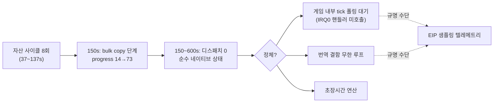

**Confirmed:** A 600-second supervised run on the Task 203 build shows the asset cycles (+105-dispatch blips) ending at 150 s after eight occurrences, followed by a +143-dispatch burst that raised the semantic progress counter from 14 to 73 (bulk REP MOVS/STOS and low-address `0x40000` HLE), with the final dispatch a cleanly handled access violation at cache address `0x06BF4334` and balanced 53,300/53,300 dispatches. From 150 s to 600 s the guest stayed **dispatch-silent for 7.5 minutes** with the Glide ordinal still `0x5E` and no crash. **Unresolved:** whether this is an in-memory polling wait (the game's own IRQ0-updated tick never advances because the HLE updates only BDA `0x46C` and never invokes the guest's installed handler), a translated-code infinite loop, or genuinely long native compute. The next step is native-phase EIP sampling telemetry; if polling is confirmed, periodically invoking the guest's installed timer interrupt handler becomes the follow-up implementation candidate.

## 2026-07-14 점프 테이블 번역 이후 / After jump-table translation (Task 203)

**확인됨:** Task 203의 AOT bounded jump table 번역 적용 후 120초 관찰에서 디코드 루프의 dispatcher 왕복이 사이클당 약 65,500회에서 약 105회로 감소했고, 자산 처리 사이클이 약 75~80초에서 약 17~20초로 단축되어 같은 120초 동안 약 6사이클이 완료됐다(이전 1사이클). 이전 디스패치 집중 지점 `0x03086DAA`(11-엔트리)와 `0x030EDDDA`(4-엔트리) 모두 디스패치가 소멸했다. 정적 계획은 PIU.EXE에서 15개 테이블(target 111개)을 인식했다. 새 예외는 없다.

**확인됨:** `dos4gw_hello`의 정적 AOT 이미지 빌드는 "direct control-flow target is outside the cache"로 실패하지만, 변경 전 HEAD에서도 동일하게 재현되는 기존 한계다(hello의 기존 검증은 legacy 백엔드). 별도 과제 후보: 직접 분기 target이 image 밖일 때 이미지 전체 실패 대신 해당 지점만 dispatcher exit로 후퇴시키는 것.

**미확정 (새 frontier):** 이제 각 사이클의 대부분(약 17~20초)이 무디스패치 네이티브 연산 구간이다. 120초·약 6사이클 후에도 `progress=14`, 마지막 Glide ordinal `0x5E`가 유지되므로 총 사이클 수와 이 네이티브 구간의 내용(압축 해제, 테이블 생성, 또는 메모리 내 폴링 대기 가능성)을 규명해야 한다. 다음 단계 후보: 더 긴 구동(5~10분)으로 사이클 총량 관측, 또는 네이티브 구간의 EIP 샘플링 텔레메트리 추가.

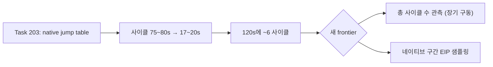

**Confirmed:** With Task 203's bounded jump-table translation, a 120-second run shows decode-loop dispatcher round-trips down from ~65,500 to ~105 per cycle and the per-asset cycle down from ~75–80 s to ~17–20 s (~6 cycles vs 1). Both former dispatch hotspots (`0x03086DAA`, `0x030EDDDA`) are dispatch-silent, the static plan recognizes 15 tables / 111 targets in PIU.EXE, and no new exceptions appear. The `dos4gw_hello` static-AOT failure ("direct control-flow target is outside the cache") reproduces on unmodified HEAD — a pre-existing limitation, with a follow-up candidate of degrading unresolved direct targets to dispatcher exits instead of failing the whole image. **Unresolved (new frontier):** cycles are now dominated by ~17–20 s zero-dispatch native phases and `progress=14` / Glide ordinal `0x5E` persist after ~6 cycles; the total cycle count and the nature of the native phases (decompression, table generation, or in-memory polling) need either a longer run or native-phase EIP sampling telemetry.

## 2026-07-14 동기식 타이머 틱 이후 관찰 / Observation after synchronous timer tick

**확인됨:** BDA `0x46C` 동기식 틱 갱신(Task 201)과 그리기 stub 5종(Task 202) 적용 후 40초 및 120초 supervisor 구동에서 `STATUS_GUARD_PAGE_VIOLATION`이 소멸했고, 게스트 fatal 없이 마감까지 실행이 지속됐다.

**확인됨:** 마지막 Glide 호출은 ordinal `0x5E` `_GRCULLMODE@4`(94)이며, 그리기 게이트(71~77)는 아직 호출되지 않았다. OVL resident-name 테이블 재파싱으로 71 `_GRDRAWPOINT@4`, 72 `_GRDRAWLINE@8`, 73 `_GRDRAWTRIANGLE@12`, 74 `_GRDRAWPLANARPOLYGON@12`, 75 `_GRDRAWPLANARPOLYGONVERTEXLIST@8`, 76 `_GRDRAWPOLYGON@12`, 77 `_GRDRAWPOLYGONVERTEXLIST@8`(stub 미등록)을 확정했다.

### 0x03086DAA 반복 디스패치의 정체 / Identity of the 0x03086DAA dispatch loop

**확인됨:** PIU.EXE object 2 정적 디스어셈블리로 `0x03086DAA`(object 2 `+0x76DAA`)는 Watcom switch문의 간접 분기 `jmp dword ptr cs:[eax*4 + obj2:0x767E8]`이다. 11-엔트리 점프 테이블은 태그 코드 `0x1900~0x190A`를 분기하며, `[esp+0x38]` 구조체(내부 카운트 `[s+0]`, 외부 카운트 `[s+4]`)를 도는 이중 중첩 레코드 디코드 루프 내부에 있다. 각 레코드는 바이트 필드를 float 상수와 곱해 `[esi+0x34]` 배열에 4바이트씩 기록한다. 이 간접 분기가 레코드마다 AOT 네이티브 실행을 dispatcher로 탈출시켜 초당 약 1,090~1,140 레코드로 처리된다.

**확인됨:** 120초 관찰에서 이 루프는 32초부터 94.5초까지 약 65,400 디스패치(관측 `ECX=0x10000`=65,536 레코드와 일치)를 소비하고 정상 종료했다. 이어 약 18초의 무디스패치 네이티브 구간(마지막 디스패치 지점 `0x030EDDDA`, object 2 `+0xDDDDA`의 4-엔트리 점프 테이블 `jmp cs:[eax*4 + obj2:0xDDC8C]`)이 지나고, 113초에 동일한 디코드 루프가 다시 시작됐다. 즉 "네이티브 연산 구간 → 65,536-레코드 디코드 루프"가 자산 단위로 반복되는 초기화 사이클이다.

**수정됨:** 6~31초의 무디스패치 정지 구간(약 13초, 약 11초)을 BDA `0x46C` 틱 폴링 대기로 본 같은 날의 초기 해석은 철회한다. 저메모리 `0x46C`는 게스트 주소 공간에 매핑되어 있지 않아 읽기마다 예외 디스패치를 유발하므로, 디스패치가 0인 구간은 틱 폴링일 수 없다. 이 구간들은 위 사이클의 네이티브 연산 단계다. 게임이 `0x46C`를 실제로 소비하는지는 **미확정**으로 되돌린다.

**결론:** 현재 frontier는 누락 HLE 서비스나 외부 대기가 아니라, code-segment 점프 테이블 간접 분기가 레코드마다 네이티브 실행을 탈출시키는 **AOT 실행 처리량 병목**이다. 실기 기준 밀리초 단위 작업이 사이클당 약 75초로 늘어나 있어, 그리기 게이트 도달 전 초기화가 수 분 이상 걸릴 수 있다. 다음 구현 후보는 `jmp cs:[reg*4+disp32]` 형태의 bounded 점프 테이블을 AOT 번역에 포함하는 것(테이블 로드 후 번역된 블록으로 직접 연결, 실패 시 dispatcher fallback)이다.


**Confirmed:** Static disassembly of PIU.EXE object 2 shows `0x03086DAA` (object 2 `+0x76DAA`) is a Watcom switch indirect branch `jmp dword ptr cs:[eax*4 + obj2:0x767E8]` over an 11-entry table for tag codes `0x1900–0x190A`, inside nested record-decode loops over a `[esp+0x38]` structure (inner bound `[s+0]`, outer bound `[s+4]`), writing 4 bytes per record into `[esi+0x34]`. Each pass exits AOT native execution into the dispatcher, limiting throughput to ~1,090–1,140 records/s. A 120-second run shows the loop consuming ~65,400 dispatches (matching the observed `ECX=0x10000` bound) from 32s to 94.5s, an ~18s zero-dispatch native phase (last dispatch site `0x030EDDDA`, itself a 4-entry jump table at obj2 `+0xDDC8C`), and the same decode loop restarting at 113s — a repeating per-asset initialization cycle. **Corrected:** the same-day interpretation of the earlier zero-dispatch phases as BDA `0x46C` tick polling is withdrawn — low-memory reads always dispatch, so zero-dispatch phases cannot be tick polling; whether the game consumes `0x46C` at all returns to **unresolved**. **Conclusion:** the current frontier is AOT execution throughput on code-segment jump-table indirect branches, not a missing service or an external wait; the recommended next implementation is native AOT translation of bounded `jmp cs:[reg*4+disp32]` switch tables with dispatcher fallback.

## 2026-07-11 실제 arena 확장 결과

16 MiB contiguous expansion으로 기존 `0x026E3578` allocator boundary와 `0xC0000374` heap corruption이 사라졌다. PIU는 supervisor 종료 없이 자체 timeout을 반환하고 dispatch는 `118438/118438`로 균형을 이룬다. 마지막 `+0xF520A`는 정상 compare 함수 종료 경로이므로 현재 명확한 fault frontier는 없다.

## 2026-07-11 Real Arena Expansion Result

A 16 MiB contiguous expansion removes the former `0x026E3578` allocator boundary and heap corruption `0xC0000374`. PIU returns its own timeout without supervisor termination and balances 118,438/118,438 dispatches. Last EIP `+0xF520A` is a normal comparison-function exit, so there is no current concrete fault frontier.

## 2026-07-11 supervisor가 확인한 allocator 경계

외부 shared telemetry는 PIU 정지 상태에서 exception `0xC0000374`, last guest EIP `+0x1E16A`, EAX=`0x026E3578`을 회수했다. arena end `0x026D7000`보다 약 `0xC578` 밖의 allocator 객체 초기화 중 host heap corruption이 발생한다. 다음 구현은 실제 arena 확장과 독립 backing 중 선택이 필요하다.

## 2026-07-11 Allocator Boundary Confirmed by Supervisor

External shared telemetry recovered exception `0xC0000374`, last guest EIP `+0x1E16A`, and EAX=`0x026E3578`. Host heap corruption occurs while initializing an allocator object about `0xC578` beyond arena end `0x026D7000`. The next implementation requires choosing real arena expansion or independent backing.

## 2026-07-11 external supervisor 전환 근거

ES=`0x2C` descriptor byte compare/load를 처리해 `+0xFC723`과 `+0xFC777`을 통과했다. 이후 실행은 계속되지만 동일 프로세스 live snapshot과 최종 결과가 모두 회수되지 않는다. 이전 timeout data race를 제거한 뒤에도 재현되므로 다음 진단 경계는 별도 supervisor 프로세스에 둔다.

## 2026-07-11 Evidence for External Supervisor

Descriptor-backed ES=`0x2C` byte compare/load processing passes `+0xFC723` and `+0xFC777`. Execution then continues while both in-process live snapshots and final results become unavailable. Because this reproduces after the prior timeout race was removed, the next diagnostic boundary belongs in an external supervisor process.

## 2026-07-11 shadow segment register store

`+0xFC717 MOV AX,FS`를 shadow store로 처리해 후속 ES가 `0x2C`로 설정된다. 현재 frontier는 `+0xFC723`의 ES override byte compare/load이며 descriptor-backed byte read 형식 확장이 필요하다.

## 2026-07-11 Shadow Segment Register Store

Shadowing MOV AX,FS at `+0xFC717` makes the following ES load use `0x2C`. The current frontier is the ES-override byte compare/load at `+0xFC723`, requiring descriptor-backed byte-read forms.

## 2026-07-11 REP STOSD 이후

`+0xF4E17`의 zero-fill REP STOSD를 범위 검증 후 일괄 처리하여 반복별 TF exception을 제거했다. 실행은 `+0xFC723`까지 진행한다. `+0xFC717 MOV EAX,FS`가 shadow FS=`0x2C` 대신 Win32 FS=`0x53`을 읽고, `+0xFC71F MOV ES,EAX`가 shadow ES를 `0x53`으로 오염시키는 것이 새 frontier다.

## 2026-07-11 After REP STOSD

Batching the checked zero-fill REP STOSD at `+0xF4E17` removes per-iteration TF exceptions and advances execution to `+0xFC723`. The new frontier is native `MOV EAX,FS` at `+0xFC717`, which reads Win32 FS=`0x53` instead of shadow FS=`0x2C`, followed by MOV ES contaminating shadow ES with `0x53`.

## 2026-07-11 shadow DS 복원

환경 scan의 임시 DS=`0x2C`는 `+0xF4DD5`의 `POP DS`에서 guest stack의 `0x2B`로 복원된다. access-violation HLE 뒤 TF를 보존하고 POP을 shadow 처리하자 기존 `+0xF7A71` fault가 사라졌다. 새 frontier는 `+0xF4E17`의 `REP STOSD` 반복별 single-step 비용이다.

## 2026-07-11 Shadow DS Restoration

The temporary environment-scan DS=`0x2C` is restored to guest-stack selector `0x2B` by POP DS at `+0xF4DD5`. Preserving TF after access-violation HLE and shadowing the POP removes the former `+0xF7A71` fault. The new frontier is per-iteration single-step overhead at `REP STOSD` at `+0xF4E17`.

## 2026-07-11 live telemetry 결과

selector binding 이후의 host 정지는 guest 교착이 아니었다. host busy poll이 guest 시작 전에 quiet iteration 100,000회를 소진하고, guest 종료 전에 비원자 observation을 복사하면서 data race가 발생했다. wall-clock quiet timeout과 terminate/join-before-copy 순서로 수정한 뒤 PIU는 반복 실행에서 안정적으로 최종 예외를 반환한다.

현재 frontier는 relocated `+0xF7A71`의 opcode `0x8B` access violation이다. 세 번의 실행에서 dispatch entry/exit는 모두 `28182/28182`로 균형을 이루며 EAX=`0x1008`, ESI=`0x0007B839`가 반복된다. supervisor 프로세스는 현재 필요하지 않다.


## 2026-07-11 Live Telemetry Result

The host stall after selector binding was not a guest deadlock. The host busy poll exhausted 100,000 quiet iterations before guest startup and raced while copying non-atomic observations before stopping the guest. Wall-clock quiet detection and terminate/join-before-copy restore stable result collection. The current frontier is the repeatable opcode-`0x8B` access violation at relocated `+0xF7A71`, with balanced 28,182/28,182 dispatch counts, EAX=`0x1008`, and ESI=`0x0007B839`. An external supervisor is not currently required.

## 2026-07-11 selector frontier

DOS4GW `LINEXE.EXP` 역분석으로 LE object selector가 DPMI function `0000h`의 동적 할당 결과임을 확인했다. PIU 프로필은 object 1~4에 `0x1C`, `0x24`, `0x2C`, `0x34`를 순차 할당하며 kind `0x03` fixup은 할당 selector를 source `+2`에 기록한다.

실제 descriptor-backed translation을 활성화하면 PIU host가 45초 안에 내부 timeout snapshot을 반환하지 못한다. 현재 frontier는 selector 값 결정이 아니라, 실행 중 exception 반복 또는 guest 진행 상태를 host 종료 전에 회수할 수 있는 live telemetry다.

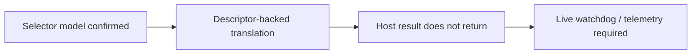

## 2026-07-11 Selector Frontier

Reverse engineering of DOS4GW `LINEXE.EXP` confirmed that LE object selectors are dynamic results of DPMI function `0000h`. The PIU profile sequentially assigns `0x1C`, `0x24`, `0x2C`, and `0x34` to objects 1 through 4, and kind-03 fixups write the allocated selector at source `+2`.

With real descriptor-backed translation enabled, the PIU host does not return its internal timeout snapshot within 45 seconds. The frontier is no longer selector selection; it is live telemetry that can recover repeated exception or guest progress state before host termination.

```mermaid
flowchart LR
    ENV["DOS Environment Scan"] --> FILES["intro.ani / stage.cfg"]
    FILES --> RESIZE["DOS Resize"]
    RESIZE --> OBJECTS["Boundary Object Array"]
    OBJECTS --> SENTINEL["Allocator Sentinel / Metadata"]
    SENTINEL --> DS0["8B 16 with DS:0 handled"]
    DS0 --> ADD["03 07 shadow ADD handled"]
    ADD --> OR["83 0E 01 shadow OR handled"]
    OR --> CMP["38 10 shadow byte CMP handled"]
    CMP --> ZERO["Bounded zero-backed allocator payload"]
    ZERO --> NEXT["38 50 20 handled"]
    NEXT --> LOOP["File parsing loop"]
    LOOP --> ALLOC["Allocator probe dispatch"]
    ALLOC --> QUIET["Repeated +0xF7A71 dispatch / quiet timeout"]
```

## 현재까지 도달한 상태

**확인됨:** DOS environment scan, `intro.ani`/`stage.cfg` file flow, DOS resize, arena 경계 객체 배열, allocator sentinel과 metadata store까지 진행한다. 실행 timing에 따라 생성자, allocator fault 또는 충분한 진척 뒤 quiet timeout이 먼저 관찰될 수 있다.

## 최근 해결

relocated base + `0x000F7A71`의 `8B 16` (`mov edx,[esi]`)에서 `ESI=0`인 경우를 guest `DS` zero-page read로 처리했다. 같은 명령의 고주소 source는 처리하지 않는다.

## 최근 해결한 ADD

**확인됨:** zero-page read 통과 후 relocated base + `0x000F7BAD`의 `03 07`을 shadow-memory source ADD로 처리했다.

```asm
add eax, dword ptr [edi]
```

관찰값 `EDI=0x026E49C4`의 dword를 shadow memory에서 읽고, destination register와 `CF/PF/AF/ZF/SF/OF`를 32-bit ADD 의미대로 갱신한다.

## 최근 해결한 OR

**확인됨:** ADD 통과 후 relocated base + `0x000F7AD4`의 `83 0E 01`을 shadow-memory read-modify-write로 처리했다.

```asm
or dword ptr [esi], 1
```

destination dword를 shadow memory에서 읽어 bit 0을 설정한 결과를 같은 주소에 기록했다. `CF/OF`를 0으로 하고 `PF/ZF/SF`를 결과에 맞게 복원하며 undefined인 `AF`는 보존한다.

## 최근 해결한 byte CMP

**확인됨:** OR 통과 후 relocated base + `0x000F5F34`의 `38 10`을 shadow byte source CMP로 처리했다.

```asm
cmp byte ptr [eax], dl
```

관찰값은 `EAX=0x046E49C8`, `EDX=0`이었다. shadow byte와 ModRM byte register를 비교하고 `CF/PF/AF/ZF/SF/OF`를 복원하며 operand는 변경하지 않는다.

## 최근 해결한 bounded zero backing

**확인됨:** 첫 CMP 통과 후 relocated base + `0x000F5F8E`에서 다음 명령이 관찰된다.

```asm
cmp byte ptr [eax+0x20], dl
```

이 source byte는 sparse shadow map에 없지만, 확인된 allocator payload 범위 안의 unwritten byte다. 요청 크기 `0x2C`와 `0x1008`만 추적하고 `[block+4, block+size-4)`에 한해 0을 반환하도록 구현해 이 비교를 통과했다. 이후 실행은 DOS interrupt, segment-memory load와 shadow read를 계속 처리하고 allocator probe로 돌아간다.

## Quiet timeout 재분류

**확인됨:** quiet timeout을 native 파일 파싱 loop의 정체로 단정할 수 없다. exception dispatch entry/exit를 guest suspend 없이 계수한 반복 실행에서 다음 세 형태가 관찰되었다.

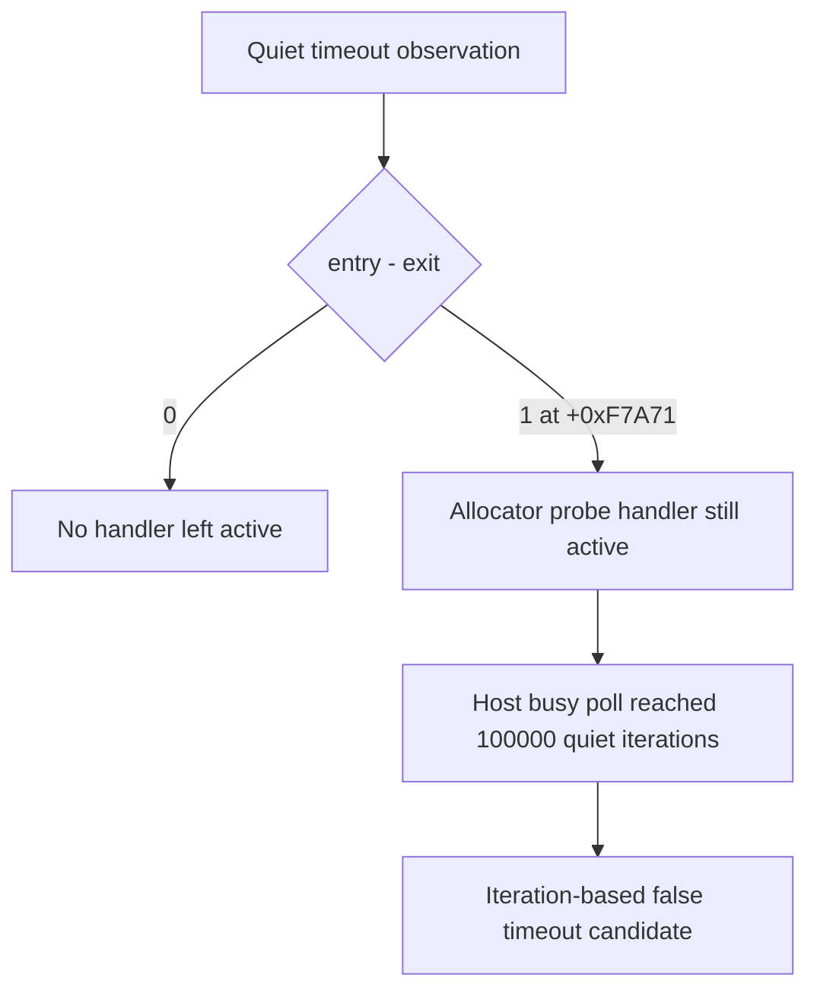

* exception 종료: `entry=25604`, `exit=25604`, last EIP `+0xF7ABA`
* quiet timeout: `entry=34068`, `exit=34067`, outstanding `1`, last EIP `+0xF7A71`
* exception 종료: `entry=28234`, `exit=28234`, last EIP `+0xF7AA8`
* 전체 regression의 quiet timeout: `entry=33946`, `exit=33946`, outstanding `0`, last EIP `+0xF7A71`

마지막 single-step EIP는 반복 실행 모두 `+0xF4DC1`이었지만, timeout 직전 마지막 exception dispatch는 allocator probe `+0xF7A71`이었다. balanced timeout에서도 총 dispatch가 약 34,000회 발생했으므로 handler 자체가 항상 멈춘 것은 아니며, guest가 같은 allocator 경로를 반복하지만 현재 semantic progress counter에는 변화가 없는 상태다. outstanding `1`은 busy polling이 handler 실행 중간을 포착할 수 있음을 추가로 보여 준다. 다음 단계는 polling 한도부터 느슨하게 만들기보다 `+0xF7A71` 반복의 EAX/ESI와 pending allocation 상태를 bounded trace로 확인해야 한다.

## Allocator probe trace 결과

**확인됨:** 최근 16개를 보존하는 bounded ring으로 `+0xF7A71` 반복 상태를 확인했다.

| 경로 | 관측 수 | EAX | ESI/source | pending | 결과 |
| --- | ---: | ---: | ---: | --- | --- |
| quiet timeout A | 2,907 | `0x1008` | `0` | `0x1008` 유지 | `pending-preserved` |
| quiet timeout B | 2,816 | `0x1008` | `0` | `0x1008` 유지 | `pending-preserved` |
| high-source exception | 1 | `0x1008` | `0xFF000000` | 없음 | `rejected` |

timeout의 최신 16개는 각 실행에서 완전히 동일했다. 첫 `0x1008` request가 이미 pending인 상태이므로 probe는 새 크기를 capture하지 않는다. 정상적인 연결점인 `+0xF7AD4` header OR가 pending을 소비하기 전에 제어가 probe로 돌아오는 이유를 다음 분석에서 확인해야 한다.

## Allocator control-flow trace 결과

**확인됨:** allocator range의 exception sequence는 free-list 순회와 node split/update 경로를 구분한다.

| Offset | Bytes | 의미 |
| --- | --- | --- |
| `+0xF7A71` | `8B 16 39 D0` | current node size를 `EDX`로 읽고 request `EAX`와 비교 |
| `+0xF7A83` | `8B 76 08 39` | `ESI=[ESI+8]`로 next node 이동 |
| `+0xF7A99` | `8B 4E 08 83` | selected node의 next link 읽기 |
| `+0xF7AA8..+0xF7AB2` | `89`/`8B` stores | split node metadata 연결 갱신 |
| `+0xF7AD4` | `83 0E 01` | selected block header 사용 표시 |

`ESI=0x026E49C4` 경로는 `EAX=0x1008`과 `0x64030` 요청 모두 split/update 후 OR까지 도달했고 pending은 false였다. 후속 provenance 분석은 timeout의 `ESI=0`이 `node+8` shadow link에서 오지 않음을 확인했다.

## Shadow writer provenance 결과

**확인됨:** 최근 256개 shadow write를 allocation-free ring에 보존하고 allocator dword read와 연결했다. null link, poison link, root-null transition은 반복 실행에서 모두 `valid=false`였다. `ESI`는 allocator range 앞부분의 mapped instruction `mov esi,[ebx+0x0C]`에서 이미 `0` 또는 `0xFF000000`으로 설정되므로 shadow writer provenance 대상이 아니다.

초기 per-byte `unordered_map` 구현은 exception handler 안의 heap allocation 때문에 Windows heap corruption `0xC0000374`를 재현했다. 고정 ring으로 교체한 뒤 별도 build에서 `dos4gw_hello`와 PIU 반복 실행 6회가 crash/hang 없이 종료됐다.

## 의사결정 지점

다음 구현에는 정책 선택이 필요하다.

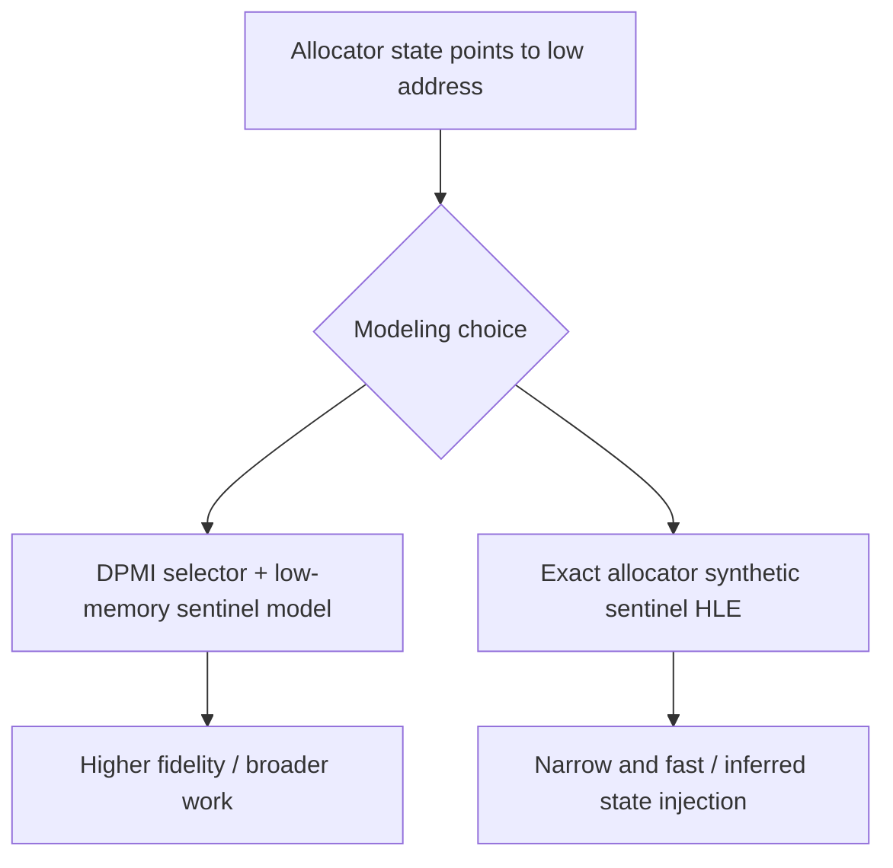

프로젝트 원칙에는 DPMI selector와 low-memory 초기 상태를 명시적으로 모델링하는 방향이 더 부합한다. exact allocator synthetic sentinel은 빠르지만 원본에서 확인하지 못한 head pointer를 주입해야 한다.

## DPMI selector/low-memory 기반 구조

**구현됨:** 선택한 DPMI 방향의 첫 단계로 공용 `SelectorTable` translation과 고정 64 KiB `DosLowMemory` backing을 추가했다. observed segment load는 provisional base-zero/limit `0xFFFF` descriptor를 등록한다. generic DS low-memory dword와 FS word는 selector translation이 성공해야만 backing을 읽는다.

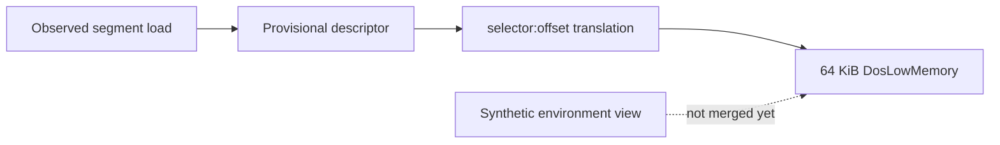

별도 Win32/x86 build의 PIU 실행에서 selector descriptor 4개와 valid 65,536-byte low memory가 확인됐고 기존 frontier가 유지됐다. backing은 근거 없는 sentinel 값을 넣지 않고 zero-initialized 상태다.

## 새 의사결정 후보

현재 environment scan은 selector `0x2C` offset 공간을 synthetic environment block으로 읽지만 generic allocator read는 같은 active DS selector를 low-memory backing으로 읽는다. descriptor base와 environment block의 실제 DOS linear 위치를 확인하기 전까지 둘을 합치면 allocator `DS:0`이 environment 문자열 첫 dword를 읽는 잘못된 결과가 된다.

## Segment load provenance

**확인됨:** PIU 반복 실행 4회에서 다음 7개 segment load sequence가 동일했다.

| # | Offset | Register | Selector | Source |
| ---: | --- | --- | --- | --- |
| 1 | `+0xF4D35` | DS | `0x24` | immediate/register |
| 2 | `+0xF4D3B` | DS | `0x2B` | immediate/register |
| 3 | `+0xF4D50` | ES | `0x17` | immediate/register |
| 4 | `+0xF4D68` | ES | `0x24` | `0x021A6624` |
| 5 | `+0xF4D91` | DS | `0x2B` | immediate/register |
| 6 | `+0xF4DA2` | DS | `0x2C` | `0x021A664D` |
| 7 | `+0xFC70D` | FS | `0x2C` | `0x021A664D` |

selector `0x24`와 `0x2C`는 8 간격이고 image memory에 fixup 값으로 존재한다. relocation builder가 현재 32-bit linear fixup `0x07`만 적용하고 selector source kind를 skip하므로, selector fixup record의 target object와 원본 16-bit selector 값을 결합하면 descriptor base를 relocated object base로 복원할 수 있다.

## 다음 검증 질문

1. selector fixup source kind와 target object에서 `selector → relocated object region` binding을 안전하게 생성할 수 있는가?
2. 동일 selector가 여러 target object를 가리키거나 원본 값이 불일치하는 conflict가 존재하는가?
3. 단일 zero-backed range를 여러 동시 생존 allocation range로 확장해야 하는가?
4. allocator 반복이 정상임이 확인된 뒤 quiet 판정을 wall-clock 기반으로 바꾸고 polling에서 CPU를 양보해야 하는가?

# Current Execution Frontier and Next Analysis Target

Execution now reaches DOS environment scanning, successful `intro.ani`/`stage.cfg` flow, DOS resize, boundary-object array initialization, and allocator sentinel/metadata stores. The `DS:0` form of `8B 16` at `0x000F7A71` has been handled without relocating low memory.

The stable segment-load trace shows DS and FS loading selector `0x2C` from image address `0x021A664D`, with `0x24` and `0x2C` separated by one descriptor slot. Selector fixups are currently skipped while their original 16-bit values remain in the image. The next implementation can therefore derive selector-to-relocated-object descriptor bindings from selector fixup records rather than guessing base zero.

## 장시간 관찰에서 확인된 새 경계 (2026-07-11)

**확인됨.** supervisor 제한 15초, loader 내부 제한 14초로 실행했을 때 실행은 timeout이 아니라 약 9.7초 후 원본 object 2의 `+0xF3438` (`0x020F3438`)에 있는 `INT 3`에서 종료되었다. supervisor는 자식을 강제 종료하지 않았고 `child_exit=0`, `terminated=false`로 회수했다.

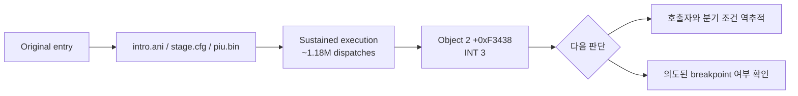

관찰 중 heartbeat와 dispatch entry/exit는 매초 계속 증가했고, 약 1초의 12.8만 dispatch에서 약 9.7초의 118.5만 dispatch까지 진행했다. `PIU.BIN` open/read/seek/close가 모두 성공했으며 마지막 read는 요청 4,096바이트 중 파일 끝의 560바이트를 정상 반환했다. 따라서 파일을 읽지 못해 즉시 `INT 3`로 간 이전 경계와는 다르며, 이번 `INT 3`는 더 뒤의 오류 또는 의도된 중단 경로이다.

현재 증거만으로 `INT 3`를 건너뛰면 안 된다. 다음 단계는 `+0xF3438`로 들어오는 caller와 직전 조건 분기를 역추적해 breakpoint가 실패 처리인지 정상적인 디버그 표식인지 판별하는 것이다.

## New frontier confirmed by extended observation (2026-07-11)

**Confirmed.** With a 15-second supervisor deadline and a 14-second loader deadline, execution ended at the `INT 3` at object 2 `+0xF3438` (`0x020F3438`) after about 9.7 seconds, not at a timeout. The supervisor reported `child_exit=0` and `terminated=false`.

The heartbeat and balanced dispatch counts continued increasing each second, from about 128 thousand dispatches near one second to about 1.185 million near 9.7 seconds. `PIU.BIN` open/read/seek/close operations succeeded; the final read correctly returned the remaining 560 bytes of a 4,096-byte request. This is therefore later than the earlier file-read failure frontier. The next step is to trace the caller and preceding condition that reaches `+0xF3438`; skipping the breakpoint without that evidence would hide the actual failure path.

## DLL loader 역추적 결과

`+0xF3438`은 DLL lazy-loader의 공통 fatal 지점이며 실제 선택된 메시지는 `Fatal error: unable to initialize DLL loader.`이다. 초기화 실패는 현재의 임시 `INT 21h AX=FF00h` 응답이 `AL=0`을 반환하여 원본 시작 코드가 DOS/4G private environment selector인 `GS`를 저장하지 않는 데서 시작한다. 자세한 증거는 [DOS/4G DLL loader와 INT 21h AX=FF00h 역추적](dll-loader-int21-ff00.md)에 정리했다.

## DLL loader provenance result

`+0xF3438` is the DLL lazy loader's common fatal site, and the selected message is `Fatal error: unable to initialize DLL loader.` The failure begins because the temporary `INT 21h AX=FF00h` HLE returns `AL=0`, preventing startup from recording the DOS/4G private-environment selector in `GS`. See [DOS/4G DLL loader and INT 21h AX=FF00h provenance](dll-loader-int21-ff00.md) for the evidence.

원본 fatal breakpoint를 제한적으로 재개한 결과 error printer가 실제 fatal 문장을 출력하고 `INT 21h AX=4C01h`로 종료를 요청하는 것까지 확인했다. 동시에 `GS:0x42` module/export field map을 복원했으며, 다음 정상 진행 blocker는 `INT 3`가 아니라 DOS4GW `AX=FF00h` service 0 provider의 정확한 반환 계약이다.

Narrowly continuing the original fatal breakpoint confirmed that its error printer emits the fatal sentence and requests termination with `INT 21h AX=4C01h`. The `GS:0x42` module/export field map is now recovered; the next normal-progress blocker is the exact DOS4GW `AX=FF00h` service-zero provider contract, not the breakpoint itself.

DOS4GW의 전체 BW chain과 DOS4GW.EXP GDT segment map을 복원했다. `AH=FFh`가 service index 0으로 dispatch되는 것은 확정됐지만, resident kernel의 runtime CS image가 file 조각을 재배치해 구성되므로 provider target은 단일 file-base 계산으로 복원할 수 없다. 다음 권장 단계는 실제 DOS4GW에서 service 0 전후 register와 `GS:0x42`를 캡처하는 것이다.

후속 정적 분석에서 DOS/16M loader가 소비하는 MZ relocation 78개, BW copy record 16개, RSI-2 relocation 1,110개를 전부 manifest로 복원했다. runtime capture보다 정적 경로를 선택했으므로 다음 frontier는 이 manifest를 입력으로 selector/base 할당을 symbolic replay하여 최종 `CS:[0x066A]` target을 계산하는 것이다.

symbolic replay를 완료해 runtime CS를 `L+0x0991`, router IP를 `0x0C87`로 유일하게 선택했다. `CS:0x066A`는 file `0xA17A`, service 0 primary handler `0x08B4`는 file `0xA3C4`, secondary subservice 0 `0x08DD`는 file `0xA3ED`다. 다음 frontier는 saved register frame layout과 handler 반환 데이터 흐름이다.

saved frame과 반환 데이터 흐름을 복원해 `BP+12h=DX`, `BP+16h=AX`, `BP+26h=EFLAGS`를 확정했다. `AX=FF00h`, `DX=0078h`는 원본 DOS4GW에서 `AX=FFFFh`, CF=1로 반환되며 GS는 기존 client-data selector가 보존된다. 다음 frontier는 이 GS가 가리키는 private environment의 provider-side 생성 위치와 `GS:0x42` module chain population이다.

provider-side 구조를 복원해 `GS=0x20`, `0020:0042 -> 0090:059A`, `LINEXE_LOADER`, 15개 export table `0090:0522`를 확정했다. 다음 frontier는 PIU가 실제 호출하는 네 export의 calling convention과 HLE call-gate 설계다. 원본 target은 16-bit code이므로 pointer만 그대로 노출할 수 없다.

The complete DOS4GW BW chain and DOS4GW.EXP GDT segment map are recovered. `AH=FFh` definitely dispatches service index zero, but the resident kernel builds its runtime CS image from relocated file fragments, preventing recovery through a single file-base calculation. The recommended next step is an actual DOS4GW capture around service zero and `GS:0x42`.

Subsequent static analysis reconstructed all 78 MZ relocations, 16 BW copy records, and 1,110 RSI-2 relocations into a deterministic manifest. Because the static path was selected over runtime capture, the next frontier is a symbolic replay of selector/base assignment that consumes this manifest and computes the final `CS:[0x066A]` target.

Symbolic replay uniquely selected runtime `CS=L+0x0991` and router `IP=0x0C87`. `CS:0x066A` maps to file `0xA17A`, service-zero primary handler `0x08B4` to file `0xA3C4`, and secondary subservice zero `0x08DD` to file `0xA3ED`. The next frontier is saved-register-frame layout and handler return-value data flow.

Saved-frame and return data flow now establish `BP+12h=DX`, `BP+16h=AX`, and `BP+26h=EFLAGS`. For `AX=FF00h`, `DX=0078h`, original DOS4GW returns low `AX=FFFFh`, carry set, while preserving the existing client-data GS. The next frontier is the provider-side construction and population of the `GS:0x42` private module chain.

Provider-side recovery establishes `GS=0x20`, `0020:0042 -> 0090:059A`, `LINEXE_LOADER`, and its 15-entry export table at `0090:0522`. The next frontier is calling-convention recovery and HLE call-gate design for the four exports PIU actually invokes; their original targets are 16-bit code and cannot safely be exposed as raw pointers.
# LINEXE gate 이전 loader patcher 경계 / Pre-gate loader patcher boundary

LINEXE export 8개는 resolve되고 scan caller에는 `EAX=8`이 반환된다. 공용 bridge `object2+E37A5`에는 아직 도달하지 않는다. 먼저 실행되는 `object2+E39B4`는 실제 LINEXE loader segment에서 `DLL modules not supported`, `dll\\msc`, `.dll`, `DOS/4G`와 opcode 패턴을 찾아 loader를 수정한다. 합성 HLE 환경에는 이 binary image가 없어 함수가 0을 반환한다.

All eight LINEXE exports resolve and the scan caller receives `EAX=8`, but execution does not yet reach the shared bridge at `object2+E37A5`. The preceding routine at `object2+E39B4` searches a real LINEXE loader segment for known strings and opcode patterns and patches it. The synthetic HLE environment has no such binary image, so the routine returns zero.

## DOS4GW asset LINEXE 추출 후 / After DOS4GW asset extraction

사용자 asset `DOS4GW.EXE`에서 `LINEXE.EXP` code/BSS/data를 추출해 `0080/0088/0090`에 배치했다. 공용 descriptor/string/DPMI 의미를 보완한 뒤 원본 loader patcher와 DLL-loader fatal을 통과했다. 현재 frontier는 `object2+F65FD`의 DOS `INT 21h AH=43h` file attributes이다.

After extracting LINEXE code/BSS/data into `0080/0088/0090` and adding shared descriptor/string/DPMI semantics, the original loader patcher succeeds and the DLL-loader fatal disappears. The current frontier is DOS file attributes (`INT 21h AH=43h`) at object 2 `+F65FD`.

## DOS 파일 속성 이후의 LINEXE 전이 / LINEXE transfer after file attributes

`INT 21h AH=43h`를 구현한 뒤 원본 실행은 첫 번째 export wrapper의 `object 2 +0xE34A0`까지 진행합니다. 파일의 명령은 operand-size override가 붙은 원거리 전이지만, 실행 image에서는 selector relocation이 적용되어 `66 EA 04 00 2C 00`입니다. 정지 시 `EDI=0080:1B28`이며, 이는 asset에서 추출한 `LINEXE_LOADMODULE`의 원본 selector:offset입니다.

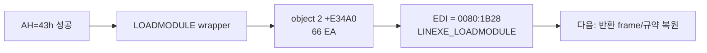

따라서 기존에 관찰하던 단일 공용 위치 `+0xE37A5`만으로는 충분하지 않습니다. 다음 단계는 active LINEXE 환경에서 opcode 형태와 `EDI`의 export provenance를 함께 검사하여 wrapper별 원거리 전이를 포착하고, HLE가 원본 wrapper의 반환 frame을 보존하도록 하는 것입니다.

After implementing `INT 21h AH=43h`, original execution reaches `object 2 +0xE34A0` in the first export wrapper. Its file-form far transfer is selector-relocated to `66 EA 04 00 2C 00` in the runtime image. At the boundary, `EDI=0080:1B28`, the original selector:offset of the extracted `LINEXE_LOADMODULE` export.

Watching only the previously assumed shared location at `+0xE37A5` is therefore insufficient. The next step is to recognize wrapper transfers from both opcode shape and `EDI` export provenance while preserving the original wrapper's return frame.

## 2026-07-12 정상 host 복귀와 현재 출력 / Clean host recovery and current output

**확인됨:** PIU는 Glide/WGL 초기화와 ordinal `0x5E`까지 진행한 뒤 DOS `AH=4Ch`로 종료한다. host selector recovery, 잔여 host single-step 처리, WGL 생성 스레드 정리를 적용한 실행은 supervisor `child_exit=0`, worker exit code 0으로 끝났으며 잔류 프로세스가 없었다. 원본 프로그램의 현재 stderr는 `ERROR: Not PTX file`이다. 따라서 다음 실행 frontier는 host 종료가 아니라 이 PTX 자산 판정의 입력 파일과 parser 호출 경로다.

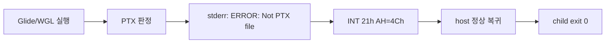

**Confirmed:** PIU progresses through Glide/WGL initialization and ordinal `0x5E`, then terminates through DOS `AH=4Ch`. With host-selector recovery, residual host single-step handling, and WGL creator-thread cleanup, the supervisor reports `child_exit=0`, the worker exits with code 0, and no process remains. The original program's current stderr is `ERROR: Not PTX file`. The next execution frontier is therefore the PTX input selection and parser call path, not host termination.

### PIU.DAT I/O 배제 / PIU.DAT I/O ruled out

**수정됨:** bounded file-I/O ring과 read-call stack을 결합한 결과, 이전 결론과 달리 PTX 오류의 원인은 DOS file HLE의 large-read ABI였습니다. 원본 wrapper는 32-bit `ECX/EAX`를 사용하지만 HLE가 `CX/AX`로 축소하여 `0x00855C29` payload를 `0x5C00` 부근까지만 읽었습니다. 32-bit ABI 복원 후 `Not PTX file` 종료 경로를 통과했습니다.

**Corrected:** Combining the bounded file-I/O ring with the read-call stack showed that the PTX failure was a large-read ABI defect in DOS file HLE. The original wrapper uses 32-bit `ECX/EAX`, while HLE reduced them to `CX/AX`, loading only about `0x5C00` of the `0x00855C29` payload. Restoring the 32-bit ABI passes the `Not PTX file` termination path.

후속 종료-stack 분석으로 entry pointer 계산은 정상이며 archive payload load 크기가 잘렸음이 확인됐다. `HFONT1.PTX` pointer `0x03BB6AE9`는 buffer base `0x0393B650 + 0x27B499`와 정확히 일치하지만 payload size `0x00855C29` 중 약 `0x5C00`만 읽혀 pointer 위치가 zero-filled 상태다. 다음 frontier는 32-bit payload size가 DOS read loop로 전달될 때 상위 16비트가 사라지는 지점이다.

Termination-stack analysis subsequently proved that entry-pointer arithmetic is correct and the archive payload load size was truncated by the former 16-bit HLE read ABI. Restoring the protected-mode 32-bit `ECX/EAX` contract resolves that frontier.

## 120초 장기 실행 관찰 / 120-second extended observation

**확인됨:** read ABI 복원 후 120초 동안 guest fatal이나 예외 없이 heartbeat `27,231,182`, dispatch `13,615,591`, progress `1,320,177`까지 증가했다. 약 23초 이후 실행 표본은 주로 object 2 `+0xDE1xx`의 bit unpack/decode loop에 집중된다. 현재 frontier는 새로운 기능 누락이 아니라 모든 guest 명령을 Trap Flag/VEH로 single-step하는 실행 성능 병목이다.

**Confirmed:** After the read-ABI restoration, a 120-second run reached heartbeat `27,231,182`, dispatch `13,615,591`, and progress `1,320,177` without a guest fatal or exception. Samples after about 23 seconds concentrate in the bit unpack/decode loop at object 2 `+0xDE1xx`. The current frontier is execution throughput caused by Trap Flag/VEH single-stepping every guest instruction, rather than a newly demonstrated missing service.

### Native fast path 1차 검증 / First native fast-path verification

`+0xDE170`의 검증된 원본 함수를 hardware return breakpoint까지 네이티브 실행하도록 구현했다. 30초 실행에서 `9,242/9,242/0` entry/return/cancel을 확인했으며 새 오류는 없다. 표본 병목은 `+0xDE2xx` helper 집합으로 이동했다. 다음 frontier는 여러 실행 파일에 재사용 가능한 공용 verified-region 정책과 개별 helper signature table 중 어느 범위로 확장할지 결정하는 것이다.

The verified original function at `+0xDE170` now runs natively until a hardware return breakpoint. A 30-second run recorded `9,242/9,242/0` entry/return/cancel events without a new error. The sampled bottleneck moved to the `+0xDE2xx` helper group. The next frontier is choosing between a reusable verified-region policy and incremental per-helper signature entries.
### 공용 basic-block fast path 실험 / Generic basic-block fast-path experiment

**확인됨:** EXE 주소나 signature를 사용하지 않는 Zydis straight-line block prototype은 현재 병목을 개선하지 못했습니다. 임의 memory 허용은 의미 변화 위험을 보였고, register/SS-stack 제한은 30초 progress `116,274`로 기존 `116,424`보다 낮았습니다. prototype은 전부 되돌렸습니다. 다음 frontier는 runtime-profiled indirect target을 verified-function 정책에 포함할지, DBT/code cache 또는 code gate 방식을 선택할지 결정하는 것입니다.

**Confirmed:** An executable-independent Zydis straight-line block prototype did not improve the current bottleneck. Arbitrary memory introduced semantic risk, while register/SS-stack-only blocks reached 116,274 progress in 30 seconds versus the existing 116,424. The prototype was fully reverted. The next frontier is choosing runtime-profiled indirect targets for verified functions, a DBT/code cache, or code gates.
