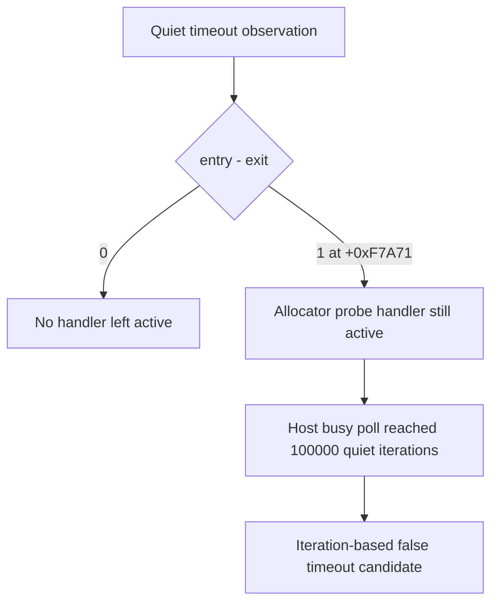
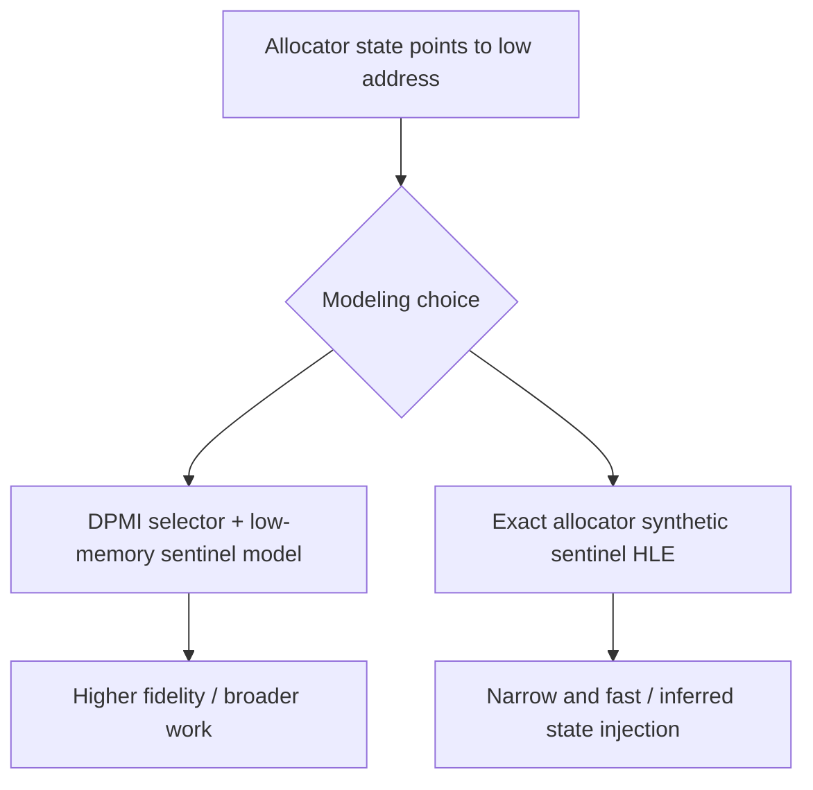

# 현재 실행 frontier와 다음 분석 대상

```mermaid
flowchart LR
    ENV["DOS Environment Scan"] --> FILES["intro.ani / stage.cfg"]
    FILES --> RESIZE["DOS Resize"]
    RESIZE --> OBJECTS["Boundary Object Array"]
    OBJECTS --> SENTINEL["Allocator Sentinel / Metadata"]
    SENTINEL --> DS0["8B 16 with DS:0 handled"]
    DS0 --> ADD["03 07 shadow ADD handled"]
    ADD --> OR["83 0E 01 shadow OR handled"]
    OR --> CMP["38 10 shadow byte CMP handled"]
    CMP --> ZERO["Bounded zero-backed allocator payload"]
    ZERO --> NEXT["38 50 20 handled"]
    NEXT --> LOOP["File parsing loop"]
    LOOP --> ALLOC["Allocator probe dispatch"]
    ALLOC --> QUIET["Repeated +0xF7A71 dispatch / quiet timeout"]
```



## 현재까지 도달한 상태

**확인됨:** DOS environment scan, `intro.ani`/`stage.cfg` file flow, DOS resize, arena 경계 객체 배열, allocator sentinel과 metadata store까지 진행한다. 실행 timing에 따라 생성자, allocator fault 또는 충분한 진척 뒤 quiet timeout이 먼저 관찰될 수 있다.

## 최근 해결

relocated base + `0x000F7A71`의 `8B 16` (`mov edx,[esi]`)에서 `ESI=0`인 경우를 guest `DS` zero-page read로 처리했다. 같은 명령의 고주소 source는 처리하지 않는다.

## 최근 해결한 ADD

**확인됨:** zero-page read 통과 후 relocated base + `0x000F7BAD`의 `03 07`을 shadow-memory source ADD로 처리했다.

```asm
add eax, dword ptr [edi]
```

관찰값 `EDI=0x026E49C4`의 dword를 shadow memory에서 읽고, destination register와 `CF/PF/AF/ZF/SF/OF`를 32-bit ADD 의미대로 갱신한다.

## 최근 해결한 OR

**확인됨:** ADD 통과 후 relocated base + `0x000F7AD4`의 `83 0E 01`을 shadow-memory read-modify-write로 처리했다.

```asm
or dword ptr [esi], 1
```

destination dword를 shadow memory에서 읽어 bit 0을 설정한 결과를 같은 주소에 기록했다. `CF/OF`를 0으로 하고 `PF/ZF/SF`를 결과에 맞게 복원하며 undefined인 `AF`는 보존한다.

## 최근 해결한 byte CMP

**확인됨:** OR 통과 후 relocated base + `0x000F5F34`의 `38 10`을 shadow byte source CMP로 처리했다.

```asm
cmp byte ptr [eax], dl
```

관찰값은 `EAX=0x046E49C8`, `EDX=0`이었다. shadow byte와 ModRM byte register를 비교하고 `CF/PF/AF/ZF/SF/OF`를 복원하며 operand는 변경하지 않는다.

## 최근 해결한 bounded zero backing

**확인됨:** 첫 CMP 통과 후 relocated base + `0x000F5F8E`에서 다음 명령이 관찰된다.

```asm
cmp byte ptr [eax+0x20], dl
```

이 source byte는 sparse shadow map에 없지만, 확인된 allocator payload 범위 안의 unwritten byte다. 요청 크기 `0x2C`와 `0x1008`만 추적하고 `[block+4, block+size-4)`에 한해 0을 반환하도록 구현해 이 비교를 통과했다. 이후 실행은 DOS interrupt, segment-memory load와 shadow read를 계속 처리하고 allocator probe로 돌아간다.

## Quiet timeout 재분류

**확인됨:** quiet timeout을 native 파일 파싱 loop의 정체로 단정할 수 없다. exception dispatch entry/exit를 guest suspend 없이 계수한 반복 실행에서 다음 세 형태가 관찰되었다.



* exception 종료: `entry=25604`, `exit=25604`, last EIP `+0xF7ABA`
* quiet timeout: `entry=34068`, `exit=34067`, outstanding `1`, last EIP `+0xF7A71`
* exception 종료: `entry=28234`, `exit=28234`, last EIP `+0xF7AA8`
* 전체 regression의 quiet timeout: `entry=33946`, `exit=33946`, outstanding `0`, last EIP `+0xF7A71`

마지막 single-step EIP는 반복 실행 모두 `+0xF4DC1`이었지만, timeout 직전 마지막 exception dispatch는 allocator probe `+0xF7A71`이었다. balanced timeout에서도 총 dispatch가 약 34,000회 발생했으므로 handler 자체가 항상 멈춘 것은 아니며, guest가 같은 allocator 경로를 반복하지만 현재 semantic progress counter에는 변화가 없는 상태다. outstanding `1`은 busy polling이 handler 실행 중간을 포착할 수 있음을 추가로 보여 준다. 다음 단계는 polling 한도부터 느슨하게 만들기보다 `+0xF7A71` 반복의 EAX/ESI와 pending allocation 상태를 bounded trace로 확인해야 한다.

## Allocator probe trace 결과

**확인됨:** 최근 16개를 보존하는 bounded ring으로 `+0xF7A71` 반복 상태를 확인했다.

| 경로 | 관측 수 | EAX | ESI/source | pending | 결과 |
| --- | ---: | ---: | ---: | --- | --- |
| quiet timeout A | 2,907 | `0x1008` | `0` | `0x1008` 유지 | `pending-preserved` |
| quiet timeout B | 2,816 | `0x1008` | `0` | `0x1008` 유지 | `pending-preserved` |
| high-source exception | 1 | `0x1008` | `0xFF000000` | 없음 | `rejected` |

timeout의 최신 16개는 각 실행에서 완전히 동일했다. 첫 `0x1008` request가 이미 pending인 상태이므로 probe는 새 크기를 capture하지 않는다. 정상적인 연결점인 `+0xF7AD4` header OR가 pending을 소비하기 전에 제어가 probe로 돌아오는 이유를 다음 분석에서 확인해야 한다.

## Allocator control-flow trace 결과

**확인됨:** allocator range의 exception sequence는 free-list 순회와 node split/update 경로를 구분한다.

| Offset | Bytes | 의미 |
| --- | --- | --- |
| `+0xF7A71` | `8B 16 39 D0` | current node size를 `EDX`로 읽고 request `EAX`와 비교 |
| `+0xF7A83` | `8B 76 08 39` | `ESI=[ESI+8]`로 next node 이동 |
| `+0xF7A99` | `8B 4E 08 83` | selected node의 next link 읽기 |
| `+0xF7AA8..+0xF7AB2` | `89`/`8B` stores | split node metadata 연결 갱신 |
| `+0xF7AD4` | `83 0E 01` | selected block header 사용 표시 |

`ESI=0x026E49C4` 경로는 `EAX=0x1008`과 `0x64030` 요청 모두 split/update 후 OR까지 도달했고 pending은 false였다. 후속 provenance 분석은 timeout의 `ESI=0`이 `node+8` shadow link에서 오지 않음을 확인했다.

## Shadow writer provenance 결과

**확인됨:** 최근 256개 shadow write를 allocation-free ring에 보존하고 allocator dword read와 연결했다. null link, poison link, root-null transition은 반복 실행에서 모두 `valid=false`였다. `ESI`는 allocator range 앞부분의 mapped instruction `mov esi,[ebx+0x0C]`에서 이미 `0` 또는 `0xFF000000`으로 설정되므로 shadow writer provenance 대상이 아니다.

초기 per-byte `unordered_map` 구현은 exception handler 안의 heap allocation 때문에 Windows heap corruption `0xC0000374`를 재현했다. 고정 ring으로 교체한 뒤 별도 build에서 `dos4gw_hello`와 PIU 반복 실행 6회가 crash/hang 없이 종료됐다.

## 의사결정 지점

다음 구현에는 정책 선택이 필요하다.



프로젝트 원칙에는 DPMI selector와 low-memory 초기 상태를 명시적으로 모델링하는 방향이 더 부합한다. exact allocator synthetic sentinel은 빠르지만 원본에서 확인하지 못한 head pointer를 주입해야 한다.

## 다음 검증 질문

1. DPMI selector/low-memory sentinel 모델을 우선할지 exact allocator synthetic sentinel을 허용할지 결정해야 한다.
2. 원본 DOS/4GW 환경에서 DS selector base와 linear page zero의 초기 allocator sentinel 값은 무엇인가?
3. 단일 zero-backed range를 여러 동시 생존 allocation range로 확장해야 하는가?
4. allocator 반복이 정상임이 확인된 뒤 quiet 판정을 wall-clock 기반으로 바꾸고 polling에서 CPU를 양보해야 하는가?

# Current Execution Frontier and Next Analysis Target

Execution now reaches DOS environment scanning, successful `intro.ani`/`stage.cfg` flow, DOS resize, boundary-object array initialization, and allocator sentinel/metadata stores. The `DS:0` form of `8B 16` at `0x000F7A71` has been handled without relocating low memory.

The allocator trace identifies free-list traversal and split/update paths, but fixed-ring writer provenance disproves the shadow-link-corruption hypothesis. `ESI=0` and `0xFF000000` already come from mapped allocator state `[EBX+0x0C]`, outside the exception-based shadow path. The remaining decision is whether to implement a higher-fidelity DPMI selector/low-memory sentinel model or inject a narrowly scoped synthetic allocator sentinel. The former better matches the project charter; the latter is faster but depends on inferred state.
