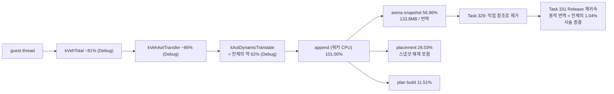
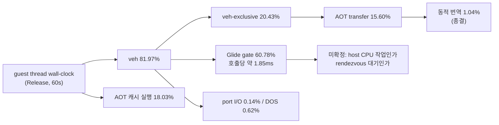
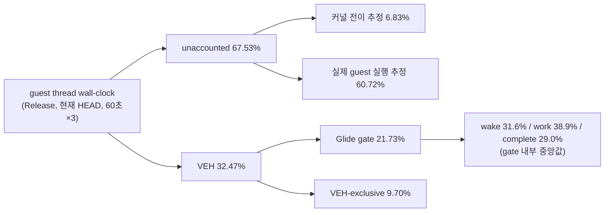

# 현재 실행 frontier / Current execution frontier

과거 전체 기록은 [Task 303까지의 frontier 원문](history/current-execution-frontier-through-task303.md)과
[Task 304~347 항목 원문](history/current-execution-frontier-task304-through-task347.md)에
보존합니다. 이 문서는 최근 약 10개 Task와 현재 결정만 유지합니다.

## 다음 할 일 / Next work, in order

2026-08-03 Tasks 404~409 기준입니다. 근거는 아래 인수인계 절과
[pumpit3 bring-up](pumpit3-bring-up.md), 측정 절차는
[port I/O / arena 귀속 가이드](../guides/port-io-arena-attribution.md)에 있습니다.

| # | 할 일 | 왜 지금인가 | 걸린 비용 |
|---|---|---|---:|
| 1 | **[완료, Task 410] 진입 횟수 편차** — 격리 유무로 갈립니다. 격리 없음 arena single-step 12,133~13,094 / 프레임 1,362~1,402, 격리 2,286,195~4,974,756(**180~410배**) / 프레임 867 또는 렌더 루프 미도달 | — | — |
| 2 | **[완료, Task 410] 소비 지점 = `HandleAotReentry` resolve 성공 분기**(`aot_runtime_dispatch.cpp:1893~1902`). 격리 없는 3회에서 arena single-step의 **100%**. **전제는 반증됐습니다 — 이 지점은 arena가 아니라 캐시(`0x0C403877`)로 복귀시킵니다** | — | — |
| 0 | **pumpit3 실행 중 멈춤(사용자 보고, 2026-08-04)** — 17회 중 5회 재현, 서명 완전 동일(`stage.cfg`에서 정지, 프레임 0, publishes 79). **진짜 정지이고, 격리도 속도도 원인이 아님**이 확인됐습니다. 남은 것은 지연 루틴을 13,173회 부르는 **캐시 측 호출자**. 전문: [pumpit3 기동 중 멈춤](pumpit3-startup-stall.md) | 사용자가 겪는 실제 증상 | (사용 가능성) |
| 2' | **port I/O census에 호출 측(VEH / thunk) 태그** — 후보 셋(HLE slot·Glide gate의 target-miss, 미해결 direct edge)은 **같은 로그로 전부 배제**됐습니다(target-miss 0/0, direct edge는 성공·실패 모두 캐시 복귀). 남은 가설은 **진입이 이탈이 아닐 수 있다**는 것 — thunk 경로는 게스트 EIP를 넘겨 `from_aot_cache`를 false로 만듭니다 | 새 **시작점**. 하루치 조사 방향이 아티팩트인지 여기서 갈림 | wall 약 42~50% |
| 3 | ~~arena→캐시 복귀 설계~~ **복귀는 이미 있고 정상 동작합니다**(resolve 100% 성공). 필요한 것은 복귀가 아니라 **이탈을 막는 것** — 2'가 선행 | 2'의 해결책 | 위와 같음 |
| 4 | **재번역이 요청 진입 주소를 address map에 남기지 못하는 조건** — 사유는 `dynamic AOT entry was not active in the new image`로 확보됨(Task 404) | 격리 실행의 근인 | 격리 시 wall 35~40% |
| 5 | **격리 발생을 가르는 조건** — 10회 중 6회, 5회 중 0회로 비결정적 | 4번과 짝 | 위와 같음 |
| 6 | **세그먼트 레지스터 HLE 이벤트당 약 2.4~2.7M cycle** — 표본 3,000회 미만인데 격리 없는 실행에서도 약 12% | 독립 축 | wall 약 12% |
| 7 | **`GetAsyncKeyState` 단가 3~6배** — Task 403의 3,044 대 실측 9,802~17,596 | JAMMA scan이 여전히 4.9~5.3% | wall 약 5% |
| 8 | ~~pumpit3가 45초에 렌더 루프에 도달하지 못함~~ **[정정, Task 410]** 격리 없는 3회는 `_GRBUFFERSWAP@4` **1,362~1,402회**로 렌더 루프에 도달·유지했습니다. 미도달은 **격리 실행**입니다(867회 또는 0회) | 프레임 기반 판정이 가능해짐 | — |
| 9 | **부팅 크래시** — arena base가 높게 잡히면 `INT 21h AH=4Ah` resize가 `0x0008`로 실패 | 재현율 낮으나 실행 자체가 죽음 | (안정성) |
| 10 | **teardown 지연** — Task 401 이후 손대지 않음 | 측정 회전율 | (편의) |

**측정 규칙(이번 세션에서 배운 것):**

* 격리 실행과 정상 실행은 **재진입 거동이 정반대**이므로 섞어서 평균 내지 않습니다.
  `AOT generation publishes/quarantines`를 먼저 읽습니다.
* **세션 간 절대 비교는 성립하지 않습니다.** 같은 날 pumpit1이 700~980 프레임인데
  08-02 기록은 2,222/2,251입니다. 같은 세션 안의 대비만 씁니다.
* 진입 분류 수는 해당 예외 총수를 넘을 수 없습니다. **이 검산을 빼면 Task 408처럼
  결론이 과해집니다.**
* `REPIU_PORT_IO_CENSUS_MAPPING`을 켠 실행의 wall·프레임은 인용하지 않습니다.

## Next work, in order

Based on Tasks 404-409 on 2026-08-03. Evidence is in the handoff below and
[pumpit3 bring-up](pumpit3-bring-up.md); the procedure is in the
[port I/O / arena attribution guide](../guides/port-io-arena-attribution.md).

| # | Item | Why now | Cost at stake |
|---|---|---|---:|
| 1 | **[done, Task 410] The entry-count variation is quarantine** — 12,133-13,094 arena single steps and 1,362-1,402 frames without it, 2,286,195-4,974,756 (**180-410x**) and 867 frames or no render loop with it | — | — |
| 2 | **[done, Task 410] The consumer is `HandleAotReentry`'s resolve-success branch** (`aot_runtime_dispatch.cpp:1893-1902`), **100%** of arena single steps in three quarantine-free runs. **The premise is refuted — it returns to the cache (`0x0C403877`), not the arena** | — | — |
| 0 | **pumpit3 stalls mid-run** (user-reported, 2026-08-04) — reproduced five times in seventeen runs with an identical signature (stopped at `stage.cfg`, zero frames, exactly 79 publishes). Confirmed a **true stop**, and **neither quarantine nor slowness causes it**. What remains is the **cache-side caller** that invokes the delay routine 13,173 times. Full account: [pumpit3 startup stall](pumpit3-startup-stall.md) | It is what the user actually hits | (usability) |
| 2' | **Tag the port I/O census with its caller side** (VEH or thunk) — all three candidates for an exception-free departure are **excluded by the same logs** (both target-miss counters zero; the direct-edge dispatcher resumes at a cache address on success *and* failure). The surviving hypothesis is that **the entry is not a departure**: the thunk path passes a guest EIP, which forces `from_aot_cache` false | New head of the chain; decides whether a day of analysis rests on an artifact | ~42-50% of wall |
| 3 | ~~Design the arena-to-cache return~~ — **the return already exists and works** (100% resolve success). What is needed is not a return but stopping the departure; blocked on 2' | The remedy for 2' | same |
| 4 | **Why a re-translation omits its requested entry from the address map** — the reason string `dynamic AOT entry was not active in the new image` is already captured (Task 404) | Root of the quarantined mode | 35-40% of wall when it fires |
| 5 | **What decides whether quarantine fires** — six of ten runs, then zero of five | Pairs with item 4 | same |
| 6 | **Segment-register HLE at 2.4-2.7M cycles per event** — under 3,000 events yet about 12% of wall even without quarantine | Independent axis | ~12% of wall |
| 7 | **`GetAsyncKeyState` three to six times Task 403's price** (3,044 against 9,802-17,596) | JAMMA scan still 4.9-5.3% | ~5% of wall |
| 8 | ~~pumpit3 not reaching its render loop in 45 s~~ **[corrected, Task 410]** the three quarantine-free runs reached and held it at **1,362-1,402** `_GRBUFFERSWAP@4`; the runs that did not reach it were the quarantined ones (867 or zero) | Frame-based judgement now possible | — |
| 9 | **Boot crash** when the arena lands high and `INT 21h AH=4Ah` resize fails with `0x0008` | Low reproduction rate but kills the run | (stability) |
| 10 | **Teardown stall**, untouched since Task 401 | Measurement turnaround | (convenience) |

**Measurement rules learned this session:** quarantined and healthy runs behave oppositely on
re-entry, so never average them — read `AOT generation publishes/quarantines` first;
cross-session absolute comparison does not hold, since pumpit1 measured 700-980 frames the same
day against 2,222/2,251 on 08-02, so use within-session contrasts only; an entry class count
cannot exceed that exception's total, and **skipping that check is how Task 408 overstated its
conclusion**; and runs with `REPIU_PORT_IO_CENSUS_MAPPING` enabled are not quotable for wall
time or frames.

## 다음 세션 인수인계 / Session handoff

### Task 410 결과 — 소비 지점은 확정됐고, **전제가 반증됐습니다**

pumpit3 45초 **8회**(같은 빌드·같은 세션, census mapping 끔). 상세는
[Task 410 로그 §5](../work-logs/20260803-410-veh-exit-site-attribution.md).
**검산 `합 == 총수`가 8회 전부 성립**했습니다.

**확인됨 — `0x0301F7CE` single-step의 소비 지점은 `HandleAotReentry`의
`ResolveAotTransferTarget` 성공 분기**(`aot_runtime_dispatch.cpp:1893~1902`)입니다.
격리 없는 3회에서 arena EIP single-step의 **100%**(12,133/12,133 · 12,901/12,901 ·
13,094/13,094)가 이 지점입니다. **모집단 전체가 한 지점**이므로 첫 표본이 곧
모집단이며, Task 409가 요구한 검증을 통과합니다.

**반증됨 — 그 지점은 arena에 남기지 않습니다.** `exit-eip`가 **`0x0C403877`, AOT
캐시 주소**입니다(캐시 범위 `0x0A000000`~`0x0E000000`, 8회 전부 동일). 해당 분기는
`Eip = cache_address` · TF 해제 · reentry·legacy·trace 해제를 한 문단에서 합니다.
관측된 `flags = 0x00`은 바로 그 직후 상태입니다. **따라서 Task 408 §2의 "그 예외
처리가 TF를 끄고 arena에 그대로 재개하며"는 틀렸고, 여기서 정정합니다.**
`0x0C403877`은 게스트 `0x0301F7CE`의 캐시 번역본입니다.

**새 시작점 — 이탈은 예외 없이 일어납니다.** 복귀 지점은 캐시인데 **바로 다음
예외**는 `0x0301DB22`를 arena에서 실행하다 난 port I/O fault입니다(`cache` = 0, 8회
전부). 그 사이 VEH 예외가 **하나도 없습니다.** 진입:count = 1:480이므로 한 번 나가면
오래 머뭅니다. 후보는 AOT-DBT HLE slot target-miss bridge, Glide gate의 같은 bridge,
**캐시에 남은 미해결 direct edge**(pumpit3는 probe가 `direct control-flow target is
outside the cache`를 내는 타이틀 — Task 395)이며 **셋 다 미측정**입니다.

**확인됨 — 진입 횟수 편차의 정체는 격리입니다(항목 1 해소).** 격리 없음은 arena
single-step 12,133~13,094·프레임 1,362~1,402, 격리는 2,286,195~4,974,756(**180~410배**)·
프레임 867 또는 렌더 루프 미도달입니다. 종료 지점 분포도 정반대입니다 — 격리 실행은
`step-trace-stepped` 75.1% + `step-trace-hle-stepped` 24.5%로, 이 둘은 TF를 **켠 채**
arena에 남깁니다. `aot-reentry-resolved`의 **절대수는 두 모드가 비슷**하므로
(12,133 대 9,953) 격리는 정상 경로를 없애지 않고 그 위에 스텝 실행을 얹습니다.

**부수 확인 — 항목 9 재현.** 8회 중 1회가 arena base `0x07000000`으로 잡혀
(`VirtualAlloc MEM_RESERVE failed with error 487` 후 fallback) 부팅 단계에서
죽었습니다. 그 실행의 게스트 주소는 정상 실행과 정확히 **+0x04000000** 관계입니다.

**후보 셋 배제 — 같은 로그로, 추가 실행 없이.**

| 후보 | 근거(격리 없는 3회) | 판정 |
|---|---|---|
| AOT-DBT HLE slot target-miss bridge | `fallback reason .../target/...` = **0/0/0** | 배제 |
| Glide gate target-miss bridge | `Glide direct dispatch ... target-miss` = **0/0/0** | 배제 |
| 미해결 direct edge(사이트 10개) | `ResolveAotDbtDirectEdgeFrame`이 성공·실패 **양쪽 다 캐시 주소**로 재개 | 배제 |

**남은 가설(미측정) — 진입이 이탈이 아닐 수 있습니다.** `HandlePortIoInstruction`은
VEH 밖 AOT fast-path thunk에서도 호출되며(`port_io_emulator.cpp:440~442`) 그때 EIP가
**게스트 주소**라 `from_aot_cache`가 false가 됩니다. 즉 캐시 실행이 "arena"로 기록될 수
있습니다. run 4의 예외 없는 HLE slot dispatch 16,599회 대 진입 3,600회로 수치가
호환됩니다. **다만 port I/O 총수 1,772,285 대 예외 census `other` 1,772,980이므로
대부분이 진짜 VEH fault인 것은 확실하며, 가설이 겨냥하는 것은 진입 3,600건의
분류입니다.**

**Candidates excluded from the same logs, with no extra runs:** both target-miss
counters read zero in all three quarantine-free runs, and the unresolved direct-edge
dispatcher is refuted by its own code, resuming at a cache address on success *and* on
failure. The surviving hypothesis, **unmeasured**, is that the entry is not a departure
at all — `HandlePortIoInstruction` is reachable from the AOT fast-path thunk with a
guest EIP, which forces `from_aot_cache` false, and run 4's 16,599 exception-free slot
dispatches are compatible with 3,600 entries. The bulk of port I/O is certainly a real
VEH fault (1,772,285 handled against an exception census `other` of 1,772,980); the
hypothesis concerns only how those 3,600 entries are classified.

### Task 410 results — the consumer is settled and the premise is refuted

Eight 45-second pumpit3 runs on one build and one session, census mapping off; detail in
[Task 410 log §5](../work-logs/20260803-410-veh-exit-site-attribution.md). **The
`sum == total` check held in all eight.**

**Confirmed — the site is `HandleAotReentry`'s `ResolveAotTransferTarget` success
branch** (`aot_runtime_dispatch.cpp:1893-1902`), covering **100%** of arena-EIP single
steps in the three quarantine-free runs (12,133 of 12,133, 12,901 of 12,901, 13,094 of
13,094). The population is one site, so the first sample is the population here — the
check Task 409 demanded.

**Refuted — that site does not leave execution in the arena.** Its exit EIP is
`0x0C403877`, an **AOT cache address**, identically in all eight runs; the branch sets
`Eip` to the cache address and clears the trap flag, re-entry, legacy, and trace
together, and the observed `flags = 0x00` is that post-resolve state. **Task 408 §2's
"that handler clears the trap flag and resumes in the arena" is wrong and is corrected
here.** `0x0C403877` is the cache translation of guest `0x0301F7CE`.

**New head of the chain — the departure raises no exception.** Execution returns to the
cache, yet the very next exception is a port I/O fault running `0x0301DB22` in the arena
(`cache` zero in all eight runs) with no VEH exception in between, and the 1:480 entry-
to-read ratio says it stays out once gone. Candidates are the AOT-DBT HLE slot
target-miss bridge, the Glide gate's equivalent, and an unresolved direct edge left in
the cache — pumpit3 being the title whose probe reports `direct control-flow target is
outside the cache` (Task 395) — **none of them measured.**

**Confirmed — the entry-count variation is quarantine (item 1 closed).** Without it,
12,133-13,094 arena single steps and 1,362-1,402 frames; with it, 2,286,195-4,974,756
(180-410x) and 867 frames or no render loop. The distributions invert: quarantined runs
are 75.1% `step-trace-stepped` and 24.5% `step-trace-hle-stepped`, both of which re-arm
the trap flag and do leave execution stepping in the arena. The absolute count of
`aot-reentry-resolved` is comparable across modes (12,133 against 9,953), so quarantine
layers stepping on top of the healthy path rather than replacing it.

**Also — item 9 reproduced** once in eight runs, with the arena at `0x07000000` after
`VirtualAlloc MEM_RESERVE failed with error 487`; that run's guest addresses sit exactly
`+0x04000000` from the usual ones.

### Task 410 방법 기록 — 코드 읽기만으로는 닫히지 않았습니다 (모순 확인 후 계측 투입)

`0x0301F7CE`의 single-step 소비 지점을 코드로 특정하려 했으나 **서로 모순되는 네 진술**이
나왔습니다. 전문은 [Task 410 로그 §1](../work-logs/20260803-410-veh-exit-site-attribution.md),
근거 지점은 [설계 §2](../design/20260803-410-veh-exit-site-attribution.md).

* **(a)** `HandlePrivilegedTrapInstruction`은 `CLI`에서 TF를 건드리지 않습니다
  (`execution_trampoline.cpp:1483~1489`). 트랩 위치가 `0x0301F7CE`이므로 TF는
  `CLI` 예외를 재개할 때 **이미 켜져 있었습니다**(직전 `0x0301F7CC`는 `xor edx,edx`).
* **(b)** 그 시점에 TF를 켤 수 있는 곳은 **전부 `enable_single_step_trace`도 켭니다.**
  유일한 예외인 guest code write fault는 직전 명령이 store여야 하는데 `31 d2`는
  아닙니다.
* **(c)** 그런데 관측 flags는 `0x00`이고 **bit 4가 trace**입니다
  (`port_io_emulator.cpp:499~504`). Task 408 4회·Task 409 3회 전부 동일합니다.
* **(d)** `enable_single_step_trace = false`를 쓰는 9곳이 **전부 같은 문단에서 EIP를
  캐시 주소로 옮깁니다.** trace를 끄면서 arena에 남기는 경로가 없습니다.
* **(e)** `0x0301F7CE`의 `83 ba ...`는 ModRM `0xBA` → **`/7` = `cmp r/m32, imm8`**이고
  `0x83` 처리기는 `/0`(add)와 `/1`(or)뿐입니다. trace가 꺼진 채라면 사슬을 통과해
  `execution_trampoline.cpp:3652`의 `RecoverToHost`로 **실행이 죽어야** 합니다.

**따라서 셋 중 하나입니다:** 코드 읽기가 놓친 종료 경로가 있다 / flags가 가정한
시점의 상태가 아니다 / 기록된 직전 예외가 슬롯이 말하는 것과 다르다. 세 갈래는
**"누가 그 예외를 처리했는가"를 기록하면 한 번에 갈립니다.**

Task 410이 그 계측을 넣었습니다 — VEH 종료 지점 38종 명명(`VehExitSite`),
`AotHleTranslationScope`보다 먼저 생성되는 `VehExitRecorder`(그래서 **최종 재개
EIP**를 봄), `prev_veh_exit_*` 전이 슬롯, **arena EIP single-step 종료 지점
히스토그램**(`합 == 총수` 검산 포함), 주소별 진입 표본의 `exit-site`/`exit-eip`.
**동작 불변이며 lookup을 추가하지 않으므로 이 빌드의 wall·프레임은 인용 가능합니다.**

**측정은 남아 있습니다.** 읽을 줄과 판정 기준은 Task 410 로그 §3·§5에 있습니다.

### Task 410 — item 2 does not close by reading (contradiction found, instrument added)

Locating the consumer of the `0x0301F7CE` single step in code produced **four mutually
inconsistent statements**: the `CLI` HLE never touches the trap flag, so it was already
set on resume; every site that could have set it there also sets
`enable_single_step_trace`; the recorded flags are `0x00`, whose bit 4 is that same
flag; all nine sites that clear it move `Eip` to a cache address in the same paragraph;
and the instruction at `0x0301F7CE` is `cmp r/m32, imm8` (`/7`), which no handler
covers, so with trace off the run should have died at the terminal recover path.

So either reading missed an exit, the flags do not describe the assumed moment, or the
recorded predecessor is not what the slot says — and **recording who consumed each
exception separates all three at once.** Task 410 added exactly that: 38 named VEH exit
sites, a recorder constructed before `AotHleTranslationScope` so it sees the final
resume EIP, `prev_veh_exit_*` transition slots, a histogram over every arena-EIP single
step with a `sum == total` check, and the exit site and EIP on each per-address entry
sample. Behaviour is unchanged and no lookup is added, so this build's wall time and
frames stay quotable. **The measurement itself is still outstanding.**

### 2026-08-03 현재: pumpit3의 지배 비용은 port I/O 예외입니다 (Tasks 404~409)

같은 빌드·같은 세션에서 pumpit3 15회, pumpit1 5회를 45초씩 측정했습니다. 상세는
[pumpit3 bring-up](pumpit3-bring-up.md), 근거는
[Task 404 작업 로그](../work-logs/20260803-404-aot-generation-failure-attribution.md).

**확인됨 1 — 게스트 `IN` 한 번마다 CPU fault 한 번이고, 그 명령은 하나입니다.**
`0xC0000096`이 전체 예외의 **90.4~92.9%**이고 VEH gap이 wall의 **41.9~49.7%**입니다.
Task 405의 주소 census가 원인을 한 점으로 좁혔습니다: **`0x0301DB22`(200회 지연 루프의
`in ax,dx`) 하나가 port I/O의 85.9~97.2%** 입니다.

**확인됨 1a — 그 코드는 AOT 캐시가 아니라 arena에서 실행됩니다.** census의
`cache_count`가 **모든 실행·모든 항목에서 0**입니다. 예외 없는 dispatch가 1.4%에만
적용되는 이유는 planner/emitter 결함이 아니라 **캐시 코드가 실행되지 않기 때문**입니다
(slot 기구는 정상: outside-veh 15,560 = thunk 진입 15,560).

**확인됨 1b (Task 406) — 번역은 있는데 돌아가지 않습니다.** `REPIU_PORT_IO_CENSUS_MAPPING=1`
실행에서 `0x0301DB22`의 `mapped`가 92.4~100%(111 프레임 실행은 **992,156회 전부**)이고
`reentry`는 **모든 실행에서 0**입니다. 번역 부재 가설은 기각입니다. `aot_reentry_pending`은
실행이 캐시 경계로 빠져나올 때만 세워지는데 이 루프는 arena에서 돌고 있어 경계를 통해
나온 적이 없습니다. **→ 다음 축은 "왜 애초에 arena로 나갔는가"이며, 최초 이탈 원인을
두고 복귀만 붙이면 같은 이탈이 반복됩니다.**

**계측 주의(Task 405):** profiled `kPortIoDevice` count/cycles는 port I/O를 과대
계상합니다. `ExecutionTimeScope`가 함수 진입 시 생성되어 opcode 검사에서 빠져나가는
호출까지 세기 때문입니다. **실제 횟수는 census 쪽**입니다.

**확인됨 2 — 일부 실행은 페이지 격리로 4배 더 나빠집니다.** 재번역 1회 실패가
`RequestAotGuestPageRetirement(quarantine=true)`로 페이지를 영구 격리하고, 그 페이지에
200회 I/O 지연 루프(`0x0301DB1F`~`0x0301DB2A`)가 있어 명령마다 TF single-step이 됩니다.
single-step이 265 → 510,000~578,000으로 뛰고 커널 왕복만 wall의 35~40%입니다. 거부된
재진입 120,859가 `0x0301DB22`의 port-I/O HLE 횟수와 정확히 일치합니다. 오전 10회 중
6회 재현, 오후 5회 중 0회 재현으로 **실행별 비결정성**입니다.

**확인됨 3 — 디스플레이 제한이 아닙니다.** `REPIU_GLIDE_SWAP_INTERVAL=0`에서 pumpit1은
700→722/749(+4%), pumpit3는 0→0입니다.

**함께 나온 것:** `GetAsyncKeyState`가 호출당 9,802~17,596 cycle로 Task 403 기록(3,044)의
3~6배이고, JAMMA scan이 여전히 wall의 4.9~5.3%입니다. 세그먼트 레지스터 HLE는 이벤트당
약 2.4~2.7M cycle로 격리 없는 실행에서도 약 12%입니다. arena base가 높게 잡힌 실행 1회는
`INT 21h AH=4Ah` resize 실패(error `0x0008`)로 부팅 크래시했습니다.

**주의:** 같은 날 pumpit1이 700~838 프레임인데 08-02 기록은 2,222/2,251입니다.
**세션 간 절대 비교는 성립하지 않으며**, 위 수치는 같은 세션 안의 대비로만 유효합니다.

**확인됨 4 — 세대 실패 사유(Task 404 목표, Task 405 실행 중 포착):**

```
0x0301DFFE / page 0x0301D000 / quarantined=true / terminal=false
"dynamic AOT entry was not active in the new image"
```

격리된 페이지가 지연 루프가 있는 `0x0301D000`임이 실측 확인됐고, 사유는 용량·번역기·
coverage가 아니라 **배치 계열**입니다. 재번역이 이미지를 만들었으나 요청 진입 주소의
address-map 항목이 없었습니다.

**확인됨 5 (Task 407) — 두 모드는 재진입 관점에서 정반대이고, arena 진입 신호는 둘입니다.**
격리 실행은 TF를 켜고 재진입을 예약한 채 single-step하다 격리에 막히고(census `reentry`가
`0x0301DB22`의 93~98%), 정상 실행은 **시도조차 하지 않습니다**(`reentry` 0%). 진입 신호는
**(a) 캐시 주소의 INT3 이후**(부팅기, 3회 실행 첫 16건 완전 동일)와 **(b) arena access
violation 이후**(정상 상태, `0x0301F827` → `0x0301F851` PIC EOI) 두 가지이며, 둘 다
**TF 꺼짐 + 예약 없음**으로 끝납니다. (a)의 INT3는 캐시 주소인데 경계 경로가 항상 TF를
켜므로 **그 경로가 처리한 것이 아닙니다.** 진입 전이는 실행당 11,597~239,423회입니다.

**확인됨 6 (Task 408) — 지연 루프는 INT 8 타이머 핸들러 안에서 arena에 들어갑니다.**
주소별 진입 표본이 격리 없는 4회 실행에서 **완전히 동일**했습니다: 직전 예외
`0x80000004`(single-step) @ `0x0301F7CE`, flags `0x00`(캐시 밖·TF 꺼짐·예약 없음).
`0x0301F7CE`는 **`CLI` 바로 다음 명령**(파일 `0x2A9CE`)이므로, privileged HLE가 `CLI`를
처리한 뒤 나는 single-step을 **누군가 TF를 끄고 arena에 재개**시키고, 그때부터 핸들러
전체가 arena 자유 실행이 됩니다. Task 407 신호 (b)의 `0x0301F827`도 같은 루틴 89바이트
뒤이므로 **두 신호는 같은 핸들러의 서로 다른 지점**입니다. 주소마다 기전이 달라
(`0x030D0A1A`는 진입:count가 1:1, `0x0301DB22`는 1:340) 전역 버퍼로는 판정 불가였습니다.

**정정(Task 408):** 진입:count 비를 1:200으로 예상했으나 1:19.6~1:340입니다. 진입 횟수는
지연 호출 수가 아니라 **arena 체류 횟수**입니다.

**미확정:** `0x0301F7CE`의 single-step을 처리하며 TF를 끄고 arena에 남기는 곳(최우선 —
`aot_runtime_dispatch.cpp:1866~1913`의 세 분기 중 관측 상태와 맞는 것이 없음). `CLI` 다음에
single-step이 나는 이유. (a) 신호 INT3의 정체. (b) 신호 AV 처리가 왜 arena에 남기는지.
캐시 중간 진입의 정확성. 재번역이 요청 진입 주소를 address map에 남기지 못하는 조건.
격리 발생을 가르는 조건. pumpit3가 45초 안에 렌더 루프에 도달하지 못하는 것은 격리 없는
실행에서도 마찬가지이므로 별개 원인이 남아 있습니다.

### As of 2026-08-03: pumpit3's dominant cost is the port I/O exception (Task 404)

Fifteen 45-second pumpit3 runs and five pumpit1 runs on one build and one session. Detail is
in [pumpit3 bring-up](pumpit3-bring-up.md); evidence in the
[Task 404 work log](../work-logs/20260803-404-aot-generation-failure-attribution.md).

**Confirmed 1 — each guest `IN` costs one CPU fault, and it is a single instruction.**
`0xC0000096` faults are **90.4-92.9%** of all exceptions and their VEH gap is **41.9-49.7%**
of wall. Task 405's address census narrowed the cause to one point: **`0x0301DB22`, the
`in ax,dx` of the 200-iteration delay loop, is 85.9-97.2% of all port I/O**.

**Confirmed 1a — that code executes in the arena, not the AOT cache.** The census records
`cache_count` as **zero in every entry of every run**. Exception-free dispatch covers only
1.4% not because of a planner or emitter defect but because **no cache code is executing
there** — the slot mechanism itself works, with 15,560 outside-VEH calls matching 15,560
thunk entries.

**Confirmed 1b (Task 406) — the translation exists and is never returned to.** Under
`REPIU_PORT_IO_CENSUS_MAPPING=1`, `mapped` for `0x0301DB22` is 92.4-100% — **all 992,156
executions** in the 111-frame run — while `reentry` is **zero in every run**. The
missing-translation hypothesis is rejected. `aot_reentry_pending` is only set when execution
leaves the cache through a boundary, and this loop runs in the arena, so it never did.
**The next axis is why execution went to the arena in the first place; adding a return path
without that answer would only replay the same departure.**

**Measurement caveat (Task 405):** the profiled `kPortIoDevice` count and cycles over-count
port I/O, because `ExecutionTimeScope` is constructed on entry and counts calls that bail at
the opcode check. **The census is the accurate count.**

**Confirmed 2 — some runs are four times worse through page quarantine.** A single failed
re-translation quarantines a page permanently, and that page carries the 200-iteration I/O
delay loop at `0x0301DB1F`-`0x0301DB2A`, so every instruction becomes a trace-flag single
step: 265 single steps become 510,000-578,000 and the kernel round trip alone reaches 35-40%
of wall. The link is exact — 120,859 rejected re-entries equal the port-I/O HLE count at
`0x0301DB22`. It fired in six of ten morning runs and none of five afternoon runs, so it is
run-to-run nondeterminism.

**Confirmed 3 — not display-limited.** With `REPIU_GLIDE_SWAP_INTERVAL=0`, pumpit1 goes 700
to 722/749 (+4%) and pumpit3 stays at zero.

**Also found:** `GetAsyncKeyState` measures 9,802-17,596 cycles per call, three to six times
Task 403's 3,044, leaving the JAMMA scan at 4.9-5.3% of wall; segment-register HLE costs
about 2.4-2.7M cycles per event and roughly 12% of wall even without quarantine; and one run
crashed at boot when the arena landed high and `INT 21h AH=4Ah` resize failed with `0x0008`.

**Caution:** pumpit1 measured 700-838 frames the same day against 2,222/2,251 on 08-02, so
**cross-session absolute comparison does not hold** — the figures above are within-session
contrasts only.

**Confirmed 4 — the generation-failure reason** (Task 404's goal, captured during Task 405's
runs): `0x0301DFFE`, page `0x0301D000`, quarantined, not terminal, **"dynamic AOT entry was
not active in the new image"**. The quarantined page is measured to be the one holding the
delay loop, and the cause is in the placement family rather than capacity, translation, or
coverage — the re-translation built an image with no address-map entry for its own requested
entry address.

**Confirmed 5 (Task 407) — the two modes are opposites on re-entry, and there are two
arena-entry signatures.** Quarantined runs single-step with the trap flag on and re-entry
scheduled until the quarantine refuses them (census `reentry` is 93-98% at `0x0301DB22`);
healthy runs **never try** (`reentry` 0%). Entry happens either **(a) after an INT3 at a cache
address** (boot phase, the first sixteen entries identical across three runs) or **(b) after an
arena access violation** (steady state, `0x0301F827` into the `0x0301F851` PIC EOI), and both
end with **no trap flag and nothing scheduled**. Signature (a)'s breakpoint sits at a cache
address, yet the boundary path always sets the trap flag, so **it was not handled by that
path**. Entry transitions number 11,597-239,423 per run.

**Confirmed 6 (Task 408) — the delay loop enters the arena inside the INT 8 timer handler.**
The per-address entry sample was **identical in all four quarantine-free runs**: previous
exception `0x80000004` (single step) at `0x0301F7CE`, flags `0x00` (outside the cache, trap
flag clear, nothing scheduled). `0x0301F7CE` is **the instruction right after a `CLI`** (file
offset `0x2A9CE`), so after the privileged HLE emulates the `CLI`, something takes the
following single step, **clears the trap flag, and resumes in the arena**, and from there the
whole handler free-runs. Task 407's signature (b) address `0x0301F827` is 89 bytes further into
the same routine, so **both signatures are points in one handler**. Mechanisms differ per
address — `0x030D0A1A` is one entry per execution, `0x0301DB22` one per 340 — which is why a
global buffer could not decide it.

**Correction (Task 408):** the expected entry-to-count ratio of 1:200 measured 1:19.6 to 1:340.
Entries count **arena residencies**, not delay-loop calls.

**Unresolved:** which handler consumes the single step at `0x0301F7CE`, clears the trap flag,
and leaves execution in the arena (top priority — none of the three branches at
`aot_runtime_dispatch.cpp:1866-1913` matches the observed state); why a single step follows the
`CLI` at all; the identity of signature (a)'s breakpoint; why signature (b) leaves execution in
the arena; whether mid-stream cache entry is correct; the condition under which a
re-translation omits its requested entry from the address map; what decides whether quarantine
fires; and why pumpit3 fails to reach its render loop within 45 seconds even without
quarantine, which must have a separate cause.

### 2026-08-02 현재: pumpit3가 렌더 루프에 진입했습니다

Tasks 396~401에서 `pumpit3`를 프로필 추가부터 렌더 루프까지 올렸습니다. 전체 경위와
근거는 [pumpit3 bring-up](pumpit3-bring-up.md)에 정리했습니다. 45초 실행 기준
`_GRBUFFERSWAP@4` 1,140회(약 25 FPS), 창 `1/640x480`, MSCDEX 65트랙, 정상 timeout 종료.

막고 있던 것은 프로필이나 mount가 아니라 **전부 HLE 공백**이었습니다: `INT 21h AH=2Ch`,
`AH=2Ah`, `AH=35h`의 16비트 절단, INT 8 체인 인식 조건, `INT 16h`. 게임 코드는 수정하지
않았습니다.

**다음 할 일 (우선순위 순):**

1. **[완료] pumpit1/pumpit2 회귀 확인.** Task 402 후속 측정에서 두 타이틀 모두 45초를
   크래시 없이 완주하고 각각 2,222 / 1,985 프레임을 그렸습니다. 회귀 없음.
2. **화면 내용 검증.** 프레임은 나오지만 그려지는 내용이 맞는지 미확인입니다.
   texture upload가 27건(distinct 24)으로 적어 자산 로딩 진행도 확인이 필요합니다.
3. **포트 `0x02A8` 폴링 비용 (Task 402가 새로 지목).** wall의 약 46~56%입니다.
   **pumpit3 고유 문제입니다** — 포트 접근이 초당 41,023회로 pumpit1(558회)의 73.6배이며,
   호출당 비용은 세 타이틀이 비슷합니다(약 16,000~29,000 cycle). pumpit1/pumpit2의 지배
   비용은 여전히 Glide gate(57.20% / 35.77%)입니다.
   `ReadJammaPort8`이 포트 읽기마다 `GetAsyncKeyState`를 최대 10회 호출해 초당 약
   410,000회 커널 왕복이 발생합니다. 게스트는 이 200회 읽기를 값이 아니라 지연 목적으로
   실행하며, `AH=2Ch` 지연과 달리 자기 보정되지 않으므로 호출당 비용을 줄이면 wall time이
   실제로 줍니다. ~~`INT 21h AH=2Ch` 비용 측정~~은 Task 402에서 **기각**됐습니다(약
   3.2~3.8%, 상한 1.04배).
4. **teardown 지연.** interrupted 실행이 `glide_backend.Close()` 이후 5분 넘게 멈추는
   것을 관측했습니다. Task 401은 census dump를 앞으로 옮겨 자료 손실만 막았습니다.

**보류 중이던 기존 축:** FPS 급락 gameplay 장면 캡처(Tasks 364~368 후속)는 그대로
남아 있습니다. 절차는 [gameplay 장면 캡처 가이드](../guides/gameplay-scene-capture.md).

### As of 2026-08-02: pumpit3 reaches its render loop

Tasks 396-401 took `pumpit3` from a new profile to a running render loop; the full account
is in [pumpit3 bring-up](pumpit3-bring-up.md). A 45-second run produces 1,140
`_GRBUFFERSWAP@4` calls (~25 FPS), one 640x480 window, MSCDEX with 65 tracks, and a clean
timeout exit. Nothing about the profile or the mount was wrong — every blocker was an HLE
gap (`INT 21h AH=2Ch`, `AH=2Ah`, the 16-bit `AH=35h` truncation, INT 8 chain recognition,
and `INT 16h`), and no game code was modified.

**Next, in order:** (1) *done* — pumpit1 and pumpit2 both completed 45 seconds without
crashing and rendered 2,222 and 1,985 frames, so Tasks 398/399/401 caused no regression on
the shared paths; (2) verify what is actually drawn,
including how far asset loading got given only 27 texture uploads; (3) attack the port `0x02A8` poll,
which Task 402 measured at 46-56% of wall clock because `ReadJammaPort8` calls
`GetAsyncKeyState` up to ten times per port read — a pumpit3-specific problem, since it
touches the ports 41,023 times per second against pumpit1's 558 (73.6x) while per-call cost
is comparable across titles, and pumpit1/pumpit2 remain Glide-gate dominated (the `INT 21h AH=2Ch` hypothesis was
**rejected** there at 3.2-3.8%, a 1.04x ceiling); (4) investigate the teardown stall past
`glide_backend.Close()`.

The earlier axis — capturing the gameplay scene where FPS collapses (Tasks 364-368) —
remains open; see the [capture guide](../guides/gameplay-scene-capture.md).

### Tasks 364~368에서 확정된 것 한 눈에

| Task | 시도 | 결과 |
|---|---|---|
| 364 | setter 반복률·GL phase 귀속(계측만) | 동일 상태 **90.71%**, 비용은 rendezvous 직후 **첫 GL 접촉** |
| 365 | 동일 상태 rendezvous 생략(구현, 기본 ON) | 정확성 증명, Glide **-5.13%p**, **프레임 변화 없음** |
| 366 | timer tick 전달 개선(기각) | 기본 손실 **11.9%** 확인, 전달률 ↑에 **프레임 -16.4%** |
| 367 | boundary opcode 실명 귀속(계측만) | 최대 인구는 **우리 Glide gate trap 55.21%**, 호출당 예외 1회 |
| 368 | 예외 없는 gate dispatch(구현 안 함) | 상한 **1.034배** → **예외 축 종결** |

### 이 다섯 작업이 함께 말하는 것

**이 장면에서는 비용을 줄여도 프레임이 늘지 않습니다.** 365가 Glide 비용을 5.13%p
줄였는데 프레임이 그대로였고, 366은 예외를 늘리자 프레임이 즉시 줄었으며, 368은 최대
예외 인구를 지워도 1.034배임을 측정으로 확정했습니다.

**남은 덩어리는 gate 본체**입니다 — 호출당 약 235,000 cycle, wall의 18.7%. 365가 그중
rendezvous만 건드렸고, 367이 예외 층이 얇음을 보였으므로, 나머지는 gate가 실제로 하는
일(OpenGL, LFB, ordinal dispatch)입니다.

**그러나 이 장면은 문제의 장면이 아닙니다.** Task 363이 기록한 gameplay 장면은 setter가
wall의 20.59%에 LFB 0회인데, 측정에 쓴 자동 장면은 setter 약 5.6%에 LFB 304회입니다.
**같은 집합이 4배 차이**나므로, 캡처 없이 다음 대상을 고르면 또 틀릴 수 있습니다.

### 캡처가 오면 할 일

1. [캡처 가이드](../guides/gameplay-scene-capture.md) §4 결정 트리로 다음 축을 고릅니다.
2. [생략 검증 가이드](../guides/glide-setter-elision-testing.md)로 Task 365 기본값을
   확정합니다(현재 기본 ON, 미결).
3. 결과에 따라 batch 2 재개 여부, LFB/triangle 분해, 또는 guest 실행 축으로 이동합니다.

### 지금 켜져 있는/꺼져 있는 것

| 환경 변수 | 기본값 | 의미 |
|---|---|---|
| `REPIU_GLIDE_SETTER_ELIDE` | **ON** | 동일 상태 생략(Task 365). `0`으로 복원 |
| `REPIU_GLIDE_SETTER_CENSUS` | OFF | setter 반복률 census(Task 364) |
| `REPIU_GLIDE_SETTER_PHASE` | OFF | GL phase 분해(Task 364) |
| `REPIU_TIMER_TICK_BACKLOG` | OFF | **성능 목적으로 켜지 말 것**(Task 366: -16.4%) |
| `REPIU_AOT_DBT_SUPERBLOCK` | OFF | 렌더링 중단. 예외 없는 dispatch가 여기 묶여 있음 |
| `REPIU_JAMMA_SNAPSHOT` | **ON** | 입력 스냅샷(Task 403). `0`으로 매 읽기 조회 복원 |
| `REPIU_JAMMA_SNAPSHOT_US` | 500 | 스냅샷 갱신 주기(µs). 게스트 폴링 4.8ms의 1/10 |
| `REPIU_PORT_IO_CENSUS_MAPPING` | OFF | port I/O census의 `mapped`/`reentry`(Task 406). 켜면 호출당 `FindAotCacheAddress`가 붙어 약 5.8% 느려지므로 **그 실행의 wall·프레임은 인용 금지** |

timer tick 전달 counter와 boundary opcode census는 **상시 ON**이며 동작을 바꾸지
않습니다.

---

**Handoff:** the user is capturing the gameplay scene where FPS actually collapses;
the procedure is in the [capture guide](../guides/gameplay-scene-capture.md).

Tasks 364-368 established that **cost reduction does not convert into frames in the
scene measured so far**: Task 365 cut the Glide share 5.13 points without moving
frames, Task 366 raised exceptions and immediately lost 16.4%, and Task 368 measured
that erasing the largest exception population buys only 1.034x, closing the exception
axis. What remains is the gate body at roughly 235,000 cycles per call and 18.7% of
wall — the work the gate actually does, since Task 367 showed the exception layer on
top of it is thin.

But the measured scene is not the reported one: state setters held 20.59% of wall
with zero LFB locks in the Task 363 gameplay capture, against about 5.6% with 304 LFB
locks in the automated runs — a fourfold difference from scene composition, which is
why choosing the next axis without the capture risks being wrong again.

When the capture arrives, use the capture guide's decision tree to pick the next
axis, settle the Task 365 elision default with the
[elision testing guide](../guides/glide-setter-elision-testing.md), and from there
either resume batch two, decompose LFB/triangle, or move to the guest-execution axis.

Currently on by default: `REPIU_GLIDE_SETTER_ELIDE` (Task 365 elision; `0` restores),
plus always-on timer-tick and boundary-opcode counters that change no behaviour. Off:
the setter census and GL phase profiles, `REPIU_TIMER_TICK_BACKLOG` (**must not be
enabled for performance** — Task 366 measured -16.4%), and
`REPIU_AOT_DBT_SUPERBLOCK` (breaks rendering, and exception-free dispatch is bolted
to it).

## 현재 최상위 결론 / Active top-level conclusion

**최신 결론(Task 367):** **최대 예외 인구는 guest 명령이 아니라 우리가 만든 Glide gate
trap입니다.** `0F 0B`(UD2)가 boundary 표본의 **55.21%** 이고, 그 횟수는 3회 실행 모두
**Glide gate 진입 횟수와 정확히 일치**했습니다(94,493 / 93,874 / 87,533).
**Glide API 호출 1회당 예외 1회**입니다.

기존 census가 `bytes[0]`만 기록해 최다 항목 `0F`(두 바이트 escape)와 `66`/`26`(prefix)이
명령으로 집계되고 있었고, 상위 인구의 74%가 그렇게 가려져 있었습니다. prefix를
건너뛰고 escape 두 번째 바이트를 기록하자 정체가 드러났습니다.

| 기계 | 표본 대비 | 성격 |
|---|---:|---|
| **Glide gate UD2** | **55.21%** | **우리 구현 — 제거 가능성 있음** |
| segment register move (`8C`/`8E`) | 20.11% | guest 명령 |
| port I/O (`ED`/`EE`/`EF`) | 13.15% | guest 명령 |

**이것이 Task 365를 설명합니다.** 동일 상태 생략은 **host rendezvous만** 없앴고 gate
예외는 그대로 남았습니다. 호출당 남은 비용이 UD2 예외 + VEH dispatch이며 그것이 Glide
호출 비용의 지배분이었습니다. **A1 성립이므로 다음 작업은 Glide gate를 예외 없이
dispatch하는 설계입니다.**

**재계산됨 — Task 336의 상한은 더 이상 유효하지 않습니다.** 당시 VEH 진입
1,307,096회로 전이 27.7~30.4%, 상한 1.38~1.44배였으나 현재 예외는 약 370,000회로
**3.5배 줄었습니다.** 같은 전이 가격이면 전이 총비용은 wall의 약 **6.4%**, 전이만
없앨 때 상한은 약 **1.07배**입니다. 다만 예외 1회의 실제 비용은 VEH handler 본문을
포함하며(Task 347: VEH 전체 32.47%), Task 366의 프레임당 예외 +6.8% → 프레임 -16.4%는
전이 가격만으로 설명되지 않습니다.

**정정됨 — 탄력성 -2.4 인용 철회.** Task 366의 프레임 손실 원인은 예외 횟수가 아니라
safe point 상시 arming이었으므로 두 기전이 섞인 값입니다.
[Task 368 설계 §5.1](../design/20260730-368-exception-free-glide-gate-dispatch.md)의
비용 분해가 대신 답했습니다.

**확인됨(Task 368, 구현 안 함 — 측정으로 확정):** 예외 없는 Glide gate dispatch의
제거 상한은 **wall의 3.25%, 프레임 약 1.034배**입니다. 전이 가격을 세션 변동폭
최상단(+46%)으로 잡아도 4.51%, 1.047배로 사전 등록 **B1(+5%)에 미달합니다.**

VEH 진입부터 gate scope까지를 **새 clock read 없이**(두 scope의 기존 timestamp 차이)
실측한 값이 호출당 **6,523 cycle**입니다. 1단계 추정(34,609)은 **10.6배 과대평가**
였고, 예외당 평균 transfer resolution의 **0.20배**입니다. B1을 넘으려면 2배 이상이
필요했으므로 **이 작업을 살릴 수 있었던 유일한 가정이 정반대로 기각**됐습니다.

**구조적 이유:** Glide 호출 1회에서 gate 본체가 약 235,000 cycle이고 예외로 도달하는
비용(전이 34,521 + prologue 6,523)은 그 위의 얇은 층입니다. 예외를 없애도
rendezvous·OpenGL·ordinal dispatch는 그대로 남습니다.

**따라서 예외 축은 닫힙니다.** 최대 인구(55.21%)를 제거해도 1.034배이므로 나머지 작은
인구는 더 작으며, Task 336 상한 재계산(1.07배)과 일치합니다.

**감사로 남은 사실:** 예외 없는 dispatch 기계(`EmitHleDispatchSlot`)는 이미 존재하나
`REPIU_AOT_DBT_SUPERBLOCK`(렌더링 중단)에 묶여 **독립 평가된 적이 없고**, 켜더라도
`IsHleBoundary`가 UD2를 boundary로 보지 않아 Glide gate엔 적용되지 않습니다.

**선례 주의:** Task 308이 exception-free HLE를 시도해 progress `+1.64%`에 그쳤습니다.
Task 324/334 이전의 훨씬 느린 축이고 지표도 `progress`였으므로 자동 기각하지 않되
사전 등록 gate에 반영합니다.

**미확정:** UD2 예외 1회의 실제 비용 분해. segment/port I/O 인구의 제거 가능성.
safe-point 상시 arming 비용.

[설계](../design/20260730-367-hle-boundary-opcode-attribution.md) /
[작업 지시](../work-orders/20260730-367-hle-boundary-opcode-attribution.md) /
[작업 로그](../work-logs/20260730-367-hle-boundary-opcode-attribution.md)

**Latest conclusion (Task 367):** **The largest exception population is not a guest
instruction but our own Glide gate trap.** `0F 0B` (UD2) is 55.21% of boundary
samples and its count equalled Glide gate entries exactly in all three runs, so
**each Glide API call costs one exception**. The existing census recorded only
`bytes[0]`, so its largest entry was the two-byte escape and its second and fifth
were prefixes, hiding 74% of the leading population. By mechanism the boundary is
the Glide gate trap at 55.21%, segment register moves at 20.11%, and port I/O at
13.15% — 88.5% together.

**This explains Task 365:** elision removed the rendezvous but left the gate
exception, and the UD2 exception plus VEH dispatch was the dominant part of a Glide
call. A1 holds, so an exception-free Glide gate dispatch is the next task.

**Recomputed:** Task 336's bound no longer applies. Exceptions fell 3.5x from
1,307,096 to about 370,000, putting transitions near 6.4% of wall and their removal
at about 1.07x — though the real per-exception cost includes the VEH handler body,
which is why Task 366's 6.8% rise cost 16.4% of frames. The implied elasticity of
-2.4 comes from a single pair with no evidence of linearity, so no number is
promised. **Precedent:** Task 308's exception-free HLE gained only 1.64% on
`progress`, on a far slower axis and a different metric; it informs the gates rather
than rejecting the work.

**이전 결론(Task 366):** **프레임은 timer tick 전달에 gated되지 않습니다.** 전달률을
88.1% → 91.8%로 올리자 프레임이 `1,400 → 1,171`(**-16.36%**)로 **떨어졌습니다**(3회 범위
1,179~1,438 대 1,151~1,175, 겹치지 않음). 프레임당 tick이 8.06~8.67에서 10.17~10.30으로
늘었는데 프레임이 줄었으므로 tick과 프레임의 관계는 **인과가 아니었습니다.**

**확인됨(새 사실):** guest가 프로그램한 timer tick의 **11.9%가 도달하지 않습니다.**
`PitIrqSchedule::Poll`은 밀린 tick 수를 정확히 계산하지만 `timer_interrupt_pending`이
`std::atomic<bool>`이라 due가 3이든 10이든 `INT 8`은 한 번만 전달됩니다. 항등식
`due == injected + coalesced + dropped + remaining`은 6회 전부 정확히 성립했습니다.

**확인됨(회귀의 진짜 원인):** 비싼 것은 tick을 더 주는 것이 아니라 **safe point가 상시
armed 상태로 유지되는 것**입니다. backlog가 남아 있으면 flag가 계속 서서
`ArmAotTimerSafePoint`가 사실상 상시 활성이 되고, timer safe-point trap이 **+20.1%**,
프레임당 예외가 **+6.8%**(308.4 → 329.4) 늘었습니다.

**따라서 다음 축은 예외 횟수입니다.** 두 번은 "비용을 줄여도 프레임이 안 늘었고"
(Task 335·365) 이번에는 "예외를 늘리면 프레임이 줄었습니다". 프레임당 예외 308~331,
Task 336의 TF/`INT3` 제거 상한 1.38~1.44배와 함께 보면 **예외 횟수가 현재 처리량과
직접 연동된 것으로 확인된 유일한 축**입니다.

**해소됨(사용자 관측):** 게임 타이밍의 근거는 **CD 재생 위치**입니다. CD 재생 위치가
없을 때 노트가 아예 움직이지 않는 것이 과거에 관측됐습니다(Task 350의 배경). 따라서
tick 손실 11.9%가 스텝-음악 어긋남의 주원인일 가능성은 낮으며 리듬 정확성 우선순위를
내립니다. `INT 8`이 관여하는 다른 항목(입력 polling 주기, 애니메이션, 내부 timeout)의
영향은 미측정입니다.

**미확정:** safe point 상시 arming의 단독 비용. 무엇이 pacing하는지는 여전히
미해결이며 tick 전달만 후보에서 제외됐습니다.

[설계](../design/20260730-366-timer-tick-delivery-and-frame-pacing.md) /
[작업 지시](../work-orders/20260730-366-timer-tick-delivery-and-frame-pacing.md) /
[작업 로그](../work-logs/20260730-366-timer-tick-delivery-and-frame-pacing.md)

**Previous conclusion (Task 366):** **Frame rate is not gated by timer tick
delivery.** Raising delivery from 88.1% to 91.8% moved median frames from 1,400
to 1,171 (-16.36%), with non-overlapping ranges, while ticks per frame rose from
8.06-8.67 to 10.17-10.30 — so the tick-to-frame relationship was not causal.
Newly confirmed: **11.9% of the timer ticks the guest programmed never reach it**,
because `PitIrqSchedule::Poll` computes the exact owed count but
`timer_interrupt_pending` is a boolean, so an owed count of three or ten still
yields one `INT 8`. The partition identity held exactly in all six runs. The
regression's cause is not the extra interrupts but **holding the safe point
armed**: timer safe-point traps rose 20.1% and exceptions per frame 6.8%. After
two results where cutting cost added no frames and one where adding exceptions
removed them, **exception count is the only axis demonstrably coupled to
throughput today**. Unresolved: whether the tick loss desynchronises steps from
music, what continuous safe-point arming costs on its own, and what actually
paces the run.

**이전 결론(Task 365):** batch 1의 7종 setter에서 rendezvous **41,368회를 제거**해
Glide gate 비중을 `20.76% → 15.63%`(-5.13%p)로 내렸으나 **프레임은 1,215 → 1,206
(-0.74%)으로 변하지 않았습니다.** OFF 3회 범위가 1,215~1,384(13.9%)이므로 편차
안입니다.

**확인됨: 이 장면의 실행은 더 이상 Glide setter 경로에 의해 제한되지 않습니다.**
Task 335가 비용 -3.53%p에 프레임 +5.5%를 얻은 것과 대비되며, 비용 제거가 처리량으로
환산되지 않는 신호가 이제 **두 번** 나왔습니다.

**귀속:** Glide gate는 중앙값 `33.81G → 25.46G cycle`로 8.35G(약 3.1초) 줄었고 예외
횟수는 늘지 않았으므로(프레임당 324.7~335.2 대 327.6~330.9) 해방된 시간은 AOT 캐시 내
guest 실행으로 갔습니다. timer safe-point trap은 프레임당 `4.80 → 5.25`(+9.4%)로
늘었습니다. **guest가 그 시간을 busy-wait에서 소비했습니다.**

**방법 규칙 추가(중요):** Task 347 축은 세션마다 예외 전이 가격을 새로 측정하며 그
값이 **최대 46% 흔들립니다**(`INT3` 28,154 대 41,033). 따라서 **서로 다른 task347
호출에서 나온 커널/guest 파생 축은 비교하지 않습니다.** 비교 가능한 것은 직접
측정값(Glide cycle, 예외 횟수, 프레임)입니다. 초기 Task 365 기록의 "커널 전이
7.26% → 10.08%"는 이 artifact였고 정정했습니다.

**다음 우선순위는 "무엇이 pacing하는가"입니다(Task 366).** 같은 실행에서 `INT 8`
전달은 198.5~208.5Hz인데 guest가 프로그램한 divisor 4972는 **240Hz**입니다. 프레임당
tick은 6회 중 5회가 9.88~10.25로 좁고, tick rate 최고 실행(208.5Hz)이 프레임도
최고였습니다(1,384). Task 366 triangle batching은 보류하고 pacing 귀속을 먼저 합니다.

**확인됨(정확성):** 순수 관측자인 census가 센 중복과 실제 생략이 ordinal 단위·합계
모두 **정확히 일치**했습니다(예: `grColorMask` 7,458/7,458, 3회 실행 합계
41,368/41,368 등). 렌더 시퀀스도 phase offset +1에서 **72.9%가 통계 완전 일치**하여
같은 프레임을 한 프레임 먼저 그린다는 것이 확인됐습니다.

**확인됨(호출 구조):** 게임은 60초에 이 7종을 41,384회 호출해 상태를 **16번** 바꿉니다
(약 2,586:1). `applied=16`은 3회 실행 모두 동일했습니다.

**미확정:** 무엇이 pacing하는지. 커널 전이 추정이 2.8%p 오른 이유. LFB 없는 gameplay
장면(Task 363 기준 setter가 Glide의 85.33%)에서의 이득.

**이전 결론(Task 364):** 상태 setter 호출의 **90.71%가 직전 성공 적용과 정확히 같은
상태**입니다(동일 바이너리 Release 60초 3회, 범위 90.65~90.72%). census 대상 20종 중
13종이 99%를 넘고, 최다 호출 `grColorMask`는 99.95%(최대 연속 6,158회)입니다.
`grDepthMask`는 오히려 낮은 쪽인 72.63%이고, 최저는 `grTexSource` 32.24%입니다.
동일 상태 생략의 실측 상한은 **wall의 4.55%, Glide gate의 25.11%** 입니다.

**확인됨(방향을 바꾸는 발견):** `grDepthMask`의 host work는 `glGetError`가 아니라
**rendezvous 기상 직후의 첫 GL 접촉**입니다. `glDepthMask`가 GL 구간의 84.59%,
후속 `glGetError`가 15.41%입니다. `grAlphaBlendFunction`은 선행 drain loop가
**반복 0회**인데도 GL 구간의 30.66%이고 같은 함수의 후속 `glGetError`는 2.21%뿐입니다.
즉 같은 호출이 위치에 따라 약 14배 차이가 나며, 어느 호출이 먼저 오든 그 호출이
비용을 흡수합니다. **따라서 `glGetError` 제거는 답이 아니고, Task 365의 rendezvous
생략이 이 first-touch 비용을 통째로 없앱니다.**

**이전 기준(Task 363):** 2026-07-30 Release 실게임 profile에서는 Glide 호출
403,904회와 `grBufferSwap` 1,287회가 약 47.5초 동안 완료됐습니다. 전체 Glide gate는
wall-clock의 24.14%이고, 주요 상태 설정 18종은 프레임당 약 235.7회 호출되어
wall-clock의 20.59%, Glide gate의 85.33%를 차지합니다.

`grDepthMask`가 단독으로 Glide의 34.40%, wall의 8.30%이며 backend 시간의 94.3%가
host work입니다. `grDrawTriangle`은 Glide의 11.23%, wall의 2.71%이지만 backend
시간의 94.1%가 삼각형별 동기 handoff입니다. `grAlphaBlendFunction`은 Glide의
9.26%, wall의 2.24%입니다.

**주의(Task 364에서 확인된 장면 의존성):** wall 기준 setter 비중은 장면에 크게
좌우됩니다. Task 364의 부팅 포함 60초 실행은 `grLfbLock` 304회를 포함해 그 gate가
Glide를 지배하며, 같은 setter 집합이 wall의 약 5.57%뿐입니다. Task 363의 LFB 없는
gameplay 장면에서는 20.59%였습니다. **Glide gate 대비 값이 장면 간 비교에 쓸 수 있는
축입니다.**

반면 같은 실행에서 `grBufferSwap`은 wall의 0.24%, SDL present는 0.17%뿐이고
`grLfbLock` 호출은 없습니다. texture download도 63회, wall 약 0.07%입니다.
따라서 Task 354/355의 과거 LFB 우선순위는 이번 장면에 적용하지 않습니다. 상태
반복률과 `grDepthMask` 내부 귀속은 **Task 364에서 완료**됐으므로 현재 순서는
**성공한 동일 상태의 보수적 생략(Task 365) → 필요할 때만 triangle batching(366) →
전체 축 재귀속(367)** 입니다.

**Previous conclusion (Task 365):** Eliding 41,368 host rendezvous across the
seven batch-one setters cut the Glide gate share from 20.76% to 15.63% (-5.13
points) while median frames stayed flat at 1,215 to 1,206 (-0.74%), inside the
elide-off range of 1,215-1,384. **Execution in this scene is no longer limited
by the Glide setter path.** Against Task 335, where a 3.53-point cost reduction
produced 5.5% more frames, this is the second independent signal that cost
removal is not converting into throughput. The Glide gate fell from a median
33.81G to 25.46G cycles (about 3.1 seconds) without the exception count rising
(324.7-335.2 against 327.6-330.9 per frame), so the freed time went into guest
execution — where timer safe-point traps rose from 4.80 to 5.25 per frame. The
guest spent it busy-waiting.

**Method rule:** the Task 347 axis recalibrates the exception-transition price
every session and that price varies by up to 46% (`INT3` 28,154 against 41,033),
so **derived kernel and guest shares from different task347 invocations are not
comparable** — only directly measured quantities are. The first Task 365 write-up
reported a kernel rise from 7.26% to 10.08%; that was this artifact and has been
corrected.

Attributing what paces the run is therefore the next priority (Task 366). In the
same runs `INT 8` was delivered at 198.5-208.5 Hz while the guest programmed
divisor 4972, which is 240 Hz, and ticks per frame sat in a tight 9.88-10.25 band
in five of six runs with the highest-tick-rate run also producing the most
frames. Task 366's triangle batching is deferred behind this.

Correctness was proven unusually tightly: the pure-observer census and the
actual elision agreed exactly, per ordinal and in aggregate, across all three
runs (`grColorMask` 7,458/7,458; run totals 41,368/41,368 and so on), and the
rendered sequence matched at 72.9% exact statistic identity under a one-frame
phase offset — the same frames drawn one frame sooner. The game issues 41,384
calls to these seven setters per 60 seconds in order to change state 16 times,
about 2,586 to 1, with `applied` reading exactly 16 in every run.
**Unresolved:** what paces the run, why the kernel estimate rose 2.8 points, and
the gain in an LFB-free gameplay scene where Task 363 put setters at 85.33% of
the Glide gate.

**Previous conclusion (Task 364):** 90.71% of state-setter calls exactly repeat
the previously applied state across three 60-second same-binary Release runs
(range 90.65-90.72%), with thirteen of twenty census setters above 99% and
`grColorMask` at 99.95% over a longest run of 6,158. `grDepthMask` is on the
low side at 72.63% and `grTexSource` lowest at 32.24%. The measured elision
ceiling is 4.55% of wall time and 25.11% of the Glide gate.

The depth-mask host work is not `glGetError`: `glDepthMask` holds 84.59% of the
OpenGL interval against 15.41% for the trailing check, and the alpha-blend
drain loop holds 30.66% while iterating zero times, against 2.21% for the
identical call later in the same function. The dominant cost is therefore the
first GL touch after the rendezvous wake, whichever call is first — so removing
`glGetError` is not the answer, and Task 365's rendezvous elision removes that
first-touch cost outright.

Wall-relative setter shares are strongly scene-dependent: Task 364's
boot-inclusive run includes 304 `grLfbLock` calls whose gate dominates Glide,
putting the same setter set at about 5.57% of wall against 20.59% in the Task
363 capture. The gate-relative figure is the one comparable across scenes.

**Previous baseline (Task 363):** The 2026-07-30 Release gameplay profile
completed 403,904 Glide calls and 1,287 swaps in about 47.5 seconds. Glide
held 24.14% of wall time. Eighteen major state setters issued about 235.7
calls per frame and held 20.59% of wall time, or 85.33% of the Glide gate.
`grDepthMask` alone held 34.40% of Glide and 8.30% of wall time;
`grDrawTriangle` held 11.23% and 2.71%, with 94.1% of its backend interval in
per-triangle handoff; and `grAlphaBlendFunction` held 9.26% and 2.24%.

The same run spent only 0.24% of wall time in `grBufferSwap`, made no
`grLfbLock` calls, and spent about 0.07% on 63 texture downloads. The active
order is therefore setter repetition/phase attribution, conservative
successful-state elision, triangle batching only if still justified, and
whole-axis re-attribution.

**확인됨:** 현재 `aot-dbt`는 독립적인 연속 DBT 실행기가 아니라 `aot-dynamic` 위에서
일부 TF/`INT3` 경로만 정상 host dispatch나 Dr0 span으로 바꾼 정책입니다. Task 276의
동일 시간 progress는 `aot-dynamic 10,709` 대 `aot-dbt 10,685`로 사실상 같았습니다.
Task 287의 progress `+11.86%`는 `aot-dbt` 내부 span OFF/ON 비교이지 backend 간 절대
성능 개선이 아닙니다. 과거 통제 표본에서 legacy가 `aot-dynamic`보다 14.6~20.6배
빨랐다는 사실과 함께 보면 현재 증분 경로는 요구되는 60배 개선 규모에 맞지 않습니다.

Task 308의 실제 검증은 exception-free HLE 가설을 부분 기각했습니다. 정상 host-call
HLE 경계는 60초 동안 exception/legacy fallback 0과 EEPROM 일치를 유지했고
planner-HLE 25,134회를 예외 없이 처리했습니다. 그러나 OFF/ON progress는
`44,977 → 45,716`(+1.64%)뿐이었고, single-step은 `276,680 → 254,889`(-7.88%),
AOT boundary는 `66,245 → 41,224`(-37.77%)였습니다. 또한 직접 interrupt HLE는
INT 8 selector 계약을 바꾸므로 `INT/IRET`는 현재 VEH 경계에 남겨야 합니다.

Task 309의 EIP별 계측은 single-step 횟수만으로 비용을 판단할 수 없음을 확인했습니다.
60초 동안 272,543개 single-step을 모두 기록했으며 HLE는 event의 33.60%지만
`HandleSingleStepTrace` 내부 TSC tick의 84.82%였습니다. cycle 상위 주소는 하나의
계산 loop가 아니라 segment-register move와 port-I/O HLE에 분산됐고 상위 32개
coverage도 67.21%였습니다. 따라서 한 loop를 바로 exception-free generation으로
바꾸는 80% gate는 통과하지 못했습니다.

Task 322의 단계별 귀속은 handler 내부 tick의 74.05%, HLE tick의 75.29%가
`TryResumeAotAfterHandledHle` 한 곳이며 호출당 평균이 `616,079 tick`(2.5GHz 기준 약
246us)임을 확인했습니다. HLE emulate 본체도, 상시 진단 계측(1.32%)도 아닙니다.

다만 Task 322가 그 원인으로 지목한 "동적 번역"은 **기각됐습니다.** 해당 경로는 opt-in
`REPIU_AOT_DBT_POST_HLE_TRANSLATE`가 꺼져 있어 두 실행 모두 `posthle=0/0`이었습니다.
이에 따라 "다음 작업은 로드맵 1단계"라는 결론도 철회합니다. `INT3`를 dispatch stub으로
바꿔도 stub이 호출할 해석 경로가 그대로면 비용은 줄지 않기 때문입니다.

Task 323이 그 미계측 구간을 처음으로 귀속했고, 결과는 지금까지의 방향을
**뒤집습니다.**

| bucket | 전체 wall-clock 대비 |
|---|---:|
| VEH handler 본문 — AOT boundary 경로 | **73.76%** |
| VEH handler 본문 — single-step handler | 12.62% |
| AOT cache 내 guest 실행 (추정) | 약 12.4% |
| Glide gate | 1.29% |
| kernel 예외 전이 (추정) | **1.20%** |
| DOS service / port I/O | 0.15% |

**확인됨(당시):** 예외 전이 비용은 1.20%입니다. TF와 `INT3`를 **전부** 제거해도 상한은
약 **1.012배**입니다. 즉 "TF/VEH를 걷어낸다"는 방향은 당시 병목과 맞지 않았습니다.
**→ Task 336에서 뒤집혔습니다.** 전이 1회 가격은 그대로지만 예외 횟수가 늘어(같은
60초에 VEH 진입 1,307,096회) 지금은 전체의 **27.7~30.4%** 이며 상한은 약 1.4배입니다.

**확인됨:** 실제 병목은 handler 본문 안의 **O(n) 선형 탐색**입니다.
`kAotResume` 안에서 `FindAotCacheAddress`(`placement.address_map` 선형 스캔)가
87.75%를 차지하며 호출당 평균 `1,047,784 tick`(약 419us)입니다. 같은 함수가
`ResolveAotTransferTarget`을 통해 AOT boundary 경로에서도 호출되므로 73.76% 구간의
주원인일 가능성이 높습니다(미확정).

Task 324가 그 교체를 수행했습니다. 호출당 `1,047,784 → 6,866 tick`(-99.3%),
60초 heartbeat `79,640 → 331,913`(4.17배), progress `8,199 → 21,843`(2.66배)입니다.

**그러나 "AOT boundary 경로도 같은 원인"이라는 가설은 기각됐습니다.** VEH 내부이면서
single-step handler 밖인 구간은 73.76% → **74.34%**로 줄지 않았습니다. 즉 그 구간의
비용은 `FindAotCacheAddress`가 아닌 다른 원인이며, 자체 계측 없이는 알 수 없습니다.

Task 325가 그 구간을 귀속했고 정체가 확정됐습니다. **AOT transfer 해석부
(`HandleAotGuestCodeWrite{Completion,Fault}`, `HandleAotReentry`,
`HandleAotIndirectTransfer`, `HandleAotConditionalTransfer`,
`HandleAotReturnTransfer`)가 VEH 내부의 87.50%, 전체 wall-clock의 71.31%** 이며
호출당 평균은 `1,269,368 tick`(약 508us)입니다.

다른 후보는 모두 기각됐습니다. live telemetry의 `InterlockedExchange` 9회 0.08%,
single-step 이후 HLE 핸들러 체인 0.66%, prologue 검증 0.25%, boundary gate 0.11%,
파생 residual 1.01%입니다. residual이 작다는 것은 분해 경계가 옳았다는 뜻입니다.

Task 326이 그 재분해를 수행했고 답이 나왔습니다. **60초 동안 단 230회의 동적 번역이
전체 wall-clock의 61.6%를 소비합니다.** 호출당 약 **175ms**입니다.

| function 축 | count | `kVehAotTransfer` 대비 | 호출당 tick |
|---|---:|---:|---:|
| **`kAotDynamicTranslate`** | **230** | **88.64%** | **437,403,007** |
| `kAotTransferResolve` | 39,033 | 89.27% | 2,595,663 |
| `kAotResidency` | 55,507 | 1.61% | 32,865 |
| `kAotHleBoundaryScan` | 253,526 | 0.05% | 243 |

Task 325가 미검증 가설로 남긴 `AccumulateAotResidency`(1.61%)와
`IsAotHleBoundaryAddress` 선형 탐색(0.05%)은 **모두 기각**됐습니다. transfer 해석
자체는 싸고 **번역 대기만 비쌉니다.**

**확인됨:** `RequestAotDynamicTranslation`은 워커 스레드에 `SetEvent` 후
`WaitForSingleObject(INFINITE)`로 동기 대기합니다. 즉 측정된 175ms는 guest thread가
**차단된 시간**이며 실제 작업은 계측 범위 밖인 워커 스레드에 있습니다.

Task 327이 워커 스레드를 계측해 그 질문에 답했습니다. **스케줄링 지연이 아니라
워커 CPU 작업입니다.**

| rendezvous 구간 | `guest_total` 대비 |
|---|---:|
| **`append`** (`AppendWin32DynamicAotTranslation`) | **101.00%** |
| `wake_latency` | 0.03% |
| `complete_latency` | 0.01% |
| `segment_table` | 0.00% |

번역 1회 평균은 약 **259ms**, 최댓값은 약 **702ms** 입니다. 워커 기상 지연은 2코어에
5개 스레드가 경합함에도 평균 약 76us, 최대 3.4ms에 그칩니다.

**확인됨:** rendezvous 제거나 비동기화는 답이 아닙니다. **번역 자체를 싸게 또는 작게
만들어야 합니다.**

Task 328이 `append` 내부를 다섯 단계로 나눴고 원인이 확정됐습니다.

| 단계 | `append` 대비 | 회당 |
|---|---:|---:|
| **`arena_snapshot`** | **56.96%** | 약 162ms |
| `placement` | 26.03% | 약 74ms |
| `plan_build` | 11.51% | 약 33ms |
| `image_emit` | 5.04% | 약 14ms |
| `validate` | 0.44% | — |

**확인됨:** `AppendWin32DynamicAotTranslation`은 진입 즉시 **guest arena 전체
(133.8MB)를 zero-fill 후 복사**합니다. 번역 1회는 평균 명령 1,039개를 다루고
7,830바이트를 emit하는데, 그 위해 140,341,248바이트를 복사합니다 — emit 대비
**17,924배**입니다. 60초 동안 스냅샷으로만 약 19.5GB를 복사했습니다.

**확인됨:** **번역 단위 축소는 역효과**입니다. 단위를 줄이면 번역 횟수가 늘고
스냅샷 133.8MB는 매번 고정이므로 총 비용이 커집니다. 고칠 대상은 단위가 아니라
스냅샷 범위입니다.

**확인됨:** 이 비용만은 **Debug 왜곡이 아닙니다.** zero-fill·`ReadProcessMemory`·해제는
메모리 대역폭과 syscall 비용이라 최적화 수준과 무관합니다.

**귀속 주의:** `placement` 26.03%에는 같은 133.8MB 버퍼의 해제가 포함됩니다(소멸 순서
때문이며 측정 전에 문서화). 따라서 스냅샷 생애주기 전체는 **57~83%** 구간으로만
말할 수 있습니다.

**미확정:** `placement` 내부에서 스냅샷 해제와 실제 placement 작업의 비중.
`plan_build`의 명령당 약 32us도 Zydis decode치고는 큽니다. 비translate 워커 작업
4,480회의 rendezvous 비용도 아직 재지 않았습니다.

Task 329가 그 스냅샷을 제거했습니다. 측정 사슬은 여기서 끝나고 **구현으로 전환**했습니다.
선행 조건이던 "guest 외 스레드의 arena 쓰기"는 감사로 **없음이 확인**되어 설계
**옵션 1(live arena 직접 참조)** 을 그대로 채택했고, 번역 1회의 zero-fill·복사·해제
140,341,248바이트가 **모두 사라졌습니다.**

**확인됨:** 보이는 범위가 133.8MB 그대로이므로 plan은 바이트 단위로 보존됩니다.
소유 복사본을 oracle로 둔 차등 probe가 plan 스칼라 전 필드, block/instruction
스트림(원본 바이트 포함), emit 이미지의 `bytes`·`address_map`·`fixups` 일치를
확인했습니다.

**확인됨:** 60초 실측에서 번역 1회당 append 비용이 `710,135,523 → 67,367,429 tick`
(**-90.5%, 10.5배**)입니다. 단계별 회당 변화는 다음과 같습니다.

| 단계 | Task 328 회당 | Task 329 회당 | 변화 |
|---|---:|---:|---:|
| **`arena_snapshot`** | 404,524,860 | **7,970** | **-99.998%** |
| `placement` | 184,814,412 | 26,839,702 | -85.5% |
| `plan_build` | 81,728,912 | 26,907,556 | -67.1% |
| `image_emit` | 35,797,624 | 12,806,455 | -64.2% |
| `validate` | 3,089,728 | 772,181 | -75.0% |

**확인됨:** Task 328의 귀속 주의가 옳았습니다. `placement`가 85.5% 줄었으므로 그
26.03%의 대부분이 133.8MB 해제였고, 스냅샷 생애주기 전체는 append의 **약 79%**
(예측 구간 `57~83%`의 상단)였습니다. `kAotDynamicTranslate`는 AOT transfer function
축의 88.64% → **26.44%** 입니다. 정상 timeout, malformed 0, EEPROM `A1FC1D...52570`
일치.

**미확정:** `plan_build`·`image_emit`·`validate`가 함께 64~75% 싸진 이유는 측정하지
않았습니다(메모리 압력 감소가 유력하나 추정). progress `9,293 → 62,566`,
heartbeat 784,320은 단일 표본이며 실행 간 편차가 커 배수는 확정하지 않습니다.

**Confirmed:** `aot-dbt` is not yet an independent continuous DBT executor; it layers selective
normal dispatch and Dr0 spans over `aot-dynamic`. Task 276 measured effectively identical
progress, while historical controlled samples found legacy 14.6-20.6x faster than
`aot-dynamic`. Task 308 then removed 25,134 planner-HLE exceptions in a stable 60-second run,
but improved progress only 1.64%; direct interrupt HLE also changed the selector contract.

Task 309 showed why count alone is insufficient. HLE represented 33.60% of 272,543
single-step events but 84.82% of TSC ticks measured inside `HandleSingleStepTrace`. The cycle
hotspots were distributed across segment-register and port-I/O HLE sites, and the top 32
covered 67.21%, below the 80% gate for one exception-free loop.

Task 322 found `TryResumeAotAfterHandledHle` alone holding 74.05% of handler ticks and 75.29%
of HLE ticks, averaging `616,079 ticks` (about 246us at 2.5GHz), rather than the emulation body
or the 1.32% of always-on diagnostics. Its attribution of that cost to dynamic translation is
rejected, however: the path is gated on an opt-in that was off, and both runs recorded
`posthle=0/0`. The conclusion selecting roadmap stage 1 is withdrawn, because a dispatch stub
cannot help while the stub still calls the same resolution path.

Task 323 attributed that residual for the first time and inverted the direction. Of guest
thread wall clock, 73.76% sits in the VEH handler body on the AOT boundary path, 12.62% in
the single-step handler, roughly 12.4% in real guest execution inside the AOT cache, 1.29%
in the Glide gate, and only 1.20% in kernel exception transition. Removing every TF and
`INT3` exception would therefore bound improvement at about 1.012x, so removing TF and VEH
did not address the bottleneck of that era. Task 336 overturned this: the per-transition price is
unchanged, but the exception count is not, and the same 60 seconds now takes 1,307,096 VEH entries,
putting transitions at 27.7-30.4% of wall clock and the bound at about 1.4x.

Task 324 replaced that lookup with a hash index, cutting per-call cost from `1,047,784` to
`6,866` ticks and raising 60-second heartbeat from 79,640 to 331,913 (4.17x) and progress from
8,199 to 21,843 (2.66x). The A/B nevertheless rejected the hypothesis that the AOT boundary
path shared the cause: the share inside the VEH but outside the single-step handler did not
fall, moving from 73.76% to 74.34%. That region has a different, still unknown cause, and
attributing it is the active priority — it is a single block holding three quarters of wall
clock whose interior has never been examined.

Task 325 then attributed that block. AOT transfer resolution holds 87.50% of time inside the
VEH and 71.31% of guest-thread wall clock, averaging `1,269,368` ticks per call. Every other
candidate is rejected: telemetry writes 0.08%, the post-single-step HLE chain 0.66%, prologue
validation 0.25%, boundary gates 0.11%, and a derived residual of 1.01% confirming the
decomposition boundaries were correct. The active priority is decomposing `kVehAotTransfer`
itself; code reading suggests `AccumulateAotResidency` (a statistics-only function that
re-initializes a Zydis decoder and decodes up to 64 instructions per re-entry), the linear
`IsAotHleBoundaryAddress` scan at the head of `ResolveAotTransferTarget`, and dynamic
translation, but all three remain unverified hypotheses.

Task 326 then decomposed it: 230 dynamic translations consume 61.6% of wall clock at about
175ms each, while transfer resolution itself is cheap. The Task 325 hypotheses are both
rejected — `AccumulateAotResidency` at 1.61% and the linear `IsAotHleBoundaryAddress` scan at
0.05%. `RequestAotDynamicTranslation` signals a worker thread and blocks in
`WaitForSingleObject(INFINITE)`, so the measured time is guest-thread blocked time and the work
itself sits on a worker thread outside the instrumented scope. Whether those 175ms are worker
CPU or scheduling latency on this two-core machine is unresolved, and the remedies differ
completely.

Task 327 then instrumented the worker thread and answered it: the time is worker CPU work, not
scheduling. `AppendWin32DynamicAotTranslation` accounts for essentially the whole rendezvous
while wake and completion latency together account for 0.04%, even with five threads on two
cores. One translation averages about 259ms and peaks near 702ms. Removing or asynchronizing
the rendezvous is therefore not the answer; translation itself must become cheaper or smaller.

Task 328 then split `append` five ways and identified the cause. `AppendWin32DynamicAotTranslation`
zero-fills and copies the entire 133.8MB guest arena on entry, taking 56.96% of the append, while
one translation covers only 1,039 instructions and emits 7,830 bytes — 17,924 times less than it
copies. Shrinking the translation unit would therefore be counterproductive, since the 133.8MB
snapshot is fixed per translation. Unlike the rest of this chain, that cost is not a Debug
artifact: zero-fill, `ReadProcessMemory`, and deallocation are bandwidth and syscall costs.

Task 329 removed that snapshot, ending the measurement chain and moving to implementation. Its
prerequisite — whether any thread other than the guest writes into the arena — was audited and
answered no, so design Option 1 was adopted unchanged and the entire 140,341,248-byte zero-fill,
copy, and free per translation is gone. Because the visible range is still the whole 133.8MB, the
plan is preserved byte for byte, verified by a differential probe that treats the owning copy as
the oracle across every plan scalar, the block and instruction streams including original bytes,
and the emitted image. No performance number is claimed yet: the 60-second in-game A/B has not
been run, and it is also what will finally separate the snapshot's deallocation from real
placement work inside the 26.03%.

Task 331이 그 사슬을 Release에서 재귀속했고 **대상이 사라졌습니다.** 실게임 평균
크기 환산으로 append 1회는 `65,371,802`(Debug) 대 `5,849,960 tick`(Release)이며,
Release에서는 어느 단계도 50%에 이르지 못합니다(`plan_build` 43.55%,
`placement` 27.61%, `image_emit` 24.55%). Debug 환산값이 Task 329의 실게임 측정
`67,367,429`과 3.0% 차이여서 이 환산은 대표성이 있습니다.

**모든 성능 수치에는 이제 구성을 명시합니다.** 위 표들 중 Task 322~329의 값은
**Debug 기준**이며, 단계 순위형 결론은 Release에서 뒤집힐 수 있습니다.



아래 Task 331 축은 **Task 348/349 이전의 역사적 기준**입니다. 현재 축은 Task 347이
다시 측정했습니다.



Task 347은 Task 348 타이머 safe point와 Task 349의 원본 240Hz PIT cadence까지 포함한
현재 HEAD를 Release 60초 3회로 다시 측정했습니다.

| bucket | 중앙값 | 3회 범위 |
|---|---:|---:|
| **실제 guest 실행 추정** | **60.72%** | 60.61~61.25% |
| Glide gate | **21.73%** | 21.71~21.91% |
| VEH-exclusive | 9.70% | 9.26~9.79% |
| **커널 예외 전이 추정** | **6.83%** | 6.74~6.92% |



**확인됨:** G2(guest 실행 추정 >= 60%)와 G3(Glide >= 20%)가 동시에 성립하지만,
큰 축은 guest 실행입니다. 세 실행 모두 TF run은 전부 길이 1이고 최대값도 1이므로
Task 337의 5~8 mode와 33+ 꼬리는 사라졌습니다. 다음 작업은 AOT 캐시 안의 60.72%가
실제 유효 연산인지, Task 349의 240Hz tick을 기다리는 guest busy-wait/pacing인지
주소·phase별로 나누는 것입니다. 이미 원본 명령을 host CPU가 직접 실행하는 구간이므로
측정 없이 “번역 품질” 최적화로 바로 가지 않습니다.

`span-unsafe`는 현재 복귀 시도의 21.90%지만 긴 TF walk를 만들지 않고, 커널 전이
전체도 6.83%뿐입니다. 따라서 복귀 거절 **비율만으로** 다음 대상으로 삼지 않습니다.
Task 348 safe-point trap은 breakpoint의 2.83%이며 지배 인구가 아닙니다.

## 최근 Task / Recent tasks


### Task 351 — AOT timer source 귀속 / AOT timer-source attribution

**확인됨:** guest thread를 정지하지 않고 기존 240Hz AOT timer safe point가 실제로
소비한 PIT tick을 원본 back-edge source별로 기록했습니다. Release 60초 세 번의
프레임은 `1,114` 중앙값(1,111~1,123), source entry는 실행별 94~106개, overflow는
모두 0이었습니다. profile-on 프레임 중앙값은 Task 347의 1,124보다 0.89% 낮지만
기존 범위 1,112~1,141 안에 있어 관찰자 교란은 작습니다.

전체 safe-point 귀속 tick 중앙값은 5,658개, 주기 환산 23.575초(39.29%)입니다.
그러나 이 값은 **인터럽트가 전달된 back edge의 합이지 pacing 시간이 아닙니다.**
정적 tick 의존성까지 확인된 source는 하나뿐입니다.

```text
0x0303DE81  call 0x0304318F  ; ISR이 증가시키는 0x032D9C80 읽기
0x0303DE86  cmp eax, 2
0x0303DE89  jl  0x0303DE81
```

원본 INT 8 ISR은 `0x03042F3C`에서 이 전역을 증가시킵니다. 이 source의 귀속 tick은
1,414/1,416/1,430개, 중앙값 1,416개로 `5.900초`, wall-clock의 **9.83%**입니다.
tick interval 일부에 loop 진입 전 유효 작업이 있을 수 있으므로 이는 timer pacing의
**상한**입니다. Task 347의 guest 실행 유도값 60.72% 가운데 최대 16.19%에 해당하며,
차감 뒤 **50.89%p**는 active/unresolved guest 실행의 보수적 잔여입니다. 이 잔여를
전부 active work라고 확정하지는 않습니다.

Task 348에서 정지를 일으켰던 `0x0302FA10`/`0x032D9C84` wait는 이번 정상 60초 route의
129개 합집합 source에 나타나지 않았습니다. 상위의 렌더·메모리·일반 계산 back edge는
tick이 그 지점에서 전달됐을 뿐 정적 tick 의존성이 없어 pacing으로 재분류하지 않았습니다.
따라서 현재 guest 축의 다수는 240Hz busy-wait로 설명되지 않습니다.

**Confirmed:** The non-suspending profile attributed PIT expirations consumed
by existing 240 Hz AOT timer safe points to their exact original back-edge
sources. Three 60-second Release runs produced median 1,114 frames, 94--106
source entries per run, and zero overflow. The 0.89% median frame reduction
from Task 347 remained inside its run range.

All safe-point delivery contexts accounted for a median 5,658 ticks, or
23.575 seconds when converted by the PIT period, but that is not pacing time.
Only `0x0303DE89` has a statically confirmed dependency: it calls the reader of
ISR-incremented global `0x032D9C80`, compares the result with two, and loops
back to the read. Its median 1,416 attributed ticks equal a conservative
5.900-second upper bound, or 9.83% of wall time. This is at most 16.19% of
Task 347's derived 60.72% guest share, leaving 50.89 percentage points as a
conservative active/unresolved guest remainder rather than proven active work.
The former `0x0302FA10` wait did not appear on this normal route, and other
leading back edges had no static tick dependency.

[설계](../design/20260729-351-aot-timer-source-attribution.md) /
[작업 지시](../work-orders/20260729-351-aot-timer-source-attribution.md) /
[작업 로그](../work-logs/20260729-351-aot-timer-source-attribution.md)

### Task 352 — 협력형 AOT back-edge 표본화 기각 / Cooperative AOT back-edge sampling rejected

**확인됨:** guest thread를 정지하지 않고 7~23ms jitter 요청 뒤 처음 만나는 AOT
back edge를 기록하는 prototype도 active guest instruction residency를 측정하지
못합니다. 최종 Release 60초 세 번에서 arm/hit 중앙값은 2,599/2,599, overflow는 0,
arm-to-hit p95는 0ms였습니다. 요청 보존·지연·반복성 gate는 통과했습니다.

그러나 세 실행 모두 `0x030F5F41`이 평균 20.19%로 1위였습니다. 원본 코드는 다음
`memset` 4-byte alignment prefix입니다.

```text
0x030F5F36  test al, 3
0x030F5F38  jz   0x030F5F43
0x030F5F3A  mov  [eax], dl
0x030F5F3C  inc  eax
0x030F5F3D  ror  edx, 8
0x030F5F40  dec  ecx
0x030F5F41  jnz  0x030F5F36
```

정렬 전 최대 세 번만 반복되므로 active instruction residency의 20%를 차지할 수
없습니다. 이 표본은 임의 요청 시점의 EIP가 아니라 host/guest 복귀 뒤 **처음 만나는
eligible back edge의 topology와 호출 빈도**에 편향됩니다. timer/sample request bit
분리 전에는 `0x0305C227`이 1위였다는 사실도 request-clear timing이 순위를 바꿀 수
있음을 보여 줍니다.

같은 최종 바이너리에서 profile을 끈 control의 프레임 중앙값은 1,159
(1,156~1,160), profile-on은 1,221(1,154~1,413)로 +5.35%였습니다. 추가 rendezvous가
게임 phase도 움직였습니다. 기존 S1~S4만으로는 부족하며, 상위 source의 bounded work와
표본 비중이 시간 관점에서 양립하는지 확인하는 정적 타당성 S5가 필요합니다. 이번 결과는
S5를 실패했으므로 방법을 기각했고 prototype 코드는 남기지 않았습니다.

**Confirmed:** A non-suspending prototype that recorded the first AOT back
edge after a 7--23 ms jittered request also failed to measure active guest
instruction residency. Three final 60-second Release runs retained median
2,599/2,599 arms/hits, zero overflow, and 0 ms p95 latency, but
`0x030F5F41` ranked first in every run at a mean 20.19%. That source is only
the back edge of a `memset` alignment prefix bounded to three iterations. The
distribution therefore measures first-eligible-backedge topology and call
frequency after host/guest return, not request-time execution.

The same final binary with profiling disabled produced median 1,159 frames
against 1,221 profile-on, a +5.35% phase shift. Numeric request, latency, and
repeatability gates S1--S4 are insufficient without a static plausibility
gate S5. The method fails S5, is rejected, and leaves no retained prototype
code.

[설계](../design/20260729-352-cooperative-aot-backedge-sampling.md) /
[작업 지시](../work-orders/20260729-352-cooperative-aot-backedge-sampling.md) /
[작업 로그](../work-logs/20260729-352-cooperative-aot-backedge-sampling.md)

### Task 353 — Glide ordinal 시간 귀속 / Glide ordinal time attribution

**확인됨:** 동일 바이너리 Release 60초 control/profile 각 세 번에서 프레임 중앙값은
1,048/1,041(-0.67%)이었고, ordinal cycle 합은 global Glide gate의 평균 99.970%를
덮었습니다. active entry는 매 실행 39개, overflow/clamp는 0, 완료 ordinal count는
handled gate와 일치했습니다.

세 실행 모두 1위는 ordinal 85 `_GRBUFFERSWAP@4`였습니다.

| ordinal | API | Glide gate 평균 | 현재 wall-clock 중앙값 | 주된 성격 |
|---:|---|---:|---:|---|
| 85 | `grBufferSwap` | **50.21%** | **약 17.32%** | backend 99.09% host work |
| 112 | `grLfbLock` | 13.00% | 약 4.51% | host readback 후보 |
| 73 | `grDrawTriangle` | 5.34% | 약 1.85% | 현재 첫 대상 아님 |
| 113 | `grLfbUnlock` | 3.30% | 약 1.15% | upload/present 보조 |

`grBufferSwap`은 3,120회, 호출당 평균 27,623,092 cycle이었고 backend interval은
host work 99.09%, wake 0.41%, complete 0.50%였습니다. guest가 전달한
`swap_interval=1`을 현재 backend가 사용하지 않은 채 host thread에서
`SDL_GL_SwapWindow`를 호출합니다. 이 시간이 vsync인지 GPU flush/present stall인지
아직 확정하지 않았습니다.

주요 state setter 16개는 합계 Glide gate의 24.91%이며 backend 시간의 95.59%가
wake+complete입니다. 공용 handoff 최적화 가치가 있지만 값과 순서를 보존하는
batching/coalescing 설계가 먼저 필요합니다.

**방법 규칙 추가:** 동기 handoff hot path에 별도 TSC 두 번을 더한 첫 profile은
프레임 중앙값을 1,314→1,055(-19.7%)로 움직였습니다. backend snapshot 복사를
제거한 뒤에도 3×10초가 -11.82%였습니다. global gate scope의 기존 timestamp를
그대로 공유하자 3×10초 187/187, 최종 -0.67%가 됐습니다. 짧은 계측이라도
timestamp 위치가 phase를 바꿀 수 있으므로 같은 cycle을 재사용할 수 있으면 새 clock
read를 만들지 않습니다.

**Confirmed:** The same-binary three-run 60-second Release A/B produced
1,048/1,041 median frames (-0.67%), mean 99.970% global Glide-cycle coverage,
39 active entries per run, zero overflow/clamps, and completed counts matching
handled gates. Ordinal 85 `grBufferSwap` ranked first in every run at 50.21%
of the gate and about 17.32% of wall time. Across 3,120 calls it averaged
27,623,092 cycles; 99.09% of its backend interval was host work.

The backend currently ignores the received `swap_interval=1` and calls
`SDL_GL_SwapWindow`; vsync versus another present/flush stall is unresolved.
Sixteen state setters together hold 24.91% of the gate, with 95.59% of their
backend time in wake plus completion. The initial extra-clock profiler shifted
median frames by -19.7%; reusing the existing global gate timestamps reduced
observer impact to -0.67%.

[설계](../design/20260729-353-glide-ordinal-time-attribution.md) /
[작업 지시](../work-orders/20260729-353-glide-ordinal-time-attribution.md) /
[작업 로그](../work-logs/20260729-353-glide-ordinal-time-attribution.md)

### Task 354 — Glide buffer swap 시간 분해 / Glide buffer-swap time decomposition

**확인됨:** 동일 바이너리 Release 60초 control/profile 각 세 번에서 프레임 중앙값은
1,296/1,339(+3.32%)였고 모든 Task 347 semantic invariant와 observer ±5% gate를
통과했습니다. 4,030회 swap은 전부 성공했고 failure/clamp는 0, 내부 total은
ordinal 85 host-work를 평균 99.940% 덮었습니다.

| phase | 내부 swap 평균 share |
|---|---:|
| setup | 0.006% |
| `SDL_GL_SwapWindow` | **99.589%** |
| FPS accounting | 0.379% |
| finalize | 0.027% |

요청 interval은 4,030회 모두 1이며 실제 `SDL_GL_GetSwapInterval`도 세 실행 모두
1이었습니다. 현재 host에서는 backend가 값을 명시적으로 설정하지 않아도 guest
요청과 실제 context가 일치합니다. present의 current wall-clock 비중은 실행별
9.66%/9.89%/4.91%, 중앙값 약 9.66%였습니다.

max present는 실행별 평균의 118~173배로 tail이 있지만 aggregate만으로 vblank miss,
GPU/driver stall, scheduling을 구분하지 않습니다. 원본 요청과 실제 interval이
일치하므로 성능을 위해 동기화를 끄거나 프레임을 생략하지 않습니다. 다음 실행 가능한
HLE 축은 `grLfbLock` readback입니다.

**Confirmed:** The three-run same-binary 60-second Release A/B produced
1,296/1,339 median control/profile frames (+3.32%) and passed all Task 347
semantic and observer gates. All 4,030 swaps succeeded with zero
failures/clamps, and internal totals covered mean 99.940% of ordinal 85 host
work. `SDL_GL_SwapWindow` averaged 99.589% of internal swap time.

Every guest request used interval 1 and SDL reported interval 1 in all runs.
Present occupied 9.66%/9.89%/4.91% of current profile wall time. Its maximum
sample was 118--173 times the per-run mean, but aggregate data cannot classify
that tail. Since actual and requested intervals match, synchronization is not
disabled and original frames are not dropped; `grLfbLock` readback is next.

[설계](../design/20260729-354-glide-buffer-swap-time-decomposition.md) /
[작업 지시](../work-orders/20260729-354-glide-buffer-swap-time-decomposition.md) /
[작업 로그](../work-logs/20260729-354-glide-buffer-swap-time-decomposition.md)

### Task 355 — 현재 성능 다음 작업 / Current performance next actions

Task 354의 최신 동일 실행을 다시 합산했습니다. control 중앙값은 guest 실행 54.32%,
Glide 30.63%, VEH-exclusive 7.49%, 커널 전이 6.98%입니다. matching profile에서
`grLfbLock`은 Glide 18.37%(wall 약 5.19%), handoff 지배 API 17개는 Glide
42.85%(wall 약 12.10%)이며 해당 집합 backend의 92.88%가 wake+complete입니다.

다음 작업을 고정합니다.

1. **Task 356:** `grLfbLock`의 resize/readback/scale·flip/565 encode/info write와
   seed→unlock guest overwrite coverage를 분해합니다.
2. **Task 357:** handoff 지배 API의 frame-local 순서와 값 변화를 관측하고
   semantics-preserving batching 가능성만 판정합니다.
3. **Task 358:** 외부 PMU/CPU sampling의 cache→guest 역귀속을 우선 검토하고, 불가능할
   때만 observer gate가 있는 translated-block 표본을 설계합니다.

WRITE_ONLY lock의 전체 overwrite가 증명되기 전에는 readback을 제거하지 않고, 호출
값과 순서를 확인하기 전에는 setter를 합치지 않습니다. TF/VEH는 회귀 계측만 유지하며
세 작업 뒤 전체 축에서 다시 지배적일 때만 성능 대상으로 복귀합니다.

**Latest matched baseline:** control medians are 54.32% guest execution,
30.63% Glide, 7.49% VEH-exclusive work, and 6.98% kernel transitions.
The matching profile places `grLfbLock` at 18.37% of Glide (about 5.19% wall)
and seventeen handoff-dominated APIs at 42.85% of Glide (about 12.10% wall),
with 92.88% of that backend time in wake plus completion.

Task 356 decomposes LFB lock phases and guest overwrite coverage; Task 357
records frame-local handoff order and values before any batching decision;
Task 358 prefers external PMU/CPU sampling with cache-to-guest mapping and
allows an instrumented fallback only under an observer gate. Readback and
state calls are not removed before their semantic preconditions are proven.

[설계](../design/20260729-355-current-performance-next-actions.md) /
[작업 지시](../work-orders/20260729-355-current-performance-next-actions.md) /
[작업 로그](../work-logs/20260729-355-current-performance-next-actions.md)

### Task 363 — Glide 호출 증가 성능 계획 / Glide call-volume performance plan

2026-07-30 Release 실게임 로그로 Task 355의 다음 순서를 재판정했습니다. 약 47.5초,
1,287프레임 동안 완료 Glide ordinal은 403,904회로 프레임당 약 313.8회입니다.
Glide gate는 wall의 24.14%입니다.

주요 상태 설정 18종은 303,399회, 프레임당 235.7회이며 wall의 20.59%와 Glide의
85.33%를 차지합니다. 그중 host work는 wall 12.88%p, 동기 handoff는 7.02%p입니다.
`grDepthMask`는 wall 8.30%, `grAlphaBlendFunction`은 2.24%이고,
`grDrawTriangle`은 wall 2.71% 중 backend의 94.1%가 handoff입니다.

현재 장면에서는 `grBufferSwap` wall 0.24%, SDL present 0.17%이고 LFB lock이
없습니다. 이 때문에 Task 355의 LFB-first 순서는 대체됩니다.

1. **Task 364:** setter 동일/변경 인수와 `grDepthMask`/alpha-blend 내부 GL/error
   phase를 기본 OFF로 귀속합니다.
2. **Task 365:** 같은 context에서 직전 host 적용이 성공한 정확한 동일 상태만
   rendezvous 전에 생략합니다.
3. **Task 366:** 상태 최적화 뒤 triangle handoff가 여전히 지배적일 때만 deep-copy와
   엄격한 barrier를 갖춘 순서 보존 batching을 진행합니다.
4. **Task 367:** 동일 바이너리 Release 3회 A/B와 전체 실행 축 재귀속으로 다음
   frontier를 결정합니다.

The latest Release scene supersedes Task 355's LFB-first order. Major state
setters held 20.59% of wall time and 85.33% of Glide, led by `grDepthMask` at
8.30% of wall time. Triangle submission was handoff-dominated, while buffer
swap held only 0.24%, no LFB lock occurred, and texture downloads held about
0.07%. Tasks 364 through 367 now attribute repeated values and setter phases,
elide only exact successfully applied state, batch triangles only if still
justified under strict barriers, and finally re-attribute the complete axis.

[설계](../design/20260730-363-glide-call-performance-plan.md) /
[작업 지시](../work-orders/20260730-363-glide-call-performance-plan.md) /
[작업 로그](../work-logs/20260730-363-glide-call-performance-plan.md)

### Task 364 — setter 반복률과 GL phase 귀속 / Setter repetition and GL phase attribution

**확인됨:** 기본 OFF 계측 두 개(`REPIU_GLIDE_SETTER_CENSUS`,
`REPIU_GLIDE_SETTER_PHASE`)를 추가하고 동일 바이너리 Release 60초 control/profile
3회씩으로 측정했습니다. 프레임 중앙값 `1,074 → 1,044`(-2.79%)로 관측자 gate를
통과했고, 사전 등록 항등식 두 개
(`first+same+changed+failure+unsupported == calls`, `drain+apply+error == total`)가
3회 전부 성립했습니다. failure/unsupported/key overflow/ordinal overflow/clamp는
모두 0입니다. **코드 변경은 계측뿐이며 dispatch 결과는 바뀌지 않습니다.**

**확인됨(G1 성립):** setter 호출의 90.71%가 정확한 동일 상태 반복입니다. 20종 중
13종이 99% 초과이고 `grColorMask` 99.95%, `grFogMode` 99.96%, `grClipWindow` 99.96%,
`grTexClampMode`/`grTexFilterMode` 99.73%입니다. `grDepthMask`는 72.63%,
`grConstantColorValue`는 77.67%, `grTexSource`는 32.24%입니다.

**기각됨(G2):** `grDepthMask`의 host work는 `glGetError`가 아닙니다. GL 구간에서
`glDepthMask` 84.59% 대 `glGetError` 15.41%입니다. 더 결정적으로 alpha blend의 선행
drain loop는 반복 0회인데도 30.66%이고 같은 함수의 후속 `glGetError`는 2.21%입니다.
**같은 호출이 위치에 따라 약 14배이므로 비용은 함수가 아니라 rendezvous 직후의 첫 GL
접촉입니다.** GL 구간은 ordinal host work의 58.53~67.26%만 덮습니다.

**부분 기각(G3):** 생략 상한은 wall의 4.55%로 5% 문턱에 미달하지만 Glide gate의
25.11%입니다. 이번 부팅 포함 장면은 `grLfbLock` 304회가 gate를 지배해 같은 setter
집합이 wall의 약 5.57%뿐입니다(Task 363 장면은 20.59%). 따라서 미달은 장면 구성
때문이며 Task 365는 계속 진행합니다.

**미확정:** 파생 커널 전이 추정이 control 6.80%에서 profile 14.60%로, guest 실행
추정이 60.96%에서 54.06%로 움직인 원인(프레임은 -2.79%뿐). GL 밖 host work
32.74~41.47%의 내부 구성.

[설계](../design/20260730-364-glide-setter-state-census.md) /
[작업 지시](../work-orders/20260730-364-glide-setter-state-census.md) /
[작업 로그](../work-logs/20260730-364-glide-setter-state-census.md)

**Confirmed:** Two disabled-by-default instruments were added and measured over
three same-binary 60-second Release control/profile runs. Median frames moved
1,074 to 1,044 (-2.79%), inside the observer gate, and both pre-registered
identities held in all three runs with zero failures, unsupported arguments,
key or ordinal overflows, and clamps. Only instrumentation changed; no dispatch
result did.

**G1 holds:** 90.71% of setter calls exactly repeat the applied state, with
thirteen of twenty above 99%. **G2 is rejected:** `glDepthMask` holds 84.59% of
its OpenGL interval against 15.41% for the trailing `glGetError`, and the
alpha-blend drain holds 30.66% while iterating zero times against 2.21% for the
identical later call — so the cost is the first GL touch after the rendezvous
wake, not any particular function, and removing `glGetError` is not the answer.
**G3 partially fails:** the ceiling is 4.55% of wall against the 5% threshold
but 25.11% of the Glide gate, and this boot-inclusive scene's gate is dominated
by 304 `grLfbLock` calls, so the shortfall is scene composition rather than a
verdict against elision.

### Task 365 — 동일 성공 상태 생략 / Eliding already-applied state

**확인됨(정확성):** batch 1의 7종 setter에서 rendezvous **41,368회를 제거**했습니다.
순수 관측자인 census가 센 중복과 실제 생략이 ordinal 단위·합계 모두 **정확히**
일치했고(`grColorMask` 7,458/7,458 등), 렌더 시퀀스는 phase offset +1에서 **72.9%가
통계 완전 일치**해 같은 프레임을 한 프레임 먼저 그림이 확인됐습니다.

**확인됨(호출 구조):** 게임은 60초에 이 7종을 41,384회 호출해 상태를 **16번** 바꿉니다
(약 2,586:1). `applied=16`은 3회 실행 모두 동일했습니다.

**미달(P3):** Glide gate 비중은 `20.76% → 15.63%`(-5.13%p)로 내려갔으나 프레임은
`1,215 → 1,206`(-0.74%)으로 편차 안입니다. **이 장면은 setter 경로에 제한되지
않습니다.** 기본 ON이며 `REPIU_GLIDE_SETTER_ELIDE=0`으로 복원합니다.

[설계](../design/20260730-365-glide-setter-state-elision.md) /
[작업 로그](../work-logs/20260730-365-glide-setter-state-elision.md)

**Confirmed:** 41,368 rendezvous removed with the observer and the actor agreeing
exactly, and the rendered sequence 72.9% identical at a one-frame offset. The game
issues 41,384 calls to change state 16 times. The Glide share fell 5.13 points while
frames did not move, so this scene is not limited by the setter path.

### Task 366 — timer tick 전달 귀속 / Timer tick delivery attribution

**확인됨:** guest가 프로그램한 timer tick의 **11.9%가 도달하지 않습니다.**
`PitIrqSchedule::Poll`은 밀린 tick 수를 정확히 계산하지만 `timer_interrupt_pending`이
`std::atomic<bool>`이라 due가 3이든 10이든 `INT 8`은 한 번만 전달됩니다. 항등식
`due == injected + coalesced + dropped + remaining`은 6회 전부 성립했습니다.

**기각(T3):** 전달률을 88.1% → 91.8%로 올리자 프레임이 `1,400 → 1,171`(-16.36%)로
**떨어졌습니다.** 원인은 주입이 아니라 밀린 tick이 남는 동안 `ArmAotTimerSafePoint`가
상시 활성이 되는 것이며, safe-point trap **+20.1%**, 프레임당 예외 **+6.8%** 입니다.
backlog는 기본 OFF opt-in으로 남기되 **성능 목적으로 켜지 않습니다.**

**해소됨(사용자 관측):** 게임 타이밍의 근거는 CD 재생 위치이므로 tick 손실이
스텝-음악 어긋남의 주원인일 가능성은 낮습니다.

[설계](../design/20260730-366-timer-tick-delivery-and-frame-pacing.md) /
[작업 로그](../work-logs/20260730-366-timer-tick-delivery-and-frame-pacing.md)

**Confirmed:** 11.9% of programmed ticks never reach the guest, because delivery is a
boolean. **Rejected:** raising delivery to 91.8% cost 16.4% of frames, because an
outstanding tick holds the safe point armed rather than because of the injections.

### Task 367 — boundary opcode 실명 귀속 / Naming the boundary opcodes

**확인됨:** 최대 예외 인구는 guest 명령이 아니라 **우리가 만든 Glide gate trap**
입니다. `0F 0B`(UD2)가 boundary 표본의 **55.21%** 이고 그 횟수는 3회 실행 모두 **Glide
gate 진입 횟수와 정확히 일치**했습니다. **Glide 호출 1회당 예외 1회**입니다.

기존 census가 `bytes[0]`만 기록해 `0F`(escape)와 `66`/`26`(prefix)이 명령으로
집계되며 상위 인구의 74%가 가려져 있었습니다. 기계별로는 Glide gate UD2 55.21%,
segment register move 20.11%, port I/O 13.15%로 88.5%입니다.

**이것이 Task 365를 설명합니다** — 생략은 rendezvous만 없앴고 gate 예외는 남았습니다.

[설계](../design/20260730-367-hle-boundary-opcode-attribution.md) /
[작업 로그](../work-logs/20260730-367-hle-boundary-opcode-attribution.md)

**Confirmed:** the largest exception population is our own Glide gate trap at 55.21%
of boundary samples, matching gate entries exactly, so each Glide call costs one
exception. This is why Task 365's elision did not move frames.

### Task 368 — 예외 없는 gate dispatch 비용 분해 / Exception-free gate dispatch, costed

**기각(구현 안 함):** 제거 상한은 **wall의 3.25%, 프레임 약 1.034배**이고 전이 가격
상단(+46%)에서도 4.51%, 1.047배로 사전 등록 B1(+5%)에 미달합니다.

**새 clock read 없이**(`kVehTotal`과 `kGlideGate` scope의 기존 timestamp 차이) 실측한
VEH 진입→gate scope 비용은 호출당 **6,523 cycle**입니다. 1단계 추정(34,609)은 **10.6배
과대평가**였고 예외당 평균 transfer resolution의 **0.20배**입니다. B1을 넘으려면 2배
이상이 필요했으므로 **작업을 살릴 유일한 가정이 정반대로 기각**됐습니다.

**구조적 이유:** gate 본체가 호출당 약 235,000 cycle이고 예외로 도달하는 비용은 그 위의
얇은 층입니다. **따라서 예외 축은 종결됩니다.**

**감사로 남은 사실:** 예외 없는 dispatch 기계(`EmitHleDispatchSlot`)는 이미 존재하나
`REPIU_AOT_DBT_SUPERBLOCK`(렌더링 중단)에 묶여 독립 평가된 적이 없고, 켜더라도
`IsHleBoundary`가 UD2를 인식하지 않아 Glide gate엔 닿지 않습니다. 재개한다면 gate stub은
opcode가 아니라 **주소 구간**으로 인식해야 합니다.

[설계](../design/20260730-368-exception-free-glide-gate-dispatch.md) /
[작업 로그](../work-logs/20260730-368-exception-free-glide-gate-dispatch.md)

**Rejected without implementing:** the ceiling is 3.25% of wall, about 1.034x, and
4.51%/1.047x even at the top of the transition price's variance. The measured VEH
entry to gate scope cost is 6,523 cycles per call — 10.6x below the estimate and
0.20x the average transfer resolution, where 2x was needed. The gate body dominates
at roughly 235,000 cycles per call, so the exception axis closes.

### Tasks 331~368 누적 / Cumulative

| Task | 고친 것 | 효과 |
|---|---|---|
| 331 | Release 실행 계약, append 재귀속 | 동적 번역 = 전체의 1.04% |
| 333 | host poll `Sleep(1)` → command 대기 | rendezvous 22.3배, 프레임 3.16배 |
| 334 | cache→guest 선형 탐색 → 이진 탐색 | 호출당 266배, 프레임 1.79배 |
| 335 | gate마다의 중복 `PumpEvents` 제거 | gate -3.5%p, 프레임 +5.5% |
| 342 | quarantine을 반복 쓰기에만 | **프레임 2.21배** |
| 344 | quarantine 판정 주소별 | quarantine 0(프레임 변화 없음) |
| 346 | 세그먼트 쓰기 뒤 재접기 후 복귀 | 당시 복귀 success 95.1%, 프레임 +10.6% |
| 347 | 현재 Release 축 3회 재귀속 | guest 실행 60.72%, Glide 21.73%, 전이 6.83% |
| 351 | safe-point별 소비 PIT tick 귀속 | 확정 timer pacing 상한 9.83%, guest 잔여 50.89%p |
| 352 | 협력형 first-backedge 표본화 검증 | bounded loop 20.19%로 topology 편향 확인, 기각 |
| 353 | Glide gate ordinal별 cycle/rendezvous 귀속 | `grBufferSwap` 50.21%, wall-clock 약 17.32% |
| 354 | `grBufferSwap` host work 분해 | SDL present 99.589%, 요청/실제 interval 모두 1 |
| 355 | 최신 matched 성능 축과 다음 작업 기록 | Task 356 LFB → 357 handoff → 358 guest residency |
| 363 | 최신 호출 다발 장면 재귀속과 후속 계획 | 상태 setter wall 20.59%, LFB 0회, Task 364~367 |
| 364 | setter 반복률과 GL phase 귀속(계측만) | 동일 상태 90.71%, 상한 Glide 25.11%, `glGetError` 기각 |
| 365 | batch 1 7종의 동일 상태 rendezvous 생략 | rendezvous -41,368, Glide -5.13%p, **프레임 변화 없음** |
| 366 | timer tick 전달 귀속과 backlog 실험(기각) | 기본 손실 11.9% 확인, 전달률 ↑에 **프레임 -16.4%** |
| 367 | boundary opcode 실명 귀속(계측만) | **UD2 = Glide gate 55.21%**, 호출당 예외 1회 |
| 368 | 예외 없는 gate dispatch 비용 분해(구현 안 함) | 상한 **1.034배** — 예외 축 종결 |

**역사적 Release 60초 프레임:** Task 331 `275` → Task 346 중앙값 `3,456`.
Task 348/349가 타이머 전달 의미와 cadence를 바꿨으므로 현재 Task 347의 `1,124`와
처리량 배수로 직접 비교하지 않습니다.

측정만 한 작업: 336(예외 전이 재가격), 337(census), 339~341(복귀 차단 추적),
343(특권 명령 트랩), 345(`SUPERBLOCK` 재판정 — 기각).

**이번 연속 작업에서 확정된 방법 규칙 네 가지**
1. 성능 판정은 **프레임 중앙값 3회**. `progress`는 emulate 이벤트 수다(342).
2. 동등성은 malformed/fatal/Glide 공백에 더해 **프레임·gate 진입·get-proc**까지(338).
3. **고정 비용의 비중은 다른 곳을 최적화할 때마다 재계산**한다(336).
4. 실행 간 편차 18% — 단일 표본으로 판정하지 않는다(335).

**다음 순서:**
1. ~~Task 364 setter 반복률/phase 귀속~~ — **완료.** 반복률 90.71%, 상한 Glide
   25.11%, `glGetError` 가설 기각.
2. ~~Task 365 동일 성공 상태 생략~~ — **batch 1 완료(P3).** 7종에서 rendezvous
   41,368회를 제거하고 Glide 비중을 5.13%p 내렸으나 프레임은 변하지 않았습니다.
   기본 ON이며 `REPIU_GLIDE_SETTER_ELIDE=0`으로 복원합니다. **batch 2
   (`grDepthMask`, `grConstantColorValue`, texture 3종)는 보류** — 이 장면이 setter
   경로에 제한되지 않으므로 같은 결과가 예상됩니다.
3. ~~Task 366 timer tick 전달 귀속~~ — **완료(T3).** tick 전달은 pacing 원인이
   **아닙니다.** 기본 손실 11.9%를 확인했으나 전달률을 올리자 프레임이 16.4%
   **떨어졌습니다.** 회귀 원인은 tick 자체가 아니라 safe point 상시 arming입니다.
4. ~~예외 축 귀속~~ — **Task 367 완료(A1 성립).** 최대 인구는 **Glide gate UD2 trap
   55.21%** 이며 Glide 호출 1회당 예외 1회입니다. 이것이 Task 365가 프레임을 못 얻은
   이유입니다(생략은 rendezvous만 없앴고 예외는 남음).
5. ~~Glide gate를 예외 없이 dispatch~~ — **Task 368에서 측정으로 기각(구현 안 함).**
   상한 1.034배, 전이 가격 상단에서도 1.047배로 B1 미달입니다. 실측 prologue
   6,523 cycle은 추정의 1/10.6이고 예외당 평균 transfer resolution의 0.20배로,
   **작업을 살릴 수 있었던 유일한 가정이 정반대로 기각**됐습니다.
6. ~~예외 축~~ — **종결.** 최대 인구(55.21%)를 제거해도 1.034배이므로 segment register
   move 20.11%와 port I/O 13.15%는 더 작습니다. Task 336 상한 재계산(1.07배)과
   일치합니다.
7. **gate 본체가 남은 덩어리입니다(현재 대상 후보)** — 호출당 약 235,000 cycle,
   wall의 18.7%. Task 365가 rendezvous를 건드려 Glide 비중을 5.13%p 내렸으나 프레임은
   안 늘었습니다. ordinal별로 다시 쪼개면 이 장면의 지배 항목이 나옵니다(LFB lock
   유력).
8. **사용자 gameplay 캡처가 다음 대상 선정의 최대 정보입니다** — 이 장면 기준으로
   **세 번 연속(365·366·368) "이득이 작다"** 가 나왔는데, 정작 문제가 보고된 장면은
   아직 한 번도 측정되지 않았습니다.
9. **safe-point 상시 arming 비용** 은 여전히 미측정입니다(Task 366).
10. **triangle batching은 보류** — handoff 비중이 남아 있어도 프레임으로 환산되지 않을
   가능성이 큽니다.
11. **전체 축 재귀속** — 동일 바이너리 Release 3회로 수행하고, **LFB 있는 장면과 없는
   장면을 분리해 보고합니다.**
12. **Task 356 LFB 분해는 장면 조건부로 보류** — LFB lock이 실제 발생하는 장면을
   별도로 profile할 때 재개합니다. Task 364의 부팅 포함 실행에서 `grLfbLock` 304회가
   Glide gate를 지배했으므로 이 조건은 이미 충족되는 장면이 있습니다.
13. **swap portability도 조건부** — 요청/실제 interval 불일치나 cadence 결함이 다른
   host에서 재현될 때만 명시적 적용과 latency histogram을 진행합니다.
14. (기각) **전역 `glGetError` 제거** — Task 364가 G2를 기각했습니다. 비용은 error
   검사가 아니라 rendezvous 직후 첫 GL 접촉이며 Task 365가 함께 제거합니다.
15. (기각) **timer tick backlog 전달** — Task 366이 프레임 -16.4%로 기각했습니다.
    opt-in 코드는 후속 설계의 대조군으로만 남기며 성능 목적으로 켜지 않습니다.
16. (보류) `SUPERBLOCK` — 현재 opt-in은 렌더링을 중단하므로 성능 해결책으로 켜지
    않습니다.
17. (해소됨) **tick 손실 11.9%의 리듬 영향** — 게임 타이밍은 CD 재생 위치에서
    오므로(사용자 관측) 주원인일 가능성이 낮아 우선순위를 내립니다. `INT 8`이 관여하는
    입력 polling·애니메이션·내부 timeout 영향은 미측정입니다.

**주의:** Task 336·337 수치는 Task 347에서 대체됐습니다. 현재 대상 선정에 그대로
인용하지 마십시오.

---

Task 336이 남은 두 미지수를 해소했고, 그 결과 **오래 보류해 온 결론 하나가
뒤집혔습니다.**

**확인됨: VEH residual은 미계측 구간이 아니었습니다.** `HandleSingleStepTrace`의 단계
profile이 별도 opt-in이라 꺼져 있었을 뿐이며, 켜자 residual이 `36.56% → 3.26%`(VEH
대비)로 떨어지고 `single-step`이 VEH의 33.68%로 나타났습니다. 그 안의 1위는 Release
에서 `hle` 66.4%(전체의 7.02%)입니다. Task 322가 Debug에서 `aot-resume` 74.05%로
본 순위는 완전히 뒤집혔습니다.

**확인됨: 커널 예외 전이 1회는 `INT3` 34,521 tick, single-step 37,885 tick이며
구성과 무관합니다**(Debug 34,608 / 37,519, 차이 1% 미만). 2.5GHz 기준 약 13.8~15.2us.

**따라서 TF/VEH 제거 상한이 바뀝니다.** 같은 60초 실행의 VEH 진입 1,307,096회를 곱하면
전이 총비용은 전체의 **27.7~30.4%** 입니다. 상한은 `1.012배`가 아니라 **약 1.38~1.44배**
입니다. **로드맵을 보류에서 후보로 되돌립니다.**

**Task 323의 1.20%는 틀린 측정이 아니었습니다.** 전이 가격은 그때도 같았고 달라진 것은
횟수입니다. 당시에는 전체가 느려 예외가 드물었습니다. **고정 커널 비용은 그대로인데
주변이 빨라져 비중이 커졌습니다.**

**방법론 규칙 추가:** 고정 비용(커널 전이·syscall·대역폭)의 **비중**은 다른 곳을
최적화할 때마다 재계산합니다. 한 번 "작다"고 판정한 항목이 전체가 빨라지면 지배
항목이 됩니다.

현재 Release 축(전체 wall-clock 대비):

| bucket | 비중 |
|---|---:|
| **커널 예외 전이(유도)** | **27.7~30.4%** |
| AOT 캐시 내 실제 guest 실행(유도) | 38.2~40.9% |
| Glide gate | 13.8% |
| single-step 핸들러 | 10.6% (그중 `hle` 7.0%) |
| AOT transfer | 5.3% |
| 그 외(prologue/telemetry/gates/hle-chain/port-io/dos/residual) | 약 2.5% |

---

Task 335가 gate 진입마다 발생하던 중복 `PumpEvents` rendezvous를 제거했습니다.
gate 진입당 rendezvous `1.92 → 0.92`, Glide gate 비중 중앙값 `17.00% → 13.47%`,
프레임 중앙값 `1,891 → 1,995`(+5.5%)입니다.

**그리고 방법론 하나가 확인됐습니다. 단일 표본이었다면 결론이 반대였습니다.** 같은
설정에서 실행 간 프레임 편차가 18%(1,597~1,901)이며 각 설정의 첫 실행이 항상 가장
느립니다. 이후 성능 판정은 **표본 3회 이상의 중앙값**으로 합니다.

**미확정 — 다음 Task의 질문:** 비용은 3.53%p 줄었는데 프레임은 5.5%만 늘었습니다.
즉 **실행은 더 이상 이 경로에 의해 제한되지 않습니다.** 지금 무엇이 pacing하는지를
재야 합니다. 후보는 guest 내부의 타이머 대기(55ms tick 주입 대기), `grBufferSwap`의
vsync, 그리고 아직 이름 없는 VEH residual 11.19%입니다.

현재 Release 축(pump 제거 후)은 다음과 같습니다.

| bucket | guest wall-clock 대비 |
|---|---:|
| **AOT 캐시 내 guest 실행** | **68.5~70.9%** |
| Glide gate | 13.5% |
| VEH residual(이름 없음) | 약 11% |
| AOT transfer | 약 5% |

---

Task 334가 VEH의 나머지를 귀속하고 **다시 O(n) 선형 탐색을 찾아 제거했습니다.**

**확인됨:** `HandleAotReentry`의 **96.00%가 `FindAotGuestAddress`의 선형 탐색**이었고
(호출당 `551,864 tick`, Release 전체의 약 44%), Task 324가 guest→cache 방향만
색인했기 때문이었습니다. 정렬 이진 탐색으로 교체해 호출당 `551,864 → 2,075 tick`
(**266배**), 프레임 `891 → 1,597`(1.79배), progress `86,203 → 109,158`(1.27배).

**확인됨: 실행 축이 뒤집혔습니다.**

| bucket | Task 334 전 | Task 334 후 |
|---|---:|---:|
| VEH | 64.07% | **34.13%** |
| **AOT 캐시 내 guest 실행** | 35.93% | **65.87%** |
| Glide gate | 9.99% | 17.14% |

**이제 wall-clock의 다수가 guest 자기 코드입니다.** Task 323이 Debug에서 약 12.4%로
추정했던 값입니다.

**다음 대상은 reentry 내부의 `single-step` 64.61%입니다.** 재개 경로 전체를 하나로
묶은 구간이라 더 나눠야 의미가 생깁니다. handler 축이 중첩 때문에 100%를 넘는
문제(`return` 484.73%)도 같이 고쳐야 합니다.

Task 331~334의 누적 결과는 Release 60초에서 프레임 **275 → 1,597(5.8배)**,
progress **64,347 → 109,158(1.70배)** 입니다.

---

Task 333이 Task 331이 지목한 Glide gate를 분해하고 **원인을 제거했습니다.**

**확인됨: Glide gate 비용의 95.67%는 host thread 대기였고 host 작업은 1.83%였습니다.**
host poll loop가 매 iteration 끝에 `Sleep(1)` 했기 때문에 guest가 게시한 command가
다음 pump까지 방치됐고, 그 대기가 rendezvous당 약 1.65ms였습니다. poll iteration
주기(약 1.90ms)와 일치합니다.

**확인됨: `Sleep(1)`을 command 대기로 바꾼 결과(Release 60초 A/B)**

| 항목 | 수정 전 | 수정 후 | 비 |
|---|---:|---:|---:|
| rendezvous 1회 | 4,300,882 | 192,482 | **1/22.3** |
| 프레임(`grBufferSwap`) | 277 | 876 | **3.16배** |
| progress | 64,794 | 84,855 | 1.31배 |
| Glide gate wall-clock 비중 | 60.18% | **8.88%** | — |
| AOT 캐시 내 guest 실행 | 18.58% | **37.01%** | — |

malformed 0, fatal 0, Glide 공백 0은 양쪽 동일합니다.

**따라서 다음 대상은 다시 바뀝니다.** 현재 Release 축은 `veh 62.99%`,
`AOT 캐시 내 guest 실행 37.01%`, `glide-gate 8.88%`입니다. VEH 내부에서 Glide를 뺀
나머지가 무엇인지 Release 기준으로 재귀속하는 것이 다음 작업입니다.

---

Task 331이 성능 기준을 Release로 옮기고 60초 실게임 A/B를 수행했습니다. 아래는 그
시점의 기록입니다.

**확인됨: 동적 번역은 Release 전체 wall-clock의 1.04%입니다.** 60초에 번역 240회,
번역 1회 append `6,811,483 tick`(Debug 실측 `71,054,606`, **1/10.4**). Tasks 322~329가
추적해 온 사슬은 여기서 **종결**됩니다. 그 경로를 전부 없애도 상한은 약 1.01배입니다.

**확인됨: Release의 지배 병목은 Glide gate입니다.**

| bucket (guest thread wall-clock) | Debug | Release |
|---|---:|---:|
| **Glide gate (VEH 내부)** | 26.86% | **60.78%** |
| VEH-exclusive (AOT transfer 등) | 53.23% | 20.43% |
| AOT 캐시 내 guest 실행 | 19.42% | 18.03% |
| DOS service | 0.18% | 0.62% |
| port I/O | 0.31% | 0.14% |
| (참고) 동적 번역 | 10.48% | 1.04% |

**중첩 문제는 해소됐습니다.** 합이 100%를 넘던 이유는 해석 오류가 아니라 **포함
관계**였습니다. `guest-run = veh + AOT 캐시 실행`이고
`veh = glide-gate + port-io + dos + veh-exclusive`입니다.

Glide gate는 60초에 진입 21,381회로 `98,941,888,040 tick`을 쓰며 **호출당 약 1.85ms**
입니다. 같은 60초의 프레임은 275개뿐이므로 프레임당 약 78회입니다.

**해소됨(Task 333):** 그 1.85ms는 **대기였습니다.** rendezvous의 95.67%가 host pump
주기 대기이고 host 작업은 1.83%입니다. Release 호출당 비용이 Debug보다 크다는 관찰이
옳은 신호였습니다.

그 다음 후보는 VEH-exclusive 20.43% 안의 AOT transfer 15.60%입니다. handler 축은
중첩 때문에 합이 100%를 넘으므로(reentry 94.44%, return 33.82%) 재분해가 필요합니다.

**성능 표기 규칙:** 이후 모든 성능 수치에 구성을 명시합니다. Tasks 322~330의 값은
**Debug 기준**이며 단계 순위형 결론은 Release에서 뒤집힐 수 있습니다.

**TF/VEH 제거 로드맵은 보류에서 후보로 돌아왔습니다(Task 336).** 전이가 전체의
27.7~30.4%이므로 상한은 약 1.38~1.44배입니다.

Task 331 moved the baseline to Release and ran the 60-second in-game A/B, which closes the chain
this document has followed since Task 322 and names a new target. Dynamic translation is 1.04% of
Release wall clock — 240 translations in 60 seconds at `6,811,483` ticks per append against Debug's
measured `71,054,606`, a factor of 10.4 — so removing that path entirely would now bound
improvement at about 1.01x. The dominant cost in Release is the Glide gate at 60.78% of guest wall
clock against 26.86% in Debug, with the VEH-exclusive remainder at 20.43% against 53.23%, AOT cache
execution at 18.03%, DOS at 0.62%, and port I/O at 0.14%. The bucket overlap that made these shares
uninterpretable was containment rather than error: `guest-run` is the VEH plus AOT cache execution,
and the VEH is the Glide gate plus port I/O plus DOS plus the remainder. The gate is entered 21,381
times for `98,941,888,040` ticks, about 1.85ms each, against only 275 frames in the same 60 seconds,
roughly 78 entries per frame.

Task 333 then answered that question and removed the cause. The 1.85ms was waiting: 95.67% of a
rendezvous was the host pump cadence against 1.83% of host work, because the host poll loop ended
each iteration with `Sleep(1)`, leaving a published command untouched for about 1.65ms — the loop's
own 1.90ms cadence. Replacing that sleep with a bounded wait on the same condition variable cut one
rendezvous from `4,300,882` to `192,482` ticks (1/22.3), raised the 60-second frame count from 277
to 876 (3.16x) and progress from 64,794 to 84,855 (1.31x), and moved the Glide gate from 60.18% to
8.88% of wall clock while AOT cache execution rose from 18.58% to 37.01%, with malformed, fatal, and
Glide-gap counts unchanged at zero. The axis is therefore `veh 62.99%`, AOT cache execution 37.01%,
and the Glide gate 8.88%, and re-attributing what the VEH held outside Glide became Task 334, which
found another linear scan and removed it. Every performance figure from here states its configuration; the Tasks 322-330 numbers are
Debug and their stage-ranking conclusions can invert. The TF/VEH removal roadmap returned from hold
to candidate in Task 336, at a bound of roughly 1.38-1.44x.

## Task 369 (2026-07-31): gameplay 장면이 Glide 축을 다시 열었다

Tasks 364~368이 자동 부팅 장면에서 세 번 연속 "이 장면에서는 이득이 작다"를 낸 뒤,
사용자가 **실제 gameplay 장면 3회**를 캡처했습니다. 결론이 바뀝니다.

gameplay 장면(36.0 / 54.7 / 52.8초, 25.1~27.2 fps)에서 Glide gate는 wall의
15.9~17.3%, VEH는 26.8~27.7%, unaccounted는 72.3~73.2%였고, rendezvous 왕복은 3회
모두 11.8~12.2 µs로 일정했습니다. 실행 간 fps 편차는 8.4%입니다.

`REPIU_GLIDE_SETTER_PHASE=1` 캡처가 `grDepthMask` 비용을 확정했습니다. 본체
`glDepthMask`는 호출당 911 cycle인데 후속 `glGetError`가 **491,356 cycle로
99.81%**이며, 24,774회 호출 중 에러는 **0회**, 단일 최대는 14.55 ms였습니다.
`glGetError`는 동기화 지점이라 비용이 앞에 쌓인 명령량에 비례하며, 같은 호출이
자동 장면에서는 4,600 cycle로 **107배** 쌉니다. Task 364가 자동 장면의 15.41%를
근거로 "`glGetError` 전역 제거 기각"을 결론지은 것은 그래서 오류였고, 본 작업에서
철회했습니다.

Task 369는 호출당 체크를 `REPIU_GLIDE_GL_ERROR_CHECK`(기본 OFF) 뒤로 옮기고
present 직후 프레임당 1회 검사로 대체했습니다. 동일 장면 A/B에서 depth-mask의 error
구간이 호출당 4,600 → **71.6 cycle**로 떨어졌고, 프레임 검사 2,429회 전부
에러 0으로 아무것도 가려지지 않았음을 확인했습니다. **다만 자동 장면에서 제거
대상은 wall의 0.06%뿐이므로 이 장면의 프레임 변화(+9.3%)는 편차 범위이며 이득으로
주장할 수 없습니다. gameplay 장면 재캡처가 유일한 판정 수단입니다.**

다음 축은 둘입니다. 하나는 rendezvous 왕복(11.8 µs × 약 30만 회, `direct` 경로
미사용), 다른 하나는 **계측되지 않은 커널 예외 전달 비용**입니다. VEH 버킷은 핸들러
진입~퇴출만 재므로 커널 왕복이 `unaccounted`에 숨어 있고, 프레임당 예외 861~972개
기준 보수적으로 잡아도 wall의 약 23%가 귀속되지 않은 채 남습니다. Task 368의 예외
축 종결 판정은 그래서 재검토 대상입니다.

Task 369 reopened the Glide axis using the first real gameplay captures. In that scene the Glide
gate holds 15.9-17.3% of wall against VEH 26.8-27.7%, and Task 364's phase instrument settled
`grDepthMask`: the state call itself is 911 cycles while the trailing `glGetError` is 491,356 —
99.81% of the cost, across 24,774 calls that never reported an error, with a 14.55 ms worst case.
Because `glGetError` is a synchronisation point its cost tracks what is queued ahead of it, so the
same call costs 4,600 cycles in the automated scene, 107x less; Task 364's rejection of removing it
was generalised from that cheaper scene and has been withdrawn. The per-call check now sits behind
`REPIU_GLIDE_GL_ERROR_CHECK` (default off) with a single post-present check per frame, verified by a
same-scene A/B that cut the error interval from 4,600 to 71.6 cycles per call with zero errors
masked across 2,429 frame checks. The automated scene cannot judge the payoff — only 0.06% of wall
is addressable there — so its +9.3% frame delta sits inside run variance and a gameplay re-capture
remains the deciding measurement. The two open axes are the 11.8 µs rendezvous round trip across
roughly 300,000 calls, and the kernel exception-delivery cost that no bucket measures: the VEH timer
spans handler entry to exit only, leaving the kernel round trip for 861-972 exceptions per frame
inside "unaccounted", which puts Task 368's closure of the exception axis back up for review.

**Task 369 후속 측정(2026-07-31): 회수 확인, 다만 대부분 이동.** 정책 적용 후 gameplay
재캡처(64.5초 / 1,788프레임)에서 `grDepthMask`가 wall의 6.89% → **0.76%**로 떨어져
**6.13%p를 회수**했고, 예측치 6.24%와 일치합니다. 그러나 `grBufferSwap` work가 호출당
212,582 → **6,220,464 cycle**로 늘어 제거된 12.16e9 중 약 10.8e9(89%)를 흡수했고,
전체 host GL work 총량은 16.79e9 → 16.62e9로 거의 불변입니다. **드라이버 작업은
실재하며 다음 동기화 지점으로 이동합니다.** 그럼에도 프레임당으로는 wall −9.6%
(39.85 → 36.05 ms), host GL work −26.6%로 순감소이며, 장면 구성이 2% 이내로 일치해
비교가 성립합니다. fps 25.09 → 27.73은 기준선 편차 8.4% 안이라 단일 실행으로
확정하지 않습니다. `grBufferSwap`이 이제 단일 최대 ordinal(wall 4.72%)이므로 다음
측정은 그 6.22M cycle을 present 본체와 Task 369의 프레임당 검사로 분리하는 것이며,
기존 swap 계측의 `present_end` → `accounting_end` 구간이 이미 그것을 덮습니다.

Task 369's follow-up capture confirmed the recovery and its limit: `grDepthMask` fell from 6.89% to
0.76% of wall, recovering the predicted 6.13 points, but `grBufferSwap` work rose from 212,582 to
6,220,464 cycles per call and absorbed about 89% of what was removed, leaving total host GL work
nearly unchanged. Driver work relocates to the next synchronisation point rather than vanishing.
Per frame the change is still a net reduction — wall -9.6% and host GL work -26.6% over scenes that
match within 2% — while the 25.09 to 27.73 fps move stays inside the 8.4% baseline variance and is
not claimed from one run. `grBufferSwap` is now the largest single ordinal at 4.72% of wall, so the
next measurement splits its 6.22M cycles between the present itself and the per-frame check, using
the `present_end` to `accounting_end` interval the existing swap instrument already covers.

## Task 370 (2026-07-31): 프레임 대기의 정체가 바뀌었다

Task 369가 present 직후에 넣은 프레임당 `glGetError`는 호출당 13,445,145 cycle
(3.64 ms), **wall의 10.71%**로 측정됐습니다. Task 370이 이를 `glDebugMessageCallback`
(GL_KHR_debug, 비동기 push)으로 대체해 프레임 검사를 완전히 제거했고, accounting
구간은 호출당 19,123 cycle로 **703배 붕괴**했습니다. 디버그 출력은 실제로 설치되며
(메시지 2건, 에러 0), `GL_DEBUG_OUTPUT_SYNCHRONOUS`는 끈 상태입니다.

**그러나 예측한 10.71% 회수는 일어나지 않았습니다.** 대기가 사라진 것이 아니라
`present`로 옮겨갔습니다 — `SDL_GL_SwapWindow`가 호출당 162,694 → **13,240,331
cycle**이 됐고 `max-present`는 **59,737,352 cycle(16.18 ms)** 로 60 Hz 리프레시 한
주기와 정확히 일치합니다. 즉 그 3.6 ms는 `glGetError` 오버헤드가 아니라 **디스플레이
및 flip 큐 대기**였고, 에러 체크가 그 대기를 대신 치르고 있었을 뿐입니다. Task 370
설계가 "present가 44 µs이므로 GPU가 밀려 있지 않다"고 읽은 것은 인과가 거꾸로였습니다.

자동 장면 70초 고정 프레임 수는 369-OFF 2,429 / 369-ON 2,223 / 370 2,260으로 편차
약 9%, 이 장면의 알려진 범위 안이라 처리량 판정은 불가입니다.

**이것이 축을 다시 정의합니다.** 게스트는 `grBufferSwap`에서 매 프레임 swap interval
1(vsync)을 요청합니다. 이 실행이 디스플레이에 제한된다면 Glide gate 시간의 상당
부분은 비용이 아니라 **유휴 대기**이고, 그 슬랙 안에서 CPU 작업을 줄여도 프레임은
늘지 않습니다. 판정은 swap interval 0 강제 캡처 하나로 되며, 그 결과가 Glide 축을
닫을지 미계측 커널 예외 전달 비용으로 넘어갈지를 결정합니다.

Task 370 replaced Task 369's per-frame `glGetError` with `glDebugMessageCallback`, removing the
check entirely and collapsing the accounting interval from 13,445,145 to 19,123 cycles per call.
The predicted 10.71% recovery did not follow: the wait moved into the present, where
`SDL_GL_SwapWindow` rose from 162,694 to 13,240,331 cycles per call with a maximum of 16.18 ms —
exactly one 60 Hz refresh. The 3.6 ms was display and flip-queue wait rather than `glGetError`
overhead, and the error check had merely been paying it; the earlier inference from a 44 µs present
read the causality backwards. Frame counts over the fixed automated scene span about 9% across the
three configurations, inside known variance, so throughput is undecided. Since the guest requests
swap interval 1 every frame and the maximum present is exactly one refresh period, this run may be
display-limited, which would make much of the Glide gate idle waiting rather than cost. One capture
with the interval forced to zero decides whether the Glide axis closes.

## Task 371 (2026-07-31): 디스플레이 제한이 확인됐고, Glide 축이 닫힌다

Task 370이 연 질문을 `REPIU_GLIDE_SWAP_INTERVAL` 강제로 판정했습니다. 자동 장면 70초
고정에서 프레임이 vsync 2,124 / adaptive 2,175 / **immediate 3,444(+62.1%)** 이고,
present 단가가 10,210,872 → **158,506 cycle**로 64배 붕괴합니다. 이 값은 Task 370
이전 측정치 162,694와 일치해 인과를 확정합니다.

**따라서 지금까지의 Glide gate 비중은 유휴 대기를 포함하고 있었습니다.** interval 0
기준으로 Glide gate는 wall의 **12.52%**, unaccounted는 **76.93%**입니다. Glide 축은
보이던 것보다 작고 게스트 실행이 확실히 지배합니다. **앞으로의 성능 측정은 interval
0으로 고정**해야 유휴 대기가 섞이지 않습니다.

게임 속도 착시가 아닙니다 — tick `due`가 16,273 vs 16,271로 동일하고 전달률은 91.9%
→ **99.4%**로 개선됐습니다(coalesced 1,279 → 51). vsync를 끄면 게스트 타이머 경로가
더 정확하게 구동됩니다. double buffer + interval 1에서 60 Hz 마감을 놓치면 30 fps로
양자화되며, 관측된 30.3 fps가 그 값입니다. 게스트의 `grBufferSwap` interval 인자는
적용된 적이 없었다는 사실도 함께 확인됐습니다.

다음은 unaccounted 76.93% 안의 **미계측 커널 예외 전달 비용**입니다. VEH 버킷이
핸들러 진입~퇴출만 재므로 프레임당 수백 건의 커널 왕복이 어느 버킷에도 귀속되지 않고
있으며, Task 368의 예외 축 종결 판정을 여기서 재검토합니다.

Task 371 settled the question Task 370 opened. Forcing the swap interval over a fixed 70-second
scene gave 2,124 frames at vsync, 2,175 at adaptive, and 3,444 at immediate — plus 62.1% — while
present work per call collapsed 64-fold from 10,210,872 to 158,506 cycles, matching the 162,694
measured before Task 370 and confirming the causality. Every Glide gate share reported until now
therefore included idle waiting. Measured at interval 0 the gate is 12.52% of wall and unaccounted
is 76.93%, so the Glide axis is smaller than it looked and guest execution clearly dominates; future
performance measurement should pin interval 0. The gain is not the game running fast: ticks due were
identical at 16,273 against 16,271 while delivery rose from 91.9% to 99.4% and coalescing fell from
1,279 to 51, so the guest timer path runs more faithfully without vsync. The 30.3 fps under vsync is
double-buffered half-rate quantisation against a 60 Hz deadline. The guest's own grBufferSwap
interval argument, it turns out, had never been applied at all. Next is the unmeasured kernel
exception-delivery cost inside that 76.93%, which also reopens Task 368's closure of the exception
axis.

## Task 372 (2026-07-31): 예외 기구가 wall의 40.5~48.7%, 예외 축을 다시 연다

`unaccounted` 안에 숨어 있던 커널 예외 전달 비용을 실측했습니다. VEH scope가 이미
찍는 두 타임스탬프의 **간격**(핸들러 퇴출 → 다음 진입)을 재는 방식이라 hot path에
clock 읽기를 추가하지 않았습니다.

interval 0 고정 70초(wall 259,096,642,075, 예외 2,081,859건)에서 single-step gap
평균이 **31,769 cycle(8.6 µs)** 입니다. 연속된 두 single-step 사이에서 게스트는 명령
1개만 실행하므로 이것이 커널 왕복 그 자체입니다. 전 예외에 적용하면 **wall의
25.5%**(최소 gap 21,534 기준 보수적으로는 17.3%)이고, VEH 핸들러 본체 23.18%를 더하면
**예외 기구 총계는 40.5~48.7%**입니다.

교차 검증 3건이 일치합니다 — 합성 캘리브레이션(25,855 / 21,347) 대비 23% 높고(무거운
핸들러이므로 예상 방향), 최소 gap 21,534가 합성 INT3 21,347과 0.9% 차이이며,
single-step 평균이 두 swap interval 구성에서 0.03%만 다릅니다.

**정정: Task 368의 판정은 유효합니다.** 최초 기록은 368의 종결을 철회한다고 썼으나
오류였습니다. 368은 커널 전이를 Task 336 가격으로 호출당 34,521 cycle 계상했고 실측
31,769와 8% 차이로, 이 측정은 368을 확인합니다. 368이 Glide gate 이득을 3.25%로 본
것은 gate 본체 약 235,000 cycle이 예외 제거 후에도 남기 때문입니다. **모집단마다 본체
비용이 다르다는 것이 핵심**이며, 본체가 거의 없는 single-step(42.5%)이 다음 대상입니다.

**이 축 하나로 목표에 도달합니다.** Task 371 기준 프레임당 CPU 20.3 ms를 16.7 ms 아래로
내리면 배포 구성(vsync)이 30 → 60 fps로 넘어가며, 필요한 것은 1.22배입니다. 예외를
완전히 제거하면 상한이 1.68~1.95배입니다. 예외 구성은 breakpoint 51.9% /
single-step 44.5%이고 breakpoint 대부분이 HLE 경계이므로, 다음 질문은 경계를 예외 없이
통과시키는 경로의 범위입니다.

**계측 주의사항도 하나 확인했습니다.** `PollThreadUntilExit`에 설정 타임아웃과 별개인
1초 무진행 watchdog이 있어 조기 종료하고도 `timed_out=true`로 보고합니다(70초 설정이
27.1초에 종료된 사례). A/B는 프레임 수만으로 비교하면 안 되며 wall cycle을 함께
확인해야 합니다. 이 기준으로 Task 371을 재검증했고 wall 0.016% 차이로 결론은
유효했습니다(프레임 2,323 → 3,802, +63.7%).

Task 372 measured the kernel exception round trip that no bucket had ever covered, using the
interval between one VEH handler's exit and the next one's entry so no clock read was added to the
hot path. Pinned at swap interval 0 over 70 seconds with 2,081,859 exceptions, the single-step gap
averages 31,769 cycles — 8.6 microseconds — and since the guest executes exactly one instruction
between consecutive single steps, that is the round trip itself. Across every exception it is 25.5%
of wall, or 17.3% against the 21,534-cycle floor, which puts total exception machinery at 40.5 to
48.7% once the 23.18% spent in handler bodies is included. Three independent checks agree: the
synthetic calibration sits 23% below as a lighter handler should, its INT3 figure lands within 0.9%
of the measured floor, and the single-step mean moves 0.03% between swap configurations, marking it
a fixed cost. Task 368's closure stands, corrected from an earlier claim here that it was withdrawn: that task
priced the kernel transition separately at 34,521 cycles from Task 336's calibration, which this
measurement confirms to within 8%, and found only 3.25% available because the Glide gate body of
about 235,000 cycles survives the exception's removal. What differs by population is that body
cost, and a single step has almost none, which makes it the next target. The axis can reach the goal alone: 1.22x flips the shipped vsync configuration from 30 to
60 fps and removing exceptions entirely bounds improvement at 1.68 to 1.95x. Breakpoints are 51.9%
of exceptions and single steps 44.5%, most breakpoints being HLE boundaries, so how far a boundary
can be crossed without an exception is the next question. One methodological caution came with it:
PollThreadUntilExit has a one-second no-progress watchdog independent of the configured timeout that
still reports timed_out, so A/Bs must compare wall cycles rather than frame counts alone. Task 371
was re-verified on that basis and held, its two runs differing by 0.016% of wall while frames went
2,323 to 3,802.

## Task 373 (2026-08-01): 재진입은 85% 성공한다 — 게이트 C로 종결, 그러나 계측 사각지대 발견

설계는 single-step이 AOT 재진입 실패에서 온다고 전제했으나 측정이 반증했습니다.
Task 340의 HLE 재진입 funnel이 이미 답을 갖고 있었고(작업 지시의 "새 열거 만들기 전
재사용 확인" 조항이 작동), music select에서 **재진입은 85.42% 성공**합니다. 실패 사유는
`span-unsafe` 하나(14.58%)이고 나머지 다섯은 0입니다. 회피 가능한 커널 왕복은
8,984 × 30,611 = **wall의 0.31%** 로 사전 등록 게이트 C(<5%)에 해당해 **구현하지
않았습니다.**

**여기서 "계측 사각지대 70%, wall의 6.5%"라고 기록했으나 Task 376이 반증했습니다.**
버리는 지점을 직접 계측한 결과 **0건**이며, 오류는 측정 대상이 다른 두 카운터를 뺀
것이었습니다(`single_step_trace_count`는 예외 종류와 무관하게 증가하고 breakpoint도
포함). 실제 소비처는 이미 계측되어 있던 `aot reentry ... single-step`으로
**489,167건(99.98%)** 입니다. 정정은 Task 376 절 참조.

Task 373 closed at gate C. The design assumed single steps came from failed AOT re-entry;
Task 340's existing funnel showed re-entry succeeds 85.42% of the time with `span-unsafe` as the
only failure at 14.58%, worth 0.31% of wall, so nothing was implemented. The finding that matters
more is a blind spot: of 266,879 single-step exceptions only 79,866 are counted and 61,601 reach the
re-entry funnel, because both instruments are gated on `IsGuestInstructionPointer`. The 187,013
single steps taken inside the AOT code cache are neither counted nor profiled, which means every
stage and outcome breakdown quoted so far described the 30% inside the arena. That hidden population
costs 6.5% of wall in kernel round trips alone and implies translated code is being walked one
instruction at a time; Task 376 investigates it.

## Task 376 (2026-08-01): "숨은 모집단"은 없었다 — 진짜 표적은 kAotReentrySingleStep

Task 373이 기록한 "아레나 밖 single-step 187,013건이 계측 없이 버려지고 wall의 6.5%"를
반증했습니다. 버리는 지점에 계측을 넣어 직접 측정한 결과 **0건**입니다(같은 실행의
single-step 예외 489,245건).

**오류는 측정 대상이 다른 두 카운터를 뺀 것**입니다.
`veh_single_step_exception_count`는 VEH가 본 모든 `EXCEPTION_SINGLE_STEP`을 세고,
`single_step_trace_count`는 `HandleSingleStepTrace` 안에서 예외 종류와 무관하게
증가합니다 — 그 함수는 `aot_reentry_pending`인 breakpoint도 처리하므로 single-step
전용이 아닙니다. 애초에 뺄 수 있는 값이 아니었습니다.

**실제 소비처는 이미 계측되어 있었고 새 캡처도 필요 없었습니다.**
`aot reentry ... single-step`이 **489,167건(99.98%)** 입니다. 다만 이 스코프는
**재진입 경로 전체이자 DBT의 핵심 동작**이므로 제거 대상이 아닙니다 — "kAotReentry의
71.73%"는 부대 비용이 작다는 뜻에 가깝습니다. **줄일 수 있는 것은 내용이 아니라
횟수**이며, 489,167회 × 왕복 약 30,650 cycle ≈ **wall의 9%** 입니다. 따라서 다음
질문은 "경계를 왜 이렇게 자주 만드는가"이고, `aot boundary effective opcodes`가 이미
그 분포를 세고 있습니다.

게이트 C로 억제 구현은 하지 않았습니다. 추가한 계측은 값이 0이지만 남깁니다 — 버림
경로가 0이라는 것이 결론이고, 회귀 시 즉시 드러납니다.

**절차 교훈:** 이 세션에서 계측값의 정의를 확인하지 않고 산술한 오류가 세 번
있었습니다(370 인과 역전, 372의 368 오독, 373 카운터 뺄셈). 카운터를 빼거나 나누기
전에 각각이 무엇을 세는지 코드에서 확인합니다.

Task 376 disproved the hidden population Task 373 reported. Instrumenting the discard site measured
zero against 489,245 single-step exceptions. The error was subtracting two counters that measure
different things: one counts every EXCEPTION_SINGLE_STEP, the other increments inside
HandleSingleStepTrace regardless of exception code and also serves breakpoints. The real consumer
was already instrumented and needed no new capture -- `aot reentry ... single-step` at 489,167 of
489,245. That scope is the resumption path in full and the DBT's core operation rather than
overhead, so its 71.73% share mostly says the incidental costs around it are small. What can be
reduced is the count -- 489,167 re-entries at about 30,650 cycles of round trip each, roughly 9% of
wall -- which means producing fewer boundaries. Gate C, so no
suppression was implemented; the counters stay at zero as a regression signal. The procedural
lesson, after three such errors this session, is to confirm in code what a counter counts before
subtracting or dividing.

## Task 377 gameplay capture (2026-08-01)

?? FPS ?? gameplay ???? interval 0?? 32.766?? ??? ??? 1,246 frame(? 38.0 FPS)?????. Glide gate? wall 11.75%, VEH? 21.82%, unaccounted? 78.18%????. ?? ???? Glide ??? ?? ? ??? ??? ?????, 20% ?? ???? ? ??? guest/exception ??? ??? ??????.
Task 377? shader `glGetError` ??? ???? ??????. per-call check? frame check? ?? 0?, GL debug callback? ??? 2?? ?? 0??????. `_GRALPHACOMBINE@20`? work? ??? ? 522,828 cycle??? ? ?? `glGetError`? ???? ???? ? ?? ?? GL/driver ?????. ?? ??? AOT ???? ?? ??? ?? guest-execution ?? ?????.

## English

At interval zero, the real FPS-collapse gameplay scene ran for 32.766 seconds and produced 1,246 frames (about 38.0 FPS). The Glide gate was 11.75% of wall, VEH was 21.82%, and unaccounted was 78.18%. Glide can be larger than in the automated scene, but it remains below the 20% reopening threshold and guest/exception execution still dominates.
Task 377's shader `glGetError` completion was cleanly observed: both per-call and frame checks were zero, and the GL debug callback reported two messages and zero errors. `_GRALPHACOMBINE@20` still spent about 522,754 work cycles per call, but it no longer executes `glGetError`, so that is remaining GL/driver work. The next task should design the guest-execution axis that reduces AOT re-entries and exception boundaries.

## Task 378–379: native linear span trace ownership

확인됨: 2026-08-01 music-select interval-zero 캡처에서 일반 native linear span은 `entry/boundary/cancel = 6051/30/6021`이고, 취소 원인은 `tf/dr0/dr1/dr2/dr3/other = 6021/0/0/0/0/0`입니다. 호출 지점은 `HandleSingleStepTrace`이며 이 함수는 `enable_single_step_trace`가 참일 때만 실행됩니다. 따라서 일반 span은 기존 AOT-DBT single-step 재진입이 소유한 TF와 양립하지 않습니다.

Task 379는 trace가 소유한 경우 일반 span 진입을 건너뛰며, retired-trap span과 TF 재설정·fallback 흐름은 유지합니다. 후속 캡처에서 일반 span entry/cancel은 `0/0/0`으로 확인되었습니다. AOT 재진입은 667,659회로 계속 동작했습니다. 33.609초·1,194 buffer swap(약 35.5 FPS)은 이전 캡처와 실행량이 달라 성능 개선 근거가 아니므로, 이 축은 성공 불가능한 span 비용 제거로 종료합니다.

### English

Confirmed: the 2026-08-01 music-select interval-zero capture recorded ordinary native linear span `entry/boundary/cancel = 6051/30/6021`, with cancellation causes `tf/dr0/dr1/dr2/dr3/other = 6021/0/0/0/0/0`. Its call site is `HandleSingleStepTrace`, which runs only when `enable_single_step_trace` is true. Ordinary spans are therefore incompatible with TF owned by the existing AOT-DBT single-step re-entry.

Task 379 skips ordinary span entry when trace owns the path while retaining retired-trap spans and TF re-arm/fallback flow. A follow-up capture confirmed ordinary span entry/boundary/cancel at `0/0/0`; AOT re-entry continued 667,659 times. Its 1,194 buffer swaps in 33.609 seconds (about 35.5 FPS) have a different workload from the prior capture, so they are not evidence of a performance improvement. This axis ends after removing spans that cannot succeed.
## Task 380: single-step hotspot ownership

확인됨: 2026-08-01 hotspot 캡처에서 trace-owned single-step 85,713건 중 HLE 결과는 66,152건·3,641,953,045 cycle(약 98.43%)이며 plain TF 재설정은 19,549건·57,878,284 cycle(약 1.56%)입니다. HLE 직접 AOT 복귀는 82.06% 성공하므로, 단순히 TF 재설정을 없애거나 span-safety만 풀어서는 주 병목을 해결하지 못합니다. 상위 HLE dispatch EIP는 `0x030F3BAD`, `0x030F3BBD`, `0x030F5637`이고, 상위 AOT-resume EIP는 `0x030F536A`, `0x030F536C`, `0x0303391A`입니다.

### English

Confirmed: in the 2026-08-01 hotspot capture, of 85,713 trace-owned single steps, HLE outcomes account for 66,152 calls and 3,641,953,045 cycles (about 98.43%), while plain TF re-arm is 19,549 calls and 57,878,284 cycles (about 1.56%). Direct HLE-to-AOT re-entry succeeds 82.06%, so removing TF re-arm or relaxing span safety alone cannot solve the main bottleneck. Leading HLE-dispatch EIPs are `0x030F3BAD`, `0x030F3BBD`, and `0x030F5637`; leading AOT-resume EIPs are `0x030F536A`, `0x030F536C`, and `0x0303391A`.
## Task 381: Music Select HLE hotspot attribution

확인됨: 원본 `PIU.EXE`와 대조하면 상위 비용 EIP는 하나의 Glide 호출이 아니라 `mov ds, edx` (`0x030F3BAD`), `pop ds` (`0x030F3BBD`), `mov eax, ds` 및 뒤따르는 segment load 경로 (`0x030F536A`), `int 21h` (`0x030F5637`), operand-size prefix가 붙은 `in ax, dx` (`0x0303391A`)의 혼합입니다. 현재 AOT에는 guarded segment-pop과 Port I/O 분류만 있고 guarded segment-read 분류·방출기는 없습니다. 따라서 segment read는 여전히 일반 HLE boundary입니다.

Task 310의 설계·작업 로그는 `kGuardedSegmentRead` 구현을 주장하지만, 그 문서를 추가한 `62c89f8`의 직전 소스와 현재 소스 모두 해당 enum, decoder, emitter를 갖지 않습니다. 제거된 구현이 아니라 코드와 맞지 않는 과거 문서 기록입니다. Port I/O도 DBT dispatch slot을 통해 HLE 처리되므로 #DB VEH 진입만 피할 뿐 HLE 비용은 남습니다. 다음에는 명령군별 호출 횟수, INT 21h service 번호, selector 일치율을 분리 계측해 안전한 fast-path 우선순위를 정합니다.

### English

Confirmed: matching the original `PIU.EXE` shows that the costly EIPs are not one Glide call, but a mix of `mov ds, edx` (`0x030F3BAD`), `pop ds` (`0x030F3BBD`), `mov eax, ds` and its following segment-load path (`0x030F536A`), `int 21h` (`0x030F5637`), and operand-size-prefixed `in ax, dx` (`0x0303391A`). Current AOT has only guarded segment-pop and Port-I/O classifications, not a guarded segment-read classifier or emitter, so segment reads remain ordinary HLE boundaries.

Task 310's design and work log claim a `kGuardedSegmentRead` implementation, but both current source and the source immediately before `62c89f8`, which added those documents, lack its enum, decoder, and emitter. This is a historical document record inconsistent with code, not a removed implementation. Port I/O also remains HLE work through a DBT dispatch slot; it merely avoids the #DB VEH entry. The next measurement must separate call count per instruction family, INT 21h service number, and selector-match rate to prioritize safe fast paths.
## Task 383: physical/shadow 일치 guard를 둔 segment-read fast path

**확인됨:** `mov r32, Sreg` HLE는 shadow selector의 단순 load가 아닙니다. `ReadGuestSegmentSelector`는 실제 CPU segment selector와 shadow가 다르면 host-entry selector와 software descriptor를 확인해 authoritative value를 결정합니다. shadow를 무조건 읽는 첫 두 구현은 대상 GPR zero-extension 여부와 무관하게 `0x03042EBE`에서 같은 실행 회귀를 만들었습니다.

최종 구현은 실제 selector와 shadow가 같은 경우에만 native로 완료합니다. EFLAGS와 EAX를 보존해 실제 selector를 읽고 비교하며, 불일치하면 진입 상태를 복구한 뒤 기존 INT3 HLE boundary로 fail closed 합니다. 성공 시에는 기존 HLE와 동일하게 대상 GPR의 상위 16비트를 보존합니다. 기능은 `REPIU_AOT_GUARDED_SEGMENT_READ=1` opt-in이며 기본값은 off입니다.

동일 EEPROM 복사본의 5초 스모크에서 off/on 모두 정상 timeout했습니다. on은 54개 site를 활성화했고 segment store HLE를 15,260회에서 1,818회로, 전체 예외를 81,108회에서 68,386회로 줄였습니다. 이는 구현 안전성과 제거 가능성을 지지하지만, 실제 Music Select 장면의 FPS/시간 개선은 아직 미확정입니다. 다음 판단점은 같은 장면 capture에서 wall, frame, HLE outcome, segment-store site 비용을 비교하는 것입니다. 사용자 지시에 따라 DOS `AH=3Bh` chdir은 그 뒤 순서로 유지합니다.

### English

**Confirmed:** `mov r32, Sreg` HLE is not a simple shadow-selector load. When the physical CPU segment selector diverges from the shadow, `ReadGuestSegmentSelector` uses the host-entry selector and software descriptor to decide the authoritative value. The first two unconditional-shadow implementations produced the same regression at `0x03042EBE`, regardless of whether the destination GPR was zero-extended.

The final path completes natively only when the physical selector equals the shadow. It preserves EFLAGS and EAX while reading and comparing the physical selector; on mismatch it restores entry state and fails closed to the existing INT3 HLE boundary. On success it preserves the destination GPR's upper 16 bits exactly like existing HLE. The feature is opt-in through `REPIU_AOT_GUARDED_SEGMENT_READ=1` and remains off by default.

Both sides of a five-second smoke using identical EEPROM copies reached a normal timeout. The enabled run activated 54 sites and reduced segment-store HLE calls from 15,260 to 1,818 and total exceptions from 81,108 to 68,386. This supports implementation safety and removal potential, but actual Music Select FPS/time improvement remains unconfirmed. The next decision point is a same-scene capture comparing wall time, frames, HLE outcomes, and segment-store site cost. Per user direction, DOS `AH=3Bh` chdir remains after that step.
## Task 384: guarded segment-read 기본 ON 승격

**확인됨:** 기준/활성 Music Select capture는 `0x030F536C=5,471`, DOS `AH=3Bh=580`으로 고정 경로가 일치했습니다. 활성 경로는 `0x030F536A` segment-read boundary를 제거했고 frame당 CPU cycle 30.14%, 전체 예외 29.70%, HLE outcome 51.52%, segment-store HLE 94.26%를 줄였습니다. 전체 평균은 21.64에서 31.00 FPS로 증가했지만 capture 길이 차이가 있으므로 FPS 변화율은 보조 증거입니다.

이 결과로 `REPIU_AOT_GUARDED_SEGMENT_READ` 미지정 기본값을 `aot-dbt`에서 ON으로 승격했습니다. `0|off|false` 및 알 수 없는 값은 fail-closed opt-out이고 다른 backend는 비활성화됩니다. 기본/opt-out 1초 실행과 전체 probe가 통과했습니다.

남은 frame 반복 HLE cycle hotspot `0x030334E5`, `0x030334F2`, `0x0303391A`, `0x03033927`, `0x03033D66`, `0x03033D73`, `0x0303419D`, `0x030341AA`는 원본 대조 결과 모두 `in ax, dx` 쌍입니다. 새 capture의 Port I/O는 28,713회이며 전부 handled입니다. device body는 wall의 0.45%이지만 예외와 HLE/AOT-resume 비용을 포함하지 않으므로 다음 반복 비용 후보는 Port-I/O 전용 무예외 dispatch입니다. `0x030F3BAD/3BBD`, `0x030F536C`, DOS chdir은 두 capture에서 횟수가 고정된 초기화 비용이므로 계속 후순위입니다.

### English

**Confirmed:** baseline and enabled Music Select captures followed the same fixed path (`0x030F536C=5,471`, DOS `AH=3Bh=580`). The enabled path removed the `0x030F536A` segment-read boundary and reduced per-frame CPU cycles by 30.14%, total exceptions by 29.70%, HLE outcomes by 51.52%, and segment-store HLE by 94.26%. Raw average throughput rose from 21.64 to 31.00 FPS, but the FPS ratio is supporting evidence because capture durations differ.

The unset `REPIU_AOT_GUARDED_SEGMENT_READ` default is therefore ON for `aot-dbt`. `0|off|false` and unknown values are fail-closed opt-outs; other backends remain disabled. Default/opt-out one-second runs and the full probe passed.

The remaining frame-repeating HLE cycle hotspots at `0x030334E5`, `0x030334F2`, `0x0303391A`, `0x03033927`, `0x03033D66`, `0x03033D73`, `0x0303419D`, and `0x030341AA` all disassemble to pairs of `in ax, dx`. The new capture recorded 28,713 Port-I/O operations, all handled. Device-body time is only 0.45% of wall but excludes exception and HLE/AOT-resume cost, making exception-free Port-I/O-specific dispatch the next repeated-cost candidate. `0x030F3BAD/3BBD`, `0x030F536C`, and DOS chdir have fixed counts across captures and remain lower-priority initialization costs.
## Task 385: Port-I/O 전용 무예외 dispatch opt-in

**구현 및 짧은 검증 완료:** 전체 HLE superblock은 계속 OFF로 유지하면서 `kPortIo`에만 기존 fail-closed host-stack dispatch slot을 허용하는 `REPIU_AOT_DBT_PORT_IO_DISPATCH=1` opt-in을 추가했습니다. synthetic probe는 Port-I/O만 slot을 받고 일반 HLE는 INT3에 남는 것을 확인합니다.

동일 EEPROM 5초 비교는 양쪽 모두 166 buffer swap, Port I/O 6,837/6,861회로 같은 작업량을 보였습니다. 활성 실행의 host dispatch는 entry/attempt/success/fallback `6,784/6,784/6,778/6`이며 여섯 건은 기존 INT3 fallback으로 안전하게 복구됐습니다. 전체 예외는 68,386에서 61,300(-10.36%), breakpoint는 40,333에서 33,711(-16.42%), hotspot HLE outcome은 24,815에서 18,057(-27.23%)로 감소했습니다. 짧은 실행의 안전성과 예외 제거는 확인됐지만 Music Select 전체 장면 성능은 미확정이므로 기본값은 OFF입니다. 다음 판단점은 opt-in Music Select capture입니다.

### English

**Implemented and short-smoke verified:** added `REPIU_AOT_DBT_PORT_IO_DISPATCH=1`, allowing the existing fail-closed host-stack dispatch slot only for `kPortIo` while keeping general HLE superblock dispatch off. A synthetic probe confirms Port-I/O receives the slot and ordinary HLE remains INT3.

A five-second identical-EEPROM comparison produced 166 buffer swaps on both sides and 6,837/6,861 Port-I/O operations, showing matched work. Enabled host dispatch entry/attempt/success/fallback was `6,784/6,784/6,778/6`; six cases recovered through the existing INT3 fallback. Total exceptions fell from 68,386 to 61,300 (-10.36%), breakpoints from 40,333 to 33,711 (-16.42%), and hotspot HLE outcomes from 24,815 to 18,057 (-27.23%). Safety and exception removal are confirmed for the short run, but full-scene Music Select performance remains unresolved, so default stays OFF. The next decision point is an opt-in Music Select capture.
## Task 386: Port-I/O 전용 dispatch 기본 ON 승격

**확인됨:** Port-I/O opt-in Music Select 캡처는 이전 guarded segment-read 캡처와 고정 초기화 표식(`0x030F536C=5,471`, DOS `AH=3Bh=580`, segment-store HLE `1,881`)이 일치했습니다. frame 정규화 결과 CPU cycle 11.75%, 전체 예외 12.95%, hotspot HLE outcome 58.61%, hotspot HLE cycle 55.49%가 감소했습니다. 평균 buffer-swap 처리율은 31.004에서 35.131 FPS로 증가했지만 캡처 길이 차이 때문에 보조 근거입니다. host dispatch `29,952/29,952/29,936/16` 중 16건은 기존 INT3 fallback으로 복구되었습니다.

따라서 `aot-dbt`의 미설정 `REPIU_AOT_DBT_PORT_IO_DISPATCH`를 기본 ON으로 승격했습니다. `0|off|false` 및 알 수 없는 값은 fail-closed opt-out이고 다른 backend는 비활성입니다. Release probe/loader 빌드, 전체 probe, 기본/opt-out 1초 스모크가 통과했습니다.

이 제거 뒤 남은 반복 HLE 비용의 상위 EIP는 `0x030F3BAD`, `0x030F3BBD`, `0x030F536C`, `0x030F5637` 등입니다. 앞의 세 주소와 DOS chdir은 비교 캡처에서 고정 횟수이므로 사용자 지시에 따라 후순위로 유지합니다. 새 캡처의 최대 wall 비중은 VEH 밖의 guest 실행이며, 다음 성능 작업은 고정 초기화 비용이 아니라 frame에 비례하는 남은 breakpoint/TF boundary를 다시 분류해야 합니다.

### English

**Confirmed:** the Port-I/O opt-in Music Select capture matched the prior guarded-segment-read capture's fixed initialization markers (`0x030F536C=5,471`, DOS `AH=3Bh=580`, segment-store HLE `1,881`). Frame-normalized CPU cycles fell 11.75%, total exceptions 12.95%, hotspot HLE outcomes 58.61%, and hotspot HLE cycles 55.49%. Average buffer-swap throughput rose from 31.004 to 35.131 FPS, but differing capture lengths make this supporting evidence. Of host dispatch `29,952/29,952/29,936/16`, 16 cases recovered through the existing INT3 fallback.

The unset `REPIU_AOT_DBT_PORT_IO_DISPATCH` default is therefore ON for `aot-dbt`. `0|off|false` and unknown values are fail-closed opt-outs, and other backends remain disabled. Release probe/loader builds, the full probe, and default/opt-out one-second smokes passed.

After this removal, leading repeated HLE EIPs include `0x030F3BAD`, `0x030F3BBD`, `0x030F536C`, and `0x030F5637`. The first three addresses and DOS chdir have fixed counts across the comparison captures, so they remain lower priority per user direction. The largest wall share in the new capture is guest execution outside VEH; the next performance task must reclassify remaining breakpoint/TF boundaries that scale with frames instead of optimizing fixed initialization costs.
## Task 387: Music Select Glide gate 예외 경로 제거 (2026-08-01)

### 확인됨

- Task 386 캡처의 AOT boundary 476,388건 중 합성 Glide gate가 420,803건(88.33%)이었습니다.
- gate image를 `CALL rel32 + RET imm16`으로 바꾸는 것만으로는 부족했습니다. AOT cache boundary mapping의 `INT3`가 먼저 실행되어 gate EIP를 VEH에 전달했습니다.
- opt-in은 자산 유래 address/ordinal/argument ABI와 원본 `UD2 + ordinal + RET`를 검증하고, gate page를 `PAGE_EXECUTE_READ`로 전환·flush합니다.
- 첫 검증 boundary에서 해당 cache boundary를 가리키는 direct fixup과 indirect inline-cache target을 executable gate로 재연결하고, 이후 transfer resolution은 검증된 gate를 직접 반환합니다.
- `RET imm16` immediate는 argument bytes만 사용합니다. handler context의 ESP delta인 `4 + argument bytes`를 쓰면 호출마다 ESP가 4바이트 과다 증가합니다.
- Release 5초 opt-in은 direct entry/success/target-miss/terminal `65,241/65,240/0/0`이었습니다. 마지막 한 건은 timeout snapshot 시점에 진행 중인 호출입니다.
- 동일 5초 opt-out 대비 총 예외는 `140,313 -> 51,601`(-63.22%), breakpoint는 `73,340 -> 27,792`(-62.10%), single-step은 `53,792 -> 8,771`(-83.70%), AOT other boundary는 `71,776 -> 26,754`(-62.72%)였습니다. 두 실행 모두 최종 예외 없이 timeout 종료했습니다.

### 추정

- 같은 벽시계 구간의 Glide 처리량 `44,388 -> 65,241`(+46.98%)은 직접 경로의 성능 이득을 지지하지만, 짧은 시작 구간의 장면 진행 차이가 있으므로 Music Select 수동 캡처로 재확인해야 합니다.

### 미확정

- 실제 Music Select 장시간 캡처의 frame-normalized cycles/exception 감소율과 화면·입력 회귀 여부.
- 이 시점에는 검증 전이어서 기본값이 OFF였으며, Task 388에서 검증 완료 후 미설정 기본값을 ON으로 승격했습니다.

## Task 387: removing the Music Select Glide-gate exception path (2026-08-01)

### Confirmed

- Synthetic Glide gates accounted for 420,803 of 476,388 AOT boundaries (88.33%) in the Task 386 capture.
- Rewriting only the gate image was insufficient because the AOT cache boundary mapping executed its `INT3` first and presented the gate EIP to VEH.
- The opt-in validates asset-derived address, ordinal, argument ABI, and original `UD2 + ordinal + RET`, then makes the gate page `PAGE_EXECUTE_READ` and flushes it.
- At the first validated boundary, matching direct fixups and indirect inline-cache targets are relinked from the cache boundary to the executable gate; later transfer resolution returns validated gates directly.
- The `RET imm16` immediate is argument bytes only. Using the handler-context delta `4 + argument bytes` over-advances ESP by four bytes per call.
- A five-second Release opt-in run recorded direct entry/success/target-miss/terminal `65,241/65,240/0/0`; the final call was in flight at the timeout snapshot.
- Against an identical five-second opt-out, total exceptions fell `140,313 -> 51,601` (-63.22%), breakpoints `73,340 -> 27,792` (-62.10%), single steps `53,792 -> 8,771` (-83.70%), and AOT other boundaries `71,776 -> 26,754` (-62.72%). Both runs ended at timeout without a final exception.

### Inferred

- Glide throughput in the same wall-clock interval rose `44,388 -> 65,241` (+46.98%), supporting a performance benefit, but short startup-scene progress can differ and requires a manual Music Select capture.

### Unresolved

- Frame-normalized cycles/exception reduction and visual/input regression status in a longer Music Select capture.
- **Resolved by Task 388:** validation completed and the unset default was promoted to ON; `0|off|false` and unknown values remain fail-closed opt-outs.

## Task 388: Glide gate 직접 dispatch 기본 ON 승격 (2026-08-01)

### 확인됨

- 수동 Music Select 캡처는 49.187초, `_GRBUFFERSWAP@4=3,957`, backend `Glide buffer swapped`까지 진행했습니다.
- direct patched/verified/resolved/relinked/entry/success/miss/terminal은 `172/172/129/492/734,293/734,292/0/0`입니다. 한 호출은 종료 스냅샷 시점에 처리 중이었고 final exception은 없습니다.
- 실행 구간이 다른 직전 캡처와 절대 합계를 비교하지 않고 시간 정규화하면 총 예외율은 약 `17,633/s -> 3,776/s`(-78.6%)입니다. Task 387의 동일 5초 A/B(-63.22%)와 방향이 일치합니다.
- 미설정 기본값을 ON으로 승격했습니다. `0|off|false`, 빈 문자열, 알 수 없는 값은 fail-closed opt-out입니다.
- Release 전체 빌드, 두 PIU 구성의 전체 probe, 기본/opt-out 1초 smoke가 통과했습니다. 기본 smoke direct `9/9/0/0`, opt-out direct 계수 0이며 양쪽 모두 final exception이 없습니다.

### 미확정

- 장시간 캡처의 장면 구성이 달라 이번 로그만으로 절대 FPS 개선율을 확정하지 않습니다. 예외 경로 제거와 안정성은 확정되었습니다.
- `chdir` 및 고정 초기화 hotspot은 사용자 지시에 따라 후순위입니다.

## Task 388: promoting Glide-gate direct dispatch to default ON (2026-08-01)

### Confirmed

- The manual Music Select capture ran for 49.187 seconds, reached `_GRBUFFERSWAP@4=3,957`, and reported backend state `Glide buffer swapped`.
- Direct patched/verified/resolved/relinked/entry/success/miss/terminal was `172/172/129/492/734,293/734,292/0/0`. One call was in flight at shutdown and there was no final exception.
- Runtime normalization, rather than absolute totals across unequal captures, gives an exception-rate reduction of approximately `17,633/s -> 3,776/s` (-78.6%), consistent with Task 387's matched five-second A/B (-63.22%).
- The unset default is now ON. `0|off|false`, an empty string, and unknown values are fail-closed opt-outs.
- The full Release build, full probes for both PIU variants, and default/opt-out one-second smokes passed. Default direct was `9/9/0/0`, opt-out direct counters were zero, and neither run had a final exception.

### Unresolved

- Because scene composition differs across long captures, this log alone does not establish an absolute FPS improvement. Exception-path removal and stability are confirmed.
- `chdir` and fixed initialization hotspots remain lower priority per user direction.

## Task 389: guarded segment-load fast path (2026-08-01)

### 확인됨

- Task 388 Music Select 캡처의 AOT other boundary 64,938건 중 effective `8E`가 29,699건이며 3,957 frame 기준 약 7.5건/frame입니다.
- 반복 주소 `0x030F6CD7`, `0x030F6E8A`, `0x030F694D`는 register-source `MOV ES, r16`이고 최신 trace selector 16건은 모두 `0x002B`입니다.
- ES/DS/FS/GS register-source 형식에 source=physical=shadow 충분조건만 허용하는 opt-in guarded slot을 구현했습니다. SS, ESP 및 memory source는 기존 HLE입니다.
- 3초 A/B에서 guarded success/fallback은 `12,045/1,597`이었고, frame 정규화 총 예외는 `95.87 -> 71.37`(-25.56%), breakpoint는 `54.22 -> 30.00`(-44.66%), `8E` 경계는 `27.54 -> 3.60`(-86.94%)으로 감소했습니다.
- Release build, 두 PIU 구성의 전체 probe, opt-out/opt-in smoke가 통과했으며 final exception과 Glide direct miss/terminal은 없습니다.

### 미확정

- 실제 Music Select 장시간 캡처의 성공/복구 비율과 화면·입력 회귀 여부.
- **Task 390에서 해결:** 장시간 수동 캡처 검증 후 미지정 기본값을 ON으로 승격했습니다.
- 뒤따르는 segment-override HLE 경계와 `chdir`는 이번 범위 밖이며, `chdir`는 후순위입니다.

## Task 389: guarded segment-load fast path (2026-08-01)

### Confirmed

- Effective `8E` accounts for 29,699 of 64,938 AOT other boundaries in the Task 388 Music Select capture, about 7.5 per frame across 3,957 frames.
- Repeated sites `0x030F6CD7`, `0x030F6E8A`, and `0x030F694D` are register-source `MOV ES, r16`; all 16 latest trace selectors are `0x002B`.
- Implemented an opt-in guarded slot for ES/DS/FS/GS register-source forms under the source=physical=shadow sufficient condition. SS, ESP, and memory sources retain HLE.
- In the three-second A/B, guarded success/fallback was `12,045/1,597`; per-frame total exceptions fell `95.87 -> 71.37` (-25.56%), breakpoints `54.22 -> 30.00` (-44.66%), and `8E` boundaries `27.54 -> 3.60` (-86.94%).
- The Release build, full probes for both PIU variants, and opt-out/opt-in smokes passed without a final exception or Glide direct miss/terminal.

### Unresolved

- Long-running success/fallback ratio and visual/input behavior in a real Music Select capture.
- **Resolved by Task 390:** after the long manual capture, the unset default was promoted to ON.
- Subsequent segment-override HLE boundaries and `chdir` are outside this slice; `chdir` remains lower priority.

## Task 390: guarded segment-load 기본 ON 승격 (2026-08-01)

### 확인됨

- Task 388 기준과 Task 389 활성 Music Select 캡처의 `_GRBUFFERSWAP@4`는 `3,957/3,914`로 1.1% 이내이며 둘 다 SDL 종료 요청, Glide direct miss/terminal 0입니다.
- frame 정규화 전체 예외는 `46.9366 -> 35.2752`(-24.85%), breakpoint는 `19.6581 -> 10.8623`(-44.74%), AOT boundary는 `16.4109 -> 8.0738`(-50.80%), effective `8E`는 `7.5054 -> 0.4854`(-93.53%)입니다.
- guarded success/fallback은 `24,102/1,617`로 성공 93.71%, 안전 복귀 6.29%이며 terminal failure가 없습니다.
- `aot-dbt`에서 미지정 기본값을 ON으로 승격합니다. `0|off|false`와 알 수 없는 값은 fail-closed opt-out이고 다른 backend는 비활성화됩니다.

### 미확정

- 구현은 PIU 주소가 아닌 명령 형식과 selector equality guard에 기반하지만, 다른 guest의 실전 mismatch 비율은 아직 측정하지 않았습니다.
- 남은 상위 경계는 effective `8A`, `88`, `89`, `8C`와 안전 복귀 `8E`이며 `chdir`는 사용자 지시에 따라 후순위입니다.

## Task 390: promoting guarded segment-load to default ON (2026-08-01)

### Confirmed

- `_GRBUFFERSWAP@4` counts in the Task 388 baseline and Task 389 enabled Music Select captures were `3,957/3,914`, within 1.1%; both ended by SDL exit request with zero Glide direct misses or terminal failures.
- Per frame, total exceptions fell `46.9366 -> 35.2752` (-24.85%), breakpoints `19.6581 -> 10.8623` (-44.74%), AOT boundaries `16.4109 -> 8.0738` (-50.80%), and effective `8E` boundaries `7.5054 -> 0.4854` (-93.53%).
- Guarded success/fallback was `24,102/1,617`, or 93.71% success and 6.29% safe fallback, with no terminal failure.
- The unset `aot-dbt` default is promoted to ON. `0|off|false` and unknown values are fail-closed opt-outs; other backends remain disabled.

### Unresolved

- The implementation uses instruction forms and selector equality rather than PIU addresses, but live mismatch ratios for other guests have not yet been measured.
- Remaining top boundaries are effective `8A`, `88`, `89`, `8C`, and safely-falling-back `8E`; `chdir` remains lower priority per user direction.
## Task 391: segment-override 전용 DBT dispatch (2026-08-01)

### 확인됨

- Task 390 캡처의 segment provenance breakpoint/HLE exit은 `21,915/21,772`이고 mismatch/unresolved는 0입니다. effective `8A/88/89`는 `16,231/3,859/3,654`이며 대표 명령은 일반적인 ES override memory read/write입니다.
- opt-in은 `kSegmentOverrideMem`만 기존 fail-closed HLE host dispatch slot으로 방출하며 기본값은 OFF입니다.
- 동일 3초 off/on은 `588/656` frame(+11.56%)입니다. frame당 전체 예외는 `62.318 -> 41.963`(-32.66%), access violation은 `19.493 -> 3.323`(-82.95%), VEH cycles는 `4.766M -> 4.088M`(-14.22%), guest-run cycles는 `18.969M -> 16.989M`(-10.44%)입니다.
- 활성 HLE dispatch `39,896`건 중 `31,404`건 성공, `8,492`건 fallback입니다. 기준 성공을 제외하면 약 25,607개 segment override가 직접 처리됐습니다. fallback은 VEH-required 1/unhandled 8,491이고 invalid-site/target/state/unknown은 0입니다.
- Release build와 두 PIU 구성 전체 probe가 통과했고 final exception 및 Glide direct miss/terminal은 없습니다.

### 미확정

- 장시간 Music Select에서 같은 처리량/예외 개선과 화면·입력 동작이 유지되는지 확인해야 합니다.
- 8,491 unhandled가 반복되는 명령군을 분리해 native/HLE hybrid로 보존할지, 현재 전용 dispatcher를 기본 승격할지는 장시간 캡처 후 결정합니다.
- `chdir`는 사용자 지시에 따라 후순위입니다.

## Task 391: segment-override-specific DBT dispatch (2026-08-01)

### Confirmed

- The Task 390 capture had `21,915/21,772` segment-provenance breakpoints/HLE exits with zero mismatches or unresolved sites. Effective `8A/88/89` counts were `16,231/3,859/3,654`; representative instructions are ordinary ES-override memory reads and writes.
- The opt-in emits only `kSegmentOverrideMem` through the existing fail-closed HLE host-dispatch slot; default remains OFF.
- Matched three-second off/on runs produced `588/656` frames (+11.56%). Per frame, total exceptions fell `62.318 -> 41.963` (-32.66%), access violations `19.493 -> 3.323` (-82.95%), VEH cycles `4.766M -> 4.088M` (-14.22%), and guest-run cycles `18.969M -> 16.989M` (-10.44%).
- Of 39,896 enabled HLE dispatches, 31,404 succeeded and 8,492 fell back. Subtracting baseline successes leaves about 25,607 directly handled segment overrides. Fallback was one VEH-required and 8,491 unhandled, with zero invalid-site, target, state, or unknown failures.
- Release builds and full probes for both PIU layouts passed without a final exception or Glide direct miss/terminal.

### Unresolved

- A long Music Select capture must confirm the same throughput/exception benefit and visual/input behavior.
- Whether to preserve the 8,491 repeated unhandled forms through a native/HLE hybrid or promote the current specific dispatcher depends on that capture.
- `chdir` remains lower priority per user direction.
## Task 392: hybrid segment-override dispatch (2026-08-01)

### 확인됨

- Task 391 장시간 broad-dispatch 로그는 Task 390 기준 대비 frame당 전체 예외 +59.82%, guest-run cycles +62.04%, VEH cycles +76.38%였고 `_GRBUFFERSWAP@4`는 `3,914 -> 2,116`으로 감소했습니다. fallback `21,060`건 중 `21,059`건이 unhandled여서 broad 정책은 기각했습니다.
- hybrid emitter는 기존 selector-guard native slot과 HLE companion slot을 함께 생성합니다. live `NativeFolded`는 native entry, `HleLowMemory`는 companion `JMP`, unresolved는 `INT3`로 패치합니다.
- Debug/Release 전체 빌드와 두 PIU 구성 probe가 통과했습니다. `segment_override_hybrid_patch`, `selector_guard_all`, `coherence_all`은 모두 true입니다.
- Release 3초 ON은 OFF보다 전체 예외 23.63%, access violation 81.24%, VEH cycles 37.77%가 감소했고 guest-run cycles는 0.40% 감소했습니다. Glide direct entry는 `1,984 -> 13,380`이며 miss/terminal과 final exception은 0입니다.
- 이 경로는 PIU 주소를 사용하지 않고 Zydis 명령 분류와 live segment policy에만 의존합니다.

### 미확정

- ON의 unhandled fallback 8,488건이 초기화 고정 비용인지 Music Select frame 비례 비용인지 장시간 수동 캡처로 확인해야 합니다.
- 장시간 검증 전까지 `REPIU_AOT_DBT_SEGMENT_OVERRIDE_DISPATCH` 기본값은 OFF입니다.
- `chdir`는 사용자 지시에 따라 계속 후순위입니다.

## English

### Confirmed

- The Task 391 broad-dispatch long run regressed per-frame total exceptions by 59.82%, guest-run cycles by 62.04%, and VEH cycles by 76.38% versus Task 390, while `_GRBUFFERSWAP@4` fell `3,914 -> 2,116`. Of 21,060 fallbacks, 21,059 were unhandled, so broad routing is rejected.
- The hybrid emitter retains the selector-guard native slot and adds an HLE companion. Live `NativeFolded`, `HleLowMemory`, and unresolved states patch to native entry, companion `JMP`, and `INT3`, respectively.
- Full Debug/Release builds and probes for both PIU layouts passed. `segment_override_hybrid_patch`, `selector_guard_all`, and `coherence_all` are all true.
- In the three-second Release run, ON reduced total exceptions 23.63%, access violations 81.24%, and VEH cycles 37.77%, while guest-run cycles fell 0.40%. Glide direct entries increased `1,984 -> 13,380`, with zero misses, terminal failures, or final exception.
- The path contains no PIU addresses and depends only on Zydis instruction classification and live segment policy.

### Unresolved

- A long manual Music Select capture must determine whether 8,488 unhandled fallbacks are fixed initialization cost or scale with frames.
- `REPIU_AOT_DBT_SEGMENT_OVERRIDE_DISPATCH` remains default OFF until that validation.
- `chdir` remains lower priority per user direction.
## Task 392 장시간 결론 (2026-08-02)

### 확인됨

- 같은 길이의 `pumpit1` 실행에서 hybrid는 Task 390 기준보다 frame 처리량이 21.13% 낮았습니다.
- frame당 전체 예외 +18.47%, guest-run cycles +25.49%, VEH cycles +47.50%, Glide gate cycles +49.60%로 회귀했습니다. access violation -21.13%만으로는 전체 비용 증가를 상쇄하지 못합니다.
- unhandled fallback은 21,420건입니다. broad와 hybrid 모두 장시간 Music Select 최적화로는 기각하며 기본값은 OFF입니다.
- 무음 로그는 `piu_1st` 실행으로 CHD/MSCDEX가 없는 구성(`available/audio=false/false`)이었습니다. 올바른 `pumpit1` hybrid 로그는 MSCDEX audio true와 41개 재생 요청을 기록했으므로 hybrid에 의한 오디오 회귀는 확인되지 않았습니다.

### 다음 경계

- segment-override 전체 dispatch는 더 진행하지 않습니다. 이후에는 unhandled 명령군을 다시 묶어 보내지 않고, 검증 가능한 개별 명령 형식만 후보로 삼아야 합니다.
- `chdir`는 계속 후순위입니다.

## Task 392 long-run conclusion (2026-08-02)

### Confirmed

- In equal-duration `pumpit1` runs, hybrid throughput was 21.13% below the Task 390 baseline.
- Per-frame total exceptions regressed 18.47%, guest-run cycles 25.49%, VEH cycles 47.50%, and Glide-gate cycles 49.60%. The 21.13% access-violation reduction did not offset the total cost.
- There were 21,420 unhandled fallbacks. Both broad and hybrid routing are rejected as long-run Music Select optimizations, and default remains OFF.
- The silent log ran `piu_1st` without CHD/MSCDEX (`available/audio=false/false`). The correct `pumpit1` hybrid log recorded MSCDEX audio true and 41 playback requests, so no hybrid-caused audio regression is confirmed.

### Next boundary

- Do not pursue whole-family segment-override dispatch further. Any later candidate must isolate individually verifiable instruction forms rather than regrouping the unhandled family.
- `chdir` remains lower priority.

## 2026-08-02 main 병합 인계

최종 종합 설계는 [20260802-393-performance-investigation-handoff.md](../design/20260802-393-performance-investigation-handoff.md)에 있습니다. 기본 ON으로 채택한 경로는 trace-owned native span, guarded segment read/load, Port-I/O 전용 dispatch, Glide gate direct dispatch입니다. shader `glGetError`는 기존 정책을 따릅니다. segment-override broad/hybrid dispatch는 장시간 회귀로 기본 OFF이며 진단 전용입니다.

다음 조사는 전체 segment-override가 아니라 effective `8A/88/89/8C`와 fallback `8E`의 개별 명령 형식에서 시작합니다. 다른 guest의 selector 일치율, 동일 작업량의 guest-run/VEH/Glide 재귀속, `pumpit1`가 포함된 재현 명령을 확인해야 합니다. `chdir`와 고정 초기화 비용은 후순위입니다.

## 2026-08-02 main-merge handoff

The consolidated design is [20260802-393-performance-investigation-handoff.md](../design/20260802-393-performance-investigation-handoff.md). Adopted default-ON paths are trace-owned native spans, guarded segment read/load, Port-I/O-specific dispatch, and Glide-gate direct dispatch. Shader `glGetError` follows the existing policy. Broad and hybrid segment-override dispatch remain default OFF and diagnostic-only after long-run regressions.

The next investigation starts from individual effective `8A/88/89/8C` and fallback `8E` forms, not whole-family segment-override dispatch. It must check selector match rates on other guests, re-attribute guest-run/VEH/Glide under matched work, and include `pumpit1` in reproduction commands. `chdir` and fixed initialization costs remain lower priority.
## Task 394 보조 frontier: pumpit2 profile

`pumpit2`의 공용 ZIP/CHD profile, 멀티세션 ISO mount, 기본 `legacy` 실행 smoke는
완료됐습니다. 다음 pumpit2 전용 실행 frontier는 AOT code cache 밖 direct target
한 건의 의미를 확인하는 것입니다. 이는 기존 pumpit1 Music Select 성능 frontier와
분리하며, 이번 작업에서는 title-specific 예외를 추가하지 않았습니다. 상세 근거는
[`pumpit2-chd-iso9660-mount.md`](pumpit2-chd-iso9660-mount.md)에 있습니다.

## Task 394 supplemental frontier: pumpit2 profile

The shared pumpit2 ZIP/CHD profile, multisession ISO mount, and default legacy
execution smoke are complete. Its next execution frontier is the meaning of one
direct target outside the AOT code cache. This remains separate from the existing
pumpit1 Music Select performance frontier, and no title-specific exception was
introduced. See
[`pumpit2-chd-iso9660-mount.md`](pumpit2-chd-iso9660-mount.md) for evidence.
## Task 395 보조 frontier: pumpit2 AOT-DBT direct-edge dispatch

pumpit2의 AOT 이미지 거부 원인은 title-specific 명령이 아니라 return address를 소비하는
thunk 뒤를 보수적으로 fall-through로 탐색한 정적 CFG였습니다. `0x010FB9D6` 이후의
데이터를 코드로 걷다가 `0x010FB9E5 -> 0x010FB9E6` 미해결 `kBlockFallthrough` 한 건이
남았습니다.

`aot-dbt`는 이제 cache 밖 direct call/jump/conditional/fall-through edge를 전용
host-stack dispatcher로 보냅니다. runtime target 검증 또는 동적 번역이 성공하면 cache로
복귀하고, 실패하면 site metadata로 guest target을 복원하는 INT3 경계로 fail-closed합니다.
특정 실행 파일 이름, 해시 또는 주소를 조건으로 삼지 않습니다. 일반 `aot`와
`aot-dynamic`의 정적 거부 정책도 유지합니다.

Release 검증에서 전체 AOT probe가 통과했습니다. pumpit2 3초 `aot-dbt` smoke는 site 1개로
이미지를 생성해 timeout까지 실행했고 pumpit1은 site 0개로 기존 직결 경로를 유지했습니다.
따라서 pumpit2 AOT 이미지 생성 frontier는 닫혔습니다. 남은 pumpit2 범위는 실제 플레이,
CD-DA 전환, 입력과 렌더링의 장시간 검증이며, pumpit1 Music Select 성능 frontier와는
계속 분리합니다.

## Task 395 supplemental frontier: pumpit2 AOT-DBT direct-edge dispatch

The pumpit2 rejection came from conservative static-CFG fall-through after a
return-address-consuming thunk, not from a title-specific instruction. Walking the data
after `0x010FB9D6` left one unresolved `kBlockFallthrough` fixup at
`0x010FB9E5 -> 0x010FB9E6`.

AOT-DBT now routes direct call, jump, conditional, and fall-through edges whose targets
are outside the emitted cache through a dedicated host-stack dispatcher. Successful
runtime validation or dynamic translation resumes at a cache target; failure reaches an
INT3 boundary whose guest target is recovered from site metadata. No executable name,
hash, or address is recognized. Plain AOT and AOT-dynamic retain their static fail-closed
policy.

The full Release AOT probe passed. A three-second pumpit2 AOT-DBT smoke emitted one site
and ran until timeout, while pumpit1 emitted zero sites and retained its direct path. The
pumpit2 image-build frontier is therefore closed. Long-run gameplay, CD-DA transitions,
input, and rendering remain separate from the pumpit1 Music Select performance frontier.
## Task 397 보조 frontier: pumpit3 INT 21h AH=2Ch

pumpit3의 첫 실행 중단은 프로필이나 mount 문제가 아니라 **미구현 DOS 서비스**였습니다.
Glide direct dispatch `172/172` 이후 `0x030D3941`에서 `unhandled HLE trap candidate`로
멈췄고, 로그의 32바이트 window는 `PIU/PIU.EXE` offset `0xDEB31`과 바이트 단위로 일치해
faulting 명령이 `int 21h`(AH=2Ch, Get System Time)임을 확정했습니다.

`0xDEB3B`의 게스트 루틴은 `AH=2Ch`로 초가 바뀔 때까지 대기한 뒤 1초 동안 호출 횟수를 세어
`0x0041CD2C`에 저장하는 delay-loop 보정 루틴입니다. pumpit1/pumpit2에는 같은 패턴이
호출되지 않는 Watcom 라이브러리 영역에만 있었으므로 지금까지 드러나지 않았습니다.

`HandleDosGetSystemTime`을 추가하고 예외 trap 경로와 traced 경로 양쪽 dispatch에
`case 0x2C`를 넣었습니다. 실행 backend에 따라 dispatch 표가 갈리므로 한쪽만 고치면 같은
중단이 재현됩니다. 상세는
[`interrupts-and-port-io.md`](interrupts-and-port-io.md) Task 397 항목에 있습니다.

**미확정:** 보정 계수가 `INT 21h` 왕복 비용에 의존하므로, 보정과 지연의 실행 backend가
다르면 지연 길이가 어긋날 수 있습니다. 이 지점 이후의 pumpit3 frontier도 아직
관측되지 않았습니다.

## Task 397 supplemental frontier: pumpit3 INT 21h AH=2Ch

The first pumpit3 execution stop was a **missing DOS service**, not a profile or mount
problem. After Glide direct dispatch reached `172/172`, execution halted at
`0x030D3941` with `unhandled HLE trap candidate`. The 32-byte window in the log matches
`PIU/PIU.EXE` offset `0xDEB31` byte for byte, identifying the faulting instruction as
`int 21h` with AH=2Ch (Get System Time).

The guest routine at `0xDEB3B` waits for the seconds field to change, then counts AH=2Ch
calls for one second and stores the result at `0x0041CD2C` — a delay-loop calibration.
pumpit1 and pumpit2 carry the same pattern only inside an uncalled Watcom library region,
which is why it never surfaced before.

`HandleDosGetSystemTime` was added, with `case 0x2C` placed in both the exception-trap and
traced dispatch tables; the tables diverge by execution backend, so fixing one alone
reproduces the same stop. Details are in the Task 397 section of
[`interrupts-and-port-io.md`](interrupts-and-port-io.md).

**Unresolved:** the calibration constant depends on `INT 21h` round-trip cost, so delay
lengths can drift when calibration and delay run on different backends. The pumpit3
frontier beyond this point is also still unobserved.

## Task 397 2차: AH=2Ah, 그리고 미구현 서비스가 스스로 이름을 말하게

AH=2Ch 구현 후 실행은 `2C:160022`를 처리하고 `0x030D3941`을 통과했으나, 같은 Watcom
루틴 안의 `AH=2Ah`(Get Date)에서 `0x030D2CA8`에 다시 멈췄습니다. `0xDDE9D`는
`2Ah` → `2Ch` → `2Ah`를 호출하는 `__getdt`이고 유일한 호출자는 `time()`(`0xDB20A`)이므로
두 함수는 짝입니다. 1차에서 "AH=2Ah는 호출되지 않는다"고 적은 것은 pumpit1/pumpit2 기준
추론이었고 pumpit3에는 성립하지 않았습니다.

두 번 모두 로그가 함수 번호를 말하지 않아 바이트 window를 원본과 대조해야 했습니다.
`aot-dbt`는 `enable_dos_hle`가 꺼져 있어 메시지를 남기는 `HandleDosInterrupt21`의
`default`에 도달하지 않고 traced 경로의 조용한 `default`로 끝나기 때문입니다. traced
`default`에도 `unsupported DOS INT 21h AH=0xNN`을 기록하도록 했으므로, 다음 미구현
서비스는 로그 한 줄로 식별됩니다.

**미확정:** AH=2Ah 이후 pumpit3 frontier는 아직 관측되지 않았습니다.

## Task 397 round two: AH=2Ah, and making missing services name themselves

With AH=2Ch in place the run serviced `2C:160022` and passed `0x030D3941`, then stopped at
`0x030D2CA8` on `AH=2Ah` (Get Date) inside the same Watcom routine. `0xDDE9D` is `__getdt`,
calling `2Ah`, `2Ch`, `2Ah`, and its only caller is `time()` at `0xDB20A`, so the two are a
pair. The first-round claim that AH=2Ah was never called was an inference from
pumpit1/pumpit2 that does not hold for pumpit3.

Neither log named the function, forcing byte-window comparison against the original
executable: `aot-dbt` runs with `enable_dos_hle` off, so it never reaches the
message-recording `default` in `HandleDosInterrupt21` and ends at the silent traced
`default`. That branch now records `unsupported DOS INT 21h AH=0xNN`, so the next missing
service is identifiable from one log line.

**Unresolved:** the pumpit3 frontier beyond AH=2Ah has not been observed yet.

## Task 398: pumpit3 frontier — INT 8 체인 far call

Task 397 이후 pumpit3는 파일 I/O(열기 5, 읽기 12, `STAGE.CFG`), 메모리 resize 59회,
Glide 게이트 51회, `640x480` 창 생성까지 도달했습니다. 새 정지 지점은 `0x0301F827`,
게임 INT 8 ISR 안에서 이전 핸들러로 체인하는 `pushf` + `call far`였습니다.

`HandleTimerInterruptChainBoundary`는 이미 이 관용구를 처리하지만 인식 조건이
pumpit1이 저장한 `002B:00000000` 형태에 맞춰져 있었고, pumpit3는 `0000:03010000`을
저장합니다. 조건을 `target_selector != CS`(= 실행 가능한 코드가 아님)로 교체했습니다.

이 과정에서 `HandleDosGetInterruptVector`가 `EBX` 하위 16비트만 기록해 상위 절반 쓰레기
값을 게스트에 돌려주는 **별개 결함**을 확인했습니다. `AH=25h`가 32비트 전체를 저장하는
것과 비대칭이며, 세 타이틀 공유 경로이므로 별도 Task로 남겼습니다.

**미확정:** 이 지점 이후 pumpit3 frontier는 아직 관측되지 않았습니다.

## Task 398: pumpit3 frontier — the INT 8 chain far call

After Task 397, pumpit3 reached file I/O (5 opens, 12 reads, `STAGE.CFG`), 59 memory
resizes, 51 Glide gate entries, and a `640x480` window. The new stop was `0x0301F827`, the
`pushf` + `call far` that chains to the previous handler inside the game's INT 8 ISR.

`HandleTimerInterruptChainBoundary` already handles the idiom, but its condition was shaped
around pumpit1's saved `002B:00000000`, while pumpit3 saves `0000:03010000`. The condition
is now `target_selector != CS` — that is, the pointer does not designate executable code.

Along the way this confirmed a **separate defect**: `HandleDosGetInterruptVector` writes only
the low 16 bits of `EBX` and hands the guest a stale high half, asymmetric with `AH=25h`
storing the full 32 bits. It is a three-title shared path and was left to its own task.

**Unresolved:** the pumpit3 frontier beyond this point has not been observed.

## Task 399: pumpit3 frontier — 크래시 소멸, 진행 정지로 이동

**확인됨 (Task 398 검증):** `Win32 INT 8 chain HLE count/source/pointer/target`이
`5/0x0301F827/0x0343ED08/0x0000002B:0x03010000`을 기록했습니다. 체인 인식이 동작했고
`0x0301F827` 크래시는 소멸했습니다. 실행은 66초까지 종료 없이 계속됐으며 사용자가
직접 종료했습니다(`minimal execution stopped by SDL exit request`).

**확인됨 (Task 399 수정):** 위 target offset `0x03010000`은 `AH=35h`의 16비트 절단이
만든 값이었습니다. 32비트로 수정했습니다. 상세는
[`interrupts-and-port-io.md`](interrupts-and-port-io.md) Task 399 항목 참조.

**확인됨 (새 frontier = 진행 정지):** 크래시는 없지만 게임이 진행하지 않습니다.

- 약 5초부터 66초까지 `last_eip`는 항상 `0x0301DB1F`~`0x0301DB2A` 범위였고
  `progress`는 `7591`에 고정됐습니다.
- 해당 구간은 입력 폴링 루틴 `0x0301DB10`입니다:
  `mov ecx,0x2A8` 뒤 `inc ebx / sub eax,eax / in ax,dx / cmp ebx,0xC8 / jl`로 포트
  `0x02A8`을 200회 읽는 I/O 지연 루프이며, 읽은 값은 매번 버려집니다. 이어서
  `[0x030F9028]` 카운터를 4로 나눈 나머지로 `0x0301DB4D`, `0x0301DF8E`, `0x0301E3D3`,
  `0x0301E816` 중 하나로 분기합니다. 각 상태는 `0x0343EC6C/0x0343EC6E`의 하위 2비트를
  갱신해 포트 `0x02A4`/`0x02A6`에 strobe를 씁니다 — 발판 센서 뱅크 멀티플렉싱입니다.
- `0x0301DB10`의 유일한 호출자는 `0x03010BCF`이며, 그 함수는 `0x093A30/34/38` 카운터
  3개를 증가시킨 뒤 폴링을 호출하는 주기적 서비스 루틴입니다.
- Glide 게이트는 `#51 _GRTEXDOWNLOADMIPMAPLEVEL@32`에서 멈췄고 `_GRBUFFERSWAP`은 한
  번도 호출되지 않았습니다. 즉 렌더 루프에 진입하지 못했습니다.

**미확정:** 게임이 무엇을 기다리는지. `last_eip` 단일 샘플만으로는 폴링 루틴이 주기
서비스로 정상 호출되는 것인지, 바깥 루프가 조건을 기다리며 갇힌 것인지 구분되지
않습니다. 다음 관측은 이 구간의 EIP 히스토그램 또는 `0x03010BCF` 호출자 체인 캡처가
필요합니다.

## Task 399: pumpit3 frontier — the crash is gone; the frontier is now a stall

**Confirmed (Task 398 verification):**
`Win32 INT 8 chain HLE count/source/pointer/target` recorded
`5/0x0301F827/0x0343ED08/0x0000002B:0x03010000`. Chain recognition worked and the
`0x0301F827` crash is gone. The run continued for 66 seconds without terminating and was
stopped by the user (`minimal execution stopped by SDL exit request`).

**Confirmed (Task 399 fix):** the `0x03010000` in that target came from the 16-bit
truncation in `AH=35h`, now fixed to 32 bits. See the Task 399 section of
[`interrupts-and-port-io.md`](interrupts-and-port-io.md).

**Confirmed (new frontier = stall):** there is no crash, but the game does not advance.

- From about 5 s to 66 s, `last_eip` was always within `0x0301DB1F`-`0x0301DB2A` and
  `progress` stayed at `7591`.
- That range is the input polling routine at `0x0301DB10`: after `mov ecx,0x2A8` it runs
  `inc ebx / sub eax,eax / in ax,dx / cmp ebx,0xC8 / jl`, reading port `0x02A8` 200 times as
  an I/O delay and discarding every value, then dispatches on `[0x030F9028] mod 4` to
  `0x0301DB4D`, `0x0301DF8E`, `0x0301E3D3`, or `0x0301E816`. Each state updates the low two
  bits of `0x0343EC6C`/`0x0343EC6E` and strobes ports `0x02A4`/`0x02A6` — sensor-bank
  multiplexing.
- The only caller of `0x0301DB10` is `0x03010BCF`, a periodic service routine that
  increments three counters at `0x093A30/34/38` and then polls.
- Glide gates stopped at `#51 _GRTEXDOWNLOADMIPMAPLEVEL@32` and `_GRBUFFERSWAP` was never
  called, so the render loop was never entered.

**Unresolved:** what the game is waiting for. A single `last_eip` sample cannot separate
"the polling routine is being serviced normally" from "an outer loop is stuck waiting on a
condition". The next observation needs an EIP histogram over this window or a caller-chain
capture at `0x03010BCF`.

## Task 400: 정지 판정을 위한 EIP census 계측

Task 399가 남긴 pumpit3 진행 정지를 판정하기 위해 single-step hotspot profile의 전체
표를 파일로 남기는 계측을 추가했습니다. `REPIU_SINGLE_STEP_HOTSPOT_PROFILE`은 이미
있었지만 로그 출력이 count/cycle 상위 32개뿐이라, 240Hz로 도는 바깥 루프가 초당 수만
표본을 만드는 폴링 루틴에 가려 목록에 들어갈 수 없었습니다. 표 용량은 8,192개이므로
데이터는 이미 있었고 출력만 잘려 있었습니다.

`REPIU_SINGLE_STEP_HOTSPOT_DUMP`로 켜면 점유된 모든 항목을 표본 수 내림차순으로
기록합니다. 절차와 판정 기준은
[실행 정지 EIP census 가이드](../guides/execution-stall-eip-census.md)에 있습니다.

**한계:** 표본은 single-step 경계에서만 남으므로 AOT cache 내부 실행은 과소 대표됩니다.
census에 있는 주소는 확실히 실행됐지만, 없는 주소가 실행되지 않았다고 단정할 수는
없습니다.

**다음:** 가이드 절차로 얻은 dump로 폴링 루틴 밖 실행 여부를 판정합니다.

## Task 400: EIP census instrumentation for the stall

To judge the pumpit3 stall left by Task 399, the full single-step hotspot table can now be
written to a file. `REPIU_SINGLE_STEP_HOTSPOT_PROFILE` already existed, but the log printed
only the top 32 by count and by cycles, and an outer loop running at 240 Hz cannot reach
those lists behind a polling routine producing tens of thousands of samples per second. The
table holds 8,192 entries, so the data was already there — only the reporting was truncated.

`REPIU_SINGLE_STEP_HOTSPOT_DUMP` writes every occupied entry ordered by sample count. The
procedure and decision criteria are in the
[execution-stall EIP census guide](../guides/execution-stall-eip-census.md).

**Limit:** samples come only from single-step boundaries, so AOT-cache execution is
under-represented. An address present definitely ran; an absent address cannot be declared
unreached.

**Next:** use the dump from that procedure to judge whether execution leaves the polling
routine.

## Task 401: pumpit3가 렌더 루프에 진입 [정지 해소]

**확인됨 (Task 399가 정지를 해소):** 프로파일러를 끈 대조 실행이 켠 실행과 같은 지점에
도달하므로, 사용자 13:37 실행의 폴링 정지를 푼 것은 계측 오버헤드가 아니라 Task 399의
`AH=35h` 32비트 수정입니다. 두 실행 모두 chain target이 `0x0000002B:0x00000000`입니다.

**확인됨 (새 정지 = INT 16h):** `0x03011537`에서 `AH=12h` → `AH=11h` → `AH=10h` 순의
키보드 조회 루틴이 미구현 `INT 16h`를 호출했습니다. 구현 후 소멸했습니다.

**확인됨 (렌더 루프 진입):** 45초 직접 실행에서 `_GRBUFFERSWAP@4`가 **1,140회** 호출돼
약 25 FPS로 프레임을 그렸습니다. 이전까지 이 ordinal은 한 번도 호출되지 않았습니다.
창 `1/640x480`, texture uploads/distinct `27/24`, INT 8 chain 696회,
MSCDEX 65트랙 사용 가능, 종료 사유 `minimal execution attempt timed out`.

**확인됨 (teardown 지연):** 45초 interrupted 실행에서 `glide_backend.Close()` 이후
teardown이 5분 넘게 진행되지 않는 것을 관측했습니다. Task 400 dump가 그 뒤에 있어
census를 통째로 잃었으므로, dump를 게스트 스레드 정지 직후로 옮겼습니다. **teardown
지연 자체는 미해결이며 별도 과제입니다.**

**미확정 (다음 후보):** census 상위 3개(`0x030D395B`, `0x030D394B`, `0x030D3997`)가 전체
표본의 약 95%이며 모두 `INT 21h AH=2Ch` 지연 루틴입니다. 초당 약 6,000회 예외 왕복이
현재 약 25 FPS의 주된 비용일 가능성이 높지만 측정으로 확정하지 않았습니다.

## Task 401: pumpit3 enters its render loop [stall cleared]

**Confirmed (Task 399 cleared the stall):** a control run with profiling disabled reached
the same point as the profiled run, so what unblocked the 13:37 polling stall was the Task
399 `AH=35h` 32-bit fix, not instrumentation overhead. Both runs show the chain target as
`0x0000002B:0x00000000`.

**Confirmed (new stop = INT 16h):** at `0x03011537`, a keyboard query routine calling
`AH=12h`, `AH=11h`, then `AH=10h` reached the unimplemented `INT 16h`. Implementing it
removed the stop.

**Confirmed (render loop reached):** in a direct 45-second run, `_GRBUFFERSWAP@4` was called
**1,140 times**, roughly 25 FPS. That ordinal had never been called before. Window
`1/640x480`, texture uploads/distinct `27/24`, 696 INT 8 chains, MSCDEX available with 65
tracks, ending with `minimal execution attempt timed out`.

**Confirmed (teardown stall):** a 45-second interrupted run made no progress past
`glide_backend.Close()` for over five minutes. The Task 400 dump sat behind it and the whole
census was lost, so the dump now runs immediately after the guest thread stops. **The
teardown stall itself is unresolved and is its own task.**

**Unresolved (next candidate):** the top three census entries (`0x030D395B`, `0x030D394B`,
`0x030D3997`) are about 95% of all samples and are all the `INT 21h AH=2Ch` delay routine.
Roughly 6,000 exception round trips per second is likely the dominant cost behind the
current ~25 FPS, but that has not been confirmed by measurement.

## Task 403: JAMMA 입력 스냅샷 — 비용은 제거, 프레임은 미확정

`GetAsyncKeyState`가 port I/O 비용의 99.21%임을 계측으로 확정하고, 갱신 주기를 500µs로
제한한 입력 스냅샷을 도입했습니다. pumpit3 45초 각 6회(EEPROM 격리) A/B에서 key query는
**14.2배** 줄고 port-io wall 비중은 22.40% → 2.75%가 됐습니다. pumpit1/pumpit2 회귀는
없습니다(2,251 / 2,204 프레임).

**프레임 개선은 확정하지 못했습니다.** 렌더 도달 실행만의 중앙값은 867 → 1,340이지만
표본이 작고 결과가 0/약1,300으로 양극화되어 있으며, 특히 867이 여러 실행에서 정확히
반복되어 장면 경계로 보입니다.

**새 frontier: 렌더링 도달이 비결정적입니다.** 두 arm 모두 6회 중 2~3회가 45초 안에
렌더링에 도달하지 못했습니다(스냅샷과 무관). 크래시 없이 정상 timeout하고 `progress`도
증가하는데 `_GRBUFFERSWAP@4`에 도달하지 못합니다. **이것을 먼저 해소해야 프레임 기반
성능 판정을 신뢰할 수 있습니다.**

**측정 절차:** `eeprom.dat`는 추적되지 않는 영속 상태이므로 성능 비교는 반드시 고정
fixture를 복사해 `REPIU_EEPROM_PATH`로 격리해야 합니다. 격리하지 않은 첫 A/B는
무효였습니다.

## Task 403: JAMMA input snapshot — cost removed, frames unresolved

Measurement confirmed `GetAsyncKeyState` as 99.21% of the port I/O cost, and an input snapshot
bounded to a 500 µs refresh was introduced. Across six 45-second pumpit3 runs per arm with the
EEPROM isolated, key queries fell **14.2x** and the port-io wall share went from 22.40% to
2.75%, with no regression on pumpit1 or pumpit2 (2,251 / 2,204 frames).

**A frame improvement is not established.** The median among rendering runs moves 867 to 1,340,
but the sample is small, outcomes polarise at 0 or ~1,300, and 867 recurs exactly across runs,
which looks like a scene boundary.

**New frontier: reaching rendering is nondeterministic.** In both arms, two to three of six runs
never reached rendering in 45 seconds — independent of the snapshot. They time out cleanly with
`progress` advancing but never call `_GRBUFFERSWAP@4`. **This must be resolved before any
frame-based performance judgement can be trusted.**

**Measurement procedure:** `eeprom.dat` is untracked persistent state, so performance comparisons
must copy a fixed fixture per run and isolate it with `REPIU_EEPROM_PATH`. The first A/B without
that isolation was invalid.
