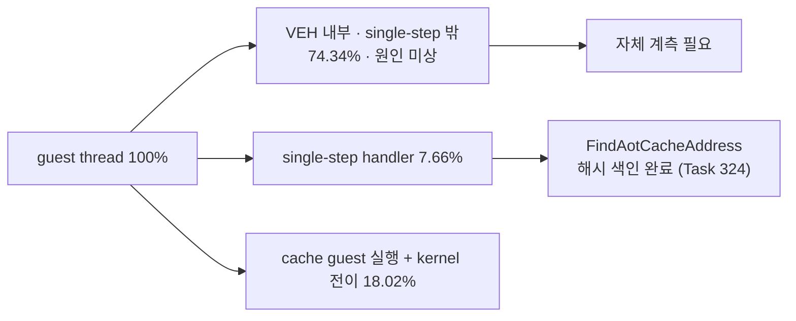

# 현재 실행 frontier / Current execution frontier

과거 전체 기록은 [Task 303까지의 frontier 원문](history/current-execution-frontier-through-task303.md)에
보존합니다. 이 문서는 최근 약 10개 Task와 현재 결정만 유지합니다.

## 현재 최상위 결론 / Active top-level conclusion

**확인됨:** 현재 `aot-dbt`는 독립적인 연속 DBT 실행기가 아니라 `aot-dynamic` 위에서
일부 TF/`INT3` 경로만 정상 host dispatch나 Dr0 span으로 바꾼 정책입니다. Task 276의
동일 시간 progress는 `aot-dynamic 10,709` 대 `aot-dbt 10,685`로 사실상 같았습니다.
Task 287의 progress `+11.86%`는 `aot-dbt` 내부 span OFF/ON 비교이지 backend 간 절대
성능 개선이 아닙니다. 과거 통제 표본에서 legacy가 `aot-dynamic`보다 14.6~20.6배
빨랐다는 사실과 함께 보면 현재 증분 경로는 요구되는 60배 개선 규모에 맞지 않습니다.

Task 308의 실제 검증은 exception-free HLE 가설을 부분 기각했습니다. 정상 host-call
HLE 경계는 60초 동안 exception/legacy fallback 0과 EEPROM 일치를 유지했고
planner-HLE 25,134회를 예외 없이 처리했습니다. 그러나 OFF/ON progress는
`44,977 → 45,716`(+1.64%)뿐이었고, single-step은 `276,680 → 254,889`(-7.88%),
AOT boundary는 `66,245 → 41,224`(-37.77%)였습니다. 또한 직접 interrupt HLE는
INT 8 selector 계약을 바꾸므로 `INT/IRET`는 현재 VEH 경계에 남겨야 합니다.

Task 309의 EIP별 계측은 single-step 횟수만으로 비용을 판단할 수 없음을 확인했습니다.
60초 동안 272,543개 single-step을 모두 기록했으며 HLE는 event의 33.60%지만
`HandleSingleStepTrace` 내부 TSC tick의 84.82%였습니다. cycle 상위 주소는 하나의
계산 loop가 아니라 segment-register move와 port-I/O HLE에 분산됐고 상위 32개
coverage도 67.21%였습니다. 따라서 한 loop를 바로 exception-free generation으로
바꾸는 80% gate는 통과하지 못했습니다.

Task 322의 단계별 귀속은 handler 내부 tick의 74.05%, HLE tick의 75.29%가
`TryResumeAotAfterHandledHle` 한 곳이며 호출당 평균이 `616,079 tick`(2.5GHz 기준 약
246us)임을 확인했습니다. HLE emulate 본체도, 상시 진단 계측(1.32%)도 아닙니다.

다만 Task 322가 그 원인으로 지목한 "동적 번역"은 **기각됐습니다.** 해당 경로는 opt-in
`REPIU_AOT_DBT_POST_HLE_TRANSLATE`가 꺼져 있어 두 실행 모두 `posthle=0/0`이었습니다.
이에 따라 "다음 작업은 로드맵 1단계"라는 결론도 철회합니다. `INT3`를 dispatch stub으로
바꿔도 stub이 호출할 해석 경로가 그대로면 비용은 줄지 않기 때문입니다.

Task 323이 그 미계측 구간을 처음으로 귀속했고, 결과는 지금까지의 방향을
**뒤집습니다.**

| bucket | 전체 wall-clock 대비 |
|---|---:|
| VEH handler 본문 — AOT boundary 경로 | **73.76%** |
| VEH handler 본문 — single-step handler | 12.62% |
| AOT cache 내 guest 실행 (추정) | 약 12.4% |
| Glide gate | 1.29% |
| kernel 예외 전이 (추정) | **1.20%** |
| DOS service / port I/O | 0.15% |

**확인됨:** 예외 전이 비용은 1.20%입니다. TF와 `INT3`를 **전부** 제거해도 상한은 약
**1.012배**입니다. 즉 "TF/VEH를 걷어낸다"는 방향은 현재 병목과 맞지 않습니다.

**확인됨:** 실제 병목은 handler 본문 안의 **O(n) 선형 탐색**입니다.
`kAotResume` 안에서 `FindAotCacheAddress`(`placement.address_map` 선형 스캔)가
87.75%를 차지하며 호출당 평균 `1,047,784 tick`(약 419us)입니다. 같은 함수가
`ResolveAotTransferTarget`을 통해 AOT boundary 경로에서도 호출되므로 73.76% 구간의
주원인일 가능성이 높습니다(미확정).

Task 324가 그 교체를 수행했습니다. 호출당 `1,047,784 → 6,866 tick`(-99.3%),
60초 heartbeat `79,640 → 331,913`(4.17배), progress `8,199 → 21,843`(2.66배)입니다.

**그러나 "AOT boundary 경로도 같은 원인"이라는 가설은 기각됐습니다.** VEH 내부이면서
single-step handler 밖인 구간은 73.76% → **74.34%**로 줄지 않았습니다. 즉 그 구간의
비용은 `FindAotCacheAddress`가 아닌 다른 원인이며, 자체 계측 없이는 알 수 없습니다.

따라서 현재 우선순위는 **VEH 내부 74.34% 구간의 자체 귀속**입니다. 이 구간은 단일
항목으로 전체 wall-clock의 4분의 3을 차지하며, 프로젝트에서 아직 한 번도 내부를
들여다보지 않은 유일한 대형 블록입니다.

**Confirmed:** `aot-dbt` is not yet an independent continuous DBT executor; it layers selective
normal dispatch and Dr0 spans over `aot-dynamic`. Task 276 measured effectively identical
progress, while historical controlled samples found legacy 14.6-20.6x faster than
`aot-dynamic`. Task 308 then removed 25,134 planner-HLE exceptions in a stable 60-second run,
but improved progress only 1.64%; direct interrupt HLE also changed the selector contract.

Task 309 showed why count alone is insufficient. HLE represented 33.60% of 272,543
single-step events but 84.82% of TSC ticks measured inside `HandleSingleStepTrace`. The cycle
hotspots were distributed across segment-register and port-I/O HLE sites, and the top 32
covered 67.21%, below the 80% gate for one exception-free loop.

Task 322 found `TryResumeAotAfterHandledHle` alone holding 74.05% of handler ticks and 75.29%
of HLE ticks, averaging `616,079 ticks` (about 246us at 2.5GHz), rather than the emulation body
or the 1.32% of always-on diagnostics. Its attribution of that cost to dynamic translation is
rejected, however: the path is gated on an opt-in that was off, and both runs recorded
`posthle=0/0`. The conclusion selecting roadmap stage 1 is withdrawn, because a dispatch stub
cannot help while the stub still calls the same resolution path.

Task 323 attributed that residual for the first time and inverted the direction. Of guest
thread wall clock, 73.76% sits in the VEH handler body on the AOT boundary path, 12.62% in
the single-step handler, roughly 12.4% in real guest execution inside the AOT cache, 1.29%
in the Glide gate, and only 1.20% in kernel exception transition. Removing every TF and
`INT3` exception would therefore bound improvement at about 1.012x, so removing TF and VEH
does not address the measured bottleneck.

Task 324 replaced that lookup with a hash index, cutting per-call cost from `1,047,784` to
`6,866` ticks and raising 60-second heartbeat from 79,640 to 331,913 (4.17x) and progress from
8,199 to 21,843 (2.66x). The A/B nevertheless rejected the hypothesis that the AOT boundary
path shared the cause: the share inside the VEH but outside the single-step handler did not
fall, moving from 73.76% to 74.34%. That region has a different, still unknown cause, and
attributing it is the active priority — it is a single block holding three quarters of wall
clock whose interior has never been examined.

## 최근 Task / Recent tasks

### Task 301 — 타이머 pending의 자연 VEH 경계 전달 / Deliver timer pending at natural VEH boundaries

**확인됨:** 강제 TF rendezvous가 서로 다른 guest EIP에서 동일한 unhandled single-step으로
빠져나간 근인이었습니다. poll thread는 pending만 기록하고 기존 guest single-step 경계가
전달합니다. 150초 실행은 강제 arm 0, INT 8 `2,283/2,283`, progress 129,810,
exception/malformed 0으로 정상 timeout했습니다.
[상세 작업 로그](../work-logs/20260726-301-timer-pending-safe-veh-boundary.md)

**Confirmed:** Forced TF arming was removed. Natural guest VEH boundaries delivered all 2,283
pending timer interrupts during a stable 150-second run.

### Task 302 — depth compare gate ABI 안전성 / Depth-compare gate ABI safety

**확인됨:** 약 880초 이후 `_GRDEPTHBUFFERFUNCTION@4(3)` 거부가 stdcall frame을 누수해
후속 low-address AV를 만들었습니다. compare `0..7`을 구현하고 신뢰 가능한 signature의
실패는 ABI-preserving decline으로 반환합니다.
[상세 작업 로그](../work-logs/20260726-302-glide-depth-compare-gate-safety.md)

**Confirmed:** Supporting compare modes 0-7 and preserving the stdcall frame on safe declines
removed the identified gate-leak class.

### Task 303 — Glide 구현 공백 fatal 가시화 / Fatal visibility for Glide gaps

**확인됨:** 미구현 함수와 미지원 인자는 첫 고유 조합에서 `[repiu-fatal]`로 즉시
출력되고 종료 summary에서 반복 count와 함께 다시 출력됩니다. 알려진 stdcall ABI는
`action=continue`, 신뢰 불가능한 ABI만 `action=terminate`입니다.
[상세 작업 로그](../work-logs/20260726-303-glide-implementation-gap-fatal-reporting.md)

**Confirmed:** Glide implementation gaps are explicit fatal-labeled diagnostics. Trusted ABIs
continue execution; only untrusted ABIs terminate.

### Task 304 — native-span 음성 캐시 / Native-span negative cache

**확인됨:** 반복 scan 거절의 99.68~99.69%를 byte-validated cache로 재사용했습니다.
texture milestone 중앙값은 1,031ms 빨라졌지만 후반 progress 중앙값은 `+0.02%`였습니다.
decode 비용은 존재하지만 장기 지배 병목은 예외 횟수라는 결론입니다.
[상세 작업 로그](../work-logs/20260726-304-native-span-negative-cache.md)

**Confirmed:** The cache reuses nearly all repeated scan rejections and improves early texture
milestones, but does not materially change late throughput.

### Task 305 — retired trap 직후 span / Immediate span after retired traps

**확인됨:** opt-in span은 시도의 95.28~95.46%에 성공하고 single-step을 중앙값 2.86%
줄였지만 progress 개선 중앙값은 0.35%뿐이었습니다. 경계까지 pending/trace 상태를
보존해야 정확성이 유지되며 기능은 기본 OFF입니다.
[상세 작업 로그](../work-logs/20260726-305-retired-trap-immediate-span.md)

**Confirmed:** Immediate spans remove some post-trap stepping, but scanner/Dr0 overhead leaves
only a 0.35% median progress gain, so the feature remains opt-in.

### Task 306 — retired trap hotset / Retired-trap hotset

**확인됨:** 60초 profile의 retired trap 7,401회 중 7,293회(98.54%)가 5바이트 미만이고
quarantine 결과였습니다. 상위 두 guest 주소가 64.06%, 상위 16개가 98.24%를
차지했습니다. stable gate는 이 trap을 줄일 수 있지만 전체 성능 예상은 1~3%로 60배
목표와 맞지 않으므로 현재 우선순위에서 제외합니다.
[상세 작업 로그](../work-logs/20260726-306-retired-trap-hotset-profile.md)

**Confirmed:** Short quarantined entries dominate retired traps, but removing this population is
only a local 1-3% candidate and is no longer the active priority.

### Task 307 — current frontier 이력 분리 / Split current-frontier history

**확인됨:** 3,657줄의 과거 frontier 원문을 Task 303까지의 history로 byte-identical
보존하고 current 문서를 최근 10개 Task 중심으로 축약했습니다. 새 결론이 추가될 때
가장 오래된 current 항목을 제거해 약 10개를 유지합니다.
[상세 작업 로그](../work-logs/20260726-307-current-frontier-history-split.md)

**Confirmed:** The complete 3,657-line frontier through Task 303 is preserved byte-for-byte
in history. The current document keeps approximately ten recent task summaries.

### Task 308 — exception-free superblock 검증 / Exception-free superblock validation

**확인됨:** opt-in host-call HLE thunk는 GPR/EFLAGS, x87/MMX/SSE, host stack/TIB
경계를 보존하며 60초 실게임을 exception 0, legacy fallback 0, EEPROM 일치로
완료했습니다. `INT/IRET`를 VEH에 남긴 안전 slice는 25,134 HLE를 직접 처리했지만
progress는 `+1.64%`뿐이어서 5배 go/no-go에 실패했습니다. 직접 interrupt HLE의
selector 불일치도 확인되어 일반 HLE 예외 제거는 다음 성능 아키텍처가 아닙니다.
[상세 작업 로그](../work-logs/20260726-308-exception-free-superblock-validation.md)

**Confirmed:** The safe host-call slice completed 60 seconds with no exception or legacy
fallback and a matching EEPROM while directly handling 25,134 HLE sites. Progress improved
only 1.64%, failing the 5x gate, and direct interrupt HLE violated the established selector
contract.

### Task 309 — single-step hotspot cycle 귀속 / Single-step hotspot cycle attribution

**확인됨:** opt-in 8,192-slot EIP histogram은 60초 실행의 single-step 272,543개를
1,132개 주소로 전부 분류했고 overflow는 0이었습니다. HLE는 event의 33.60%지만
handler TSC tick의 84.82%였습니다. cycle 상위권은 segment-register move와 port-I/O
HLE였고 상위 8개 43.09%, 상위 32개 67.21%로 단일 loop 80% gate에는 미달했습니다.
[상세 작업 로그](../work-logs/20260726-309-single-step-hotspot-cycle-attribution.md)

**Confirmed:** The opt-in 8,192-slot EIP histogram classified all 272,543 steps across 1,132
addresses with no overflow. HLE represented 33.60% of events and 84.82% of handler TSC ticks.
Segment-register and port-I/O HLE dominated the cycle ranking, but the top 32 covered only
67.21%, below the 80% gate for one loop.

### Task 322 — handler 단계별 비용 귀속 / Handler stage attribution

**확인됨:** `HandleSingleStepTrace`를 5개 순차 단계로 나눈 60초 계측은 표본 53,628개,
distinct EIP 717개, overflow 0을 기록했습니다. `kAotResume` 74.05%,
`kHleDispatch` 23.58%, `kPrologueTrace` 1.32%, `kNativeEntry` 0.75%,
`kInterruptInjection` 0.04%, residual 0.27%입니다. 설계가 사전 고정한 gate 첫 행이
성립해 다음 작업은 로드맵 1단계로 확정됐습니다. 진단 계측이 hot path를 지배한다는
가설은 기각됐습니다. profile OFF/ON은 EEPROM hash 일치, fallback/malformed 0이었습니다.
[상세 작업 로그](../work-logs/20260727-322-single-step-handler-stage-attribution.md)

**Confirmed:** Five-stage attribution over 53,628 samples put 74.05% of handler ticks in
`TryResumeAotAfterHandledHle` and only 1.32% in always-on diagnostics, satisfying the
pre-registered gate for roadmap stage 1 and rejecting the instrumentation hypothesis.

### Task 323 — 전체 실행 시간 귀속 / Whole-run execution time attribution

**확인됨:** guest thread wall-clock의 86.38%가 VEH handler 본문이며 예외 전이는
1.20%, Glide gate는 1.29%입니다. `kAotResume` 안에서는 `FindAotCacheAddress` 선형
탐색이 87.75%로, 호출당 `1,047,784 tick`입니다. Part A gate는 성립했고 Part B gate는
전부 기각됐습니다. Task 322의 잘못된 인과 귀속도 함께 정정했습니다.
[상세 작업 로그](../work-logs/20260727-323-whole-run-execution-time-attribution.md)

**Confirmed:** The VEH handler body holds 86.38% of guest-thread wall clock while kernel
exception transition holds 1.20%, rejecting the premise behind TF/VEH removal. The linear
`FindAotCacheAddress` scan holds 87.75% of `kAotResume`.

### Task 324 — AOT cache 주소 해시 색인 / AOT cache address hash index

**확인됨:** `FindAotCacheAddress`를 버킷 체인 해시 색인으로 교체해 호출당
`1,047,784 → 6,866 tick`(-99.3%), heartbeat 4.17배, progress 2.66배를 얻었습니다.
차등 probe가 교체 이전 구현을 oracle로 두고 8개 경계 조건에서 의미 동등성을
검증했습니다. EEPROM 일치, fallback/malformed 0.
[상세 작업 로그](../work-logs/20260727-324-aot-cache-address-hash-index.md)

**기각됨:** AOT boundary 경로가 같은 원인을 공유한다는 가설. 해당 구간은 73.76%에서
74.34%로 줄지 않았습니다.

**Confirmed:** The hash index cut per-call cost 99.3% and raised heartbeat 4.17x and progress
2.66x with verified semantic equivalence. **Rejected:** the AOT boundary path did not share
the cause; its share held at 74.34%.

## 다음 검증 / Next validation

다음 검증은 VEH 내부이면서 single-step handler 밖인 74.34% 구간의 자체 귀속입니다.
`DispatchGuestException` 안에서 AOT boundary 처리, `ResolveAotTransferTarget`,
동적 번역, native span 진입, breakpoint provenance 조회를 구간별로 나눕니다.
Task 322~324가 확립한 방식대로 착수 전에 결과별 다음 행동을 gate로 고정하고,
gate가 전제하는 인과를 함께 명시합니다.

TF/VEH 제거 로드맵은 계속 보류합니다. 예외 전이가 1.20%인 이상 상한이 약 1.012배이며,
Task 324는 구조 변경 없이 자료구조 하나로 2.66배를 얻을 수 있음을 보였습니다.

The next validation attributes the 74.34% that sits inside the VEH but outside the single-step
handler, splitting `DispatchGuestException` into AOT boundary handling,
`ResolveAotTransferTarget`, dynamic translation, native span entry, and breakpoint provenance
lookup. Following the practice established across Tasks 322 to 324, the follow-up action per
outcome is fixed as a gate before measurement, and each gate states the causal premise it
assumes. The TF/VEH removal roadmap stays on hold: a 1.20% transition cost bounds it at roughly
1.012x, and Task 324 showed a single data-structure change worth 2.66x without restructuring.
