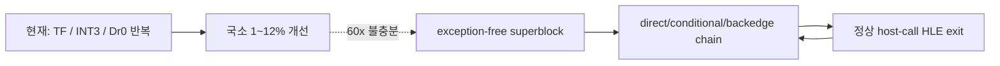

# 현재 실행 frontier / Current execution frontier

과거 전체 기록은 [Task 303까지의 frontier 원문](history/current-execution-frontier-through-task303.md)에
보존합니다. 이 문서는 최근 약 10개 Task와 현재 결정만 유지합니다.

## 현재 최상위 결론 / Active top-level conclusion

**확인됨:** 현재 `aot-dbt`는 독립적인 연속 DBT 실행기가 아니라 `aot-dynamic` 위에서
일부 TF/`INT3` 경로만 정상 host dispatch나 Dr0 span으로 바꾼 정책입니다. Task 276의
동일 시간 progress는 `aot-dynamic 10,709` 대 `aot-dbt 10,685`로 사실상 같았습니다.
Task 287의 progress `+11.86%`는 `aot-dbt` 내부 span OFF/ON 비교이지 backend 간 절대
성능 개선이 아닙니다. 과거 통제 표본에서 legacy가 `aot-dynamic`보다 14.6~20.6배
빨랐다는 사실과 함께 보면 현재 증분 경로는 요구되는 60배 개선 규모에 맞지 않습니다.

다음 작업은 retired trap 같은 1~3% 미세 최적화를 중단하고, 뜨거운 원본 x86 loop를
TF·`INT3`·Dr0 없이 직접 체이닝하는 **exception-free superblock**으로 실행하여
아키텍처의 성능 상한을 검증하는 것입니다. planner, emitter, code cache, SMC generation,
HLE 의미는 재사용하되 steady-state hot loop의 Windows 예외를 99% 이상 제거해야 합니다.

**Confirmed:** `aot-dbt` is not yet an independent continuous DBT executor; it layers selective
normal dispatch and Dr0 spans over `aot-dynamic`. Task 276 measured effectively identical
progress, `10,709` versus `10,685`. Task 287's `+11.86%` was an internal span OFF/ON result,
not an absolute backend comparison. Together with historical controlled samples where legacy
was 14.6-20.6x faster than `aot-dynamic`, incremental exception reductions cannot meet the
required 60x scale. The next task must validate an exception-free superblock that directly
chains a hot original-x86 loop with no TF, `INT3`, or Dr0 in steady state while reusing the
existing planner, emitter, cache, SMC, and HLE foundations.

## 최근 Task / Recent tasks

### Task 297 — 타이머 IF gate와 중첩 방지 / Timer IF gate and nesting prevention

**확인됨:** INT 8 주입은 guest `EFlags.IF`가 0이면 stack/context를 바꾸지 않고 pending
한 건을 유지합니다. 25초 실행은 37회 주입, progress 13,133, Glide 84/84, exception 0,
EEPROM 일치를 기록했고 기존의 지속적인 stack 하강은 재현되지 않았습니다.
[상세 작업 로그](../work-logs/20260726-297-timer-injection-if-gate-nesting.md)

**Confirmed:** IF-clear delivery now preserves one pending tick without mutating guest state.
The 25-second run completed 37 injections with no exception, no monotonic stack descent, and
an unchanged EEPROM.

### Task 298 — orphan breakpoint 증거 캡처 / Orphan-breakpoint evidence capture

**확인됨:** 처리되지 않은 breakpoint는 handler 진입에서 O(1) 원시 상태만 캡처하고,
실제로 fail-closed까지 남은 한 건에만 AOT mapping, provenance, byte/stack window를
보강합니다. 자동 skip이나 EIP/ESP 복구는 하지 않습니다.
[상세 작업 로그](../work-logs/20260726-298-aot-orphan-breakpoint-evidence.md)

**Confirmed:** Unhandled breakpoint evidence is captured without changing handler decisions;
expensive enrichment runs only for the final unconsumed event.

### Task 299 — poll-thread 타이머 frame 쓰기 제거 / Remove poll-thread timer-frame writes

**확인됨:** 사용자 로그의 `ESP-12`는 회수되지 않은 INT 8 IRET frame 하나였습니다.
poll thread의 직접 stack/EIP/CS 변경을 제거하고 guest VEH rendezvous로 옮겼습니다.
45초 실행은 arm/wakeup 3/3, 직접 frame write 0, exception 0을 기록했습니다.
[상세 작업 로그](../work-logs/20260726-299-timer-preemption-veh-rendezvous.md)

**Confirmed:** The leaked 12-byte displacement was one IRET frame. Moving delivery to a guest
VEH rendezvous removed direct cross-thread frame writes and passed the former failure point.

### Task 300 — invalid-EIP probe fail-closed

**확인됨:** 이미 비정상인 guest EIP를 HLE opcode probe가 읽어 2차 host AV를 만들지
않도록 15바이트 decode window와 traced interrupt 2바이트 guard를 추가했습니다. 원래
guest 예외는 추측 복구 없이 보존됩니다.
[상세 작업 로그](../work-logs/20260726-300-guest-instruction-probe-fail-closed.md)

**Confirmed:** Decode-window guards prevent a secondary host AV from masking an already-invalid
guest EIP while preserving the primary exception.

### Task 301 — 타이머 pending의 자연 VEH 경계 전달 / Deliver timer pending at natural VEH boundaries

**확인됨:** 강제 TF rendezvous가 서로 다른 guest EIP에서 동일한 unhandled single-step으로
빠져나간 근인이었습니다. poll thread는 pending만 기록하고 기존 guest single-step 경계가
전달합니다. 150초 실행은 강제 arm 0, INT 8 `2,283/2,283`, progress 129,810,
exception/malformed 0으로 정상 timeout했습니다.
[상세 작업 로그](../work-logs/20260726-301-timer-pending-safe-veh-boundary.md)

**Confirmed:** Forced TF arming was removed. Natural guest VEH boundaries delivered all 2,283
pending timer interrupts during a stable 150-second run.

### Task 302 — depth compare gate ABI 안전성 / Depth-compare gate ABI safety

**확인됨:** 약 880초 이후 `_GRDEPTHBUFFERFUNCTION@4(3)` 거부가 stdcall frame을 누수해
후속 low-address AV를 만들었습니다. compare `0..7`을 구현하고 신뢰 가능한 signature의
실패는 ABI-preserving decline으로 반환합니다.
[상세 작업 로그](../work-logs/20260726-302-glide-depth-compare-gate-safety.md)

**Confirmed:** Supporting compare modes 0-7 and preserving the stdcall frame on safe declines
removed the identified gate-leak class.

### Task 303 — Glide 구현 공백 fatal 가시화 / Fatal visibility for Glide gaps

**확인됨:** 미구현 함수와 미지원 인자는 첫 고유 조합에서 `[repiu-fatal]`로 즉시
출력되고 종료 summary에서 반복 count와 함께 다시 출력됩니다. 알려진 stdcall ABI는
`action=continue`, 신뢰 불가능한 ABI만 `action=terminate`입니다.
[상세 작업 로그](../work-logs/20260726-303-glide-implementation-gap-fatal-reporting.md)

**Confirmed:** Glide implementation gaps are explicit fatal-labeled diagnostics. Trusted ABIs
continue execution; only untrusted ABIs terminate.

### Task 304 — native-span 음성 캐시 / Native-span negative cache

**확인됨:** 반복 scan 거절의 99.68~99.69%를 byte-validated cache로 재사용했습니다.
texture milestone 중앙값은 1,031ms 빨라졌지만 후반 progress 중앙값은 `+0.02%`였습니다.
decode 비용은 존재하지만 장기 지배 병목은 예외 횟수라는 결론입니다.
[상세 작업 로그](../work-logs/20260726-304-native-span-negative-cache.md)

**Confirmed:** The cache reuses nearly all repeated scan rejections and improves early texture
milestones, but does not materially change late throughput.

### Task 305 — retired trap 직후 span / Immediate span after retired traps

**확인됨:** opt-in span은 시도의 95.28~95.46%에 성공하고 single-step을 중앙값 2.86%
줄였지만 progress 개선 중앙값은 0.35%뿐이었습니다. 경계까지 pending/trace 상태를
보존해야 정확성이 유지되며 기능은 기본 OFF입니다.
[상세 작업 로그](../work-logs/20260726-305-retired-trap-immediate-span.md)

**Confirmed:** Immediate spans remove some post-trap stepping, but scanner/Dr0 overhead leaves
only a 0.35% median progress gain, so the feature remains opt-in.

### Task 306 — retired trap hotset / Retired-trap hotset

**확인됨:** 60초 profile의 retired trap 7,401회 중 7,293회(98.54%)가 5바이트 미만이고
quarantine 결과였습니다. 상위 두 guest 주소가 64.06%, 상위 16개가 98.24%를
차지했습니다. stable gate는 이 trap을 줄일 수 있지만 전체 성능 예상은 1~3%로 60배
목표와 맞지 않으므로 현재 우선순위에서 제외합니다.
[상세 작업 로그](../work-logs/20260726-306-retired-trap-hotset-profile.md)

**Confirmed:** Short quarantined entries dominate retired traps, but removing this population is
only a local 1-3% candidate and is no longer the active priority.

## 다음 검증 / Next validation

1. 동일 binary·EEPROM·시간 구간에서 최신 `aot-dynamic`/`aot-dbt` 절대 기준선을 다시
   고정합니다.
2. 반복 unpack/decode loop를 공용 planner가 만든 exception-free superblock으로 실행합니다.
3. loop 내부 direct, conditional, fallthrough와 backward edge를 cache 안에서 체이닝합니다.
4. steady state에서 TF, `INT3`, Dr0를 사용하지 않고 실제 SMC write만 fault로 처리합니다.
5. hot-loop 20배 이상, 전체 60초 progress 5배 이상을 1차 go/no-go로 사용합니다.

Re-establish the absolute backend baseline, then run the repeated unpack/decode loop as a
planner-generated exception-free superblock. Direct, conditional, fallthrough, and backward
edges must remain inside the cache with no TF, `INT3`, or Dr0 in steady state; only real SMC
writes may fault. Require at least a 20x hot-loop gain and a 5x whole-run gain as the first
architecture go/no-go threshold.
