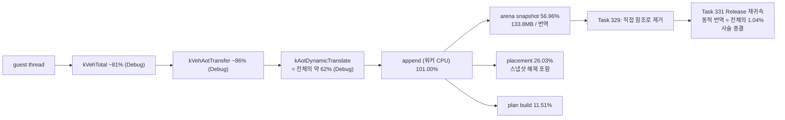
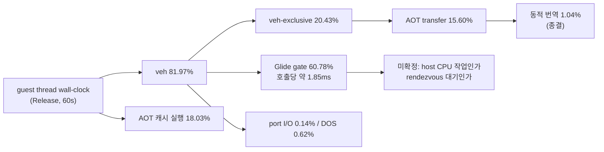
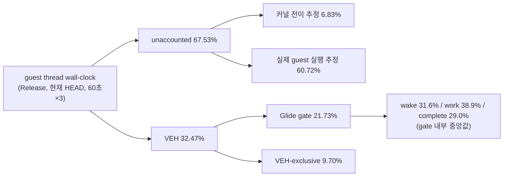

# 현재 실행 frontier / Current execution frontier

과거 전체 기록은 [Task 303까지의 frontier 원문](history/current-execution-frontier-through-task303.md)과
[Task 304~347 항목 원문](history/current-execution-frontier-task304-through-task347.md)에
보존합니다. 이 문서는 최근 약 10개 Task와 현재 결정만 유지합니다.

## 다음 세션 인수인계 / Session handoff

**현재 대기 중인 것: 사용자가 FPS 급락 gameplay 장면을 캡처합니다.**
절차는 [gameplay 장면 캡처 가이드](../guides/gameplay-scene-capture.md)에 있습니다.

### Tasks 364~368에서 확정된 것 한 눈에

| Task | 시도 | 결과 |
|---|---|---|
| 364 | setter 반복률·GL phase 귀속(계측만) | 동일 상태 **90.71%**, 비용은 rendezvous 직후 **첫 GL 접촉** |
| 365 | 동일 상태 rendezvous 생략(구현, 기본 ON) | 정확성 증명, Glide **-5.13%p**, **프레임 변화 없음** |
| 366 | timer tick 전달 개선(기각) | 기본 손실 **11.9%** 확인, 전달률 ↑에 **프레임 -16.4%** |
| 367 | boundary opcode 실명 귀속(계측만) | 최대 인구는 **우리 Glide gate trap 55.21%**, 호출당 예외 1회 |
| 368 | 예외 없는 gate dispatch(구현 안 함) | 상한 **1.034배** → **예외 축 종결** |

### 이 다섯 작업이 함께 말하는 것

**이 장면에서는 비용을 줄여도 프레임이 늘지 않습니다.** 365가 Glide 비용을 5.13%p
줄였는데 프레임이 그대로였고, 366은 예외를 늘리자 프레임이 즉시 줄었으며, 368은 최대
예외 인구를 지워도 1.034배임을 측정으로 확정했습니다.

**남은 덩어리는 gate 본체**입니다 — 호출당 약 235,000 cycle, wall의 18.7%. 365가 그중
rendezvous만 건드렸고, 367이 예외 층이 얇음을 보였으므로, 나머지는 gate가 실제로 하는
일(OpenGL, LFB, ordinal dispatch)입니다.

**그러나 이 장면은 문제의 장면이 아닙니다.** Task 363이 기록한 gameplay 장면은 setter가
wall의 20.59%에 LFB 0회인데, 측정에 쓴 자동 장면은 setter 약 5.6%에 LFB 304회입니다.
**같은 집합이 4배 차이**나므로, 캡처 없이 다음 대상을 고르면 또 틀릴 수 있습니다.

### 캡처가 오면 할 일

1. [캡처 가이드](../guides/gameplay-scene-capture.md) §4 결정 트리로 다음 축을 고릅니다.
2. [생략 검증 가이드](../guides/glide-setter-elision-testing.md)로 Task 365 기본값을
   확정합니다(현재 기본 ON, 미결).
3. 결과에 따라 batch 2 재개 여부, LFB/triangle 분해, 또는 guest 실행 축으로 이동합니다.

### 지금 켜져 있는/꺼져 있는 것

| 환경 변수 | 기본값 | 의미 |
|---|---|---|
| `REPIU_GLIDE_SETTER_ELIDE` | **ON** | 동일 상태 생략(Task 365). `0`으로 복원 |
| `REPIU_GLIDE_SETTER_CENSUS` | OFF | setter 반복률 census(Task 364) |
| `REPIU_GLIDE_SETTER_PHASE` | OFF | GL phase 분해(Task 364) |
| `REPIU_TIMER_TICK_BACKLOG` | OFF | **성능 목적으로 켜지 말 것**(Task 366: -16.4%) |
| `REPIU_AOT_DBT_SUPERBLOCK` | OFF | 렌더링 중단. 예외 없는 dispatch가 여기 묶여 있음 |

timer tick 전달 counter와 boundary opcode census는 **상시 ON**이며 동작을 바꾸지
않습니다.

---

**Handoff:** the user is capturing the gameplay scene where FPS actually collapses;
the procedure is in the [capture guide](../guides/gameplay-scene-capture.md).

Tasks 364-368 established that **cost reduction does not convert into frames in the
scene measured so far**: Task 365 cut the Glide share 5.13 points without moving
frames, Task 366 raised exceptions and immediately lost 16.4%, and Task 368 measured
that erasing the largest exception population buys only 1.034x, closing the exception
axis. What remains is the gate body at roughly 235,000 cycles per call and 18.7% of
wall — the work the gate actually does, since Task 367 showed the exception layer on
top of it is thin.

But the measured scene is not the reported one: state setters held 20.59% of wall
with zero LFB locks in the Task 363 gameplay capture, against about 5.6% with 304 LFB
locks in the automated runs — a fourfold difference from scene composition, which is
why choosing the next axis without the capture risks being wrong again.

When the capture arrives, use the capture guide's decision tree to pick the next
axis, settle the Task 365 elision default with the
[elision testing guide](../guides/glide-setter-elision-testing.md), and from there
either resume batch two, decompose LFB/triangle, or move to the guest-execution axis.

Currently on by default: `REPIU_GLIDE_SETTER_ELIDE` (Task 365 elision; `0` restores),
plus always-on timer-tick and boundary-opcode counters that change no behaviour. Off:
the setter census and GL phase profiles, `REPIU_TIMER_TICK_BACKLOG` (**must not be
enabled for performance** — Task 366 measured -16.4%), and
`REPIU_AOT_DBT_SUPERBLOCK` (breaks rendering, and exception-free dispatch is bolted
to it).

## 현재 최상위 결론 / Active top-level conclusion

**최신 결론(Task 367):** **최대 예외 인구는 guest 명령이 아니라 우리가 만든 Glide gate
trap입니다.** `0F 0B`(UD2)가 boundary 표본의 **55.21%** 이고, 그 횟수는 3회 실행 모두
**Glide gate 진입 횟수와 정확히 일치**했습니다(94,493 / 93,874 / 87,533).
**Glide API 호출 1회당 예외 1회**입니다.

기존 census가 `bytes[0]`만 기록해 최다 항목 `0F`(두 바이트 escape)와 `66`/`26`(prefix)이
명령으로 집계되고 있었고, 상위 인구의 74%가 그렇게 가려져 있었습니다. prefix를
건너뛰고 escape 두 번째 바이트를 기록하자 정체가 드러났습니다.

| 기계 | 표본 대비 | 성격 |
|---|---:|---|
| **Glide gate UD2** | **55.21%** | **우리 구현 — 제거 가능성 있음** |
| segment register move (`8C`/`8E`) | 20.11% | guest 명령 |
| port I/O (`ED`/`EE`/`EF`) | 13.15% | guest 명령 |

**이것이 Task 365를 설명합니다.** 동일 상태 생략은 **host rendezvous만** 없앴고 gate
예외는 그대로 남았습니다. 호출당 남은 비용이 UD2 예외 + VEH dispatch이며 그것이 Glide
호출 비용의 지배분이었습니다. **A1 성립이므로 다음 작업은 Glide gate를 예외 없이
dispatch하는 설계입니다.**

**재계산됨 — Task 336의 상한은 더 이상 유효하지 않습니다.** 당시 VEH 진입
1,307,096회로 전이 27.7~30.4%, 상한 1.38~1.44배였으나 현재 예외는 약 370,000회로
**3.5배 줄었습니다.** 같은 전이 가격이면 전이 총비용은 wall의 약 **6.4%**, 전이만
없앨 때 상한은 약 **1.07배**입니다. 다만 예외 1회의 실제 비용은 VEH handler 본문을
포함하며(Task 347: VEH 전체 32.47%), Task 366의 프레임당 예외 +6.8% → 프레임 -16.4%는
전이 가격만으로 설명되지 않습니다.

**정정됨 — 탄력성 -2.4 인용 철회.** Task 366의 프레임 손실 원인은 예외 횟수가 아니라
safe point 상시 arming이었으므로 두 기전이 섞인 값입니다.
[Task 368 설계 §5.1](../design/20260730-368-exception-free-glide-gate-dispatch.md)의
비용 분해가 대신 답했습니다.

**확인됨(Task 368, 구현 안 함 — 측정으로 확정):** 예외 없는 Glide gate dispatch의
제거 상한은 **wall의 3.25%, 프레임 약 1.034배**입니다. 전이 가격을 세션 변동폭
최상단(+46%)으로 잡아도 4.51%, 1.047배로 사전 등록 **B1(+5%)에 미달합니다.**

VEH 진입부터 gate scope까지를 **새 clock read 없이**(두 scope의 기존 timestamp 차이)
실측한 값이 호출당 **6,523 cycle**입니다. 1단계 추정(34,609)은 **10.6배 과대평가**
였고, 예외당 평균 transfer resolution의 **0.20배**입니다. B1을 넘으려면 2배 이상이
필요했으므로 **이 작업을 살릴 수 있었던 유일한 가정이 정반대로 기각**됐습니다.

**구조적 이유:** Glide 호출 1회에서 gate 본체가 약 235,000 cycle이고 예외로 도달하는
비용(전이 34,521 + prologue 6,523)은 그 위의 얇은 층입니다. 예외를 없애도
rendezvous·OpenGL·ordinal dispatch는 그대로 남습니다.

**따라서 예외 축은 닫힙니다.** 최대 인구(55.21%)를 제거해도 1.034배이므로 나머지 작은
인구는 더 작으며, Task 336 상한 재계산(1.07배)과 일치합니다.

**감사로 남은 사실:** 예외 없는 dispatch 기계(`EmitHleDispatchSlot`)는 이미 존재하나
`REPIU_AOT_DBT_SUPERBLOCK`(렌더링 중단)에 묶여 **독립 평가된 적이 없고**, 켜더라도
`IsHleBoundary`가 UD2를 boundary로 보지 않아 Glide gate엔 적용되지 않습니다.

**선례 주의:** Task 308이 exception-free HLE를 시도해 progress `+1.64%`에 그쳤습니다.
Task 324/334 이전의 훨씬 느린 축이고 지표도 `progress`였으므로 자동 기각하지 않되
사전 등록 gate에 반영합니다.

**미확정:** UD2 예외 1회의 실제 비용 분해. segment/port I/O 인구의 제거 가능성.
safe-point 상시 arming 비용.

[설계](../design/20260730-367-hle-boundary-opcode-attribution.md) /
[작업 지시](../work-orders/20260730-367-hle-boundary-opcode-attribution.md) /
[작업 로그](../work-logs/20260730-367-hle-boundary-opcode-attribution.md)

**Latest conclusion (Task 367):** **The largest exception population is not a guest
instruction but our own Glide gate trap.** `0F 0B` (UD2) is 55.21% of boundary
samples and its count equalled Glide gate entries exactly in all three runs, so
**each Glide API call costs one exception**. The existing census recorded only
`bytes[0]`, so its largest entry was the two-byte escape and its second and fifth
were prefixes, hiding 74% of the leading population. By mechanism the boundary is
the Glide gate trap at 55.21%, segment register moves at 20.11%, and port I/O at
13.15% — 88.5% together.

**This explains Task 365:** elision removed the rendezvous but left the gate
exception, and the UD2 exception plus VEH dispatch was the dominant part of a Glide
call. A1 holds, so an exception-free Glide gate dispatch is the next task.

**Recomputed:** Task 336's bound no longer applies. Exceptions fell 3.5x from
1,307,096 to about 370,000, putting transitions near 6.4% of wall and their removal
at about 1.07x — though the real per-exception cost includes the VEH handler body,
which is why Task 366's 6.8% rise cost 16.4% of frames. The implied elasticity of
-2.4 comes from a single pair with no evidence of linearity, so no number is
promised. **Precedent:** Task 308's exception-free HLE gained only 1.64% on
`progress`, on a far slower axis and a different metric; it informs the gates rather
than rejecting the work.

**이전 결론(Task 366):** **프레임은 timer tick 전달에 gated되지 않습니다.** 전달률을
88.1% → 91.8%로 올리자 프레임이 `1,400 → 1,171`(**-16.36%**)로 **떨어졌습니다**(3회 범위
1,179~1,438 대 1,151~1,175, 겹치지 않음). 프레임당 tick이 8.06~8.67에서 10.17~10.30으로
늘었는데 프레임이 줄었으므로 tick과 프레임의 관계는 **인과가 아니었습니다.**

**확인됨(새 사실):** guest가 프로그램한 timer tick의 **11.9%가 도달하지 않습니다.**
`PitIrqSchedule::Poll`은 밀린 tick 수를 정확히 계산하지만 `timer_interrupt_pending`이
`std::atomic<bool>`이라 due가 3이든 10이든 `INT 8`은 한 번만 전달됩니다. 항등식
`due == injected + coalesced + dropped + remaining`은 6회 전부 정확히 성립했습니다.

**확인됨(회귀의 진짜 원인):** 비싼 것은 tick을 더 주는 것이 아니라 **safe point가 상시
armed 상태로 유지되는 것**입니다. backlog가 남아 있으면 flag가 계속 서서
`ArmAotTimerSafePoint`가 사실상 상시 활성이 되고, timer safe-point trap이 **+20.1%**,
프레임당 예외가 **+6.8%**(308.4 → 329.4) 늘었습니다.

**따라서 다음 축은 예외 횟수입니다.** 두 번은 "비용을 줄여도 프레임이 안 늘었고"
(Task 335·365) 이번에는 "예외를 늘리면 프레임이 줄었습니다". 프레임당 예외 308~331,
Task 336의 TF/`INT3` 제거 상한 1.38~1.44배와 함께 보면 **예외 횟수가 현재 처리량과
직접 연동된 것으로 확인된 유일한 축**입니다.

**해소됨(사용자 관측):** 게임 타이밍의 근거는 **CD 재생 위치**입니다. CD 재생 위치가
없을 때 노트가 아예 움직이지 않는 것이 과거에 관측됐습니다(Task 350의 배경). 따라서
tick 손실 11.9%가 스텝-음악 어긋남의 주원인일 가능성은 낮으며 리듬 정확성 우선순위를
내립니다. `INT 8`이 관여하는 다른 항목(입력 polling 주기, 애니메이션, 내부 timeout)의
영향은 미측정입니다.

**미확정:** safe point 상시 arming의 단독 비용. 무엇이 pacing하는지는 여전히
미해결이며 tick 전달만 후보에서 제외됐습니다.

[설계](../design/20260730-366-timer-tick-delivery-and-frame-pacing.md) /
[작업 지시](../work-orders/20260730-366-timer-tick-delivery-and-frame-pacing.md) /
[작업 로그](../work-logs/20260730-366-timer-tick-delivery-and-frame-pacing.md)

**Previous conclusion (Task 366):** **Frame rate is not gated by timer tick
delivery.** Raising delivery from 88.1% to 91.8% moved median frames from 1,400
to 1,171 (-16.36%), with non-overlapping ranges, while ticks per frame rose from
8.06-8.67 to 10.17-10.30 — so the tick-to-frame relationship was not causal.
Newly confirmed: **11.9% of the timer ticks the guest programmed never reach it**,
because `PitIrqSchedule::Poll` computes the exact owed count but
`timer_interrupt_pending` is a boolean, so an owed count of three or ten still
yields one `INT 8`. The partition identity held exactly in all six runs. The
regression's cause is not the extra interrupts but **holding the safe point
armed**: timer safe-point traps rose 20.1% and exceptions per frame 6.8%. After
two results where cutting cost added no frames and one where adding exceptions
removed them, **exception count is the only axis demonstrably coupled to
throughput today**. Unresolved: whether the tick loss desynchronises steps from
music, what continuous safe-point arming costs on its own, and what actually
paces the run.

**이전 결론(Task 365):** batch 1의 7종 setter에서 rendezvous **41,368회를 제거**해
Glide gate 비중을 `20.76% → 15.63%`(-5.13%p)로 내렸으나 **프레임은 1,215 → 1,206
(-0.74%)으로 변하지 않았습니다.** OFF 3회 범위가 1,215~1,384(13.9%)이므로 편차
안입니다.

**확인됨: 이 장면의 실행은 더 이상 Glide setter 경로에 의해 제한되지 않습니다.**
Task 335가 비용 -3.53%p에 프레임 +5.5%를 얻은 것과 대비되며, 비용 제거가 처리량으로
환산되지 않는 신호가 이제 **두 번** 나왔습니다.

**귀속:** Glide gate는 중앙값 `33.81G → 25.46G cycle`로 8.35G(약 3.1초) 줄었고 예외
횟수는 늘지 않았으므로(프레임당 324.7~335.2 대 327.6~330.9) 해방된 시간은 AOT 캐시 내
guest 실행으로 갔습니다. timer safe-point trap은 프레임당 `4.80 → 5.25`(+9.4%)로
늘었습니다. **guest가 그 시간을 busy-wait에서 소비했습니다.**

**방법 규칙 추가(중요):** Task 347 축은 세션마다 예외 전이 가격을 새로 측정하며 그
값이 **최대 46% 흔들립니다**(`INT3` 28,154 대 41,033). 따라서 **서로 다른 task347
호출에서 나온 커널/guest 파생 축은 비교하지 않습니다.** 비교 가능한 것은 직접
측정값(Glide cycle, 예외 횟수, 프레임)입니다. 초기 Task 365 기록의 "커널 전이
7.26% → 10.08%"는 이 artifact였고 정정했습니다.

**다음 우선순위는 "무엇이 pacing하는가"입니다(Task 366).** 같은 실행에서 `INT 8`
전달은 198.5~208.5Hz인데 guest가 프로그램한 divisor 4972는 **240Hz**입니다. 프레임당
tick은 6회 중 5회가 9.88~10.25로 좁고, tick rate 최고 실행(208.5Hz)이 프레임도
최고였습니다(1,384). Task 366 triangle batching은 보류하고 pacing 귀속을 먼저 합니다.

**확인됨(정확성):** 순수 관측자인 census가 센 중복과 실제 생략이 ordinal 단위·합계
모두 **정확히 일치**했습니다(예: `grColorMask` 7,458/7,458, 3회 실행 합계
41,368/41,368 등). 렌더 시퀀스도 phase offset +1에서 **72.9%가 통계 완전 일치**하여
같은 프레임을 한 프레임 먼저 그린다는 것이 확인됐습니다.

**확인됨(호출 구조):** 게임은 60초에 이 7종을 41,384회 호출해 상태를 **16번** 바꿉니다
(약 2,586:1). `applied=16`은 3회 실행 모두 동일했습니다.

**미확정:** 무엇이 pacing하는지. 커널 전이 추정이 2.8%p 오른 이유. LFB 없는 gameplay
장면(Task 363 기준 setter가 Glide의 85.33%)에서의 이득.

**이전 결론(Task 364):** 상태 setter 호출의 **90.71%가 직전 성공 적용과 정확히 같은
상태**입니다(동일 바이너리 Release 60초 3회, 범위 90.65~90.72%). census 대상 20종 중
13종이 99%를 넘고, 최다 호출 `grColorMask`는 99.95%(최대 연속 6,158회)입니다.
`grDepthMask`는 오히려 낮은 쪽인 72.63%이고, 최저는 `grTexSource` 32.24%입니다.
동일 상태 생략의 실측 상한은 **wall의 4.55%, Glide gate의 25.11%** 입니다.

**확인됨(방향을 바꾸는 발견):** `grDepthMask`의 host work는 `glGetError`가 아니라
**rendezvous 기상 직후의 첫 GL 접촉**입니다. `glDepthMask`가 GL 구간의 84.59%,
후속 `glGetError`가 15.41%입니다. `grAlphaBlendFunction`은 선행 drain loop가
**반복 0회**인데도 GL 구간의 30.66%이고 같은 함수의 후속 `glGetError`는 2.21%뿐입니다.
즉 같은 호출이 위치에 따라 약 14배 차이가 나며, 어느 호출이 먼저 오든 그 호출이
비용을 흡수합니다. **따라서 `glGetError` 제거는 답이 아니고, Task 365의 rendezvous
생략이 이 first-touch 비용을 통째로 없앱니다.**

**이전 기준(Task 363):** 2026-07-30 Release 실게임 profile에서는 Glide 호출
403,904회와 `grBufferSwap` 1,287회가 약 47.5초 동안 완료됐습니다. 전체 Glide gate는
wall-clock의 24.14%이고, 주요 상태 설정 18종은 프레임당 약 235.7회 호출되어
wall-clock의 20.59%, Glide gate의 85.33%를 차지합니다.

`grDepthMask`가 단독으로 Glide의 34.40%, wall의 8.30%이며 backend 시간의 94.3%가
host work입니다. `grDrawTriangle`은 Glide의 11.23%, wall의 2.71%이지만 backend
시간의 94.1%가 삼각형별 동기 handoff입니다. `grAlphaBlendFunction`은 Glide의
9.26%, wall의 2.24%입니다.

**주의(Task 364에서 확인된 장면 의존성):** wall 기준 setter 비중은 장면에 크게
좌우됩니다. Task 364의 부팅 포함 60초 실행은 `grLfbLock` 304회를 포함해 그 gate가
Glide를 지배하며, 같은 setter 집합이 wall의 약 5.57%뿐입니다. Task 363의 LFB 없는
gameplay 장면에서는 20.59%였습니다. **Glide gate 대비 값이 장면 간 비교에 쓸 수 있는
축입니다.**

반면 같은 실행에서 `grBufferSwap`은 wall의 0.24%, SDL present는 0.17%뿐이고
`grLfbLock` 호출은 없습니다. texture download도 63회, wall 약 0.07%입니다.
따라서 Task 354/355의 과거 LFB 우선순위는 이번 장면에 적용하지 않습니다. 상태
반복률과 `grDepthMask` 내부 귀속은 **Task 364에서 완료**됐으므로 현재 순서는
**성공한 동일 상태의 보수적 생략(Task 365) → 필요할 때만 triangle batching(366) →
전체 축 재귀속(367)** 입니다.

**Previous conclusion (Task 365):** Eliding 41,368 host rendezvous across the
seven batch-one setters cut the Glide gate share from 20.76% to 15.63% (-5.13
points) while median frames stayed flat at 1,215 to 1,206 (-0.74%), inside the
elide-off range of 1,215-1,384. **Execution in this scene is no longer limited
by the Glide setter path.** Against Task 335, where a 3.53-point cost reduction
produced 5.5% more frames, this is the second independent signal that cost
removal is not converting into throughput. The Glide gate fell from a median
33.81G to 25.46G cycles (about 3.1 seconds) without the exception count rising
(324.7-335.2 against 327.6-330.9 per frame), so the freed time went into guest
execution — where timer safe-point traps rose from 4.80 to 5.25 per frame. The
guest spent it busy-waiting.

**Method rule:** the Task 347 axis recalibrates the exception-transition price
every session and that price varies by up to 46% (`INT3` 28,154 against 41,033),
so **derived kernel and guest shares from different task347 invocations are not
comparable** — only directly measured quantities are. The first Task 365 write-up
reported a kernel rise from 7.26% to 10.08%; that was this artifact and has been
corrected.

Attributing what paces the run is therefore the next priority (Task 366). In the
same runs `INT 8` was delivered at 198.5-208.5 Hz while the guest programmed
divisor 4972, which is 240 Hz, and ticks per frame sat in a tight 9.88-10.25 band
in five of six runs with the highest-tick-rate run also producing the most
frames. Task 366's triangle batching is deferred behind this.

Correctness was proven unusually tightly: the pure-observer census and the
actual elision agreed exactly, per ordinal and in aggregate, across all three
runs (`grColorMask` 7,458/7,458; run totals 41,368/41,368 and so on), and the
rendered sequence matched at 72.9% exact statistic identity under a one-frame
phase offset — the same frames drawn one frame sooner. The game issues 41,384
calls to these seven setters per 60 seconds in order to change state 16 times,
about 2,586 to 1, with `applied` reading exactly 16 in every run.
**Unresolved:** what paces the run, why the kernel estimate rose 2.8 points, and
the gain in an LFB-free gameplay scene where Task 363 put setters at 85.33% of
the Glide gate.

**Previous conclusion (Task 364):** 90.71% of state-setter calls exactly repeat
the previously applied state across three 60-second same-binary Release runs
(range 90.65-90.72%), with thirteen of twenty census setters above 99% and
`grColorMask` at 99.95% over a longest run of 6,158. `grDepthMask` is on the
low side at 72.63% and `grTexSource` lowest at 32.24%. The measured elision
ceiling is 4.55% of wall time and 25.11% of the Glide gate.

The depth-mask host work is not `glGetError`: `glDepthMask` holds 84.59% of the
OpenGL interval against 15.41% for the trailing check, and the alpha-blend
drain loop holds 30.66% while iterating zero times, against 2.21% for the
identical call later in the same function. The dominant cost is therefore the
first GL touch after the rendezvous wake, whichever call is first — so removing
`glGetError` is not the answer, and Task 365's rendezvous elision removes that
first-touch cost outright.

Wall-relative setter shares are strongly scene-dependent: Task 364's
boot-inclusive run includes 304 `grLfbLock` calls whose gate dominates Glide,
putting the same setter set at about 5.57% of wall against 20.59% in the Task
363 capture. The gate-relative figure is the one comparable across scenes.

**Previous baseline (Task 363):** The 2026-07-30 Release gameplay profile
completed 403,904 Glide calls and 1,287 swaps in about 47.5 seconds. Glide
held 24.14% of wall time. Eighteen major state setters issued about 235.7
calls per frame and held 20.59% of wall time, or 85.33% of the Glide gate.
`grDepthMask` alone held 34.40% of Glide and 8.30% of wall time;
`grDrawTriangle` held 11.23% and 2.71%, with 94.1% of its backend interval in
per-triangle handoff; and `grAlphaBlendFunction` held 9.26% and 2.24%.

The same run spent only 0.24% of wall time in `grBufferSwap`, made no
`grLfbLock` calls, and spent about 0.07% on 63 texture downloads. The active
order is therefore setter repetition/phase attribution, conservative
successful-state elision, triangle batching only if still justified, and
whole-axis re-attribution.

**확인됨:** 현재 `aot-dbt`는 독립적인 연속 DBT 실행기가 아니라 `aot-dynamic` 위에서
일부 TF/`INT3` 경로만 정상 host dispatch나 Dr0 span으로 바꾼 정책입니다. Task 276의
동일 시간 progress는 `aot-dynamic 10,709` 대 `aot-dbt 10,685`로 사실상 같았습니다.
Task 287의 progress `+11.86%`는 `aot-dbt` 내부 span OFF/ON 비교이지 backend 간 절대
성능 개선이 아닙니다. 과거 통제 표본에서 legacy가 `aot-dynamic`보다 14.6~20.6배
빨랐다는 사실과 함께 보면 현재 증분 경로는 요구되는 60배 개선 규모에 맞지 않습니다.

Task 308의 실제 검증은 exception-free HLE 가설을 부분 기각했습니다. 정상 host-call
HLE 경계는 60초 동안 exception/legacy fallback 0과 EEPROM 일치를 유지했고
planner-HLE 25,134회를 예외 없이 처리했습니다. 그러나 OFF/ON progress는
`44,977 → 45,716`(+1.64%)뿐이었고, single-step은 `276,680 → 254,889`(-7.88%),
AOT boundary는 `66,245 → 41,224`(-37.77%)였습니다. 또한 직접 interrupt HLE는
INT 8 selector 계약을 바꾸므로 `INT/IRET`는 현재 VEH 경계에 남겨야 합니다.

Task 309의 EIP별 계측은 single-step 횟수만으로 비용을 판단할 수 없음을 확인했습니다.
60초 동안 272,543개 single-step을 모두 기록했으며 HLE는 event의 33.60%지만
`HandleSingleStepTrace` 내부 TSC tick의 84.82%였습니다. cycle 상위 주소는 하나의
계산 loop가 아니라 segment-register move와 port-I/O HLE에 분산됐고 상위 32개
coverage도 67.21%였습니다. 따라서 한 loop를 바로 exception-free generation으로
바꾸는 80% gate는 통과하지 못했습니다.

Task 322의 단계별 귀속은 handler 내부 tick의 74.05%, HLE tick의 75.29%가
`TryResumeAotAfterHandledHle` 한 곳이며 호출당 평균이 `616,079 tick`(2.5GHz 기준 약
246us)임을 확인했습니다. HLE emulate 본체도, 상시 진단 계측(1.32%)도 아닙니다.

다만 Task 322가 그 원인으로 지목한 "동적 번역"은 **기각됐습니다.** 해당 경로는 opt-in
`REPIU_AOT_DBT_POST_HLE_TRANSLATE`가 꺼져 있어 두 실행 모두 `posthle=0/0`이었습니다.
이에 따라 "다음 작업은 로드맵 1단계"라는 결론도 철회합니다. `INT3`를 dispatch stub으로
바꿔도 stub이 호출할 해석 경로가 그대로면 비용은 줄지 않기 때문입니다.

Task 323이 그 미계측 구간을 처음으로 귀속했고, 결과는 지금까지의 방향을
**뒤집습니다.**

| bucket | 전체 wall-clock 대비 |
|---|---:|
| VEH handler 본문 — AOT boundary 경로 | **73.76%** |
| VEH handler 본문 — single-step handler | 12.62% |
| AOT cache 내 guest 실행 (추정) | 약 12.4% |
| Glide gate | 1.29% |
| kernel 예외 전이 (추정) | **1.20%** |
| DOS service / port I/O | 0.15% |

**확인됨(당시):** 예외 전이 비용은 1.20%입니다. TF와 `INT3`를 **전부** 제거해도 상한은
약 **1.012배**입니다. 즉 "TF/VEH를 걷어낸다"는 방향은 당시 병목과 맞지 않았습니다.
**→ Task 336에서 뒤집혔습니다.** 전이 1회 가격은 그대로지만 예외 횟수가 늘어(같은
60초에 VEH 진입 1,307,096회) 지금은 전체의 **27.7~30.4%** 이며 상한은 약 1.4배입니다.

**확인됨:** 실제 병목은 handler 본문 안의 **O(n) 선형 탐색**입니다.
`kAotResume` 안에서 `FindAotCacheAddress`(`placement.address_map` 선형 스캔)가
87.75%를 차지하며 호출당 평균 `1,047,784 tick`(약 419us)입니다. 같은 함수가
`ResolveAotTransferTarget`을 통해 AOT boundary 경로에서도 호출되므로 73.76% 구간의
주원인일 가능성이 높습니다(미확정).

Task 324가 그 교체를 수행했습니다. 호출당 `1,047,784 → 6,866 tick`(-99.3%),
60초 heartbeat `79,640 → 331,913`(4.17배), progress `8,199 → 21,843`(2.66배)입니다.

**그러나 "AOT boundary 경로도 같은 원인"이라는 가설은 기각됐습니다.** VEH 내부이면서
single-step handler 밖인 구간은 73.76% → **74.34%**로 줄지 않았습니다. 즉 그 구간의
비용은 `FindAotCacheAddress`가 아닌 다른 원인이며, 자체 계측 없이는 알 수 없습니다.

Task 325가 그 구간을 귀속했고 정체가 확정됐습니다. **AOT transfer 해석부
(`HandleAotGuestCodeWrite{Completion,Fault}`, `HandleAotReentry`,
`HandleAotIndirectTransfer`, `HandleAotConditionalTransfer`,
`HandleAotReturnTransfer`)가 VEH 내부의 87.50%, 전체 wall-clock의 71.31%** 이며
호출당 평균은 `1,269,368 tick`(약 508us)입니다.

다른 후보는 모두 기각됐습니다. live telemetry의 `InterlockedExchange` 9회 0.08%,
single-step 이후 HLE 핸들러 체인 0.66%, prologue 검증 0.25%, boundary gate 0.11%,
파생 residual 1.01%입니다. residual이 작다는 것은 분해 경계가 옳았다는 뜻입니다.

Task 326이 그 재분해를 수행했고 답이 나왔습니다. **60초 동안 단 230회의 동적 번역이
전체 wall-clock의 61.6%를 소비합니다.** 호출당 약 **175ms**입니다.

| function 축 | count | `kVehAotTransfer` 대비 | 호출당 tick |
|---|---:|---:|---:|
| **`kAotDynamicTranslate`** | **230** | **88.64%** | **437,403,007** |
| `kAotTransferResolve` | 39,033 | 89.27% | 2,595,663 |
| `kAotResidency` | 55,507 | 1.61% | 32,865 |
| `kAotHleBoundaryScan` | 253,526 | 0.05% | 243 |

Task 325가 미검증 가설로 남긴 `AccumulateAotResidency`(1.61%)와
`IsAotHleBoundaryAddress` 선형 탐색(0.05%)은 **모두 기각**됐습니다. transfer 해석
자체는 싸고 **번역 대기만 비쌉니다.**

**확인됨:** `RequestAotDynamicTranslation`은 워커 스레드에 `SetEvent` 후
`WaitForSingleObject(INFINITE)`로 동기 대기합니다. 즉 측정된 175ms는 guest thread가
**차단된 시간**이며 실제 작업은 계측 범위 밖인 워커 스레드에 있습니다.

Task 327이 워커 스레드를 계측해 그 질문에 답했습니다. **스케줄링 지연이 아니라
워커 CPU 작업입니다.**

| rendezvous 구간 | `guest_total` 대비 |
|---|---:|
| **`append`** (`AppendWin32DynamicAotTranslation`) | **101.00%** |
| `wake_latency` | 0.03% |
| `complete_latency` | 0.01% |
| `segment_table` | 0.00% |

번역 1회 평균은 약 **259ms**, 최댓값은 약 **702ms** 입니다. 워커 기상 지연은 2코어에
5개 스레드가 경합함에도 평균 약 76us, 최대 3.4ms에 그칩니다.

**확인됨:** rendezvous 제거나 비동기화는 답이 아닙니다. **번역 자체를 싸게 또는 작게
만들어야 합니다.**

Task 328이 `append` 내부를 다섯 단계로 나눴고 원인이 확정됐습니다.

| 단계 | `append` 대비 | 회당 |
|---|---:|---:|
| **`arena_snapshot`** | **56.96%** | 약 162ms |
| `placement` | 26.03% | 약 74ms |
| `plan_build` | 11.51% | 약 33ms |
| `image_emit` | 5.04% | 약 14ms |
| `validate` | 0.44% | — |

**확인됨:** `AppendWin32DynamicAotTranslation`은 진입 즉시 **guest arena 전체
(133.8MB)를 zero-fill 후 복사**합니다. 번역 1회는 평균 명령 1,039개를 다루고
7,830바이트를 emit하는데, 그 위해 140,341,248바이트를 복사합니다 — emit 대비
**17,924배**입니다. 60초 동안 스냅샷으로만 약 19.5GB를 복사했습니다.

**확인됨:** **번역 단위 축소는 역효과**입니다. 단위를 줄이면 번역 횟수가 늘고
스냅샷 133.8MB는 매번 고정이므로 총 비용이 커집니다. 고칠 대상은 단위가 아니라
스냅샷 범위입니다.

**확인됨:** 이 비용만은 **Debug 왜곡이 아닙니다.** zero-fill·`ReadProcessMemory`·해제는
메모리 대역폭과 syscall 비용이라 최적화 수준과 무관합니다.

**귀속 주의:** `placement` 26.03%에는 같은 133.8MB 버퍼의 해제가 포함됩니다(소멸 순서
때문이며 측정 전에 문서화). 따라서 스냅샷 생애주기 전체는 **57~83%** 구간으로만
말할 수 있습니다.

**미확정:** `placement` 내부에서 스냅샷 해제와 실제 placement 작업의 비중.
`plan_build`의 명령당 약 32us도 Zydis decode치고는 큽니다. 비translate 워커 작업
4,480회의 rendezvous 비용도 아직 재지 않았습니다.

Task 329가 그 스냅샷을 제거했습니다. 측정 사슬은 여기서 끝나고 **구현으로 전환**했습니다.
선행 조건이던 "guest 외 스레드의 arena 쓰기"는 감사로 **없음이 확인**되어 설계
**옵션 1(live arena 직접 참조)** 을 그대로 채택했고, 번역 1회의 zero-fill·복사·해제
140,341,248바이트가 **모두 사라졌습니다.**

**확인됨:** 보이는 범위가 133.8MB 그대로이므로 plan은 바이트 단위로 보존됩니다.
소유 복사본을 oracle로 둔 차등 probe가 plan 스칼라 전 필드, block/instruction
스트림(원본 바이트 포함), emit 이미지의 `bytes`·`address_map`·`fixups` 일치를
확인했습니다.

**확인됨:** 60초 실측에서 번역 1회당 append 비용이 `710,135,523 → 67,367,429 tick`
(**-90.5%, 10.5배**)입니다. 단계별 회당 변화는 다음과 같습니다.

| 단계 | Task 328 회당 | Task 329 회당 | 변화 |
|---|---:|---:|---:|
| **`arena_snapshot`** | 404,524,860 | **7,970** | **-99.998%** |
| `placement` | 184,814,412 | 26,839,702 | -85.5% |
| `plan_build` | 81,728,912 | 26,907,556 | -67.1% |
| `image_emit` | 35,797,624 | 12,806,455 | -64.2% |
| `validate` | 3,089,728 | 772,181 | -75.0% |

**확인됨:** Task 328의 귀속 주의가 옳았습니다. `placement`가 85.5% 줄었으므로 그
26.03%의 대부분이 133.8MB 해제였고, 스냅샷 생애주기 전체는 append의 **약 79%**
(예측 구간 `57~83%`의 상단)였습니다. `kAotDynamicTranslate`는 AOT transfer function
축의 88.64% → **26.44%** 입니다. 정상 timeout, malformed 0, EEPROM `A1FC1D...52570`
일치.

**미확정:** `plan_build`·`image_emit`·`validate`가 함께 64~75% 싸진 이유는 측정하지
않았습니다(메모리 압력 감소가 유력하나 추정). progress `9,293 → 62,566`,
heartbeat 784,320은 단일 표본이며 실행 간 편차가 커 배수는 확정하지 않습니다.

**Confirmed:** `aot-dbt` is not yet an independent continuous DBT executor; it layers selective
normal dispatch and Dr0 spans over `aot-dynamic`. Task 276 measured effectively identical
progress, while historical controlled samples found legacy 14.6-20.6x faster than
`aot-dynamic`. Task 308 then removed 25,134 planner-HLE exceptions in a stable 60-second run,
but improved progress only 1.64%; direct interrupt HLE also changed the selector contract.

Task 309 showed why count alone is insufficient. HLE represented 33.60% of 272,543
single-step events but 84.82% of TSC ticks measured inside `HandleSingleStepTrace`. The cycle
hotspots were distributed across segment-register and port-I/O HLE sites, and the top 32
covered 67.21%, below the 80% gate for one exception-free loop.

Task 322 found `TryResumeAotAfterHandledHle` alone holding 74.05% of handler ticks and 75.29%
of HLE ticks, averaging `616,079 ticks` (about 246us at 2.5GHz), rather than the emulation body
or the 1.32% of always-on diagnostics. Its attribution of that cost to dynamic translation is
rejected, however: the path is gated on an opt-in that was off, and both runs recorded
`posthle=0/0`. The conclusion selecting roadmap stage 1 is withdrawn, because a dispatch stub
cannot help while the stub still calls the same resolution path.

Task 323 attributed that residual for the first time and inverted the direction. Of guest
thread wall clock, 73.76% sits in the VEH handler body on the AOT boundary path, 12.62% in
the single-step handler, roughly 12.4% in real guest execution inside the AOT cache, 1.29%
in the Glide gate, and only 1.20% in kernel exception transition. Removing every TF and
`INT3` exception would therefore bound improvement at about 1.012x, so removing TF and VEH
did not address the bottleneck of that era. Task 336 overturned this: the per-transition price is
unchanged, but the exception count is not, and the same 60 seconds now takes 1,307,096 VEH entries,
putting transitions at 27.7-30.4% of wall clock and the bound at about 1.4x.

Task 324 replaced that lookup with a hash index, cutting per-call cost from `1,047,784` to
`6,866` ticks and raising 60-second heartbeat from 79,640 to 331,913 (4.17x) and progress from
8,199 to 21,843 (2.66x). The A/B nevertheless rejected the hypothesis that the AOT boundary
path shared the cause: the share inside the VEH but outside the single-step handler did not
fall, moving from 73.76% to 74.34%. That region has a different, still unknown cause, and
attributing it is the active priority — it is a single block holding three quarters of wall
clock whose interior has never been examined.

Task 325 then attributed that block. AOT transfer resolution holds 87.50% of time inside the
VEH and 71.31% of guest-thread wall clock, averaging `1,269,368` ticks per call. Every other
candidate is rejected: telemetry writes 0.08%, the post-single-step HLE chain 0.66%, prologue
validation 0.25%, boundary gates 0.11%, and a derived residual of 1.01% confirming the
decomposition boundaries were correct. The active priority is decomposing `kVehAotTransfer`
itself; code reading suggests `AccumulateAotResidency` (a statistics-only function that
re-initializes a Zydis decoder and decodes up to 64 instructions per re-entry), the linear
`IsAotHleBoundaryAddress` scan at the head of `ResolveAotTransferTarget`, and dynamic
translation, but all three remain unverified hypotheses.

Task 326 then decomposed it: 230 dynamic translations consume 61.6% of wall clock at about
175ms each, while transfer resolution itself is cheap. The Task 325 hypotheses are both
rejected — `AccumulateAotResidency` at 1.61% and the linear `IsAotHleBoundaryAddress` scan at
0.05%. `RequestAotDynamicTranslation` signals a worker thread and blocks in
`WaitForSingleObject(INFINITE)`, so the measured time is guest-thread blocked time and the work
itself sits on a worker thread outside the instrumented scope. Whether those 175ms are worker
CPU or scheduling latency on this two-core machine is unresolved, and the remedies differ
completely.

Task 327 then instrumented the worker thread and answered it: the time is worker CPU work, not
scheduling. `AppendWin32DynamicAotTranslation` accounts for essentially the whole rendezvous
while wake and completion latency together account for 0.04%, even with five threads on two
cores. One translation averages about 259ms and peaks near 702ms. Removing or asynchronizing
the rendezvous is therefore not the answer; translation itself must become cheaper or smaller.

Task 328 then split `append` five ways and identified the cause. `AppendWin32DynamicAotTranslation`
zero-fills and copies the entire 133.8MB guest arena on entry, taking 56.96% of the append, while
one translation covers only 1,039 instructions and emits 7,830 bytes — 17,924 times less than it
copies. Shrinking the translation unit would therefore be counterproductive, since the 133.8MB
snapshot is fixed per translation. Unlike the rest of this chain, that cost is not a Debug
artifact: zero-fill, `ReadProcessMemory`, and deallocation are bandwidth and syscall costs.

Task 329 removed that snapshot, ending the measurement chain and moving to implementation. Its
prerequisite — whether any thread other than the guest writes into the arena — was audited and
answered no, so design Option 1 was adopted unchanged and the entire 140,341,248-byte zero-fill,
copy, and free per translation is gone. Because the visible range is still the whole 133.8MB, the
plan is preserved byte for byte, verified by a differential probe that treats the owning copy as
the oracle across every plan scalar, the block and instruction streams including original bytes,
and the emitted image. No performance number is claimed yet: the 60-second in-game A/B has not
been run, and it is also what will finally separate the snapshot's deallocation from real
placement work inside the 26.03%.

Task 331이 그 사슬을 Release에서 재귀속했고 **대상이 사라졌습니다.** 실게임 평균
크기 환산으로 append 1회는 `65,371,802`(Debug) 대 `5,849,960 tick`(Release)이며,
Release에서는 어느 단계도 50%에 이르지 못합니다(`plan_build` 43.55%,
`placement` 27.61%, `image_emit` 24.55%). Debug 환산값이 Task 329의 실게임 측정
`67,367,429`과 3.0% 차이여서 이 환산은 대표성이 있습니다.

**모든 성능 수치에는 이제 구성을 명시합니다.** 위 표들 중 Task 322~329의 값은
**Debug 기준**이며, 단계 순위형 결론은 Release에서 뒤집힐 수 있습니다.



아래 Task 331 축은 **Task 348/349 이전의 역사적 기준**입니다. 현재 축은 Task 347이
다시 측정했습니다.



Task 347은 Task 348 타이머 safe point와 Task 349의 원본 240Hz PIT cadence까지 포함한
현재 HEAD를 Release 60초 3회로 다시 측정했습니다.

| bucket | 중앙값 | 3회 범위 |
|---|---:|---:|
| **실제 guest 실행 추정** | **60.72%** | 60.61~61.25% |
| Glide gate | **21.73%** | 21.71~21.91% |
| VEH-exclusive | 9.70% | 9.26~9.79% |
| **커널 예외 전이 추정** | **6.83%** | 6.74~6.92% |



**확인됨:** G2(guest 실행 추정 >= 60%)와 G3(Glide >= 20%)가 동시에 성립하지만,
큰 축은 guest 실행입니다. 세 실행 모두 TF run은 전부 길이 1이고 최대값도 1이므로
Task 337의 5~8 mode와 33+ 꼬리는 사라졌습니다. 다음 작업은 AOT 캐시 안의 60.72%가
실제 유효 연산인지, Task 349의 240Hz tick을 기다리는 guest busy-wait/pacing인지
주소·phase별로 나누는 것입니다. 이미 원본 명령을 host CPU가 직접 실행하는 구간이므로
측정 없이 “번역 품질” 최적화로 바로 가지 않습니다.

`span-unsafe`는 현재 복귀 시도의 21.90%지만 긴 TF walk를 만들지 않고, 커널 전이
전체도 6.83%뿐입니다. 따라서 복귀 거절 **비율만으로** 다음 대상으로 삼지 않습니다.
Task 348 safe-point trap은 breakpoint의 2.83%이며 지배 인구가 아닙니다.

## 최근 Task / Recent tasks


### Task 351 — AOT timer source 귀속 / AOT timer-source attribution

**확인됨:** guest thread를 정지하지 않고 기존 240Hz AOT timer safe point가 실제로
소비한 PIT tick을 원본 back-edge source별로 기록했습니다. Release 60초 세 번의
프레임은 `1,114` 중앙값(1,111~1,123), source entry는 실행별 94~106개, overflow는
모두 0이었습니다. profile-on 프레임 중앙값은 Task 347의 1,124보다 0.89% 낮지만
기존 범위 1,112~1,141 안에 있어 관찰자 교란은 작습니다.

전체 safe-point 귀속 tick 중앙값은 5,658개, 주기 환산 23.575초(39.29%)입니다.
그러나 이 값은 **인터럽트가 전달된 back edge의 합이지 pacing 시간이 아닙니다.**
정적 tick 의존성까지 확인된 source는 하나뿐입니다.

```text
0x0303DE81  call 0x0304318F  ; ISR이 증가시키는 0x032D9C80 읽기
0x0303DE86  cmp eax, 2
0x0303DE89  jl  0x0303DE81
```

원본 INT 8 ISR은 `0x03042F3C`에서 이 전역을 증가시킵니다. 이 source의 귀속 tick은
1,414/1,416/1,430개, 중앙값 1,416개로 `5.900초`, wall-clock의 **9.83%**입니다.
tick interval 일부에 loop 진입 전 유효 작업이 있을 수 있으므로 이는 timer pacing의
**상한**입니다. Task 347의 guest 실행 유도값 60.72% 가운데 최대 16.19%에 해당하며,
차감 뒤 **50.89%p**는 active/unresolved guest 실행의 보수적 잔여입니다. 이 잔여를
전부 active work라고 확정하지는 않습니다.

Task 348에서 정지를 일으켰던 `0x0302FA10`/`0x032D9C84` wait는 이번 정상 60초 route의
129개 합집합 source에 나타나지 않았습니다. 상위의 렌더·메모리·일반 계산 back edge는
tick이 그 지점에서 전달됐을 뿐 정적 tick 의존성이 없어 pacing으로 재분류하지 않았습니다.
따라서 현재 guest 축의 다수는 240Hz busy-wait로 설명되지 않습니다.

**Confirmed:** The non-suspending profile attributed PIT expirations consumed
by existing 240 Hz AOT timer safe points to their exact original back-edge
sources. Three 60-second Release runs produced median 1,114 frames, 94--106
source entries per run, and zero overflow. The 0.89% median frame reduction
from Task 347 remained inside its run range.

All safe-point delivery contexts accounted for a median 5,658 ticks, or
23.575 seconds when converted by the PIT period, but that is not pacing time.
Only `0x0303DE89` has a statically confirmed dependency: it calls the reader of
ISR-incremented global `0x032D9C80`, compares the result with two, and loops
back to the read. Its median 1,416 attributed ticks equal a conservative
5.900-second upper bound, or 9.83% of wall time. This is at most 16.19% of
Task 347's derived 60.72% guest share, leaving 50.89 percentage points as a
conservative active/unresolved guest remainder rather than proven active work.
The former `0x0302FA10` wait did not appear on this normal route, and other
leading back edges had no static tick dependency.

[설계](../design/20260729-351-aot-timer-source-attribution.md) /
[작업 지시](../work-orders/20260729-351-aot-timer-source-attribution.md) /
[작업 로그](../work-logs/20260729-351-aot-timer-source-attribution.md)

### Task 352 — 협력형 AOT back-edge 표본화 기각 / Cooperative AOT back-edge sampling rejected

**확인됨:** guest thread를 정지하지 않고 7~23ms jitter 요청 뒤 처음 만나는 AOT
back edge를 기록하는 prototype도 active guest instruction residency를 측정하지
못합니다. 최종 Release 60초 세 번에서 arm/hit 중앙값은 2,599/2,599, overflow는 0,
arm-to-hit p95는 0ms였습니다. 요청 보존·지연·반복성 gate는 통과했습니다.

그러나 세 실행 모두 `0x030F5F41`이 평균 20.19%로 1위였습니다. 원본 코드는 다음
`memset` 4-byte alignment prefix입니다.

```text
0x030F5F36  test al, 3
0x030F5F38  jz   0x030F5F43
0x030F5F3A  mov  [eax], dl
0x030F5F3C  inc  eax
0x030F5F3D  ror  edx, 8
0x030F5F40  dec  ecx
0x030F5F41  jnz  0x030F5F36
```

정렬 전 최대 세 번만 반복되므로 active instruction residency의 20%를 차지할 수
없습니다. 이 표본은 임의 요청 시점의 EIP가 아니라 host/guest 복귀 뒤 **처음 만나는
eligible back edge의 topology와 호출 빈도**에 편향됩니다. timer/sample request bit
분리 전에는 `0x0305C227`이 1위였다는 사실도 request-clear timing이 순위를 바꿀 수
있음을 보여 줍니다.

같은 최종 바이너리에서 profile을 끈 control의 프레임 중앙값은 1,159
(1,156~1,160), profile-on은 1,221(1,154~1,413)로 +5.35%였습니다. 추가 rendezvous가
게임 phase도 움직였습니다. 기존 S1~S4만으로는 부족하며, 상위 source의 bounded work와
표본 비중이 시간 관점에서 양립하는지 확인하는 정적 타당성 S5가 필요합니다. 이번 결과는
S5를 실패했으므로 방법을 기각했고 prototype 코드는 남기지 않았습니다.

**Confirmed:** A non-suspending prototype that recorded the first AOT back
edge after a 7--23 ms jittered request also failed to measure active guest
instruction residency. Three final 60-second Release runs retained median
2,599/2,599 arms/hits, zero overflow, and 0 ms p95 latency, but
`0x030F5F41` ranked first in every run at a mean 20.19%. That source is only
the back edge of a `memset` alignment prefix bounded to three iterations. The
distribution therefore measures first-eligible-backedge topology and call
frequency after host/guest return, not request-time execution.

The same final binary with profiling disabled produced median 1,159 frames
against 1,221 profile-on, a +5.35% phase shift. Numeric request, latency, and
repeatability gates S1--S4 are insufficient without a static plausibility
gate S5. The method fails S5, is rejected, and leaves no retained prototype
code.

[설계](../design/20260729-352-cooperative-aot-backedge-sampling.md) /
[작업 지시](../work-orders/20260729-352-cooperative-aot-backedge-sampling.md) /
[작업 로그](../work-logs/20260729-352-cooperative-aot-backedge-sampling.md)

### Task 353 — Glide ordinal 시간 귀속 / Glide ordinal time attribution

**확인됨:** 동일 바이너리 Release 60초 control/profile 각 세 번에서 프레임 중앙값은
1,048/1,041(-0.67%)이었고, ordinal cycle 합은 global Glide gate의 평균 99.970%를
덮었습니다. active entry는 매 실행 39개, overflow/clamp는 0, 완료 ordinal count는
handled gate와 일치했습니다.

세 실행 모두 1위는 ordinal 85 `_GRBUFFERSWAP@4`였습니다.

| ordinal | API | Glide gate 평균 | 현재 wall-clock 중앙값 | 주된 성격 |
|---:|---|---:|---:|---|
| 85 | `grBufferSwap` | **50.21%** | **약 17.32%** | backend 99.09% host work |
| 112 | `grLfbLock` | 13.00% | 약 4.51% | host readback 후보 |
| 73 | `grDrawTriangle` | 5.34% | 약 1.85% | 현재 첫 대상 아님 |
| 113 | `grLfbUnlock` | 3.30% | 약 1.15% | upload/present 보조 |

`grBufferSwap`은 3,120회, 호출당 평균 27,623,092 cycle이었고 backend interval은
host work 99.09%, wake 0.41%, complete 0.50%였습니다. guest가 전달한
`swap_interval=1`을 현재 backend가 사용하지 않은 채 host thread에서
`SDL_GL_SwapWindow`를 호출합니다. 이 시간이 vsync인지 GPU flush/present stall인지
아직 확정하지 않았습니다.

주요 state setter 16개는 합계 Glide gate의 24.91%이며 backend 시간의 95.59%가
wake+complete입니다. 공용 handoff 최적화 가치가 있지만 값과 순서를 보존하는
batching/coalescing 설계가 먼저 필요합니다.

**방법 규칙 추가:** 동기 handoff hot path에 별도 TSC 두 번을 더한 첫 profile은
프레임 중앙값을 1,314→1,055(-19.7%)로 움직였습니다. backend snapshot 복사를
제거한 뒤에도 3×10초가 -11.82%였습니다. global gate scope의 기존 timestamp를
그대로 공유하자 3×10초 187/187, 최종 -0.67%가 됐습니다. 짧은 계측이라도
timestamp 위치가 phase를 바꿀 수 있으므로 같은 cycle을 재사용할 수 있으면 새 clock
read를 만들지 않습니다.

**Confirmed:** The same-binary three-run 60-second Release A/B produced
1,048/1,041 median frames (-0.67%), mean 99.970% global Glide-cycle coverage,
39 active entries per run, zero overflow/clamps, and completed counts matching
handled gates. Ordinal 85 `grBufferSwap` ranked first in every run at 50.21%
of the gate and about 17.32% of wall time. Across 3,120 calls it averaged
27,623,092 cycles; 99.09% of its backend interval was host work.

The backend currently ignores the received `swap_interval=1` and calls
`SDL_GL_SwapWindow`; vsync versus another present/flush stall is unresolved.
Sixteen state setters together hold 24.91% of the gate, with 95.59% of their
backend time in wake plus completion. The initial extra-clock profiler shifted
median frames by -19.7%; reusing the existing global gate timestamps reduced
observer impact to -0.67%.

[설계](../design/20260729-353-glide-ordinal-time-attribution.md) /
[작업 지시](../work-orders/20260729-353-glide-ordinal-time-attribution.md) /
[작업 로그](../work-logs/20260729-353-glide-ordinal-time-attribution.md)

### Task 354 — Glide buffer swap 시간 분해 / Glide buffer-swap time decomposition

**확인됨:** 동일 바이너리 Release 60초 control/profile 각 세 번에서 프레임 중앙값은
1,296/1,339(+3.32%)였고 모든 Task 347 semantic invariant와 observer ±5% gate를
통과했습니다. 4,030회 swap은 전부 성공했고 failure/clamp는 0, 내부 total은
ordinal 85 host-work를 평균 99.940% 덮었습니다.

| phase | 내부 swap 평균 share |
|---|---:|
| setup | 0.006% |
| `SDL_GL_SwapWindow` | **99.589%** |
| FPS accounting | 0.379% |
| finalize | 0.027% |

요청 interval은 4,030회 모두 1이며 실제 `SDL_GL_GetSwapInterval`도 세 실행 모두
1이었습니다. 현재 host에서는 backend가 값을 명시적으로 설정하지 않아도 guest
요청과 실제 context가 일치합니다. present의 current wall-clock 비중은 실행별
9.66%/9.89%/4.91%, 중앙값 약 9.66%였습니다.

max present는 실행별 평균의 118~173배로 tail이 있지만 aggregate만으로 vblank miss,
GPU/driver stall, scheduling을 구분하지 않습니다. 원본 요청과 실제 interval이
일치하므로 성능을 위해 동기화를 끄거나 프레임을 생략하지 않습니다. 다음 실행 가능한
HLE 축은 `grLfbLock` readback입니다.

**Confirmed:** The three-run same-binary 60-second Release A/B produced
1,296/1,339 median control/profile frames (+3.32%) and passed all Task 347
semantic and observer gates. All 4,030 swaps succeeded with zero
failures/clamps, and internal totals covered mean 99.940% of ordinal 85 host
work. `SDL_GL_SwapWindow` averaged 99.589% of internal swap time.

Every guest request used interval 1 and SDL reported interval 1 in all runs.
Present occupied 9.66%/9.89%/4.91% of current profile wall time. Its maximum
sample was 118--173 times the per-run mean, but aggregate data cannot classify
that tail. Since actual and requested intervals match, synchronization is not
disabled and original frames are not dropped; `grLfbLock` readback is next.

[설계](../design/20260729-354-glide-buffer-swap-time-decomposition.md) /
[작업 지시](../work-orders/20260729-354-glide-buffer-swap-time-decomposition.md) /
[작업 로그](../work-logs/20260729-354-glide-buffer-swap-time-decomposition.md)

### Task 355 — 현재 성능 다음 작업 / Current performance next actions

Task 354의 최신 동일 실행을 다시 합산했습니다. control 중앙값은 guest 실행 54.32%,
Glide 30.63%, VEH-exclusive 7.49%, 커널 전이 6.98%입니다. matching profile에서
`grLfbLock`은 Glide 18.37%(wall 약 5.19%), handoff 지배 API 17개는 Glide
42.85%(wall 약 12.10%)이며 해당 집합 backend의 92.88%가 wake+complete입니다.

다음 작업을 고정합니다.

1. **Task 356:** `grLfbLock`의 resize/readback/scale·flip/565 encode/info write와
   seed→unlock guest overwrite coverage를 분해합니다.
2. **Task 357:** handoff 지배 API의 frame-local 순서와 값 변화를 관측하고
   semantics-preserving batching 가능성만 판정합니다.
3. **Task 358:** 외부 PMU/CPU sampling의 cache→guest 역귀속을 우선 검토하고, 불가능할
   때만 observer gate가 있는 translated-block 표본을 설계합니다.

WRITE_ONLY lock의 전체 overwrite가 증명되기 전에는 readback을 제거하지 않고, 호출
값과 순서를 확인하기 전에는 setter를 합치지 않습니다. TF/VEH는 회귀 계측만 유지하며
세 작업 뒤 전체 축에서 다시 지배적일 때만 성능 대상으로 복귀합니다.

**Latest matched baseline:** control medians are 54.32% guest execution,
30.63% Glide, 7.49% VEH-exclusive work, and 6.98% kernel transitions.
The matching profile places `grLfbLock` at 18.37% of Glide (about 5.19% wall)
and seventeen handoff-dominated APIs at 42.85% of Glide (about 12.10% wall),
with 92.88% of that backend time in wake plus completion.

Task 356 decomposes LFB lock phases and guest overwrite coverage; Task 357
records frame-local handoff order and values before any batching decision;
Task 358 prefers external PMU/CPU sampling with cache-to-guest mapping and
allows an instrumented fallback only under an observer gate. Readback and
state calls are not removed before their semantic preconditions are proven.

[설계](../design/20260729-355-current-performance-next-actions.md) /
[작업 지시](../work-orders/20260729-355-current-performance-next-actions.md) /
[작업 로그](../work-logs/20260729-355-current-performance-next-actions.md)

### Task 363 — Glide 호출 증가 성능 계획 / Glide call-volume performance plan

2026-07-30 Release 실게임 로그로 Task 355의 다음 순서를 재판정했습니다. 약 47.5초,
1,287프레임 동안 완료 Glide ordinal은 403,904회로 프레임당 약 313.8회입니다.
Glide gate는 wall의 24.14%입니다.

주요 상태 설정 18종은 303,399회, 프레임당 235.7회이며 wall의 20.59%와 Glide의
85.33%를 차지합니다. 그중 host work는 wall 12.88%p, 동기 handoff는 7.02%p입니다.
`grDepthMask`는 wall 8.30%, `grAlphaBlendFunction`은 2.24%이고,
`grDrawTriangle`은 wall 2.71% 중 backend의 94.1%가 handoff입니다.

현재 장면에서는 `grBufferSwap` wall 0.24%, SDL present 0.17%이고 LFB lock이
없습니다. 이 때문에 Task 355의 LFB-first 순서는 대체됩니다.

1. **Task 364:** setter 동일/변경 인수와 `grDepthMask`/alpha-blend 내부 GL/error
   phase를 기본 OFF로 귀속합니다.
2. **Task 365:** 같은 context에서 직전 host 적용이 성공한 정확한 동일 상태만
   rendezvous 전에 생략합니다.
3. **Task 366:** 상태 최적화 뒤 triangle handoff가 여전히 지배적일 때만 deep-copy와
   엄격한 barrier를 갖춘 순서 보존 batching을 진행합니다.
4. **Task 367:** 동일 바이너리 Release 3회 A/B와 전체 실행 축 재귀속으로 다음
   frontier를 결정합니다.

The latest Release scene supersedes Task 355's LFB-first order. Major state
setters held 20.59% of wall time and 85.33% of Glide, led by `grDepthMask` at
8.30% of wall time. Triangle submission was handoff-dominated, while buffer
swap held only 0.24%, no LFB lock occurred, and texture downloads held about
0.07%. Tasks 364 through 367 now attribute repeated values and setter phases,
elide only exact successfully applied state, batch triangles only if still
justified under strict barriers, and finally re-attribute the complete axis.

[설계](../design/20260730-363-glide-call-performance-plan.md) /
[작업 지시](../work-orders/20260730-363-glide-call-performance-plan.md) /
[작업 로그](../work-logs/20260730-363-glide-call-performance-plan.md)

### Task 364 — setter 반복률과 GL phase 귀속 / Setter repetition and GL phase attribution

**확인됨:** 기본 OFF 계측 두 개(`REPIU_GLIDE_SETTER_CENSUS`,
`REPIU_GLIDE_SETTER_PHASE`)를 추가하고 동일 바이너리 Release 60초 control/profile
3회씩으로 측정했습니다. 프레임 중앙값 `1,074 → 1,044`(-2.79%)로 관측자 gate를
통과했고, 사전 등록 항등식 두 개
(`first+same+changed+failure+unsupported == calls`, `drain+apply+error == total`)가
3회 전부 성립했습니다. failure/unsupported/key overflow/ordinal overflow/clamp는
모두 0입니다. **코드 변경은 계측뿐이며 dispatch 결과는 바뀌지 않습니다.**

**확인됨(G1 성립):** setter 호출의 90.71%가 정확한 동일 상태 반복입니다. 20종 중
13종이 99% 초과이고 `grColorMask` 99.95%, `grFogMode` 99.96%, `grClipWindow` 99.96%,
`grTexClampMode`/`grTexFilterMode` 99.73%입니다. `grDepthMask`는 72.63%,
`grConstantColorValue`는 77.67%, `grTexSource`는 32.24%입니다.

**기각됨(G2):** `grDepthMask`의 host work는 `glGetError`가 아닙니다. GL 구간에서
`glDepthMask` 84.59% 대 `glGetError` 15.41%입니다. 더 결정적으로 alpha blend의 선행
drain loop는 반복 0회인데도 30.66%이고 같은 함수의 후속 `glGetError`는 2.21%입니다.
**같은 호출이 위치에 따라 약 14배이므로 비용은 함수가 아니라 rendezvous 직후의 첫 GL
접촉입니다.** GL 구간은 ordinal host work의 58.53~67.26%만 덮습니다.

**부분 기각(G3):** 생략 상한은 wall의 4.55%로 5% 문턱에 미달하지만 Glide gate의
25.11%입니다. 이번 부팅 포함 장면은 `grLfbLock` 304회가 gate를 지배해 같은 setter
집합이 wall의 약 5.57%뿐입니다(Task 363 장면은 20.59%). 따라서 미달은 장면 구성
때문이며 Task 365는 계속 진행합니다.

**미확정:** 파생 커널 전이 추정이 control 6.80%에서 profile 14.60%로, guest 실행
추정이 60.96%에서 54.06%로 움직인 원인(프레임은 -2.79%뿐). GL 밖 host work
32.74~41.47%의 내부 구성.

[설계](../design/20260730-364-glide-setter-state-census.md) /
[작업 지시](../work-orders/20260730-364-glide-setter-state-census.md) /
[작업 로그](../work-logs/20260730-364-glide-setter-state-census.md)

**Confirmed:** Two disabled-by-default instruments were added and measured over
three same-binary 60-second Release control/profile runs. Median frames moved
1,074 to 1,044 (-2.79%), inside the observer gate, and both pre-registered
identities held in all three runs with zero failures, unsupported arguments,
key or ordinal overflows, and clamps. Only instrumentation changed; no dispatch
result did.

**G1 holds:** 90.71% of setter calls exactly repeat the applied state, with
thirteen of twenty above 99%. **G2 is rejected:** `glDepthMask` holds 84.59% of
its OpenGL interval against 15.41% for the trailing `glGetError`, and the
alpha-blend drain holds 30.66% while iterating zero times against 2.21% for the
identical later call — so the cost is the first GL touch after the rendezvous
wake, not any particular function, and removing `glGetError` is not the answer.
**G3 partially fails:** the ceiling is 4.55% of wall against the 5% threshold
but 25.11% of the Glide gate, and this boot-inclusive scene's gate is dominated
by 304 `grLfbLock` calls, so the shortfall is scene composition rather than a
verdict against elision.

### Task 365 — 동일 성공 상태 생략 / Eliding already-applied state

**확인됨(정확성):** batch 1의 7종 setter에서 rendezvous **41,368회를 제거**했습니다.
순수 관측자인 census가 센 중복과 실제 생략이 ordinal 단위·합계 모두 **정확히**
일치했고(`grColorMask` 7,458/7,458 등), 렌더 시퀀스는 phase offset +1에서 **72.9%가
통계 완전 일치**해 같은 프레임을 한 프레임 먼저 그림이 확인됐습니다.

**확인됨(호출 구조):** 게임은 60초에 이 7종을 41,384회 호출해 상태를 **16번** 바꿉니다
(약 2,586:1). `applied=16`은 3회 실행 모두 동일했습니다.

**미달(P3):** Glide gate 비중은 `20.76% → 15.63%`(-5.13%p)로 내려갔으나 프레임은
`1,215 → 1,206`(-0.74%)으로 편차 안입니다. **이 장면은 setter 경로에 제한되지
않습니다.** 기본 ON이며 `REPIU_GLIDE_SETTER_ELIDE=0`으로 복원합니다.

[설계](../design/20260730-365-glide-setter-state-elision.md) /
[작업 로그](../work-logs/20260730-365-glide-setter-state-elision.md)

**Confirmed:** 41,368 rendezvous removed with the observer and the actor agreeing
exactly, and the rendered sequence 72.9% identical at a one-frame offset. The game
issues 41,384 calls to change state 16 times. The Glide share fell 5.13 points while
frames did not move, so this scene is not limited by the setter path.

### Task 366 — timer tick 전달 귀속 / Timer tick delivery attribution

**확인됨:** guest가 프로그램한 timer tick의 **11.9%가 도달하지 않습니다.**
`PitIrqSchedule::Poll`은 밀린 tick 수를 정확히 계산하지만 `timer_interrupt_pending`이
`std::atomic<bool>`이라 due가 3이든 10이든 `INT 8`은 한 번만 전달됩니다. 항등식
`due == injected + coalesced + dropped + remaining`은 6회 전부 성립했습니다.

**기각(T3):** 전달률을 88.1% → 91.8%로 올리자 프레임이 `1,400 → 1,171`(-16.36%)로
**떨어졌습니다.** 원인은 주입이 아니라 밀린 tick이 남는 동안 `ArmAotTimerSafePoint`가
상시 활성이 되는 것이며, safe-point trap **+20.1%**, 프레임당 예외 **+6.8%** 입니다.
backlog는 기본 OFF opt-in으로 남기되 **성능 목적으로 켜지 않습니다.**

**해소됨(사용자 관측):** 게임 타이밍의 근거는 CD 재생 위치이므로 tick 손실이
스텝-음악 어긋남의 주원인일 가능성은 낮습니다.

[설계](../design/20260730-366-timer-tick-delivery-and-frame-pacing.md) /
[작업 로그](../work-logs/20260730-366-timer-tick-delivery-and-frame-pacing.md)

**Confirmed:** 11.9% of programmed ticks never reach the guest, because delivery is a
boolean. **Rejected:** raising delivery to 91.8% cost 16.4% of frames, because an
outstanding tick holds the safe point armed rather than because of the injections.

### Task 367 — boundary opcode 실명 귀속 / Naming the boundary opcodes

**확인됨:** 최대 예외 인구는 guest 명령이 아니라 **우리가 만든 Glide gate trap**
입니다. `0F 0B`(UD2)가 boundary 표본의 **55.21%** 이고 그 횟수는 3회 실행 모두 **Glide
gate 진입 횟수와 정확히 일치**했습니다. **Glide 호출 1회당 예외 1회**입니다.

기존 census가 `bytes[0]`만 기록해 `0F`(escape)와 `66`/`26`(prefix)이 명령으로
집계되며 상위 인구의 74%가 가려져 있었습니다. 기계별로는 Glide gate UD2 55.21%,
segment register move 20.11%, port I/O 13.15%로 88.5%입니다.

**이것이 Task 365를 설명합니다** — 생략은 rendezvous만 없앴고 gate 예외는 남았습니다.

[설계](../design/20260730-367-hle-boundary-opcode-attribution.md) /
[작업 로그](../work-logs/20260730-367-hle-boundary-opcode-attribution.md)

**Confirmed:** the largest exception population is our own Glide gate trap at 55.21%
of boundary samples, matching gate entries exactly, so each Glide call costs one
exception. This is why Task 365's elision did not move frames.

### Task 368 — 예외 없는 gate dispatch 비용 분해 / Exception-free gate dispatch, costed

**기각(구현 안 함):** 제거 상한은 **wall의 3.25%, 프레임 약 1.034배**이고 전이 가격
상단(+46%)에서도 4.51%, 1.047배로 사전 등록 B1(+5%)에 미달합니다.

**새 clock read 없이**(`kVehTotal`과 `kGlideGate` scope의 기존 timestamp 차이) 실측한
VEH 진입→gate scope 비용은 호출당 **6,523 cycle**입니다. 1단계 추정(34,609)은 **10.6배
과대평가**였고 예외당 평균 transfer resolution의 **0.20배**입니다. B1을 넘으려면 2배
이상이 필요했으므로 **작업을 살릴 유일한 가정이 정반대로 기각**됐습니다.

**구조적 이유:** gate 본체가 호출당 약 235,000 cycle이고 예외로 도달하는 비용은 그 위의
얇은 층입니다. **따라서 예외 축은 종결됩니다.**

**감사로 남은 사실:** 예외 없는 dispatch 기계(`EmitHleDispatchSlot`)는 이미 존재하나
`REPIU_AOT_DBT_SUPERBLOCK`(렌더링 중단)에 묶여 독립 평가된 적이 없고, 켜더라도
`IsHleBoundary`가 UD2를 인식하지 않아 Glide gate엔 닿지 않습니다. 재개한다면 gate stub은
opcode가 아니라 **주소 구간**으로 인식해야 합니다.

[설계](../design/20260730-368-exception-free-glide-gate-dispatch.md) /
[작업 로그](../work-logs/20260730-368-exception-free-glide-gate-dispatch.md)

**Rejected without implementing:** the ceiling is 3.25% of wall, about 1.034x, and
4.51%/1.047x even at the top of the transition price's variance. The measured VEH
entry to gate scope cost is 6,523 cycles per call — 10.6x below the estimate and
0.20x the average transfer resolution, where 2x was needed. The gate body dominates
at roughly 235,000 cycles per call, so the exception axis closes.

### Tasks 331~368 누적 / Cumulative

| Task | 고친 것 | 효과 |
|---|---|---|
| 331 | Release 실행 계약, append 재귀속 | 동적 번역 = 전체의 1.04% |
| 333 | host poll `Sleep(1)` → command 대기 | rendezvous 22.3배, 프레임 3.16배 |
| 334 | cache→guest 선형 탐색 → 이진 탐색 | 호출당 266배, 프레임 1.79배 |
| 335 | gate마다의 중복 `PumpEvents` 제거 | gate -3.5%p, 프레임 +5.5% |
| 342 | quarantine을 반복 쓰기에만 | **프레임 2.21배** |
| 344 | quarantine 판정 주소별 | quarantine 0(프레임 변화 없음) |
| 346 | 세그먼트 쓰기 뒤 재접기 후 복귀 | 당시 복귀 success 95.1%, 프레임 +10.6% |
| 347 | 현재 Release 축 3회 재귀속 | guest 실행 60.72%, Glide 21.73%, 전이 6.83% |
| 351 | safe-point별 소비 PIT tick 귀속 | 확정 timer pacing 상한 9.83%, guest 잔여 50.89%p |
| 352 | 협력형 first-backedge 표본화 검증 | bounded loop 20.19%로 topology 편향 확인, 기각 |
| 353 | Glide gate ordinal별 cycle/rendezvous 귀속 | `grBufferSwap` 50.21%, wall-clock 약 17.32% |
| 354 | `grBufferSwap` host work 분해 | SDL present 99.589%, 요청/실제 interval 모두 1 |
| 355 | 최신 matched 성능 축과 다음 작업 기록 | Task 356 LFB → 357 handoff → 358 guest residency |
| 363 | 최신 호출 다발 장면 재귀속과 후속 계획 | 상태 setter wall 20.59%, LFB 0회, Task 364~367 |
| 364 | setter 반복률과 GL phase 귀속(계측만) | 동일 상태 90.71%, 상한 Glide 25.11%, `glGetError` 기각 |
| 365 | batch 1 7종의 동일 상태 rendezvous 생략 | rendezvous -41,368, Glide -5.13%p, **프레임 변화 없음** |
| 366 | timer tick 전달 귀속과 backlog 실험(기각) | 기본 손실 11.9% 확인, 전달률 ↑에 **프레임 -16.4%** |
| 367 | boundary opcode 실명 귀속(계측만) | **UD2 = Glide gate 55.21%**, 호출당 예외 1회 |
| 368 | 예외 없는 gate dispatch 비용 분해(구현 안 함) | 상한 **1.034배** — 예외 축 종결 |

**역사적 Release 60초 프레임:** Task 331 `275` → Task 346 중앙값 `3,456`.
Task 348/349가 타이머 전달 의미와 cadence를 바꿨으므로 현재 Task 347의 `1,124`와
처리량 배수로 직접 비교하지 않습니다.

측정만 한 작업: 336(예외 전이 재가격), 337(census), 339~341(복귀 차단 추적),
343(특권 명령 트랩), 345(`SUPERBLOCK` 재판정 — 기각).

**이번 연속 작업에서 확정된 방법 규칙 네 가지**
1. 성능 판정은 **프레임 중앙값 3회**. `progress`는 emulate 이벤트 수다(342).
2. 동등성은 malformed/fatal/Glide 공백에 더해 **프레임·gate 진입·get-proc**까지(338).
3. **고정 비용의 비중은 다른 곳을 최적화할 때마다 재계산**한다(336).
4. 실행 간 편차 18% — 단일 표본으로 판정하지 않는다(335).

**다음 순서:**
1. ~~Task 364 setter 반복률/phase 귀속~~ — **완료.** 반복률 90.71%, 상한 Glide
   25.11%, `glGetError` 가설 기각.
2. ~~Task 365 동일 성공 상태 생략~~ — **batch 1 완료(P3).** 7종에서 rendezvous
   41,368회를 제거하고 Glide 비중을 5.13%p 내렸으나 프레임은 변하지 않았습니다.
   기본 ON이며 `REPIU_GLIDE_SETTER_ELIDE=0`으로 복원합니다. **batch 2
   (`grDepthMask`, `grConstantColorValue`, texture 3종)는 보류** — 이 장면이 setter
   경로에 제한되지 않으므로 같은 결과가 예상됩니다.
3. ~~Task 366 timer tick 전달 귀속~~ — **완료(T3).** tick 전달은 pacing 원인이
   **아닙니다.** 기본 손실 11.9%를 확인했으나 전달률을 올리자 프레임이 16.4%
   **떨어졌습니다.** 회귀 원인은 tick 자체가 아니라 safe point 상시 arming입니다.
4. ~~예외 축 귀속~~ — **Task 367 완료(A1 성립).** 최대 인구는 **Glide gate UD2 trap
   55.21%** 이며 Glide 호출 1회당 예외 1회입니다. 이것이 Task 365가 프레임을 못 얻은
   이유입니다(생략은 rendezvous만 없앴고 예외는 남음).
5. ~~Glide gate를 예외 없이 dispatch~~ — **Task 368에서 측정으로 기각(구현 안 함).**
   상한 1.034배, 전이 가격 상단에서도 1.047배로 B1 미달입니다. 실측 prologue
   6,523 cycle은 추정의 1/10.6이고 예외당 평균 transfer resolution의 0.20배로,
   **작업을 살릴 수 있었던 유일한 가정이 정반대로 기각**됐습니다.
6. ~~예외 축~~ — **종결.** 최대 인구(55.21%)를 제거해도 1.034배이므로 segment register
   move 20.11%와 port I/O 13.15%는 더 작습니다. Task 336 상한 재계산(1.07배)과
   일치합니다.
7. **gate 본체가 남은 덩어리입니다(현재 대상 후보)** — 호출당 약 235,000 cycle,
   wall의 18.7%. Task 365가 rendezvous를 건드려 Glide 비중을 5.13%p 내렸으나 프레임은
   안 늘었습니다. ordinal별로 다시 쪼개면 이 장면의 지배 항목이 나옵니다(LFB lock
   유력).
8. **사용자 gameplay 캡처가 다음 대상 선정의 최대 정보입니다** — 이 장면 기준으로
   **세 번 연속(365·366·368) "이득이 작다"** 가 나왔는데, 정작 문제가 보고된 장면은
   아직 한 번도 측정되지 않았습니다.
9. **safe-point 상시 arming 비용** 은 여전히 미측정입니다(Task 366).
10. **triangle batching은 보류** — handoff 비중이 남아 있어도 프레임으로 환산되지 않을
   가능성이 큽니다.
11. **전체 축 재귀속** — 동일 바이너리 Release 3회로 수행하고, **LFB 있는 장면과 없는
   장면을 분리해 보고합니다.**
12. **Task 356 LFB 분해는 장면 조건부로 보류** — LFB lock이 실제 발생하는 장면을
   별도로 profile할 때 재개합니다. Task 364의 부팅 포함 실행에서 `grLfbLock` 304회가
   Glide gate를 지배했으므로 이 조건은 이미 충족되는 장면이 있습니다.
13. **swap portability도 조건부** — 요청/실제 interval 불일치나 cadence 결함이 다른
   host에서 재현될 때만 명시적 적용과 latency histogram을 진행합니다.
14. (기각) **전역 `glGetError` 제거** — Task 364가 G2를 기각했습니다. 비용은 error
   검사가 아니라 rendezvous 직후 첫 GL 접촉이며 Task 365가 함께 제거합니다.
15. (기각) **timer tick backlog 전달** — Task 366이 프레임 -16.4%로 기각했습니다.
    opt-in 코드는 후속 설계의 대조군으로만 남기며 성능 목적으로 켜지 않습니다.
16. (보류) `SUPERBLOCK` — 현재 opt-in은 렌더링을 중단하므로 성능 해결책으로 켜지
    않습니다.
17. (해소됨) **tick 손실 11.9%의 리듬 영향** — 게임 타이밍은 CD 재생 위치에서
    오므로(사용자 관측) 주원인일 가능성이 낮아 우선순위를 내립니다. `INT 8`이 관여하는
    입력 polling·애니메이션·내부 timeout 영향은 미측정입니다.

**주의:** Task 336·337 수치는 Task 347에서 대체됐습니다. 현재 대상 선정에 그대로
인용하지 마십시오.

---

Task 336이 남은 두 미지수를 해소했고, 그 결과 **오래 보류해 온 결론 하나가
뒤집혔습니다.**

**확인됨: VEH residual은 미계측 구간이 아니었습니다.** `HandleSingleStepTrace`의 단계
profile이 별도 opt-in이라 꺼져 있었을 뿐이며, 켜자 residual이 `36.56% → 3.26%`(VEH
대비)로 떨어지고 `single-step`이 VEH의 33.68%로 나타났습니다. 그 안의 1위는 Release
에서 `hle` 66.4%(전체의 7.02%)입니다. Task 322가 Debug에서 `aot-resume` 74.05%로
본 순위는 완전히 뒤집혔습니다.

**확인됨: 커널 예외 전이 1회는 `INT3` 34,521 tick, single-step 37,885 tick이며
구성과 무관합니다**(Debug 34,608 / 37,519, 차이 1% 미만). 2.5GHz 기준 약 13.8~15.2us.

**따라서 TF/VEH 제거 상한이 바뀝니다.** 같은 60초 실행의 VEH 진입 1,307,096회를 곱하면
전이 총비용은 전체의 **27.7~30.4%** 입니다. 상한은 `1.012배`가 아니라 **약 1.38~1.44배**
입니다. **로드맵을 보류에서 후보로 되돌립니다.**

**Task 323의 1.20%는 틀린 측정이 아니었습니다.** 전이 가격은 그때도 같았고 달라진 것은
횟수입니다. 당시에는 전체가 느려 예외가 드물었습니다. **고정 커널 비용은 그대로인데
주변이 빨라져 비중이 커졌습니다.**

**방법론 규칙 추가:** 고정 비용(커널 전이·syscall·대역폭)의 **비중**은 다른 곳을
최적화할 때마다 재계산합니다. 한 번 "작다"고 판정한 항목이 전체가 빨라지면 지배
항목이 됩니다.

현재 Release 축(전체 wall-clock 대비):

| bucket | 비중 |
|---|---:|
| **커널 예외 전이(유도)** | **27.7~30.4%** |
| AOT 캐시 내 실제 guest 실행(유도) | 38.2~40.9% |
| Glide gate | 13.8% |
| single-step 핸들러 | 10.6% (그중 `hle` 7.0%) |
| AOT transfer | 5.3% |
| 그 외(prologue/telemetry/gates/hle-chain/port-io/dos/residual) | 약 2.5% |

---

Task 335가 gate 진입마다 발생하던 중복 `PumpEvents` rendezvous를 제거했습니다.
gate 진입당 rendezvous `1.92 → 0.92`, Glide gate 비중 중앙값 `17.00% → 13.47%`,
프레임 중앙값 `1,891 → 1,995`(+5.5%)입니다.

**그리고 방법론 하나가 확인됐습니다. 단일 표본이었다면 결론이 반대였습니다.** 같은
설정에서 실행 간 프레임 편차가 18%(1,597~1,901)이며 각 설정의 첫 실행이 항상 가장
느립니다. 이후 성능 판정은 **표본 3회 이상의 중앙값**으로 합니다.

**미확정 — 다음 Task의 질문:** 비용은 3.53%p 줄었는데 프레임은 5.5%만 늘었습니다.
즉 **실행은 더 이상 이 경로에 의해 제한되지 않습니다.** 지금 무엇이 pacing하는지를
재야 합니다. 후보는 guest 내부의 타이머 대기(55ms tick 주입 대기), `grBufferSwap`의
vsync, 그리고 아직 이름 없는 VEH residual 11.19%입니다.

현재 Release 축(pump 제거 후)은 다음과 같습니다.

| bucket | guest wall-clock 대비 |
|---|---:|
| **AOT 캐시 내 guest 실행** | **68.5~70.9%** |
| Glide gate | 13.5% |
| VEH residual(이름 없음) | 약 11% |
| AOT transfer | 약 5% |

---

Task 334가 VEH의 나머지를 귀속하고 **다시 O(n) 선형 탐색을 찾아 제거했습니다.**

**확인됨:** `HandleAotReentry`의 **96.00%가 `FindAotGuestAddress`의 선형 탐색**이었고
(호출당 `551,864 tick`, Release 전체의 약 44%), Task 324가 guest→cache 방향만
색인했기 때문이었습니다. 정렬 이진 탐색으로 교체해 호출당 `551,864 → 2,075 tick`
(**266배**), 프레임 `891 → 1,597`(1.79배), progress `86,203 → 109,158`(1.27배).

**확인됨: 실행 축이 뒤집혔습니다.**

| bucket | Task 334 전 | Task 334 후 |
|---|---:|---:|
| VEH | 64.07% | **34.13%** |
| **AOT 캐시 내 guest 실행** | 35.93% | **65.87%** |
| Glide gate | 9.99% | 17.14% |

**이제 wall-clock의 다수가 guest 자기 코드입니다.** Task 323이 Debug에서 약 12.4%로
추정했던 값입니다.

**다음 대상은 reentry 내부의 `single-step` 64.61%입니다.** 재개 경로 전체를 하나로
묶은 구간이라 더 나눠야 의미가 생깁니다. handler 축이 중첩 때문에 100%를 넘는
문제(`return` 484.73%)도 같이 고쳐야 합니다.

Task 331~334의 누적 결과는 Release 60초에서 프레임 **275 → 1,597(5.8배)**,
progress **64,347 → 109,158(1.70배)** 입니다.

---

Task 333이 Task 331이 지목한 Glide gate를 분해하고 **원인을 제거했습니다.**

**확인됨: Glide gate 비용의 95.67%는 host thread 대기였고 host 작업은 1.83%였습니다.**
host poll loop가 매 iteration 끝에 `Sleep(1)` 했기 때문에 guest가 게시한 command가
다음 pump까지 방치됐고, 그 대기가 rendezvous당 약 1.65ms였습니다. poll iteration
주기(약 1.90ms)와 일치합니다.

**확인됨: `Sleep(1)`을 command 대기로 바꾼 결과(Release 60초 A/B)**

| 항목 | 수정 전 | 수정 후 | 비 |
|---|---:|---:|---:|
| rendezvous 1회 | 4,300,882 | 192,482 | **1/22.3** |
| 프레임(`grBufferSwap`) | 277 | 876 | **3.16배** |
| progress | 64,794 | 84,855 | 1.31배 |
| Glide gate wall-clock 비중 | 60.18% | **8.88%** | — |
| AOT 캐시 내 guest 실행 | 18.58% | **37.01%** | — |

malformed 0, fatal 0, Glide 공백 0은 양쪽 동일합니다.

**따라서 다음 대상은 다시 바뀝니다.** 현재 Release 축은 `veh 62.99%`,
`AOT 캐시 내 guest 실행 37.01%`, `glide-gate 8.88%`입니다. VEH 내부에서 Glide를 뺀
나머지가 무엇인지 Release 기준으로 재귀속하는 것이 다음 작업입니다.

---

Task 331이 성능 기준을 Release로 옮기고 60초 실게임 A/B를 수행했습니다. 아래는 그
시점의 기록입니다.

**확인됨: 동적 번역은 Release 전체 wall-clock의 1.04%입니다.** 60초에 번역 240회,
번역 1회 append `6,811,483 tick`(Debug 실측 `71,054,606`, **1/10.4**). Tasks 322~329가
추적해 온 사슬은 여기서 **종결**됩니다. 그 경로를 전부 없애도 상한은 약 1.01배입니다.

**확인됨: Release의 지배 병목은 Glide gate입니다.**

| bucket (guest thread wall-clock) | Debug | Release |
|---|---:|---:|
| **Glide gate (VEH 내부)** | 26.86% | **60.78%** |
| VEH-exclusive (AOT transfer 등) | 53.23% | 20.43% |
| AOT 캐시 내 guest 실행 | 19.42% | 18.03% |
| DOS service | 0.18% | 0.62% |
| port I/O | 0.31% | 0.14% |
| (참고) 동적 번역 | 10.48% | 1.04% |

**중첩 문제는 해소됐습니다.** 합이 100%를 넘던 이유는 해석 오류가 아니라 **포함
관계**였습니다. `guest-run = veh + AOT 캐시 실행`이고
`veh = glide-gate + port-io + dos + veh-exclusive`입니다.

Glide gate는 60초에 진입 21,381회로 `98,941,888,040 tick`을 쓰며 **호출당 약 1.85ms**
입니다. 같은 60초의 프레임은 275개뿐이므로 프레임당 약 78회입니다.

**해소됨(Task 333):** 그 1.85ms는 **대기였습니다.** rendezvous의 95.67%가 host pump
주기 대기이고 host 작업은 1.83%입니다. Release 호출당 비용이 Debug보다 크다는 관찰이
옳은 신호였습니다.

그 다음 후보는 VEH-exclusive 20.43% 안의 AOT transfer 15.60%입니다. handler 축은
중첩 때문에 합이 100%를 넘으므로(reentry 94.44%, return 33.82%) 재분해가 필요합니다.

**성능 표기 규칙:** 이후 모든 성능 수치에 구성을 명시합니다. Tasks 322~330의 값은
**Debug 기준**이며 단계 순위형 결론은 Release에서 뒤집힐 수 있습니다.

**TF/VEH 제거 로드맵은 보류에서 후보로 돌아왔습니다(Task 336).** 전이가 전체의
27.7~30.4%이므로 상한은 약 1.38~1.44배입니다.

Task 331 moved the baseline to Release and ran the 60-second in-game A/B, which closes the chain
this document has followed since Task 322 and names a new target. Dynamic translation is 1.04% of
Release wall clock — 240 translations in 60 seconds at `6,811,483` ticks per append against Debug's
measured `71,054,606`, a factor of 10.4 — so removing that path entirely would now bound
improvement at about 1.01x. The dominant cost in Release is the Glide gate at 60.78% of guest wall
clock against 26.86% in Debug, with the VEH-exclusive remainder at 20.43% against 53.23%, AOT cache
execution at 18.03%, DOS at 0.62%, and port I/O at 0.14%. The bucket overlap that made these shares
uninterpretable was containment rather than error: `guest-run` is the VEH plus AOT cache execution,
and the VEH is the Glide gate plus port I/O plus DOS plus the remainder. The gate is entered 21,381
times for `98,941,888,040` ticks, about 1.85ms each, against only 275 frames in the same 60 seconds,
roughly 78 entries per frame.

Task 333 then answered that question and removed the cause. The 1.85ms was waiting: 95.67% of a
rendezvous was the host pump cadence against 1.83% of host work, because the host poll loop ended
each iteration with `Sleep(1)`, leaving a published command untouched for about 1.65ms — the loop's
own 1.90ms cadence. Replacing that sleep with a bounded wait on the same condition variable cut one
rendezvous from `4,300,882` to `192,482` ticks (1/22.3), raised the 60-second frame count from 277
to 876 (3.16x) and progress from 64,794 to 84,855 (1.31x), and moved the Glide gate from 60.18% to
8.88% of wall clock while AOT cache execution rose from 18.58% to 37.01%, with malformed, fatal, and
Glide-gap counts unchanged at zero. The axis is therefore `veh 62.99%`, AOT cache execution 37.01%,
and the Glide gate 8.88%, and re-attributing what the VEH held outside Glide became Task 334, which
found another linear scan and removed it. Every performance figure from here states its configuration; the Tasks 322-330 numbers are
Debug and their stage-ranking conclusions can invert. The TF/VEH removal roadmap returned from hold
to candidate in Task 336, at a bound of roughly 1.38-1.44x.
