# 현재 실행 frontier와 다음 분석 대상

```mermaid
flowchart LR
    ENV["DOS Environment Scan"] --> FILES["intro.ani / stage.cfg"]
    FILES --> RESIZE["DOS Resize"]
    RESIZE --> OBJECTS["Boundary Object Array"]
    OBJECTS --> SENTINEL["Allocator Sentinel / Metadata"]
    SENTINEL --> DS0["8B 16 with DS:0 handled"]
    DS0 --> ADD["03 07 shadow ADD handled"]
    ADD --> OR["83 0E 01 shadow OR handled"]
    OR --> CMP["38 10 shadow byte CMP handled"]
    CMP --> ZERO["Bounded zero-backed allocator payload"]
    ZERO --> NEXT["38 50 20 handled"]
    NEXT --> LOOP["File parsing loop / quiet timeout"]
```



## 현재까지 도달한 상태

**확인됨:** DOS environment scan, `intro.ani`/`stage.cfg` file flow, DOS resize, arena 경계 객체 배열, allocator sentinel과 metadata store까지 진행한다. 실행 timing에 따라 생성자, allocator fault 또는 충분한 진척 뒤 quiet timeout이 먼저 관찰될 수 있다.

## 최근 해결

relocated base + `0x000F7A71`의 `8B 16` (`mov edx,[esi]`)에서 `ESI=0`인 경우를 guest `DS` zero-page read로 처리했다. 같은 명령의 고주소 source는 처리하지 않는다.

## 최근 해결한 ADD

**확인됨:** zero-page read 통과 후 relocated base + `0x000F7BAD`의 `03 07`을 shadow-memory source ADD로 처리했다.

```asm
add eax, dword ptr [edi]
```

관찰값 `EDI=0x026E49C4`의 dword를 shadow memory에서 읽고, destination register와 `CF/PF/AF/ZF/SF/OF`를 32-bit ADD 의미대로 갱신한다.

## 최근 해결한 OR

**확인됨:** ADD 통과 후 relocated base + `0x000F7AD4`의 `83 0E 01`을 shadow-memory read-modify-write로 처리했다.

```asm
or dword ptr [esi], 1
```

destination dword를 shadow memory에서 읽어 bit 0을 설정한 결과를 같은 주소에 기록했다. `CF/OF`를 0으로 하고 `PF/ZF/SF`를 결과에 맞게 복원하며 undefined인 `AF`는 보존한다.

## 최근 해결한 byte CMP

**확인됨:** OR 통과 후 relocated base + `0x000F5F34`의 `38 10`을 shadow byte source CMP로 처리했다.

```asm
cmp byte ptr [eax], dl
```

관찰값은 `EAX=0x046E49C8`, `EDX=0`이었다. shadow byte와 ModRM byte register를 비교하고 `CF/PF/AF/ZF/SF/OF`를 복원하며 operand는 변경하지 않는다.

## 최근 해결한 bounded zero backing

**확인됨:** 첫 CMP 통과 후 relocated base + `0x000F5F8E`에서 다음 명령이 관찰된다.

```asm
cmp byte ptr [eax+0x20], dl
```

이 source byte는 sparse shadow map에 없지만, 확인된 allocator payload 범위 안의 unwritten byte다. 요청 크기 `0x2C`와 `0x1008`만 추적하고 `[block+4, block+size-4)`에 한해 0을 반환하도록 구현해 이 비교를 통과했다. 이후 실행은 DOS interrupt 92회, segment-memory load 8,688회, shadow read hit 5,710회를 기록하고 파일 파싱 루프의 quiet timeout에 도달했다.

## 다음 검증 질문

1. quiet timeout 시점의 파싱 루프가 정상적인 장기 작업인지 새로운 무한 루프인지 구분할 수 있는가?
2. 단일 zero-backed range를 여러 동시 생존 allocation range로 확장해야 하는가?
3. DOS read가 shadow payload에 실제 파일 바이트를 기록해야 하는 다음 경로는 어디인가?
4. 반복 실행의 고주소 `ESI=0xFF000000`은 실제 sentinel encoding인지 손상된 pointer인지 구분할 수 있는가?

# Current Execution Frontier and Next Analysis Target

Execution now reaches DOS environment scanning, successful `intro.ani`/`stage.cfg` flow, DOS resize, boundary-object array initialization, and allocator sentinel/metadata stores. The `DS:0` form of `8B 16` at `0x000F7A71` has been handled without relocating low memory.

The shadow-source ADD, shadow OR read-modify-write, and byte CMP path are handled. Confirmed allocator sizes `0x2C` and `0x1008` now establish a bounded zero-backed payload, allowing `38 50 20` at relocated offset `0x000F5F8E` to proceed. Execution subsequently reaches the file parsing loop and ends only at the diagnostic quiet timeout. The next analysis should distinguish normal long-running parsing from a stalled loop and determine whether multiple live zero-backed ranges or shadow-aware DOS reads are required.
