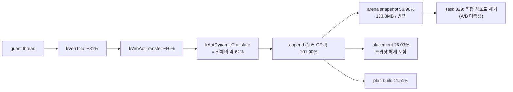

# 현재 실행 frontier / Current execution frontier

과거 전체 기록은 [Task 303까지의 frontier 원문](history/current-execution-frontier-through-task303.md)에
보존합니다. 이 문서는 최근 약 10개 Task와 현재 결정만 유지합니다.

## 현재 최상위 결론 / Active top-level conclusion

**확인됨:** 현재 `aot-dbt`는 독립적인 연속 DBT 실행기가 아니라 `aot-dynamic` 위에서
일부 TF/`INT3` 경로만 정상 host dispatch나 Dr0 span으로 바꾼 정책입니다. Task 276의
동일 시간 progress는 `aot-dynamic 10,709` 대 `aot-dbt 10,685`로 사실상 같았습니다.
Task 287의 progress `+11.86%`는 `aot-dbt` 내부 span OFF/ON 비교이지 backend 간 절대
성능 개선이 아닙니다. 과거 통제 표본에서 legacy가 `aot-dynamic`보다 14.6~20.6배
빨랐다는 사실과 함께 보면 현재 증분 경로는 요구되는 60배 개선 규모에 맞지 않습니다.

Task 308의 실제 검증은 exception-free HLE 가설을 부분 기각했습니다. 정상 host-call
HLE 경계는 60초 동안 exception/legacy fallback 0과 EEPROM 일치를 유지했고
planner-HLE 25,134회를 예외 없이 처리했습니다. 그러나 OFF/ON progress는
`44,977 → 45,716`(+1.64%)뿐이었고, single-step은 `276,680 → 254,889`(-7.88%),
AOT boundary는 `66,245 → 41,224`(-37.77%)였습니다. 또한 직접 interrupt HLE는
INT 8 selector 계약을 바꾸므로 `INT/IRET`는 현재 VEH 경계에 남겨야 합니다.

Task 309의 EIP별 계측은 single-step 횟수만으로 비용을 판단할 수 없음을 확인했습니다.
60초 동안 272,543개 single-step을 모두 기록했으며 HLE는 event의 33.60%지만
`HandleSingleStepTrace` 내부 TSC tick의 84.82%였습니다. cycle 상위 주소는 하나의
계산 loop가 아니라 segment-register move와 port-I/O HLE에 분산됐고 상위 32개
coverage도 67.21%였습니다. 따라서 한 loop를 바로 exception-free generation으로
바꾸는 80% gate는 통과하지 못했습니다.

Task 322의 단계별 귀속은 handler 내부 tick의 74.05%, HLE tick의 75.29%가
`TryResumeAotAfterHandledHle` 한 곳이며 호출당 평균이 `616,079 tick`(2.5GHz 기준 약
246us)임을 확인했습니다. HLE emulate 본체도, 상시 진단 계측(1.32%)도 아닙니다.

다만 Task 322가 그 원인으로 지목한 "동적 번역"은 **기각됐습니다.** 해당 경로는 opt-in
`REPIU_AOT_DBT_POST_HLE_TRANSLATE`가 꺼져 있어 두 실행 모두 `posthle=0/0`이었습니다.
이에 따라 "다음 작업은 로드맵 1단계"라는 결론도 철회합니다. `INT3`를 dispatch stub으로
바꿔도 stub이 호출할 해석 경로가 그대로면 비용은 줄지 않기 때문입니다.

Task 323이 그 미계측 구간을 처음으로 귀속했고, 결과는 지금까지의 방향을
**뒤집습니다.**

| bucket | 전체 wall-clock 대비 |
|---|---:|
| VEH handler 본문 — AOT boundary 경로 | **73.76%** |
| VEH handler 본문 — single-step handler | 12.62% |
| AOT cache 내 guest 실행 (추정) | 약 12.4% |
| Glide gate | 1.29% |
| kernel 예외 전이 (추정) | **1.20%** |
| DOS service / port I/O | 0.15% |

**확인됨:** 예외 전이 비용은 1.20%입니다. TF와 `INT3`를 **전부** 제거해도 상한은 약
**1.012배**입니다. 즉 "TF/VEH를 걷어낸다"는 방향은 현재 병목과 맞지 않습니다.

**확인됨:** 실제 병목은 handler 본문 안의 **O(n) 선형 탐색**입니다.
`kAotResume` 안에서 `FindAotCacheAddress`(`placement.address_map` 선형 스캔)가
87.75%를 차지하며 호출당 평균 `1,047,784 tick`(약 419us)입니다. 같은 함수가
`ResolveAotTransferTarget`을 통해 AOT boundary 경로에서도 호출되므로 73.76% 구간의
주원인일 가능성이 높습니다(미확정).

Task 324가 그 교체를 수행했습니다. 호출당 `1,047,784 → 6,866 tick`(-99.3%),
60초 heartbeat `79,640 → 331,913`(4.17배), progress `8,199 → 21,843`(2.66배)입니다.

**그러나 "AOT boundary 경로도 같은 원인"이라는 가설은 기각됐습니다.** VEH 내부이면서
single-step handler 밖인 구간은 73.76% → **74.34%**로 줄지 않았습니다. 즉 그 구간의
비용은 `FindAotCacheAddress`가 아닌 다른 원인이며, 자체 계측 없이는 알 수 없습니다.

Task 325가 그 구간을 귀속했고 정체가 확정됐습니다. **AOT transfer 해석부
(`HandleAotGuestCodeWrite{Completion,Fault}`, `HandleAotReentry`,
`HandleAotIndirectTransfer`, `HandleAotConditionalTransfer`,
`HandleAotReturnTransfer`)가 VEH 내부의 87.50%, 전체 wall-clock의 71.31%** 이며
호출당 평균은 `1,269,368 tick`(약 508us)입니다.

다른 후보는 모두 기각됐습니다. live telemetry의 `InterlockedExchange` 9회 0.08%,
single-step 이후 HLE 핸들러 체인 0.66%, prologue 검증 0.25%, boundary gate 0.11%,
파생 residual 1.01%입니다. residual이 작다는 것은 분해 경계가 옳았다는 뜻입니다.

Task 326이 그 재분해를 수행했고 답이 나왔습니다. **60초 동안 단 230회의 동적 번역이
전체 wall-clock의 61.6%를 소비합니다.** 호출당 약 **175ms**입니다.

| function 축 | count | `kVehAotTransfer` 대비 | 호출당 tick |
|---|---:|---:|---:|
| **`kAotDynamicTranslate`** | **230** | **88.64%** | **437,403,007** |
| `kAotTransferResolve` | 39,033 | 89.27% | 2,595,663 |
| `kAotResidency` | 55,507 | 1.61% | 32,865 |
| `kAotHleBoundaryScan` | 253,526 | 0.05% | 243 |

Task 325가 미검증 가설로 남긴 `AccumulateAotResidency`(1.61%)와
`IsAotHleBoundaryAddress` 선형 탐색(0.05%)은 **모두 기각**됐습니다. transfer 해석
자체는 싸고 **번역 대기만 비쌉니다.**

**확인됨:** `RequestAotDynamicTranslation`은 워커 스레드에 `SetEvent` 후
`WaitForSingleObject(INFINITE)`로 동기 대기합니다. 즉 측정된 175ms는 guest thread가
**차단된 시간**이며 실제 작업은 계측 범위 밖인 워커 스레드에 있습니다.

Task 327이 워커 스레드를 계측해 그 질문에 답했습니다. **스케줄링 지연이 아니라
워커 CPU 작업입니다.**

| rendezvous 구간 | `guest_total` 대비 |
|---|---:|
| **`append`** (`AppendWin32DynamicAotTranslation`) | **101.00%** |
| `wake_latency` | 0.03% |
| `complete_latency` | 0.01% |
| `segment_table` | 0.00% |

번역 1회 평균은 약 **259ms**, 최댓값은 약 **702ms** 입니다. 워커 기상 지연은 2코어에
5개 스레드가 경합함에도 평균 약 76us, 최대 3.4ms에 그칩니다.

**확인됨:** rendezvous 제거나 비동기화는 답이 아닙니다. **번역 자체를 싸게 또는 작게
만들어야 합니다.**

Task 328이 `append` 내부를 다섯 단계로 나눴고 원인이 확정됐습니다.

| 단계 | `append` 대비 | 회당 |
|---|---:|---:|
| **`arena_snapshot`** | **56.96%** | 약 162ms |
| `placement` | 26.03% | 약 74ms |
| `plan_build` | 11.51% | 약 33ms |
| `image_emit` | 5.04% | 약 14ms |
| `validate` | 0.44% | — |

**확인됨:** `AppendWin32DynamicAotTranslation`은 진입 즉시 **guest arena 전체
(133.8MB)를 zero-fill 후 복사**합니다. 번역 1회는 평균 명령 1,039개를 다루고
7,830바이트를 emit하는데, 그 위해 140,341,248바이트를 복사합니다 — emit 대비
**17,924배**입니다. 60초 동안 스냅샷으로만 약 19.5GB를 복사했습니다.

**확인됨:** **번역 단위 축소는 역효과**입니다. 단위를 줄이면 번역 횟수가 늘고
스냅샷 133.8MB는 매번 고정이므로 총 비용이 커집니다. 고칠 대상은 단위가 아니라
스냅샷 범위입니다.

**확인됨:** 이 비용만은 **Debug 왜곡이 아닙니다.** zero-fill·`ReadProcessMemory`·해제는
메모리 대역폭과 syscall 비용이라 최적화 수준과 무관합니다.

**귀속 주의:** `placement` 26.03%에는 같은 133.8MB 버퍼의 해제가 포함됩니다(소멸 순서
때문이며 측정 전에 문서화). 따라서 스냅샷 생애주기 전체는 **57~83%** 구간으로만
말할 수 있습니다.

**미확정:** `placement` 내부에서 스냅샷 해제와 실제 placement 작업의 비중.
`plan_build`의 명령당 약 32us도 Zydis decode치고는 큽니다. 비translate 워커 작업
4,480회의 rendezvous 비용도 아직 재지 않았습니다.

Task 329가 그 스냅샷을 제거했습니다. 측정 사슬은 여기서 끝나고 **구현으로 전환**했습니다.
선행 조건이던 "guest 외 스레드의 arena 쓰기"는 감사로 **없음이 확인**되어 설계
**옵션 1(live arena 직접 참조)** 을 그대로 채택했고, 번역 1회의 zero-fill·복사·해제
140,341,248바이트가 **모두 사라졌습니다.**

**확인됨:** 보이는 범위가 133.8MB 그대로이므로 plan은 바이트 단위로 보존됩니다.
소유 복사본을 oracle로 둔 차등 probe가 plan 스칼라 전 필드, block/instruction
스트림(원본 바이트 포함), emit 이미지의 `bytes`·`address_map`·`fixups` 일치를
확인했습니다.

**확인됨:** 60초 실측에서 번역 1회당 append 비용이 `710,135,523 → 67,367,429 tick`
(**-90.5%, 10.5배**)입니다. 단계별 회당 변화는 다음과 같습니다.

| 단계 | Task 328 회당 | Task 329 회당 | 변화 |
|---|---:|---:|---:|
| **`arena_snapshot`** | 404,524,860 | **7,970** | **-99.998%** |
| `placement` | 184,814,412 | 26,839,702 | -85.5% |
| `plan_build` | 81,728,912 | 26,907,556 | -67.1% |
| `image_emit` | 35,797,624 | 12,806,455 | -64.2% |
| `validate` | 3,089,728 | 772,181 | -75.0% |

**확인됨:** Task 328의 귀속 주의가 옳았습니다. `placement`가 85.5% 줄었으므로 그
26.03%의 대부분이 133.8MB 해제였고, 스냅샷 생애주기 전체는 append의 **약 79%**
(예측 구간 `57~83%`의 상단)였습니다. `kAotDynamicTranslate`는 AOT transfer function
축의 88.64% → **26.44%** 입니다. 정상 timeout, malformed 0, EEPROM `A1FC1D...52570`
일치.

**미확정:** `plan_build`·`image_emit`·`validate`가 함께 64~75% 싸진 이유는 측정하지
않았습니다(메모리 압력 감소가 유력하나 추정). progress `9,293 → 62,566`,
heartbeat 784,320은 단일 표본이며 실행 간 편차가 커 배수는 확정하지 않습니다.

**Confirmed:** `aot-dbt` is not yet an independent continuous DBT executor; it layers selective
normal dispatch and Dr0 spans over `aot-dynamic`. Task 276 measured effectively identical
progress, while historical controlled samples found legacy 14.6-20.6x faster than
`aot-dynamic`. Task 308 then removed 25,134 planner-HLE exceptions in a stable 60-second run,
but improved progress only 1.64%; direct interrupt HLE also changed the selector contract.

Task 309 showed why count alone is insufficient. HLE represented 33.60% of 272,543
single-step events but 84.82% of TSC ticks measured inside `HandleSingleStepTrace`. The cycle
hotspots were distributed across segment-register and port-I/O HLE sites, and the top 32
covered 67.21%, below the 80% gate for one exception-free loop.

Task 322 found `TryResumeAotAfterHandledHle` alone holding 74.05% of handler ticks and 75.29%
of HLE ticks, averaging `616,079 ticks` (about 246us at 2.5GHz), rather than the emulation body
or the 1.32% of always-on diagnostics. Its attribution of that cost to dynamic translation is
rejected, however: the path is gated on an opt-in that was off, and both runs recorded
`posthle=0/0`. The conclusion selecting roadmap stage 1 is withdrawn, because a dispatch stub
cannot help while the stub still calls the same resolution path.

Task 323 attributed that residual for the first time and inverted the direction. Of guest
thread wall clock, 73.76% sits in the VEH handler body on the AOT boundary path, 12.62% in
the single-step handler, roughly 12.4% in real guest execution inside the AOT cache, 1.29%
in the Glide gate, and only 1.20% in kernel exception transition. Removing every TF and
`INT3` exception would therefore bound improvement at about 1.012x, so removing TF and VEH
does not address the measured bottleneck.

Task 324 replaced that lookup with a hash index, cutting per-call cost from `1,047,784` to
`6,866` ticks and raising 60-second heartbeat from 79,640 to 331,913 (4.17x) and progress from
8,199 to 21,843 (2.66x). The A/B nevertheless rejected the hypothesis that the AOT boundary
path shared the cause: the share inside the VEH but outside the single-step handler did not
fall, moving from 73.76% to 74.34%. That region has a different, still unknown cause, and
attributing it is the active priority — it is a single block holding three quarters of wall
clock whose interior has never been examined.

Task 325 then attributed that block. AOT transfer resolution holds 87.50% of time inside the
VEH and 71.31% of guest-thread wall clock, averaging `1,269,368` ticks per call. Every other
candidate is rejected: telemetry writes 0.08%, the post-single-step HLE chain 0.66%, prologue
validation 0.25%, boundary gates 0.11%, and a derived residual of 1.01% confirming the
decomposition boundaries were correct. The active priority is decomposing `kVehAotTransfer`
itself; code reading suggests `AccumulateAotResidency` (a statistics-only function that
re-initializes a Zydis decoder and decodes up to 64 instructions per re-entry), the linear
`IsAotHleBoundaryAddress` scan at the head of `ResolveAotTransferTarget`, and dynamic
translation, but all three remain unverified hypotheses.

Task 326 then decomposed it: 230 dynamic translations consume 61.6% of wall clock at about
175ms each, while transfer resolution itself is cheap. The Task 325 hypotheses are both
rejected — `AccumulateAotResidency` at 1.61% and the linear `IsAotHleBoundaryAddress` scan at
0.05%. `RequestAotDynamicTranslation` signals a worker thread and blocks in
`WaitForSingleObject(INFINITE)`, so the measured time is guest-thread blocked time and the work
itself sits on a worker thread outside the instrumented scope. Whether those 175ms are worker
CPU or scheduling latency on this two-core machine is unresolved, and the remedies differ
completely.

Task 327 then instrumented the worker thread and answered it: the time is worker CPU work, not
scheduling. `AppendWin32DynamicAotTranslation` accounts for essentially the whole rendezvous
while wake and completion latency together account for 0.04%, even with five threads on two
cores. One translation averages about 259ms and peaks near 702ms. Removing or asynchronizing
the rendezvous is therefore not the answer; translation itself must become cheaper or smaller.

Task 328 then split `append` five ways and identified the cause. `AppendWin32DynamicAotTranslation`
zero-fills and copies the entire 133.8MB guest arena on entry, taking 56.96% of the append, while
one translation covers only 1,039 instructions and emits 7,830 bytes — 17,924 times less than it
copies. Shrinking the translation unit would therefore be counterproductive, since the 133.8MB
snapshot is fixed per translation. Unlike the rest of this chain, that cost is not a Debug
artifact: zero-fill, `ReadProcessMemory`, and deallocation are bandwidth and syscall costs.

Task 329 removed that snapshot, ending the measurement chain and moving to implementation. Its
prerequisite — whether any thread other than the guest writes into the arena — was audited and
answered no, so design Option 1 was adopted unchanged and the entire 140,341,248-byte zero-fill,
copy, and free per translation is gone. Because the visible range is still the whole 133.8MB, the
plan is preserved byte for byte, verified by a differential probe that treats the owning copy as
the oracle across every plan scalar, the block and instruction streams including original bytes,
and the emitted image. No performance number is claimed yet: the 60-second in-game A/B has not
been run, and it is also what will finally separate the snapshot's deallocation from real
placement work inside the 26.03%.

## 최근 Task / Recent tasks

### Task 302 — depth compare gate ABI 안전성 / Depth-compare gate ABI safety

**확인됨:** 약 880초 이후 `_GRDEPTHBUFFERFUNCTION@4(3)` 거부가 stdcall frame을 누수해
후속 low-address AV를 만들었습니다. compare `0..7`을 구현하고 신뢰 가능한 signature의
실패는 ABI-preserving decline으로 반환합니다.
[상세 작업 로그](../work-logs/20260726-302-glide-depth-compare-gate-safety.md)

**Confirmed:** Supporting compare modes 0-7 and preserving the stdcall frame on safe declines
removed the identified gate-leak class.

### Task 303 — Glide 구현 공백 fatal 가시화 / Fatal visibility for Glide gaps

**확인됨:** 미구현 함수와 미지원 인자는 첫 고유 조합에서 `[repiu-fatal]`로 즉시
출력되고 종료 summary에서 반복 count와 함께 다시 출력됩니다. 알려진 stdcall ABI는
`action=continue`, 신뢰 불가능한 ABI만 `action=terminate`입니다.
[상세 작업 로그](../work-logs/20260726-303-glide-implementation-gap-fatal-reporting.md)

**Confirmed:** Glide implementation gaps are explicit fatal-labeled diagnostics. Trusted ABIs
continue execution; only untrusted ABIs terminate.

### Task 304 — native-span 음성 캐시 / Native-span negative cache

**확인됨:** 반복 scan 거절의 99.68~99.69%를 byte-validated cache로 재사용했습니다.
texture milestone 중앙값은 1,031ms 빨라졌지만 후반 progress 중앙값은 `+0.02%`였습니다.
decode 비용은 존재하지만 장기 지배 병목은 예외 횟수라는 결론입니다.
[상세 작업 로그](../work-logs/20260726-304-native-span-negative-cache.md)

**Confirmed:** The cache reuses nearly all repeated scan rejections and improves early texture
milestones, but does not materially change late throughput.

### Task 305 — retired trap 직후 span / Immediate span after retired traps

**확인됨:** opt-in span은 시도의 95.28~95.46%에 성공하고 single-step을 중앙값 2.86%
줄였지만 progress 개선 중앙값은 0.35%뿐이었습니다. 경계까지 pending/trace 상태를
보존해야 정확성이 유지되며 기능은 기본 OFF입니다.
[상세 작업 로그](../work-logs/20260726-305-retired-trap-immediate-span.md)

**Confirmed:** Immediate spans remove some post-trap stepping, but scanner/Dr0 overhead leaves
only a 0.35% median progress gain, so the feature remains opt-in.

### Task 306 — retired trap hotset / Retired-trap hotset

**확인됨:** 60초 profile의 retired trap 7,401회 중 7,293회(98.54%)가 5바이트 미만이고
quarantine 결과였습니다. 상위 두 guest 주소가 64.06%, 상위 16개가 98.24%를
차지했습니다. stable gate는 이 trap을 줄일 수 있지만 전체 성능 예상은 1~3%로 60배
목표와 맞지 않으므로 현재 우선순위에서 제외합니다.
[상세 작업 로그](../work-logs/20260726-306-retired-trap-hotset-profile.md)

**Confirmed:** Short quarantined entries dominate retired traps, but removing this population is
only a local 1-3% candidate and is no longer the active priority.

### Task 307 — current frontier 이력 분리 / Split current-frontier history

**확인됨:** 3,657줄의 과거 frontier 원문을 Task 303까지의 history로 byte-identical
보존하고 current 문서를 최근 10개 Task 중심으로 축약했습니다. 새 결론이 추가될 때
가장 오래된 current 항목을 제거해 약 10개를 유지합니다.
[상세 작업 로그](../work-logs/20260726-307-current-frontier-history-split.md)

**Confirmed:** The complete 3,657-line frontier through Task 303 is preserved byte-for-byte
in history. The current document keeps approximately ten recent task summaries.

### Task 308 — exception-free superblock 검증 / Exception-free superblock validation

**확인됨:** opt-in host-call HLE thunk는 GPR/EFLAGS, x87/MMX/SSE, host stack/TIB
경계를 보존하며 60초 실게임을 exception 0, legacy fallback 0, EEPROM 일치로
완료했습니다. `INT/IRET`를 VEH에 남긴 안전 slice는 25,134 HLE를 직접 처리했지만
progress는 `+1.64%`뿐이어서 5배 go/no-go에 실패했습니다. 직접 interrupt HLE의
selector 불일치도 확인되어 일반 HLE 예외 제거는 다음 성능 아키텍처가 아닙니다.
[상세 작업 로그](../work-logs/20260726-308-exception-free-superblock-validation.md)

**Confirmed:** The safe host-call slice completed 60 seconds with no exception or legacy
fallback and a matching EEPROM while directly handling 25,134 HLE sites. Progress improved
only 1.64%, failing the 5x gate, and direct interrupt HLE violated the established selector
contract.

### Task 309 — single-step hotspot cycle 귀속 / Single-step hotspot cycle attribution

**확인됨:** opt-in 8,192-slot EIP histogram은 60초 실행의 single-step 272,543개를
1,132개 주소로 전부 분류했고 overflow는 0이었습니다. HLE는 event의 33.60%지만
handler TSC tick의 84.82%였습니다. cycle 상위권은 segment-register move와 port-I/O
HLE였고 상위 8개 43.09%, 상위 32개 67.21%로 단일 loop 80% gate에는 미달했습니다.
[상세 작업 로그](../work-logs/20260726-309-single-step-hotspot-cycle-attribution.md)

**Confirmed:** The opt-in 8,192-slot EIP histogram classified all 272,543 steps across 1,132
addresses with no overflow. HLE represented 33.60% of events and 84.82% of handler TSC ticks.
Segment-register and port-I/O HLE dominated the cycle ranking, but the top 32 covered only
67.21%, below the 80% gate for one loop.

### Task 322 — handler 단계별 비용 귀속 / Handler stage attribution

**확인됨:** `HandleSingleStepTrace`를 5개 순차 단계로 나눈 60초 계측은 표본 53,628개,
distinct EIP 717개, overflow 0을 기록했습니다. `kAotResume` 74.05%,
`kHleDispatch` 23.58%, `kPrologueTrace` 1.32%, `kNativeEntry` 0.75%,
`kInterruptInjection` 0.04%, residual 0.27%입니다. 설계가 사전 고정한 gate 첫 행이
성립해 다음 작업은 로드맵 1단계로 확정됐습니다. 진단 계측이 hot path를 지배한다는
가설은 기각됐습니다. profile OFF/ON은 EEPROM hash 일치, fallback/malformed 0이었습니다.
[상세 작업 로그](../work-logs/20260727-322-single-step-handler-stage-attribution.md)

**Confirmed:** Five-stage attribution over 53,628 samples put 74.05% of handler ticks in
`TryResumeAotAfterHandledHle` and only 1.32% in always-on diagnostics, satisfying the
pre-registered gate for roadmap stage 1 and rejecting the instrumentation hypothesis.

### Task 323 — 전체 실행 시간 귀속 / Whole-run execution time attribution

**확인됨:** guest thread wall-clock의 86.38%가 VEH handler 본문이며 예외 전이는
1.20%, Glide gate는 1.29%입니다. `kAotResume` 안에서는 `FindAotCacheAddress` 선형
탐색이 87.75%로, 호출당 `1,047,784 tick`입니다. Part A gate는 성립했고 Part B gate는
전부 기각됐습니다. Task 322의 잘못된 인과 귀속도 함께 정정했습니다.
[상세 작업 로그](../work-logs/20260727-323-whole-run-execution-time-attribution.md)

**Confirmed:** The VEH handler body holds 86.38% of guest-thread wall clock while kernel
exception transition holds 1.20%, rejecting the premise behind TF/VEH removal. The linear
`FindAotCacheAddress` scan holds 87.75% of `kAotResume`.

### Task 324 — AOT cache 주소 해시 색인 / AOT cache address hash index

**확인됨:** `FindAotCacheAddress`를 버킷 체인 해시 색인으로 교체해 호출당
`1,047,784 → 6,866 tick`(-99.3%), heartbeat 4.17배, progress 2.66배를 얻었습니다.
차등 probe가 교체 이전 구현을 oracle로 두고 8개 경계 조건에서 의미 동등성을
검증했습니다. EEPROM 일치, fallback/malformed 0.
[상세 작업 로그](../work-logs/20260727-324-aot-cache-address-hash-index.md)

**기각됨:** AOT boundary 경로가 같은 원인을 공유한다는 가설. 해당 구간은 73.76%에서
74.34%로 줄지 않았습니다.

**Confirmed:** The hash index cut per-call cost 99.3% and raised heartbeat 4.17x and progress
2.66x with verified semantic equivalence. **Rejected:** the AOT boundary path did not share
the cause; its share held at 74.34%.

### Task 325 — VEH boundary 경로 귀속 / VEH boundary path attribution

**확인됨:** `DispatchGuestException`을 5개 하위 bucket으로 나눈 결과 AOT transfer
해석부가 VEH의 87.50%, 전체의 71.31%였고 호출당 `1,269,368 tick`이었습니다. 사전
등록한 gate 중 첫 행만 성립하고 나머지는 모두 기각됐으며, residual 1.01%로 분해
경계가 옳았음이 확인됐습니다.
[상세 작업 로그](../work-logs/20260727-325-veh-boundary-path-attribution.md)

**Confirmed:** AOT transfer resolution holds 87.50% of VEH time and 71.31% of wall clock at
`1,269,368` ticks per call. Only the first pre-registered gate holds, and a 1.01% residual
confirms the decomposition boundaries.

### Task 326 — AOT transfer 해석부 재분해 / AOT transfer resolution decomposition

**확인됨:** 동적 번역 230회가 전체 wall-clock의 61.6%, 호출당 약 175ms입니다.
`AccumulateAotResidency`(1.61%)와 `IsAotHleBoundaryAddress`(0.05%) 가설은 모두
기각됐습니다. `RequestAotDynamicTranslation`이 워커 스레드에 동기 대기하므로 측정된
시간은 guest thread 차단 시간입니다.
[상세 작업 로그](../work-logs/20260727-326-aot-transfer-resolution-decomposition.md)

**Confirmed:** 230 dynamic translations hold 61.6% of wall clock at about 175ms each, and both
Task 325 hypotheses are rejected. The measured time is guest-thread blocked time on a
synchronous worker rendezvous.

### Task 327 — 번역 워커 타이밍 / Translation worker timing

**확인됨:** rendezvous의 101.00%가 `AppendWin32DynamicAotTranslation`이고 wake와
complete 지연은 합쳐 0.04%입니다. 번역 1회 평균 259ms, 최대 702ms. 스케줄링은
병목이 아니므로 rendezvous 제거는 답이 아닙니다.
[상세 작업 로그](../work-logs/20260727-327-translation-worker-timing.md)

**Confirmed:** The rendezvous is worker CPU work, not scheduling: append holds 101.00% while
wake and complete latency total 0.04%, averaging 259ms per translation.

### Task 328 — 동적 append 단계 분해 / Dynamic append phase decomposition

**확인됨:** arena 전체 스냅샷이 append의 56.96%이고, 번역 1회는 명령 1,039개를 다루며
7,830바이트를 emit하는데 140,341,248바이트를 복사합니다. 번역 단위 축소는 역효과이며
고칠 대상은 스냅샷 범위입니다. 이 항목만은 Debug 왜곡이 아닙니다.
[상세 작업 로그](../work-logs/20260727-328-dynamic-append-phase-decomposition.md)

**Confirmed:** The full-arena snapshot is 56.96% of one append, copying 140,341,248 bytes to
translate 1,039 instructions into 7,830 bytes. Shrinking the translation unit is
counterproductive; the snapshot range is what must change.

### Task 329 — arena 스냅샷 제거 / Arena snapshot elimination

**확인됨:** guest 외 스레드는 arena에 쓰지 않습니다(host poll은 host 소유
`DosLowMemory`에만, 오디오 워커는 host 버퍼에만, 번역 워커는 AOT cache에만 씁니다).
Glide는 별도 스레드가 아니라 host main에서 guest 대행이며 `InvokeOnHostThread`가
guest를 차단하므로 번역 rendezvous와 **상호 배타적**입니다. 따라서 설계 옵션 1을
채택해 스냅샷을 제거했고, 번역당 140,341,248바이트 zero-fill·복사·해제가 사라졌습니다.

**확인됨:** 의미는 보존됩니다. 소유 복사본을 oracle로 둔 `arena_view` probe가 plan
스칼라 전 필드, block/instruction 스트림(원본 바이트), emit 이미지
`bytes`/`address_map`/`fixups` 일치와 뷰의 liveness, 경계 거절 동일성을 확인했습니다.
`ReadProcessMemory` 실패 반환을 대신해 프로세스당 1회 `VirtualQuery` 검증을 넣었습니다.

**미확정:** 실게임 60초 A/B 미수행 — 성능 수치 없음.
[상세 작업 로그](../work-logs/20260727-329-arena-snapshot-elimination.md)

**Confirmed:** No thread other than the guest writes into the arena, and Glide host commands are
mutually exclusive with the translation rendezvous, so Option 1 was adopted and the per-translation
140,341,248-byte zero-fill, copy, and free are gone with the plan preserved byte for byte, checked
against the owning copy as oracle. Measured over 60 seconds, per-translation append cost fell from
`710,135,523` to `67,367,429` ticks (-90.5%), with `arena_snapshot` down 99.998% and `placement`
down 85.5%, confirming Task 328's caveat that the deallocation dominated it and putting the
snapshot's whole lifecycle at about 79% of an append. **Unresolved:** why `plan_build`,
`image_emit`, and `validate` also fell 64-75% was not measured, and the progress and heartbeat
multiples are single-sample.

## 다음 검증 / Next validation

스냅샷 병목은 Task 329에서 제거됐고 측정으로 확인됐습니다. 다음 대상은 **`plan_build`**
입니다. 이제 append의 **39.94%** 로 최대 항목이고 명령당 약 `25,433 tick`인데, 이는
Zydis decode 하나로 설명하기에 여전히 큽니다. `image_emit`(19.01%)이 그 다음입니다.

동시에 확인할 것은 이번에 남은 **미측정 사실 한 가지**입니다. 스냅샷을 없애자
`plan_build`·`image_emit`·`validate`가 모두 64~75% 싸졌는데, 원인을 재지 않았습니다.
메모리 압력 감소가 유력한 설명이며, 이것이 맞다면 `plan_build`의 남은 비용 구조도
decode가 아닐 수 있으므로 **원인을 먼저 귀속한 뒤 최적화**해야 합니다.

전체 실행 축에서는 `kAotDynamicTranslate`가 26.44%로 내려왔으므로, 다음 측정은
guest thread wall-clock 재귀속(Task 323/325의 갱신)이 필요합니다. 현재 상위 bucket
비율은 중첩 때문에 합이 100%를 넘어(예: veh 90.89%, glide-gate 56.56%) 그대로
해석할 수 없습니다.

TF/VEH 제거 로드맵은 계속 보류합니다. 예외 전이가 1.20%인 이상 상한이 약 1.012배입니다.

The snapshot bottleneck was removed in Task 329 and the removal is measured. The next target is
`plan_build`, now the largest phase at 39.94% of an append and about `25,433` ticks per
instruction, still large to explain by Zydis decoding alone, followed by `image_emit` at 19.01%.
One unmeasured fact should be resolved alongside it: removing the snapshot also made
`plan_build`, `image_emit`, and `validate` 64-75% cheaper, and if reduced memory pressure is the
reason, the remaining `plan_build` cost may likewise not be decoding, so the cause should be
attributed before it is optimized. Because `kAotDynamicTranslate` has fallen to 26.44%, guest
wall-clock attribution needs redoing as well; the current top-level bucket shares overlap and sum
past 100% (veh 90.89%, glide gate 56.56%), so they cannot be read as a decomposition. The TF/VEH
removal roadmap stays on hold at a roughly 1.012x bound.
