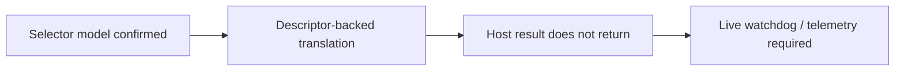
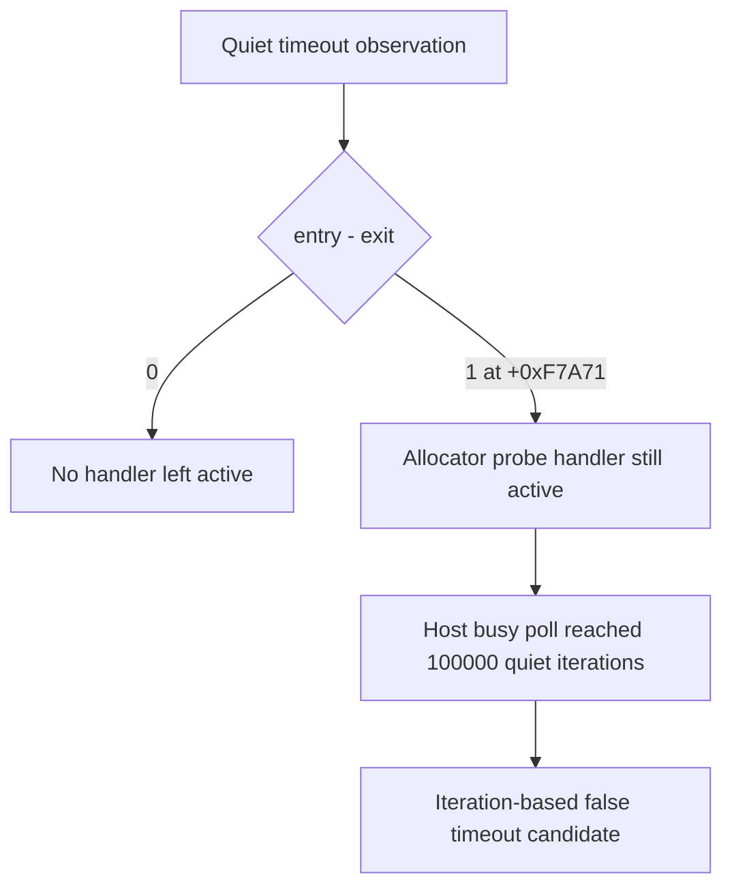
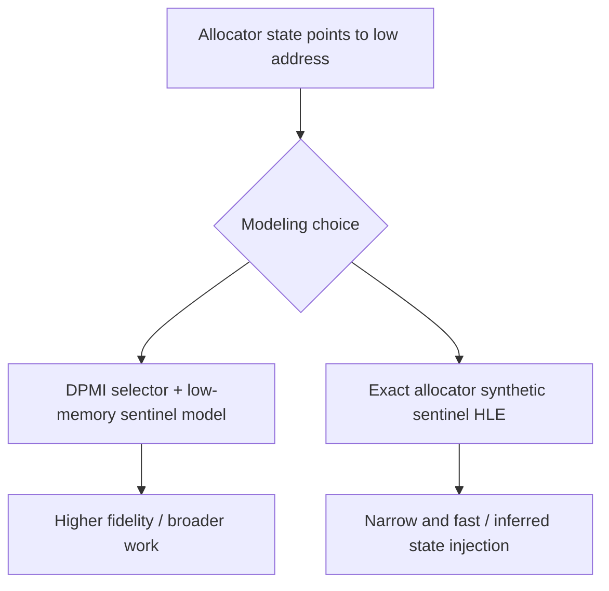
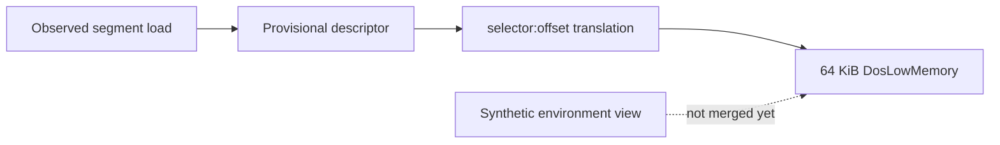
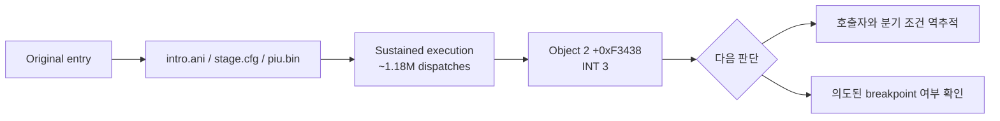

# 현재 실행 frontier와 다음 분석 대상

```mermaid
flowchart LR
    ENV["DOS Environment Scan"] --> FILES["intro.ani / stage.cfg"]
    FILES --> RESIZE["DOS Resize"]
    RESIZE --> OBJECTS["Boundary Object Array"]
    OBJECTS --> SENTINEL["Allocator Sentinel / Metadata"]
    SENTINEL --> DS0["8B 16 with DS:0 handled"]
    DS0 --> ADD["03 07 shadow ADD handled"]
    ADD --> OR["83 0E 01 shadow OR handled"]
    OR --> CMP["38 10 shadow byte CMP handled"]
    CMP --> ZERO["Bounded zero-backed allocator payload"]
    ZERO --> NEXT["38 50 20 handled"]
    NEXT --> LOOP["File parsing loop"]
    LOOP --> ALLOC["Allocator probe dispatch"]
    ALLOC --> QUIET["Repeated +0xF7A71 dispatch / quiet timeout"]
```

## 2026-07-11 실제 arena 확장 결과

16 MiB contiguous expansion으로 기존 `0x026E3578` allocator boundary와 `0xC0000374` heap corruption이 사라졌다. PIU는 supervisor 종료 없이 자체 timeout을 반환하고 dispatch는 `118438/118438`로 균형을 이룬다. 마지막 `+0xF520A`는 정상 compare 함수 종료 경로이므로 현재 명확한 fault frontier는 없다.

## 2026-07-11 Real Arena Expansion Result

A 16 MiB contiguous expansion removes the former `0x026E3578` allocator boundary and heap corruption `0xC0000374`. PIU returns its own timeout without supervisor termination and balances 118,438/118,438 dispatches. Last EIP `+0xF520A` is a normal comparison-function exit, so there is no current concrete fault frontier.

## 2026-07-11 supervisor가 확인한 allocator 경계

외부 shared telemetry는 PIU 정지 상태에서 exception `0xC0000374`, last guest EIP `+0x1E16A`, EAX=`0x026E3578`을 회수했다. arena end `0x026D7000`보다 약 `0xC578` 밖의 allocator 객체 초기화 중 host heap corruption이 발생한다. 다음 구현은 실제 arena 확장과 독립 backing 중 선택이 필요하다.

## 2026-07-11 Allocator Boundary Confirmed by Supervisor

External shared telemetry recovered exception `0xC0000374`, last guest EIP `+0x1E16A`, and EAX=`0x026E3578`. Host heap corruption occurs while initializing an allocator object about `0xC578` beyond arena end `0x026D7000`. The next implementation requires choosing real arena expansion or independent backing.

## 2026-07-11 external supervisor 전환 근거

ES=`0x2C` descriptor byte compare/load를 처리해 `+0xFC723`과 `+0xFC777`을 통과했다. 이후 실행은 계속되지만 동일 프로세스 live snapshot과 최종 결과가 모두 회수되지 않는다. 이전 timeout data race를 제거한 뒤에도 재현되므로 다음 진단 경계는 별도 supervisor 프로세스에 둔다.

## 2026-07-11 Evidence for External Supervisor

Descriptor-backed ES=`0x2C` byte compare/load processing passes `+0xFC723` and `+0xFC777`. Execution then continues while both in-process live snapshots and final results become unavailable. Because this reproduces after the prior timeout race was removed, the next diagnostic boundary belongs in an external supervisor process.

## 2026-07-11 shadow segment register store

`+0xFC717 MOV AX,FS`를 shadow store로 처리해 후속 ES가 `0x2C`로 설정된다. 현재 frontier는 `+0xFC723`의 ES override byte compare/load이며 descriptor-backed byte read 형식 확장이 필요하다.

## 2026-07-11 Shadow Segment Register Store

Shadowing MOV AX,FS at `+0xFC717` makes the following ES load use `0x2C`. The current frontier is the ES-override byte compare/load at `+0xFC723`, requiring descriptor-backed byte-read forms.

## 2026-07-11 REP STOSD 이후

`+0xF4E17`의 zero-fill REP STOSD를 범위 검증 후 일괄 처리하여 반복별 TF exception을 제거했다. 실행은 `+0xFC723`까지 진행한다. `+0xFC717 MOV EAX,FS`가 shadow FS=`0x2C` 대신 Win32 FS=`0x53`을 읽고, `+0xFC71F MOV ES,EAX`가 shadow ES를 `0x53`으로 오염시키는 것이 새 frontier다.

## 2026-07-11 After REP STOSD

Batching the checked zero-fill REP STOSD at `+0xF4E17` removes per-iteration TF exceptions and advances execution to `+0xFC723`. The new frontier is native `MOV EAX,FS` at `+0xFC717`, which reads Win32 FS=`0x53` instead of shadow FS=`0x2C`, followed by MOV ES contaminating shadow ES with `0x53`.

## 2026-07-11 shadow DS 복원

환경 scan의 임시 DS=`0x2C`는 `+0xF4DD5`의 `POP DS`에서 guest stack의 `0x2B`로 복원된다. access-violation HLE 뒤 TF를 보존하고 POP을 shadow 처리하자 기존 `+0xF7A71` fault가 사라졌다. 새 frontier는 `+0xF4E17`의 `REP STOSD` 반복별 single-step 비용이다.

## 2026-07-11 Shadow DS Restoration

The temporary environment-scan DS=`0x2C` is restored to guest-stack selector `0x2B` by POP DS at `+0xF4DD5`. Preserving TF after access-violation HLE and shadowing the POP removes the former `+0xF7A71` fault. The new frontier is per-iteration single-step overhead at `REP STOSD` at `+0xF4E17`.

## 2026-07-11 live telemetry 결과

selector binding 이후의 host 정지는 guest 교착이 아니었다. host busy poll이 guest 시작 전에 quiet iteration 100,000회를 소진하고, guest 종료 전에 비원자 observation을 복사하면서 data race가 발생했다. wall-clock quiet timeout과 terminate/join-before-copy 순서로 수정한 뒤 PIU는 반복 실행에서 안정적으로 최종 예외를 반환한다.

현재 frontier는 relocated `+0xF7A71`의 opcode `0x8B` access violation이다. 세 번의 실행에서 dispatch entry/exit는 모두 `28182/28182`로 균형을 이루며 EAX=`0x1008`, ESI=`0x0007B839`가 반복된다. supervisor 프로세스는 현재 필요하지 않다.


## 2026-07-11 Live Telemetry Result

The host stall after selector binding was not a guest deadlock. The host busy poll exhausted 100,000 quiet iterations before guest startup and raced while copying non-atomic observations before stopping the guest. Wall-clock quiet detection and terminate/join-before-copy restore stable result collection. The current frontier is the repeatable opcode-`0x8B` access violation at relocated `+0xF7A71`, with balanced 28,182/28,182 dispatch counts, EAX=`0x1008`, and ESI=`0x0007B839`. An external supervisor is not currently required.

## 2026-07-11 selector frontier

DOS4GW `LINEXE.EXP` 역분석으로 LE object selector가 DPMI function `0000h`의 동적 할당 결과임을 확인했다. PIU 프로필은 object 1~4에 `0x1C`, `0x24`, `0x2C`, `0x34`를 순차 할당하며 kind `0x03` fixup은 할당 selector를 source `+2`에 기록한다.

실제 descriptor-backed translation을 활성화하면 PIU host가 45초 안에 내부 timeout snapshot을 반환하지 못한다. 현재 frontier는 selector 값 결정이 아니라, 실행 중 exception 반복 또는 guest 진행 상태를 host 종료 전에 회수할 수 있는 live telemetry다.



## 2026-07-11 Selector Frontier

Reverse engineering of DOS4GW `LINEXE.EXP` confirmed that LE object selectors are dynamic results of DPMI function `0000h`. The PIU profile sequentially assigns `0x1C`, `0x24`, `0x2C`, and `0x34` to objects 1 through 4, and kind-03 fixups write the allocated selector at source `+2`.

With real descriptor-backed translation enabled, the PIU host does not return its internal timeout snapshot within 45 seconds. The frontier is no longer selector selection; it is live telemetry that can recover repeated exception or guest progress state before host termination.



## 현재까지 도달한 상태

**확인됨:** DOS environment scan, `intro.ani`/`stage.cfg` file flow, DOS resize, arena 경계 객체 배열, allocator sentinel과 metadata store까지 진행한다. 실행 timing에 따라 생성자, allocator fault 또는 충분한 진척 뒤 quiet timeout이 먼저 관찰될 수 있다.

## 최근 해결

relocated base + `0x000F7A71`의 `8B 16` (`mov edx,[esi]`)에서 `ESI=0`인 경우를 guest `DS` zero-page read로 처리했다. 같은 명령의 고주소 source는 처리하지 않는다.

## 최근 해결한 ADD

**확인됨:** zero-page read 통과 후 relocated base + `0x000F7BAD`의 `03 07`을 shadow-memory source ADD로 처리했다.

```asm
add eax, dword ptr [edi]
```

관찰값 `EDI=0x026E49C4`의 dword를 shadow memory에서 읽고, destination register와 `CF/PF/AF/ZF/SF/OF`를 32-bit ADD 의미대로 갱신한다.

## 최근 해결한 OR

**확인됨:** ADD 통과 후 relocated base + `0x000F7AD4`의 `83 0E 01`을 shadow-memory read-modify-write로 처리했다.

```asm
or dword ptr [esi], 1
```

destination dword를 shadow memory에서 읽어 bit 0을 설정한 결과를 같은 주소에 기록했다. `CF/OF`를 0으로 하고 `PF/ZF/SF`를 결과에 맞게 복원하며 undefined인 `AF`는 보존한다.

## 최근 해결한 byte CMP

**확인됨:** OR 통과 후 relocated base + `0x000F5F34`의 `38 10`을 shadow byte source CMP로 처리했다.

```asm
cmp byte ptr [eax], dl
```

관찰값은 `EAX=0x046E49C8`, `EDX=0`이었다. shadow byte와 ModRM byte register를 비교하고 `CF/PF/AF/ZF/SF/OF`를 복원하며 operand는 변경하지 않는다.

## 최근 해결한 bounded zero backing

**확인됨:** 첫 CMP 통과 후 relocated base + `0x000F5F8E`에서 다음 명령이 관찰된다.

```asm
cmp byte ptr [eax+0x20], dl
```

이 source byte는 sparse shadow map에 없지만, 확인된 allocator payload 범위 안의 unwritten byte다. 요청 크기 `0x2C`와 `0x1008`만 추적하고 `[block+4, block+size-4)`에 한해 0을 반환하도록 구현해 이 비교를 통과했다. 이후 실행은 DOS interrupt, segment-memory load와 shadow read를 계속 처리하고 allocator probe로 돌아간다.

## Quiet timeout 재분류

**확인됨:** quiet timeout을 native 파일 파싱 loop의 정체로 단정할 수 없다. exception dispatch entry/exit를 guest suspend 없이 계수한 반복 실행에서 다음 세 형태가 관찰되었다.



* exception 종료: `entry=25604`, `exit=25604`, last EIP `+0xF7ABA`
* quiet timeout: `entry=34068`, `exit=34067`, outstanding `1`, last EIP `+0xF7A71`
* exception 종료: `entry=28234`, `exit=28234`, last EIP `+0xF7AA8`
* 전체 regression의 quiet timeout: `entry=33946`, `exit=33946`, outstanding `0`, last EIP `+0xF7A71`

마지막 single-step EIP는 반복 실행 모두 `+0xF4DC1`이었지만, timeout 직전 마지막 exception dispatch는 allocator probe `+0xF7A71`이었다. balanced timeout에서도 총 dispatch가 약 34,000회 발생했으므로 handler 자체가 항상 멈춘 것은 아니며, guest가 같은 allocator 경로를 반복하지만 현재 semantic progress counter에는 변화가 없는 상태다. outstanding `1`은 busy polling이 handler 실행 중간을 포착할 수 있음을 추가로 보여 준다. 다음 단계는 polling 한도부터 느슨하게 만들기보다 `+0xF7A71` 반복의 EAX/ESI와 pending allocation 상태를 bounded trace로 확인해야 한다.

## Allocator probe trace 결과

**확인됨:** 최근 16개를 보존하는 bounded ring으로 `+0xF7A71` 반복 상태를 확인했다.

| 경로 | 관측 수 | EAX | ESI/source | pending | 결과 |
| --- | ---: | ---: | ---: | --- | --- |
| quiet timeout A | 2,907 | `0x1008` | `0` | `0x1008` 유지 | `pending-preserved` |
| quiet timeout B | 2,816 | `0x1008` | `0` | `0x1008` 유지 | `pending-preserved` |
| high-source exception | 1 | `0x1008` | `0xFF000000` | 없음 | `rejected` |

timeout의 최신 16개는 각 실행에서 완전히 동일했다. 첫 `0x1008` request가 이미 pending인 상태이므로 probe는 새 크기를 capture하지 않는다. 정상적인 연결점인 `+0xF7AD4` header OR가 pending을 소비하기 전에 제어가 probe로 돌아오는 이유를 다음 분석에서 확인해야 한다.

## Allocator control-flow trace 결과

**확인됨:** allocator range의 exception sequence는 free-list 순회와 node split/update 경로를 구분한다.

| Offset | Bytes | 의미 |
| --- | --- | --- |
| `+0xF7A71` | `8B 16 39 D0` | current node size를 `EDX`로 읽고 request `EAX`와 비교 |
| `+0xF7A83` | `8B 76 08 39` | `ESI=[ESI+8]`로 next node 이동 |
| `+0xF7A99` | `8B 4E 08 83` | selected node의 next link 읽기 |
| `+0xF7AA8..+0xF7AB2` | `89`/`8B` stores | split node metadata 연결 갱신 |
| `+0xF7AD4` | `83 0E 01` | selected block header 사용 표시 |

`ESI=0x026E49C4` 경로는 `EAX=0x1008`과 `0x64030` 요청 모두 split/update 후 OR까지 도달했고 pending은 false였다. 후속 provenance 분석은 timeout의 `ESI=0`이 `node+8` shadow link에서 오지 않음을 확인했다.

## Shadow writer provenance 결과

**확인됨:** 최근 256개 shadow write를 allocation-free ring에 보존하고 allocator dword read와 연결했다. null link, poison link, root-null transition은 반복 실행에서 모두 `valid=false`였다. `ESI`는 allocator range 앞부분의 mapped instruction `mov esi,[ebx+0x0C]`에서 이미 `0` 또는 `0xFF000000`으로 설정되므로 shadow writer provenance 대상이 아니다.

초기 per-byte `unordered_map` 구현은 exception handler 안의 heap allocation 때문에 Windows heap corruption `0xC0000374`를 재현했다. 고정 ring으로 교체한 뒤 별도 build에서 `dos4gw_hello`와 PIU 반복 실행 6회가 crash/hang 없이 종료됐다.

## 의사결정 지점

다음 구현에는 정책 선택이 필요하다.



프로젝트 원칙에는 DPMI selector와 low-memory 초기 상태를 명시적으로 모델링하는 방향이 더 부합한다. exact allocator synthetic sentinel은 빠르지만 원본에서 확인하지 못한 head pointer를 주입해야 한다.

## DPMI selector/low-memory 기반 구조

**구현됨:** 선택한 DPMI 방향의 첫 단계로 공용 `SelectorTable` translation과 고정 64 KiB `DosLowMemory` backing을 추가했다. observed segment load는 provisional base-zero/limit `0xFFFF` descriptor를 등록한다. generic DS low-memory dword와 FS word는 selector translation이 성공해야만 backing을 읽는다.



별도 Win32/x86 build의 PIU 실행에서 selector descriptor 4개와 valid 65,536-byte low memory가 확인됐고 기존 frontier가 유지됐다. backing은 근거 없는 sentinel 값을 넣지 않고 zero-initialized 상태다.

## 새 의사결정 후보

현재 environment scan은 selector `0x2C` offset 공간을 synthetic environment block으로 읽지만 generic allocator read는 같은 active DS selector를 low-memory backing으로 읽는다. descriptor base와 environment block의 실제 DOS linear 위치를 확인하기 전까지 둘을 합치면 allocator `DS:0`이 environment 문자열 첫 dword를 읽는 잘못된 결과가 된다.

## Segment load provenance

**확인됨:** PIU 반복 실행 4회에서 다음 7개 segment load sequence가 동일했다.

| # | Offset | Register | Selector | Source |
| ---: | --- | --- | --- | --- |
| 1 | `+0xF4D35` | DS | `0x24` | immediate/register |
| 2 | `+0xF4D3B` | DS | `0x2B` | immediate/register |
| 3 | `+0xF4D50` | ES | `0x17` | immediate/register |
| 4 | `+0xF4D68` | ES | `0x24` | `0x021A6624` |
| 5 | `+0xF4D91` | DS | `0x2B` | immediate/register |
| 6 | `+0xF4DA2` | DS | `0x2C` | `0x021A664D` |
| 7 | `+0xFC70D` | FS | `0x2C` | `0x021A664D` |

selector `0x24`와 `0x2C`는 8 간격이고 image memory에 fixup 값으로 존재한다. relocation builder가 현재 32-bit linear fixup `0x07`만 적용하고 selector source kind를 skip하므로, selector fixup record의 target object와 원본 16-bit selector 값을 결합하면 descriptor base를 relocated object base로 복원할 수 있다.

## 다음 검증 질문

1. selector fixup source kind와 target object에서 `selector → relocated object region` binding을 안전하게 생성할 수 있는가?
2. 동일 selector가 여러 target object를 가리키거나 원본 값이 불일치하는 conflict가 존재하는가?
3. 단일 zero-backed range를 여러 동시 생존 allocation range로 확장해야 하는가?
4. allocator 반복이 정상임이 확인된 뒤 quiet 판정을 wall-clock 기반으로 바꾸고 polling에서 CPU를 양보해야 하는가?

# Current Execution Frontier and Next Analysis Target

Execution now reaches DOS environment scanning, successful `intro.ani`/`stage.cfg` flow, DOS resize, boundary-object array initialization, and allocator sentinel/metadata stores. The `DS:0` form of `8B 16` at `0x000F7A71` has been handled without relocating low memory.

The stable segment-load trace shows DS and FS loading selector `0x2C` from image address `0x021A664D`, with `0x24` and `0x2C` separated by one descriptor slot. Selector fixups are currently skipped while their original 16-bit values remain in the image. The next implementation can therefore derive selector-to-relocated-object descriptor bindings from selector fixup records rather than guessing base zero.

## 장시간 관찰에서 확인된 새 경계 (2026-07-11)

**확인됨.** supervisor 제한 15초, loader 내부 제한 14초로 실행했을 때 실행은 timeout이 아니라 약 9.7초 후 원본 object 2의 `+0xF3438` (`0x020F3438`)에 있는 `INT 3`에서 종료되었다. supervisor는 자식을 강제 종료하지 않았고 `child_exit=0`, `terminated=false`로 회수했다.



관찰 중 heartbeat와 dispatch entry/exit는 매초 계속 증가했고, 약 1초의 12.8만 dispatch에서 약 9.7초의 118.5만 dispatch까지 진행했다. `PIU.BIN` open/read/seek/close가 모두 성공했으며 마지막 read는 요청 4,096바이트 중 파일 끝의 560바이트를 정상 반환했다. 따라서 파일을 읽지 못해 즉시 `INT 3`로 간 이전 경계와는 다르며, 이번 `INT 3`는 더 뒤의 오류 또는 의도된 중단 경로이다.

현재 증거만으로 `INT 3`를 건너뛰면 안 된다. 다음 단계는 `+0xF3438`로 들어오는 caller와 직전 조건 분기를 역추적해 breakpoint가 실패 처리인지 정상적인 디버그 표식인지 판별하는 것이다.

## New frontier confirmed by extended observation (2026-07-11)

**Confirmed.** With a 15-second supervisor deadline and a 14-second loader deadline, execution ended at the `INT 3` at object 2 `+0xF3438` (`0x020F3438`) after about 9.7 seconds, not at a timeout. The supervisor reported `child_exit=0` and `terminated=false`.

The heartbeat and balanced dispatch counts continued increasing each second, from about 128 thousand dispatches near one second to about 1.185 million near 9.7 seconds. `PIU.BIN` open/read/seek/close operations succeeded; the final read correctly returned the remaining 560 bytes of a 4,096-byte request. This is therefore later than the earlier file-read failure frontier. The next step is to trace the caller and preceding condition that reaches `+0xF3438`; skipping the breakpoint without that evidence would hide the actual failure path.

## DLL loader 역추적 결과

`+0xF3438`은 DLL lazy-loader의 공통 fatal 지점이며 실제 선택된 메시지는 `Fatal error: unable to initialize DLL loader.`이다. 초기화 실패는 현재의 임시 `INT 21h AX=FF00h` 응답이 `AL=0`을 반환하여 원본 시작 코드가 DOS/4G private environment selector인 `GS`를 저장하지 않는 데서 시작한다. 자세한 증거는 [DOS/4G DLL loader와 INT 21h AX=FF00h 역추적](dll-loader-int21-ff00.md)에 정리했다.

## DLL loader provenance result

`+0xF3438` is the DLL lazy loader's common fatal site, and the selected message is `Fatal error: unable to initialize DLL loader.` The failure begins because the temporary `INT 21h AX=FF00h` HLE returns `AL=0`, preventing startup from recording the DOS/4G private-environment selector in `GS`. See [DOS/4G DLL loader and INT 21h AX=FF00h provenance](dll-loader-int21-ff00.md) for the evidence.

원본 fatal breakpoint를 제한적으로 재개한 결과 error printer가 실제 fatal 문장을 출력하고 `INT 21h AX=4C01h`로 종료를 요청하는 것까지 확인했다. 동시에 `GS:0x42` module/export field map을 복원했으며, 다음 정상 진행 blocker는 `INT 3`가 아니라 DOS4GW `AX=FF00h` service 0 provider의 정확한 반환 계약이다.

Narrowly continuing the original fatal breakpoint confirmed that its error printer emits the fatal sentence and requests termination with `INT 21h AX=4C01h`. The `GS:0x42` module/export field map is now recovered; the next normal-progress blocker is the exact DOS4GW `AX=FF00h` service-zero provider contract, not the breakpoint itself.
