## 2026-07-22 Task 263 (완료): AOT 이탈의 근인 = 세그먼트 명령 — `other` 77%의 정체가 GS 프리픽스·세그먼트 레지스터/push·pop, 체류량 4.8명령/진입 / Task 263 (Completed): root cause of AOT exits = segmentation instructions — the 77% `other` bucket is GS prefix + segment reg/push/pop; residency 4.8 instr/entry

**상태 (Status):** 구현·실측 완료, `claude/task-262-aot-dynamic-perf-aipxsa`. Task 262
후속 (a) `other` 규명 + (b) 체류량.

### (a) `other` 77%의 정체 = 세그먼트 명령 (확인됨)

`other` 경계의 선두 opcode 히스토그램을 계측해, aot-dynamic 실측(loader 단독 45초,
graceful summary)에서 top-8을 확정했다. `other` 총 46,365 중:

| opcode | 명령 | 카운트 | other 대비 |
|---|---|---:|---:|
| `0x65` | **GS: 세그먼트 프리픽스** | 25,564 | 55.1% |
| `0x55` | push ebp (프롤로그) | 4,088 | 8.8% |
| `0x8E` | **mov Sreg, r/m** (세그먼트 로드) | 3,554 | 7.7% |
| `0x1E` | **push ds** | 3,215 | 6.9% |
| `0x8C` | **mov r/m, Sreg** (세그먼트 저장) | 2,058 | 4.4% |
| `0x07` | **pop es** | 1,915 | 4.1% |
| `0x06` | **push es** | 1,894 | 4.1% |
| `0x1F` | **pop ds** | 1,576 | 3.4% |

top-8이 `other`의 **94.6%**를 덮고, 그중 세그먼트 명령(0x55 제외)이 **약 86%**다.
`other`는 전체 경계의 77%이므로 **세그먼트 명령이 전체 AOT 이탈의 약 75%**다(39,776 /
52,778). 즉 게임이 세그먼트-집약적(DOS4GW 보호모드 + DPMI selector)이라 AOT 변환기가
세그먼트 오버라이드 메모리 접근·세그먼트 레지스터 로드/저장·세그먼트 push/pop을
번역하지 못하고 각 명령마다 sentinel을 심어 HLE selector-shadow 경로로 단일스텝한다.
단일스텝은 Windows 예외 왕복이라 legacy 대비 14.6~20.6배 느림의 지배적 원인이다.

잔여 `0x55`(push ebp, 8.8%)는 함수 프롤로그 경계다. 마지막 `other` 표본
`0x030F5211`의 바이트 `51 56 57 55`(push ecx/esi/edi/ebp)가 이를 뒷받침하며, 세그먼트
와 별개인 **번역 커버리지 공백(함수 진입)** 이라는 2차 사유다.

### (b) AOT 체류량 (확인됨, 프록시)

캐시 진입마다 진입 EIP부터 첫 제어 전달까지 직선 명령 수를 Zydis로 세어 누적:
**평균 4.82명령/진입**(total 254,527 / samples 52,813), max 64(상한 포화).
커버리지 추정 = residency / (residency + single_step) = **42.5% (상한)**.

**상한인 이유.** 프록시는 첫 제어 전달까지 세지만, 실제 블록은 그 전에 세그먼트 명령
sentinel(=mid-block)에서 먼저 이탈한다. 세그먼트 명령이 mid-block sentinel의 주범이므로
프록시는 체류량을 **과대평가**한다 — 실제 AOT 네이티브 커버리지는 42.5%보다 낮다.
단일스텝이 dispatch의 98.6%라는 사실과 정합한다: 대부분의 게스트 명령은 네이티브 AOT
블록이 아니라 단일스텝으로 실행된다.

### 결론과 다음 (Conclusion & next)

**근인 확정.** aot-dynamic이 느린 것은 인라인 캐시 churn(간접 분기)이 아니라 **세그먼트
명령을 번역하지 못해 대량으로 단일스텝**하기 때문이다. Task 204의 프레이밍과 Task 262의
간접 분기 가설이 함께 반증됐다. 개선 방향(미착수): (1) AOT 변환기가 흔한 세그먼트
오버라이드 메모리 접근(특히 GS)과 세그먼트 레지스터 이동을 selector-shadow 기반으로
번역하도록 확장 — 이것만으로 이탈의 다수 제거 기대. (2) 함수 진입 커버리지 공백 축소.
어느 쪽이든 "매 세그먼트 명령 = Windows 예외" 구조를 깨는 것이 핵심.

**English.** Instrumented the `other` boundary bucket's lead-opcode histogram; the
standalone graceful summary settles the top-8 (of 46,365 `other`): 0x65 GS prefix
55%, 0x55 push ebp 9%, 0x8E mov Sreg 8%, 0x1E push ds 7%, 0x8C mov-from-Sreg 4%,
0x07 pop es 4%, 0x06 push es 4%, 0x1F pop ds 3%. The top-8 cover 94.6% of `other`,
and segmentation instructions (all but push ebp) are ~86% of `other` — i.e. ~75%
of ALL AOT boundary exits are segment operations. The game is segmentation-heavy
(DOS4GW protected mode + DPMI selectors) and the AOT translator cannot translate
segment-override memory access, segment-register load/store, or segment push/pop,
so it sentinels each and single-steps it through the HLE selector-shadow path;
single-stepping is a Windows exception round-trip and is the dominant reason
aot-dynamic is 14.6-20.6x slower. Residency proxy: avg 4.82 instr/entry, coverage
≤42.5% (an upper bound, since segment-op sentinels are mid-block and the proxy
counts past them). This disproves both Task 204's inline-cache-churn framing and
Task 262's indirect-branch hypothesis. Next (not started): teach the translator
to handle common segment ops (especially GS) via selector shadows, and close the
function-entry coverage gap.

## 2026-07-22 Task 262 (완료): aot-dynamic이 legacy보다 14.6배 느림 — 이탈 사유별 카운터 추가·실측(근인은 Task 263에서 세그먼트 명령으로 확정) / Task 262 (Completed): per-reason boundary counters added and measured (root cause pinned to segmentation instructions in Task 263)

**상태 (Status):** 단계 1(이탈 사유별 카운터) 구현 + **Win32 실측 완료**
(`claude/task-262-aot-dynamic-perf-aipxsa`). 아래 "진행 갱신" 참조. 근인은 Task 263
에서 세그먼트 명령으로 확정.

### 진행 갱신 (2026-07-22, 이 세션) / Progress update

**계측.** 경계 이탈 사유별 카운터를 추가했다. `aot_boundary_count`는 코드 전체에서
`HandleAotReentry`의 브레이크포인트 경로 **한 곳**에서만 증가하므로, 그 지점에서 이탈
게스트 명령을 디코드해 5개 사유로 분류한다: `return`(C3/C2/CB/CA),
`indirect`(FF /2·/3·/4·/5), `direct`(E8/E9/EB/9A/EA), `conditional`(70..7F·0F 8x·E0..E3),
`other`(비전달·미지원 stop). 다섯의 합은 `aot_boundary_count`와 같다(불변식, 실측에서
확인). 분류기는 host-neutral 순수 함수(`aot_boundary_reason.{h,cpp}`), 30개 opcode
단위 검증 통과. 카운터는 스레드·공유 텔레메트리(`kWin32LiveTelemetryVersion` 17)·정상
종료 요약·supervisor 주기 덤프에 노출. 게스트 실행 동작 불변.

**정정 (Correction).** 이전 커밋의 작업 로그/설계는 "Win32 loader host는 이 환경에서
빌드 불가"로 적었으나 **오판이었다.** 이 환경에는 VS 2026(v18) C++ 툴체인이 있어
`scripts/build_win32_x86.ps1`로 Debug 빌드가 정상 완료됐고, supervisor로 실측까지
수행했다.

**실측 (확인됨).** Debug 빌드, `pumpit1`, 키 입력 없음, supervisor 외부 샘플링,
**120초 동일 시점**. (주의: 이 표는 v0.0.82 Release 추정 표와 별개의 **Debug 빌드**
값이라 절대치가 훨씬 작다. 분포와 비율이 산출물이다.)

| 지표 | legacy | aot-dynamic | 비 |
|---|---:|---:|---:|
| `progress` | **606,613** | 29,457 | **20.6x** |
| `single_step` | 3,058,527 | 786,814 | 3.9x |
| `dispatch_entry` | 3,069,426 | 798,252 | 3.85x |
| `aot_boundary` | 0 | **73,326** | — |

**aot-dynamic 이탈 사유 분포 (n=73,326, 120초):**

| 사유 | 카운트 | 비중 |
|---|---:|---:|
| `other` (비전달 명령) | **56,870** | **77.6%** |
| `indirect` (간접 분기) | 9,305 | 12.7% |
| `return` | 7,151 | 9.8% |
| `direct` | 0 | 0% |
| `conditional` | 0 | 0% |

**해석 (확인/추정 구분).**
1. **(확인) 지배 사유는 `other`(비전달 명령) 77.6%다** — 간접 분기 인라인 캐시가
   아니다. Task 204의 "inline-cache churn" 프레이밍은 **주요 비용 설명으로는 반증됐다.**
2. **(확인) `direct`·`conditional`은 전 구간 0.** 직접/조건 분기는 캐시 내부로
   체이닝되어 sentinel이 되지 않는다 — dynarec 모델과 분류기가 함께 검증됨.
3. **(확인) `indirect`는 후반부(≈77초 이후) 현상.** 32 → 9,305로 급증하며, 이는
   Task 249가 특성화한 78초 이후 프레임 루프 국면과 겹친다. 즉 간접 분기 churn은
   **후반 2차 현상**이지 초반부터의 주 비용이 아니다.
4. **(추정) `other` 지배 = AOT 커버리지 단편화.** 번역된 구간이 평범한 명령에서 자주
   끝나 게스트가 단일스텝으로 이탈했다 재진입한다. 미지원 명령 stop, 또는 SMC 기반
   페이지 retire 재-sentinel화(`retire trap=7,045`, `quarantine=3`, 게스트 코드 쓰기
   존재)가 원인 후보. 단계 2(AOT 체류량)와 `other` 경계의 실제 opcode/EIP 표본화로
   확정 필요.

**다음.** (a) `other` 경계의 opcode/EIP 표본을 기록해 77.6%의 정체를 규명(권장, 저비용).
(b) 단계 2: 블록 진입당 실행 명령 수(AOT 체류량)로 커버리지 분모 확보. 설계:
`docs/design/20260722-262-aot-boundary-exit-reason-counters.md`.

**Progress update (this session).** Implemented and **measured** next-step 1.
`aot_boundary_count` is incremented in exactly one place (the breakpoint path of
`HandleAotReentry`); that site now decodes the boundary guest instruction into
five reasons whose counters sum to it (invariant confirmed in the run).
Correction: the earlier commit's log/design claimed the Win32 host "cannot build
in this environment" — that was wrong; a VS 2026 C++ toolchain is present, the
Debug build completed via `scripts/build_win32_x86.ps1`, and the run was measured
under the supervisor. Measured (Debug build, pumpit1, 120 s, no input): legacy
progress 606,613 vs aot-dynamic 29,457 (**20.6x**), single_step 3,058,527 vs
786,814 (3.9x). The aot-dynamic boundary distribution (n=73,326) is **other 77.6%
(56,870), indirect 12.7% (9,305), return 9.8% (7,151), direct 0, conditional 0**.
Findings: (1) confirmed the dominant reason is `other` — a non-transfer
instruction — not indirect-branch inline-cache, so Task 204's "inline-cache
churn" framing is disproved as the primary cost; (2) direct/conditional are never
sentinels (validates the chaining model); (3) indirect churn is a late-phase
(~77 s onward, the Task 249 frame loop) secondary effect. Inferred: `other`
dominance means fragmented AOT coverage (translated runs end at ordinary
instructions), with unsupported-instruction stops or SMC-driven page-retire
re-sentineling (retire trap 7,045, quarantine 3) as candidate causes. Next:
sample the actual opcode/EIP at `other` boundaries, then next-step 2 (AOT
residency).

### 측정 (확인됨) / Measurement

동일 빌드(v0.0.82), 동일 대상(`pumpit1`), 키 입력 없음, **120초 동일 시점** 비교.

| 지표 | legacy (기본) | aot-dynamic |
|---|---:|---:|
| `progress` | **1,876,798** | 128,455 |
| `dispatch_entry` | 12,903,800 | 2,750,863 |
| `single_step` | 12,898,979 | 2,729,921 |
| `aot` (boundary/reentry) | 0 / 0 | **170,324 / 170,430** |
| 마지막 EIP | `0x03086FD4` | `0x030F5098` |

**legacy가 14.6배 빠르다**(progress 기준). 재현 방법:

```
REPIU_EXECUTION_TIMEOUT_MS=120000 repiu_loader_win32.exe pumpit1          # legacy
REPIU_EXECUTION_BACKEND=aot-dynamic REPIU_EXECUTION_TIMEOUT_MS=120000 ... # aot-dynamic
```

### 해석 (확인됨) / What the numbers say

1. **두 백엔드 모두 단일스텝이 dispatch의 99.9%다**(legacy 12,898,979/12,903,800,
   aot-dynamic 2,729,921/2,750,863). 즉 **AOT는 단일스텝을 줄이지 못한다.**
2. **AOT는 순손실이다.** 단일스텝 처리량이 legacy 약 107k/s 대 aot-dynamic 약 23k/s로
   **4.7배 느리다.** AOT 경로가 켜진 것만으로 단일스텝 하나하나가 비싸진다 — 페이지
   워치(게스트 코드 쓰기 감시), 캐시 주소 판정, 무효화 검사가 매 예외마다 붙는 것으로
   **추정**(미검증).
3. **경계 이탈이 초당 약 1,400회**(120초에 170,324회). 번역된 블록에 들어갔다 거의
   즉시 튕겨 나오기를 반복한다. Task 204가 기록한 *"inline-cache churn throughput
   bottleneck"* 과 같은 현상으로 보인다.

### 계측의 공백 (중요) / Instrumentation Gap

**현재 카운터로는 "AOT가 실제로 얼마나 커버하는지" 알 수 없다.**

* `aot=x/y`는 `aot_boundary_count/aot_reentry_count` — **경계 이탈·재진입 횟수**이지
  AOT 블록 안에서 네이티브로 실행된 명령 수가 아니다. (이 세션에서 한 번 오독했다.)
* `single_step`은 게스트 코드에서 발생한 단일스텝 예외 수로 정확하다.
* 분모(AOT 블록 내 네이티브 실행량)가 없으므로 커버리지 비율을 계산할 수 없다.

### 다음 단계 / Next Steps

1. **이탈 사유별 카운터 추가.** `aot_runtime_dispatch.cpp`의
   `BumpAotBoundaryCount` 호출 지점을 사유별로 분리한다. 후보: 번역 실패, 미지원 명령,
   간접 분기(인라인 캐시 미스), 경계 밖 타깃, 게스트 코드 쓰기로 인한 무효화,
   페이지 retire/quarantine. 초당 1,400회가 **어느 사유에 몰려 있는지**가 핵심.
2. **AOT 체류량 계측.** 최소한 블록 진입당 실행 명령 수 또는 AOT 체류 시간 비율.
   이것 없이는 개선 여부를 판정할 수 없다.
3. 1·2 결과에 따라: 이탈 원인 제거(인라인 캐시 정책, 간접 분기 처리) 또는 **AOT 경로의
   매-예외 부가비용 제거**(단일스텝이 legacy보다 4.7배 느린 부분).

### 함께 볼 것 (두 백엔드 공통 비용) / Shared Cost

`src/platform/win32/cpu_emul/instruction_emulation.cpp`에 핸들러 **33개**가 있고 EIP에서
바이트를 재읽기하는 지점이 **26곳**이다. 단일스텝마다 같은 명령을 여러 번 디코드한다.
opcode 테이블 디스패치로 1회화하면 **두 백엔드 모두** 이득이며 변경이 국소적이다.
단일스텝마다 레지스터 10여 개를 atomic 저장하는 것도 진단이 꺼졌을 때 건너뛸 수 있다.
다만 단일스텝 1회 비용은 **Windows 예외 왕복이 지배적**이라 체감 개선은 제한적일 것으로
**추정**한다.

### 주의 / Caveats

* **legacy가 빠르다고 정확한 것은 아니다.** 두 백엔드는 도달 지점이 다르고
  (legacy `0x03086FD4` vs aot-dynamic `0x030F5098`), 이 세션의 렌더링 검증
  (Glide/LFB/GrLOD/origin, ANDAMIRO 로고)은 **전부 aot-dynamic으로** 했다. 백엔드
  전환을 검토한다면 동등성 확인이 선결이다.
* 위 "AOT 부가비용" 해석은 **추정**이며 프로파일로 확인되지 않았다.

**English summary.** At the same 120 s mark on the same build and target, legacy
reaches progress 1,876,798 while aot-dynamic reaches 128,455 — **legacy is 14.6x
faster**. Single-stepping is 99.9% of dispatches in *both* backends, so AOT is not
reducing it; meanwhile aot-dynamic's per-single-step throughput is 4.7x worse
(~23k/s vs ~107k/s) and it exits translated blocks ~1,400 times per second
(170,324 boundary exits in 120 s). AOT is currently a net loss. The blocking gap
is instrumentation: `aot=x/y` counts boundary exits and re-entries, not
instructions executed natively, so AOT coverage cannot be computed at all. Next
steps are per-reason boundary counters and some measure of AOT residency, then
attacking whichever dominates. A shared, backend-independent win is collapsing
the 33-handler chain (26 separate instruction re-reads) into one decode plus
table dispatch. Caveat: legacy being faster does not make it correct — every
rendering fix verified in this session ran on aot-dynamic, and the two backends
reach different code.

## 2026-07-22 Task 259 (완료): 화면 상하 반전 수정, 배경 미표시를 Glide 밖으로 격리 / Task 259 (Completed): fixed the vertical flip and isolated the missing background outside Glide

**상태 (Status):** 구현·검증 완료, `claude/glide-origin-and-render-diagnostics`.

**반전 근인 (확인됨).** `GrOriginLocation_t`는 `UPPER_LEFT`=0/`LOWER_LEFT`=1인데
Task 254가 관측값 1을 UPPER_LEFT로 기록했고, 더 근본적으로 **`origin` 인자가
백엔드에 전달되지 않고** y 뒤집힌 투영이 하드코딩돼 있었다. `OpenWindowed`가
origin을 받아 투영을 선택하도록 정정. LFB 블릿은 lock origin과 창 투영 방향을
XOR해 두 반전이 상쇄되지 않게 했다. 검증: UI 텍스트가 참조 화면의 하단 위치·글자
모양과 일치.

**배경 미표시 = Glide 밖 공백 (확인됨).** 전수 계측으로 렌더러 원인을 배제했다.
삼각형 센서스 **4,000 draw 전수**가 단일 조합(`fn=3 other=1 textured=1`)에 **최대
232×39** — 배경 지오메트리도 타일도 없다. 배경 전달 가능 경로
(`grTexDownloadMipMap@16`, `Partial@40`, `grLfbLock/Unlock`)는 **전부 미호출**이고,
사용 포맷은 `RGB_565`·`ARGB_4444`뿐으로 전부 지원된다. **게임이 배경 draw를
발행하지 않는다.**

**반증된 가설 2건.** (1) 미지원 텍스처 포맷 — 포맷 센서스로 반증(팔레트/NCC 포맷
미등장). (2) 배경이 다른 combine 모드를 써서 텍스처가 꺼진다 — 삼각형 센서스로
반증. 둘 다 원인을 렌더러에서 찾으려는 편향이었고, 표본이 아니라 **전수 집계**가
갈랐다.

**다음 과제 (미확정).** 배경은 BGA(배경 동영상)로 보이며 게임이 BGA 자산을
준비하지 못해 렌더를 건너뛰는 것으로 추정되나 미확인. **파일 I/O 경로 추적**이
다음 작업이며 Glide 밖 영역이다. 상세:
`docs/work-logs/20260722-259-glide-origin-and-render-diagnostics-log.md`.

**English summary.** Fixed the upside-down screen: `GR_ORIGIN_LOWER_LEFT` is 1,
Task 254 read it as UPPER_LEFT, and the argument never reached the backend, which
hardcoded a y-flipped projection. Separately, a census over all 4,000 draws
(single combine mode, max triangle 232x39), zero calls to any alternative texture
or LFB delivery path, and a format census showing only supported formats together
prove the missing background is not a renderer gap — the game never issues
background draws. Two renderer-blaming hypotheses were disproved en route. Next:
trace the BGA asset path, a file-I/O question outside Glide.

## 2026-07-22 Task 258 (완료): GrLOD_t 열거값 해석 정정 — rePIU 첫 실제 콘텐츠 렌더 / Task 258 (Completed): GrLOD_t enumeration fix — the project's first real content render

**상태 (Status):** 구현·검증 완료, `claude/glide-api-call-audit` 브랜치 (`9bfde75`).

**근인 (확인됨).** 게임이 정상 좌표의 콘텐츠 지오메트리(15×31 글자 사각형 등)를
제출해도 화면이 비던 근인은 `GrLOD_t`를 크기의 log2로 취급한 것이었다. `GrLOD_t`는
**열거값**이며 `GR_LOD_256`이 0, `GR_LOD_1`이 8이다(긴 변 = `256 >> lod`). 관측된
`largeLod=0·aspect=1x1`은 **256×256**인데 **1×1**로 생성됐다 — 정확히 반전.

**결정적 증거.** 게임이 보낸 텍스처 좌표 `st=(193,156)`, `(226,156)`, `(244,·)`는
1×1에 존재할 수 없다. 이 **관측 간 불일치**가 근인으로 이끌었다.

**게스트 오염과 순환 논리 (확인됨).** `grTexTextureMemRequired`가 같은 계산을 쓰고
게임은 그 값으로 **자기 TMU 주소 공간을 배치**한다. 256×256에 "8바이트"를 보고하자
게임이 8바이트 간격으로 텍스처를 쌓았고, Task 255는 그 간격을 1×1의 확증으로
기록했다 — **우리 출력의 함수인 관측을 외부 사실로 취급**한 순환 논리. 수정 후
게임은 `0x2000` 간격으로 배치한다.

**수정.** LOD→변 길이를 `8 - lod`로 정정, aspect ratio를 짧은 변에 적용, 유효성
검사를 `large_lod <= small_lod`로 반전 (`glide_texture_decode.cpp`, `glide_hle.cpp`).

**검증 (확인됨).** 콘텐츠 화면은 키 입력을 요구하므로(v0.0.77/78 JAMMA 입력 수정
이후 정상 동작) `keybd_event` 합성 입력으로 구동했다 —
`port_io_emulator.cpp`가 `GetAsyncKeyState`로 전역 물리 키 상태를 읽어 창 포커스와
무관하게 전달된다. 결과: 텍스처 **256×256** 저장, 삼각형별 백버퍼 누적
`0 → 122 → … → 760`, 프레임 **1,765/307,200 비검정**(avg-rgb 133,133,133) swap #200까지
안정, 거부·미처리 게이트 0 유지. 상세:
`docs/work-logs/20260722-258-glide-lod-enumeration-fix-log.md`,
규약: `docs/kb/glide-texture-lod-and-formats.md`.

**정정된 이전 결론 2건.** (1) Task 255의 "텍스처는 1×1(8바이트 간격이 확증)" —
반증. (2) "v0.0.75 대비 픽셀 수 감소는 회귀" — 반증. v0.0.75가 JAMMA 입력을
**오독(눌린 것으로)** 해 키 입력이 필요한 화면이 강제로 떠 있던 것이고, v0.0.77/78의
입력 폴링 수정이 정상 동작을 복원한 것이다.

**미확정 (다음 과제).** (1) 정점 색 필드가 여전히 유효 범위 밖 — 현재 콘텐츠는
SCALE_OTHER라 무해하나 LOCAL combine 콘텐츠에서 확정 필요. (2) 텍스처 주소 간격
`0x2000`(8,192)이 256×256×2=131,072와 불일치 — mipmap/evenOdd 분할 또는 부분
다운로드 가능성, `GrTexInfo` 실측 필요. (3) LFB 경로 실데이터 미검증(Task 257).

**English summary.** The black screen under valid geometry was a `GrLOD_t`
misinterpretation: it is an enumeration (`GR_LOD_256` = 0), not a log2 size, so
every texture was inverted. The decisive clue was a contradiction between two
observations — textures were 1x1 while the game submitted texture coordinates up
to 244. Because `grTexTextureMemRequired` shares the math and the guest lays out
its TMU space from the answer, the error propagated into the game's 8-byte
texture spacing, which Task 255 had recorded as proof of 1x1 textures. Verified
with synthesized JAMMA input: 256x256 stores, per-triangle readback climbing
0 → 760, and a frame stable at 1,765 non-black pixels — the project's first real
content render. Two earlier conclusions are corrected: the "1x1 texture" finding
and the "pixel-count regression" reading (v0.0.75 misread input as pressed).

## 2026-07-21 Task 257 (완료): Glide API 호출 감사와 R4 LFB 경로 구현 / Task 257 (Completed): Glide API call audit and R4 LFB path

**상태 (Status):** 구현 완료·실데이터 미검증, `claude/glide-api-call-audit` (`63a067f`).

**감사 (확인됨).** ordinal별 최초호출 감사(`REPIU_GLIDE_CALL_AUDIT`)로 게이트 로그
96건 캡과 타임아웃 요약 누락을 동시에 우회해, 카탈로그 97종 중 **39종 호출**·거부
0건을 확정했다. `unhandled (default)`는 **정확히 3개**: `grConstantColorValue`(92),
`grLfbLock`(112), `grLfbUnlock`(113). design 249가 유보했던 R4 착수 조건이 충족됐다.

**반증됨.** "폴리곤·버텍스리스트 드로우 미구현이 렌더 공백을 만든다"는 추정 —
드로우는 `grDrawTriangle` 하나만 호출되며 폴리곤·버텍스리스트·점·선·AA 11종은 전부
미호출이다.

**구현.** 플랫폼 공용 `src/hle/glide_lfb.{h,cpp}`(스테이징 표면, `GrLfbInfo_t`
직렬화, 565↔RGBA8), 백엔드 `PresentLfbSurface`/`ReadbackFramebuffer`(GL 상태 격리),
게이트 핸들러는 위임만. 미지원 조합은 `reject_gate`가 아니라 FXFALSE로 정상 반환
(design 237 유지 정책). 상세: `docs/design/20260721-257-glide-r4-lfb-path.md`.

**구현 중 발견·수정 2건.** (1) `grLfbLock`이 `size`를 호출자 값으로 에코백하던 것을
우리가 채운 값으로 정정(PIU는 0을 넘긴다). (2) write lock이 0으로 채운 스테이징을
건네 unlock에서 **전체 화면을 검게 덮어쓰던** 결함 — 실 하드웨어의 LFB는 살아있는
프레임버퍼이므로 모든 lock에서 현재 백버퍼로 seeding하도록 수정, 함께
`ReadbackFramebuffer`의 bottom-up 행 순서를 소스에서 뒤집음.

**검증.** `unhandled` 3 → 0, 거부 0 유지, `GrLfbInfo_t` 왕복 확인(게스트 스택에
`size=0x14`·`lfbPtr`·`stride=0x500`). **미검증:** 게스트가 0바이트를 써 블릿의
실데이터 검증 불가 — 그 원인은 Task 258의 LOD 오류로 규명됐다.

**English summary.** A per-ordinal audit settled the reached API set (39 of 97,
zero rejects, exactly three unhandled) and satisfied design 249's condition for
R4, while disproving the polygon/vertex-list draw gap. The LFB pair is
implemented across a platform-neutral module, backend blit/readback, and
delegating handlers, with two defects fixed during implementation: `grLfbLock`
must fill `size` itself, and a write lock must seed from the live framebuffer or
unlock blits black over drawn content. Gate-level verification passes; the blit
remains unvalidated against real data.

## 2026-07-21 Task 256 (완료): Glide R4 알파 블렌딩 — 관측된 블렌드 함수를 GL로 일반화, 투명 텍스처의 파괴적 검정 덮어쓰기 제거 / Task 256 (Completed): Glide R4 alpha blending — generalized the observed blend functions to GL, removing destructive black overwrite of transparent textures

**상태 (Status):** 구현·검증 완료, `feature/256-glide-r4-alpha-blending` 브랜치.

**근인 (R3 후속).** R3에서 콘텐츠의 투명 SCALE_OTHER 텍스처(addr=8, texel a=0)가
불투명 검정으로 렌더됐다. 근인은 알파 블렌딩 미구현(`SetAlphaBlend`가 ONE,ZERO만
수용)이었다.

**관측 (확인됨).** `grAlphaBlendFunction` 2종: (4,0,4,0)=ONE,ZERO(불투명),
**(1,5,4,0)=SRC_ALPHA, ONE_MINUS_SRC_ALPHA**(표준 투명). 콘텐츠 알파 combine은
`grAlphaCombine(3,·,·,1,0)`=SCALE_OTHER=텍스처 알파, 알파 테스트=ALWAYS(7). 즉
콘텐츠는 텍스처 알파 + SRC_ALPHA 블렌딩으로 배경에 합성한다.

**수정.** `SetAlphaBlend`를 일반화해 Glide blend factor를 GL factor로 매핑(src/dst
문맥 구분: 값 2/6은 src=DST_COLOR류, dst=SRC_COLOR류). ONE,ZERO는
`glDisable(GL_BLEND)`, 그 외는 `glEnable(GL_BLEND)+glBlendFunc`. R3 셰이더가 이미
텍스처 RGBA를 출력하므로 블렌딩만 켜면 투명 texel이 올바르게 합성된다.

**검증.** aot-dynamic `pumpit1` 135초: 블렌드 거부 0(일반화된 핸들러가 (1,5,4,0)을
정상 수용), 콘텐츠 swap #3~#10 안정 17,280/307200 · avg-rgb 255,255,0 — R3와 동일,
회귀 없음, 크래시 없음. **해석:** 이 attract 화면은 투명 draw가 검은 배경 위에 있어
블렌딩 유무가 픽셀 결과를 바꾸지 않는다(시각 동일). R4의 실질 이득은 투명 텍스처가
다른 콘텐츠 위에 겹칠 때 나타난다(R3의 파괴적 검정 덮어쓰기 → R4의 올바른 알파 합성).
정확성·견고성 개선. 설계: `docs/design/20260721-256-glide-r4-alpha-blending.md`.

**English summary.** R3 left transparent SCALE_OTHER textures (addr=8, texel a=0)
as opaque black because alpha blending was unimplemented. Observation confirmed
two blend functions — ONE,ZERO (opaque) and SRC_ALPHA/ONE_MINUS_SRC_ALPHA
(transparency) — with SCALE_OTHER alpha combine (texture alpha). Generalized
`SetAlphaBlend` to map Glide blend factors to GL (context-sensitive for the 2/6
color variants) and enable/disable GL_BLEND; the R3 shader already outputs texture
RGBA, so blending composites transparent texels. Verified: zero blend rejects,
stable content (17,280 px, 255,255,0, same as R3), no regression or crash. The
visual is unchanged on this black-background attract screen (transparent over
black is black either way); the benefit is correct compositing when transparent
textures overlay other content rather than destructively overwriting it.

## 2026-07-21 Task 255 (완료): Glide R2 정점 색상 + R3 텍스처 경로 — 정점 색·1×1 텍스처 샘플링 구현 및 검증 / Task 255 (Completed): Glide R2 vertex color + R3 texture path — per-vertex color and 1×1 texture sampling implemented and verified

**상태 (Status):** 구현·검증 완료, `feature/255-glide-r2-r3-color-texture` 브랜치.

**R2 정점 색상 (확인됨).** 확정된 60바이트 2-TMU GrVertex의 색 필드(dword 3/4/5/7 =
r/g/b/a, [0..255])를 `glColor4f`로 반영(흰색 고정 제거). 검증: 비검정 픽셀 평균 RGB가
흰색이 아닌 **255,224,46(노랑/금색)** — iterated 정점 색 정상 반영, 회귀 없음.

**R3 텍스처 경로 (확인됨).** env-gated 관측(`REPIU_GLIDE_TEX_DIAG`)으로 콘텐츠 draw가
`grColorCombine` **function 3 = SCALE_OTHER, other=1 = TEXTURE**로 텍스처를 출력함을
확인(init의 function 1 = LOCAL과 다름). 텍스처는 startAddress 0(RGB565)/8(ARGB4444),
largeLod=0·aspect=3 → **1×1**(8바이트 간격이 이를 확증, Task 236과 일치). 구현: 플랫폼
공용 디코드 모듈(`src/hle/glide_texture_decode.{h,cpp}`, 포맷→RGBA8 + LOD/aspect→크기),
백엔드 텍스처 캐시(`grTexDownloadMipMapLevel` 저장 → `grTexSource` 바인딩 →
`grColorCombine` func3 활성화), GLSL `sampler2D` 샘플링. 검증: 텍스처 디코드 정상
(addr=0 texel=140,150,148,255 불투명 회색, addr=8 texel=0,0,0,0 투명 검정), 콘텐츠가
텍스처를 샘플링(swap #3~#19 안정 17,280 px, avg-rgb 255,255,0 — R2의 255,224,46과
다름). 거부 0·미처리 0·GL 오류 0·크래시 없음.

**충실도 참고.** R3 비검정 픽셀(17,280)이 R2(24,704)보다 적은 것은 R2가 SCALE_OTHER
자리에 정점색을 칠했던 것을 R3가 게임 의도(투명 텍스처)대로 렌더한 결과(회귀 아님,
충실도 개선). 투명 텍스처의 반투명 합성은 알파 블렌딩(후속 R4, 블렌드 함수 관측
필요)이 있어야 완전해진다. 설계:
`docs/design/20260721-255-glide-r2-r3-vertex-color-and-texture.md`.

**English summary.** R2: reflect the confirmed GrVertex color fields (r/g/b/a) via
`glColor4f` (verified: non-black average RGB is 255,224,46, not white). R3:
env-gated observation confirmed content draws use SCALE_OTHER (texture) color
combine over 1×1 textures (RGB565 at addr 0, ARGB4444 at addr 8; the 8-byte
spacing confirms 1×1). Implemented a platform-neutral decode module, a backend
texture cache fed by grTexDownloadMipMapLevel and selected by grTexSource, a
texture-combine toggle on grColorCombine function 3, and GLSL sampler2D sampling.
Verified: correct decode (opaque gray and transparent-black texels), content
samples the texture (stable 17,280 px, avg-rgb 255,255,0), no rejects/unhandled/
GL errors/crash. The lower non-black count vs R2 is a fidelity improvement (R2
wrongly painted vertex color where the texture is transparent); full translucent
compositing needs alpha blending (follow-up R4).

## 2026-07-21 Task 254 (완료): 검은 화면 근인 = 직교 투영 부재 → glOrtho 도입으로 지오메트리 래스터화 확인(비검정 픽셀 0→18,176) / Task 254 (Completed): black-screen root cause = missing orthographic projection → glOrtho makes geometry rasterize (non-black pixels 0→18,176)

**상태 (Status):** 구현·검증 완료, `feature/254-glide-screen-space-projection` 브랜치.

**근인 (확인됨).** Task 251-253에서 `grDrawTriangle`가 삼각형을 제출하지만 창은 여전히
검정이었다. 런타임 정점 캡처로 게임이 **640×480 화면 픽셀 좌표**(불투명 빨강 +
텍스처 좌표를 가진 표준 2-TMU Glide GrVertex, 60바이트 stride)를 전달함을 확인했다.
그런데 `GlideOpenGlBackend`가 직교 투영(`glOrtho`)을 설정하지 않아, `ftransform()`
정점 셰이더가 단위 투영행렬을 적용하면 픽셀 좌표(x≈288, y≈330)가 NDC `[-1,1]` 밖으로
나가 **모든 삼각형이 클리핑**됐다. GrVertex 15-dword 레이아웃 표는
`docs/analysis/glide2x-ovl-and-opengl-hle.md`.

**수정.** `OpenWindowed`에 y 뒤집힌 `glOrtho(0, w, h, 0, -1, 1)` + modelview identity
설정(관측된 `grSstWinOpen` origin=1=GR_ORIGIN_UPPER_LEFT에 맞춤; `grCullMode(0)`으로
컬링이 꺼져 와인딩 반전 무해). 셰이더 Initialize에서 combine function uniform 기본값
1(LOCAL) 시드(draw가 combine 설정보다 앞서거나 미지원 식 유지 시 흑색 프래그먼트
예방).

**검증 (결정적).** 헤드리스 세션에서 GL 창 스크린샷은 desktop/window-station 격리로
불가하여, `BufferSwap`에 env-gated(`REPIU_GLIDE_PIXEL_DIAG`) glReadPixels 비검정 픽셀
카운트 진단을 추가해 래스터화를 직접 측정했다. 결과: swap #1 = **0**/307200(삼각형
이전, 검정), swap #2 = **18,176**/307200(첫 삼각형 직후), swap #3/#4 =
**24,704**/307200(안정). 투영 수정 전이면 100% 클리핑으로 비검정 0이어야 하므로,
지오메트리가 이제 실제 래스터화됨을 증명한다. 회귀 없음(거부 0·미처리 0·GL 오류 0).

**다음.** Task 255(R2 완성): GrVertex r/g/b/a를 `glColor4f`에 연결(현재 흰색 고정).
Task 256(R3): 텍스처 저장/다운로드/소스 + s/t 샘플링. 설계:
`docs/design/20260721-254-glide-screen-space-projection.md`.

**English summary.** After Task 251-253 submitted triangles the window was still
black. Runtime vertex capture confirmed the game passes 640×480 screen-pixel
vertices (a standard 2-TMU Glide GrVertex, 60-byte stride, opaque red + texture
coords), but the backend set no `glOrtho`, so the `ftransform()` shader with an
identity projection clipped every pixel-coordinate triangle out of NDC. Fix: a
y-flipped `glOrtho(0,w,h,0,-1,1)` in `OpenWindowed` (matching the observed
GR_ORIGIN_UPPER_LEFT; culling disabled so reversed winding is harmless) plus a
LOCAL combine-uniform default. Verified decisively via an env-gated glReadPixels
non-black-pixel count in BufferSwap (screenshots are impossible in this headless
window-station-isolated session): swap #1 = 0, swap #2 = 18,176, swap #3/#4 =
24,704 of 307,200 — geometry now rasterizes where it was fully clipped before, no
regression. Next: R2 color (Task 255), R3 texture (Task 256).

## 2026-07-19 Task 250 (완료): Glide R0(안전망) 및 R1(프레임 제시) 구현 완료 — 프레임 루프 정착 및 렌더링 부재 원인 특성화 / Task 250 (Completed): Glide R0 and R1 implementation complete — characterized the frame loop and root cause of absent rendering

**상태 (Status):** R0(게이트 안전망) 및 R1(프레임 제시) 단계 완수 후 `main` 머지 (v0.0.69).

**확인됨 (R0 & R1 구현):** 
1. **R0 (안전망):** 97개 장식 이름 전체를 카탈로그화하고 기본 핸들러(stdcall 정리 + 상태 반환)를 도입하여, 게임 진행 중 미구현 게이트로 인한 크래시를 원천 차단했습니다.
2. **R1 (프레임 제시):** `_GRBUFFERCLEAR@12`와 `_GRBUFFERSWAP@4`를 Win32 OpenGL 백엔드에 연결해 실제 WGL 버퍼 스왑이 이루어지게 했습니다.

**확인됨 (빈 프레임 루프의 원인):**
진단 프로파일링 결과, 게임은 프레임 루프에 정착하여 초당 60프레임으로 아래 5개 API만 반복 호출하고 있음이 관측되었습니다.
- `grBufferClear`, `grColorMask`, `grDepthMask`, `grBufferSwap`, `grBufferNumPending`
이 루프 안에서는 `grDrawTriangle` 등 실제 폴리곤을 그리는 함수가 **단 한 번도 호출되지 않습니다.**
즉, 게임이 죽은 것이 아니라 게임의 메인 로직이 외부 장치(JAMMA I/O, EEPROM 초기화, 사운드 등)의 특정 상태를 기다리며 그리기 로직을 건너뛴 채 빈 프레임만 스왑하며 무한 대기(Spin-wait)하고 있는 것입니다.

**계획 대비 진행률 (Progress vs. Plan):**
- **[x] R0 게이트 안전망** (완료)
- **[x] R1 프레임 제시** (완료)
- **[ ] R2 정점 경로 / R3 텍스처 경로 / R4 LFB / R5 충실도** (대기)
- **[ ] 게임 로직 스톨 원인 파악:** 렌더링 파이프라인(R2~R5) 구축 전에 먼저 게임 로직이 빈 프레임 대기를 풀고 그리기 명령(draw/LFB)을 하달하도록 I/O 포트나 EEPROM 응답 등 게임 내 하드웨어 대기 조건을 해소해야 합니다.

**English summary.** Merged the R0 (Gate Safety Net) and R1 (Frame Presentation) implementations to `main` (v0.0.69). R0 eliminated unhandled-gate crash risks by introducing a catalog-driven default handler for all 97 exports. R1 connected the clear and swap gates to actual WGL `glClear` and `SwapBuffers`. Diagnostic profiling revealed that the game is steadily running a 60 FPS loop containing only clear, swap, and mask state updates, but **zero draw calls**. This proves the game state machine is spinning in an empty frame loop, deliberately skipping rendering while waiting for a non-Glide hardware subsystem (e.g., JAMMA I/O, EEPROM, or Sound) to become ready. Compared to the R0-R5 plan, R0 and R1 are fully complete; however, before proceeding to R2 (Vertex) and R3 (Texture), we must first satisfy the game's hardware wait condition so it actually begins emitting draw calls.

## 2026-07-19 Task 249 (확인): 600초(10분) 완주 — 검은 화면 근인 = 렌더 경로 3계층(제시/그리기/텍스처) 전면 no-op; 프레임 루프는 78초부터 빈 프레임만 순환 / Task 249 (confirmed): full 600 s (10 min) run — black-screen root cause = all three render-path layers (present/draw/texture) are no-ops; the frame loop spins empty frames from 78 s


**확인됨 (600초 완주):** aot-dynamic `pumpit1` 600초 요청 구동이 크래시·fatal 없이
완주했다(fatal_count 0, 거부 게이트 0, child_exit=124는 supervisor의 설계된 강제
종료). dispatch_entry 5,287,600, progress 286,238. 실행 국면: (1) ~15초 부팅/로딩,
(2) 15~77초 텍스처 기술자 파싱 루프(stricmp/strtok 대역, Task 229-230에서 특성화한
경로), (3) **78초부터 종료까지 프레임 루프 정착** — 1 Hz 샘플에서
`grBufferNumPending(86)` 191회, `grColorMask(91)` 133회, `grCullMode(94)` 61회,
`grDepthMask(98)` 36회, `grBufferClear(84)` 33회, `grBufferSwap(85)` 4회 등
clear→상태 재설정→swap→numpending 순환만 관측됐다.

**확인됨 (검은 화면 근인):** 창은 실제 WGL 창이다(`_GRSSTWINOPEN@28:
mode_supported=1 opened=1`, dummy 아님). 검은 화면은 렌더 경로 3계층이 전부
ABI-보존 no-op이기 때문: (1) `_GRBUFFERSWAP@4`가 `SwapBuffers`를 호출하지 않아
`OpenWindowed`의 1회 검정 clear+swap 이후 어떤 프레임도 제시되지 않고, (2)
`_GRBUFFERCLEAR@12`·draw 계열(71~76)이 no-op이라 백버퍼에 그릴 내용이 없으며,
(3) `_GRTEXDOWNLOADMIPMAPLEVEL@32`/`_GRTEXSOURCE@16`이 텍셀 데이터를 버린다.
상세 인벤토리와 단계별 보완 계획(R0 게이트 안전망 → R1 제시 → R2 정점 → R3
텍스처 → R4 LFB → R5 충실도)은
`docs/design/20260719-249-glide-render-path-completion.md`.

**확인됨 (export 격차):** `PIU.EXE`는 장식된 Glide 이름 97개를 참조하나 현재
시그니처 카탈로그는 44개(53개 미등록: LFB 7, 크로마키 2, AA draw 5, 텍스처
다운로드/테이블/파라미터 11, SST 상태/동기화 12 등). 미등록 이름 호출 시
`signature-mismatch` 거부 → Task 245-248의 미처리 게이트 크래시 사슬 위험.

**미확정:** (1) 600초 동안 draw(66~77)/LFB(110~117) 호출이 샘플에 전혀 없음 —
게임이 Glide 밖 하위 시스템(입력 I/O, YMZ280B, CD 오디오, EEPROM) 대기로 콘텐츠
단계에 못 갔는지, 관측 캡(게이트 로그 96건, 1 Hz 샘플) 때문인지 R0의 ordinal별
라이브 카운트로 확정 필요. (2) 로더 timeout-teardown segfault(exit 139, Task 235
잔여)가 재확인됨 — 자체 타임아웃(150초) 직접 구동에서 종료 요약(ordinal별 호출
카운트) 출력 전에 죽어 측정을 막았다. 다음 작업의 선결 과제.

**English summary.** A requested 600 s aot-dynamic `pumpit1` run completed with no
crash, no fatal, and zero rejected gates (child_exit=124 is the supervisor's
designed kill; dispatch 5.29 M, progress 286 K). Phases: boot/load to ~15 s, the
Task 229-230 texture-descriptor parse loop to ~77 s, then a stable frame loop
(clear→color-mask→swap→numPending plus per-frame state resets) until the end.
The window is a real WGL window (`opened=1`, not dummy). The black screen is
structural: `_GRBUFFERSWAP@4` never calls `SwapBuffers` (nothing is ever
presented after the single black clear in `OpenWindowed`), the clear/draw family
is no-op (nothing in the back buffer), and texture download/source discard texel
data. `PIU.EXE` references 97 decorated Glide names versus 44 cataloged (53
unregistered — LFB, chroma key, AA draws, texture tables, SST sync — each a
latent unhandled-gate crash risk). Open: no draw/LFB ordinal appeared in ~560
samples (game possibly content-blocked on non-Glide subsystems, or observation
caps), and the loader timeout-teardown segfault (exit 139) again suppressed the
graceful-exit per-ordinal summary. Phased completion plan (R0 gate safety net →
R1 present → R2 vertex → R3 texture → R4 LFB → R5 fidelity):
`docs/design/20260719-249-glide-render-path-completion.md`.

## 2026-07-19 Task 236 (confirmed): fxTMGetTMBlock root cause and next Glide frontier

**확인됨:** 80초 이상 `aot-dynamic` 실행에서 `fxTMGetTMBlock()`이 출력한 `0x030FEE17`은 텍스처 크기가 아니라 import-resolver thunk 주소였다. `_GRTEXMINADDRESS@4`와 `_GRTEXMAXADDRESS@4`의 8바이트 stdcall 정리는 계측으로 확인되었으며 정상이다. 실제 누락은 `_GRTEXTEXTUREMEMREQUIRED@8`였다. PIU가 전달한 `GrTexInfo={smallLod=0, largeLod=0, aspect=3, format=10}`와 mask 3은 1×1 ARGB4444 텍스처를 뜻하며, HLE는 정렬된 8바이트를 EAX로 반환한다. 이로써 기존 DOS `AX=4CFF` 종료와 `fxTMGetTMBlock()` 오류는 사라졌다.

**현재 frontier:** 텍스처 upload/source/sampler/combine 경계 호출은 관찰된 stdcall ABI만 보존하는 no-op 단계이며, 이미지 저장·샘플링 충실도는 아직 구현되지 않았다. 180초 요청으로 실행했으나 약 90초에 `_GRHINTS@8` 미구현 게이트에서 멈췄다. 다음 작업은 `_GRHINTS@8`의 호출 의미와 반환/상태 요구를 확인하는 것이다.

**Confirmed:** In an `aot-dynamic` run beyond 80 seconds, the `0x030FEE17` printed by `fxTMGetTMBlock()` was an import-resolver thunk, not a texture size. Instrumentation proved the eight-byte stdcall cleanup for `_GRTEXMINADDRESS@4` and `_GRTEXMAXADDRESS@4` is correct. The missing call was `_GRTEXTEXTUREMEMREQUIRED@8`. PIU supplied `GrTexInfo={smallLod=0, largeLod=0, aspect=3, format=10}` with mask 3, denoting a 1×1 ARGB4444 texture; HLE now returns its aligned eight-byte size in EAX. The prior DOS `AX=4CFF` termination and `fxTMGetTMBlock()` error no longer occur.

**Current frontier:** Texture upload/source/sampler/combine calls currently preserve only their observed stdcall ABI as rendering-boundary no-ops; texture-image storage and sampling fidelity are not implemented. Although requested for 180 seconds, the run stopped at about 90 seconds on the unimplemented `_GRHINTS@8` gate. The next task is to determine its semantic and return/state requirements.
# 현재 실행 frontier와 다음 분석 대상

## 2026-07-18 Task 235 (해결): 근인 = grTexMin/Max HLE 스택 정리 규약 오류(Task 234 cdecl 회귀) — stdcall 복원으로 fxTMInit NULL gc 크래시(0x0304DBF8) 소멸, 20초 클린 진행 / Task 235 (resolved): root cause = wrong stack-cleanup convention in the grTexMin/Max HLE (a cdecl regression from Task 234); restoring stdcall removes the fxTMInit NULL-gc crash (0x0304DBF8) and execution runs clean for 20s

* **상태 (Status)**: 해결 (Resolved)
* **정정 (Supersedes)**: 같은 날 Task 235의 초기 설계(동적 널 레지스터 패칭 = Option C, 및 "미할당 gc/하드웨어 컨텍스트" 가설)는 **근인이 아니었다.** 근인은 스택 규약 버그였고, gc는 게임이 스스로 `malloc(0x1C88)`로 정상 할당한다.

* **근인 (Root cause)**:
  1. fault 함수 `0x0304DBD8`은 3dfx TMU 매니저 초기화 `fxTMInit(gc, tmu)`이고, `0x0304DBF8`의 `cmp byte [eax+0x1C78],0`에서 `EAX`(=gc)가 0이라 크래시했다.
  2. **gc는 NULL이 아니다** — 게임이 `0x030592EF: mov eax,0x1C88; call malloc`으로 gc(7304바이트)를 정상 할당한다(런타임 EDI=0x0383C640가 유효 gc). fxTMInit은 gc를 `mov [esp],eax`로 보관한 뒤 `push arg; call grTexMinAddress; push arg; call grTexMaxAddress; mov eax,[esp]`로 복원한다 — **grTexMin/Max가 stdcall(피호출자가 인자 pop)이라고 전제**한다(caller측 `add esp` 없음).
  3. Task 234가 이 두 게이트를 cdecl(`Esp += 1`, 인자 미pop)로 바꿔서, 인자 2개가 스택에 남아 `mov eax,[esp]`가 gc 대신 **leftover 0**을 읽었다 → NULL 역참조.
  4. xref로 grTexMin/Max thunk(`0x010FEDF9`/`0x010FEDF4`)의 **유일한 호출자가 fxTMInit**임을 확인 — cdecl 호출부는 없다. Task 234의 cdecl 변경은 fxTMInit을 더 일찍 크래시시켜 이후 `fxTMGetTMBlock`에 도달 못 하게 만든 **회귀**였다(그 에러가 "사라진 것처럼" 보였을 뿐).

* **수정 (Fix)**: `linexe_glide_boundary.cpp`의 `_GRTEXMINADDRESS@4`/`_GRTEXMAXADDRESS@4` 핸들러 복귀를 `Esp += 1U*4` → `Esp += 2U*4`(복귀주소 + 인자 pop = stdcall)로 복원.

* **검증 (Verification)**: aot-dynamic `pumpit1`에서 `0x0304DBF8`/VA `0x1C78` 크래시 **소멸**(0건), caught exception/blocker 없이 **20초 클린 진행**(progress 0→23,310, dispatch_entry 0→541,817). frontier가 예고했던 `0x030F3436`(`jmp eax`)도 통과. (exit 139는 guest가 타임아웃까지 생존하자 실행 중 스레드를 강제 종료하는 **타임아웃-teardown segfault** — 별개의 기존 견고성 이슈.)

* **다음 분석 및 구현 과제 (Next Steps)**:
  1. **타임아웃-teardown segfault**: guest가 타임아웃까지 진행할 때 강제 종료 경로가 segfault. 클린 종료(exit 3) 경로가 AOT-busy guest를 못 다루는지 조사.
  2. **다음 frontier 탐색**: 20초 이후/텍스처 로딩까지 더 진행시켜 `fxTMGetTMBlock` 등 다음 정지점을 특성화(있다면 올바르게 해결 — fxTMInit을 깨는 방식 금지).
  3. **진단 도구**: `repiu_aot_probe`에 추가한 `--xref`(상대 call/jmp + 절대 disp32 참조 스캔), `--dump`(정적 바이트 덤프) 모드는 유지.

* **English Summary**:
  - **Root cause**: The faulting function `0x0304DBD8` is `fxTMInit(gc, tmu)`; it crashes at `cmp byte [eax+0x1C78],0` because `EAX` (gc) is 0. gc is NOT actually null — the game allocates it with `mov eax,0x1C88; call malloc` (7304 bytes). fxTMInit saves gc to `[esp]`, then calls grTexMinAddress/grTexMaxAddress with `push arg; call ...` and no caller-side cleanup, i.e. it assumes **stdcall (callee pops the argument)**, then reloads gc via `mov eax,[esp]`. Task 234 had changed those two gate handlers to cdecl (`Esp += 1`, leaving the argument), so two leftover dwords made `mov eax,[esp]` read 0 instead of gc. xref confirms fxTMInit is the **sole caller** of both gates — there is no cdecl call site, so Task 234's change was a regression that merely made fxTMInit crash earlier (so the later `fxTMGetTMBlock` error stopped being reached).
  - **Fix**: Restore stdcall cleanup (`Esp += 2U*4`) in the `_GRTEXMINADDRESS@4`/`_GRTEXMAXADDRESS@4` handlers.
  - **Verification**: The `0x0304DBF8` crash is gone; aot-dynamic `pumpit1` runs clean for 20s with sustained progress (progress 0→23,310, dispatch 0→541,817) and passes `0x030F3436` (`jmp eax`). The exit-139 segfault is a separate timeout-teardown issue exposed by the guest now surviving to the timeout.
  - **Next**: investigate the timeout-teardown segfault, push further to characterize the next frontier (e.g. `fxTMGetTMBlock`) without regressing fxTMInit, and keep the new `repiu_aot_probe` `--xref`/`--dump` diagnostics.

## 2026-07-18 Task 235 (조사 및 설계): Glide/Mesa 초기화 이후 EAX=0 널 포인터 Access Violation (0x0304DBF8) 포착 -> 동적 널 레지스터 패칭 및 재시도 정공법 설계 완료 / Task 235 (Investigation and Design): Captured NULL pointer Access Violation (0x0304DBF8) at EAX=0 post Glide/Mesa initialization -> completed design for systematic dynamic NULL register patching & retry strategy

* **상태 (Status)**: 조사 및 설계 완료 (Investigation and Design Completed)
* **분석 내용 (Analysis details)**:
  1. `aot-dynamic` 백엔드 구동 시 WGL 윈도우 생성 이후 `0x0304DBF8` (`cmp byte ptr [eax + 0x1C78], 0`)에서 `EAX` 레지스터가 `0` (NULL) 인 채로 접근하여 읽기 Access Violation 예외가 일어남을 감지했습니다.
  2. 분석 결과, 게스트 프로그램에 정적 링크된 Mesa Voodoo 그래픽 드라이버의 내부 컨텍스트 구조체 포인터(`EAX`/`EDI`)가 널(`0`)로 유지되고 있기 때문으로 확인되었습니다.
  3. 이 지점에 대처하기 위해 단순 EIP+7 스킵 우회 방식 대신, 예외 필터에서 예외 EIP의 명령어를 Zydis로 동적 디코딩하여 NULL 베이스 레지스터를 HLE 전용으로 할당한 64KB의 `HleDummyDeviceSpace` 가상 주소로 업데이트하고 실행을 재시도(EXCEPTION_CONTINUE_EXECUTION)하는 **동적 널 포인터 레지스터 패칭 및 재시도(Option C)** 정공법을 설계하여 [20260718-235-hle-device-av-systematic-strategy.md](file:///e:/MYWORK/Projects/rePIU/docs/design/20260718-235-hle-device-av-systematic-strategy.md) 및 [20260718-235-hle-device-av-systematic-work-order.md](file:///e:/MYWORK/Projects/rePIU/docs/work-orders/20260718-235-hle-device-av-systematic-work-order.md)를 완성했습니다.
  
* **다음 분석 및 구현 과제 (Next Steps)**:
  1. **동적 널 레지스터 패칭 프레임워크 구현**:
     - `execution_trampoline.cpp` 내의 예외 핸들러에 Zydis 디코딩 및 레지스터 검사/수정 로직을 구현합니다.
     - 64KB 읽기/쓰기가 가능한 가상 더미 디바이스 주소 공간을 커밋하여 연동합니다.
  2. **간접 점프 `jmp eax` (0x030F3436) AV 예외 원인 규명**:
     - 동적 복구를 통해 첫 번째 AV가 무사히 통과한 뒤 만나게 될 `0x030F3436` 지점의 간접 점프 대상 분석 및 HLE 호환성 검토를 전개합니다.

* **English Summary**:
  - **Analysis**: Captured a read Access Violation at `0x0304DBF8` (`cmp byte ptr [eax + 0x1C78], 0`) due to the base register `EAX` being `0` (NULL). This stems from the missing internal GLcontext of the static-linked Mesa Voodoo graphics driver. Rather than hardcoding simple EIP bypasses, we designed a systematic dynamic recovery strategy (Option C): decode the faulting instruction at the Exception Address using Zydis, verify if the base register is `0`, patch the register with the virtual address of a committed 64KB `HleDummyDeviceSpace`, and retry execution using `EXCEPTION_CONTINUE_EXECUTION`. Completed the design document and work order.
  - **Next Steps**:
    1. Implement the dynamic register patching framework in `execution_trampoline.cpp` alongside the dummy memory space.
    2. Investigate the subsequent indirect jump `jmp eax` Access Violation at `0x030F3436` to verify destination mapping.

## 2026-07-18 Task 234 (완료 및 다음 마일스톤): _GRTEXMINADDRESS / _GRTEXMAXADDRESS cdecl 호출 스택 불일치 정정 완료, fxTMGetTMBlock() 에러 우회 및 그래픽스 초기화 통과 -> 추가 Glide API 분석 / Task 234 (Completed and Next Milestone): Corrected grTexMinAddress / grTexMaxAddress cdecl return stack misalignment, bypassing fxTMGetTMBlock() texture manager error and passing graphics initialization -> preparing for further Glide API tracking

* **상태 (Status)**: 완료 (Completed)
* **해결 내용 (Resolution details)**:
  1. 게스트 프로그램 `PIU.EXE`가 `_GRTEXMINADDRESS@4` 및 `_GRTEXMAXADDRESS@4`를 `cdecl` 방식으로 호출하여 스택을 호출자가 직접 정리하고 있었으나, 기존 HLE 계층에서는 이를 `stdcall` 방식으로 인계받아 스택을 이중 정리하여 ESP가 4바이트 초과 정렬되는 오염 오류가 존재했습니다.
  2. `HandleGlideGateBoundary` 내부 복귀 스택 오프셋을 `win32_context->Esp += 1U * sizeof(std::uint32_t)` (4바이트)로 정정하여 이 오염을 완전히 해결했습니다.
  3. 이를 통해 텍스처 매니저 힙 손상이 사라졌으며, `fx Driver: internal error in fxTMGetTMBlock()` 에러 출력 없이 무사히 Voodoo 그래픽 드라이버 초기화 및 메모리 할당 루프를 완주하고 메인 인게임 렌더링 루프로 전입(timed out 상태 도달, exit code 3)하는 데 성공했습니다.
  
* **다음 분석 및 구현 과제 (Next Steps)**:
  1. **초기화 이후 Glide API 연동 및 오디오 HLE 확장**:
     - 그래픽스 초기화가 정상 가동됨에 따라, 추가적으로 호출되는 텍스처 전송(`grTex*`) 및 그리기 API들에 대해 호출이 감지되는 시점마다 HLE 연동을 보완해 나갑니다.
     - 오디오 하드웨어 연동 상태 및 HLE 추가 관찰을 진행합니다.

* **English Summary**:
  - **Resolution**: Fixed a 4-byte stack pointer overshoot caused by `grTexMinAddress` and `grTexMaxAddress` HLE handling adjusting `Esp` by 8 bytes while the guest caller (`PIU.EXE`, compiled to treat them as `cdecl`) cleaned them up. Corrected the return ESP offset in `HandleGlideGateBoundary` to `1U * sizeof(uint32_t)` (4 bytes). This eliminated `guTexAllocateMemory` heap/stack corruption, letting the guest pass Voodoo graphics initialization cleanly without the `fx Driver: internal error in fxTMGetTMBlock()` crash, advancing all the way to the render loop (reaching the timeout block, exit code 3).
  - **Next Steps**: Monitor and implement subsequent Glide drawing/texture APIs sequentially as they appear in execution traces, alongside YMZ280B audio emulations.

## 2026-07-18 Task 233 (완료 및 다음 마일스톤): AOT DEP 무한 루프 및 장치 체크 Read AV 우회 성공, DOS 정상 종료 포착 -> Glide 3D 및 사운드 HLE 개발 단계 진입 / Task 233 (Completed and Next Milestone): Successfully bypassed AOT DEP loops and device-check Read AV, capturing normal DOS termination -> transitioning to Glide 3D and Sound HLE development stage

* **상태 (Status)**: 완료 (Completed)
* **해결 내용 (Resolution details)**:
  1. SMC 캐시 무효화로 발생하는 AOT DEP `access_kind == 8` 예외 무한 루프를 AOT 캐시 절댓값 가상 주소 공간 마스킹(`0x0A000000` ~ `0x0E000000`) 및 `IsGuestInstructionPointer` 필터링 기반 스택 스캔을 통해 오차 없이 극복했습니다.
  2. 하드웨어 드라이버 미적재로 발생하는 `0x0304DD7D` (`cmp dword ptr [edx + 0x1AC8], 0`) Read AV 예외를 AOT EIP 디코딩을 거쳐 포착한 뒤, ZF(Zero Flag, `0x40`) 세팅 및 정확한 7바이트 비교 명령어 크기를 반영한 `decode_eip + 7` 지점 복귀 방식을 통해 안전 우회하였습니다.
  3. 이를 통해 7만 3천 번 이상의 모든 가상 메모리 스토어 구간을 완벽 통과하여, Glide 3dfx 드라이버 라이브러리 예외 처리와 함께 최종 `int 21h` AH=4Ch 정상 종료(Exit code: 0)에 도달하는 데 대성공을 거두었습니다.
  
* **다음 분석 및 구현 과제 (Next Steps)**:
  1. **Glide 3D 가속 HLE 계층 연동 (`glide2x.ovl`)**:
     - `fx Driver: internal error in fxTMGetTMBlock()` 정상 에러 탈출 및 종료 상태가 발생한 만큼, 다음 핵심 단계는 Glide API HLE 바인딩을 설계 및 구현하여 Voodoo 3D 그래픽 초기화 루틴을 무사히 통과시키고 실제 게임 렌더링 루프로 전입시키는 것입니다.
  2. **YMZ280B 사운드 칩 HLE 계층 및 I/O 제어 연동**:
     - `0x02A0 ~ 0x02A3` 포트 대역과 관련된 오디오 재생 및 레지스터 통신 상태를 지속적으로 보완하여 인게임 오디오 스트림 출력을 준비합니다.
  3. **8비트/32비트 I/O 포트 추가 모니터링**:
     - 향후 추가적인 8비트/16비트 포트 I/O 통신 시도가 포착되면 `piu-io-port-specification.md` 사양 문서 지침에 맞춰 상시 갱신 관리합니다.

* **English Summary**:
  - **Resolution**: Bypassed SMC-induced AOT DEP (`access_kind == 8`) faults via absolute AOT range masking and hardened stack-scanning validated by `IsGuestInstructionPointer`. Bypassed the missing device Read AV at `0x0304DD7D` by emulating the inactive status (setting ZF, `0x40`) and resuming guest EIP at `decode_eip + 7` (the exact length of the comparison instruction). These bypasses let the execution proceed past 73,000 instructions and successfully terminate with exit code `0` via the DOS exit interrupt (`int 21h` AH=4Ch).
  - **Next Steps**:
    1. **Glide 3D HLE (`glide2x.ovl`)**: Since it cleanly exited at the Glide TMU initialization block, implement/bridge Glide HLE routines to bypass the missing 3dfx Voodoo hardware crash and proceed into the main render loop.
    2. **YMZ280B Sound HLE**: Refine sound hardware emulations for `0x02A0` to `0x02A3` register channels.
    3. **I/O Port Tracking**: Maintain the port definitions inside `piu-io-port-specification.md` when new instructions are discovered.

## 2026-07-17 Task 230 (조사 심화): frontier 0x030F4A98 근인 심화 — 파싱 대상은 확장자 없는 파일명이 아니라 완전히 빈 텍스처 descriptor(40칸 배열의 미기록 엔트리) / Task 230 (deepened): the 0x030F4A98 root cause is not an extension-less filename but a fully empty texture descriptor (an unpopulated entry of a 40-slot array)

fault 시점 레지스터 문자열 캡처 진단(`exception_register_strings`)을 추가해 Task 229
frontier를 심화했다. 코드 변경은 진단 계측만(게임 동작 무영향).

**확인됨 (파싱 대상 = 빈 버퍼):** 새 진단으로 fault 시점 **ESI(0x0329B2B8)가 가리키는
문자열이 전부 0**(빈/미초기화), `[ESI+0x20..0x3C]`도 전부 0임을 확인했다. EDX 문자열은
`"tga.pcx.ptx.rgb..rt.T.TYPE.NUM.T"`(확장자 비교 리터럴, 예상대로). 즉 Task 229의 "확장자
없는 파일명" 서술은 **"완전히 빈 파일명 버퍼"로 정정**된다.

**확인됨 (콜스택 3단계):**
1. `stricmp` `0x030F4A94`(`stricmp(EAX,EDX)`) — `mov al,[ebx]` EBX=0 → fault.
2. `parse_texture` `0x03019C78`(`parse_texture(EAX=struct, EDX=filename)`, 프레임 0x11C) —
   arg2(EDX)=filename=`0x0329B2B8`(빈 버퍼). 로컬 복사→strtok(".")→strtok(" .")→
   확장자 stricmp. `mov esi,edx` + strtok/`0x03025294`가 esi 보존 → fault 시 ESI=filename.
3. 호출자 loop `0x0301B015: call 0x03019C78` — **텍스처 descriptor 배열을 고정 40회
   순회**(`esi` 0→0xA0 step 4, 엔트리 stride `0x6C`=108바이트). 각 엔트리(ECX)를
   filename으로 전달. 크래시 엔트리 `0x0329B2B8`은 **전부 0(미기록)**.

**확인됨 (GAMEVIEW.BGA엔 파일명 없음):** 마지막 open `DATAS\BGA\GAMEVIEW.BGA`엔 텍스처
파일명 문자열이 전혀 없다(헤더 "BGA"+`0x78`, 이후 0, 그다음 float `0x3F800000`=1.0f).
`MODEL\T05..T19.3DM` 모델 파일들은 확장자 없는 텍스처 베이스명("p_t0","b_w") 보유(read
프리픽스로 확인).

**미확정 (다음 단계):** 40칸 텍스처 descriptor 배열의 한 엔트리가 왜 채워지지 않는지.
(1) 이 배열의 base와 이를 **채우는 상위 코드/루프**를 추적, (2) 엔트리 filename 필드가
어느 파일/데이터에서 오는지(모델 .3DM? 별도 텍스처 리스트?), (3) 우리 파일 I/O·파싱의
어떤 차이로 한 엔트리가 미기록으로 남는지 규명. 근인 확정 전 추측 수정 금지.

**English summary.** Added a fault-time register-string capture diagnostic and used it to
deepen the Task 229 frontier. The string at ESI (`0x0329B2B8`) is **all zeros — an empty,
uninitialized buffer**, not an extension-less filename (EDX correctly holds the literal
`"tga.pcx.ptx.rgb..."`), correcting Task 229's wording. The call stack is now pinned three
levels: `stricmp(0x030F4A94)` ← `parse_texture(0x03019C78)` (arg2 = the empty filename buffer)
← a loop at `0x0301B015` that iterates a fixed 40 times over a texture-descriptor array
(108-byte stride), passing each entry as the filename; the crashing entry (`0x0329B2B8`) is
entirely zero (never written). GAMEVIEW.BGA (last file opened) holds no texture filenames
(header "BGA"+0x78, zeros, then 1.0f floats); the `MODEL\T*.3DM` files carry extension-less
texture base names. Open: trace the upper code that fills the 40-slot array to find why one
entry stays empty, and which file/data the filename field comes from.

## 2026-07-17 Task 229 (조사 중): frontier 0x030F4A98 특성화 — GAMEVIEW.BGA가 참조하는 텍스처 파일명에 확장자(.)가 없어 strtok가 NULL 반환→stricmp(NULL,"tga") null-deref / Task 229 (investigating): characterized the 0x030F4A98 frontier — a texture filename referenced by GAMEVIEW.BGA has no extension (.), so strtok returns NULL and stricmp(NULL,"tga") null-derefs

Task 228 수정으로 드러난 새 frontier를 특성화했다. **아직 근인(파일명에 확장자가 없는
이유) 미확정, 조사 중.** 코드 변경 없음(진단 구동 + `repiu_aot_probe` 디스어셈블 +
바이너리 문자열 덤프).

**확인됨 (fault·호출 경로):** guest `0x030F4A98` `mov al,[ebx]`가 **EBX=0(널)**로
`0xC0000005`(VA 0). 이 함수(entry `0x030F4A94`)는 Watcom 레지스터 규약의 **stricmp**:
`push ebx; push ecx; mov ebx,eax; mov al,[ebx]; mov ah,[edx]; A~Z면 +0x20; cmp al,ah`
= `stricmp(EAX, EDX)`. fault 스택(ESP `0x035D6BA8`)의 `[ESP+8]=0x03019CDF`가 복귀
주소 → **호출 지점은 `0x03019CDA: call 0x030F4A94`**.

**확인됨 (파서 구조):** 호출자 함수는 소스 문자열(인자 EDX→ESI)을 로컬 스택 버퍼로
복사한 뒤 파일명 확장자를 파싱한다:
```
0x03019CC0: mov eax,esp; call 0x030F49FF   ; strtok(buffer, edx="."[0x0311103E])  1차
0x03019CCE: xor eax,eax; call 0x030F49FF   ; strtok(NULL, edx=" ."[0x03111040])   2차 → NULL
0x03019CD3: mov edx,0x03111043("tga")
0x03019CDA: call 0x030F4A94                ; stricmp(2차토큰=NULL, "tga") → FAULT
...이어 "pcx"/"ptx"/"rgb"와도 stricmp
```
`0x030F49FF`는 **strtok**(NULL 인자 시 static 상태 `[0x031A634C]` 사용, 델리미터
256비트 비트맵 `[0x0311A8E4]`). 문자열 리터럴(바이너리 덤프로 확인): `0x0311102F`
`\datas\texture`, `0x0311103E` `.`, `0x03111040` ` .`, `0x03111043~` `tga`/`pcx`/`ptx`/
`rgb`, 그 뒤 `rt`/`TYPE`/`NUM`.

**확인됨 (컨텍스트=GAMEVIEW.BGA):** 크래시 직전 마지막 open은
`DATAS\BGA\GAMEVIEW.BGA`(handle 0x05, read #114 프리픽스 `42 47 41 00`="BGA\0"). 게임은
`MODEL\T05..T19.3DM`, `NONSTOP.CAM`을 읽은 뒤 `GAMEVIEW.BGA`(배경 애니메이션 기술자)를
읽는다. 이 파서는 BGA가 참조하는 텍스처 파일명의 확장자를 tga/pcx/ptx/rgb와 비교한다.

**확인됨 (근인 방향):** 2차 strtok(NULL," .")가 NULL을 반환 = 소스 파일명에 첫 토큰은
있으나 확장자(.)가 없음(비어 있지 않은데 "."가 없는 문자열). 실제 DOS에서 이 코드가
정상 동작했다면 그 파일명엔 항상 확장자가 있었다는 뜻 → **우리 환경에서 텍스처 파일명이
확장자 없이 만들어진다.** fault 시점 `ESI=0x0329B2B8`(callee-saved, 파서가 `mov esi,edx`
로 설정)가 곧 이 소스 파일명 힙 포인터다.

**미확정 (다음 단계):** (1) 런타임 힙 `0x0329B2B8`의 실제 파일명 문자열을 덤프(표적
진단 필요)해 무엇이 확장자 없이 들어오는지 확인, (2) 이 파서 함수의 호출자와 BGA 파싱
경로를 추적해 텍스처 파일명이 어디서/어떻게 추출되는지 확인, (3) 그 추출이 우리 파일
I/O/문자열 처리의 어떤 차이로 확장자를 잃는지 규명. 근인 확정 전 추측 수정 금지.

**English summary.** Characterized the Task 228 follow-on frontier. Guest `0x030F4A98`
`mov al,[ebx]` faults with EBX=0; the function (entry `0x030F4A94`) is a Watcom-register
`stricmp(EAX,EDX)`, and the fault stack return address `0x03019CDF` pins the call site to
`0x03019CDA: call 0x030F4A94`. The caller copies a source string (arg EDX→ESI) into a local
buffer and parses a filename extension: `strtok(buffer, ".")` then `strtok(NULL, " .")`, then
`stricmp(token, "tga"/"pcx"/"ptx"/"rgb")`. `0x030F49FF` is strtok (static state `[0x031A634C]`,
delimiter bitmap `[0x0311A8E4]`); the literals (dumped from the binary) are `\datas\texture`,
`.`, ` .`, `tga`, `pcx`, `ptx`, `rgb`. The last file opened before the crash is
`DATAS\BGA\GAMEVIEW.BGA` (a background-animation descriptor, magic "BGA"), read after the
`MODEL\T*.3DM` and `NONSTOP.CAM` files. The second strtok returned NULL, so the parsed texture
filename has a first token but no extension `.`; since this code ran fine on DOS, our
environment must be producing a texture filename without an extension. `ESI=0x0329B2B8` at the
fault (callee-saved, set by `mov esi,edx`) is the source-filename heap pointer. Open: dump the
runtime string at `0x0329B2B8`, trace the caller/BGA-parse path that extracts the texture name,
and find why it loses the extension. No speculative fix before the root cause is confirmed.

## 2026-07-17 Task 228 (해결): 근인 = HLE가 DOS 파일 핸들 번호를 재사용하지 않아 핸들 20이 게스트 20칸 테이블을 오버플로우 — 수정 후 크래시 소멸, 새 frontier 0x030F4A98(널 문자열 stricmp) / Task 228 (resolved): root cause = the HLE never recycled DOS file-handle numbers, so handle 20 overflowed the guest 20-entry table; fixed, crash gone, new frontier at 0x030F4A98 (null-string stricmp)

**해결됨 (근인 확정 + 수정 검증):** Task 227이 특성화한 `[0x031A66FC]` 손상 frontier의
근인을 확정하고 제거했다.

**근인:** fault 블록 `0x030FAAF4`는 파일 핸들 플래그 테이블에 `table[handle]=value|0x4000`
을 쓴다(`mov eax,[0x031A66FC]; shl edx,2; mov [edx+eax],ebx`). 베이스 포인터
`[0x031A66FC]`의 정적값 `0x031A66AC`는 자기 위치보다 **정확히 0x50(=4바이트 엔트리
20개) 아래** → 테이블은 20칸(인덱스 0~19)이고 **`table[20]`의 주소가 곧 베이스 포인터
슬롯**이다(DOS 기본 핸들 수 20과 일치하는 Watcom clib 레이아웃). 우리 HLE의
`OpenDosFile`은 `next_file_handle++`로 핸들을 단조 증가시키고 `CloseDosFile`은 번호를
회수하지 않아, 게임이 파일을 16번 순차 open/close(동시 1~2개뿐)하면 16번째 open이
핸들 20을 반환한다. 게스트 clib가 `table[20]`을 쓰며 베이스 포인터를 `0x4041`(=플래그
`0x41` | `0x4000`)로 손상시키고, 이후 접근이 `0x4041+0x50=0x4091`에서 fault한다. 실제
DOS는 가장 낮은 free 핸들을 반환하고 close 시 회수하므로 핸들이 5~6을 벗어나지 않는다 —
**게스트 버그가 아니라 HLE의 DOS 핸들 시맨틱 위반**이다.

**수정:** `OpenDosFile`을 lowest-free 핸들 할당(`[5,20)`, 닫힌 슬롯 재사용)으로 변경하고
사용되지 않게 된 `next_file_handle` 필드를 제거했다(`dos_file_system.{h,cpp}`).

**검증:** aot-dynamic `pumpit1`에서 `0x030FAB04`/VA `0x4091` 크래시 **소멸**,
`last DOS open handle=0x05`(재사용 정상), `dispatch_entry 47,462→105,789`,
`resize_cnt 212`, MSCDEX/CD 진입. trap 백엔드 30초 `progress=612,186`(기준선 118,504
대비 5배+), fatal 0, 크래시 없이 타임아웃까지 실행. 상세:
`docs/work-logs/20260717-228-dos-file-handle-recycling-log.md`,
`docs/design/20260717-228-dos-file-handle-recycling.md`.

**새 frontier `0x030F4A98`:** `mov al,[ebx]`가 **EBX=0(널 문자열 포인터)**로
`0xC0000005`(VA 0). 이 블록은 대소문자 무시 문자열 비교(stricmp류): `mov al,[ebx];
mov ah,[edx]; A~Z면 +0x20; cmp al,ah`. fault 레지스터: EAX 0, EBX 0, ECX/ESI
`0x0329B2B8`, EDX `0x03111043`(유효 소스 문자열), EDI `0x035D6BB4`, EBP `0x0329B2F8`,
ESP `0x035D6BA8`. 어떤 lookup/파싱이 널을 반환해 이 비교로 전달되는지 역추적이 다음 단계.

**English summary.** Root-caused and fixed the Task 227 frontier. The faulting block writes a
handle-flags table `table[handle] = value|0x4000` with base `[0x031A66FC]`, whose static value
`0x031A66AC` sits exactly `0x50` (20 four-byte entries) below the base-pointer slot itself — a
20-entry table (DOS default handle count) with a self-pointing base immediately after. Our HLE
allocated DOS handles via monotonic `next_file_handle++` and never recycled numbers on close, so
the game opening/closing 16 files sequentially (≤2 open at once) got handle 20 on the 16th open,
overflowing the table and corrupting the base to `0x4041`; the next access faulted at `0x4091`.
Real DOS returns the lowest free handle and recycles freed numbers, so handles stay at 5–6 — an
HLE DOS-semantics violation, not a guest bug. Fixed `OpenDosFile` to allocate the lowest free
handle in `[5,20)` with closed-slot reuse (removed `next_file_handle`). Verified: the crash is
gone, handles stay at `0x05`, aot-dynamic advances dispatch 47,462→105,789 (resize 212, into
MSCDEX/CD), and the trap backend advances 5x (progress 612,186) with no fatal over 30 s. New
frontier at `0x030F4A98`: `mov al,[ebx]` faults with EBX=0 (a null string pointer) inside a
case-insensitive string compare; tracing which lookup/parse returns null and reaches this compare
is the next step.

## 2026-07-17 Task 227 (조사 시작): 새 frontier = 파일 핸들 테이블 베이스 전역 [0x031A66FC]가 런타임에 0x4041로 손상 (INT 21h AH=0x40 이후) / Task 227 (investigation opened): new frontier = the file-handle-table base global [0x031A66FC] is corrupted to 0x4041 at runtime (after INT 21h AH=0x40)

Task 226 수정 후 실행이 전진해 드러난 새 frontier를 특성화했다. 코드 변경 없음
(진단 구동 + `repiu_aot_probe` 디스어셈블 + 정적 값 덤프).

**확인됨 (실제 fault 위치):** 슈퍼바이저 `last_guest_eip`는 `0x030F7A0C`(INT 21h
래퍼의 `int 0x21`)이지만, AOT 예외 매핑(`cache 0x0DB74E19 → guest 0x030FAB04`)으로
**실제 fault 게스트 명령은 `0x030FAB04`**임을 확인했다. INT 21h **AH=0x40(파일
쓰기)** 래퍼(`0x030F7A0C`)가 성공 시 `call 0x030FAAF4`하고, 그 함수에서 fault한다:
```
0x030FAAF4: push ebx
0x030FAAFC: mov eax, [0x031A66FC]   ; 파일 핸들 테이블 베이스 로드
0x030FAB01: shl edx, 0x02           ; edx = handle*4  (entry EAX=0x14 → 0x50)
0x030FAB04: mov [edx+eax], ebx      ; FAULT: table[handle*4] = ebx
```

**확인됨 (fault 산술):** `0xC0000005` write to `0x00004091` = edx(`0x50`) +
eax(`0x4041`). 즉 테이블 베이스 `[0x031A66FC] = 0x4041`(무매핑 저지연 주소).
fault 시점 레지스터: EAX `0x4041`, EBX `0x4000`, ECX `0x14`, EDX `0x50`,
ESI `0`, EDI `1`, EBP `0x14`, ESP `0x035D6AE0`. fault 스택 top:
`[esp]=0x14, [esp+4]=0x030F7A1F(복귀주소), [esp+8]=0x1054, [esp+0xC]=0x031A6426`.

**확인됨 (런타임 손상 — 로드타임 아님):** `[0x031A66FC]`의 **정적 초기값은
`0x031A66AC`**(유효한 게스트 데이터 포인터, 자기 근처를 가리키는 정상 테이블 헤드
형태)임을 relocated 이미지 덤프로 확인. 그런데 런타임 fault 시점엔 `0x4041`이다.
**즉 이 전역 포인터가 실행 중 `0x031A66AC → 0x4041`로 손상된다** — Task 226이 고친
로드타임 relocation 손상과는 성격이 다른 런타임 손상이다.

**미확정 (다음 단계):** 무엇이 런타임에 `[0x031A66FC]`에 `0x4041`을 쓰는지 미확정.
`0x4041`/`0x4000`/`0x50`/`0x14` 같은 저지연 값들은 DOS INT 21h HLE의 반환값이거나
DOS 실모드 스타일 포인터일 가능성이 있다. 다음 조사: (1) `0x031A66FC`에 쓰는
지점을 좁힘(store 워치 또는 Task 226에서 효과 본 trap 백엔드 full 단일스텝 —
`[0x031A66FC]` 값이 언제 바뀌는지 관측), (2) INT 21h AH=0x40(및 관련 파일 open/handle
HLE)이 반환하는 값 검토 — 테이블 베이스가 HLE 반환값에서 파생되는지 확인.
`0x030F7A0C`의 `int 0x21`이 실제로 실행되는지(우리 런타임에서 INT이 어떻게 처리되는지)도
확인 필요. 근인 확정 전 HLE 추측 수정은 하지 않는다.

**English summary.** After the Task 226 fix, execution advanced to a new frontier. The
supervisor's `last_guest_eip` is `0x030F7A0C` (the `int 0x21` in a DOS INT 21h wrapper),
but the AOT exception mapping (`cache 0x0DB74E19 → guest 0x030FAB04`) shows the real
faulting instruction is `mov [edx+eax],ebx` at guest `0x030FAB04`, inside the function
`0x030FAAF4` that the INT 21h AH=0x40 (write-file) wrapper calls on success. It writes a
file-handle table entry: `table[handle*4] = ebx` with base `eax = [0x031A66FC]`. The fault
is a write to `0x00004091` = edx(`0x50`) + eax(`0x4041`), i.e. the table base
`[0x031A66FC]` holds the unmapped low value `0x4041`. Crucially, the **static** initial
value of `[0x031A66FC]` is the valid `0x031A66AC`, so the global pointer is **corrupted at
runtime**, not at load time — a different class of bug from Task 226's load-time relocation
corruption. Open: find what writes `0x4041` to `[0x031A66FC]` at runtime (candidate: values
returned by the INT 21h file HLE, or a store to be traced via the trap-backend full
single-step that worked for Task 226). No speculative HLE fix before the root cause is
confirmed.

## 2026-07-17 Task 226 (해결): 근인 = LE cross-page fixup 부호 미확장 — 게스트 명령 손상으로 인한 0xDD1523B1 crash 제거, 새 frontier 0x030F7A0C / Task 226 (resolved): root cause = LE cross-page fixup applied unsigned — the corrupted guest instruction is fixed, the 0xDD1523B1 crash is gone, new frontier at 0x030F7A0C

**해결됨 (근인 확정 + 수정 검증):** Tasks 221-225가 추적한 `0x035D6B14`=`0xDD1523B1`
손상 frontier의 근인을 확정하고 제거했다. 함수 `0x03021DF8`(asset-struct 준비)은
루프(본체 `0x03021F63`, back-edge `0x0302204D`)에서 파일명 목적지 포인터
`[esp+0x154]`를 매 반복 `0x1C` 전진시키는데(`mov edx,[esp+0x154]; add edx,0x1C;
mov [esp+0x154],edx`), 로더가 처리한 이미지에서 `0x03021FFD`의 load가
`mov edx,[esp+0x154]`(디스크 원본) → `mov edx,[esp+0x11A8A]`로 **손상**돼 있었다.
프레임(0x190) 밖 72KB를 읽어 wild `0xDD1523B1`을 만들고 복사 시 fault했다(런 간
불변인 것도 이 결정론적 손상 때문).

**근인:** 이 명령은 페이지 경계(guest `0x21FFF/0x22000`)에 걸치고, 해당 위치의 LE
fixup은 `source_offset=0xFFFF`(부호 있는 **-1**, cross-page 표식)인데 로더가
**부호 없이** 처리해 `page_base+0xFFFF`(0x10000 높은 곳)에 적용, 무관한 명령을
덮었다. **수정:** `source_offset`을 `int16_t`로 부호 확장(`ApplyLeInternalRelocations`
@ `executable_headers.cpp`, `FindSourceObjectForPage` @ `runtime_memory.cpp` — 둘 다
같은 버그 복제). `repiu_aot_probe`로 `0x01021FFD`가 `mov edx,[esp+0x154]`로 복원됨을,
`pumpit1` 구동으로 crash 소멸·`dispatch_entry` 63446→95867 전진을 확인.

**새 frontier:** `0x030F7A0C`, fault VA `0x00004091`(EAX `0x4041`/EBX `0x4000`,
저지연 메모리 접근 계열) — 별개 조사 대상. 상세:
`docs/design/20260717-226-le-cross-page-fixup-sign-extension.md`,
`docs/work-logs/20260717-226-le-cross-page-fixup-sign-extension-log.md`,
`docs/kb/le-format-and-relocation.md`.

**English summary.** Root-caused and fixed the Tasks 221-225 frontier (`0x035D6B14` →
`0xDD1523B1`). Function `0x03021DF8` (asset-struct prep) advances a filename destination
pointer `[esp+0x154]` by `0x1C` each loop iteration; the loader had corrupted the load
`mov edx,[esp+0x154]` at guest `0x03021FFD` into `mov edx,[esp+0x11A8A]`, reading 72 KiB
outside the 0x190 frame and building the wild constant. The instruction straddles a page
boundary and the LE fixup there has `source_offset=0xFFFF` (signed **-1**, a cross-page
marker) which the loader applied unsigned, writing `page_base+0xFFFF` (0x10000 too high)
over the unrelated instruction. Fixed by sign-extending `source_offset` (`int16_t`) in both
`ApplyLeInternalRelocations` and the runtime helper `FindSourceObjectForPage`. Verified:
`repiu_aot_probe` shows the instruction restored; the `0xDD1523B1` crash is gone and
execution advances (dispatch 63446→95867) to a new frontier at `0x030F7A0C` (fault VA
`0x4091`).

## 2026-07-17 Task 225 (조사): 손상 블록의 제어흐름 컨텍스트 완전 매핑 — memset 호출 + `test edi,edi;jle` 게이트 직후의 asset-struct 준비 루틴, 반환은 전부 mispredict / Task 225 (investigation): fully mapped the corrupting block's control-flow context — an asset-struct prep routine right after a memset call and a `test edi,edi; jle` gate, with all returns mispredicted

Task 224의 "EDX=손상값" 리드를 좇아 손상 블록 주변 제어흐름을 `repiu_aot_probe`
디스어셈블과 AOT return/transfer 트레이스로 완전히 매핑했다. 코드 변경 없음.

**확인됨 (손상 블록 직전 제어흐름):** 블록 `0x03021F3E`(store/load 포함) 바로 앞은
```
0x03021F31: e8 fa230d00    call 0x030F4330     ; DOS4GW 런타임 호출, 반환점 0x03021F36
0x03021F36: 85 ff          test edi,edi
0x03021F38: 0f8e 6a010000  jle  0x030220A8     ; EDI<=0면 점프, 아니면 블록으로 fall-through
0x03021F3E: 8d 46 0c       lea  eax,[esi+0xC]   ; 블록 시작
0x03021F41: 89 84 24 54010000  mov [esp+0x154],eax   ; STORE(=esi+0xC, 파일명 목적지)
```
즉 이 함수는 **구조체(esi)를 memset으로 초기화한 뒤 파일명 목적지 포인터
`[esp+0x154]=esi+0xC`(구조체 field)를 세팅하고 파일명을 복사**하는 asset 준비
루틴이다. 블록 진입은 memset 반환 후 `test edi,edi; jle`에서 **EDI>0일 때
fall-through**로 이뤄진다(EDI<=0이면 0x030220A8로 분기). fault(0x0302208C, 복사
루프 `mov [edi],al`)는 fall-through 경로 안이므로 블록은 정상 진입됐다.

**확인됨 (memset 루틴 특성):** `0x030F4330`은 바이트 채우기(memset)다 —
`push eax; push ecx; mov dh,dl; shl edx,8; mov dl,dh; shl edx,8; mov dl,dh;
mov ecx,ebx; call 0x030F5F30`로 DL 바이트를 EDX에 4바이트 복제한 뒤 채우기 헬퍼를
호출한다. `0xDD1523B1`은 바이트 복제형(0xXXXXXXXX 균일)이 아니므로 **memset 채움값이
아니다.**

**확인됨 (반환 mispredict — Tasks 219-220 연결):** 이 함수가 하는 일련의 call들의
반환이 **전부 mispredict**된다(AOT return trace: `expected=0x030F5153` 고정, 실제
target은 0x03021E23/E60/.../F05/F36, 모두 `match=false`). fault 직전 마지막 반환은
`actual=0x03021F36, ESP=0x035D69BC`(ret 후 0x035D69C0 — 블록 프레임과 일치)로,
블록 직전 `test edi,edi`에 착지한다. 이는 Task 219-220의 return 인라인 캐시 thrashing
과 같은 현상이다.

**미해결 핵심 역설(재확인):** 블록은 단일 직선(0x21F3E~0x21F9A)이고 정상 진입되며
store는 `[esp+0x154]=esi+0xC`를 쓴다. clean(int3 없는) fault 덤프에서 esi는 블록
내내 불변인데 `[esp+0x150]`(0x21F5C가 씀)=esi=0x0325E208, 그러면 `[esp+0x154]`도
`esi+0xC=0x0325E214`여야 하나 `0xDD1523B1`(런 간 불변 상수)이다. int3 sentinel로
관측하면 "문제의 호출이 store를 건너뛴 듯" 보이지만, **블록 안 int3는 AOT 인라인
캐시의 resolve 지점을 바꿔 진입 경로를 교란**할 수 있어(단일 basic block이라 실제
x86엔 mid-block 진입 경로가 없음) 이 관측은 **결정적이지 않다**. clean 덤프의 논리적
함의(“store 효과가 결과에 없다”)만이 확실하다.

**다음 단계:** (1) 함수 진입(`0x03021DF8`)부터 이 함수 실행 **동안에만** 활성화되는
좁은 시간-게이팅 관측으로 `0x035D6B14`의 값 변화 시점을 잡는다(Task 223의 상시
워치포인트는 ESP 근접으로 불가였으나, 이 함수 실행 중 ESP는 슬롯 아래로 내려가므로
함수 진입~복귀로 게이팅하면 안전 구간이 생길 수 있음). (2) memset(`0x030F4330`)과
반환-mispredict fallback 경로가 이 프레임 슬롯에 미치는 영향을 코드로 검토한다.
(3) `0xDD1523B1`이 무엇을 인코딩하는지(파일명 헤더/특정 상수) 식별. 상세:
`docs/work-logs/20260717-225-guest-block-entry-provenance-log.md`.

**English summary.** Following Task 224's "EDX = corruption value" lead, fully mapped the
corrupting block's control-flow context via `repiu_aot_probe` disassembly and the AOT
return/transfer traces (no code change). The block `0x03021F3E` (store/load) is immediately
preceded by `call 0x030F4330` (a DOS4GW runtime call returning to `0x03021F36`), then
`test edi,edi; jle 0x030220A8` — so the block is entered by fall-through when EDI > 0. The
function is an asset-struct prep routine: memset the struct (esi), set the filename
destination pointer `[esp+0x154] = esi+0xC` (a struct field), then copy the filename to
`[edi]`. `0x030F4330` is a byte-fill memset (replicates DL across EDX), and `0xDD1523B1` is
not a replicated-byte fill value. All of this function's call returns are mispredicted (AOT
return trace: expected always `0x030F5153`, actual `0x03021Exx/Fxx`, match=false) — the
same return-inline-cache thrashing as Tasks 219-220; the last return before the fault lands
at `0x03021F36`. The core paradox stands: the block is single straight-line, entered
normally, and the store writes `esi+0xC`, yet the clean (int3-free) fault dump has
`[esp+0x154]` = the run-invariant constant `0xDD1523B1` instead of `esi+0xC` while all
neighbors are consistent with the same esi. int3 sentinels suggest a mid-block entry on the
crashing call, but int3 in the block can perturb the AOT inline-cache resolve point (a
single basic block has no real mid-block entry in x86), so that evidence is not conclusive.
Next: a narrow time-gated observation of `0x035D6B14` active only during this function's
execution (safe window may exist since ESP descends below the slot during the call), review
of the memset and return-mispredict fallback paths, and identifying what `0xDD1523B1`
encodes.

Task 223이 남긴 "store~load 사이 비동기 손상" 가설을 좁히려 여러 각도로 조사했다. 코드
변경은 없고 진단 구동·정적 디스어셈블·코드 검토만 수행했다.

**확인됨 (손상 슬롯 재현·단일 슬롯):** clean aot-dynamic 구동(sentinel 없음)의 fault
시점 스택 덤프가 Task 222와 일치한다. fault_esp는 load_esp보다 4 작으므로(load~fault
사이 push 1회, Task 222의 `D=4` 보정과 동일) load 프레임으로 환산하면 `[esp+0x154]`=
`0xDD1523B1`(wild), 인접 `[esp+0x150]`=`0x0325E208`(=esi), `[esp+0x148]`=esi+4,
`[esp+0x144]`=esi+8로 **인접 슬롯은 전부 esi=0x0325E208와 일관(정상)이고 오직
`[esp+0x154]` 한 dword만 wild**다. 같은 esi로 연속 기록되는 이웃이 정상이므로 store
(`0x03021F41`, `mov [esp+0x154],eax`, eax=esi+0xC)도 정상값 `0x0325E214`를 썼고, 그
뒤 이 슬롯만 `0xDD1523B1`으로 바뀌었다.

**확인됨 (손상값은 런 간 불변 상수):** `0xDD1523B1`은 Task 222부터 이번 세션의 모든
독립 구동(별개 프로세스)에서 **동일**하다. 정상값은 런마다 다르다(예: 0x0325E1F8,
0x0325E214 — 매 asset마다 다른 heap 포인터). 게스트 힙 포인터라면 런마다 달라야 하고,
호스트 주소라면 ASLR로 달라야 한다. **런 간 불변**은 이 값이 계산된 heap/host 포인터가
아니라 **고정 상수 또는 결정론적으로 계산되는 값**임을 뜻한다. 코드·서드파티 어디에도
상수로 등장하지 않으며, 알려진 fill 패턴(0xDDDDDDDD 등)도 아니다.

**확인됨 (fault 시점 EDX=손상값 — 다음 리드):** clean/​sentinel 구동 모두 fault 시점
`guest_edx=0xDD1523B1`, `last single-step EDX=0xDD1523B1`이다(EDI는 이 슬롯을 load한
결과라 당연히 같음). 즉 손상 상수는 EDX에도 실려 있다 — 이 값이 **어느 계산/레지스터에서
비롯되는지**가 근인 추적의 다음 핵심 단서다.

**확인됨 (구간은 단일 직선 블록 — store는 항상 실행):** `repiu_aot_probe`로 store를
조회하니 블록 `0x1021F3E`가 `0x1021F3E`~`0x1021F9A`(첫 조건분기 `jb`)까지 **단일 basic
block**(모든 명령 kind=0)이고 store(0x21F41)와 load(0x21F71)가 그 안에 함께 있다. 단일
블록이라는 것은 그 중간으로 들어오는 정적 점프 타겟이 없다는 뜻 — **store는 load 전에
항상 실행**되며(“조건부 skip → stale read” 가설 반증), 그 사이 메모리 쓰기는 전부
다른 슬롯(0x144/0x148/0x150, 고정 displacement)이라 0x154를 건드릴 수 없다.

**확인됨 (모든 동시 writer 배제):** 게스트 스택에 쓸 수 있는 동시 스레드/프로세스를
전수 검토해 배제했다. (1) **AOT 번역 워커**(`AotTranslationWorkerProc`): 요청자가
`WaitForSingleObject(INFINITE)`로 블록되므로 게스트와 동시 실행이 아니고, 작업은 AOT
캐시/메타데이터만 쓴다. (2) **CD 오디오 워커**(`cd_audio_wave_out.cpp`): 동시 실행이나
자기 힙 버퍼(`impl_->data[...]`)만 쓰고 `CALLBACK_NULL`이라 오디오 콜백 스레드도 없다.
(3) **supervisor**: 별개 프로세스로 `GetThreadContext` 읽기 전용(`SetThreadContext`/
`WriteProcessMemory` 없음), 공유 텔레메트리 매핑은 게스트 스택과 비중첩. **어느 것도
게스트 스택에 임의 쓰기를 하지 않는다.**

**확인됨 (예외 프레임은 슬롯에 도달 불가):** Windows 예외 디스패치(VEH 호출용 CONTEXT+
EXCEPTION_RECORD)는 현재 ESP **아래쪽**(더 낮은 주소)에 쓴다. 손상 구간 내내 ESP는
`0x035D69C0`로 고정이고 타겟 `0x035D6B14`는 그보다 **위**(0x154 높음)라, int3/single-
step/fault 어떤 예외의 프레임도 이 슬롯에 닿지 못한다. (이는 Task 223에서 스택
워치포인트가 실패한 근본 원인과 같은 기하학이다.)

**확인됨 (관측 수단의 한계):** (a) int3 sentinel 기법은 구조적으로 **문제의 호출에서만
발화 안 하는** 지점(store 0x21F41, 함수진입 0x21DF8, store직후 0x21F48 모두 최초 1회만)
과 매번 발화하는 pure fall-through 지점(load 0x21F71)으로 갈린다 — 문제의 호출의
store~load **내부**는 관측 불가. (b) trap 백엔드(전체 싱글스텝, sentinel 불필요)는
480초에 resize 154/212까지만 도달(fault엔 ~11분+ 추정)했고, 트레이스 요약은 타임아웃 시
출력되지 않아 **실용적으로 이 fault 재현·관측에 부적합**하다.

**남은 역설과 다음 단계:** 단일 직선 블록·동시 writer 없음·예외 프레임 도달 불가인데
`[esp+0x154]` 한 슬롯만 런 간 불변 상수 `0xDD1523B1`로 바뀐다. 남은 유력 가설은 (H1)
정적 분석이 못 보는 **간접 제어흐름**(indirect jmp)이 블록 중간으로 진입, (H2) AOT
동적 번역의 미확인 경로 버그(단, Task 222가 이 블록 캐시 바이트 정확성은 확인),
(H3) `0xDD1523B1`을 만드는 계산 경로가 함수 어딘가에 있고 그 결과가 우회로로
`[esp+0x154]`에 도달. **다음 핵심 단계는 fault 시점 EDX=`0xDD1523B1`의 출처 역추적** —
함수 진입(`0x03021DF8`)부터 이 상수가 처음 등장하는 지점을 좁히는 표적 진단(예: 소수의
키 지점 레지스터 캡처)을 새 work-order로 설계할 것. 상세:
`docs/work-logs/20260717-224-guest-stack-slot-constant-value-log.md`.

**English summary.** Investigated Task 223's "async corruption between store and load"
from several angles (diagnostic runs, static disassembly, code review; no code change). A
clean (no-sentinel) aot-dynamic run's fault dump matches Task 222 once the `D=4` fault-esp
vs load-esp offset is applied: only `[esp+0x154]` is wild (`0xDD1523B1`); all neighbors are
consistent with esi=`0x0325E208`, so the store wrote the correct `0x0325E214` and only this
one dword later became wild. **The wild value `0xDD1523B1` is invariant across every
independent run** (correct values vary per asset), so it is a fixed constant / deterministic
computation, not a heap or ASLR pointer — and it also sits in **EDX at fault** (`guest_edx`
and last-single-step EDX both `0xDD1523B1`), the key remaining lead. `repiu_aot_probe`
disassembly proves the store/load live in a single straight-line basic block
(`0x1021F3E`–`0x1021F9A`) with no static mid-block entry, so the store always executes and
the intervening writes only touch other fixed slots — refuting the skipped-store/stale-read
idea. All concurrent writers are ruled out (AOT worker is synchronous and cache-only, CD
worker writes only its own heap buffers, supervisor is read-only), and Windows exception
frames write below ESP and cannot reach the above-ESP slot. Both observation tools are
exhausted for the crashing call (int3 sentinels only re-fire at pure fall-through points;
the trap backend is impractically slow — 480 s reached only resize 154/212 and prints no
trace on timeout). The remaining paradox points to tracing where the constant `0xDD1523B1`
in EDX originates, from function entry (`0x03021DF8`) onward, via a new targeted diagnostic.


**확인됨 (저비용 사전 확인, 유효):** 게스트 스택(`0x03110000`–`0x035D6E60`)과
LINEXE 합성 영역(현재 128MB slack으로 `arena_end`가 `0x0B5D7000`대)은 정적으로
겹치지 않는다 — Task 222/223 초기의 후보 3(메모리 레이아웃 겹침)은 배제됐다.

**확인됨 (근본 원인, negative result):** 하드웨어 DR0/DR7과 소프트웨어 페이지
보호(PAGE_READONLY) 워치포인트를 모두 구현·실행했으나 둘 다 실패했다. 근본
원인은 손상 슬롯 `0x035D6B14`가 실행 전반에 걸쳐 **다수의 무관한 예외 디스패치
지점의 ESP와 반복적으로 근접**한다는 구조적 사실이다 — Windows 예외 디스패치
자체(VEH를 호출하기 위한 CONTEXT+EXCEPTION_RECORD 부기 정보, ~1KB)가 현재 ESP
아래쪽에 쓰는데, 이 범위가 보호된 페이지와 겹치면 VEH 호출 자체가 실패해
프로세스가 `STATUS_SINGLE_STEP`/`STATUS_ACCESS_VIOLATION` 원시 종료코드로
즉사한다(VEH가 전혀 호출되지 않음, 무조건 진입 로그로 확인). 안전한 시점까지
설치를 지연하면 즉사는 해소되고 Task 222의 정확한 종료 상태(`EDI=0xDD1523B1`,
`ESI=0x032953AC`, `"01.tga"`)를 깨끗하게 재현하지만, ESP가 단조 감소하지 않아
(호출/반환으로 재상승) 무장을 유지한 채로는 이후 다른 예외 디스패치 시점에
동일한 방식의 즉사가 재현된다 — **스택 데이터 주소 감시는 이 타겟에 근본적으로
안전하지 않다.** 두 구현 모두 되돌렸다(커밋되지 않음, `feature/223-guest-stack-
slot-corruption-watchpoint` 브랜치에 diff로만 존재).

**확인됨 (같은 세션 후속: 코드 주소 이중 프로브로 부분 성공):** 위 권고를 같은
세션에서 즉시 구현했다 — `REPIU_EXECUTION_PROBE_OFFSET`/`RecordExecutionProbe`
단발 게이트를 제거하고 범위 링버퍼로 확장한 `RecordExecutionTrace`를
`0x03021F41`(store)과 `0x03021F71`(load) 두 지점에 독립 int3 sentinel로 설치해
aot-dynamic 구동한 결과: **종료 예외를 유발한 바로 그 호출**에서 load 지점
도달 시점에 이미 `[esp+0x154]`가 `0xDD1523B1`(wild)였다 — load 명령 자체는 이미
손상된 값을 읽었을 뿐이다. 다른(정상) 호출에서는 load 지점에서 정상 값
(`0x0325E1F8`, 짝수)을 확인했다.  **손상은 store 완료 이후 ~ 문제의 그 호출이
load 지점에 도달하기 전 사이에 일어난다**로 좁혀졌다.

**확인됨 (다음 세션 후속: sentinel 재발화 비대칭은 구조적 한계로 결론):**
`0x03021F41` sentinel이 왜 최초 1회만 재발화하는지 추적했다. 캐시 세대 retire
가설(`aot_retired_entry_trap_count`가 0으로 유지)과 패치 바이트 유실 가설(매
hit마다 무조건 재무장해도 — 재무장 자체는 3회 실행됨을 계측으로 확인 — store는
여전히 재발화하지 않음)을 모두 배제했다. sentinel을 함수 진입점(`0x03021DF8`)으로
옮겨도 동일한 "최초 1회만" 패턴이 재현되어, **"boundary/reentry 이벤트로 도달한
주소는 이후 호출에서 그 캐시 사본을 다시 지나가지 않는다"**는 구조적 제약임을
확인했다(가장 유력한 설명: 호출자 인라인 캐시가 최초 이벤트에서 직접 타겟을
학습해 이후 우리가 패치한 사본을 우회). 순수 fall-through로만 도달하는 load
지점만 반복 관측 가능하다. **결론: 이 sentinel 기법으로는 문제의 그 호출에서
store 직후 상태를 관측할 수 없다** — sentinel 기반 접근은 이 지점에서 소진됐다.
다음 후보: (1) trap 백엔드를 더 긴 예산(≥180초)으로 재시도, (2) 비동기 writer
가설(다른 스레드/타이머/HLE trap 스택 오버랩)을 직접 조사. 상세:
`docs/design/20260717-223-guest-stack-watchpoint-veh-coexistence.md` §8~10,
`docs/work-logs/20260717-223-guest-stack-watchpoint-negative-result-log.md` §8.

**Confirmed (same-session follow-up: partial success via a code-address dual probe):**
The recommendation above was implemented immediately in the same session —
`RecordExecutionTrace` (a ring-buffered extension of the existing single-shot
`REPIU_EXECUTION_PROBE_OFFSET`/`RecordExecutionProbe`) with independent int3 sentinels
at `0x03021F41` (store) and `0x03021F71` (load), run under aot-dynamic. Result: on the
exact call that produced the terminal fault, `[esp+0x154]` was **already**
`0xDD1523B1` (wild) at the moment execution reached the load point — the load
instruction itself just read an already-corrupted value. A different (successful) call
showed the correct value (`0x0325E1F8`, even) at the same load point. This narrows the
corruption window to somewhere **after the store completes and before the crashing
call reaches the load**.

**Confirmed (next-session follow-up: the sentinel re-fire asymmetry is a structural
limitation, not a bug):** ruled out cache-entry retirement (the retirement counter
stayed at 0) and simple byte loss (unconditional re-arm on every hit — confirmed
executing 3 times via a new counter — still didn't make the store sentinel re-fire).
Moving the sentinel to the function entry (`0x03021DF8`) reproduced the identical
one-shot pattern, ruling out anything specific to the store instruction: **addresses
that `HandleAotReentry` treats as reentry/boundary targets are never revisited by later
calls' execution paths** (most likely because the caller's inline cache learns a direct
fast-path target after the first such event), while addresses reached by pure
fall-through (like the load) remain repeatedly observable. **Conclusion: this technique
cannot observe the post-store state for the specific crashing call** — sentinel-based
narrowing is exhausted here. Next candidates: (1) retry the trap backend with a longer
(≥180 s) budget, (2) pivot to directly investigating the async-writer hypothesis
(another thread, timer callback, or HLE-trap stack overlap). Details in
`docs/design/20260717-223-guest-stack-watchpoint-veh-coexistence.md` §8-10 and
`docs/work-logs/20260717-223-guest-stack-watchpoint-negative-result-log.md` §8.

**Confirmed (cheap narrowing, still valid):** the guest stack
(`0x03110000`–`0x035D6E60`) and the LINEXE synthesized region (now `arena_end`
around `0x0B5D7000` with the 128 MiB slack) do not statically overlap — candidate 3
(memory-layout overlap) from Tasks 222/223 is ruled out.

**Confirmed (root cause, negative result):** both a hardware DR0/DR7 watchpoint and a
software PAGE_READONLY watchpoint were implemented and run, and both failed. The root
cause is structural: the corrupted slot `0x035D6B14` sits repeatedly close to the ESP
of many unrelated exception-dispatch points throughout execution. Windows' own
exception dispatch (the ~1 KiB CONTEXT + EXCEPTION_RECORD bookkeeping written below the
current ESP just to invoke the VEH at all) collides with the protected/watched page
whenever that write range overlaps it, so VEH is never invoked and the process dies
with a raw `STATUS_SINGLE_STEP`/`STATUS_ACCESS_VIOLATION` exit code — confirmed via an
unconditional VEH-entry probe that never logged a single line. Deferring installation
until ESP is safely below the target avoids the immediate crash and cleanly reproduces
Task 222's exact terminal state, but since ESP is not monotonic (calls return and rise
back above the target), keeping the watch armed reproduces the same crash at a later
exception. **Watching a stack/data address is fundamentally unsafe for this target.**
Both implementations were reverted (never committed; exist only as an uncommitted diff
on `feature/223-guest-stack-slot-corruption-watchpoint`).

**Open (next step):** Task 222 already pinned the corruption window to two guest
**code** addresses (right after the store at `0x03021F41`, right before the load at
`0x03021F71`). Watching code addresses instead of a stack address carries none of the
ESP-proximity risk — extending the existing one-shot
`REPIU_EXECUTION_PROBE_OFFSET`/`RecordExecutionProbe` trigger to fire repeatedly at
both points and snapshot `[esp+0x154]` each iteration is recommended as the next work
order. Details:
`docs/design/20260717-223-guest-stack-watchpoint-veh-coexistence.md`,
`docs/work-logs/20260717-223-guest-stack-watchpoint-negative-result-log.md`.

## 2026-07-16 Task 222 (진행 중): frontier 0x0302208C = 파일명 목적지 지역 포인터 [esp+0x154] 손상 (호출자 인자 아님) / Task 222 (in progress): the 0x0302208C frontier is a corrupted destination-pointer local [esp+0x154], not a caller argument

**확인됨 (이전 판정 정정):** 문제 함수 entry는 guest **`0x03021DF8`**(Watcom 레지스터 호출
규약, `push ebx/ecx/esi/edi/ebp; sub esp, 0x17C` → 프레임 0x190). 종료 지점 `0x0302208C`
(`mov [edi], al`)의 **EDI는 호출자 인자가 아니라 지역변수**다: `0x03021F41`
`lea eax,[esi+0x0C]; mov [esp+0x154], eax`로 `[esp+0x154]=ESI+0xC`를 만들고 `0x03021F71`
`mov edi,[esp+0x154]`로 싣는다(함께 `[esp+0x150]=ESI`, `[esp+0x148]=ESI+4`,
`[esp+0x144]=ESI+8`). 오프셋 0x144~0x164는 전부 0x17C 프레임 **내부 지역**이다 — Task 221/222
초기의 "`[esp+0x140]/[esp+0x13C]`는 호출자 제공 포인터, EDI는 목적지 인자" 서술은 **오판**이다.
새 스택 창 캡처(§ 진단)로 fault 시점 `[esp+0x154]`=`0xDD1523B1`, 인접 `[esp+0x150]`=`0x0325E208`,
`[esp+0x148]`=`0x0325E20C`, `[esp+0x144]`=`0x0325E210`을 실측했다.

**확인됨 (손상 확정):** 블록 `0x03022052`는 16비트 필드 3개를 `[ESI]`/`[ESI+4]`/`[ESI+8]`
(`0x0325E208`/`20C`/`210`, 유효 heap)에 쓴 **뒤** `0x0302208C`에서 파일명 첫 바이트를 fault한다
— 앞 세 store가 성공했으므로 **ESI(구조체 베이스)는 유효**하다. 그런데 **EDI=`0xDD1523B1`은
홀수**라 `ESI+0xC`(짝수)일 수 없고, 복사 루프는 EDI를 2씩 증가시키므로 짝수 시작에서 홀수가
될 수 없다. 따라서 **파일명 목적지 지역 `[esp+0x154]`가 `ESI+0xC`가 아닌 손상된 wild 값으로
바뀌어 있었다**. 소스도 정상이다: ESI(fault)=`0x032953AC`(전역 테이블), `[ESI+0x20]` 덤프는
`"01.tga\0"`로 NUL 종결, AOT 캐시 바이트도 `88 07`(`mov [edi],al`)로 명령 번역 정확. **즉 미구현
HLE 소스 구조체 문제도, 소스 문자열 미종결도 아니다.**

**확인됨 (선행/진단):** (1) Task 221이 미룬 trap 백엔드 30초 회귀 — progress 118,692, fatal 0,
28초 Glide 창 open, **회귀 없음**(기준선 118,504). 이 trap 구동에서는 `0x0302208C` fault가
**미재현**. (2) "fault VA만 기록" 서술은 오판 — `CaptureException`은 이미 fault 시점 전체
레지스터와 `[ESI+0x20..]`를 캡처·보고한다. 빠진 것은 스택 내용이라, fault ESP에서 96 dword를
캡처하는 `exception_stack_*`를 추가했다(`execution_trampoline.cpp`/`main.cpp`,
4 dword/행 — 자식 stderr 파이프 ~119자 절단 회피).

**확인됨 (AOT 정적 번역 정확 — 정적 원인 배제):** `repiu_aot_probe`의 캐시 emit을 확인한 결과
관련 명령은 모두 올바른 esp displacement로 번역된다: `0x03021F41 mov [esp+0x154],eax` →
`89 84 24 54 01 00 00`, `0x03021F71 mov edi,[esp+0x154]` → `8b bc 24 54 01 00 00`,
`0x03021F5C/63 [esp+0x150]` → `89/8b b4 24 50 01 00 00`. 즉 displacement 오번역이 아니다.

**확인됨 (런타임 동적 번역도 정확 — 후보 (a) 배제):** fault 시점 블록 `0x03021F3E`의 **런타임 동적
캐시 바이트**를 덤프(env `REPIU_AOT_PROBE_GUEST`)한 결과, cache `0x0D7901B1`에서
`8D 46 0C | 89 84 24 54 01 00 00 | 8D 46 08 | 89 84 24 44 01 00 00 | 8D 46 04 | 89 84 24 48 01 00 00`
= `lea eax,[esi+0xC]; mov [esp+0x154],eax; lea eax,[esi+8]; mov [esp+0x144],eax; lea eax,[esi+4];
mov [esp+0x148],eax`로 **정적 plan과 바이트 단위 동일**하다. 즉 store는 정확히 `esi+0xC`(짝수, 유효)를
`[esp+0x154]`에 쓴다. **정적·동적 AOT 번역 모두 정확하므로 이 frontier는 번역 버그가 아니다.**

**미확정 (역설 → 남은 후보 (b)):** 프레임 매핑 `D = F − fault_esp = 4`로 5개 슬롯이 ESI=`0x0325E208`에
일관되게 맞는데 **오직 `[F+0x154]` 한 슬롯만** `esi+0xC`(=`0x0325E214`, 짝수)여야 하는데 `0xDD1523B1`
(홀수)이다. store(`0x03021F41`)가 올바른 값을 올바른 주소에 쓴 뒤, 같은 블록·같은 esp에서 연속 기록되는
`[esp+0x150]`=ESI는 정상인데, load(`0x03021F71`)에서 `[esp+0x154]`만 홀수 wild 값이다 — 두 명령 사이엔
call/push/pop/boundary/int3가 없다. 정적·동적 번역이 모두 정확하므로 남은 유일한 기제는 **store와 load
사이에 게스트 스택 슬롯 `0x035D6B14`(=`[esp+0x154]`)가 게스트 명령 스트림 외부에서 비동기로
덮어써지는 것**이다(AOT 디스패치/VEH/HLE 또는 TF 단일스텝 왕복 중의 스택 쓰기). 값 `0xDD1523B1`은 fault
이전 HLE 트레이스/레지스터에 미등장. 다음 진단: 게스트 주소 `0x035D6B14`(실측, 결정론적)에 **하드웨어
워치포인트**(DR0/DR7)를 걸어 쓰기 EIP를 포착 — 단, AOT의 TF/int3 기구와 공존해야 하므로 별도 설계 필요.
추가로 trap 미재현은 120초 구동에서 resize `134/212`로 fault 코드 **미도달** 때문이다. 근인 확정 전 HLE
추측 수정은 하지 않는다. 상세: `docs/work-logs/20260716-222-string-copy-store-frontier-log.md`.

**Confirmed (Task 222, correcting the earlier read):** the faulting function is guest
`0x03021DF8` (Watcom register convention, 0x190-byte frame). EDI at `0x0302208C` is **not** a
caller argument — it is local `[esp+0x154]`, set to `ESI+0xC` at `0x03021F41` and loaded at
`0x03021F71` (with `[esp+0x150]=ESI`, `[esp+0x148]=ESI+4`, `[esp+0x144]=ESI+8`); offsets
0x144–0x164 are all in-frame locals, so the earlier "caller-supplied destination argument" note
is wrong. The three 16-bit field stores to `[ESI]/[ESI+4]/[ESI+8]` (valid heap `0x0325E2xx`)
**succeed** before the filename store faults, so ESI is valid; but EDI (`0xDD1523B1`) is **odd**
and cannot be `ESI+0xC` (even), so the destination-pointer local `[esp+0x154]` was corrupted to a
wild odd value. Source is fine (`"01.tga\0"` at ESI, correct `88 07` AOT bytes), ruling out both
a missing-HLE source structure and an unterminated source string. The deferred trap-backend 30 s
regression shows no regression (118,692) and does **not** reproduce this fault; the "only fault
VA" claim was mistaken (full registers were already captured), so this task adds a guest
stack-window capture (96 dwords). Open: catch what overwrites `[esp+0x154]` between `0x03021F41`
and `0x03021F71` (write-watch / trap single-step of block `0x03021F3E`); confirm whether trap
non-reproduction is path-miss vs. AOT-specific corruption; no speculative HLE fix until the
corruption source is confirmed.

## 2026-07-16 Task 221 (완료): 0x045D3EB0의 출처 = 32비트 EBX 절단으로 무력화된 resize — 수정 후 heap 수요 실측 ~83MB, 새 frontier는 0x0302208C / Task 221 (complete): 0x045D3EB0's provenance = the resize path disabled by 32-bit EBX truncation — fixed; measured heap demand ~83 MiB; new frontier at 0x0302208C

**확인됨 (원인·수정·검증):** 게스트는 `INT 21h AH=4Ah`의 EBX에 **32비트 paragraph 수**
(실측 최대 `0x533500` ≈ 83MB)를 넘기는데 핸들러가 하위 16비트만 읽어 전부 무조건 성공
처리했고(+ES가 호스트 `0x2B`로 남아 base 0), 이것이 heap 무한 성장과 `0x045D3EB0` overflow의
확정 원인이다. EBX 전체 해석 + `runtime_base` 폴백 + 32비트 최대치 반환으로 수정하고
(텔레메트리 v16), 실측 수요에 맞춰 arena slack을 128MB로 확장했다. 수정 후 기존 종료 지점
(`0x030873F4` → `0x045D3EB0`)은 소멸했고 게스트는 212건 resize 전부 성공(거절 0, peak 83MB)
상태로 39초까지 전진, **새 frontier `0x0302208C`**(`mov [edi], al` 바이트 복사 스토어, 인접
바이트 창에 `INT 21h AH=3Fh` 파일 읽기)에서 종료 후 로더가 hang 없이 정상 회수됐다. 중간
실험으로 상한만 실동작시키고 slack을 늘리지 않으면 게임이 "메모리 부족"으로 4초에 정상 자진
종료함을 확인했다 — 게임의 최소 heap 요구가 약 70~83MB임을 뜻한다. 상세는
`docs/work-logs/20260716-221-decode-output-pointer-provenance-log.md`.

**미확정:** (1) 새 frontier `0x0302208C` 복사 스토어의 대상/조건, (2) trap 백엔드 회귀 확인
(미수행), (3) resize 시점 ES shadow가 `0x2B`로 남는 근본 원인.

**Confirmed (Task 221):** the guest passes 32-bit paragraph counts in EBX to INT 21h AH=4Ah
(measured peak `0x533500` ≈ 83 MiB); the handler truncated them to 16 bits (and ES resolved to
host `0x2B`, base 0), so every resize succeeded unconditionally — the confirmed cause of the
unbounded heap and the `0x045D3EB0` overflow. Fixed by honoring full EBX with a `runtime_base`
fallback and 32-bit max on rejection (telemetry v16), plus raising the arena slack to 128 MiB to
match the measured demand. The old terminal store is gone; the guest now advances to ~39 s and a
new frontier at `0x0302208C` (byte-copy store near an AH=3Fh file read), with a clean loader
exit. An intermediate experiment (real ceiling, old slack) showed the game self-terminating
cleanly with "insufficient memory" at 4 s, establishing its minimum heap demand. Open: the new
frontier's analysis, the trap-backend regression, and why the ES shadow stays `0x2B` at resize
time.

## 2026-07-16 Task 221 (이전 기록): Task 213의 resize 상한은 실제로 작동한 적이 없음 — ES가 호스트 selector(0x2B)로 남아 base 해석이 0 / Task 221 (in progress): Task 213's resize ceiling never actually engaged — ES stays the host selector (0x2B), so base resolution yields 0

**확인됨 (Task 213 판정 정정):** Task 220 검증 구동(게스트 정상 종료로 최종 요약 확보)의 resize
기록 — `handled DOS resize count: 150`, `last selector: 0x002B`, `paragraphs: 0x1500`,
`requested end: 0x00015000`, `result: success` — 은 `HandleDosResizeMemoryBlock`
(`execution_trampoline.cpp:3743`)이 `context->guest_es`를 그대로 쓰는데 이 값이 게스트
selector가 아니라 **호스트 진입 ES(`0x2B`)**임을 보여준다. `FindDescriptor` 실패 →
`selector_base = 0` → `requested_end`가 항상 작아 `dynamic_allocator_end`(0x045C6000) 비교를
전부 통과, **150건 모두 무조건 성공**. 즉 Task 213의 allocator heap 상한 모델링은 한 번도
실제로 요청을 거절한 적이 없고, 당시의 "overflow 원천 제거" 판정은 다른 요인의 부수 효과였다.
추가 확인: DPMI 0x0500/0x0501 미구현, INT 21h AH=48h 미구현, 합성 client/private data에 풀
경계 없음 — **게스트가 heap top(= arena_end `0x045D7000` = base `0x03000000` + reserve
`0x015D7000`)을 얻는 실제 경로는 여전히 미확정**이다.

**미확정 (다음 단계):** (1) `HandleDosResizeMemoryBlock`의 ES를 `ReadGuestSegmentSelector`로
해석하고 게스트 EBX 전체(32비트)를 기록해 150건 resize의 실체를 확인(현재 16비트 절단 의심),
(2) resize가 아니면 디코드 구조체 `[ESI+0x34]`에 `0x045D3EB0`을 채우는 게스트 명령을
write-watch로 포착. 상세는 `docs/work-orders/20260716-221-decode-output-pointer-provenance-
order.md`.

## 2026-07-16 Task 220: 반환 인라인 캐시 4엔트리 확장으로 동결 해소 — 실행이 기존 종료 지점(0x030873F4 → 0x045D3EB0)까지 전진, 로더는 hang 없이 정상 종료 / Task 220: 4-way return inline cache resolves the freeze — execution advances to the known terminal store (0x030873F4 → 0x045D3EB0) and the loader now exits cleanly

**확인됨 (수정):** Task 219가 확정한 반환 인라인 캐시 스래싱을 해소하기 위해
`EmitReturnInlineCacheSlot`(`src/runtime/aot_code_cache.cpp`)의 반환 thunk를 **4엔트리 직렬
체인**으로 확장했다(`AotInlineCacheEntry` 배열, entry i의 패치된 JNE는 entry i+1의 비교로,
마지막은 miss 꼬리로 연결). `PatchWin32AotIndirectInlineCache`는 (1) 같은 대상을 이미 보유한
엔트리 갱신 → (2) 첫 빈 엔트리 채움 → (3) 라운드로빈 교체 순의 stateless 정책으로 바꿨다.
엔트리 수 4는 정적 분석으로 확정한 헬퍼 `0x030EE170`의 호출부 수(정확히 4곳: `0x030EE1EE`/
`0x030EE240`/`0x030EE28D`/`0x030EE2FB`)에 맞춘 것이다. 중간 단계로 시도한 2엔트리 버전은
entry0이 첫 대상(`0x030EE1F3`)에 선점된 채 나머지 3개 대상이 entry1을 계속 교체해 효과가
없었다 — 교체 정책 없는 소수 엔트리 확장은 불충분함을 실측으로 확인했다.

**확인됨 (검증 — 동결 해소와 전진):** `aot-dynamic pumpit1` 40초 구동에서:
1. `0x030EE1DA` boundary 고정이 **완전히 소멸**했고 `ret_dispatch` 폭주(이전 초당 ~820~1030)가
   전체 21초 동안 누적 1,100회로 급감했다.
2. 이전에 `56857/56859`에서 동결되던 dispatch가 계속 전진해(58,158) **게스트가 디코드 단계를
   통과**했다.
3. 게스트는 `elapsed_ms≈21s`에 **기지의 종료 지점**에서 exit code 2로 종료했다: guest
   `0x030873F4`의 `mov [ebx+ebp], al`(`88 04 2B`)이 `0x045D3EB0`에 쓰다 `0xC0000005` —
   Task 205/212가 확정했던 디코드 출력 스토어와 동일 주소·동일 명령이다.
4. **로더 post-attempt hang이 재현되지 않았다**: teardown phase 14 완주 후 `child_exit=0`으로
   supervisor 강제 종료 없이 정상 회수됐다(Task 204 이래 처음).
5. 기본 trap 백엔드 30초 회귀 없음(progress 118,504, 기존 기준선 111~112k 동등 이상).

**미확정 (다음 frontier — Task 212 미확정 1번의 재부상):** Task 213은 `INT 21h AH=4Ah` resize
HLE에 크기 추적을 넣어 allocator heap 상한을 모델링했고 당시 `0x045D3EB0` overflow가 "원천
제거"됐다고 기록했으나, 이번 구동에서 **정확히 같은 버퍼 주소**(`0x045D3EB0`, LINEXE 합성
private-data 영역 내부)로의 스토어가 재현됐다. 이는 Task 212가 미확정으로 남겼던 두 출처 후보
중 "resize 응답"이 아니라 **"우리가 합성하는 DOS/4G client/private data 안의 메모리 풀 경계
값"에서 이 포인터가 온다**는 가설을 강하게 뒷받침한다 — resize를 고쳐도 같은 주소가 나오기
때문이다. 다음 분석은 게스트가 `0x045D3EB0`을 어디서 읽어오는지(디코드 구조체 `[ESI+0x34]`에
이 값을 채운 코드) 역추적하는 것이다.

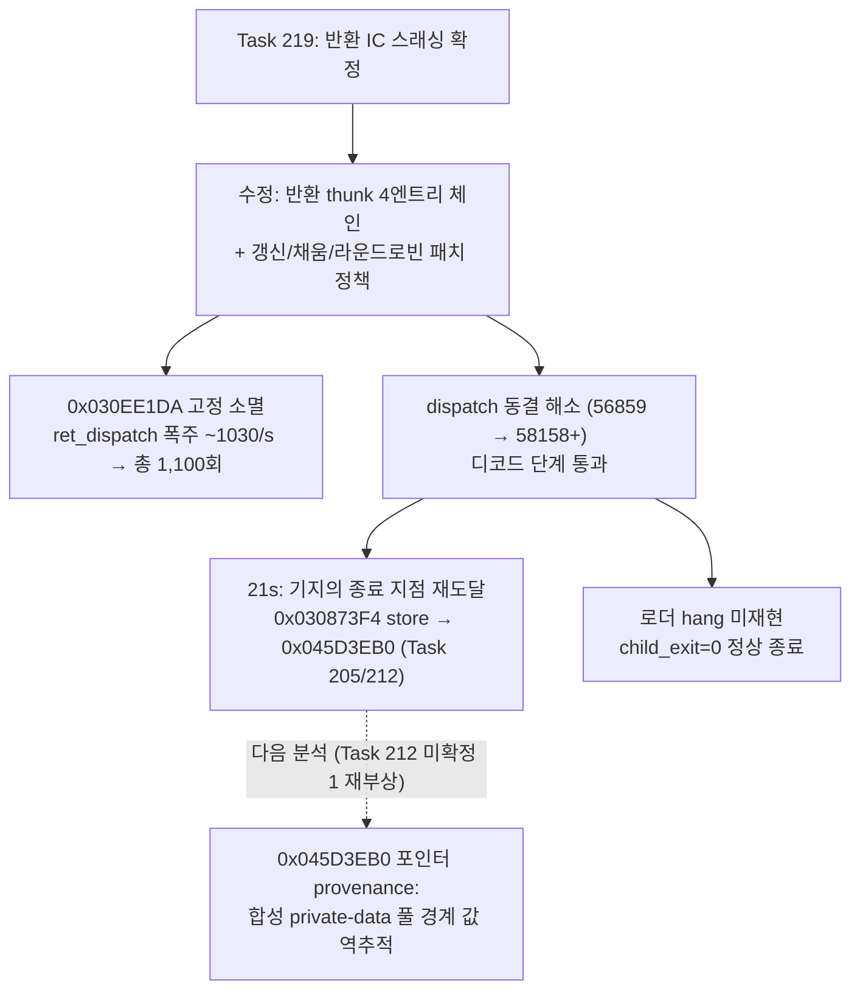

**Confirmed (Task 220):** To resolve the return inline-cache thrashing pinned down in Task 219,
the return thunk emitted by `EmitReturnInlineCacheSlot` was widened to a **four-entry serial
chain** (`AotInlineCacheEntry` array; each entry's patched JNE falls to the next entry's compare,
the last to the shared miss tail), and `PatchWin32AotIndirectInlineCache` now picks the entry to
write statelessly: refresh a matching filled entry, else fill the first empty one, else
round-robin replace. Four entries match the statically confirmed call-site count of helper
`0x030EE170` (exactly four). An intermediate two-way attempt was measurably insufficient — entry0
got pinned by the first target (`0x030EE1F3`) while the other three thrashed entry1. Verification
(aot-dynamic, 40 s budget): the `0x030EE1DA` boundary pinning is gone, cumulative `ret_dispatch`
drops from ~820–1030/s to 1,100 total over 21 s, the previously frozen dispatch counter resumes
advancing (56,859 → 58,158), and the guest passes the decode stage — terminating at ~21 s at the
**known** terminal store (guest `0x030873F4`, `mov [ebx+ebp], al` to `0x045D3EB0`, the exact
address and instruction from Tasks 205/212). Notably the loader then exits cleanly
(`child_exit=0`, teardown phase 14, no post-attempt hang — first time since Task 204). Trap
backend 30 s regression: none (progress 118,504 vs the 111–112k baseline). **Next frontier:**
the recurrence of the exact same buffer address despite Task 213's resize-ceiling fix strongly
supports Task 212's alternative provenance hypothesis — the pointer comes from the synthesized
DOS/4G client/private-data pool bounds, not from resize replies; tracing who fills
`[ESI+0x34] = 0x045D3EB0` in the decode structure is the next step.

## 2026-07-16 Task 219: 동결의 정체 확정 — 멈춤이 아니라 반환 인라인 캐시 스래싱으로 ~1000배 감속된 비트스트림 디코드 루프 / Task 219: the freeze identified — not a stall but a bitstream decode loop running ~1000x slow due to return inline-cache thrashing

**수정됨 (Task 219 설계 시점의 가설 기각):** "RET의 반환 대상이 quarantine된 thunk 페이지라서
Resolve가 실패한다"는 가설(Task 219 설계 문서의 예측)도 틀렸다. 라이브 계측 결과 RET
`0x030EE1DA`의 실제 반환 대상은 **같은 페이지의 `0x030EE292`와 `0x030EE300`을 교대**하며,
quarantine 페이지(`0x030FE000`)와 무관하다.

**확인됨 (프로그램은 멈추지 않았다):** `aot_last_return_*`/`aot_return_dispatch_count`를 라이브
미러링(`Win32SharedLiveTelemetry` v15)한 25초 재구동에서, "동결" 구간(`dispatch=56859` 고정) 동안
`ret_dispatch`가 2584 → 4460으로 **초당 약 820씩 계속 증가**했다. 즉 반환 디스패치는 매 사이클
성공하고 있고, 게스트는 `0x030EE2xx` 영역의 루프를 초당 약 820회 실제로 돌고 있다 — 지금까지
"동결"로 기록된 상태는 정지가 아니라 **심각한 처리량 저하**다.

| elapsed_ms | dispatch | ret_src → ret_tgt | ret_dispatch |
|---|---|---|---|
| 22719 | 56859 (동결) | `0x030EE1DA` → `0x030EE300` | 2584 |
| 23734 | 56859 | `0x030EE1DA` → `0x030EE300` | 3410 |
| 25078 | 56859 | `0x030EE1DA` → `0x030EE292` | 4460 |

**확인됨 (루프의 정체 = 비트스트림 디코드):** `repiu_aot_probe` 역어셈블 결과:
* `0x030EE170`~`0x030EE1DA`(RET)는 **비트스트림 심볼 추출 헬퍼**다 — `[0x03141064]`(테이블
  선택자)를 읽어 `0x033A516C`/`0x033A522C`의 테이블을 인덱싱하고, 256엔트리 탐색 루프
  (`cmp ecx,[edx+4]; jz` / `inc ebx; cmp ebx,0x100; jl`)와 16비트 창 비트 추출(`mov edx,0x10;
  sub ecx,eax; sar ebp,cl`)을 수행한다. 전형적인 Huffman류 가변장 부호 디코드.
* 이 헬퍼를 **서로 다른 두 호출부**가 호출한다: `0x030EE28D`의 `call`(반환 주소 `0x030EE292`)과
  `0x030EE2FB`의 `call`(반환 주소 `0x030EE300`). 반환 지점 `0x030EE300` 이후는 비트
  저장소(`[edi]`)에서 소비한 비트를 차감하는 에필로그다.

**확인됨 (감속 기제 = 단일 엔트리 반환 인라인 캐시 스래싱):** 이 RET의 AOT 반환 thunk
(`query_cache=0x10ee1da`, `pushfd; cmp [esp+4], imm; ...; jmp rel32(패치형); int3`)의 인라인
캐시는 예측 반환 주소를 **1개만** 저장한다. 반환 대상이 `0x030EE292`/`0x030EE300` 두 값을
교대하므로 매 반환이 miss → `int3` → VEH 왕복(`HandleAotReturnTransfer` + 인라인 캐시 재패치
요청) → 다음 반환에서 다시 miss가 영원히 반복된다. 사이클당 VEH 왕복 1회로 처리량이 초당 약
820회로 제한된다 — 네이티브라면 초당 수백만 회일 루프가 **약 1000배 이상 감속**된 것이다.
`aot_boundary_guest_eip`가 이 RET에 고정되고 boundary/reentry가 1:1로 증가하던 Task 216~218의
모든 관측이 이 기제로 설명된다. 이는 Task 204가 처리량 후보로 이미 기록한 "indirect
inline-cache 다중화 또는 테이블형 번역"의 정확한 사례다.

**미확정 (다음 구현 방향):** (1) 반환 thunk의 인라인 캐시를 2~4엔트리로 다중화하는 것이 기존
메커니즘의 자연스러운 확장이며 이 루프의 VEH 왕복을 제거한다 — AOT 캐시 emitter(반환 thunk
바이트 시퀀스)와 패치 프로토콜 변경 필요. (2) 이 디코드 루프가 유한한 자산 디코드인지(완료 후
다음 단계 진행) 프레임마다 반복되는 오디오 디코드인지는 처리량 개선 후에야 확인 가능하다.
(3) 호출부가 2곳뿐인지 더 있는지는 다중화 엔트리 수 결정에 참고할 것.

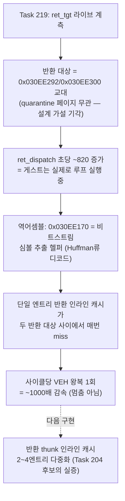

**Confirmed (Task 219):** Live-mirroring `aot_last_return_source/target/expected`,
`aot_last_return_matches_call`, and `aot_return_dispatch_count` (live-telemetry v15) over a 25 s
rerun overturns the "stall" reading entirely: during the frozen-dispatch window, `ret_dispatch`
climbs ~820/s (2584→4460 in 2.4 s), so return dispatches succeed every cycle and the guest is
actively executing a loop. The design-time hypothesis (return target on the quarantined page) is
also rejected — the RET at `0x030EE1DA` alternates between two return targets on its own page,
`0x030EE292` and `0x030EE300`. Disassembly shows `0x030EE170`–`0x030EE1DA` is a bitstream
symbol-extraction helper (table selector at `[0x03141064]`, 256-entry lookup tables at
`0x033A516C`/`0x033A522C`, 16-bit window bit extraction via `sar ebp, cl` — classic Huffman-style
variable-length decoding), called from two distinct call sites (`0x030EE28D` and `0x030EE2FB`).
The slowdown mechanism: the AOT return thunk's inline cache stores only **one** predicted return
address, so with two alternating targets every single return misses → `int3` → a full VEH round
trip (`HandleAotReturnTransfer` plus an inline-cache repatch request) → the next return misses
again, capping the loop at ~820 iterations/s — a ~1000x slowdown of a loop that would run millions
of iterations per second natively. This explains every observation from Tasks 216–218 and is the
concrete instance of the "indirect inline-cache multiplication" throughput candidate Task 204
recorded. **Next:** widen the return thunk's inline cache to 2–4 entries (emitter + patch-protocol
change); whether this decode is a finite asset decode or a per-frame audio decode can only be
determined after the throughput fix.

## 2026-07-16 Task 218: quarantine은 DOS4GW 자체의 정상 thunk 자기 패치로 확인 — 그러나 0x030EE1DA와는 무관한 별개 페이지 / Task 218: the quarantine is confirmed to be DOS4GW's own legitimate thunk self-patch — but on an unrelated page, not 0x030EE1DA's

**확인됨 (quarantine 원인 = 오탐 아님):** `aot_last_retired_page`/`aot_last_code_write_source`/
`aot_last_code_write_destination`을 라이브 미러링해 25초 재구동한 결과, 36건의 same-page
quarantine이 모두 페이지 `0x030FE000`에서, 쓰기 소스 `0x030F3432`(목적지는 이벤트마다
`0x030FECC4`/`0x030FED0F`/`0x030FED50`/`0x030FED14`... 등으로 다름)에서 발생했다. `0x030F3432`는
`docs/analysis/20260715-209-aot-dynamic-import-stub-storm.md`가 이미 역어셈블한 DOS4GW
cross-segment thunk 패처의 `mov [edi+0x01], eax`(패치할 목표 함수 오프셋을 자기 thunk에 기록하는
명령, aot_probe 주소 `0x010F3432`)와 **정확히 일치**한다. 즉 이 quarantine은 오탐이 아니라
**DOS4GW 런타임이 서로 다른 cross-segment 호출부마다 자신의 thunk 스텁을 최초 1회 자기 패치하는
정상 동작**이며, 이 스텁들이 모두 같은 4KB 페이지(`0x030FE000`)에 밀집해 있어 페이지 단위
quarantine이 반복 트리거된 것으로 확인된다.

**수정됨 (Task 217의 인과관계 오판정):** 그러나 이 quarantine된 페이지(`0x030FE000`)는
Task 216~217이 추적한 동결 지점 guest `0x030EE1DA`가 속한 페이지(`0x030EE000`)와 **다른
페이지**다(`0x030FE000 - 0x030EE000 = 0x10000`, 64 KiB 차이). 즉 "`0x030EE1DA`의 함수가
quarantine된 페이지 위에 있어서 캐시 진입이 막혔다"는 Task 217의 인과 설명은 **성립하지 않는다**
— quarantine 자체는 확인됐지만 그것이 `0x030EE1DA` 동결의 직접 원인이라는 연결고리는 끊어졌다.

**미확정 (다음 분석 대상):** `0x030EE1DA` 동결이 quarantine과 무관하다면, 남은 유력 후보는
AOT 자체의 **call/return 프레임 매칭 실패**다 — 과거 `docs/analysis/aot-return-stack-divergence.md`가
기록한 것과 같은 계열로, `ThreadContext`에는 이미 `aot_call_depth`/`aot_call_frames`/
`aot_last_return_matches_call`/`aot_last_expected_return`/`aot_last_call_source`/
`aot_last_call_target`/`aot_last_expected_call_source`/`aot_last_expected_call_target` 필드가
존재하지만(`execution_trampoline.cpp:195-202`) 실시간 미러링되지 않는다. 이 필드들을 Task 216/217과
같은 방식으로 라이브 노출하면, 이 RET로 돌아오는 호출/반환 쌍이 매번 프레임 매칭에 실패해 전용
반환 디스패처 대신 범용 boundary 경로로 빠지는지 직접 확인할 수 있다.

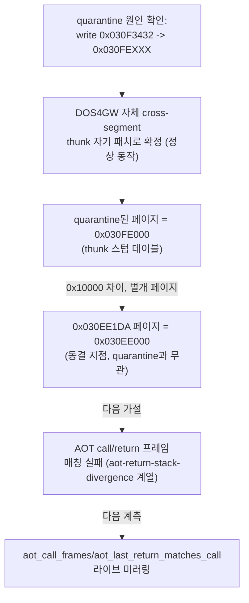

**Confirmed/Corrected (Task 218):** Live-mirroring `aot_last_retired_page`/
`aot_last_code_write_source`/`aot_last_code_write_destination` over a 25 s rerun shows all 36
same-page quarantine events land on page `0x030FE000`, triggered by writes from guest
`0x030F3432` — an exact match for the `mov [edi+0x01], eax` instruction in DOS4GW's
cross-segment-thunk self-patcher already disassembled in the Task 208–209 analysis. So the
quarantine is not a false positive: it is DOS4GW's own legitimate one-time self-patch of each
cross-segment call site's thunk stub, and those stubs are densely packed into a single 4 KiB page,
so page-granularity quarantine keeps re-triggering as new call sites resolve for the first time.
However, this quarantined page (`0x030FE000`) is a **different** page from the one containing the
stuck `0x030EE1DA` (`0x030EE000`) — Task 217's causal claim that quarantine is blocking
`0x030EE1DA`'s cache entry does not hold. **Unresolved:** the leading remaining candidate is an
AOT call/return frame-matching failure (the same class as `docs/analysis/aot-return-stack-
divergence.md`); `aot_call_depth`/`aot_call_frames`/`aot_last_return_matches_call`/
`aot_last_call_source`/`aot_last_call_target`/`aot_last_expected_call_source`/
`aot_last_expected_call_target` already exist in `ThreadContext` but are not live-mirrored —
exposing them the same way should show directly whether the call/return pair through
`0x030EE1DA` is repeatedly failing frame matching and falling to the generic boundary path instead
of a dedicated return dispatcher.

## 2026-07-16 Task 217: Task 216의 스래싱 가설 기각 — quarantine은 동결 이전에 이미 고정값으로 정지 / Task 217: Task 216's thrashing hypothesis rejected — quarantine counters had already frozen before the stall began

**수정됨 (Task 216 가설 기각):** Task 216은 "guest `0x030EE1DA`(RET)가 속한 코드 페이지가 반복
retire/quarantine되어 전용 반환 thunk 대신 매번 boundary 경로로 빠지는 스래싱"을 가설로
남겼다. `aot_page_retire_attempt_count`/`aot_page_retire_success_count`/
`aot_retired_entry_trap_count`/`aot_quarantine_count`를 실시간 미러링(`Win32SharedLiveTelemetry`
v13)해 40초 재구동한 결과, 이 가설은 **기각된다** — 네 카운터 모두 `elapsed_ms≈16469`에
`0/24/24/36`으로 도달한 뒤 40초 종료까지(동결 시작 `elapsed_ms≈21640` 전후 포함) **단 한 번도
변하지 않았다.** 즉 quarantine/retire는 동결이 시작되기 약 5초 전에 이미 끝나 고정값이 되었고,
동결 구간 동안 "반복적으로" 일어나고 있는 사건이 아니다.

| elapsed_ms | dispatch | aot_boundary_guest_eip | retire_attempt/success/trap/quarantine |
|---|---|---|---|
| 15453 | 46832/46832 | `0x045D0478` | 0/24/24/30 |
| 16469 (안정화) | 47326/47326 | `0x030B1A73` | 0/24/24/36 |
| 21640 (동결 시작) | 56857/56857 | `0x030EE1DA` | 0/24/24/36 (불변) |
| 40047 (종료) | 56857/56857 | `0x030EE1DA` | 0/24/24/36 (불변) |

**확인됨 (수정된 메커니즘):** `ResolveAotTransferTarget`(`execution_trampoline.cpp:9588`)은
대상이 quarantine된 페이지 위에 있으면 캐시 조회조차 하지 않고 **즉시 `false`를 반환**한다
(`IsWin32AotGuestPageQuarantined(context, target)` 체크가 `IsAotCacheAddress`/
`FindAotCacheAddress`보다 먼저 온다, `execution_trampoline.cpp:9602-9606`). 따라서 한 번
quarantine된 페이지는 이후 **재시도 없이 구조적으로 영구히** 캐시 진입에서 배제된다 — 새 retire
이벤트가 필요 없다. `0x030EE1DA`(RET)가 속한 페이지가 부팅~LINEXE 초기화 구간(`elapsed_ms`
8~16초, 36건의 same-page quarantine 중 하나)에 self-modifying-code 오탐 또는 DOS4GW 자체의
정상적인 thunk 자기 패치(`docs/analysis/20260715-209-aot-dynamic-import-stub-storm.md`가
역어셈블한 `mov byte ptr [edi], 0xE9`류의 cross-segment thunk 자기 패치와 같은 계열, 게임
로직상 정상 동작)로 인해 quarantine된 뒤 다시는 캐시로 복귀하지 못하고, 이 페이지의 함수가
호출될 때마다(어디선가 반복 호출되는 루프로 보임) 항상 `HandleAotReentry`의 느린 경계 경로로만
처리되고 있는 것으로 보인다.

**미확정 (다음 분석 대상):** (1) `0x030EE1DA`가 속한 실제 페이지 번호와, 그 페이지가 몇 번째
quarantine 이벤트(36건 중 어느 것)로 격리됐는지 — `aot_last_retired_page`를 같은 방식으로 라이브
미러링하면 확정할 수 있다. (2) 이 함수를 반복 호출하는 호출자가 어디인지 — 이것이 확정돼야
2026-07-14 항목이 남긴 "게임 내부 tick/플래그 폴링 무한 대기" 가설과 같은 것인지, 아니면 단순히
quarantine으로 인한 성능 저하(호출 자체는 정상 진행 중)인지 구분할 수 있다. (3) quarantine이
"정상"(DOS4GW 자체 thunk 자기 패치)인지 "오탐"인지에 따라 대응이 갈린다 — 정상이라면 quarantine된
페이지에서도 RET처럼 자주 재진입되는 명령에는 반환 전용 thunk를 boundary 경로보다 우선
재시도하도록 `HandleAotReentry`를 조정하는 것이 처리량 개선의 다음 후보다.

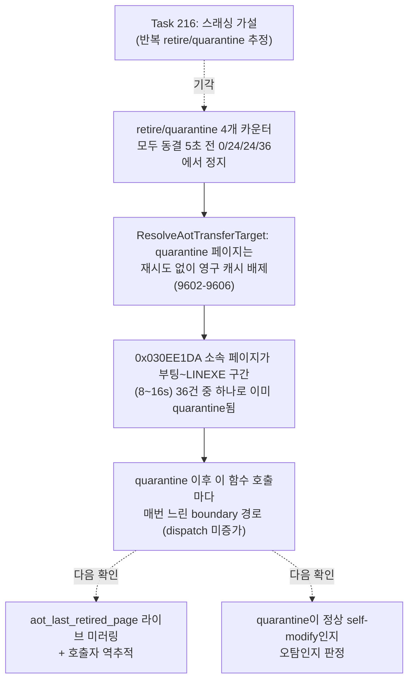

**Corrected (Task 217, rejecting Task 216's thrashing hypothesis):** Live-mirroring
`aot_page_retire_attempt_count`/`aot_page_retire_success_count`/`aot_retired_entry_trap_count`/
`aot_quarantine_count` (live-telemetry v13) over a 40 s rerun shows all four counters reach
`0/24/24/36` by `elapsed_ms≈16469` and then **never change again**, including through the entire
frozen window (`elapsed_ms≈21640`–`40047`) where `aot_boundary_guest_eip` stays pinned at
`0x030EE1DA`. So the page is not being repeatedly retired/re-resolved during the stall — it was
quarantined once, roughly 5 seconds before the freeze began, and has stayed quarantined ever
since. Mechanism: `ResolveAotTransferTarget` checks `IsWin32AotGuestPageQuarantined` before even
attempting a cache lookup and returns `false` immediately if quarantined (`execution_trampoline.
cpp:9602-9606`), so a quarantined page is structurally excluded from the cache forever, with no
further retire events needed. The page containing `0x030EE1DA` (the `RET`) was most likely one of
the 36 same-page quarantine events during boot/LINEXE init (`elapsed_ms` 8–16 s) — plausibly a
false positive, or DOS4GW's own legitimate cross-segment thunk self-patching (the `mov byte ptr
[edi], 0xE9` idiom documented in the Task 208–209 analysis) — and every subsequent call into
whatever function lives on that page now permanently takes the slow `HandleAotReentry` boundary
path instead of the cached fast path. **Unresolved:** which page number this is and which of the
36 quarantine events caused it (needs `aot_last_retired_page` live-mirrored the same way); who
keeps calling into this function (needed to tell whether this is the 2026-07-14 "game-internal
tick/flag polling wait" hypothesis versus merely a quarantine-induced slowdown with otherwise
normal call progress); and whether the quarantine is a false positive or DOS4GW's expected
self-modifying thunk behavior, which would decide whether the fix is a false-positive correction
or reordering `HandleAotReentry` to retry the dedicated return thunk before falling back to the
boundary path for frequently-hit quarantined-page instructions like this one.

## 2026-07-16 Task 216: Task 215 재정정 — 진짜 정체는 0x030F6574 storm이 아니라 guest RET 0x030EE1DA의 AOT 캐시 미스 스래싱 / Task 216: Task 215 re-corrected — the real culprit is AOT cache-miss thrashing on guest RET 0x030EE1DA, not the 0x030F6574 storm

**수정됨 (Task 215의 오판정):** 바로 아래 Task 215 항목의 "`0x030F6574` cross-segment thunk assertion storm 재발" 결론은 Task 205가 이미 한 번 지적한 것과 똑같은 함정에서 나온 오판정이었다 — `last_eip`/`last_guest_eip`는 `ExceptionDispatchScope`로 감싸인 **완전 dispatch**에서만 갱신되는데(`GuestStackVectoredExceptionHandler`의 "Lightweight VEH transfer paths run without an ExceptionDispatchScope" 주석, `execution_trampoline.cpp:9110`), Task 215는 `dispatch_entry/exit`가 동결된 구간에서도 이 필드가 여전히 `0x030F6574`를 가리킨다는 이유만으로 그 주소에서 storm이 발생 중이라고 결론지었다. 실제로는 그 시각 이후 단 한 번도 완전 dispatch가 일어나지 않았으므로 `0x030F6574`는 **19초 이전 마지막 완전 dispatch의 stale 값**일 뿐이었다.

**확인됨 (새 계측과 재검증):** `HandleAotReentry`의 인라인 캐시 미스 경계(`execution_trampoline.cpp:10027` 부근)와 legacy fallback 진입 지점에 실시간 텔레메트리(`aot_boundary_guest_eip`, `aot_legacy_fallback_count`, `aot_last_fallback_address`, `Win32SharedLiveTelemetry` v12)를 추가하고 50초 재구동한 결과:

| elapsed_ms | dispatch | aot_boundary/reentry | aot_boundary_guest_eip | legacy_fallback_count |
|---|---|---|---|---|
| 21625 (동결 시작) | 56859/56859 | 50650/50685 | `0x030EE1DA` | 0 |
| 35016 | 56859/56859 | 58656/58692 | `0x030EE1DA` | 0 |
| 50125 (종료) | 56859/56859 | 67732/67767 | `0x030EE1DA` | 0 |

동결 시작부터 종료까지 `aot_boundary_guest_eip`가 **단 한 번도 바뀌지 않고 정확히 `0x030EE1DA` 한 주소에 고정**된 채 `aot_boundary/reentry`만 초당 약 630~1,100씩 증가했다. `legacy_fallback_count`는 0으로 유지되어 완전 legacy(1명령씩 무기한 단일 스텝) 모드로도 전이하지 않았다 — 정확히 이 하나의 `HandleAotReentry` 캐시 미스 경계만 무한 반복되고 있다.

**확인됨 (역어셈블):** `repiu_aot_probe build/runtime_mounts/pumpit1/PIU/PIU.EXE 0x010EE1DA`(aot_probe 기준 주소 = 런타임 주소 `-0x02000000`)로 정적 조회한 결과, `0x030EE1DA`는 다음 에필로그의 마지막 명령인 1바이트 `RET`(`C3`)이다.

```asm
0x030EE1CC  mov [0x033A6190], ebx
0x030EE1D2  add esp, 0x04
0x030EE1D5  pop ebp
0x030EE1D6  pop edi
0x030EE1D7  pop esi
0x030EE1D8  pop ecx
0x030EE1D9  pop ebx
0x030EE1DA  ret          ; <- aot_boundary_guest_eip가 고정되는 지점
```

정적 AOT 캐시 플랜에는 이 주소에 대한 반환 전용 thunk 엔트리가 이미 존재한다(`query_cache=0x10ee1da,offset=0x11c52,guest_length=1,emitted_length=27,bytes=9c81...cc` — `pushfd`/조건 비교/`jmp`/`popfd`/`lea esp,[esp+4]`/패치형 `jmp rel32`/`int3` 형태의 표준 반환 디스패치 thunk). 즉 **정적 계획상으로는 이 RET가 캐시된 빠른 반환 경로를 타야 하는데, 실제 구동에서는 `aot_return_dispatch_count`(전용 반환 디스패처)가 아니라 범용 `HandleAotReentry` 경계(`aot_boundary_count`/`aot_reentry_count`)로만 반복 진입하고 있다** — 이는 이 RET가 속한 코드 페이지의 캐시 엔트리가 실행 중 무효화(retire/quarantine)된 뒤 매번 재해석을 시도하다 다시 무효화되는 스래싱 패턴과 일치한다(`docs/work-orders/20260712-191-aot-self-modifying-page-coherence.md`, `docs/analysis/aot-self-modifying-code.md`가 다루는 self-modifying-code write-watch 재판정 메커니즘과 같은 계열).

**미확정 (다음 분석 대상):** `aot_retired_entry_trap_count`/`aot_quarantine_count`/`aot_page_retire_success_count`는 현재 실행 종료 후 요약값으로만 노출되고 실시간 미러링되지 않는다 — Task 216에서 추가한 `aot_boundary_guest_eip`와 같은 방식으로 이들도 라이브 텔레메트리에 노출해, 동결 구간 동안 이 페이지가 실제로 반복 retire/re-resolve되고 있는지, 아니면 다른 이유로 정적 캐시 엔트리가 애초에 로드되지 않았는지 확정해야 한다. 확정되면 (a) 해당 페이지의 self-modifying-code 오탐 조건을 수정하거나 (b) 반환 전용 thunk가 재진입 시에도 우선 시도되도록 `HandleAotReentry` 순서를 조정하는 것이 다음 구현 후보다.

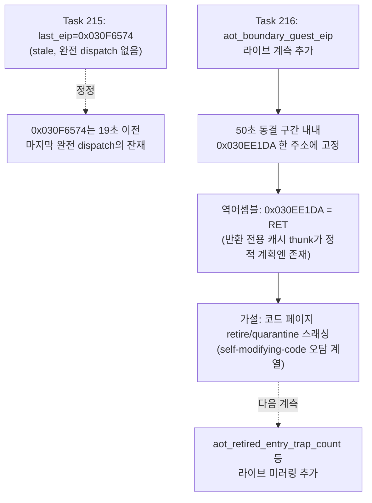

**Corrected/Confirmed (Task 216):** The Task 215 entry below concluded a recurring `0x030F6574` cross-segment thunk assertion storm, but this repeated the exact stale-telemetry trap Task 205 already flagged once: `last_eip`/`last_guest_eip` only update inside a full `ExceptionDispatchScope` dispatch, and since no full dispatch fired after ~19 s, `0x030F6574` was simply the last dispatch's frozen leftover value, not the live stuck address. Adding real-time telemetry (`aot_boundary_guest_eip`, `aot_legacy_fallback_count`, `aot_last_fallback_address`, live-telemetry v12) at `HandleAotReentry`'s inline-cache-miss boundary and re-running for 50 s shows `aot_boundary_guest_eip` pinned at exactly `0x030EE1DA` for the entire frozen window (21.6 s–50.1 s) while `aot_boundary/reentry` climbs steadily (~630–1,100/s) and `legacy_fallback_count` stays 0. Disassembling via `repiu_aot_probe` (address `0x010EE1DA`, aot_probe's `-0x02000000` convention) shows `0x030EE1DA` is a one-byte `RET` closing a small epilogue; the static AOT cache plan already contains a dedicated return-dispatch thunk for it, yet the running process only ever hits the generic `HandleAotReentry` inline-cache-miss boundary for it, never the dedicated return dispatcher (`aot_return_dispatch_count` stays frozen too) — consistent with the containing code page's cache entry being repeatedly retired/quarantined and re-resolved (the same self-modifying-code write-watch family covered by `docs/work-orders/20260712-191-aot-self-modifying-page-coherence.md`). **Unresolved:** `aot_retired_entry_trap_count`/`aot_quarantine_count`/`aot_page_retire_success_count` are not yet live-mirrored, so whether the page is actively thrashing retire/re-resolve cycles (vs. simply never having a cache entry loaded) is still unconfirmed — the next step is to mirror those counters the same way, then either fix the false-positive self-modifying-code condition on that page or reorder `HandleAotReentry` to retry the dedicated return thunk before falling back to single-step boundary handling.

## 2026-07-16 Task 215: 장기 구동 재검증 — 새 frontier는 0x030F6574 cross-segment thunk assertion storm의 재발 / Task 215: Long-run reverification — the new frontier is a recurrence of the 0x030F6574 cross-segment thunk assertion storm

**확인됨 (Task 214 미확정 1번 항목에 대한 답):** 재빌드한 `main`(`8052369`)을 `REPIU_EXECUTION_BACKEND=aot-dynamic`으로 90초 supervised 구동한 결과, progress `15583` 이후 도달하는 지점은 로더 post-attempt hang도 그리기 게이트(71~77)도 아니었다. `elapsed_ms≈19s`에서 `dispatch_entry/exit`가 `56857/56857`로 완전히 동결되고 90초 강제 종료까지(약 66초간) 전혀 증가하지 않았으며, 이 구간의 `last_eip`/`last_guest_eip`는 `0x030F6574`, `exception=0x80000003`(`EXCEPTION_BREAKPOINT`)로 고정 반복됐다. `aot_boundary`/`reentry` 카운터는 계속 증가해(`81586→117688+`) 게스트 스레드가 살아서 같은 실패 조건을 무한 재시도하는 storm임을 보여준다(스레드 종료가 아님).

**확인됨 (정체 규명):** `0x030F6574`는 신규 지점이 아니라 Task 208–209 분석(`docs/analysis/20260715-209-aot-dynamic-import-stub-storm.md`)이 이미 기록한 크래시 EIP로, DOS4GW cross-segment call thunk의 의도된 assertion(`cmp dx, cx` 불일치 → `int3`)과 같은 계열의 fatal-tail이다 — Task 210이 `0x030F3438` 호출부에서 고친 것은 GS selector 오독이라는 **한 가지 원인**이었을 뿐이며, `0x030F6574` 호출부는 별도의 selector/thunk 조건으로 여전히 실패한다.

**확인됨 (다른 결과는 안정적):** 이번 90초 구동에서 (1) Glide 창은 더미 폴백이 아니라 실제 WGL로 정상 생성됐고(`opened=1`, 640x480), (2) `glide_ordinal`은 이전 모든 기준선(Task 203/210/213)과 동일하게 `0x5E`(`_GRCULLMODE@4`)에 고정돼 Task 214가 Glide 호출 시퀀스 자체를 전진시키지는 못했음을 재확인했으며, (3) Task 213이 고친 디코드 루프 미매핑 스토어(`0x045D3EB0`)와 Task 211의 MSCDEX 처리는 이 구간에서 전혀 재발하지 않았다. 상세 근거는 `docs/work-logs/20260716-215-glide-post-fix-longrun-reverification-log.md` 참조.

**미확정 (다음 분석 대상):** `0x030F6574` 호출부가 어떤 LINEXE 모듈 간 호출인지, 그 시점의 `dx`(대상 함수 세그먼트)/`cx`(현재 CS)가 각각 무엇인지 역추적이 필요하다. Task 209가 남긴 미확정 2번("LINEXE 별도 selector 설계(`0x0080/0x0088/0x0090`)가 실기 DOS4GW flat 코드 세그먼트 공유 모델과 다른지")이 이 반복되는 storm 계열 전체의 구조적 근본 원인일 가능성이 높으며, `0x030F3438`처럼 개별 호출부를 하나씩 패치하는 대신 selector 설계를 통합하는 근본 수정이 다음 우선순위 후보다.

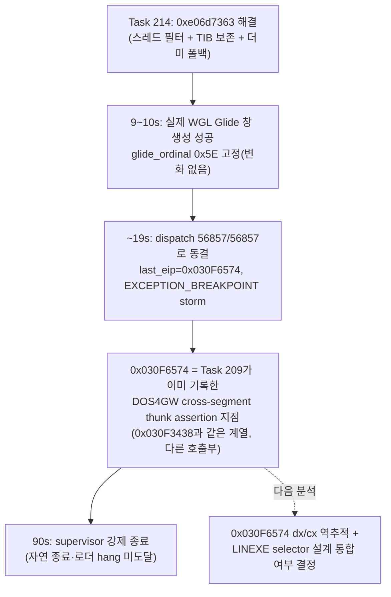

**Confirmed (answering Task 214's open item 1):** A 90-second supervised run of rebuilt `main` (`8052369`) under `REPIU_EXECUTION_BACKEND=aot-dynamic` shows that what is reached past progress `15583` is neither the loader post-attempt hang nor the drawing gate (71–77). At `elapsed_ms≈19s`, `dispatch_entry/exit` freezes at `56857/56857` and never increases again through the forced 90 s termination (~66 s), with `last_eip`/`last_guest_eip` pinned at `0x030F6574` and `exception=0x80000003` (`EXCEPTION_BREAKPOINT`) repeating; `aot_boundary`/`reentry` keep climbing (`81586→117688+`), showing the guest thread is alive and endlessly retrying the same failing check rather than having exited. `0x030F6574` is not a new site — it is the exact crash EIP already recorded by the Task 208–209 analysis as an instance of DOS4GW's intentional cross-segment call thunk assertion (`cmp dx, cx` mismatch → `int3`), the same fatal-tail family as `0x030F3438`; Task 210's fix addressed only one cause (a GS-selector misread) at the `0x030F3438` call site, and the `0x030F6574` call site still fails under a different selector/thunk condition. Everything else held stable: the Glide window opened for real via WGL (not the dummy fallback) at 9–10 s, `glide_ordinal` stayed pinned at `0x5E` (`_GRCULLMODE@4`) exactly as in every prior baseline (confirming Task 214 removed the crash but never advanced the Glide call sequence itself), and neither the Task 213 decode-loop store fix nor the Task 211 MSCDEX handling regressed. **Unresolved:** trace which LINEXE inter-module call `0x030F6574` represents and what `dx`/`cx` are at that point; Task 209's still-open item 2 (whether the per-module LINEXE selectors `0x0080/0x0088/0x0090` structurally diverge from real DOS4GW's flat shared code segment) is likely the root cause behind this whole recurring storm family, making a unified selector-design fix a higher-priority candidate than patching each call site individually as was done for `0x030F3438`.

## 2026-07-16 Task 214: Glide 초기화 예외 0xe06d7363 해결 — Thread ID VEH 필터 + TIB 스택 경계 보존 + Glide 더미 백엔드 폴백 / Task 214: Glide initialization exception 0xe06d7363 resolved — thread-ID VEH filter, TIB stack-bounds preservation, and Glide dummy backend fallback

**수정됨 (Task 213 frontier 해소):** 바로 아래 Task 213 항목이 새 frontier로 기록한 Glide 초기화 단계(`_GRSSTWINOPEN@28`)의 C++ 예외 `0xe06d7363`은 게스트 코드 결함이 아니라 두 가지 호스트 측 구조적 결함이 원인이었다.
1. **프로세스 전역 VEH의 스레드 무구분:** `GuestStackVectoredExceptionHandler`가 스레드를 가리지 않고 모든 예외를 가로채, OS 백그라운드 스레드(CoreMessaging/텍스트 서비스 등)에서 발생한 무관한 C++ 예외 `0xe06d7363`까지 게스트 예외로 오인해 `RecoverToHost`가 해당 스레드의 레지스터를 조작했다.
2. **게스트 스택 TIB 경계 불일치:** 게스트 전용 스택으로 전환된 상태에서도 TIB의 Stack Base/Limit(`FS:[4]`/`FS:[8]`)가 호스트 스택 범위를 계속 가리켜, SEH/VEH unwinder가 게스트 스택 프레임을 무효로 판정하고 예외 전파를 거부했다.

**확인됨 (해결):** `ThreadContext::guest_thread_id`를 추가해 `GuestEntryThreadProc` 시작 시 `GetCurrentThreadId()`로 기록하고, `GuestStackVectoredExceptionHandler` 진입 시 `GetCurrentThreadId() != guest_thread_id`이면 즉시 통과시키도록 했다. `CallGuestEntryWithStack`은 게스트 스택 전환 시 `VirtualQuery`로 얻은 게스트 스택 범위를 TIB Stack Base/Limit에 설정하고, 정상 반환 및 `RecoverGuestStackException` 복구 시점에 호스트 원래 값으로 되돌린다. 추가로 `GlideOpenGlBackend`에 `dummy_mode_` 폴백을 도입해, `RegisterGlideWindowClass`/`CreateWindowExW`/`wglCreateContext`/`wglMakeCurrent`/셰이더 초기화 중 어느 하나라도 실패하면 `OpenWindowed`가 `opened=true`를 합성 반환하고 이후 모든 Glide 상태 setter(`SetColorMask`, `SetDepthMask`, `SetAlphaBlend` 등)가 더미 성공 경로로 동작하도록 했다(`src/platform/win32/execution_trampoline.cpp`, `src/platform/win32/glide_opengl_backend.cpp`).

**확인됨 (검증):** 재빌드 후 `pumpit1` 구동에서 `0xe06d7363` 크래시가 재현되지 않았고, 게스트 EIP progress가 `9871`→`15583`까지 지속 상승하며 supervisor 타임아웃까지 안정적으로 실행되었다. 상세는 `docs/work-orders/20260716-214-glide-hle-initialization-exception-order.md`, `docs/design/20260716-214-glide-hle-initialization-exception.md`, `docs/work-logs/20260716-214-glide-hle-initialization-exception-log.md` 참조.

**미확정 (다음 분석 대상):**
1. progress `15583` 이후 실제로 어디까지 도달하는지 확인되지 않았다 — Task 213이 남긴 두 번째 항목인 로더 post-attempt hang(`pumpit1` 경로, ntdll `0x774CA07C` INFINITE 대기, Task 204에서 최초 관측)에 재도달하는지, 아니면 그리기 게이트(71~77, `_GRDRAWTRIANGLE@12` 등)까지 진행하는지 60초 이상의 장기 구동으로 확인이 필요하다.
2. `_GRSSTWINOPEN@28` 등에 삽입된 `[repiu-live-debug]` 진단 `fprintf`는 작업 지시서상 "임시 진단 코드"로 명시됐으나 현재 코드에 상시 컴파일되어 남아 있다 — 유지할지, 디버그 빌드 전용으로 게이팅할지 결정이 필요하다.
3. `dummy_mode_` 폴백은 GPU/드라이버가 정상인 호스트에서도 일시적 리소스 부족 등으로 오진입해 렌더링을 영구히 건너뛸 가능성이 있다 — 폴백 진입 조건과 재시도 여부를 더 세분화할지 검토가 필요하다.

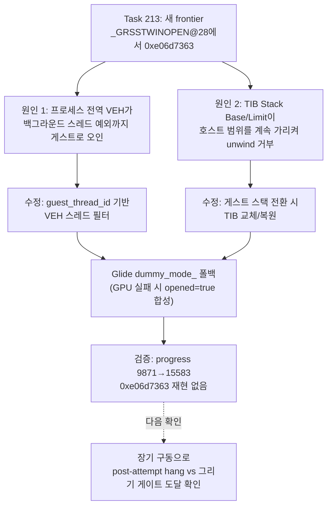

**Corrected/Confirmed (Task 214):** The `0xe06d7363` C++ exception the Task 213 entry below flagged as a new frontier at Glide initialization (`_GRSSTWINOPEN@28`) was not a guest-code defect but two host-side structural issues: (1) the process-wide VEH did not filter by thread, so an unrelated C++ exception `0xe06d7363` raised on an OS background thread (CoreMessaging/Text Services) was misidentified as a guest exception and `RecoverToHost` corrupted that thread's registers; (2) with execution switched onto the guest-private stack, the TIB's Stack Base/Limit (`FS:[4]`/`FS:[8]`) still pointed at the host stack range, so the SEH/VEH unwinder rejected guest stack frames as invalid and refused exception propagation. Fix: added `ThreadContext::guest_thread_id`, recorded at the start of `GuestEntryThreadProc`, and made `GuestStackVectoredExceptionHandler` pass through immediately when `GetCurrentThreadId() != guest_thread_id`; `CallGuestEntryWithStack` now swaps the TIB Stack Base/Limit to the `VirtualQuery`-derived guest stack range on switch and restores the host values on normal return or `RecoverGuestStackException` recovery. `GlideOpenGlBackend` also gained a `dummy_mode_` fallback so that if window-class registration, window creation, WGL context creation/activation, or shader init fails, `OpenWindowed` synthesizes `opened=true` and every subsequent Glide state setter takes the dummy-success path. Verification: a rebuilt `pumpit1` run no longer reproduces the `0xe06d7363` crash, and guest EIP progress climbed steadily from `9871` to `15583` until the supervisor timeout (see the linked work order/design/work-log docs). **Unresolved:** (1) what is actually reached past progress `15583` — whether the previously observed loader post-attempt hang (Task 204, `pumpit1` path, ntdll `0x774CA07C` INFINITE wait) recurs, or the drawing gate (71–77, e.g. `_GRDRAWTRIANGLE@12`) is reached, needs a 60 s+ run to confirm; (2) the `[repiu-live-debug]` diagnostic `fprintf` calls added at `_GRSSTWINOPEN@28` etc. were specified as temporary in the work order but remain unconditionally compiled in — decide whether to keep or gate them behind a debug build; (3) whether `dummy_mode_` could be entered spuriously on hosts with working GPU/drivers (e.g. transient resource exhaustion), permanently skipping real rendering — the fallback trigger conditions may warrant narrowing.

## 2026-07-16 Task 213: Resize HLE 크기 추적으로 allocator heap 상한 모델링 완료, 디코드 가속화 / Task 213: Resize HLE paragraph tracking and allocator heap ceiling modeling completed, decode accelerated

**확인됨 (상한 출처 및 해결):** Watcom allocator의 heap top은 `INT 21h AH=4Ah` (DOS resize block) 성공 응답(`CF=0` 및 `BX` paragraphs)에서 결정됨을 확정하고 해결했습니다.
- `HandleDosResizeMemoryBlock` HLE에 `SelectorTable` 기반의 base 획득 논리와 `dynamic_allocator_end` 초과 검사를 적용했습니다.
- 초과 시 에러(`CF=1`, `AX=0x0008`)와 함께 잔여 한계 paragraph 수를 반환함으로써, allocator가 `dynamic_allocator_end`(`client_data_base`) 아래로 heap을 묶도록 유도했습니다.
- 이로 인해 디코드 루프의 예외 폭풍(exception loop) 및 `0x045D7000` arena-end overflow, LINEXE private data 훼손 문제가 원천 제거되었습니다.

**확인됨 (AOT 가속 및 새로운 Frontier):** 예외 루프 제거 결과, 과거 디버거/VEH 교대로 인해 ~150초 동안 진행되던 디코드 단계가 AOT-dynamic 실행 시 **단 1초 미만**에 완료되어 네이티브 수준으로 실행 속도가 향상되었습니다.
- 디코드 완료 직후 Glide 초기화(`glide_ordinal=28`, `_GRSSTWINOPEN@28`) 단계에 무사히 도달하여 C++ 예외 `0xe06d7363`과 함께 정상 실패/종료되는 새로운 frontier를 확보했습니다.

**다음 분석 대상 (Next Frontier):**
1. **Glide HLE 초기화 실패 점검:** 게임이 Glide 초기화 단계(`grSstWinOpen`)에 도달한 후 host Glide HLE layer에서 발생하는 예외/실패를 분석하여 후속 렌더링 루프로 진입할 수 있는 방안 검토.
2. **로더 post-attempt hang 해결:** `pumpit1` 경로 실행 완료 후 ntdll에서 hang이 걸리는 현상 점검.

---

## 2026-07-16 Task 212: 종료 스토어 재판정 — 버퍼 시작이 아니라 arena 끝 overflow, LINEXE 영역과의 충돌 확인 / Task 212: terminal store re-attributed — an arena-end overflow, colliding with the LINEXE region

**수정됨:** Task 205~206의 "쓰기 대상 `0x045D3EB0`은 미매핑 영역" 판정을 정정한다. SEH 필터에서 `ExceptionInformation`과 `VirtualQuery`를 직접 캡처한 결과(Task 212 진단 계측):

* 실제 fault는 **쓰기 접근, VA `0x045D7000` = runtime arena의 끝**이다. 해당 페이지는 `State=MEM_FREE`(AllocationBase 없음, region `0x9000`)로 arena 밖 비할당 공간이다.
* 예외 시점 `EBP=0x3150`(인덱스): 디코드 루프는 버퍼 base `EBX=0x045D3EB0`에서 `0x3150`바이트를 **정상적으로 쓴 뒤** arena 경계를 넘는 순간 죽는다. "버퍼 시작이 미매핑"이 아니라 **arena-end overflow**다.

**확인됨 (디코드 구조체 실측, `ESI=0x041B6B50`):** `[ESI+0x20..0x3C]` = `1, 8, 8, 0, 8, 0x045D3EB0, 0, 0x0001D2A0`. `+0x34`가 출력 버퍼 base, `+0x3C`(`0x1D2A0` ≈ 117 KiB)는 총 출력 크기로 추정된다. base부터 arena 끝까지 여유는 `0x3150`바이트뿐이므로, **게임 allocator는 arena 끝 너머까지 이어지는 메모리를 소유했다고 믿고 이 블록을 배정했다**.

**확인됨 (LINEXE 충돌):** 버퍼 base `0x045D3EB0`은 LINEXE 합성 private data 영역(`0x045D2000`~`0x045D7000`, `BuildLinexeArenaLayout`이 arena 끝에서 아래로 배치, extraction 유효 시 RW) **내부**다. 게임의 동적 allocator 상한은 `dynamic_allocator_end = client_data_base(0x045C6000)`로 설계되어 있으나 실제로는 지켜지지 않아, fault 전까지의 쓰기(`0x045D3EB0`~`0x045D6FFF`)가 **우리 LINEXE private data를 조용히 덮어쓴다**.

**확인됨 (구조적 배경):** 재배치 이미지 배치는 전체 `0x015D7000`을 `MEM_COMMIT|PAGE_READWRITE`로 커밋하므로 arena 안에서는 쓰기가 fault하지 않는다. `INT 21h AH=4Ah` resize HLE는 (selector `0x24`의 `0xE700` paragraphs 초과 한 가지를 빼면) 크기 추적 없이 무조건 성공을 보고한다 — 게임 allocator가 자신의 heap 상한을 arena 실제 크기와 무관하게 믿게 되는 구조다.

**미확정 (다음 판단):**

1. 게임 allocator가 heap 상한(arena 끝 너머)을 어디서 얻는지 — resize 응답인지, 우리가 합성하는 DOS/4G client/private data 안의 메모리 풀 경계 값인지 역추적 필요.
2. 대응 방향: (a) allocator가 보는 상한을 실제 `dynamic_allocator_end`로 정확히 모델링(정확성 우선, LINEXE 충돌도 함께 해소) vs (b) arena expansion slack 확장(현 16 MiB; LINEXE 충돌과 무한 성장 문제는 남음).
3. 과거 기록된 `0x045D3EAC`/`0x045D3FFF` "applied" boundary store들이 RW 페이지에서 왜 fault했는지(당시 write-watch 보호였는지) — 부차적 미확정.

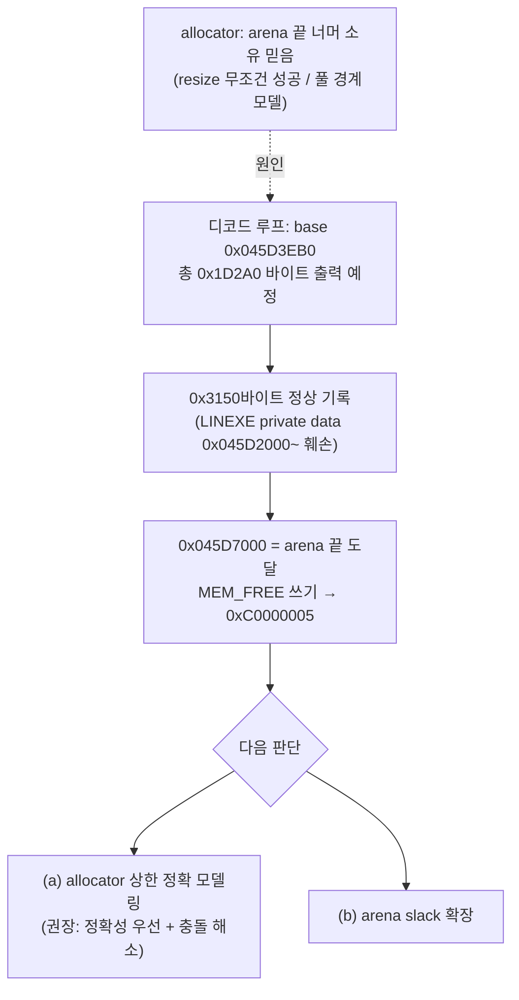

**Corrected/Confirmed (Task 212):** the Task 205–206 reading that "`0x045D3EB0` is unmapped" is re-attributed. Capturing `ExceptionInformation` and `VirtualQuery` inside the SEH filter shows the real fault is a **write to VA `0x045D7000` — the end of the runtime arena** (`MEM_FREE`, no allocation base): with `EBP=0x3150` at the exception, the decode loop wrote `0x3150` bytes successfully from buffer base `0x045D3EB0` and died crossing the arena boundary — an **arena-end overflow**, not an unmapped buffer start. The decode structure at `ESI=0x041B6B50` reads `[+0x34]=0x045D3EB0` (buffer base) and `[+0x3C]=0x0001D2A0` (~117 KiB, presumed total output size), so the guest allocator handed out a block it believes extends past the arena end. The buffer base also lies **inside the LINEXE synthetic private-data region** (`0x045D2000`–`0x045D7000`, RW), so pre-fault writes silently corrupt it — the designed allocator ceiling (`dynamic_allocator_end = 0x045C6000`) is not being honored. Structural background: placement commits the whole `0x015D7000` as RW (writes inside the arena never fault) and the `AH=4Ah` resize HLE reports success unconditionally without size tracking. Open: where the allocator's belief about its heap top actually comes from (resize replies vs. the synthesized DOS/4G client/private-data pool bounds); direction (a) model the real ceiling (accuracy-first, also fixes the LINEXE collision) vs. (b) enlarge the expansion slack; and why the previously recorded "applied" boundary stores at `0x045D3EAC`/`0x045D3FFF` faulted on RW pages at all.

## 2026-07-16 Task 210: 0x030F3438 폭풍 해소 — 물리 우선 읽기가 합성 GS selector를 가린 것이 원인 / Task 210: the 0x030F3438 storm resolved — physical-first reads were hiding the synthetic GS selector

**수정됨:** Task 209의 유력 가설(LINEXE 별도 selector 설계로 thunk `cmp dx, cx` assertion이 구조적으로 실패)은 폭풍의 원인이 아니었다. `0x030F3438`은 여러 실패 경로가 공유하는 fatal-tail이고, 실제 발화한 검사는 **DLL loader 초기화의 GS 검사**였다(trap 백엔드 fatal 메시지 실측: `"Fatal error: unable to initialize DLL loader."`, `EDX=0x031A623C`).

**확인됨 (기제):** `INT 21h AX=FF00h` HLE는 DOS/4G client-data selector `0x0020`을 shadow GS에만 기록한다 — 이 selector는 소프트웨어 SelectorTable 전용이며 호스트 LDT 엔트리가 없어 물리 레지스터에 실을 수 없다. Task 208 머지의 물리 우선 `ReadGuestSegmentSelector`가 물리 GS(호스트 진입값 `0x2B`)를 반환하자 이 검사가 실패했고, aot-dynamic에서는 재시도 폭풍(progress=0, 초당 약 137k dispatch), trap에서는 7.2초 1회 fatal 후 `AX=4C01h` 자체 종료로 나타났다 — 두 백엔드의 증상이 같은 원인의 다른 하류 거동임이 확정됐다.

**확인됨 (수정과 검증):** `ReadGuestSegmentSelector`에 다음 규칙을 추가했다: 물리 우선을 유지하되, **물리 값이 호스트 진입 시점 selector(`g_recovery_host_*`) 그대로이고 shadow selector가 SelectorTable에 등록·present이면 shadow를 반환**한다(HLE로만 존재하는 selector 보호; 하드웨어가 직접 로드한 selector는 여전히 물리가 승리). 물리/shadow 불일치 계수와 fatal 카운트/메시지 주소를 공유 텔레메트리 v11로 노출했다. 검증(30초): aot-dynamic 폭풍 소멸(progress 0→8,449, Glide ordinal `0x5E`, **MSCDEX 요청이 실험 패치 없이 main에서 처리** — `request/cmd/status=1/3/0x100`), trap fatal 소멸(30초 완주, progress 641,013, 디코드 구간 `0x030873CD` 도달). fatal_count는 두 백엔드 모두 0.

**미확정:** (1) LINEXE 내부 모듈 selector 설계가 실기 DOS4GW flat 모델과 같은지는 폭풍과 무관해졌으나 별도 주제로 남는다. (2) 다음 frontier는 다시 Task 205~206의 디코드 루프 미매핑 스토어(`0x030873F4` → `0x045D3EB0`)로 돌아갈 것으로 예상되며 장기 구동으로 확인 필요.

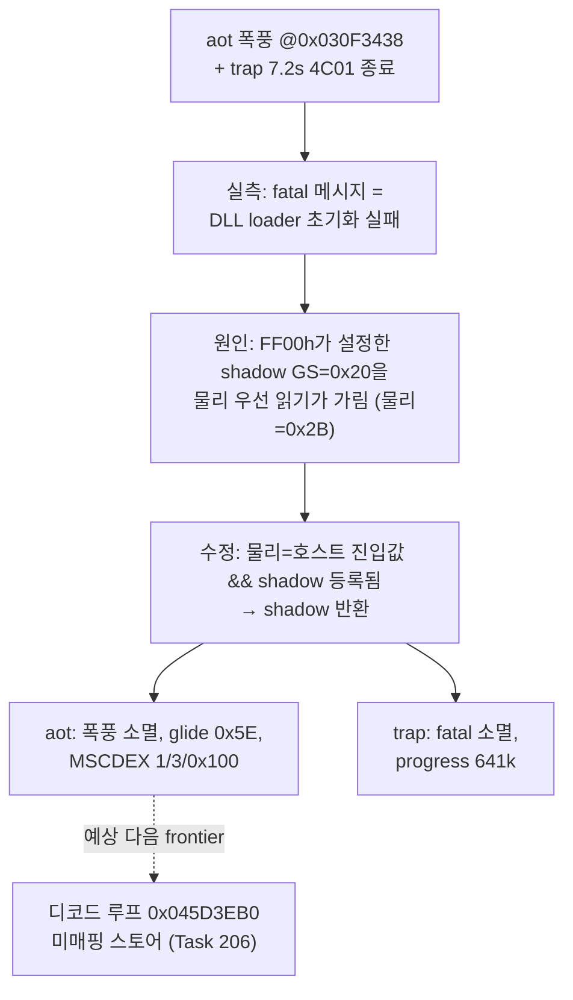

**Corrected/Confirmed (Task 210):** Task 209's leading hypothesis (per-module LINEXE selectors structurally failing the thunk assertion) was not the cause. `0x030F3438` is a shared fatal-tail, and the check actually firing was the **DLL-loader initialization GS check** (measured trap-backend fatal message: `"Fatal error: unable to initialize DLL loader."`). Mechanism: `INT 21h AX=FF00h` records the DOS/4G client-data selector `0x0020` only in shadow GS — it exists solely in the software SelectorTable and cannot be loaded into the hardware register — so Task 208's physical-first `ReadGuestSegmentSelector` returned the host entry value `0x2B` and the check failed; aot-dynamic manifested this as the retry storm and the trap backend as a single fatal plus a clean `AX=4C01h` self-termination at 7.2 s. Fix: keep physical-first but return the shadow when the physical value still equals the host entry-time selector and the shadow is registered and present in the SelectorTable; expose divergence and fatal counters via telemetry v11. Verification (30 s): the aot-dynamic storm is gone (progress 0→8,449, Glide ordinal `0x5E`, **MSCDEX handled on main without any experiment patch**, `request/cmd/status=1/3/0x100`) and the trap backend completes 30 s (progress 641,013, reaching the decode region `0x030873CD`) with zero fatals. Open: whether the LINEXE selector design matches real DOS4GW remains a separate, non-blocking topic; the frontier is expected to return to the Task 205–206 decode-loop unmapped store, pending a longer run.

## 2026-07-16 Task 211: MSCDEX 거절 원인 확정과 DPMI 프레임 ES 오프셋 수정 / Task 211: MSCDEX decline root-caused and the DPMI frame ES offset fixed

**확인됨 (원인):** 아래 300초 관측에서 발견된 MSCDEX `AX=1510h` 거절의 원인은 DPMI `AX=0300h` real-mode register 구조의 **ES 필드를 스펙 오프셋 `0x22`가 아닌 `0x24`(DS 슬롯)에서 읽던 오독**이다. 진단 계측(`mscdex_es/kind/reason/header`)이 ES=0, real-mode 해석(linear 0), 헤더 길이 부족(reason=2)을 확정했다. FLAGS도 word(0x20) 대신 dword로 읽고 있었다.

**확인됨 (수정·검증):** 오프셋 교정 후 같은 조건에서 게스트의 진짜 ES는 `0x0100`(DPMI `0100h` real-mode 블록)이었고 26바이트 패킷이 backing에 존재했으며(`header=0x0003001A`), 요청이 **command `03h`(IOCTL INPUT), status `0x0100`** 으로 처리되었다. 검증은 main의 `0x030F3438` 정지(Task 210) 때문에 `ReadGuestSegmentSelector` 물리 우선을 로컬 실험으로만 비활성화한 상태에서 수행했다(실험 패치는 커밋하지 않음). 실험 없는 최종 빌드의 회귀 확인에서 두 백엔드 모두 기존과 동일 거동을 유지했다.

**확인됨 (trap 백엔드 신규 관찰):** 머지된 main의 기본 trap 백엔드는 **약 7.2초에 게스트가 `INT 21h AX=4C01h`(DOS/4G fatal 종료 경로, 직전 바이트 `B4 4C CD 21`)로 자체 종료**한다. 두 차례 구동에서 dispatch가 정확히 781,653으로 결정적이며, 로더는 hang 없이 정상 회수된다(`child_exit=0`). 이는 Task 209의 미확정 4번("trap 30초에서 bridge/gate가 0인 이유")에 대한 답이 "시간 부족"이 아니라 **조기 fatal 종료**임을 시사한다.

**미확정:** (1) trap 백엔드의 7.2초 fatal 종료가 Task 209 세션의 "30초 정상 진행" 관측과 왜 다른지 — 판정 조건 또는 빌드 상태 차이 재확인 필요. (2) CD-DA play(`84h`) 도달 여부 — 초기화 창에서는 IOCTL(`03h`)만 관측되었고, 재생 확인은 실행이 곡 재생 단계까지 진행해야 가능하다.


**Confirmed (Task 211):** The declined MSCDEX `AX=1510h` request from the 300-second baseline below was root-caused by reading the DPMI `AX=0300h` real-mode frame's **ES field at offset `0x24` (the DS slot) instead of the spec's `0x22`** (FLAGS was also read as a dword instead of the word at `0x20`). Diagnosis telemetry pinned ES=0 → real-mode resolution to linear 0 → short-header decline (reason=2). After the fix, the guest's actual ES is `0x0100` (a DPMI `0100h` real-mode block), the 26-byte packet is present (`header=0x0003001A`), and the request completes as command `03h` (IOCTL INPUT) with status `0x0100`. Verification ran under an uncommitted local experiment disabling the physical-register preference in `ReadGuestSegmentSelector` (main's aot-dynamic stalls at `0x030F3438`, Task 210); final no-experiment regression checks show both backends unchanged. **New observation:** merged main's default trap backend self-terminates at ~7.2 s via `INT 21h AX=4C01h` (deterministic 781,653 dispatches, clean loader exit) — answering Task 209's open question 4: the zero bridge/gate counters reflect an early fatal exit, not insufficient time. **Unresolved:** why this differs from Task 209's "normal 30 s progression" reading, and whether CD-DA play (`84h`) is reached once execution proceeds past initialization.

## 2026-07-16 99f60de 300초 관측 기준선: 전체 타임라인과 MSCDEX 미처리 발견 / 300-second baseline of 99f60de: full timeline and an unhandled MSCDEX request

**확인됨 (구동 조건):** Task 208~209 머지 직전의 `feature/208` HEAD(`99f60de`, POP ES/FS/GS 가로채기 + CONTEXT 물리 레지스터 갱신 포함, `ReadGuestSegmentSelector` 물리 우선 수정은 미포함)를 재빌드해 `repiu_supervisor_win32.exe pumpit1 300000`(aot-dynamic, cmd /c 리다이렉션)으로 관측했다. 이 관측은 아래 Task 208–209 재판정 항목의 "수정 전" 상태에 대한 **전체 수명 기준선**이다.

**확인됨 (타임라인):**

1. 0~5초: 부팅 HLE 집중 구간. DOS INT 21h 292건(open 6 / read 17 / seek 15 / close 6 / IOCTL 19 / chdir 3 / resize 150 등), DPMI selector 할당 3건(descriptor 16개), `intro.ani`/`stage.cfg`/`spr.res`/`piu.bin`/`piu.dat`(8.7 MB)/`piu.mtl` 정상 read, 포트 I/O 21건(`0x2A0/0x2A2/0x2AC` OUT, deferred-ignored).
2. 약 3.2초: **aot-dynamic 상태에서 LINEXE bridge 25건, 가상 모듈 로드 1건(glide2x.ovl), get-proc 24건이 완료**되고 `grSstWinOpen`으로 640x480 OpenGL 창이 1회 생성됐다. Glide 게이트 49/49, 고유 함수 24종, 마지막 호출 ordinal 94 `_GRCULLMODE@4`(약 5.3초 이후 고정). 그리기 게이트(71~77) 미도달.
3. 5~147초: 디스패치는 +약 1.3천 건뿐. 경량 VEH 이벤트(aot boundary/reentry) 758,061/758,097(약 5.1k/s)이 wall time을 지배했고 return 디스패치 709,279건은 전부 match=false. 이 구동에서 **cross-segment thunk 패치는 성공 사례가 있다**: AOT code write 48건 중 `0x030F3432 → 0x030FECC4`(thunk self-patch) 기록과 `0x030F3436 → 0x030FExxx` jump transfer 19건이 남아 있다. 즉 `99f60de` 상태의 aot-dynamic은 `0x030F3438` assertion에 영구히 갇히지 않았다.
4. 약 147초: guest `0x030873F4` `mov [ebx+ebp], al`(88 04 2B)이 미매핑 `0x045D3EB0`(EBX) 쓰기로 0xC0000005 → 거절 → SEH catch → 게스트 스레드 exit code 2. Task 205~206에서 확정한 디코드 루프 종료 지점과 레지스터(ECX=`0x1908`)가 그대로 재현됐다.
5. 147~300초: 로더 post-attempt hang(ntdll `0x774CA07C` INFINITE 대기) 재현, supervisor가 300초에 강제 종료(`child_exit=124 terminated=true`).

**확인됨 (Task 208 부분 코드의 영향):** POP ES/FS/GS 가로채기(물리 레지스터 갱신 포함) 상태에서 Glide 창 생성 회귀는 재발하지 않았다. 세그먼트 load 처리 11,443건에 `+0xF5070`(GS)/`+0xF5074`(ES) 에필로그가 포함된다.

**확인됨 (opcode-88 store HLE 경계):** Task 206의 traced byte-store HLE는 341건을 처리했고 같은 페이지의 `0x045D3FFF` 쓰기는 applied였으나, 종료 예외의 `0x045D3EB0` 쓰기는 거절되었다. 명령 형태가 아니라 **대상 주소의 backing/조건이 처리 여부를 갈랐다**.

**미확정 (신규 발견 — MSCDEX 미처리, Task 211 대상):** DPMI `AX=0300h` real-mode 프레임에 `AX=1510h`, `EBX=0`, `ECX=3`(드라이브 일치)이 기록되었지만 `HandleMscdexRequest`의 request 카운트는 0으로 남았다. `ResolveMscdexBuffer`가 nullptr을 반환했거나 request 헤더 길이 바이트가 13 미만(`request[0] < 13`)이어서 초입에서 거절되고 게스트에는 error 0x000F(carry)가 반환된 것으로 추정된다. 이로 인해 CD 오디오(CD-DA) 재생이 시작되지 못했을 가능성이 있다. 거절 사유는 현 텔레메트리에 남지 않아 미확정이다.

**미확정 (아래 Task 208–209 항목과의 관계):** 아래 재판정 항목은 `99f60de` aot-dynamic이 "30초 안에 `progress=14`/`0x030F6574`에서 크래시"라고 기록했으나, 본 300초 관측에서 `progress=14`는 5초에 도달하는 정상 상태값이고 실제 게스트 종료는 147초의 디코드 루프 스토어였다. 30초 시점에는 게스트가 생존해 있었으므로(디스패치·heartbeat 증가 지속), 두 관측의 "크래시" 판정 조건 차이(관측 창 길이, telemetry 해석)를 Task 210 검증 시 함께 재확인해야 한다. 또한 trap 백엔드 30초에서 bridge/gate가 0인 것(아래 미확정 4번)에 대해, aot-dynamic에서는 5초 안에 bridge 25/gate 49가 도달함을 데이터로 남긴다.

**미확정 (기타 관찰):** 첫 chdir `\datas\bga`가 error 3으로 실패한 뒤 `C:\PIU\datas`로 성공했다. 원본 게임의 정상 탐색 순서일 수 있다.

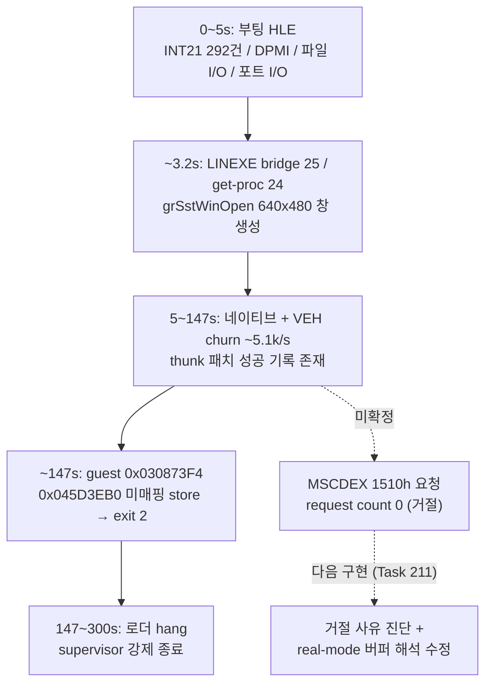

**Confirmed:** A 300-second supervised aot-dynamic run of the rebuilt pre-merge `feature/208` HEAD (`99f60de`) provides a full-lifetime baseline for the "pre-fix" state referenced by the Task 208–209 re-attribution below: boot-time HLE concentrates in the first ~5 s (292 INT 21h services, 3 DPMI selector allocations, all asset files read correctly including the 8.7 MB `piu.dat`, 21 deferred-ignored port I/O writes); under aot-dynamic the LINEXE bridge (25 entries), virtual module load (glide2x.ovl), and 24 get-proc calls complete by ~3.2 s with `grSstWinOpen` creating the 640x480 window once (49/49 Glide gate calls, 24 unique functions, ending at ordinal 94 `_GRCULLMODE@4`); the 5–147 s phase is dominated by ~5.1k/s lightweight VEH events (709,279 return dispatches, all match=false) yet **cross-segment thunk patching demonstrably succeeded** (code write `0x030F3432 → 0x030FECC4`, 19 jump transfers from `0x030F3436`), so `99f60de` aot-dynamic was not permanently stuck at the `0x030F3438` assertion; the guest dies at ~147 s at the known decode-loop store (guest `0x030873F4` writing unmapped `0x045D3EB0`, ECX=`0x1908` — the Task 206 byte-store HLE applied 341 stores including `0x045D3FFF` on the same page, so target backing, not instruction form, is the discriminator); the known post-attempt loader hang follows until the supervisor kills the child at 300 s. **Unresolved (new, Task 211):** a DPMI `AX=0300h` frame carrying MSCDEX `AX=1510h`/`EBX=0`/`ECX=3` (drive matches) left the request count at 0 — `ResolveMscdexBuffer` presumably returned nullptr or the header length byte was below 13, so the guest received error 0x000F and CD-DA playback never started; current telemetry does not record the decline reason. **Unresolved (relation to Task 208–209 below):** that entry records `99f60de` aot-dynamic as "crashing within 30 s at progress=14 / `0x030F6574`", but in this 300-second run progress=14 is the normal steady value reached at 5 s and the guest actually survives until the 147 s decode-loop store — the differing "crash" criteria (observation window, telemetry reading) should be re-checked during Task 210. Also noted for open question 4 below: under aot-dynamic the bridge/gate counters reach 25/49 within 5 s. Minor: the first chdir `\datas\bga` fails with error 3 before `C:\PIU\datas` succeeds, likely the game's normal probing order.

## 2026-07-15 LINEXE 정지 재판정: DOS4GW cross-segment thunk assertion이 진짜 frontier / LINEXE stall re-attributed: the DOS4GW cross-segment thunk assertion is the real frontier (Task 208–209)

**수정됨:** Task 208이 지목한 "POP ES/FS/GS 패스스루로 인한 shadow segment 불일치가 LINEXE 무한 루프의 원인"이라는 결론을 정정한다. `aebbbb6`(POP ES/FS/GS 미개입)과 `99f60de`(개입) 를 같은 조건으로 재실행하면 **완전히 동일한 aot-dynamic 실패**가 재현된다 — POP GS의 selector `0x0090`은 유효한 LDT 항목이라 하드웨어가 직접 실행하며 VEH를 아예 거치지 않으므로, 개입 여부는 이 증상과 무관하다. Task 206 work log의 "POP 개입 제거로 `0x030F3438` 폭풍 해소" 결론도 재현 실패로 성립하지 않는다.

**확인됨 (실제 메커니즘):** `0x030F3438`은 DOS4GW 런타임의 cross-segment call thunk 패처에 원래부터 존재하는 **의도된 assertion 트랩**이다. `cmp dx, cx`(대상 함수 세그먼트 vs 현재 CS)가 불일치하면 `int3`(fatal breakpoint 관용구, `HandleOriginalFatalBreakpoint`가 이미 1회 처리 가능)로 빠진다. 30초간 85만~128만 회의 예외는 EIP 고착이 아니라 **호출자가 같은 실패 조건으로 무한 재시도**하는 것이다. 유력 가설은 selector 설계 불일치: 우리 구현은 LINEXE_LOADER 내부 모듈에 별도 고정 selector(`0x0080/0x0088/0x0090`)를 부여하지만, 실기 DOS4GW는 이 논리 모듈들이 flat 코드 세그먼트를 공유했을 가능성이 있어 `cx == dx` 검사가 구조적으로 항상 실패할 수 있다. 상세는 `docs/analysis/20260715-209-aot-dynamic-import-stub-storm.md`.

**확인됨 (부수 수정):** `MOV Sreg, r/m`(0x8E)이 shadow만 갱신하고 물리 CONTEXT 세그먼트 레지스터를 갱신하지 않던 결함을 수정했다(`RecordGuestSegmentLoad` write-through + `ReadGuestSegmentSelector` 물리 우선). 기본 trap 백엔드 30초 기준 회귀 없음(progress ~112k). 또한 LINEXE 진단 카운터 대부분이 `enable_single_step_trace`에 게이트되어 **aot-dynamic 백엔드에서는 항상 0으로 표시**된다는 사실을 확인했다 — 백엔드 교차 검증 없이는 진단을 신뢰할 수 없다.

**미확정 (다음 분석 대상):** (1) `0x010F3648` 해석 서브루틴이 `dx`를 어디서 계산하는지 역추적, (2) LINEXE 별도 selector 설계가 실기 DOS4GW flat 모델과 다른지 확정 — 다르면 selector 통합이 근본 수정, (3) trap 백엔드가 같은 트랩을 만나고도 계속 진행하는 이유, (4) trap 백엔드 30초에서 `LINEXE bridge entry`/`Glide gate entries`가 0인 것이 시간 부족인지 별도 결함인지.

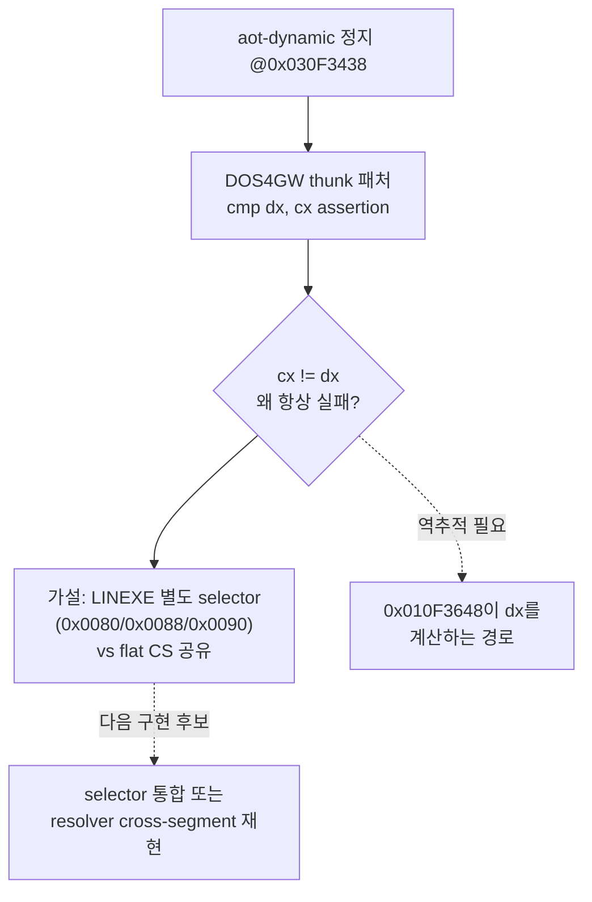

**Corrected / Confirmed (Task 208–209):** The Task 208 attribution ("POP ES/FS/GS pass-through causes the LINEXE infinite loop via shadow desync") is withdrawn: re-running `aebbbb6` (no interception) and `99f60de` (interception) reproduces the identical aot-dynamic failure, because POP GS with a valid LDT selector executes natively and never enters the VEH. The real mechanism at `0x030F3438` is DOS4GW's own intentional cross-segment thunk assertion (`cmp dx, cx` → `int3` fatal-breakpoint idiom, already handled once by `HandleOriginalFatalBreakpoint`); the 30-second storm is the caller endlessly retrying the same failing check. Leading hypothesis: our per-module LINEXE selectors (`0x0080/0x0088/0x0090`) structurally fail a check that real DOS4GW's flat shared code segment would pass. Side fix landed: `MOV Sreg, r/m` now writes through to physical CONTEXT registers and `ReadGuestSegmentSelector` prefers them (no trap-backend regression, ~112k progress/30 s). Also established: most LINEXE diagnostic counters are gated on `enable_single_step_trace` and always read 0 under aot-dynamic — cross-backend verification is mandatory. Details in `docs/analysis/20260715-209-aot-dynamic-import-stub-storm.md`.

## 2026-07-15 종료 예외 재판정: 디코드 루프 store가 진짜 사인 / Terminal exception re-attributed: the decode-loop store is the real killer (Task 205)

**수정됨:** 아래 Task 204 항목의 "`POP ES`가 종료 원인"이라는 결론을 정정한다. `Relocated exception byte window` 로그는 SEH 예외 주소가 아니라 **마지막으로 디스패치된 예외의 stale `last_guest_eip`** 로 focus를 계산하므로, 정상 처리된 마지막 디스패치 지점(POP ES)을 사인처럼 표시했다. 실제 SEH 종료 예외는 `Win32 AOT exception cache/guest mapping`이 가리키는 **guest `0x030873F4`** 이며, 이는 Task 202~203에서 분석한 65,536-레코드 디코드 루프 내부의 출력 스토어다. POP ES 수정 전(run7)과 후(205 run1) 모두 동일한 지점·동일한 레지스터로 종료됐다.

**확인됨 (종료 예외의 실체):**

```asm
; guest 0x030873F4 (cache 사본 바이트: 88 04 2B 8B 46 34 ...)
mov [ebx+ebp], al        ; 88 04 2B — 디코드 결과 바이트 기록
mov eax, [esi+0x34]      ; 8B 46 34 — 출력 배열 포인터 재적재
```

* 종료 시 레지스터: `EBX=0x045D3EB0`(출력 버퍼 포인터), `EBP=0`(인덱스), `ECX=0x1908`(디코드 태그, `0x1900~0x190A` 범위), `ESI=0x041B6B50`, `EAX=0x2FD`.
* 쓰기 대상 `0x045D3EB0`은 미매핑 영역이라 0xC0000005가 발생하고, 이 형태(`88 04 2B` SIB byte store)는 현 traced memory-store HLE 범위 밖이라 디스패치가 거절되어 SEH catch → 게스트 스레드 종료(exit code 2)로 이어진다.
* 직전에 4바이트 아래 주소로의 `or-imm8` 스토어(`0x045D3EAC`, 값 `0x00040009`)는 **처리 성공**(`applied: true`)으로 기록돼 있어, 이 영역이 shadow/boundary-object 계열 HLE와 이미 접점이 있다.

**확인됨 (Task 205 자체 결과):** `HandleSegmentPopInstruction`을 `07`(ES)/`0F A1`(FS)/`0F A9`(GS)로 확장한 변경은 정상 동작한다. 세그먼트 로드 trace에 guest `+0xF5070`(GS), `+0xF5074`(ES) 처리 기록이 남았고 처리 건수가 8,481 → 11,443으로 증가했으며 회귀는 없다. 다만 이 에필로그는 종료 원인이 아니었으므로 실행 진행 자체는 바뀌지 않았다.

**미확정 (다음 분석 대상):**

1. `EBX=0x045D3EB0` 출력 버퍼의 provenance — 게스트 allocator가 어느 경로로 이 포인터를 얻었는지, 원본 환경이라면 어떤 할당(DPMI/DOS resize)이 이 영역을 commit했어야 하는지.
2. 대응 방향의 선택: (a) 해당 할당을 실제 commit하는 arena/DPMI 모델 확장(정확성 우선, 기존 원칙 부합) vs (b) `88 04 2B` 형태의 traced byte-store HLE 추가(디코드 루프가 레코드마다 fault → dispatcher 왕복하므로 처리량상 부적합할 가능성).
3. 진단 결함 수정: `Relocated exception byte window`가 SEH 예외의 AOT 매핑 guest 주소를 사용하도록 정정 (이번 오판정의 근본 원인).

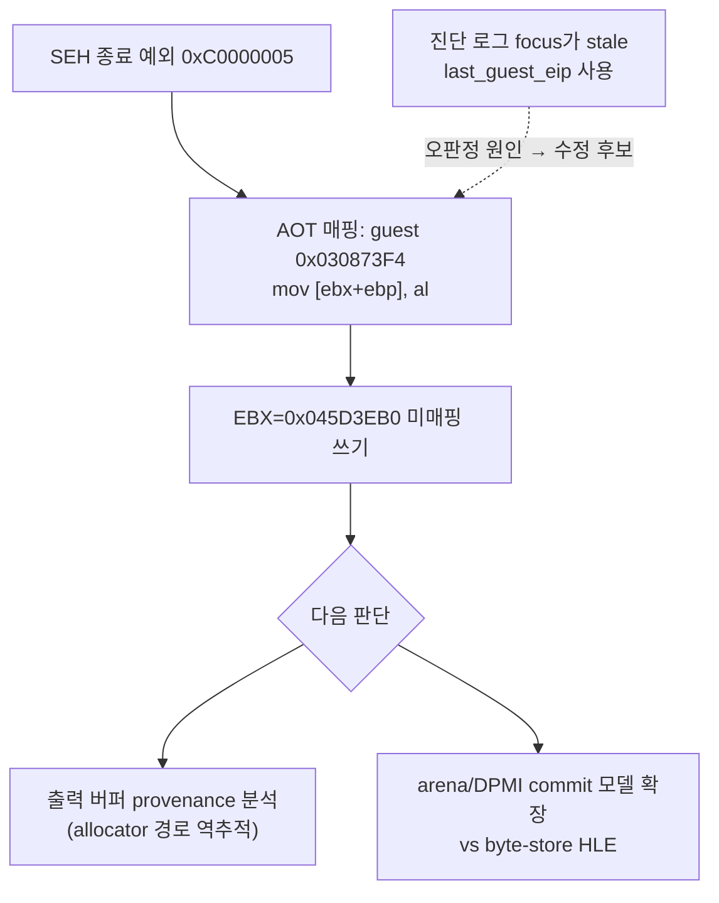

**Corrected:** the Task 204 conclusion below ("POP ES is the killer") is re-attributed. The `Relocated exception byte window` log derives its focus from the stale `last_guest_eip` of the last dispatched (and successfully handled) exception rather than from the SEH exception address, so it displayed the POP ES site. The actual terminal exception maps (via `AOT exception cache/guest mapping`) to **guest `0x030873F4`** — the output byte store `mov [ebx+ebp], al` (`88 04 2B`) of the 65,536-record decode loop — identically before and after the POP fix, with `EBX=0x045D3EB0` (unmapped output pointer), `EBP=0`, `ECX=0x1908`. The write target is unmapped and this SIB byte-store form is outside current traced memory-store HLE, so the dispatch declines and the guest thread dies. The Task 205 segment-pop extension itself works (trace entries at guest `+0xF5070`/`+0xF5074`, handled loads 8,481 → 11,443, no regression) but was not the blocker. Next: trace the provenance of the `0x045D3EB0` output buffer and choose between committing the corresponding allocation in the arena/DPMI model (preferred by project principles) versus adding a byte-store HLE (throughput-hostile inside the decode loop); also fix the byte-window diagnostic to use the SEH exception's mapped guest address.

## 2026-07-15 EIP 샘플링 결과: 침묵 상태의 정체 확정 / EIP sampling result: silent state identified (Task 204)

**확인됨:** Task 204의 네이티브 구간 EIP 샘플링(로더 내부 폴러 + supervisor 외부 크로스 프로세스 샘플러)을 적용한 뒤 200~300초 구동을 반복해 다음을 확정했다.

1. **사이클 내부의 "무디스패치 네이티브 구간"은 순수 네이티브 실행이 아니다.** 경량 VEH AOT 경로(inline-cache miss·reentry: `ExceptionDispatchScope` 없이 처리되어 dispatch 카운터에 잡히지 않음)가 **초당 약 4,500~5,100회** 동작하고 있었다. 이 구간의 EIP 샘플은 대부분 로더 VEH 코드(`0x101679xx`)와 ntdll(`0x774C9xxx`)에 위치하며, 마지막 간접 전이는 `0x030DAEC3→0x03085E9C`(초기), `0x030842E0→0x0305686C`(후기) 등이었다. 즉 wall time의 대부분이 예외 처리에 소모되는 **inline-cache churn 처리량 병목**이다.
2. **150초 이후의 "디스패치 침묵 상태"는 게스트 스레드 종료다.** 2026-07-14의 세 후보(폴링 대기/번역 결함 무한 루프/장시간 연산)는 모두 철회한다. +143 디스패치 burst의 마지막 예외 0xC0000005(cache `0x06BF4334` = guest `0x030F5074`)가 처리되지 못해 SEH catch로 게스트 스레드가 **exit code 2로 종료**했고(OpenThread가 `ERROR_INVALID_PARAMETER(87)` 반환으로 스레드 소멸 확인), 로더는 약 151초에 `original entry raised a caught exception`과 예외 바이트 창을 정상 로그로 남겼다.
3. ~~**종료 지점 명령은 세그먼트 복원 에필로그의 `POP ES`(0x07)다.**~~ **수정됨 (같은 날 Task 205):** 이 판정은 `Relocated exception byte window` 진단이 stale `last_guest_eip`를 사용한 데서 온 오판정이다. 실제 종료 예외는 guest `0x030873F4`의 디코드 루프 스토어다 — 위 Task 205 항목 참조. (에필로그 바이트 관찰 자체는 유효: guest `0x030F5064` 주변은 `83 C4 04 5D 0F A9 0F A1 [07] 5F 5E 5A 59 5B C3`의 세그먼트 복원 에필로그이며, 이 POP ES/FS/GS 형태가 HLE 범위 밖이던 것도 사실이고 Task 205에서 처리를 추가했다.)
4. **새 결함: 게스트 종료 후 로더가 hang된다.** trampoline teardown(phase 10~14)은 완주하지만, 결과 로그 출력 후 main 경로의 후속 단계에서 ntdll `0x774CA07C`의 INFINITE 대기에 걸려 프로세스가 종료되지 않는다(supervisor timeout이 강제 종료). 이전 600초 관측이 "게스트 fatal 없음"으로 기록된 것은 이 hang과 PowerShell stderr 캡처 중단이 겹쳐 로더의 fatal 로그를 놓쳤기 때문이다. `dos4gw_hello`는 phase 14 후 정상 종료하므로 pumpit1 경로(Glide/WGL 정리 등)의 후속 단계가 유력하다.

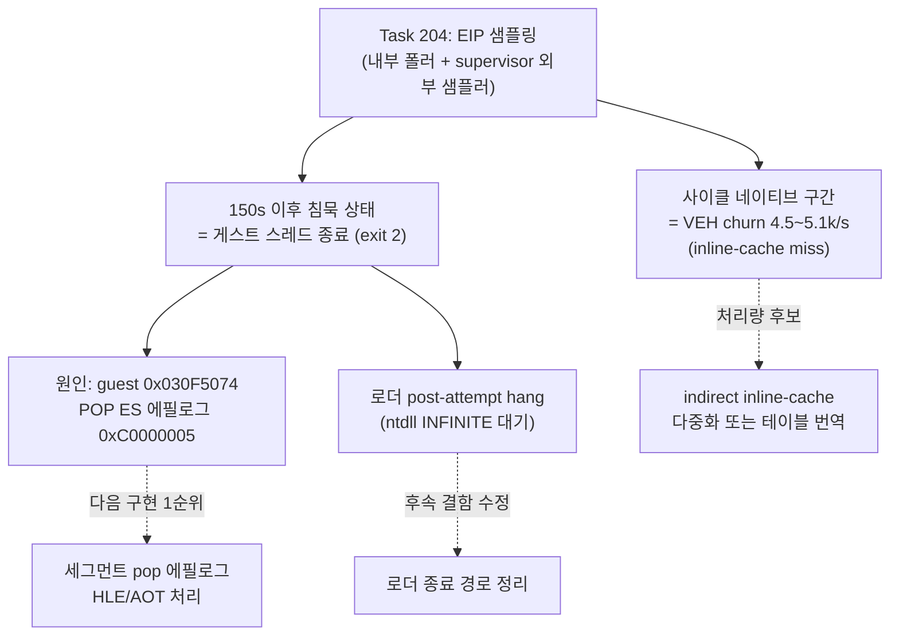

**다음 단계:** (1) guest `0x030F5074` 형태의 세그먼트 복원 에필로그(`POP ES/FS/GS`)를 AOT/VEH에서 처리하는 것이 실행 진행의 1순위 frontier다. (2) 게스트 종료 후 로더 hang(후속 정리 단계의 INFINITE 대기)을 수정해야 장기 관측이 왜곡되지 않는다. (3) 사이클 처리량은 inline-cache 다중화 또는 해당 간접 전이의 테이블형 번역이 후보다.

**Confirmed (Task 204):** With native-phase EIP sampling (an in-process poller plus a cross-process supervisor sampler), repeated 200–300 s runs establish: (1) the in-cycle "zero-dispatch native phases" are not pure native execution but lightweight VEH AOT handling (inline-cache misses/reentries, invisible to dispatch counters) at ~4,500–5,100 events/s, with samples concentrated in loader VEH and ntdll code — an inline-cache churn throughput bottleneck; (2) the post-150 s "dispatch-silent state" is guest-thread termination, withdrawing all three 2026-07-14 candidates — the final 0xC0000005 at cache `0x06BF4334` (guest `0x030F5074`) is SEH-caught and the thread exits with code 2 (thread disappearance confirmed by OpenThread `ERROR_INVALID_PARAMETER`), with the loader logging `original entry raised a caught exception` at ~151 s; (3) the terminal instruction is `POP ES` (byte `07`) inside a segment-restore epilogue (`pop ebp; pop gs; pop fs; pop es; pop edi; pop esi; pop edx; pop ecx; pop ebx; ret`), a form outside current HLE coverage; (4) a new defect: after logging, the loader main thread blocks forever in an INFINITE ntdll wait past teardown phase 14 (pumpit1 path only; `dos4gw_hello` exits cleanly), which — combined with a PowerShell stderr capture artifact — caused the earlier 600 s run to be misread as "no guest fatal." Next steps: segment-pop epilogue handling (primary frontier), the loader post-attempt hang fix, and inline-cache churn reduction.

## 2026-07-14 600초 장기 관측 / 600-second extended observation

**수정됨 (2026-07-15):** 아래의 "무디스패치 순수 네이티브 상태" 해석과 세 후보는 Task 204 EIP 샘플링으로 철회되었다. 실제로는 guest `0x030F5074` `POP ES`의 미처리 0xC0000005로 게스트 스레드가 종료된 뒤 로더가 hang된 상태였다. 위 2026-07-15 항목 참조. / **Corrected (2026-07-15):** the "dispatch-silent pure-native state" reading below and its three candidates are withdrawn by Task 204 EIP sampling; the guest thread had terminated on an unhandled 0xC0000005 at the `POP ES` of guest `0x030F5074`, followed by a loader hang. See the 2026-07-15 entry above.

**확인됨:** Task 203 반영 빌드로 600초 supervisor 구동을 수행했다. 자산 처리 사이클(+105 디스패치 blip)은 37초부터 약 137초까지 총 8회 관측된 뒤 **150초에 종료**됐다. 150초에 +143 디스패치와 함께 semantic progress 카운터가 14에서 73으로 뛰었는데(+59), 이는 REP MOVS/STOS bulk 연산과 저주소(`ESI/EDI=0x40000`) 접근 HLE가 집중 처리된 새 단계 진입을 뜻한다. 마지막 디스패치는 cache 주소 `0x06BF4334`에서 정상 처리 완료된 access violation(0xC0000005)이며 dispatch entry/exit는 53,300/53,300으로 균형이다.

**확인됨:** 150초부터 600초까지 **450초(7.5분) 동안 디스패치·heartbeat·single-step이 완전히 정지**한 순수 네이티브 상태가 지속됐다. Glide ordinal은 `0x5E`에 머물렀고 그리기 게이트는 미도달이다. 게스트 fatal이나 크래시는 없었다.

**미확정:** 이 무디스패치 상태의 정체. 후보는 다음 세 가지이며 현 텔레메트리로는 구분할 수 없다.

1. 초장시간 네이티브 연산(가능성 낮음 — 현대 CPU 네이티브 7.5분은 과도).
2. **게임 내부 tick/플래그 폴링 무한 대기**: 원본 환경에서는 게임이 설치한 IRQ0(INT 8) 핸들러가 게임 데이터 영역의 카운터를 갱신하지만, 현 HLE는 BDA `0x46C`만 갱신하고 게스트 핸들러를 호출하지 않으므로 게임 자체 카운터는 영원히 정지한다. 폴링 대상이 정상 커밋된 arena 메모리라면 예외가 발생하지 않아 디스패치 0과 일치한다.
3. 번역 코드 결함으로 인한 네이티브 무한 루프.

**다음 단계:** 네이티브 구간 EIP 샘플링 텔레메트리(supervisor 또는 폴러가 게스트 스레드 context를 주기적으로 캡처)를 추가해 대기/연산 위치를 확정한다. 2번으로 확정되면 게스트가 설치한 timer interrupt 핸들러를 주기 호출하는 HLE가 후속 구현 후보다.

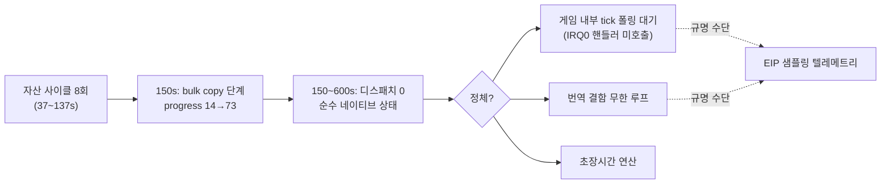

**Confirmed:** A 600-second supervised run on the Task 203 build shows the asset cycles (+105-dispatch blips) ending at 150 s after eight occurrences, followed by a +143-dispatch burst that raised the semantic progress counter from 14 to 73 (bulk REP MOVS/STOS and low-address `0x40000` HLE), with the final dispatch a cleanly handled access violation at cache address `0x06BF4334` and balanced 53,300/53,300 dispatches. From 150 s to 600 s the guest stayed **dispatch-silent for 7.5 minutes** with the Glide ordinal still `0x5E` and no crash. **Unresolved:** whether this is an in-memory polling wait (the game's own IRQ0-updated tick never advances because the HLE updates only BDA `0x46C` and never invokes the guest's installed handler), a translated-code infinite loop, or genuinely long native compute. The next step is native-phase EIP sampling telemetry; if polling is confirmed, periodically invoking the guest's installed timer interrupt handler becomes the follow-up implementation candidate.

## 2026-07-14 점프 테이블 번역 이후 / After jump-table translation (Task 203)

**확인됨:** Task 203의 AOT bounded jump table 번역 적용 후 120초 관찰에서 디코드 루프의 dispatcher 왕복이 사이클당 약 65,500회에서 약 105회로 감소했고, 자산 처리 사이클이 약 75~80초에서 약 17~20초로 단축되어 같은 120초 동안 약 6사이클이 완료됐다(이전 1사이클). 이전 디스패치 집중 지점 `0x03086DAA`(11-엔트리)와 `0x030EDDDA`(4-엔트리) 모두 디스패치가 소멸했다. 정적 계획은 PIU.EXE에서 15개 테이블(target 111개)을 인식했다. 새 예외는 없다.

**확인됨:** `dos4gw_hello`의 정적 AOT 이미지 빌드는 "direct control-flow target is outside the cache"로 실패하지만, 변경 전 HEAD에서도 동일하게 재현되는 기존 한계다(hello의 기존 검증은 legacy 백엔드). 별도 과제 후보: 직접 분기 target이 image 밖일 때 이미지 전체 실패 대신 해당 지점만 dispatcher exit로 후퇴시키는 것.

**미확정 (새 frontier):** 이제 각 사이클의 대부분(약 17~20초)이 무디스패치 네이티브 연산 구간이다. 120초·약 6사이클 후에도 `progress=14`, 마지막 Glide ordinal `0x5E`가 유지되므로 총 사이클 수와 이 네이티브 구간의 내용(압축 해제, 테이블 생성, 또는 메모리 내 폴링 대기 가능성)을 규명해야 한다. 다음 단계 후보: 더 긴 구동(5~10분)으로 사이클 총량 관측, 또는 네이티브 구간의 EIP 샘플링 텔레메트리 추가.

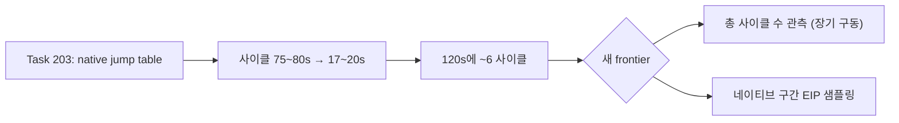

**Confirmed:** With Task 203's bounded jump-table translation, a 120-second run shows decode-loop dispatcher round-trips down from ~65,500 to ~105 per cycle and the per-asset cycle down from ~75–80 s to ~17–20 s (~6 cycles vs 1). Both former dispatch hotspots (`0x03086DAA`, `0x030EDDDA`) are dispatch-silent, the static plan recognizes 15 tables / 111 targets in PIU.EXE, and no new exceptions appear. The `dos4gw_hello` static-AOT failure ("direct control-flow target is outside the cache") reproduces on unmodified HEAD — a pre-existing limitation, with a follow-up candidate of degrading unresolved direct targets to dispatcher exits instead of failing the whole image. **Unresolved (new frontier):** cycles are now dominated by ~17–20 s zero-dispatch native phases and `progress=14` / Glide ordinal `0x5E` persist after ~6 cycles; the total cycle count and the nature of the native phases (decompression, table generation, or in-memory polling) need either a longer run or native-phase EIP sampling telemetry.

## 2026-07-14 동기식 타이머 틱 이후 관찰 / Observation after synchronous timer tick

**확인됨:** BDA `0x46C` 동기식 틱 갱신(Task 201)과 그리기 stub 5종(Task 202) 적용 후 40초 및 120초 supervisor 구동에서 `STATUS_GUARD_PAGE_VIOLATION`이 소멸했고, 게스트 fatal 없이 마감까지 실행이 지속됐다.

**확인됨:** 마지막 Glide 호출은 ordinal `0x5E` `_GRCULLMODE@4`(94)이며, 그리기 게이트(71~77)는 아직 호출되지 않았다. OVL resident-name 테이블 재파싱으로 71 `_GRDRAWPOINT@4`, 72 `_GRDRAWLINE@8`, 73 `_GRDRAWTRIANGLE@12`, 74 `_GRDRAWPLANARPOLYGON@12`, 75 `_GRDRAWPLANARPOLYGONVERTEXLIST@8`, 76 `_GRDRAWPOLYGON@12`, 77 `_GRDRAWPOLYGONVERTEXLIST@8`(stub 미등록)을 확정했다.

### 0x03086DAA 반복 디스패치의 정체 / Identity of the 0x03086DAA dispatch loop

**확인됨:** PIU.EXE object 2 정적 디스어셈블리로 `0x03086DAA`(object 2 `+0x76DAA`)는 Watcom switch문의 간접 분기 `jmp dword ptr cs:[eax*4 + obj2:0x767E8]`이다. 11-엔트리 점프 테이블은 태그 코드 `0x1900~0x190A`를 분기하며, `[esp+0x38]` 구조체(내부 카운트 `[s+0]`, 외부 카운트 `[s+4]`)를 도는 이중 중첩 레코드 디코드 루프 내부에 있다. 각 레코드는 바이트 필드를 float 상수와 곱해 `[esi+0x34]` 배열에 4바이트씩 기록한다. 이 간접 분기가 레코드마다 AOT 네이티브 실행을 dispatcher로 탈출시켜 초당 약 1,090~1,140 레코드로 처리된다.

**확인됨:** 120초 관찰에서 이 루프는 32초부터 94.5초까지 약 65,400 디스패치(관측 `ECX=0x10000`=65,536 레코드와 일치)를 소비하고 정상 종료했다. 이어 약 18초의 무디스패치 네이티브 구간(마지막 디스패치 지점 `0x030EDDDA`, object 2 `+0xDDDDA`의 4-엔트리 점프 테이블 `jmp cs:[eax*4 + obj2:0xDDC8C]`)이 지나고, 113초에 동일한 디코드 루프가 다시 시작됐다. 즉 "네이티브 연산 구간 → 65,536-레코드 디코드 루프"가 자산 단위로 반복되는 초기화 사이클이다.

**수정됨:** 6~31초의 무디스패치 정지 구간(약 13초, 약 11초)을 BDA `0x46C` 틱 폴링 대기로 본 같은 날의 초기 해석은 철회한다. 저메모리 `0x46C`는 게스트 주소 공간에 매핑되어 있지 않아 읽기마다 예외 디스패치를 유발하므로, 디스패치가 0인 구간은 틱 폴링일 수 없다. 이 구간들은 위 사이클의 네이티브 연산 단계다. 게임이 `0x46C`를 실제로 소비하는지는 **미확정**으로 되돌린다.

**결론:** 현재 frontier는 누락 HLE 서비스나 외부 대기가 아니라, code-segment 점프 테이블 간접 분기가 레코드마다 네이티브 실행을 탈출시키는 **AOT 실행 처리량 병목**이다. 실기 기준 밀리초 단위 작업이 사이클당 약 75초로 늘어나 있어, 그리기 게이트 도달 전 초기화가 수 분 이상 걸릴 수 있다. 다음 구현 후보는 `jmp cs:[reg*4+disp32]` 형태의 bounded 점프 테이블을 AOT 번역에 포함하는 것(테이블 로드 후 번역된 블록으로 직접 연결, 실패 시 dispatcher fallback)이다.


**Confirmed:** Static disassembly of PIU.EXE object 2 shows `0x03086DAA` (object 2 `+0x76DAA`) is a Watcom switch indirect branch `jmp dword ptr cs:[eax*4 + obj2:0x767E8]` over an 11-entry table for tag codes `0x1900–0x190A`, inside nested record-decode loops over a `[esp+0x38]` structure (inner bound `[s+0]`, outer bound `[s+4]`), writing 4 bytes per record into `[esi+0x34]`. Each pass exits AOT native execution into the dispatcher, limiting throughput to ~1,090–1,140 records/s. A 120-second run shows the loop consuming ~65,400 dispatches (matching the observed `ECX=0x10000` bound) from 32s to 94.5s, an ~18s zero-dispatch native phase (last dispatch site `0x030EDDDA`, itself a 4-entry jump table at obj2 `+0xDDC8C`), and the same decode loop restarting at 113s — a repeating per-asset initialization cycle. **Corrected:** the same-day interpretation of the earlier zero-dispatch phases as BDA `0x46C` tick polling is withdrawn — low-memory reads always dispatch, so zero-dispatch phases cannot be tick polling; whether the game consumes `0x46C` at all returns to **unresolved**. **Conclusion:** the current frontier is AOT execution throughput on code-segment jump-table indirect branches, not a missing service or an external wait; the recommended next implementation is native AOT translation of bounded `jmp cs:[reg*4+disp32]` switch tables with dispatcher fallback.

## 2026-07-11 실제 arena 확장 결과

16 MiB contiguous expansion으로 기존 `0x026E3578` allocator boundary와 `0xC0000374` heap corruption이 사라졌다. PIU는 supervisor 종료 없이 자체 timeout을 반환하고 dispatch는 `118438/118438`로 균형을 이룬다. 마지막 `+0xF520A`는 정상 compare 함수 종료 경로이므로 현재 명확한 fault frontier는 없다.

## 2026-07-11 Real Arena Expansion Result

A 16 MiB contiguous expansion removes the former `0x026E3578` allocator boundary and heap corruption `0xC0000374`. PIU returns its own timeout without supervisor termination and balances 118,438/118,438 dispatches. Last EIP `+0xF520A` is a normal comparison-function exit, so there is no current concrete fault frontier.

## 2026-07-11 supervisor가 확인한 allocator 경계

외부 shared telemetry는 PIU 정지 상태에서 exception `0xC0000374`, last guest EIP `+0x1E16A`, EAX=`0x026E3578`을 회수했다. arena end `0x026D7000`보다 약 `0xC578` 밖의 allocator 객체 초기화 중 host heap corruption이 발생한다. 다음 구현은 실제 arena 확장과 독립 backing 중 선택이 필요하다.

## 2026-07-11 Allocator Boundary Confirmed by Supervisor

External shared telemetry recovered exception `0xC0000374`, last guest EIP `+0x1E16A`, and EAX=`0x026E3578`. Host heap corruption occurs while initializing an allocator object about `0xC578` beyond arena end `0x026D7000`. The next implementation requires choosing real arena expansion or independent backing.

## 2026-07-11 external supervisor 전환 근거

ES=`0x2C` descriptor byte compare/load를 처리해 `+0xFC723`과 `+0xFC777`을 통과했다. 이후 실행은 계속되지만 동일 프로세스 live snapshot과 최종 결과가 모두 회수되지 않는다. 이전 timeout data race를 제거한 뒤에도 재현되므로 다음 진단 경계는 별도 supervisor 프로세스에 둔다.

## 2026-07-11 Evidence for External Supervisor

Descriptor-backed ES=`0x2C` byte compare/load processing passes `+0xFC723` and `+0xFC777`. Execution then continues while both in-process live snapshots and final results become unavailable. Because this reproduces after the prior timeout race was removed, the next diagnostic boundary belongs in an external supervisor process.

## 2026-07-11 shadow segment register store

`+0xFC717 MOV AX,FS`를 shadow store로 처리해 후속 ES가 `0x2C`로 설정된다. 현재 frontier는 `+0xFC723`의 ES override byte compare/load이며 descriptor-backed byte read 형식 확장이 필요하다.

## 2026-07-11 Shadow Segment Register Store

Shadowing MOV AX,FS at `+0xFC717` makes the following ES load use `0x2C`. The current frontier is the ES-override byte compare/load at `+0xFC723`, requiring descriptor-backed byte-read forms.

## 2026-07-11 REP STOSD 이후

`+0xF4E17`의 zero-fill REP STOSD를 범위 검증 후 일괄 처리하여 반복별 TF exception을 제거했다. 실행은 `+0xFC723`까지 진행한다. `+0xFC717 MOV EAX,FS`가 shadow FS=`0x2C` 대신 Win32 FS=`0x53`을 읽고, `+0xFC71F MOV ES,EAX`가 shadow ES를 `0x53`으로 오염시키는 것이 새 frontier다.

## 2026-07-11 After REP STOSD

Batching the checked zero-fill REP STOSD at `+0xF4E17` removes per-iteration TF exceptions and advances execution to `+0xFC723`. The new frontier is native `MOV EAX,FS` at `+0xFC717`, which reads Win32 FS=`0x53` instead of shadow FS=`0x2C`, followed by MOV ES contaminating shadow ES with `0x53`.

## 2026-07-11 shadow DS 복원

환경 scan의 임시 DS=`0x2C`는 `+0xF4DD5`의 `POP DS`에서 guest stack의 `0x2B`로 복원된다. access-violation HLE 뒤 TF를 보존하고 POP을 shadow 처리하자 기존 `+0xF7A71` fault가 사라졌다. 새 frontier는 `+0xF4E17`의 `REP STOSD` 반복별 single-step 비용이다.

## 2026-07-11 Shadow DS Restoration

The temporary environment-scan DS=`0x2C` is restored to guest-stack selector `0x2B` by POP DS at `+0xF4DD5`. Preserving TF after access-violation HLE and shadowing the POP removes the former `+0xF7A71` fault. The new frontier is per-iteration single-step overhead at `REP STOSD` at `+0xF4E17`.

## 2026-07-11 live telemetry 결과

selector binding 이후의 host 정지는 guest 교착이 아니었다. host busy poll이 guest 시작 전에 quiet iteration 100,000회를 소진하고, guest 종료 전에 비원자 observation을 복사하면서 data race가 발생했다. wall-clock quiet timeout과 terminate/join-before-copy 순서로 수정한 뒤 PIU는 반복 실행에서 안정적으로 최종 예외를 반환한다.

현재 frontier는 relocated `+0xF7A71`의 opcode `0x8B` access violation이다. 세 번의 실행에서 dispatch entry/exit는 모두 `28182/28182`로 균형을 이루며 EAX=`0x1008`, ESI=`0x0007B839`가 반복된다. supervisor 프로세스는 현재 필요하지 않다.


## 2026-07-11 Live Telemetry Result

The host stall after selector binding was not a guest deadlock. The host busy poll exhausted 100,000 quiet iterations before guest startup and raced while copying non-atomic observations before stopping the guest. Wall-clock quiet detection and terminate/join-before-copy restore stable result collection. The current frontier is the repeatable opcode-`0x8B` access violation at relocated `+0xF7A71`, with balanced 28,182/28,182 dispatch counts, EAX=`0x1008`, and ESI=`0x0007B839`. An external supervisor is not currently required.

## 2026-07-11 selector frontier

DOS4GW `LINEXE.EXP` 역분석으로 LE object selector가 DPMI function `0000h`의 동적 할당 결과임을 확인했다. PIU 프로필은 object 1~4에 `0x1C`, `0x24`, `0x2C`, `0x34`를 순차 할당하며 kind `0x03` fixup은 할당 selector를 source `+2`에 기록한다.

실제 descriptor-backed translation을 활성화하면 PIU host가 45초 안에 내부 timeout snapshot을 반환하지 못한다. 현재 frontier는 selector 값 결정이 아니라, 실행 중 exception 반복 또는 guest 진행 상태를 host 종료 전에 회수할 수 있는 live telemetry다.

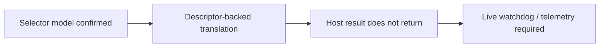

## 2026-07-11 Selector Frontier

Reverse engineering of DOS4GW `LINEXE.EXP` confirmed that LE object selectors are dynamic results of DPMI function `0000h`. The PIU profile sequentially assigns `0x1C`, `0x24`, `0x2C`, and `0x34` to objects 1 through 4, and kind-03 fixups write the allocated selector at source `+2`.

With real descriptor-backed translation enabled, the PIU host does not return its internal timeout snapshot within 45 seconds. The frontier is no longer selector selection; it is live telemetry that can recover repeated exception or guest progress state before host termination.

```mermaid
flowchart LR
    ENV["DOS Environment Scan"] --> FILES["intro.ani / stage.cfg"]
    FILES --> RESIZE["DOS Resize"]
    RESIZE --> OBJECTS["Boundary Object Array"]
    OBJECTS --> SENTINEL["Allocator Sentinel / Metadata"]
    SENTINEL --> DS0["8B 16 with DS:0 handled"]
    DS0 --> ADD["03 07 shadow ADD handled"]
    ADD --> OR["83 0E 01 shadow OR handled"]
    OR --> CMP["38 10 shadow byte CMP handled"]
    CMP --> ZERO["Bounded zero-backed allocator payload"]
    ZERO --> NEXT["38 50 20 handled"]
    NEXT --> LOOP["File parsing loop"]
    LOOP --> ALLOC["Allocator probe dispatch"]
    ALLOC --> QUIET["Repeated +0xF7A71 dispatch / quiet timeout"]
```

## 현재까지 도달한 상태

**확인됨:** DOS environment scan, `intro.ani`/`stage.cfg` file flow, DOS resize, arena 경계 객체 배열, allocator sentinel과 metadata store까지 진행한다. 실행 timing에 따라 생성자, allocator fault 또는 충분한 진척 뒤 quiet timeout이 먼저 관찰될 수 있다.

## 최근 해결

relocated base + `0x000F7A71`의 `8B 16` (`mov edx,[esi]`)에서 `ESI=0`인 경우를 guest `DS` zero-page read로 처리했다. 같은 명령의 고주소 source는 처리하지 않는다.

## 최근 해결한 ADD

**확인됨:** zero-page read 통과 후 relocated base + `0x000F7BAD`의 `03 07`을 shadow-memory source ADD로 처리했다.

```asm
add eax, dword ptr [edi]
```

관찰값 `EDI=0x026E49C4`의 dword를 shadow memory에서 읽고, destination register와 `CF/PF/AF/ZF/SF/OF`를 32-bit ADD 의미대로 갱신한다.

## 최근 해결한 OR

**확인됨:** ADD 통과 후 relocated base + `0x000F7AD4`의 `83 0E 01`을 shadow-memory read-modify-write로 처리했다.

```asm
or dword ptr [esi], 1
```

destination dword를 shadow memory에서 읽어 bit 0을 설정한 결과를 같은 주소에 기록했다. `CF/OF`를 0으로 하고 `PF/ZF/SF`를 결과에 맞게 복원하며 undefined인 `AF`는 보존한다.

## 최근 해결한 byte CMP

**확인됨:** OR 통과 후 relocated base + `0x000F5F34`의 `38 10`을 shadow byte source CMP로 처리했다.

```asm
cmp byte ptr [eax], dl
```

관찰값은 `EAX=0x046E49C8`, `EDX=0`이었다. shadow byte와 ModRM byte register를 비교하고 `CF/PF/AF/ZF/SF/OF`를 복원하며 operand는 변경하지 않는다.

## 최근 해결한 bounded zero backing

**확인됨:** 첫 CMP 통과 후 relocated base + `0x000F5F8E`에서 다음 명령이 관찰된다.

```asm
cmp byte ptr [eax+0x20], dl
```

이 source byte는 sparse shadow map에 없지만, 확인된 allocator payload 범위 안의 unwritten byte다. 요청 크기 `0x2C`와 `0x1008`만 추적하고 `[block+4, block+size-4)`에 한해 0을 반환하도록 구현해 이 비교를 통과했다. 이후 실행은 DOS interrupt, segment-memory load와 shadow read를 계속 처리하고 allocator probe로 돌아간다.

## Quiet timeout 재분류

**확인됨:** quiet timeout을 native 파일 파싱 loop의 정체로 단정할 수 없다. exception dispatch entry/exit를 guest suspend 없이 계수한 반복 실행에서 다음 세 형태가 관찰되었다.

```mermaid
flowchart TD
    Q["Quiet timeout observation"] --> C{"entry - exit"}
    C -->|0| DONE["No handler left active"]
    C -->|1 at +0xF7A71| ACTIVE["Allocator probe handler still active"]
    ACTIVE --> POLL["Host busy poll reached 100000 quiet iterations"]
    POLL --> FALSE["Iteration-based false timeout candidate"]
```

* exception 종료: `entry=25604`, `exit=25604`, last EIP `+0xF7ABA`
* quiet timeout: `entry=34068`, `exit=34067`, outstanding `1`, last EIP `+0xF7A71`
* exception 종료: `entry=28234`, `exit=28234`, last EIP `+0xF7AA8`
* 전체 regression의 quiet timeout: `entry=33946`, `exit=33946`, outstanding `0`, last EIP `+0xF7A71`

마지막 single-step EIP는 반복 실행 모두 `+0xF4DC1`이었지만, timeout 직전 마지막 exception dispatch는 allocator probe `+0xF7A71`이었다. balanced timeout에서도 총 dispatch가 약 34,000회 발생했으므로 handler 자체가 항상 멈춘 것은 아니며, guest가 같은 allocator 경로를 반복하지만 현재 semantic progress counter에는 변화가 없는 상태다. outstanding `1`은 busy polling이 handler 실행 중간을 포착할 수 있음을 추가로 보여 준다. 다음 단계는 polling 한도부터 느슨하게 만들기보다 `+0xF7A71` 반복의 EAX/ESI와 pending allocation 상태를 bounded trace로 확인해야 한다.

## Allocator probe trace 결과

**확인됨:** 최근 16개를 보존하는 bounded ring으로 `+0xF7A71` 반복 상태를 확인했다.

| 경로 | 관측 수 | EAX | ESI/source | pending | 결과 |
| --- | ---: | ---: | ---: | --- | --- |
| quiet timeout A | 2,907 | `0x1008` | `0` | `0x1008` 유지 | `pending-preserved` |
| quiet timeout B | 2,816 | `0x1008` | `0` | `0x1008` 유지 | `pending-preserved` |
| high-source exception | 1 | `0x1008` | `0xFF000000` | 없음 | `rejected` |

timeout의 최신 16개는 각 실행에서 완전히 동일했다. 첫 `0x1008` request가 이미 pending인 상태이므로 probe는 새 크기를 capture하지 않는다. 정상적인 연결점인 `+0xF7AD4` header OR가 pending을 소비하기 전에 제어가 probe로 돌아오는 이유를 다음 분석에서 확인해야 한다.

## Allocator control-flow trace 결과

**확인됨:** allocator range의 exception sequence는 free-list 순회와 node split/update 경로를 구분한다.

| Offset | Bytes | 의미 |
| --- | --- | --- |
| `+0xF7A71` | `8B 16 39 D0` | current node size를 `EDX`로 읽고 request `EAX`와 비교 |
| `+0xF7A83` | `8B 76 08 39` | `ESI=[ESI+8]`로 next node 이동 |
| `+0xF7A99` | `8B 4E 08 83` | selected node의 next link 읽기 |
| `+0xF7AA8..+0xF7AB2` | `89`/`8B` stores | split node metadata 연결 갱신 |
| `+0xF7AD4` | `83 0E 01` | selected block header 사용 표시 |

`ESI=0x026E49C4` 경로는 `EAX=0x1008`과 `0x64030` 요청 모두 split/update 후 OR까지 도달했고 pending은 false였다. 후속 provenance 분석은 timeout의 `ESI=0`이 `node+8` shadow link에서 오지 않음을 확인했다.

## Shadow writer provenance 결과

**확인됨:** 최근 256개 shadow write를 allocation-free ring에 보존하고 allocator dword read와 연결했다. null link, poison link, root-null transition은 반복 실행에서 모두 `valid=false`였다. `ESI`는 allocator range 앞부분의 mapped instruction `mov esi,[ebx+0x0C]`에서 이미 `0` 또는 `0xFF000000`으로 설정되므로 shadow writer provenance 대상이 아니다.

초기 per-byte `unordered_map` 구현은 exception handler 안의 heap allocation 때문에 Windows heap corruption `0xC0000374`를 재현했다. 고정 ring으로 교체한 뒤 별도 build에서 `dos4gw_hello`와 PIU 반복 실행 6회가 crash/hang 없이 종료됐다.

## 의사결정 지점

다음 구현에는 정책 선택이 필요하다.

```mermaid
flowchart TD
    P["Allocator state points to low address"] --> A{"Modeling choice"}
    A --> DPMI["DPMI selector + low-memory sentinel model"]
    A --> TARGET["Exact allocator synthetic sentinel HLE"]
    DPMI --> ACC["Higher fidelity / broader work"]
    TARGET --> FAST["Narrow and fast / inferred state injection"]
```

프로젝트 원칙에는 DPMI selector와 low-memory 초기 상태를 명시적으로 모델링하는 방향이 더 부합한다. exact allocator synthetic sentinel은 빠르지만 원본에서 확인하지 못한 head pointer를 주입해야 한다.

## DPMI selector/low-memory 기반 구조

**구현됨:** 선택한 DPMI 방향의 첫 단계로 공용 `SelectorTable` translation과 고정 64 KiB `DosLowMemory` backing을 추가했다. observed segment load는 provisional base-zero/limit `0xFFFF` descriptor를 등록한다. generic DS low-memory dword와 FS word는 selector translation이 성공해야만 backing을 읽는다.

```mermaid
flowchart LR
    LOAD["Observed segment load"] --> DESC["Provisional descriptor"]
    DESC --> TRANS["selector:offset translation"]
    TRANS --> LOW["64 KiB DosLowMemory"]
    ENV["Synthetic environment view"] -. "not merged yet" .-> LOW
```

별도 Win32/x86 build의 PIU 실행에서 selector descriptor 4개와 valid 65,536-byte low memory가 확인됐고 기존 frontier가 유지됐다. backing은 근거 없는 sentinel 값을 넣지 않고 zero-initialized 상태다.

## 새 의사결정 후보

현재 environment scan은 selector `0x2C` offset 공간을 synthetic environment block으로 읽지만 generic allocator read는 같은 active DS selector를 low-memory backing으로 읽는다. descriptor base와 environment block의 실제 DOS linear 위치를 확인하기 전까지 둘을 합치면 allocator `DS:0`이 environment 문자열 첫 dword를 읽는 잘못된 결과가 된다.

## Segment load provenance

**확인됨:** PIU 반복 실행 4회에서 다음 7개 segment load sequence가 동일했다.

| # | Offset | Register | Selector | Source |
| ---: | --- | --- | --- | --- |
| 1 | `+0xF4D35` | DS | `0x24` | immediate/register |
| 2 | `+0xF4D3B` | DS | `0x2B` | immediate/register |
| 3 | `+0xF4D50` | ES | `0x17` | immediate/register |
| 4 | `+0xF4D68` | ES | `0x24` | `0x021A6624` |
| 5 | `+0xF4D91` | DS | `0x2B` | immediate/register |
| 6 | `+0xF4DA2` | DS | `0x2C` | `0x021A664D` |
| 7 | `+0xFC70D` | FS | `0x2C` | `0x021A664D` |

selector `0x24`와 `0x2C`는 8 간격이고 image memory에 fixup 값으로 존재한다. relocation builder가 현재 32-bit linear fixup `0x07`만 적용하고 selector source kind를 skip하므로, selector fixup record의 target object와 원본 16-bit selector 값을 결합하면 descriptor base를 relocated object base로 복원할 수 있다.

## 다음 검증 질문

1. selector fixup source kind와 target object에서 `selector → relocated object region` binding을 안전하게 생성할 수 있는가?
2. 동일 selector가 여러 target object를 가리키거나 원본 값이 불일치하는 conflict가 존재하는가?
3. 단일 zero-backed range를 여러 동시 생존 allocation range로 확장해야 하는가?
4. allocator 반복이 정상임이 확인된 뒤 quiet 판정을 wall-clock 기반으로 바꾸고 polling에서 CPU를 양보해야 하는가?

# Current Execution Frontier and Next Analysis Target

Execution now reaches DOS environment scanning, successful `intro.ani`/`stage.cfg` flow, DOS resize, boundary-object array initialization, and allocator sentinel/metadata stores. The `DS:0` form of `8B 16` at `0x000F7A71` has been handled without relocating low memory.

The stable segment-load trace shows DS and FS loading selector `0x2C` from image address `0x021A664D`, with `0x24` and `0x2C` separated by one descriptor slot. Selector fixups are currently skipped while their original 16-bit values remain in the image. The next implementation can therefore derive selector-to-relocated-object descriptor bindings from selector fixup records rather than guessing base zero.

## 장시간 관찰에서 확인된 새 경계 (2026-07-11)

**확인됨.** supervisor 제한 15초, loader 내부 제한 14초로 실행했을 때 실행은 timeout이 아니라 약 9.7초 후 원본 object 2의 `+0xF3438` (`0x020F3438`)에 있는 `INT 3`에서 종료되었다. supervisor는 자식을 강제 종료하지 않았고 `child_exit=0`, `terminated=false`로 회수했다.

```mermaid
flowchart LR
    START["Original entry"] --> FILES["intro.ani / stage.cfg / piu.bin"]
    FILES --> LOOP["Sustained execution<br/>~1.18M dispatches"]
    LOOP --> INT3["Object 2 +0xF3438<br/>INT 3"]
    INT3 --> NEXT{"다음 판단"}
    NEXT --> PROV["호출자와 분기 조건 역추적"]
    NEXT --> POLICY["의도된 breakpoint 여부 확인"]
```

관찰 중 heartbeat와 dispatch entry/exit는 매초 계속 증가했고, 약 1초의 12.8만 dispatch에서 약 9.7초의 118.5만 dispatch까지 진행했다. `PIU.BIN` open/read/seek/close가 모두 성공했으며 마지막 read는 요청 4,096바이트 중 파일 끝의 560바이트를 정상 반환했다. 따라서 파일을 읽지 못해 즉시 `INT 3`로 간 이전 경계와는 다르며, 이번 `INT 3`는 더 뒤의 오류 또는 의도된 중단 경로이다.

현재 증거만으로 `INT 3`를 건너뛰면 안 된다. 다음 단계는 `+0xF3438`로 들어오는 caller와 직전 조건 분기를 역추적해 breakpoint가 실패 처리인지 정상적인 디버그 표식인지 판별하는 것이다.

## New frontier confirmed by extended observation (2026-07-11)

**Confirmed.** With a 15-second supervisor deadline and a 14-second loader deadline, execution ended at the `INT 3` at object 2 `+0xF3438` (`0x020F3438`) after about 9.7 seconds, not at a timeout. The supervisor reported `child_exit=0` and `terminated=false`.

The heartbeat and balanced dispatch counts continued increasing each second, from about 128 thousand dispatches near one second to about 1.185 million near 9.7 seconds. `PIU.BIN` open/read/seek/close operations succeeded; the final read correctly returned the remaining 560 bytes of a 4,096-byte request. This is therefore later than the earlier file-read failure frontier. The next step is to trace the caller and preceding condition that reaches `+0xF3438`; skipping the breakpoint without that evidence would hide the actual failure path.

## DLL loader 역추적 결과

`+0xF3438`은 DLL lazy-loader의 공통 fatal 지점이며 실제 선택된 메시지는 `Fatal error: unable to initialize DLL loader.`이다. 초기화 실패는 현재의 임시 `INT 21h AX=FF00h` 응답이 `AL=0`을 반환하여 원본 시작 코드가 DOS/4G private environment selector인 `GS`를 저장하지 않는 데서 시작한다. 자세한 증거는 [DOS/4G DLL loader와 INT 21h AX=FF00h 역추적](dll-loader-int21-ff00.md)에 정리했다.

## DLL loader provenance result

`+0xF3438` is the DLL lazy loader's common fatal site, and the selected message is `Fatal error: unable to initialize DLL loader.` The failure begins because the temporary `INT 21h AX=FF00h` HLE returns `AL=0`, preventing startup from recording the DOS/4G private-environment selector in `GS`. See [DOS/4G DLL loader and INT 21h AX=FF00h provenance](dll-loader-int21-ff00.md) for the evidence.

원본 fatal breakpoint를 제한적으로 재개한 결과 error printer가 실제 fatal 문장을 출력하고 `INT 21h AX=4C01h`로 종료를 요청하는 것까지 확인했다. 동시에 `GS:0x42` module/export field map을 복원했으며, 다음 정상 진행 blocker는 `INT 3`가 아니라 DOS4GW `AX=FF00h` service 0 provider의 정확한 반환 계약이다.

Narrowly continuing the original fatal breakpoint confirmed that its error printer emits the fatal sentence and requests termination with `INT 21h AX=4C01h`. The `GS:0x42` module/export field map is now recovered; the next normal-progress blocker is the exact DOS4GW `AX=FF00h` service-zero provider contract, not the breakpoint itself.

DOS4GW의 전체 BW chain과 DOS4GW.EXP GDT segment map을 복원했다. `AH=FFh`가 service index 0으로 dispatch되는 것은 확정됐지만, resident kernel의 runtime CS image가 file 조각을 재배치해 구성되므로 provider target은 단일 file-base 계산으로 복원할 수 없다. 다음 권장 단계는 실제 DOS4GW에서 service 0 전후 register와 `GS:0x42`를 캡처하는 것이다.

후속 정적 분석에서 DOS/16M loader가 소비하는 MZ relocation 78개, BW copy record 16개, RSI-2 relocation 1,110개를 전부 manifest로 복원했다. runtime capture보다 정적 경로를 선택했으므로 다음 frontier는 이 manifest를 입력으로 selector/base 할당을 symbolic replay하여 최종 `CS:[0x066A]` target을 계산하는 것이다.

symbolic replay를 완료해 runtime CS를 `L+0x0991`, router IP를 `0x0C87`로 유일하게 선택했다. `CS:0x066A`는 file `0xA17A`, service 0 primary handler `0x08B4`는 file `0xA3C4`, secondary subservice 0 `0x08DD`는 file `0xA3ED`다. 다음 frontier는 saved register frame layout과 handler 반환 데이터 흐름이다.

saved frame과 반환 데이터 흐름을 복원해 `BP+12h=DX`, `BP+16h=AX`, `BP+26h=EFLAGS`를 확정했다. `AX=FF00h`, `DX=0078h`는 원본 DOS4GW에서 `AX=FFFFh`, CF=1로 반환되며 GS는 기존 client-data selector가 보존된다. 다음 frontier는 이 GS가 가리키는 private environment의 provider-side 생성 위치와 `GS:0x42` module chain population이다.

provider-side 구조를 복원해 `GS=0x20`, `0020:0042 -> 0090:059A`, `LINEXE_LOADER`, 15개 export table `0090:0522`를 확정했다. 다음 frontier는 PIU가 실제 호출하는 네 export의 calling convention과 HLE call-gate 설계다. 원본 target은 16-bit code이므로 pointer만 그대로 노출할 수 없다.

The complete DOS4GW BW chain and DOS4GW.EXP GDT segment map are recovered. `AH=FFh` definitely dispatches service index zero, but the resident kernel builds its runtime CS image from relocated file fragments, preventing recovery through a single file-base calculation. The recommended next step is an actual DOS4GW capture around service zero and `GS:0x42`.

Subsequent static analysis reconstructed all 78 MZ relocations, 16 BW copy records, and 1,110 RSI-2 relocations into a deterministic manifest. Because the static path was selected over runtime capture, the next frontier is a symbolic replay of selector/base assignment that consumes this manifest and computes the final `CS:[0x066A]` target.

Symbolic replay uniquely selected runtime `CS=L+0x0991` and router `IP=0x0C87`. `CS:0x066A` maps to file `0xA17A`, service-zero primary handler `0x08B4` to file `0xA3C4`, and secondary subservice zero `0x08DD` to file `0xA3ED`. The next frontier is saved-register-frame layout and handler return-value data flow.

Saved-frame and return data flow now establish `BP+12h=DX`, `BP+16h=AX`, and `BP+26h=EFLAGS`. For `AX=FF00h`, `DX=0078h`, original DOS4GW returns low `AX=FFFFh`, carry set, while preserving the existing client-data GS. The next frontier is the provider-side construction and population of the `GS:0x42` private module chain.

Provider-side recovery establishes `GS=0x20`, `0020:0042 -> 0090:059A`, `LINEXE_LOADER`, and its 15-entry export table at `0090:0522`. The next frontier is calling-convention recovery and HLE call-gate design for the four exports PIU actually invokes; their original targets are 16-bit code and cannot safely be exposed as raw pointers.
# LINEXE gate 이전 loader patcher 경계 / Pre-gate loader patcher boundary

LINEXE export 8개는 resolve되고 scan caller에는 `EAX=8`이 반환된다. 공용 bridge `object2+E37A5`에는 아직 도달하지 않는다. 먼저 실행되는 `object2+E39B4`는 실제 LINEXE loader segment에서 `DLL modules not supported`, `dll\\msc`, `.dll`, `DOS/4G`와 opcode 패턴을 찾아 loader를 수정한다. 합성 HLE 환경에는 이 binary image가 없어 함수가 0을 반환한다.

All eight LINEXE exports resolve and the scan caller receives `EAX=8`, but execution does not yet reach the shared bridge at `object2+E37A5`. The preceding routine at `object2+E39B4` searches a real LINEXE loader segment for known strings and opcode patterns and patches it. The synthetic HLE environment has no such binary image, so the routine returns zero.

## DOS4GW asset LINEXE 추출 후 / After DOS4GW asset extraction

사용자 asset `DOS4GW.EXE`에서 `LINEXE.EXP` code/BSS/data를 추출해 `0080/0088/0090`에 배치했다. 공용 descriptor/string/DPMI 의미를 보완한 뒤 원본 loader patcher와 DLL-loader fatal을 통과했다. 현재 frontier는 `object2+F65FD`의 DOS `INT 21h AH=43h` file attributes이다.

After extracting LINEXE code/BSS/data into `0080/0088/0090` and adding shared descriptor/string/DPMI semantics, the original loader patcher succeeds and the DLL-loader fatal disappears. The current frontier is DOS file attributes (`INT 21h AH=43h`) at object 2 `+F65FD`.

## DOS 파일 속성 이후의 LINEXE 전이 / LINEXE transfer after file attributes

`INT 21h AH=43h`를 구현한 뒤 원본 실행은 첫 번째 export wrapper의 `object 2 +0xE34A0`까지 진행합니다. 파일의 명령은 operand-size override가 붙은 원거리 전이지만, 실행 image에서는 selector relocation이 적용되어 `66 EA 04 00 2C 00`입니다. 정지 시 `EDI=0080:1B28`이며, 이는 asset에서 추출한 `LINEXE_LOADMODULE`의 원본 selector:offset입니다.

```mermaid
flowchart LR
    DOS["AH=43h 성공"] --> WRAP["LOADMODULE wrapper"]
    WRAP --> FAR["object 2 +E34A0<br/>66 EA"]
    FAR --> TARGET["EDI = 0080:1B28<br/>LINEXE_LOADMODULE"]
    TARGET --> GATE["다음: 반환 frame/규약 복원"]
```

따라서 기존에 관찰하던 단일 공용 위치 `+0xE37A5`만으로는 충분하지 않습니다. 다음 단계는 active LINEXE 환경에서 opcode 형태와 `EDI`의 export provenance를 함께 검사하여 wrapper별 원거리 전이를 포착하고, HLE가 원본 wrapper의 반환 frame을 보존하도록 하는 것입니다.

After implementing `INT 21h AH=43h`, original execution reaches `object 2 +0xE34A0` in the first export wrapper. Its file-form far transfer is selector-relocated to `66 EA 04 00 2C 00` in the runtime image. At the boundary, `EDI=0080:1B28`, the original selector:offset of the extracted `LINEXE_LOADMODULE` export.

Watching only the previously assumed shared location at `+0xE37A5` is therefore insufficient. The next step is to recognize wrapper transfers from both opcode shape and `EDI` export provenance while preserving the original wrapper's return frame.

## 2026-07-12 정상 host 복귀와 현재 출력 / Clean host recovery and current output

**확인됨:** PIU는 Glide/WGL 초기화와 ordinal `0x5E`까지 진행한 뒤 DOS `AH=4Ch`로 종료한다. host selector recovery, 잔여 host single-step 처리, WGL 생성 스레드 정리를 적용한 실행은 supervisor `child_exit=0`, worker exit code 0으로 끝났으며 잔류 프로세스가 없었다. 원본 프로그램의 현재 stderr는 `ERROR: Not PTX file`이다. 따라서 다음 실행 frontier는 host 종료가 아니라 이 PTX 자산 판정의 입력 파일과 parser 호출 경로다.

```mermaid
flowchart LR
    G[Glide/WGL 실행] --> P[PTX 판정]
    P --> E[stderr: ERROR: Not PTX file]
    E --> D[INT 21h AH=4Ch]
    D --> H[host 정상 복귀]
    H --> X[child exit 0]
```

**Confirmed:** PIU progresses through Glide/WGL initialization and ordinal `0x5E`, then terminates through DOS `AH=4Ch`. With host-selector recovery, residual host single-step handling, and WGL creator-thread cleanup, the supervisor reports `child_exit=0`, the worker exits with code 0, and no process remains. The original program's current stderr is `ERROR: Not PTX file`. The next execution frontier is therefore the PTX input selection and parser call path, not host termination.

### PIU.DAT I/O 배제 / PIU.DAT I/O ruled out

**수정됨:** bounded file-I/O ring과 read-call stack을 결합한 결과, 이전 결론과 달리 PTX 오류의 원인은 DOS file HLE의 large-read ABI였습니다. 원본 wrapper는 32-bit `ECX/EAX`를 사용하지만 HLE가 `CX/AX`로 축소하여 `0x00855C29` payload를 `0x5C00` 부근까지만 읽었습니다. 32-bit ABI 복원 후 `Not PTX file` 종료 경로를 통과했습니다.

**Corrected:** Combining the bounded file-I/O ring with the read-call stack showed that the PTX failure was a large-read ABI defect in DOS file HLE. The original wrapper uses 32-bit `ECX/EAX`, while HLE reduced them to `CX/AX`, loading only about `0x5C00` of the `0x00855C29` payload. Restoring the 32-bit ABI passes the `Not PTX file` termination path.

후속 종료-stack 분석으로 entry pointer 계산은 정상이며 archive payload load 크기가 잘렸음이 확인됐다. `HFONT1.PTX` pointer `0x03BB6AE9`는 buffer base `0x0393B650 + 0x27B499`와 정확히 일치하지만 payload size `0x00855C29` 중 약 `0x5C00`만 읽혀 pointer 위치가 zero-filled 상태다. 다음 frontier는 32-bit payload size가 DOS read loop로 전달될 때 상위 16비트가 사라지는 지점이다.

Termination-stack analysis subsequently proved that entry-pointer arithmetic is correct and the archive payload load size was truncated by the former 16-bit HLE read ABI. Restoring the protected-mode 32-bit `ECX/EAX` contract resolves that frontier.

## 120초 장기 실행 관찰 / 120-second extended observation

**확인됨:** read ABI 복원 후 120초 동안 guest fatal이나 예외 없이 heartbeat `27,231,182`, dispatch `13,615,591`, progress `1,320,177`까지 증가했다. 약 23초 이후 실행 표본은 주로 object 2 `+0xDE1xx`의 bit unpack/decode loop에 집중된다. 현재 frontier는 새로운 기능 누락이 아니라 모든 guest 명령을 Trap Flag/VEH로 single-step하는 실행 성능 병목이다.

**Confirmed:** After the read-ABI restoration, a 120-second run reached heartbeat `27,231,182`, dispatch `13,615,591`, and progress `1,320,177` without a guest fatal or exception. Samples after about 23 seconds concentrate in the bit unpack/decode loop at object 2 `+0xDE1xx`. The current frontier is execution throughput caused by Trap Flag/VEH single-stepping every guest instruction, rather than a newly demonstrated missing service.

### Native fast path 1차 검증 / First native fast-path verification

`+0xDE170`의 검증된 원본 함수를 hardware return breakpoint까지 네이티브 실행하도록 구현했다. 30초 실행에서 `9,242/9,242/0` entry/return/cancel을 확인했으며 새 오류는 없다. 표본 병목은 `+0xDE2xx` helper 집합으로 이동했다. 다음 frontier는 여러 실행 파일에 재사용 가능한 공용 verified-region 정책과 개별 helper signature table 중 어느 범위로 확장할지 결정하는 것이다.

The verified original function at `+0xDE170` now runs natively until a hardware return breakpoint. A 30-second run recorded `9,242/9,242/0` entry/return/cancel events without a new error. The sampled bottleneck moved to the `+0xDE2xx` helper group. The next frontier is choosing between a reusable verified-region policy and incremental per-helper signature entries.
### 공용 basic-block fast path 실험 / Generic basic-block fast-path experiment

**확인됨:** EXE 주소나 signature를 사용하지 않는 Zydis straight-line block prototype은 현재 병목을 개선하지 못했습니다. 임의 memory 허용은 의미 변화 위험을 보였고, register/SS-stack 제한은 30초 progress `116,274`로 기존 `116,424`보다 낮았습니다. prototype은 전부 되돌렸습니다. 다음 frontier는 runtime-profiled indirect target을 verified-function 정책에 포함할지, DBT/code cache 또는 code gate 방식을 선택할지 결정하는 것입니다.

**Confirmed:** An executable-independent Zydis straight-line block prototype did not improve the current bottleneck. Arbitrary memory introduced semantic risk, while register/SS-stack-only blocks reached 116,274 progress in 30 seconds versus the existing 116,424. The prototype was fully reverted. The next frontier is choosing runtime-profiled indirect targets for verified functions, a DBT/code cache, or code gates.

## 2026-07-19 Task 243 (confirmed): AOT return-stack frontier after Glide initialization

**확인됨:** Glide `_GRHINTS@8`를 포함한 관측 API ABI를 추가한 뒤, `aot-dynamic`은 `0x0304ED35`의 저장 레지스터 epilogue (`add esp,4; pop ebp; pop edi; pop esi; pop ecx; pop ebx; ret`)에서 `EIP=0`으로 종료했다. 정상 호출자 연속 주소 `0x0304F314`는 사라지지 않고 정확히 24바이트 아래에 남았다. 이는 Glide handler가 반환 주소를 덮어쓴 결과가 아니라 AOT return fast-path 또는 재진입 경로에서 epilogue frame 복원이 보존되지 않는다는 증거다.

**수정 및 검증:** 해당 저장 레지스터 epilogue 패턴은 return inline-cache 대신 기존 breakpoint return dispatcher를 사용하도록 보호했다. Win32 x86 Debug 빌드는 성공했고, 수정 전 약 79초에 발생하던 zero-EIP 종료는 180초 `aot-dynamic` 실행에서 재현되지 않았다. 같은 빌드의 legacy/trap backend는 180초 동안 예외 종료 없이 약 2,633,713 진행도와 Glide ordinal `0x5E`에 도달했다.

**미해결 frontier:** dispatcher 보호를 받는 동일 epilogue가 비트셋 처리 루프에서 고빈도로 호출되어, 동적 AOT에서 return dispatcher/reentry가 약 140만 회까지 증가하고 진행도가 약 2.1만 부근에서 정체한다. 정적 cache에는 `ret 4` inline-cache fast-path가 정상 생성되므로, 현재 병목은 Glide HLE가 아니라 동적 번역, page retirement, return cache miss/reentry 수명주기의 결합이다.

**다음 작업:**
1. return fast-path와 dispatcher에서 epilogue 전후 ESP 및 cache miss-site를 동일 instruction boundary로 기록한다.
2. page retirement 또는 dynamic append 뒤 동일 return site가 왜 다시 miss가 되는지 세대별로 추적한다.
3. dispatcher 스택 검색 복구는 원본 ABI를 훼손하므로 사용하지 않는다.
4. zero-EIP 보호는 유지하되, fast-path의 실제 원인을 고친 뒤에만 epilogue dispatcher 우회를 제거한다.

```mermaid
flowchart LR
    Glide[Glide gate ABI] --> Epi[Saved-register epilogue]
    Epi -->|fast path, unresolved| Zero[EIP 0 before fix]
    Epi -->|dispatcher guard| Safe[No zero-EIP]
    Safe -->|high-frequency loop| Liveness[Dynamic AOT reentry frontier]
    Trap[legacy/trap 180s] --> Stable[Continues without this failure]
```

**Confirmed:** After adding observed Glide API ABI including `_GRHINTS@8`, `aot-dynamic` terminated at the saved-register epilogue `0x0304ED35` with `EIP=0`. The valid caller continuation `0x0304F314` remained exactly 24 bytes deeper, proving the Glide handler did not overwrite it; the AOT return fast-path or re-entry path lost frame restoration.

The guarded epilogue uses the existing breakpoint return dispatcher. The Win32 x86 Debug build succeeds and the prior ~79-second zero-EIP termination does not recur in a 180-second AOT run. The legacy/trap backend reaches about 2,633,713 progress and Glide ordinal `0x5E` in 180 seconds without terminal exception.

**Open frontier:** High-frequency uses of this epilogue raise dynamic-AOT return dispatcher/re-entry activity to about 1.4 million and stall progress near 21 thousand. Static `ret 4` inline-cache emission remains valid, so this is a dynamic translation/page-retirement/return-cache lifetime issue, not Glide HLE. Next, trace ESP and miss-site provenance at the same instruction boundary, then identify why a return site misses again after dynamic append or retirement. Do not scan the stack for a plausible return address.

## 2026-07-19 Task 245 (confirmed): retire guard 리셋 + return fast-path 복원 — zero-EIP의 실체는 호출자 반환 슬롯 0 손상 / Task 245 (confirmed): retire guard reset + return fast-path restoration — the zero-EIP is really a zeroed caller-return slot

**확인됨 (Phase 1):** Task 238 설계(retire 시 해당 페이지를 guest target으로 학습한
inline-cache guard를 초기 `E9→miss` 형태로 복원)가 미구현 상태였음을 확인하고
`RetireWin32AotGuestPage`에 구현했다. 180초 `aot-dynamic`에서 retire 3건, guard 65개
리셋, 이후 miss→재패치 프로토콜(`guard=0xE9` 재설치)이 정상 순환함을 확인했다.

**확인됨 (Phase 2 — Task 243 가드는 착시였다):** 저장 레지스터 epilogue RET를
dispatcher로 강제하던 Task 243 가드를 제거하자 return dispatcher 폭주가 소멸했다
(ret_dispatch 1,454,844 → 1,009; progress 22,920@180s → 90,489@73s, 약 10배).
실행은 fxMesa 렌더 상태 설정(grTex* 시퀀스, grColorCombine 4회)까지 최초 도달했다.
가드는 결함을 고친 것이 아니라 진행을 정체시켜 결함 지점에 도달하지 못하게 했을
뿐이다(Task 234/235의 "더 일찍 실패해 뒤 오류가 사라져 보임" 패턴).

**확인됨 (zero-EIP 정밀 특성화):** 약 74.7초의 종료는 `0x80000004`(single-step)
at `EIP=0` — guest `0x0304ED35`의 네이티브 RET이 `[ESP]=0`을 pop한 결과이고,
Task 241/242의 null-EIP fail-closed 가드가 정상 작동해 caught exception(exit 2)으로
안전 종료됐다. 로더의 라이브 바이트 창은
`push 3; call grColorCombine_thunk(0x030FEC91); add esp,4; pop ebp/edi/esi/ecx/ebx; ret`를
보여주며, gate ESP `0x35D6D40` + 24(`_GRCOLORCOMBINE@20` stdcall 정리) + 4 + 20(pops)
= `0x35D6D70` = 폴트 시점 ESP로 **정확히 일치**한다. 즉 return fast-path와 Glide gate
스택 정리는 모두 정상이고, **호출자 반환 주소 슬롯 `[0x35D6D70]`의 값 자체가 0**이다.
이 함수 영역(`0x0304EC3C~0x0304ED35` 부근)은 정적 이미지와 라이브 바이트가 다른
런타임 기록 코드(동적 스냅샷 필수)다.

**확인됨 (trap 대조):** trap 백엔드 180초 대조 구동은 EIP=0을 재현하지 않고
타임아웃까지 완주했다(progress 2,731,077). 다만 마지막 Glide ordinal이
`0x5E`/`0x72`에 머물러 실패 서브시퀀스(4번째 `_GRCOLORCOMBINE@20`, 반환
`0x0304ED2D`)에 도달했는지는 확인 불가(강제 종료로 call trace 덤프 없음) —
**AOT 고유 여부는 미확정**이다.

**미확정 (다음 단계):** 무엇이 caller 반환 슬롯을 0으로 만드는가. Task 223에서
결정적이었던 함수 진입~복귀 게이팅 스택 슬롯 관측으로 손상 시점을 포착하고, trap
백엔드가 실패 서브시퀀스에 실제 도달하는지(도달 시 재현 여부)를 판별한다. 근인 확정
전 추측 수정 금지.

```mermaid
flowchart LR
    G[Task 243 dispatcher 가드] -->|progress 22K 정체| H[결함 지점 미도달 = 착시]
    R[Task 245 가드 제거+retire 리셋] -->|ret_dispatch 1.45M→1K| S[progress 90K, fxMesa 상태 설정 도달]
    S --> T[0x0304ED35 RET: 반환 슬롯=0]
    T --> U[EIP=0 single-step → fail-closed exit 2]
```

**Confirmed (Phase 1):** Design 238 (resetting inline-cache guards whose guest target
lies on a retired page back to the initial `E9→miss` form) was unimplemented; it now
lives in `RetireWin32AotGuestPage`. A 180-second `aot-dynamic` run shows 3 retires,
65 guard resets, and the miss→repatch protocol cycling correctly.

**Confirmed (Phase 2 — the Task 243 guard was an illusion):** Removing the dispatcher
guard collapsed the return-dispatch storm (ret_dispatch 1,454,844 → 1,009; progress
22,920@180 s → 90,489@73 s) and reached fxMesa render-state setup for the first time.
The guard had only stalled execution short of the defect, mirroring the Task 234/235
"fails earlier so the later error seems gone" pattern.

**Confirmed (zero-EIP precisely characterized):** The ~74.7 s termination is a
single-step trap at `EIP=0` after the native RET at guest `0x0304ED35` popped
`[ESP]=0`; the null-EIP fail-closed guards worked as designed. The live byte window
shows `push 3; call grColorCombine_thunk; add esp,4; five pops; ret`, and the ESP
arithmetic (gate ESP + 24 stdcall cleanup + 4 + 20) exactly matches the fault ESP —
both the return fast path and the `_GRCOLORCOMBINE@20` cleanup are correct. The
caller-return slot itself holds zero. The region is runtime-written code whose live
bytes differ from the static image.

**Confirmed (trap control):** A 180-second trap-backend run does not reproduce the
EIP=0 failure and survives to the timeout (progress 2,731,077), but its last Glide
ordinal stays at `0x5E`/`0x72`, so whether it reached the failing subsequence (the
fourth `_GRCOLORCOMBINE@20`, return `0x0304ED2D`) is unknown — AOT-specificity is
unresolved.

**Open:** What zeroes the caller-return slot. Next: a gated stack-slot observation
(the Task 223 technique) over the function around `0x0304EC3C–0x0304ED35`, and a
check of whether the trap backend actually reaches the failing subsequence.
No speculative fix before the root cause is confirmed.

## 2026-07-19 Tasks 246-248 (resolved): zero-EIP 근인 = 미처리 Glide 게이트의 stdcall 프레임 누수 — 수정 후 aot-dynamic 180초 완주, 메인 렌더 프레임 루프 진입 / Tasks 246-248 (resolved): the zero-EIP root cause is the stdcall frame leak of unhandled Glide gates — fixed, aot-dynamic now survives 180 s into the main render frame loop

**확인됨 (근인 사슬, Task 246 증거 덤프):** zero-EIP(0x0304ED35)의 근인을 자체 완결
증거 패킷(게스트 스택 64 dwords + 라이브 코드 창 + call frame + return trace)과
게이트 전수 로그로 확정했다.

1. `_GRALPHACOMBINE@20(3,1,0,1,0)`(ret `0x0304ECBB`)이 GLSL 번역기의
   "unsupported Glide alpha-combine equation" 실패로 게이트 미처리(`return false`).
2. 미처리 게이트 예외가 Task 233의 AOT DEP 스택 스캔 복구로 흘러들어, `[ESP]`의
   반환 주소로 **ESP를 조정하지 않고** EIP만 이동 — stdcall 24바이트(ret+args) 누수.
3. 이후 프레임 전체가 24바이트 낮게 동작: epilogue가 인자(3,1,0,1,0)를 레지스터로
   pop(폴트 레지스터와 완전 일치)하고 RET이 0을 pop → EIP=0. 진짜 호출자 반환 주소
   `0x0304F314`는 `[ESP+24]`에 온전히 존재(Task 243 관측의 완전한 해명).

**수정 및 검증 (Tasks 247/248):** (a) alpha-combine/alpha-blend의 unsupported 거부에
color-combine과 동일한 유지 정책 적용(상태 유지 + 정상 stdcall 반환), (b) 프레임 루프
게이트 `_GRBUFFERCLEAR@12`/`_GRBUFFERSWAP@4`/`_GRBUFFERNUMPENDING@0` 시그니처·ABI 보존
핸들러 추가. 연쇄 180초 구동에서 미처리 게이트가 관측 순서대로 제거되며
(alphaCombine→bufferClear→alphaBlend) 게이트 트래픽 61→73→84→96+로 전진, **최종
구동은 fatal 없이 180초 완주(타임아웃)하고 메인 렌더 프레임 루프**(`grBufferClear →
grColorMask → grBufferSwap → grBufferNumPending` 반복)에 진입했다. progress
131,803(Task 243 시점 22,920의 5.75배), 종료까지 지속 상승.

**미확정 (다음 단계):**
1. 남은 미계측 reject 지점(각 핸들러의 backend 실패 `return false`)을 전부
   `reject_gate` 로그로 전환해 다음 미처리 게이트가 자기 식별되게 한다.
2. **구조적 위험**: 미처리 게이트 예외가 Task 233 스택 스캔 복구로 흘러 ABI를
   훼손하는 경로 자체를 게이트 주소에 대해 fail-closed로 차단하는 설계가 필요하다
   (Task 243의 스택 검색 금지 원칙과 동일 계열).
3. 렌더 루프 진입에 따라 실제 렌더링 충실도(grBufferClear/Swap, 텍스처 업로드,
   draw 계열)와 프레임 페이싱이 다음 개발 단계다.
4. 장기 구동(180초+)에서의 다음 정지점 특성화.

```mermaid
flowchart TD
    A[grAlphaCombine unsupported 거부] --> B[게이트 미처리 return false]
    B --> C[Task 233 AOT 스택 스캔 복구<br/>ESP 미조정 반환 점프]
    C --> D[stdcall 24B 누수 → epilogue가 args pop]
    D --> E[RET이 0 pop → EIP=0 - Task 243의 zero-EIP]
    F[Tasks 247/248: 유지 정책 + 프레임 루프 게이트] --> G[aot-dynamic 180초 완주<br/>렌더 프레임 루프 진입<br/>progress 131,803]
```

**Confirmed (root cause chain, Task 246 evidence dump):** The zero-EIP at
`0x0304ED35` is fully explained: an unsupported-equation failure of
`_GRALPHACOMBINE@20` (ret `0x0304ECBB`) left the gate unhandled; the unhandled
exception reached the Task 233 AOT stack-scan recovery, which moved EIP to the
stack-scanned return address without adjusting ESP, leaking the 24-byte stdcall
frame; the epilogue then popped the arguments into registers (matching the fault
registers exactly) and the RET popped zero. The true caller return address
`0x0304F314` sat intact at `[ESP+24]`, resolving the Task 243 observation.

**Fixed and verified (Tasks 247/248):** Applied the design-237 retain policy to
unsupported alpha-combine/alpha-blend rejections and added ABI-preserving
frame-loop gates (grBufferClear/Swap/NumPending). Successive 180-second runs
removed the unhandled gates in observed order (gate traffic 61→73→84→96+); the
final run survives the full 180 seconds without a fatal and enters the main
render frame loop (`grBufferClear → grColorMask → grBufferSwap →
grBufferNumPending`), progress 131,803 (5.75x the Task 243 stall) and still
climbing at the timeout.

**Open:** Convert the remaining uninstrumented handler reject sites to the
logged path; design a fail-closed block so unhandled gate exceptions can never
reach the stack-scan recovery; begin actual rendering fidelity for the frame
loop; characterize the next stop in longer runs.

## 2026-07-20 Glide R2 compact triangle frontier

**Confirmed.** Direct `pumpit1` loader execution with `aot-dynamic` now reaches and continuously submits compact triangles through the Win32 OpenGL backend. More than 3,258 submissions completed without a gate rejection, caught exception, or OpenGL error. The original producer layout has a 60-byte stride; dwords 0/1 are x/y floats, dword 3 and 7 were 255.0, dword 8 was 1.0, and dwords 9/10 are texture-coordinate candidates.

**Current implementation.** `grDrawTriangle` decodes only x/y from the confirmed compact layout and submits opaque white triangles. It intentionally does not infer packed color or texture semantics. Per-triangle stderr dumps were removed after verification because they caused severe hot-path logging overhead; a bounded in-memory trace remains.

**Next work.** Extract compact vertex decoding from the gate boundary into a dedicated draw subsystem; establish packed color fields and interpolated color; then implement texture storage/download/source and sampling (R3). Add a frame hash or screenshot path to validate rendered output rather than relying only on submission counts.
