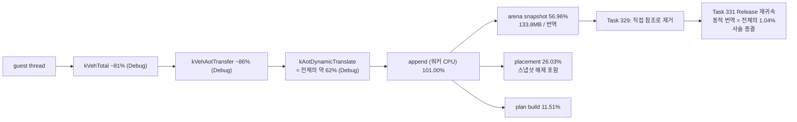
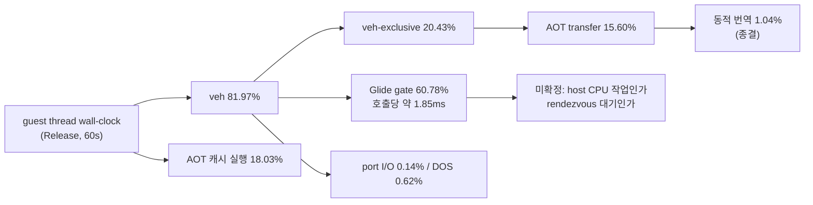

# 현재 실행 frontier / Current execution frontier

과거 전체 기록은 [Task 303까지의 frontier 원문](history/current-execution-frontier-through-task303.md)에
보존합니다. 이 문서는 최근 약 10개 Task와 현재 결정만 유지합니다.

## 현재 최상위 결론 / Active top-level conclusion

**확인됨:** 현재 `aot-dbt`는 독립적인 연속 DBT 실행기가 아니라 `aot-dynamic` 위에서
일부 TF/`INT3` 경로만 정상 host dispatch나 Dr0 span으로 바꾼 정책입니다. Task 276의
동일 시간 progress는 `aot-dynamic 10,709` 대 `aot-dbt 10,685`로 사실상 같았습니다.
Task 287의 progress `+11.86%`는 `aot-dbt` 내부 span OFF/ON 비교이지 backend 간 절대
성능 개선이 아닙니다. 과거 통제 표본에서 legacy가 `aot-dynamic`보다 14.6~20.6배
빨랐다는 사실과 함께 보면 현재 증분 경로는 요구되는 60배 개선 규모에 맞지 않습니다.

Task 308의 실제 검증은 exception-free HLE 가설을 부분 기각했습니다. 정상 host-call
HLE 경계는 60초 동안 exception/legacy fallback 0과 EEPROM 일치를 유지했고
planner-HLE 25,134회를 예외 없이 처리했습니다. 그러나 OFF/ON progress는
`44,977 → 45,716`(+1.64%)뿐이었고, single-step은 `276,680 → 254,889`(-7.88%),
AOT boundary는 `66,245 → 41,224`(-37.77%)였습니다. 또한 직접 interrupt HLE는
INT 8 selector 계약을 바꾸므로 `INT/IRET`는 현재 VEH 경계에 남겨야 합니다.

Task 309의 EIP별 계측은 single-step 횟수만으로 비용을 판단할 수 없음을 확인했습니다.
60초 동안 272,543개 single-step을 모두 기록했으며 HLE는 event의 33.60%지만
`HandleSingleStepTrace` 내부 TSC tick의 84.82%였습니다. cycle 상위 주소는 하나의
계산 loop가 아니라 segment-register move와 port-I/O HLE에 분산됐고 상위 32개
coverage도 67.21%였습니다. 따라서 한 loop를 바로 exception-free generation으로
바꾸는 80% gate는 통과하지 못했습니다.

Task 322의 단계별 귀속은 handler 내부 tick의 74.05%, HLE tick의 75.29%가
`TryResumeAotAfterHandledHle` 한 곳이며 호출당 평균이 `616,079 tick`(2.5GHz 기준 약
246us)임을 확인했습니다. HLE emulate 본체도, 상시 진단 계측(1.32%)도 아닙니다.

다만 Task 322가 그 원인으로 지목한 "동적 번역"은 **기각됐습니다.** 해당 경로는 opt-in
`REPIU_AOT_DBT_POST_HLE_TRANSLATE`가 꺼져 있어 두 실행 모두 `posthle=0/0`이었습니다.
이에 따라 "다음 작업은 로드맵 1단계"라는 결론도 철회합니다. `INT3`를 dispatch stub으로
바꿔도 stub이 호출할 해석 경로가 그대로면 비용은 줄지 않기 때문입니다.

Task 323이 그 미계측 구간을 처음으로 귀속했고, 결과는 지금까지의 방향을
**뒤집습니다.**

| bucket | 전체 wall-clock 대비 |
|---|---:|
| VEH handler 본문 — AOT boundary 경로 | **73.76%** |
| VEH handler 본문 — single-step handler | 12.62% |
| AOT cache 내 guest 실행 (추정) | 약 12.4% |
| Glide gate | 1.29% |
| kernel 예외 전이 (추정) | **1.20%** |
| DOS service / port I/O | 0.15% |

**확인됨(당시):** 예외 전이 비용은 1.20%입니다. TF와 `INT3`를 **전부** 제거해도 상한은
약 **1.012배**입니다. 즉 "TF/VEH를 걷어낸다"는 방향은 당시 병목과 맞지 않았습니다.
**→ Task 336에서 뒤집혔습니다.** 전이 1회 가격은 그대로지만 예외 횟수가 늘어(같은
60초에 VEH 진입 1,307,096회) 지금은 전체의 **27.7~30.4%** 이며 상한은 약 1.4배입니다.

**확인됨:** 실제 병목은 handler 본문 안의 **O(n) 선형 탐색**입니다.
`kAotResume` 안에서 `FindAotCacheAddress`(`placement.address_map` 선형 스캔)가
87.75%를 차지하며 호출당 평균 `1,047,784 tick`(약 419us)입니다. 같은 함수가
`ResolveAotTransferTarget`을 통해 AOT boundary 경로에서도 호출되므로 73.76% 구간의
주원인일 가능성이 높습니다(미확정).

Task 324가 그 교체를 수행했습니다. 호출당 `1,047,784 → 6,866 tick`(-99.3%),
60초 heartbeat `79,640 → 331,913`(4.17배), progress `8,199 → 21,843`(2.66배)입니다.

**그러나 "AOT boundary 경로도 같은 원인"이라는 가설은 기각됐습니다.** VEH 내부이면서
single-step handler 밖인 구간은 73.76% → **74.34%**로 줄지 않았습니다. 즉 그 구간의
비용은 `FindAotCacheAddress`가 아닌 다른 원인이며, 자체 계측 없이는 알 수 없습니다.

Task 325가 그 구간을 귀속했고 정체가 확정됐습니다. **AOT transfer 해석부
(`HandleAotGuestCodeWrite{Completion,Fault}`, `HandleAotReentry`,
`HandleAotIndirectTransfer`, `HandleAotConditionalTransfer`,
`HandleAotReturnTransfer`)가 VEH 내부의 87.50%, 전체 wall-clock의 71.31%** 이며
호출당 평균은 `1,269,368 tick`(약 508us)입니다.

다른 후보는 모두 기각됐습니다. live telemetry의 `InterlockedExchange` 9회 0.08%,
single-step 이후 HLE 핸들러 체인 0.66%, prologue 검증 0.25%, boundary gate 0.11%,
파생 residual 1.01%입니다. residual이 작다는 것은 분해 경계가 옳았다는 뜻입니다.

Task 326이 그 재분해를 수행했고 답이 나왔습니다. **60초 동안 단 230회의 동적 번역이
전체 wall-clock의 61.6%를 소비합니다.** 호출당 약 **175ms**입니다.

| function 축 | count | `kVehAotTransfer` 대비 | 호출당 tick |
|---|---:|---:|---:|
| **`kAotDynamicTranslate`** | **230** | **88.64%** | **437,403,007** |
| `kAotTransferResolve` | 39,033 | 89.27% | 2,595,663 |
| `kAotResidency` | 55,507 | 1.61% | 32,865 |
| `kAotHleBoundaryScan` | 253,526 | 0.05% | 243 |

Task 325가 미검증 가설로 남긴 `AccumulateAotResidency`(1.61%)와
`IsAotHleBoundaryAddress` 선형 탐색(0.05%)은 **모두 기각**됐습니다. transfer 해석
자체는 싸고 **번역 대기만 비쌉니다.**

**확인됨:** `RequestAotDynamicTranslation`은 워커 스레드에 `SetEvent` 후
`WaitForSingleObject(INFINITE)`로 동기 대기합니다. 즉 측정된 175ms는 guest thread가
**차단된 시간**이며 실제 작업은 계측 범위 밖인 워커 스레드에 있습니다.

Task 327이 워커 스레드를 계측해 그 질문에 답했습니다. **스케줄링 지연이 아니라
워커 CPU 작업입니다.**

| rendezvous 구간 | `guest_total` 대비 |
|---|---:|
| **`append`** (`AppendWin32DynamicAotTranslation`) | **101.00%** |
| `wake_latency` | 0.03% |
| `complete_latency` | 0.01% |
| `segment_table` | 0.00% |

번역 1회 평균은 약 **259ms**, 최댓값은 약 **702ms** 입니다. 워커 기상 지연은 2코어에
5개 스레드가 경합함에도 평균 약 76us, 최대 3.4ms에 그칩니다.

**확인됨:** rendezvous 제거나 비동기화는 답이 아닙니다. **번역 자체를 싸게 또는 작게
만들어야 합니다.**

Task 328이 `append` 내부를 다섯 단계로 나눴고 원인이 확정됐습니다.

| 단계 | `append` 대비 | 회당 |
|---|---:|---:|
| **`arena_snapshot`** | **56.96%** | 약 162ms |
| `placement` | 26.03% | 약 74ms |
| `plan_build` | 11.51% | 약 33ms |
| `image_emit` | 5.04% | 약 14ms |
| `validate` | 0.44% | — |

**확인됨:** `AppendWin32DynamicAotTranslation`은 진입 즉시 **guest arena 전체
(133.8MB)를 zero-fill 후 복사**합니다. 번역 1회는 평균 명령 1,039개를 다루고
7,830바이트를 emit하는데, 그 위해 140,341,248바이트를 복사합니다 — emit 대비
**17,924배**입니다. 60초 동안 스냅샷으로만 약 19.5GB를 복사했습니다.

**확인됨:** **번역 단위 축소는 역효과**입니다. 단위를 줄이면 번역 횟수가 늘고
스냅샷 133.8MB는 매번 고정이므로 총 비용이 커집니다. 고칠 대상은 단위가 아니라
스냅샷 범위입니다.

**확인됨:** 이 비용만은 **Debug 왜곡이 아닙니다.** zero-fill·`ReadProcessMemory`·해제는
메모리 대역폭과 syscall 비용이라 최적화 수준과 무관합니다.

**귀속 주의:** `placement` 26.03%에는 같은 133.8MB 버퍼의 해제가 포함됩니다(소멸 순서
때문이며 측정 전에 문서화). 따라서 스냅샷 생애주기 전체는 **57~83%** 구간으로만
말할 수 있습니다.

**미확정:** `placement` 내부에서 스냅샷 해제와 실제 placement 작업의 비중.
`plan_build`의 명령당 약 32us도 Zydis decode치고는 큽니다. 비translate 워커 작업
4,480회의 rendezvous 비용도 아직 재지 않았습니다.

Task 329가 그 스냅샷을 제거했습니다. 측정 사슬은 여기서 끝나고 **구현으로 전환**했습니다.
선행 조건이던 "guest 외 스레드의 arena 쓰기"는 감사로 **없음이 확인**되어 설계
**옵션 1(live arena 직접 참조)** 을 그대로 채택했고, 번역 1회의 zero-fill·복사·해제
140,341,248바이트가 **모두 사라졌습니다.**

**확인됨:** 보이는 범위가 133.8MB 그대로이므로 plan은 바이트 단위로 보존됩니다.
소유 복사본을 oracle로 둔 차등 probe가 plan 스칼라 전 필드, block/instruction
스트림(원본 바이트 포함), emit 이미지의 `bytes`·`address_map`·`fixups` 일치를
확인했습니다.

**확인됨:** 60초 실측에서 번역 1회당 append 비용이 `710,135,523 → 67,367,429 tick`
(**-90.5%, 10.5배**)입니다. 단계별 회당 변화는 다음과 같습니다.

| 단계 | Task 328 회당 | Task 329 회당 | 변화 |
|---|---:|---:|---:|
| **`arena_snapshot`** | 404,524,860 | **7,970** | **-99.998%** |
| `placement` | 184,814,412 | 26,839,702 | -85.5% |
| `plan_build` | 81,728,912 | 26,907,556 | -67.1% |
| `image_emit` | 35,797,624 | 12,806,455 | -64.2% |
| `validate` | 3,089,728 | 772,181 | -75.0% |

**확인됨:** Task 328의 귀속 주의가 옳았습니다. `placement`가 85.5% 줄었으므로 그
26.03%의 대부분이 133.8MB 해제였고, 스냅샷 생애주기 전체는 append의 **약 79%**
(예측 구간 `57~83%`의 상단)였습니다. `kAotDynamicTranslate`는 AOT transfer function
축의 88.64% → **26.44%** 입니다. 정상 timeout, malformed 0, EEPROM `A1FC1D...52570`
일치.

**미확정:** `plan_build`·`image_emit`·`validate`가 함께 64~75% 싸진 이유는 측정하지
않았습니다(메모리 압력 감소가 유력하나 추정). progress `9,293 → 62,566`,
heartbeat 784,320은 단일 표본이며 실행 간 편차가 커 배수는 확정하지 않습니다.

**Confirmed:** `aot-dbt` is not yet an independent continuous DBT executor; it layers selective
normal dispatch and Dr0 spans over `aot-dynamic`. Task 276 measured effectively identical
progress, while historical controlled samples found legacy 14.6-20.6x faster than
`aot-dynamic`. Task 308 then removed 25,134 planner-HLE exceptions in a stable 60-second run,
but improved progress only 1.64%; direct interrupt HLE also changed the selector contract.

Task 309 showed why count alone is insufficient. HLE represented 33.60% of 272,543
single-step events but 84.82% of TSC ticks measured inside `HandleSingleStepTrace`. The cycle
hotspots were distributed across segment-register and port-I/O HLE sites, and the top 32
covered 67.21%, below the 80% gate for one exception-free loop.

Task 322 found `TryResumeAotAfterHandledHle` alone holding 74.05% of handler ticks and 75.29%
of HLE ticks, averaging `616,079 ticks` (about 246us at 2.5GHz), rather than the emulation body
or the 1.32% of always-on diagnostics. Its attribution of that cost to dynamic translation is
rejected, however: the path is gated on an opt-in that was off, and both runs recorded
`posthle=0/0`. The conclusion selecting roadmap stage 1 is withdrawn, because a dispatch stub
cannot help while the stub still calls the same resolution path.

Task 323 attributed that residual for the first time and inverted the direction. Of guest
thread wall clock, 73.76% sits in the VEH handler body on the AOT boundary path, 12.62% in
the single-step handler, roughly 12.4% in real guest execution inside the AOT cache, 1.29%
in the Glide gate, and only 1.20% in kernel exception transition. Removing every TF and
`INT3` exception would therefore bound improvement at about 1.012x, so removing TF and VEH
did not address the bottleneck of that era. Task 336 overturned this: the per-transition price is
unchanged, but the exception count is not, and the same 60 seconds now takes 1,307,096 VEH entries,
putting transitions at 27.7-30.4% of wall clock and the bound at about 1.4x.

Task 324 replaced that lookup with a hash index, cutting per-call cost from `1,047,784` to
`6,866` ticks and raising 60-second heartbeat from 79,640 to 331,913 (4.17x) and progress from
8,199 to 21,843 (2.66x). The A/B nevertheless rejected the hypothesis that the AOT boundary
path shared the cause: the share inside the VEH but outside the single-step handler did not
fall, moving from 73.76% to 74.34%. That region has a different, still unknown cause, and
attributing it is the active priority — it is a single block holding three quarters of wall
clock whose interior has never been examined.

Task 325 then attributed that block. AOT transfer resolution holds 87.50% of time inside the
VEH and 71.31% of guest-thread wall clock, averaging `1,269,368` ticks per call. Every other
candidate is rejected: telemetry writes 0.08%, the post-single-step HLE chain 0.66%, prologue
validation 0.25%, boundary gates 0.11%, and a derived residual of 1.01% confirming the
decomposition boundaries were correct. The active priority is decomposing `kVehAotTransfer`
itself; code reading suggests `AccumulateAotResidency` (a statistics-only function that
re-initializes a Zydis decoder and decodes up to 64 instructions per re-entry), the linear
`IsAotHleBoundaryAddress` scan at the head of `ResolveAotTransferTarget`, and dynamic
translation, but all three remain unverified hypotheses.

Task 326 then decomposed it: 230 dynamic translations consume 61.6% of wall clock at about
175ms each, while transfer resolution itself is cheap. The Task 325 hypotheses are both
rejected — `AccumulateAotResidency` at 1.61% and the linear `IsAotHleBoundaryAddress` scan at
0.05%. `RequestAotDynamicTranslation` signals a worker thread and blocks in
`WaitForSingleObject(INFINITE)`, so the measured time is guest-thread blocked time and the work
itself sits on a worker thread outside the instrumented scope. Whether those 175ms are worker
CPU or scheduling latency on this two-core machine is unresolved, and the remedies differ
completely.

Task 327 then instrumented the worker thread and answered it: the time is worker CPU work, not
scheduling. `AppendWin32DynamicAotTranslation` accounts for essentially the whole rendezvous
while wake and completion latency together account for 0.04%, even with five threads on two
cores. One translation averages about 259ms and peaks near 702ms. Removing or asynchronizing
the rendezvous is therefore not the answer; translation itself must become cheaper or smaller.

Task 328 then split `append` five ways and identified the cause. `AppendWin32DynamicAotTranslation`
zero-fills and copies the entire 133.8MB guest arena on entry, taking 56.96% of the append, while
one translation covers only 1,039 instructions and emits 7,830 bytes — 17,924 times less than it
copies. Shrinking the translation unit would therefore be counterproductive, since the 133.8MB
snapshot is fixed per translation. Unlike the rest of this chain, that cost is not a Debug
artifact: zero-fill, `ReadProcessMemory`, and deallocation are bandwidth and syscall costs.

Task 329 removed that snapshot, ending the measurement chain and moving to implementation. Its
prerequisite — whether any thread other than the guest writes into the arena — was audited and
answered no, so design Option 1 was adopted unchanged and the entire 140,341,248-byte zero-fill,
copy, and free per translation is gone. Because the visible range is still the whole 133.8MB, the
plan is preserved byte for byte, verified by a differential probe that treats the owning copy as
the oracle across every plan scalar, the block and instruction streams including original bytes,
and the emitted image. No performance number is claimed yet: the 60-second in-game A/B has not
been run, and it is also what will finally separate the snapshot's deallocation from real
placement work inside the 26.03%.

Task 331이 그 사슬을 Release에서 재귀속했고 **대상이 사라졌습니다.** 실게임 평균
크기 환산으로 append 1회는 `65,371,802`(Debug) 대 `5,849,960 tick`(Release)이며,
Release에서는 어느 단계도 50%에 이르지 못합니다(`plan_build` 43.55%,
`placement` 27.61%, `image_emit` 24.55%). Debug 환산값이 Task 329의 실게임 측정
`67,367,429`과 3.0% 차이여서 이 환산은 대표성이 있습니다.

**모든 성능 수치에는 이제 구성을 명시합니다.** 위 표들 중 Task 322~329의 값은
**Debug 기준**이며, 단계 순위형 결론은 Release에서 뒤집힐 수 있습니다.



Task 331의 실게임 60초 Release 측정이 현재 축입니다.



## 최근 Task / Recent tasks


### Task 304 — native-span 음성 캐시 / Native-span negative cache

**확인됨:** 반복 scan 거절의 99.68~99.69%를 byte-validated cache로 재사용했습니다.
texture milestone 중앙값은 1,031ms 빨라졌지만 후반 progress 중앙값은 `+0.02%`였습니다.
decode 비용은 존재하지만 장기 지배 병목은 예외 횟수라는 결론입니다.
[상세 작업 로그](../work-logs/20260726-304-native-span-negative-cache.md)

**Confirmed:** The cache reuses nearly all repeated scan rejections and improves early texture
milestones, but does not materially change late throughput.

### Task 305 — retired trap 직후 span / Immediate span after retired traps

**확인됨:** opt-in span은 시도의 95.28~95.46%에 성공하고 single-step을 중앙값 2.86%
줄였지만 progress 개선 중앙값은 0.35%뿐이었습니다. 경계까지 pending/trace 상태를
보존해야 정확성이 유지되며 기능은 기본 OFF입니다.
[상세 작업 로그](../work-logs/20260726-305-retired-trap-immediate-span.md)

**Confirmed:** Immediate spans remove some post-trap stepping, but scanner/Dr0 overhead leaves
only a 0.35% median progress gain, so the feature remains opt-in.

### Task 306 — retired trap hotset / Retired-trap hotset

**확인됨:** 60초 profile의 retired trap 7,401회 중 7,293회(98.54%)가 5바이트 미만이고
quarantine 결과였습니다. 상위 두 guest 주소가 64.06%, 상위 16개가 98.24%를
차지했습니다. stable gate는 이 trap을 줄일 수 있지만 전체 성능 예상은 1~3%로 60배
목표와 맞지 않으므로 현재 우선순위에서 제외합니다.
[상세 작업 로그](../work-logs/20260726-306-retired-trap-hotset-profile.md)

**Confirmed:** Short quarantined entries dominate retired traps, but removing this population is
only a local 1-3% candidate and is no longer the active priority.

### Task 307 — current frontier 이력 분리 / Split current-frontier history

**확인됨:** 3,657줄의 과거 frontier 원문을 Task 303까지의 history로 byte-identical
보존하고 current 문서를 최근 10개 Task 중심으로 축약했습니다. 새 결론이 추가될 때
가장 오래된 current 항목을 제거해 약 10개를 유지합니다.
[상세 작업 로그](../work-logs/20260726-307-current-frontier-history-split.md)

**Confirmed:** The complete 3,657-line frontier through Task 303 is preserved byte-for-byte
in history. The current document keeps approximately ten recent task summaries.

### Task 308 — exception-free superblock 검증 / Exception-free superblock validation

**확인됨:** opt-in host-call HLE thunk는 GPR/EFLAGS, x87/MMX/SSE, host stack/TIB
경계를 보존하며 60초 실게임을 exception 0, legacy fallback 0, EEPROM 일치로
완료했습니다. `INT/IRET`를 VEH에 남긴 안전 slice는 25,134 HLE를 직접 처리했지만
progress는 `+1.64%`뿐이어서 5배 go/no-go에 실패했습니다. 직접 interrupt HLE의
selector 불일치도 확인되어 일반 HLE 예외 제거는 다음 성능 아키텍처가 아닙니다.
[상세 작업 로그](../work-logs/20260726-308-exception-free-superblock-validation.md)

**Confirmed:** The safe host-call slice completed 60 seconds with no exception or legacy
fallback and a matching EEPROM while directly handling 25,134 HLE sites. Progress improved
only 1.64%, failing the 5x gate, and direct interrupt HLE violated the established selector
contract.

### Task 309 — single-step hotspot cycle 귀속 / Single-step hotspot cycle attribution

**확인됨:** opt-in 8,192-slot EIP histogram은 60초 실행의 single-step 272,543개를
1,132개 주소로 전부 분류했고 overflow는 0이었습니다. HLE는 event의 33.60%지만
handler TSC tick의 84.82%였습니다. cycle 상위권은 segment-register move와 port-I/O
HLE였고 상위 8개 43.09%, 상위 32개 67.21%로 단일 loop 80% gate에는 미달했습니다.
[상세 작업 로그](../work-logs/20260726-309-single-step-hotspot-cycle-attribution.md)

**Confirmed:** The opt-in 8,192-slot EIP histogram classified all 272,543 steps across 1,132
addresses with no overflow. HLE represented 33.60% of events and 84.82% of handler TSC ticks.
Segment-register and port-I/O HLE dominated the cycle ranking, but the top 32 covered only
67.21%, below the 80% gate for one loop.

### Task 322 — handler 단계별 비용 귀속 / Handler stage attribution

**확인됨:** `HandleSingleStepTrace`를 5개 순차 단계로 나눈 60초 계측은 표본 53,628개,
distinct EIP 717개, overflow 0을 기록했습니다. `kAotResume` 74.05%,
`kHleDispatch` 23.58%, `kPrologueTrace` 1.32%, `kNativeEntry` 0.75%,
`kInterruptInjection` 0.04%, residual 0.27%입니다. 설계가 사전 고정한 gate 첫 행이
성립해 다음 작업은 로드맵 1단계로 확정됐습니다. 진단 계측이 hot path를 지배한다는
가설은 기각됐습니다. profile OFF/ON은 EEPROM hash 일치, fallback/malformed 0이었습니다.
[상세 작업 로그](../work-logs/20260727-322-single-step-handler-stage-attribution.md)

**Confirmed:** Five-stage attribution over 53,628 samples put 74.05% of handler ticks in
`TryResumeAotAfterHandledHle` and only 1.32% in always-on diagnostics, satisfying the
pre-registered gate for roadmap stage 1 and rejecting the instrumentation hypothesis.

### Task 323 — 전체 실행 시간 귀속 / Whole-run execution time attribution

**확인됨:** guest thread wall-clock의 86.38%가 VEH handler 본문이며 예외 전이는
1.20%, Glide gate는 1.29%입니다. `kAotResume` 안에서는 `FindAotCacheAddress` 선형
탐색이 87.75%로, 호출당 `1,047,784 tick`입니다. Part A gate는 성립했고 Part B gate는
전부 기각됐습니다. Task 322의 잘못된 인과 귀속도 함께 정정했습니다.
[상세 작업 로그](../work-logs/20260727-323-whole-run-execution-time-attribution.md)

**Confirmed:** The VEH handler body holds 86.38% of guest-thread wall clock while kernel
exception transition holds 1.20%, rejecting the premise behind TF/VEH removal. The linear
`FindAotCacheAddress` scan holds 87.75% of `kAotResume`.

### Task 324 — AOT cache 주소 해시 색인 / AOT cache address hash index

**확인됨:** `FindAotCacheAddress`를 버킷 체인 해시 색인으로 교체해 호출당
`1,047,784 → 6,866 tick`(-99.3%), heartbeat 4.17배, progress 2.66배를 얻었습니다.
차등 probe가 교체 이전 구현을 oracle로 두고 8개 경계 조건에서 의미 동등성을
검증했습니다. EEPROM 일치, fallback/malformed 0.
[상세 작업 로그](../work-logs/20260727-324-aot-cache-address-hash-index.md)

**기각됨:** AOT boundary 경로가 같은 원인을 공유한다는 가설. 해당 구간은 73.76%에서
74.34%로 줄지 않았습니다.

**Confirmed:** The hash index cut per-call cost 99.3% and raised heartbeat 4.17x and progress
2.66x with verified semantic equivalence. **Rejected:** the AOT boundary path did not share
the cause; its share held at 74.34%.

### Task 325 — VEH boundary 경로 귀속 / VEH boundary path attribution

**확인됨:** `DispatchGuestException`을 5개 하위 bucket으로 나눈 결과 AOT transfer
해석부가 VEH의 87.50%, 전체의 71.31%였고 호출당 `1,269,368 tick`이었습니다. 사전
등록한 gate 중 첫 행만 성립하고 나머지는 모두 기각됐으며, residual 1.01%로 분해
경계가 옳았음이 확인됐습니다.
[상세 작업 로그](../work-logs/20260727-325-veh-boundary-path-attribution.md)

**Confirmed:** AOT transfer resolution holds 87.50% of VEH time and 71.31% of wall clock at
`1,269,368` ticks per call. Only the first pre-registered gate holds, and a 1.01% residual
confirms the decomposition boundaries.

### Task 326 — AOT transfer 해석부 재분해 / AOT transfer resolution decomposition

**확인됨:** 동적 번역 230회가 전체 wall-clock의 61.6%, 호출당 약 175ms입니다.
`AccumulateAotResidency`(1.61%)와 `IsAotHleBoundaryAddress`(0.05%) 가설은 모두
기각됐습니다. `RequestAotDynamicTranslation`이 워커 스레드에 동기 대기하므로 측정된
시간은 guest thread 차단 시간입니다.
[상세 작업 로그](../work-logs/20260727-326-aot-transfer-resolution-decomposition.md)

**Confirmed:** 230 dynamic translations hold 61.6% of wall clock at about 175ms each, and both
Task 325 hypotheses are rejected. The measured time is guest-thread blocked time on a
synchronous worker rendezvous.

### Task 327 — 번역 워커 타이밍 / Translation worker timing

**확인됨:** rendezvous의 101.00%가 `AppendWin32DynamicAotTranslation`이고 wake와
complete 지연은 합쳐 0.04%입니다. 번역 1회 평균 259ms, 최대 702ms. 스케줄링은
병목이 아니므로 rendezvous 제거는 답이 아닙니다.
[상세 작업 로그](../work-logs/20260727-327-translation-worker-timing.md)

**Confirmed:** The rendezvous is worker CPU work, not scheduling: append holds 101.00% while
wake and complete latency total 0.04%, averaging 259ms per translation.

### Task 328 — 동적 append 단계 분해 / Dynamic append phase decomposition

**확인됨:** arena 전체 스냅샷이 append의 56.96%이고, 번역 1회는 명령 1,039개를 다루며
7,830바이트를 emit하는데 140,341,248바이트를 복사합니다. 번역 단위 축소는 역효과이며
고칠 대상은 스냅샷 범위입니다. 이 항목만은 Debug 왜곡이 아닙니다.
[상세 작업 로그](../work-logs/20260727-328-dynamic-append-phase-decomposition.md)

**Confirmed:** The full-arena snapshot is 56.96% of one append, copying 140,341,248 bytes to
translate 1,039 instructions into 7,830 bytes. Shrinking the translation unit is
counterproductive; the snapshot range is what must change.

### Task 329 — arena 스냅샷 제거 / Arena snapshot elimination

**확인됨:** guest 외 스레드는 arena에 쓰지 않습니다(host poll은 host 소유
`DosLowMemory`에만, 오디오 워커는 host 버퍼에만, 번역 워커는 AOT cache에만 씁니다).
Glide는 별도 스레드가 아니라 host main에서 guest 대행이며 `InvokeOnHostThread`가
guest를 차단하므로 번역 rendezvous와 **상호 배타적**입니다. 따라서 설계 옵션 1을
채택해 스냅샷을 제거했고, 번역당 140,341,248바이트 zero-fill·복사·해제가 사라졌습니다.

**확인됨:** 의미는 보존됩니다. 소유 복사본을 oracle로 둔 `arena_view` probe가 plan
스칼라 전 필드, block/instruction 스트림(원본 바이트), emit 이미지
`bytes`/`address_map`/`fixups` 일치와 뷰의 liveness, 경계 거절 동일성을 확인했습니다.
`ReadProcessMemory` 실패 반환을 대신해 프로세스당 1회 `VirtualQuery` 검증을 넣었습니다.

**미확정:** 실게임 60초 A/B 미수행 — 성능 수치 없음.
[상세 작업 로그](../work-logs/20260727-329-arena-snapshot-elimination.md)

**Confirmed:** No thread other than the guest writes into the arena, and Glide host commands are
mutually exclusive with the translation rendezvous, so Option 1 was adopted and the per-translation
140,341,248-byte zero-fill, copy, and free are gone with the plan preserved byte for byte, checked
against the owning copy as oracle. Measured over 60 seconds, per-translation append cost fell from
`710,135,523` to `67,367,429` ticks (-90.5%), with `arena_snapshot` down 99.998% and `placement`
down 85.5%, confirming Task 328's caveat that the deallocation dominated it and putting the
snapshot's whole lifecycle at about 79% of an append. **Unresolved:** why `plan_build`,
`image_emit`, and `validate` also fell 64-75% was not measured, and the progress and heartbeat
multiples are single-sample.

### Task 330 — plan build 귀속과 Debug 왜곡 / Plan-build attribution and Debug distortion

**확인됨:** `plan_build`는 **Debug 왜곡이 지배**합니다. 같은 코드·같은 입력에서 명령당
`24,512 tick`(Debug) 대 `2,162 tick`(Release), 비율 **1/11.34**입니다.

**확인됨: 단계 순위가 구성에 따라 뒤집힙니다.** Debug는 `classify` 40.71% +
`walk` 24.52%가 지배하지만, Release는 `decode`가 44.02%로 최대입니다. Debug 계수가
단계마다 **2.67배(decode)에서 28.7배(classify)까지** 다르기 때문입니다.

| 단계 | Debug | Release |
|---|---:|---:|
| `decode` | 10.37% | **44.02%** |
| `classify` | **40.71%** | 16.07% |
| `walk` | 24.52% | 18.81% |
| `record_build` | 11.44% | 8.92% |
| `sweep` | 0.68% | 0.68% |
| residual | 12.28% | 11.51% |

**따라서 방법론 결론이 하나 추가됩니다.** Debug에서 얻은 "어느 단계가 지배하는가"류
결론은 Release에서 뒤집힐 수 있으므로 그대로 최적화 근거로 쓸 수 없습니다. 반면
알고리즘 복잡도(Task 323의 O(n) 선형 탐색)나 대역폭·syscall 비용(Task 329의 스냅샷)처럼
구성과 무관한 결론은 영향받지 않습니다.

**확인됨:** "명령당 비용이 Zydis decode치고 크다"는 오래된 전제는 **전제부터
틀렸습니다.** Debug 기준 decode는 `plan_build`의 10.37%뿐입니다. jump-table sweep도
1패스·0.68%로 문제가 아닙니다(미측정이던 F5 해소).

**미확정:** 게임을 Release로 구동 가능한지 확인하지 않았습니다.
[상세 작업 로그](../work-logs/20260728-330-plan-build-attribution.md)

**Confirmed:** `plan_build` is dominated by Debug distortion at 1/11.34, and the stage ranking
inverts between configurations — `classify` leads in Debug at 40.71% while `decode` leads in
Release at 44.02% — because the Debug factor ranges from 2.67x to 28.7x by stage. Debug-derived
"which stage dominates" conclusions therefore cannot be used as optimization evidence, while
complexity and bandwidth conclusions are unaffected. The premise that the per-instruction cost was
large for Zydis decoding is refuted: decoding is 10.37% of `plan_build` in Debug, and the sweep
runs a single pass at 0.68%.

### Task 331 — Release 기준 append 재귀속 / Release append re-attribution

**확인됨:** Release 전체 빌드가 통과하고(`scripts/build_win32_x86_release.bat`),
probe suite가 두 구성 모두 exit 0입니다. 실게임 평균 크기(1,039 명령) 환산 append
1회는 `65,371,802`(Debug) 대 `5,849,960 tick`(Release)로 **11.2배** 차이입니다.
Debug 환산은 Task 329의 실게임 `67,367,429`과 3.0% 차이입니다.

**확인됨: gate G4 성립 — Release append에는 지배 단계가 없습니다.**
`plan_build` 43.55%, `placement` 27.61%, `image_emit` 24.55%, `validate` 4.30%.
Debug 계수도 단계마다 `image_emit` 7.93배에서 `placement` 명령당 20.34배까지
다릅니다. Task 330의 방법론 결론이 append 전체로 확장됩니다.

**확인됨:** `placement`의 append당 고정 비용 약 `429,497 tick`(약 172us)은 캐시
전체 16MB에 대한 `VirtualProtect` 2회에서 오며 구성과 무관합니다. Debug에서는 6.6%로
보이지 않다가 Release에서 56.83%가 됩니다.

**추정:** Task 326의 번역 빈도를 그대로 쓰면 Release 번역 총비용은 전체의 약 0.9%
입니다. 즉 동적 번역 사슬은 Release에서 지배 병목이 아닐 가능성이 큽니다.

**확인됨(실게임 60초 A/B):** 두 구성 모두 malformed 0, fatal 0, Glide 공백 0으로
동등하며 Release progress는 1.27배, 프레임은 2.05배입니다. append 실측비는
**1/10.4**로 probe 예측 1/11.2와 일치했고, 단계 분포도 예측과 맞았습니다.
**동적 번역은 Release 전체의 1.04%이고 지배 병목은 Glide gate 60.78%**
(호출당 약 1.85ms, 프레임당 약 78회)입니다.

**미확정:** 1,039 명령 수치는 두 점 적합의 유도값. 재배치 base에 따라 정적 emit이
실패하는 현상은 관찰만 했습니다. 실게임 A/B는 구성당 1회 표본입니다.
(Glide gate의 정체는 Task 333에서 해소됐습니다.)
[상세 작업 로그](../work-logs/20260728-331-release-baseline-migration.md)

**Confirmed:** The Release build passes and the probe suite exits 0 in both configurations. At the
1,039-instruction in-game mean one append costs `65,371,802` ticks in Debug against `5,849,960` in
Release, a factor of 11.2, with the Debug figure 3.0% from Task 329's live `67,367,429`. Gate G4
holds: no Release phase reaches 50%, at 43.55% `plan_build`, 27.61% `placement`, 24.55%
`image_emit`, and 4.30% `validate`, and the Debug factor again varies by phase from 7.93x to
20.34x. `placement` carries a configuration-independent fixed cost of about `429,497` ticks per
append from protecting the whole 16MB cache twice, which Debug hides at 6.6% and Release shows at
56.83%. **해소됨(Task 333):** Glide gate 질문은 대기로 확정됐고 원인이 제거됐습니다.

**Confirmed by the 60-second in-game A/B:** both configurations are equivalent on malformed,
fatal, and Glide-gap counts, Release reaching 1.27x the progress and 2.05x the frames; the measured
append ratio is 1/10.4 against the probe's predicted 1/11.2 with matching phase shares; dynamic
translation holds 1.04% of Release wall clock; and the dominant cost is the Glide gate at 60.78%,
about 1.85ms per entry and roughly 78 entries per frame. **Unresolved:** the derived nature of the
1,039-instruction figures, a base-dependent static emit failure observed while building the probe,
and that the in-game A/B is a single sample per configuration. Whether the Glide gate cost was host
CPU work or waiting was settled by Task 333.

### Task 333 — Glide gate rendezvous 분해와 제거 / Glide gate rendezvous removal

**확인됨: gate G1 성립 — Glide gate 비용의 95.67%가 host thread 대기이고 host 작업은
1.83%입니다.** `queue` 0.07%, `complete` 2.43%, residual 0.00%로 네 구간이 rendezvous를
정확히 분할합니다. 회당 `wake` 약 1.65ms는 host poll loop의 `Sleep(1)` 주기(약
1.90ms)와 일치합니다.

**확인됨:** `Sleep(1)`을 같은 condition variable에 대한 1ms 상한 대기로 교체해
rendezvous 1회가 `4,300,882 → 192,482 tick`(1/22.3), 프레임 `277 → 876`(3.16배),
progress `64,794 → 84,855`(1.31배)가 됐습니다. Glide gate는 wall-clock의
`60.18% → 8.88%`, AOT 캐시 내 guest 실행은 `18.58% → 37.01%`입니다.
malformed 0, fatal 0, Glide 공백 0은 양쪽 동일합니다.

**미확정:** OFF 첫 실행에서 host 이미지 내부 `0xC0000005`(EAX=0 역참조) 조기 종료가
1회 있었고 재현되지 않았습니다. gate 진입당 rendezvous 1.92회(`PumpEvents`)도
남아 있습니다.
[상세 작업 로그](../work-logs/20260728-333-glide-gate-rendezvous-timing.md)

**Confirmed:** Gate G1 holds — 95.67% of the Glide gate was waiting for the host thread against
1.83% of host work, with `queue` at 0.07%, `complete` at 2.43%, and a 0.00% residual confirming the
partition; the mean 1.65ms wake matches the poll loop's own `Sleep(1)` cadence of about 1.90ms.
Replacing that sleep with a bounded wait on the same condition variable cut a rendezvous from
`4,300,882` to `192,482` ticks, raised frames from 277 to 876 and progress from 64,794 to 84,855,
and moved the Glide gate from 60.18% to 8.88% of wall clock while AOT cache execution rose to
37.01%, with malformed, fatal, and Glide-gap counts unchanged at zero. **Unresolved:** one
non-reproducing early `0xC0000005` inside the host image, and 1.92 rendezvous per gate entry from
`PumpEvents`.

### Task 334 — AOT reentry 재분해와 역방향 색인 / AOT reentry decomposition and reverse index

**확인됨: gate G1 성립 — `HandleAotReentry`의 96.00%가 `FindAotGuestAddress`의 선형
탐색이었습니다.** 호출 128,700회, 회당 `551,864 tick`, Release 전체의 약 44%입니다.
나머지는 `single-step` 2.42%, `retired` 0.99%, `provenance` 0.26%,
`boundary-reason` 0.12%, residual 0.21%로 분해 경계가 옳았습니다.

**확인됨:** Task 324는 guest→cache 방향만 색인했고 cache→guest는 남아 있었습니다.
정렬 이진 탐색(정렬 여부는 관측, 미정렬이면 기존 선형 탐색으로 degrade)으로 교체해
회당 `551,864 → 2,075 tick`(266배), 프레임 `891 → 1,597`, progress
`86,203 → 109,158`입니다. VEH는 `64.07% → 34.13%`, AOT 캐시 내 guest 실행은
`35.93% → 65.87%`입니다. malformed 0, fatal 0, Glide 공백 0.

**미확정:** reentry 내부 1위가 `single-step` 64.61%로 바뀌었으나, reentry 핸들러
자체가 이제 전체의 3.5%뿐이라 우선순위는 낮습니다.
[상세 작업 로그](../work-logs/20260728-334-aot-reentry-decomposition.md)

**Confirmed:** Gate G1 holds — 96.00% of `HandleAotReentry` was the linear scan in
`FindAotGuestAddress`, `551,864` ticks per call over 128,700 calls and roughly 44% of Release wall
clock, with `single-step` at 2.42%, `retired` at 0.99%, `provenance` at 0.26%, `boundary-reason` at
0.12%, and a 0.21% residual confirming the boundaries. Task 324 had indexed only the guest-to-cache
direction; replacing this one with a sorted binary search — sortedness observed rather than assumed,
degrading to the original scan when unusable — cut the per-call cost to `2,075` ticks (266x), raised
frames from 891 to 1,597 and progress from 86,203 to 109,158, and moved the VEH from 64.07% to
34.13% of wall clock while AOT cache execution rose from 35.93% to 65.87%, with malformed, fatal,
and Glide-gap counts at zero. **Unresolved:** the largest remaining interval is now `single-step` at
64.61%, though the reentry handler is only 3.5% of the run, so it is low priority.

### Task 335 — gate 진입 pump rendezvous 제거 / Removing the per-gate pump rendezvous

**확인됨:** gate 경로의 `PumpEvents`는 gate 진입마다 host rendezvous를 하나씩 더
만들고 있었고(진입당 1.92회), host poll loop가 이미 매 iteration pump하므로
중복이었습니다. 제거 후 진입당 `0.92`, Glide gate 비중 중앙값 `17.00% → 13.47%`,
프레임 중앙값 `1,891 → 1,995`(+5.5%), progress 중앙값 +2.7%입니다.
malformed 0, fatal 0, Glide 공백 0.

**확인됨(방법론):** 같은 설정에서 실행 간 프레임 편차가 **18%** 이고 각 설정의 첫
실행이 항상 가장 느립니다. **단일 표본이었다면 이 작업의 결론은 반대로 나왔습니다.**
이후 성능 판정은 3회 이상 중앙값을 씁니다.

**미확정:** 비용은 3.53%p 줄었는데 프레임은 5.5%만 늘었습니다. 실행을 지금 무엇이
pacing하는지가 다음 질문입니다.
[상세 작업 로그](../work-logs/20260728-335-glide-gate-pump-rendezvous.md)

### Task 336 — VEH residual 귀속과 예외 전이 가격 / VEH residual and exception price

**확인됨:** VEH residual은 미계측 구간이 아니라 `HandleSingleStepTrace`의 단계
profile이 별도 opt-in으로 꺼져 있었던 것입니다. 켜자 residual `36.56% → 3.26%`,
`single-step`이 VEH의 33.68%. 그 안의 1위는 Release에서 `hle` 66.4%(전체의 7.02%)로,
Task 322의 Debug 순위(`aot-resume` 74.05%)와 정반대입니다. **코드 변경 없음.**

**확인됨:** 예외 전이 1회는 `INT3` 34,521 / single-step 37,885 tick이고 Debug(34,608 /
37,519)와 1% 미만 차이입니다. 커널 비용이라 구성과 무관합니다.

**확인됨(유도):** VEH 진입 1,307,096회를 곱하면 전이 총비용은 전체의 **27.7~30.4%**,
남는 실제 guest 실행은 38.2~40.9%입니다. **TF/`INT3` 제거 상한은 1.012배가 아니라
약 1.38~1.44배**입니다.

**방법론:** Task 323의 1.20%는 오측이 아니었습니다. 가격은 그대로고 횟수가 늘었습니다.
**고정 비용의 비중은 다른 곳을 최적화할 때마다 재계산해야 합니다.**

**미확정:** 전이 가격은 probe의 최소 핸들러 기준이므로 실제는 더 클 수는 있어도 작지
않습니다. `INT3`/single-step 혼합비는 세지 않았습니다. 1.4배는 전이만 없앨 때의
상한이며 핸들러 본문(31.40%)까지 대체하는 설계면 더 높습니다.
[상세 작업 로그](../work-logs/20260728-336-veh-residual-and-exception-price.md)

**Confirmed:** The VEH residual was never uninstrumented — `HandleSingleStepTrace` carries a stage
profile behind its own opt-in. Enabling it drops the residual from 36.56% to 3.26% and shows
`single-step` at 33.68% of the VEH, led by `hle` at 66.4% (7.02% of the run), inverting Task 322's
Debug ranking of `aot-resume` at 74.05%; no code changed. One kernel transition costs 34,521 ticks
for `INT3` and 37,885 for single-step in Release against 34,608 and 37,519 in Debug — under 1%
apart, as befits kernel cost. Multiplying by 1,307,096 VEH entries puts transitions at 27.7-30.4%
of wall clock and leaves 38.2-40.9% for real guest execution, so removing every TF and `INT3` bounds
improvement at about 1.38-1.44x rather than 1.012x. Task 323's 1.20% was not a bad measurement: the
price was the same and the count was not, which adds the method rule that a fixed cost's share must
be recomputed after every optimization elsewhere. **Unresolved:** the price comes from the probe's
minimal handler so the real cost can only be higher, the `INT3`-to-single-step mix was not counted,
and 1.4x bounds removing the transition alone.

### Task 337 — 예외 census / Exception census

**확인됨:** TF single-step 735,886(79.24%), `INT3` 181,947(19.59%), AV 10,881(1.17%),
합계 928,715 = VEH 진입 횟수. 배타성 구조적 확인.

**확인됨:** 연속 single-step 구간은 이봉분포입니다. 1개 구간 91,580(개수 57.1%,
step 12.4%), **5~8개 구간 61,528(step 약 54%)**, 33개 이상 2,022(평균 약 98개,
step 약 27%). 최대 337. 결과 축은 HLE 21.9%, native 39.9%,
**아무 핸들러도 안 걸린 TF 38.2%** 입니다.
[상세 작업 로그](../work-logs/20260728-337-exception-census.md)

**Confirmed:** 735,886 single-steps (79.24%), 181,947 breakpoints (19.59%), and 10,881 access
violations (1.17%) total exactly the run's VEH entry count, so the census is exclusive by
construction. Single-step runs are bimodal: 91,580 one-step runs are 57.1% of runs but 12.4% of
steps, while 61,528 runs of five to eight carry about 54% and 2,022 runs of 33 or more, averaging
about 98, carry about 27%. By outcome, 21.9% of steps hit HLE, 39.9% native, and 38.2% no handler
at all.

### Task 338 — 예외 축소 opt-in A/B / Exception-reduction opt-in A/B

**기각:** `REPIU_AOT_DBT_SUPERBLOCK=1`은 `INT3`를 7.4배 줄이지만 Glide gate 경계까지
없애 렌더링이 멈춥니다(gate 진입 `67,108 → 74`, `grBufferSwap` 0). progress 3.15배는
그리지 않아 생긴 값입니다.

**무효:** `REPIU_AOT_DBT_POST_HLE_TRANSLATE=1`은 경로 미진입(`posthle=0/0`).

**방법론:** 두 실행 모두 malformed 0 / fatal 0 / Glide 공백 0 / 창 열림을 통과했습니다.
**동등성 계약에 `grBufferSwap` 횟수, gate 진입 횟수, get-proc 개수를 추가합니다.**
[상세 작업 로그](../work-logs/20260728-338-exception-reduction-optin-ab.md)

**Rejected:** `REPIU_AOT_DBT_SUPERBLOCK=1` cuts `INT3` 7.4x but takes the Glide gate boundaries
with it, so the game stops rendering — gate entries fall from 67,108 to 74 and buffer swaps to zero
— and its 3.15x progress is an artifact of not drawing. **Void:** `POST_HLE_TRANSLATE=1` never
entered its path. Both runs passed every existing equivalence axis while drawing nothing, so the
contract now also requires the buffer-swap count, the gate entry count, and the resolved proc count.

**Confirmed:** The gate path's `PumpEvents` added one host rendezvous per gate entry — 1.92 per
entry — while the host poll loop already pumps every iteration, so it was redundant. Removing it
leaves 0.92 per entry, moves the Glide gate's median share from 17.00% to 13.47%, and raises the
median frame count from 1,891 to 1,995 (+5.5%) and median progress by 2.7%, with malformed, fatal,
and Glide-gap counts at zero. **Confirmed as method:** frame counts vary 18% between runs of the
same setting and the first run of a setting is always the slowest, so a single sample would have
inverted this task's conclusion; performance judgements from here use the median of at least three
runs. **Unresolved:** cost fell 3.53 points while frames rose only 5.5%, so what now paces the run
is the next question.

## 다음 검증 / Next validation

Task 337이 예외를 배타적으로 셌고, Task 338이 기존 opt-in 두 개를 Release에서
판정했습니다. **둘 다 채택 불가이며, 그 과정에서 동등성 계약의 구멍이 드러났습니다.**

**확인됨(Task 337): 예외의 79.24%가 TF single-step, 19.59%가 `INT3`, 1.17%가 AV**
입니다. census 합계가 VEH 진입 횟수와 정확히 일치해 배타성이 확인됐습니다.

**확인됨: single-step은 HLE 지점마다 1회씩 나지 않습니다.** 연속 구간 길이가
이봉분포입니다. 1개짜리 구간이 개수로는 57.1%지만 step 수로는 12.4%뿐이고,
**5~8개 구간이 step의 약 54%**, **33개 이상 꼬리가 약 27%** 입니다. hotspot profile은
single-step의 **38.2%가 아무 핸들러도 걸리지 않는 순수 walk**임을 보여줍니다.

**따라서 "HLE를 예외 없이 만든다"는 지배 인구를 겨냥하지 않습니다.** 그것이 겨냥하는
1-step 구간은 single-step의 12%뿐입니다.

**확인됨(Task 338): `REPIU_AOT_DBT_SUPERBLOCK=1`은 현재 형태로 쓸 수 없습니다.**
`INT3`를 7.4배 줄이지만 **그 안에 Glide gate 경계가 포함돼 게임이 렌더링을 멈춥니다**
(gate 진입 `67,108 → 74`, `grBufferSwap` 0회). progress는 3.15배로 뛰지만 이는
그리지 않아서 생긴 값입니다. **progress는 정당성 지표가 아닙니다.**

**확인됨: `REPIU_AOT_DBT_POST_HLE_TRANSLATE=1`은 경로에 진입조차 하지 않습니다**
(`posthle=0/0`). 판정 무효이며, 부수적으로 HLE 재개 시 대상이 이미 캐시에 있음을
알려줍니다.

**동등성 계약을 확장합니다.** 위 실행들은 malformed 0, fatal 0, Glide 공백 0,
창 열림까지 **전부 통과하면서** 아무것도 그리지 않았습니다. 이후 모든 성능 A/B는
`grBufferSwap` 횟수, Glide gate 진입 횟수, LINEXE get-proc 개수를 함께 확인합니다.

Task 339가 그 첫 질문에 답했고 **Task 338의 인과 지목을 정정했습니다.**

**기각:** "`SUPERBLOCK`이 Glide gate 경계를 삼킨다." gate 진입 급감은 증상입니다.

**확인됨: 원인은 HLE 처리 후 캐시로 복귀하지 못하는 것입니다.** `SUPERBLOCK`에서
`INT3`는 의도대로 7.4배 줄지만 그 자리를 **3.8배 늘어난 single-step**이 대신합니다
(구간 평균 `4 → 113`, 최대 `337 → 3,941`, 예외 중 single-step 98.76%). 그래서 게임이
60초 안에 Glide 초기화를 끝내지 못하고, `progress` 3.15배는 예외 수 증가의 부산물입니다.

**확인됨: 복귀가 막히는 지점을 단계별 호출 수로 확정했습니다.**

| 단계 | baseline | `SUPERBLOCK=1` |
|---|---:|---:|
| `TryResumeAotAfterHandledHle` 진입 | 206,345 | 1,186,516 |
| → seg-write 프로브 | 206,345 | **15,980 (1.3%)** |
| → quarantine/guest-IP | 190,874 | 649 |
| → cache lookup | **21,561 (10.4%)** | 641 |

* baseline: **88.7%가 quarantine/guest-IP 검사에서 거절**됩니다.
* `SUPERBLOCK`: **98.7%가 첫 guard에서 즉시 거절**되며, 남는 조건은
  `aot_reentry_pending` 미설정입니다. inline thunk는 `INT3` 경계를 거치지 않습니다.
* lookup까지 도달하면 캐시 적중률 100%이므로 **post-HLE 번역 분기는 도달 불가**입니다.
  `posthle=0/0`의 이유가 이것입니다.

**즉 Task 337의 5~8개 구간과 33+ 꼬리의 정체도 이것입니다.** exception-free HLE
기계장치가 아니라 **복귀 경로가 없습니다.**

Task 340이 1번을 수행했고 **답이 좁습니다.**

**확인됨: 거절의 80.24%는 페이지 quarantine이고, `IsGuestInstructionPointer` 거절은
0건입니다.** 60초 baseline에서 복귀 시도 187,373건 중 quarantine 150,341(80.24%),
segment-write 15,471(8.26%), 성공 21,561(11.51%), arena 밖 0, span-unsafe 0,
cache miss 0입니다.

**확인됨: quarantine된 페이지는 단 4개입니다**(`generation publishes/quarantines:
145/4`). **4개 페이지가 post-HLE 복귀의 80%를 막고 있습니다.** quarantine은 guest가
자기 페이지에 코드를 쓸 때(자기수정 보호) 걸립니다. Task 337의 5~8개 구간과 33+
꼬리의 발원지가 여기입니다.

**확인됨: quarantine과 segment-write만 통과하면 대상은 100% 캐시에 있습니다.**
post-HLE 번역 분기가 도달 불가라는 결론이 재확인됩니다.

Task 341이 그 페이지들을 식별했고 **원인이 확정됐습니다.**

**확인됨: 게임이 자기 자신의 `out` 명령을 1~2바이트 덮어씁니다.**

| 격리 페이지 | 쓰기 주체 = 대상 | 바이트 | 그 주소의 명령 |
|---|---|---:|---|
| `0x030F5000` | `0x030F5CC8` | 1 | `out dx, al` |
| `0x03033000` | `0x030334C6` | 2 | `out dx, ax` |
| `0x03034000` | `0x03034175` | 2 | `out dx, ax` |

세 경우 모두 **쓰기 주체와 대상이 같은 주소**이고 바이트 수가 그 명령의 길이와
같습니다. 하드웨어 탐지 후 `out`을 무력화하는 DOS 시절 관용구입니다. 쓰기 주체
불명으로 인한 기본 격리는 **0건**이므로 정책의 보수적 기본값이 원인이 아닙니다.

**확인됨: `0x030F5000`은 이 실행에서 가장 뜨거운 코드 페이지입니다**(live telemetry의
EIP `0x030F508D`, `0x030F5098`). **60초에 단 3번 일어나는 1~2바이트 쓰기가 4KB 페이지를
영구히 번역 대상에서 제외하고, 그것이 실행 시간의 큰 부분을 결정합니다.**

Task 342가 정책을 고쳤고 **프레임이 2.21배가 됐습니다.**

**확인됨:** quarantine을 첫 same-page 쓰기가 아니라 **4회째부터** 걸도록 바꿨습니다.
그 이전 쓰기는 retire만 합니다. **정확성은 그대로입니다** — retire가 이미 그 페이지의
번역을 무효화하므로 캐시가 옛 바이트를 실행할 수 없고, quarantine은 churn 방어일
뿐입니다.

| 항목 (60초 Release, 3회 중앙값) | 기존 | 신규 | 비 |
|---|---:|---:|---:|
| **프레임(`grBufferSwap`)** | 1,579 | **3,485** | **2.21배** |
| Glide gate 진입 | 65,487 | 149,260 | 2.28배 |
| TF single-step 예외 | 731,132 | 237,734 | 0.33배 |
| quarantine 거절 | 127,978 | 35,667 | 0.28배 |
| emulate 이벤트(구 "progress") | 107,572 | 30,591 | 0.28배 |

동등성은 전부 통과합니다(malformed 0, fatal 0, Glide 공백 0, get-proc 37, 프레임과
gate 진입 증가).

**지표 정정 — `progress`는 처리량이 아닙니다.** `diagnostic_progress_count`는
`instruction_emulation.cpp`의 HLE 처리 경로에서 증가하는 **emulate 이벤트 수**입니다.
이번의 -72%는 퇴보가 아니라 **emulate가 필요한 명령이 그만큼 줄었다**는 뜻입니다.
Tasks 331~341은 이 값을 처리량 대리 지표로 인용했고 그때는 프레임과 같은 방향이라
결론이 뒤집히지는 않지만, **갈라질 때는 프레임이 옳습니다.** 이후 처리량 판정은
**프레임 중앙값 3회**를 1차 지표로 씁니다.

Task 343과 344가 남은 두 항목을 처리했습니다.

**확인됨(343): "other" 예외는 전부 `0xC0000096`(`STATUS_PRIVILEGED_INSTRUCTION`)**
이며 0.43%입니다. 결함이 아니라 의도한 변화의 결과입니다 — 격리가 풀린 페이지가
번역되면서 `out` 같은 특권 명령이 캐시에서 직접 실행되다 트랩하고, 기존 특권 명령
HLE가 그대로 받습니다. 예외 구성도 `single-step 79.24% / INT3 19.59%`에서
`51.54% / 45.49%`로 이동했습니다(번역 커버리지 확대).

**확인됨(344): 주소별 반복 쓰기로 판정을 바꿔 quarantine이 0이 됐습니다.**
페이지별 합산은 한 페이지의 서로 다른 1회성 패치들을 합쳐 결국 격리했습니다
(`0x03033000`에 `0x030334C6`과 `0x03033911`). quarantine 거절 `35,667 → 0`,
복귀 success `29.7% → 55.5%`, single-step `237,734 → 181,879`입니다.

**그러나 프레임은 판정 불가입니다.** 중앙값 `3,485 → 3,325`(-4.6%)이지만 실행 범위가
겹칩니다. **남은 quarantine 1건은 프레임 비용을 내고 있지 않았고, 큰 이득은 Task 342가
이미 가져갔습니다.** 이 변경으로 성능이 좋아졌다고 기록하지 않습니다.

**현재 복귀 funnel(39,246 시도):** `segment-write` 15,473(39.4%),
success 21,783(55.5%), `span-unsafe` 1,990(5.1%), quarantine 0.

Task 345가 3번(`SUPERBLOCK` 재판정)을 수행했고 **기각됐습니다.**

**확인됨: quarantine이 원인이라는 가설은 기각됩니다.** quarantine이 0인 지금도
`SUPERBLOCK=1`은 **3/3 재현되는 `0xC0000005`로 즉시 죽습니다**(gate 진입 50, get-proc
24~26, 프레임 없음). Task 338에서는 60초를 다 쓰며 멈췄는데, 이제 실패가 재현 가능하고
한 명령으로 좁혀졌습니다.

```
0x03042EBE: call far [0x012D9C90]   ← baseline이 INT 8 chain HLE로 974회 처리하는 지점
```

**exception-free HLE가 VEH 매개가 필수인 far transfer를 native 코드로 내보냅니다.**
`RequiresVehMediatedHle`에 far branch 조건을 추가해도 **실패는 그대로**입니다. 즉
원인은 런타임 thunk 술어가 아니라 **emit 시점 결정**입니다. 그 guard는 방어로만
유지하며 무엇을 고쳤다고 기록하지 않습니다.

**따라서 `SUPERBLOCK`은 emitter 측 계약이 정리되기 전에는 재판정 대상이 아닙니다.**

Task 346이 1번을 수행했고 **사전 등록 gate 네 개가 모두 성립했습니다.**

**확인됨:** 세그먼트 레지스터를 쓰는 명령 뒤에도 **재접기 후 복귀**하도록 바꿨습니다.
`segment-write` 거절 `15,473 → 0`, 복귀 success `55.6% → 95.1%`, 프레임 중앙값
`3,125 → 3,456(+10.6%)` 이며 **실행 범위가 겹치지 않습니다**(3,094~3,265 대
3,405~3,463).

**확인됨(안전성): selector guard mismatch가 양쪽 모두 0입니다.** 접힌 세그먼트 site는
현재 selector가 접을 때와 다르면 고정 `INT3`로 트랩하는데, 한 번도 트랩하지 않았습니다.
재접기가 캐시를 계속 최신으로 유지했다는 뜻입니다.

**주의:** 예외 총계는 오히려 4.3% 늘었습니다(`INT3` 199,364 → 215,894). 캐시로 더 자주
복귀하면 경계 트랩도 더 자주 만납니다. **그럼에도 프레임이 늘었으므로 예외 수는
그 자체로 목표가 아닙니다.**

**현재 복귀 funnel(39,182 시도):** success 37,256(95.1%), `span-unsafe` 1,926(4.9%),
그 외 0. **post-HLE 복귀 경로는 사실상 열렸습니다.**

### Tasks 331~346 누적 / Cumulative

| Task | 고친 것 | 효과 |
|---|---|---|
| 331 | Release 실행 계약, append 재귀속 | 동적 번역 = 전체의 1.04% |
| 333 | host poll `Sleep(1)` → command 대기 | rendezvous 22.3배, 프레임 3.16배 |
| 334 | cache→guest 선형 탐색 → 이진 탐색 | 호출당 266배, 프레임 1.79배 |
| 335 | gate마다의 중복 `PumpEvents` 제거 | gate -3.5%p, 프레임 +5.5% |
| 342 | quarantine을 반복 쓰기에만 | **프레임 2.21배** |
| 344 | quarantine 판정 주소별 | quarantine 0(프레임 변화 없음) |
| 346 | 세그먼트 쓰기 뒤 재접기 후 복귀 | 복귀 success 95.1%, 프레임 +10.6% |

**Release 60초 프레임: Task 331 시점 `275` → 현재 중앙값 `3,456`(약 12.6배).**

측정만 한 작업: 336(예외 전이 재가격), 337(census), 339~341(복귀 차단 추적),
343(특권 명령 트랩), 345(`SUPERBLOCK` 재판정 — 기각).

**이번 연속 작업에서 확정된 방법 규칙 네 가지**
1. 성능 판정은 **프레임 중앙값 3회**. `progress`는 emulate 이벤트 수다(342).
2. 동등성은 malformed/fatal/Glide 공백에 더해 **프레임·gate 진입·get-proc**까지(338).
3. **고정 비용의 비중은 다른 곳을 최적화할 때마다 재계산**한다(336).
4. 실행 간 편차 18% — 단일 표본으로 판정하지 않는다(335).

**다음 순서:**
1. **실행 축 재귀속** — 복귀가 열려 예외 구성이 크게 바뀌었으므로 Task 336의 커널 전이
   비중과 Task 337의 구간 분포가 낡았습니다. **대상 선정 전에 다시 잽니다.**
   계획: [20260728-347-release-axis-reattribution.md](../work-orders/20260728-347-release-axis-reattribution.md)
2. `span-unsafe` 1,926(4.9%) — 남은 유일한 복귀 거절 사유.
3. (보류) `SUPERBLOCK` — emitter가 far call을 어떤 kind로 분류하는지부터.

**주의:** 이 문서의 Task 336·337 수치는 Task 342/344/346 **이전** 축입니다. 재귀속
전까지 그대로 인용하지 마십시오.

---

Task 336이 남은 두 미지수를 해소했고, 그 결과 **오래 보류해 온 결론 하나가
뒤집혔습니다.**

**확인됨: VEH residual은 미계측 구간이 아니었습니다.** `HandleSingleStepTrace`의 단계
profile이 별도 opt-in이라 꺼져 있었을 뿐이며, 켜자 residual이 `36.56% → 3.26%`(VEH
대비)로 떨어지고 `single-step`이 VEH의 33.68%로 나타났습니다. 그 안의 1위는 Release
에서 `hle` 66.4%(전체의 7.02%)입니다. Task 322가 Debug에서 `aot-resume` 74.05%로
본 순위는 완전히 뒤집혔습니다.

**확인됨: 커널 예외 전이 1회는 `INT3` 34,521 tick, single-step 37,885 tick이며
구성과 무관합니다**(Debug 34,608 / 37,519, 차이 1% 미만). 2.5GHz 기준 약 13.8~15.2us.

**따라서 TF/VEH 제거 상한이 바뀝니다.** 같은 60초 실행의 VEH 진입 1,307,096회를 곱하면
전이 총비용은 전체의 **27.7~30.4%** 입니다. 상한은 `1.012배`가 아니라 **약 1.38~1.44배**
입니다. **로드맵을 보류에서 후보로 되돌립니다.**

**Task 323의 1.20%는 틀린 측정이 아니었습니다.** 전이 가격은 그때도 같았고 달라진 것은
횟수입니다. 당시에는 전체가 느려 예외가 드물었습니다. **고정 커널 비용은 그대로인데
주변이 빨라져 비중이 커졌습니다.**

**방법론 규칙 추가:** 고정 비용(커널 전이·syscall·대역폭)의 **비중**은 다른 곳을
최적화할 때마다 재계산합니다. 한 번 "작다"고 판정한 항목이 전체가 빨라지면 지배
항목이 됩니다.

현재 Release 축(전체 wall-clock 대비):

| bucket | 비중 |
|---|---:|
| **커널 예외 전이(유도)** | **27.7~30.4%** |
| AOT 캐시 내 실제 guest 실행(유도) | 38.2~40.9% |
| Glide gate | 13.8% |
| single-step 핸들러 | 10.6% (그중 `hle` 7.0%) |
| AOT transfer | 5.3% |
| 그 외(prologue/telemetry/gates/hle-chain/port-io/dos/residual) | 약 2.5% |

---

Task 335가 gate 진입마다 발생하던 중복 `PumpEvents` rendezvous를 제거했습니다.
gate 진입당 rendezvous `1.92 → 0.92`, Glide gate 비중 중앙값 `17.00% → 13.47%`,
프레임 중앙값 `1,891 → 1,995`(+5.5%)입니다.

**그리고 방법론 하나가 확인됐습니다. 단일 표본이었다면 결론이 반대였습니다.** 같은
설정에서 실행 간 프레임 편차가 18%(1,597~1,901)이며 각 설정의 첫 실행이 항상 가장
느립니다. 이후 성능 판정은 **표본 3회 이상의 중앙값**으로 합니다.

**미확정 — 다음 Task의 질문:** 비용은 3.53%p 줄었는데 프레임은 5.5%만 늘었습니다.
즉 **실행은 더 이상 이 경로에 의해 제한되지 않습니다.** 지금 무엇이 pacing하는지를
재야 합니다. 후보는 guest 내부의 타이머 대기(55ms tick 주입 대기), `grBufferSwap`의
vsync, 그리고 아직 이름 없는 VEH residual 11.19%입니다.

현재 Release 축(pump 제거 후)은 다음과 같습니다.

| bucket | guest wall-clock 대비 |
|---|---:|
| **AOT 캐시 내 guest 실행** | **68.5~70.9%** |
| Glide gate | 13.5% |
| VEH residual(이름 없음) | 약 11% |
| AOT transfer | 약 5% |

---

Task 334가 VEH의 나머지를 귀속하고 **다시 O(n) 선형 탐색을 찾아 제거했습니다.**

**확인됨:** `HandleAotReentry`의 **96.00%가 `FindAotGuestAddress`의 선형 탐색**이었고
(호출당 `551,864 tick`, Release 전체의 약 44%), Task 324가 guest→cache 방향만
색인했기 때문이었습니다. 정렬 이진 탐색으로 교체해 호출당 `551,864 → 2,075 tick`
(**266배**), 프레임 `891 → 1,597`(1.79배), progress `86,203 → 109,158`(1.27배).

**확인됨: 실행 축이 뒤집혔습니다.**

| bucket | Task 334 전 | Task 334 후 |
|---|---:|---:|
| VEH | 64.07% | **34.13%** |
| **AOT 캐시 내 guest 실행** | 35.93% | **65.87%** |
| Glide gate | 9.99% | 17.14% |

**이제 wall-clock의 다수가 guest 자기 코드입니다.** Task 323이 Debug에서 약 12.4%로
추정했던 값입니다.

**다음 대상은 reentry 내부의 `single-step` 64.61%입니다.** 재개 경로 전체를 하나로
묶은 구간이라 더 나눠야 의미가 생깁니다. handler 축이 중첩 때문에 100%를 넘는
문제(`return` 484.73%)도 같이 고쳐야 합니다.

Task 331~334의 누적 결과는 Release 60초에서 프레임 **275 → 1,597(5.8배)**,
progress **64,347 → 109,158(1.70배)** 입니다.

---

Task 333이 Task 331이 지목한 Glide gate를 분해하고 **원인을 제거했습니다.**

**확인됨: Glide gate 비용의 95.67%는 host thread 대기였고 host 작업은 1.83%였습니다.**
host poll loop가 매 iteration 끝에 `Sleep(1)` 했기 때문에 guest가 게시한 command가
다음 pump까지 방치됐고, 그 대기가 rendezvous당 약 1.65ms였습니다. poll iteration
주기(약 1.90ms)와 일치합니다.

**확인됨: `Sleep(1)`을 command 대기로 바꾼 결과(Release 60초 A/B)**

| 항목 | 수정 전 | 수정 후 | 비 |
|---|---:|---:|---:|
| rendezvous 1회 | 4,300,882 | 192,482 | **1/22.3** |
| 프레임(`grBufferSwap`) | 277 | 876 | **3.16배** |
| progress | 64,794 | 84,855 | 1.31배 |
| Glide gate wall-clock 비중 | 60.18% | **8.88%** | — |
| AOT 캐시 내 guest 실행 | 18.58% | **37.01%** | — |

malformed 0, fatal 0, Glide 공백 0은 양쪽 동일합니다.

**따라서 다음 대상은 다시 바뀝니다.** 현재 Release 축은 `veh 62.99%`,
`AOT 캐시 내 guest 실행 37.01%`, `glide-gate 8.88%`입니다. VEH 내부에서 Glide를 뺀
나머지가 무엇인지 Release 기준으로 재귀속하는 것이 다음 작업입니다.

---

Task 331이 성능 기준을 Release로 옮기고 60초 실게임 A/B를 수행했습니다. 아래는 그
시점의 기록입니다.

**확인됨: 동적 번역은 Release 전체 wall-clock의 1.04%입니다.** 60초에 번역 240회,
번역 1회 append `6,811,483 tick`(Debug 실측 `71,054,606`, **1/10.4**). Tasks 322~329가
추적해 온 사슬은 여기서 **종결**됩니다. 그 경로를 전부 없애도 상한은 약 1.01배입니다.

**확인됨: Release의 지배 병목은 Glide gate입니다.**

| bucket (guest thread wall-clock) | Debug | Release |
|---|---:|---:|
| **Glide gate (VEH 내부)** | 26.86% | **60.78%** |
| VEH-exclusive (AOT transfer 등) | 53.23% | 20.43% |
| AOT 캐시 내 guest 실행 | 19.42% | 18.03% |
| DOS service | 0.18% | 0.62% |
| port I/O | 0.31% | 0.14% |
| (참고) 동적 번역 | 10.48% | 1.04% |

**중첩 문제는 해소됐습니다.** 합이 100%를 넘던 이유는 해석 오류가 아니라 **포함
관계**였습니다. `guest-run = veh + AOT 캐시 실행`이고
`veh = glide-gate + port-io + dos + veh-exclusive`입니다.

Glide gate는 60초에 진입 21,381회로 `98,941,888,040 tick`을 쓰며 **호출당 약 1.85ms**
입니다. 같은 60초의 프레임은 275개뿐이므로 프레임당 약 78회입니다.

**해소됨(Task 333):** 그 1.85ms는 **대기였습니다.** rendezvous의 95.67%가 host pump
주기 대기이고 host 작업은 1.83%입니다. Release 호출당 비용이 Debug보다 크다는 관찰이
옳은 신호였습니다.

그 다음 후보는 VEH-exclusive 20.43% 안의 AOT transfer 15.60%입니다. handler 축은
중첩 때문에 합이 100%를 넘으므로(reentry 94.44%, return 33.82%) 재분해가 필요합니다.

**성능 표기 규칙:** 이후 모든 성능 수치에 구성을 명시합니다. Tasks 322~330의 값은
**Debug 기준**이며 단계 순위형 결론은 Release에서 뒤집힐 수 있습니다.

**TF/VEH 제거 로드맵은 보류에서 후보로 돌아왔습니다(Task 336).** 전이가 전체의
27.7~30.4%이므로 상한은 약 1.38~1.44배입니다.

Task 331 moved the baseline to Release and ran the 60-second in-game A/B, which closes the chain
this document has followed since Task 322 and names a new target. Dynamic translation is 1.04% of
Release wall clock — 240 translations in 60 seconds at `6,811,483` ticks per append against Debug's
measured `71,054,606`, a factor of 10.4 — so removing that path entirely would now bound
improvement at about 1.01x. The dominant cost in Release is the Glide gate at 60.78% of guest wall
clock against 26.86% in Debug, with the VEH-exclusive remainder at 20.43% against 53.23%, AOT cache
execution at 18.03%, DOS at 0.62%, and port I/O at 0.14%. The bucket overlap that made these shares
uninterpretable was containment rather than error: `guest-run` is the VEH plus AOT cache execution,
and the VEH is the Glide gate plus port I/O plus DOS plus the remainder. The gate is entered 21,381
times for `98,941,888,040` ticks, about 1.85ms each, against only 275 frames in the same 60 seconds,
roughly 78 entries per frame.

Task 333 then answered that question and removed the cause. The 1.85ms was waiting: 95.67% of a
rendezvous was the host pump cadence against 1.83% of host work, because the host poll loop ended
each iteration with `Sleep(1)`, leaving a published command untouched for about 1.65ms — the loop's
own 1.90ms cadence. Replacing that sleep with a bounded wait on the same condition variable cut one
rendezvous from `4,300,882` to `192,482` ticks (1/22.3), raised the 60-second frame count from 277
to 876 (3.16x) and progress from 64,794 to 84,855 (1.31x), and moved the Glide gate from 60.18% to
8.88% of wall clock while AOT cache execution rose from 18.58% to 37.01%, with malformed, fatal, and
Glide-gap counts unchanged at zero. The axis is therefore `veh 62.99%`, AOT cache execution 37.01%,
and the Glide gate 8.88%, and re-attributing what the VEH held outside Glide became Task 334, which
found another linear scan and removed it. Every performance figure from here states its configuration; the Tasks 322-330 numbers are
Debug and their stage-ranking conclusions can invert. The TF/VEH removal roadmap returned from hold
to candidate in Task 336, at a bound of roughly 1.38-1.44x.
