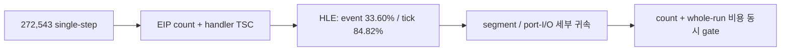

# 현재 실행 frontier / Current execution frontier

과거 전체 기록은 [Task 303까지의 frontier 원문](history/current-execution-frontier-through-task303.md)에
보존합니다. 이 문서는 최근 약 10개 Task와 현재 결정만 유지합니다.

## 현재 최상위 결론 / Active top-level conclusion

**확인됨:** 현재 `aot-dbt`는 독립적인 연속 DBT 실행기가 아니라 `aot-dynamic` 위에서
일부 TF/`INT3` 경로만 정상 host dispatch나 Dr0 span으로 바꾼 정책입니다. Task 276의
동일 시간 progress는 `aot-dynamic 10,709` 대 `aot-dbt 10,685`로 사실상 같았습니다.
Task 287의 progress `+11.86%`는 `aot-dbt` 내부 span OFF/ON 비교이지 backend 간 절대
성능 개선이 아닙니다. 과거 통제 표본에서 legacy가 `aot-dynamic`보다 14.6~20.6배
빨랐다는 사실과 함께 보면 현재 증분 경로는 요구되는 60배 개선 규모에 맞지 않습니다.

Task 308의 실제 검증은 exception-free HLE 가설을 부분 기각했습니다. 정상 host-call
HLE 경계는 60초 동안 exception/legacy fallback 0과 EEPROM 일치를 유지했고
planner-HLE 25,134회를 예외 없이 처리했습니다. 그러나 OFF/ON progress는
`44,977 → 45,716`(+1.64%)뿐이었고, single-step은 `276,680 → 254,889`(-7.88%),
AOT boundary는 `66,245 → 41,224`(-37.77%)였습니다. 또한 직접 interrupt HLE는
INT 8 selector 계약을 바꾸므로 `INT/IRET`는 현재 VEH 경계에 남겨야 합니다.

Task 309의 EIP별 계측은 single-step 횟수만으로 비용을 판단할 수 없음을 확인했습니다.
60초 동안 272,543개 single-step을 모두 기록했으며 HLE는 event의 33.60%지만
`HandleSingleStepTrace` 내부 TSC tick의 84.82%였습니다. cycle 상위 주소는 하나의
계산 loop가 아니라 segment-register move와 port-I/O HLE에 분산됐고 상위 32개
coverage도 67.21%였습니다. 따라서 한 loop를 바로 exception-free generation으로
바꾸는 80% gate는 통과하지 못했습니다.

현재 우선순위는 계속 single-step 병목입니다. 다만 다음 작업은 단순 총개수 감소가
아니라 상위 segment/I/O EIP의 순차 handler/decode 비용과 계측 범위 밖 kernel/VEH
전환 비용을 분리하는 것입니다. 그 결과로 count와 whole-run 비용을 함께 크게 줄일
수 있는 경계만 구현 후보로 승격합니다.

**Confirmed:** `aot-dbt` is not yet an independent continuous DBT executor; it layers selective
normal dispatch and Dr0 spans over `aot-dynamic`. Task 276 measured effectively identical
progress, while historical controlled samples found legacy 14.6-20.6x faster than
`aot-dynamic`. Task 308 then removed 25,134 planner-HLE exceptions in a stable 60-second run,
but improved progress only 1.64%; direct interrupt HLE also changed the selector contract.

Task 309 showed why count alone is insufficient. HLE represented 33.60% of 272,543
single-step events but 84.82% of TSC ticks measured inside `HandleSingleStepTrace`. The cycle
hotspots were distributed across segment-register and port-I/O HLE sites, and the top 32
covered 67.21%, below the 80% gate for one exception-free loop.

The active priority remains single-step overhead. The next task must separate sequential
handler/decode work at the hot segment/I/O EIPs from kernel/VEH transition cost outside the
current scope, then promote only a boundary that can materially reduce both event count and
whole-run cost.

## 최근 Task / Recent tasks

### Task 300 — invalid-EIP probe fail-closed

**확인됨:** 이미 비정상인 guest EIP를 HLE opcode probe가 읽어 2차 host AV를 만들지
않도록 15바이트 decode window와 traced interrupt 2바이트 guard를 추가했습니다. 원래
guest 예외는 추측 복구 없이 보존됩니다.
[상세 작업 로그](../work-logs/20260726-300-guest-instruction-probe-fail-closed.md)

**Confirmed:** Decode-window guards prevent a secondary host AV from masking an already-invalid
guest EIP while preserving the primary exception.

### Task 301 — 타이머 pending의 자연 VEH 경계 전달 / Deliver timer pending at natural VEH boundaries

**확인됨:** 강제 TF rendezvous가 서로 다른 guest EIP에서 동일한 unhandled single-step으로
빠져나간 근인이었습니다. poll thread는 pending만 기록하고 기존 guest single-step 경계가
전달합니다. 150초 실행은 강제 arm 0, INT 8 `2,283/2,283`, progress 129,810,
exception/malformed 0으로 정상 timeout했습니다.
[상세 작업 로그](../work-logs/20260726-301-timer-pending-safe-veh-boundary.md)

**Confirmed:** Forced TF arming was removed. Natural guest VEH boundaries delivered all 2,283
pending timer interrupts during a stable 150-second run.

### Task 302 — depth compare gate ABI 안전성 / Depth-compare gate ABI safety

**확인됨:** 약 880초 이후 `_GRDEPTHBUFFERFUNCTION@4(3)` 거부가 stdcall frame을 누수해
후속 low-address AV를 만들었습니다. compare `0..7`을 구현하고 신뢰 가능한 signature의
실패는 ABI-preserving decline으로 반환합니다.
[상세 작업 로그](../work-logs/20260726-302-glide-depth-compare-gate-safety.md)

**Confirmed:** Supporting compare modes 0-7 and preserving the stdcall frame on safe declines
removed the identified gate-leak class.

### Task 303 — Glide 구현 공백 fatal 가시화 / Fatal visibility for Glide gaps

**확인됨:** 미구현 함수와 미지원 인자는 첫 고유 조합에서 `[repiu-fatal]`로 즉시
출력되고 종료 summary에서 반복 count와 함께 다시 출력됩니다. 알려진 stdcall ABI는
`action=continue`, 신뢰 불가능한 ABI만 `action=terminate`입니다.
[상세 작업 로그](../work-logs/20260726-303-glide-implementation-gap-fatal-reporting.md)

**Confirmed:** Glide implementation gaps are explicit fatal-labeled diagnostics. Trusted ABIs
continue execution; only untrusted ABIs terminate.

### Task 304 — native-span 음성 캐시 / Native-span negative cache

**확인됨:** 반복 scan 거절의 99.68~99.69%를 byte-validated cache로 재사용했습니다.
texture milestone 중앙값은 1,031ms 빨라졌지만 후반 progress 중앙값은 `+0.02%`였습니다.
decode 비용은 존재하지만 장기 지배 병목은 예외 횟수라는 결론입니다.
[상세 작업 로그](../work-logs/20260726-304-native-span-negative-cache.md)

**Confirmed:** The cache reuses nearly all repeated scan rejections and improves early texture
milestones, but does not materially change late throughput.

### Task 305 — retired trap 직후 span / Immediate span after retired traps

**확인됨:** opt-in span은 시도의 95.28~95.46%에 성공하고 single-step을 중앙값 2.86%
줄였지만 progress 개선 중앙값은 0.35%뿐이었습니다. 경계까지 pending/trace 상태를
보존해야 정확성이 유지되며 기능은 기본 OFF입니다.
[상세 작업 로그](../work-logs/20260726-305-retired-trap-immediate-span.md)

**Confirmed:** Immediate spans remove some post-trap stepping, but scanner/Dr0 overhead leaves
only a 0.35% median progress gain, so the feature remains opt-in.

### Task 306 — retired trap hotset / Retired-trap hotset

**확인됨:** 60초 profile의 retired trap 7,401회 중 7,293회(98.54%)가 5바이트 미만이고
quarantine 결과였습니다. 상위 두 guest 주소가 64.06%, 상위 16개가 98.24%를
차지했습니다. stable gate는 이 trap을 줄일 수 있지만 전체 성능 예상은 1~3%로 60배
목표와 맞지 않으므로 현재 우선순위에서 제외합니다.
[상세 작업 로그](../work-logs/20260726-306-retired-trap-hotset-profile.md)

**Confirmed:** Short quarantined entries dominate retired traps, but removing this population is
only a local 1-3% candidate and is no longer the active priority.

### Task 307 — current frontier 이력 분리 / Split current-frontier history

**확인됨:** 3,657줄의 과거 frontier 원문을 Task 303까지의 history로 byte-identical
보존하고 current 문서를 최근 10개 Task 중심으로 축약했습니다. 새 결론이 추가될 때
가장 오래된 current 항목을 제거해 약 10개를 유지합니다.
[상세 작업 로그](../work-logs/20260726-307-current-frontier-history-split.md)

**Confirmed:** The complete 3,657-line frontier through Task 303 is preserved byte-for-byte
in history. The current document keeps approximately ten recent task summaries.

### Task 308 — exception-free superblock 검증 / Exception-free superblock validation

**확인됨:** opt-in host-call HLE thunk는 GPR/EFLAGS, x87/MMX/SSE, host stack/TIB
경계를 보존하며 60초 실게임을 exception 0, legacy fallback 0, EEPROM 일치로
완료했습니다. `INT/IRET`를 VEH에 남긴 안전 slice는 25,134 HLE를 직접 처리했지만
progress는 `+1.64%`뿐이어서 5배 go/no-go에 실패했습니다. 직접 interrupt HLE의
selector 불일치도 확인되어 일반 HLE 예외 제거는 다음 성능 아키텍처가 아닙니다.
[상세 작업 로그](../work-logs/20260726-308-exception-free-superblock-validation.md)

**Confirmed:** The safe host-call slice completed 60 seconds with no exception or legacy
fallback and a matching EEPROM while directly handling 25,134 HLE sites. Progress improved
only 1.64%, failing the 5x gate, and direct interrupt HLE violated the established selector
contract.

### Task 309 — single-step hotspot cycle 귀속 / Single-step hotspot cycle attribution

**확인됨:** opt-in 8,192-slot EIP histogram은 60초 실행의 single-step 272,543개를
1,132개 주소로 전부 분류했고 overflow는 0이었습니다. HLE는 event의 33.60%지만
handler TSC tick의 84.82%였습니다. cycle 상위권은 segment-register move와 port-I/O
HLE였고 상위 8개 43.09%, 상위 32개 67.21%로 단일 loop 80% gate에는 미달했습니다.
[상세 작업 로그](../work-logs/20260726-309-single-step-hotspot-cycle-attribution.md)

**Confirmed:** The opt-in 8,192-slot EIP histogram classified all 272,543 steps across 1,132
addresses with no overflow. HLE represented 33.60% of events and 84.82% of handler TSC ticks.
Segment-register and port-I/O HLE dominated the cycle ranking, but the top 32 covered only
67.21%, below the 80% gate for one loop.

## 다음 검증 / Next validation

다음 검증은 single-step을 벗어나는 작업이 아닙니다. cycle 상위 segment/I/O EIP에서
`DispatchGuestHleHandlers`의 후보 검사·decode·실제 emulate 단계를 따로 세어
opcode-directed dispatch의 상한을 구합니다. 그리고 profile ON/OFF 대조와 handler
밖 exception 전환 비용을 분리해, handler 최적화와 single-step 제거 중 어느 쪽이
whole-run에 더 큰지를 결정합니다.

The next validation remains focused on single steps. Attribute candidate checks, decode, and
actual emulation at the hot segment/I/O EIPs to size opcode-directed dispatch, and separate
handler work from exception-transition cost before choosing handler optimization or broader
single-step elimination.
