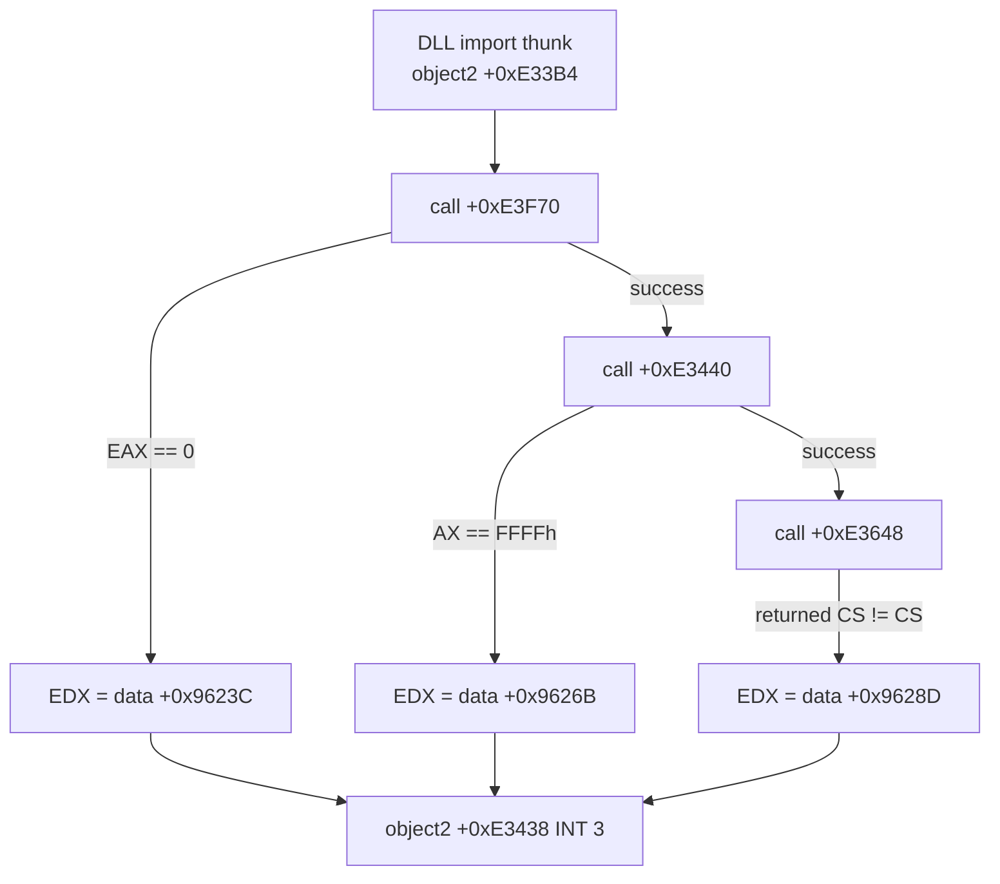
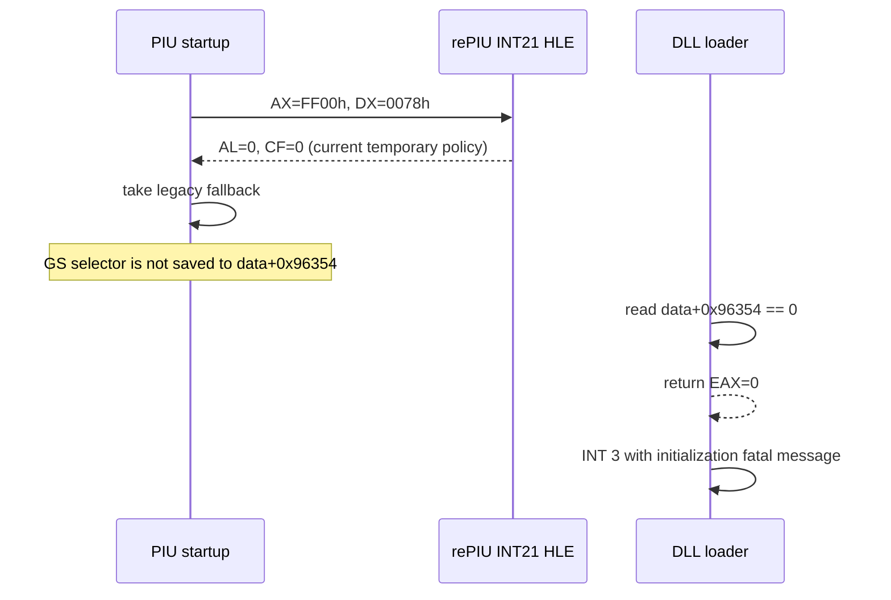
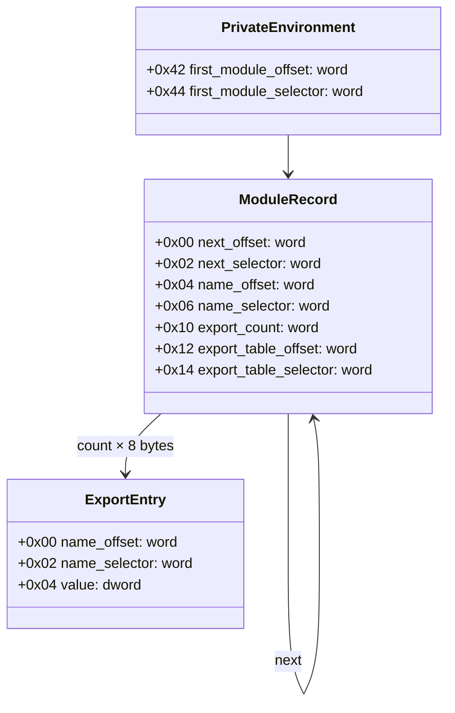

# DOS/4G DLL loader와 INT 21h AX=FF00h 역추적

## 결론

**확인됨:** arena `+0xF3438`의 `INT 3`는 Open Watcom 계열 DLL lazy-loader의 fatal 공통 경로이다. 실제 실행은 세 fatal 조건 중 “DLL loader 초기화 실패”를 선택했다. 직접 원인은 현재 `INT 21h AX=FF00h` HLE가 임시로 `AL=0`을 반환하여 DOS/4G private environment 경로를 비활성화하는 것이다.

## 주소 변환

object 2는 arena `+0x10000`에서 시작한다. 따라서 관찰 주소의 object 내부 오프셋은 다음과 같다.

```text
arena + 0xF3438 - object2_base(+0x10000) = object2 + 0xE3438
```

원본 LE data pages는 파일 오프셋 `0x21400`에서 시작하고 object 2는 두 번째 physical page에서 시작한다. 이 변환으로 얻은 원본 바이트가 실행 로그의 byte window와 일치한다.

## fatal 분기 판별



| 조건 | relocation 전 `EDX` | 원본 문자열 |
| --- | --- | --- |
| 초기화 실패 | `0x0009623C` | `Fatal error: unable to initialize DLL loader.` |
| DLL load 실패 | `0x0009626B` | `Fatal error: unable to load DLL.` |
| entry point 검색 실패 | `0x0009628D` | `Fatal error: unable to find entry point in DLL.` |

재실행의 예외 레지스터는 `EDX=0x021A623C`, `EAX=0`이었다. `0x021A623C`는 첫 문자열의 relocated 주소이므로 첫 조건이 확정된다. selector 비교나 DLL 파일 load가 현재 직접 원인은 아니다.

## 초기화 함수 역추적

`object2+0xE3F70`은 세 selector 전역값이 모두 비어 있지 않으면 즉시 성공한다. 초기 상태에서는 다음 순서로 초기화를 시도한다.

1. `object2+0xE37E8`에서 DOS/4G private environment/module 정보를 찾는다.
2. `object2+0xE39B4`에서 관련 table을 검사한다.
3. `object2+0xE3DEC`을 세 번 호출해 필요한 descriptor를 만든다.
4. 세 selector 중 하나라도 0이면 만든 descriptor를 해제하고 0을 반환한다.

첫 단계 `+0xE37E8`은 전역 word `data+0x96354`가 0이면 즉시 실패한다. 이 전역을 설정하는 시작 코드는 `object2+0xE4CEC`에 있다.



원본 시작 코드는 `AX=FF00h` 뒤 `AL`을 검사한다. `AL != 0`이면 `GS`가 0인지 확인하고, 0이 아니면 `GS`를 `data+0x96354`에 저장한다. 현재 HLE는 `AL=0`과 carry clear만 제공하므로 이 저장 경로에 들어가지 않는다.

## 확정된 것과 남은 것

**확정됨**

* 새 `INT 3`는 DLL loader 초기화 fatal 경로이다.
* 현재 임시 `AX=FF00h -> AL=0` 응답이 해당 경로의 직접 원인이다.
* 단순히 `INT 3`를 skip하거나 selector 비교를 완화하는 것은 올바른 수정이 아니다.

**미확정**

* 성공 시 `AL`의 정확한 bit 의미와 값.
* `GS`가 가리켜야 하는 DOS/4G private structure의 전체 layout.
* `GS:0x42`에서 시작하는 far-pointer/module chain과 PIU가 찾는 table의 최소 필드 집합.

따라서 다음 수정은 `AL`만 1로 바꾸는 방식으로 진행하면 안 된다. 유효한 selector와 `GS:0x42` 구조가 함께 없으면 더 뒤에서 잘못된 memory를 읽는다. 다음 결정은 DOS4GW 원본/동일 바이너리를 추가 역분석하여 private structure를 최소 HLE로 모델링할지, 실제 DOS4GW 실행에서 반환 상태와 구조를 캡처할지이다.

# DOS/4G DLL Loader and INT 21h AX=FF00h Provenance

## Conclusion

**Confirmed:** The `INT 3` at arena `+0xF3438` is the common fatal path of an Open Watcom-style DLL lazy loader. Runtime `EDX=0x021A623C` selects the first of three messages: `Fatal error: unable to initialize DLL loader.` The other branches represent DLL-load and entry-point lookup failures.

The direct cause is the current temporary `INT 21h AX=FF00h` response. Startup checks `AL` after the call. When `AL` is nonzero and `GS` is valid, it stores `GS` in the global later consumed by the DLL initializer. rePIU currently returns `AL=0`, so startup takes the legacy fallback and never records that selector. The initializer reads zero and fails before loading a DLL.

Changing only `AL` is unsafe: the original code subsequently dereferences a DOS/4G private structure beginning through `GS:0x42`. The exact success flags, selector, structure layout, and module-chain fields remain unresolved. The next faithful implementation must derive and model that contract or capture it from an actual DOS4GW execution; the breakpoint must not be skipped.

## GS:0x42 최소 field map

PIU consumer `object2+0xE37E8`의 load width와 offset으로 다음 구조를 확인했다. 모든 pointer는 16-bit offset과 16-bit selector로 구성된 far pointer이다.



module 이름은 `LINEXE_LOADER`와 비교된다. 일치한 module의 8-byte export entry를 순회하며 `LINEXE_LOADMODULE`, `LINEXE_FREEMODULE`, `GETLOADTABLE`, `GETLOADNAME` 네 이름을 찾는다.

`AX=FF00h` 성공 여부는 `AL != 0`으로 검사되고, 성공 시 `GS`가 private environment selector로 저장된다. 따라서 최소 반환 형태는 **nonzero AL + valid GS selector**임이 consumer 측에서 확인된다. 정확한 성공 `AL` 값은 provider handler를 완전히 복원하기 전까지 inferred 상태로 둔다.

DOS4GW의 16-bit INT 21h router에서는 `AH=FFh`가 명시적으로 special dispatch에 포함되고 `inc AH` 뒤 service index 0으로 변환되는 것까지 확인했다. 다만 결합 모듈의 logical IP와 file offset mapping이 여러 segment에 걸쳐 있어 service 0 target의 전체 provider 반환 코드는 아직 확정하지 못했다.

## fatal tail 실행 확인

제한된 signature의 `INT 3`를 진단 후 재개하자 원본 error printer가 실제로 `Fatal error: unable to initialize DLL loader.`를 console에 출력했다.

출력 경로에서 추가로 `INT 21h AH=09h`, 양방향 low-memory register-frame copy, `INT 31h AX=0300h/BL=2Fh`, 마지막 `INT 21h AX=4C01h`이 관찰됐다. 따라서 source에 있는 `HLT`는 DOS terminate가 반환했을 때를 위한 최종 fallback이며 정상 fatal 경로에서는 `AX=4C01h`이 먼저 실행된다.

## Minimum GS:0x42 field map and fatal-tail confirmation

PIU's consumer confirms a far pointer at `GS:0x42` to a linked module record. The record contains next and name far pointers at offsets `0x00` and `0x04`, an export count at `0x10`, and an export-table far pointer at `0x12`. Each export entry is eight bytes: a name far pointer followed by a dword value. PIU locates `LINEXE_LOADER` and resolves `LINEXE_LOADMODULE`, `LINEXE_FREEMODULE`, `GETLOADTABLE`, and `GETLOADNAME`.

The consumer proves that success requires nonzero `AL` and a valid private-environment selector in `GS`; the exact nonzero value remains inferred until the provider target is fully mapped. DOS4GW's 16-bit INT 21h router explicitly maps `AH=FFh` to special service index zero.

Continuing only the recognized fatal-tail breakpoint caused the original error printer to emit the fatal message. The path then used DOS `AH=09h`, low-memory register-frame copies, DPMI `AX=0300h/BL=2Fh`, and finally DOS terminate `AX=4C01h`. The following `HLT` is a fallback if termination returns.
