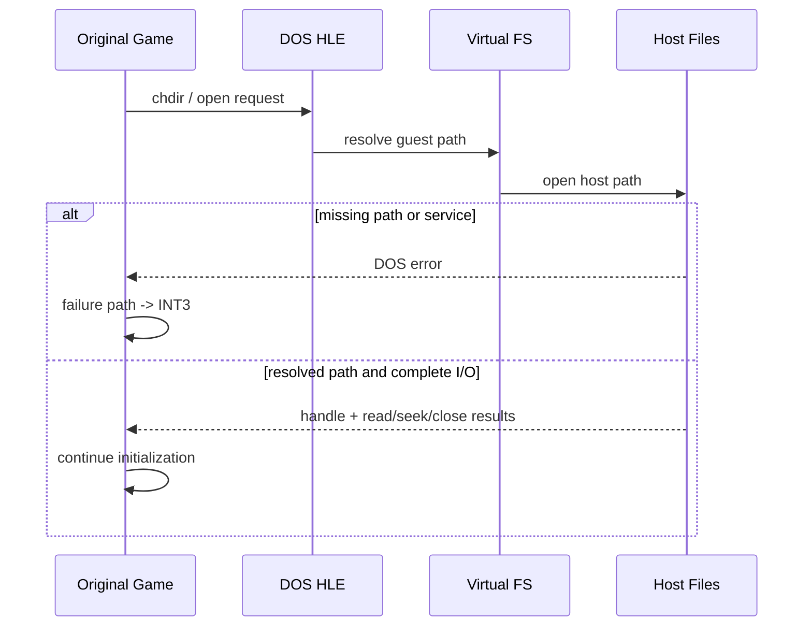

# DOS 파일 I/O와 INT3 해결 이력

## 초기 증상

**확인됨:** 실행은 여러 파일 open 시도 뒤 `INT3`에 도달했다. `INT3` 자체가 파일 read 명령은 아니며, 원본 코드가 실패 경로에서 사용하는 breakpoint/fatal diagnostic 신호였다.

## 원인 분리

* DOS current directory와 mount root가 실제 게임 디렉터리 구조와 달랐다.
* `INT 21h`의 open만 구현하고 read/seek/close 또는 drive/current-directory 관련 service가 빠져 있으면 파일 handle을 얻은 뒤에도 정상 흐름을 지속할 수 없었다.
* path trace를 추가해 guest path, DOS virtual path, host path, 성공/실패를 순서대로 확인했다.

## 해결된 흐름

**확인됨:** mount root를 `MASTER/PIU_1ST`로 두고 current directory를 `\PIU`로 유지한 뒤 다음 서비스가 연결되었다.

* `AH=3Dh`: open
* `AH=3Fh`: read
* `AH=42h`: seek
* `AH=3Eh`: close
* `AH=19h`, `AH=47h`: drive/current directory

그 결과 `intro.ani`와 `stage.cfg` open이 성공하고, 이전 파일 실패 관련 `INT3` 지점을 넘어 allocator/memory 초기화까지 진행했다.

## 현재 해석

`INT3`는 무조건 건너뛸 opcode가 아니다. 원본이 실패를 알리는 관찰 지점으로 분류하고 register, byte window, path history를 보존해야 한다. 원인을 해결한 뒤 자연스럽게 더 이상 도달하지 않는 것이 올바른 방향이다.

# DOS File I/O and INT3 Resolution History

Execution originally reached `INT3` after file operations. The breakpoint was a failure/fatal diagnostic path, not a file-read instruction. Path tracing exposed an incorrect mount/current-directory model and missing `INT 21h` open/read/seek/close and drive/current-directory services.

After mounting `MASTER/PIU_1ST`, retaining `\PIU`, and implementing the required services, `intro.ani` and `stage.cfg` opened successfully and execution advanced into allocator initialization. `INT3` remains a diagnostic signal and must not be blindly skipped.
