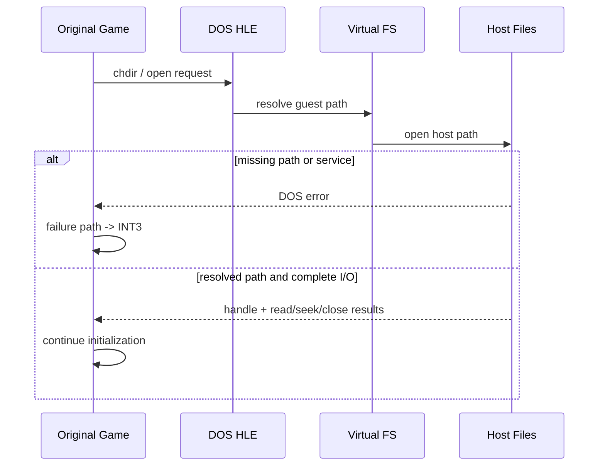

# DOS 파일 I/O와 INT3 해결 이력

## 초기 증상

**확인됨:** 실행은 여러 파일 open 시도 뒤 `INT3`에 도달했다. `INT3` 자체가 파일 read 명령은 아니며, 원본 코드가 실패 경로에서 사용하는 breakpoint/fatal diagnostic 신호였다.

## 원인 분리

* DOS current directory와 mount root가 실제 게임 디렉터리 구조와 달랐다.
* `INT 21h`의 open만 구현하고 read/seek/close 또는 drive/current-directory 관련 service가 빠져 있으면 파일 handle을 얻은 뒤에도 정상 흐름을 지속할 수 없었다.
* path trace를 추가해 guest path, DOS virtual path, host path, 성공/실패를 순서대로 확인했다.

## 해결된 흐름

**확인됨:** mount root를 `MASTER/PIU_1ST`로 두고 current directory를 `\PIU`로 유지한 뒤 다음 서비스가 연결되었다.

* `AH=3Dh`: open
* `AH=3Fh`: read
* `AH=42h`: seek
* `AH=3Eh`: close
* `AH=19h`, `AH=47h`: drive/current directory

그 결과 `intro.ani`와 `stage.cfg` open이 성공하고, 이전 파일 실패 관련 `INT3` 지점을 넘어 allocator/memory 초기화까지 진행했다.

## 현재 해석

`INT3`는 무조건 건너뛸 opcode가 아니다. 원본이 실패를 알리는 관찰 지점으로 분류하고 register, byte window, path history를 보존해야 한다. 원인을 해결한 뒤 자연스럽게 더 이상 도달하지 않는 것이 올바른 방향이다.

# DOS File I/O and INT3 Resolution History

Execution originally reached `INT3` after file operations. The breakpoint was a failure/fatal diagnostic path, not a file-read instruction. Path tracing exposed an incorrect mount/current-directory model and missing `INT 21h` open/read/seek/close and drive/current-directory services.

After mounting `MASTER/PIU_1ST`, retaining `\PIU`, and implementing the required services, `intro.ani` and `stage.cfg` opened successfully and execution advanced into allocator initialization. `INT3` remains a diagnostic signal and must not be blindly skipped.

## Task 374 (2026-08-01): DOS 읽기가 매번 호스트 파일을 다시 열고 있었다 — **해결됨**

music select 화면 조사에서 `REPIU_SINGLE_STEP_HOTSPOT_PROFILE=1`이 단일 주소를
지목했습니다. `0x030F87B7`이 77회 호출로 wall의 1.71%를 쓰고, **호출당 25.7M
cycle(7.0 ms), 최악 308M cycle(83.5 ms)** 이며 `hle` 단계가 99.9%였습니다.

증거 사슬: opcode `0xCD` → `HandleTracedDosInterrupt21`, I/O 트레이스
`op=read eip=0x030F87B7 path=...\DATAS\MODEL\T14.3DM`, 그리고 DOS 버킷 2.216e9 중
이 주소가 1.974e9(**89%**).

**근인:** `ReadDosFile`이 읽기마다 `std::filesystem::file_size` stat + `std::ifstream`
생성 + seek + read + 소멸자 close를 했습니다. `DosOpenFileHandle`이 경로와 오프셋만
들고 지속 스트림이 없었기 때문입니다. Windows `CreateFile`은 필터 드라이버
스택(실시간 검사 포함)을 통과하므로 3.5 KB 파일의 4 KB 읽기가 밀리초 단위가 됩니다.
**원본 DOS는 핸들을 열어둔 채 읽습니다.**

**수정:** `DosHostFileCache`가 핸들 수명 동안 스트림을 유지합니다. 복사 시에는
차갑게 시작하는데, 두 핸들이 한 스트림을 공유하면 파일 위치를 공유하게 되고
`execution_trampoline.cpp`가 상태를 복사 대입하기 때문입니다. 크기는 열 때 1회만
조회합니다(쓰기 API가 없어 안전). EOF로 선 failbit를 다음 seek 전에 `clear()`합니다.

**관측:** `Win32 DOS file reads/host opens/reads per open`. 변경 전 비는 정의상
1.00이었고, 자동 장면 실측에서 **76/34/2.24**가 나왔습니다 — 파일당 약 2회 읽는
패턴이므로 **파일당 열기 1회**입니다.

**주의:** 자동 장면은 DOS가 0.14~0.19%뿐이라 효과 판정에 쓸 수 없습니다. 판정은
music select(DOS 1.92%)에서만 가능합니다.
