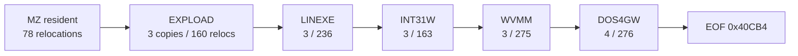
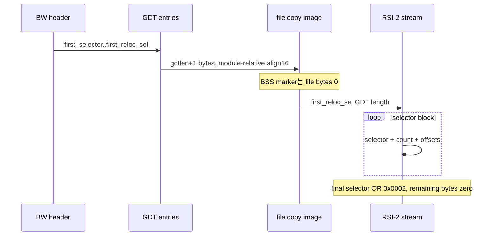

# DOS/16M resident copy/relocation table 정적 복원

## 결론

DOS4GW.EXE가 선언하는 정적 loader 입력을 전부 복원했다. MZ resident image에는 DOS relocation 78개가 있고, 뒤따르는 다섯 BW module에는 load selector copy record 16개와 RSI-2 relocation 1,110개가 11개 block으로 저장되어 있다. 전체 항목은 [기계 판독 manifest](dos16m-resident-copy-relocation-table.json)에 원본 file offset 단위로 기록했다.

## 전체 table 요약

| Module | Header | Program image | Copy records | RSI-2 range | Blocks | Relocations | Padding |
| --- | ---: | ---: | ---: | ---: | ---: | ---: | ---: |
| `EXPLOAD.EXP` | `0x0F474` | `0x0F544` | 3 | `0x154A4..0x155F4` | 2 | 160 | 8 |
| `LINEXE.EXP` | `0x155F4` | `0x156C4` | 3 | `0x20574..0x20754` | 2 | 236 | 0 |
| `INT31W.EXP` | `0x20754` | `0x20824` | 3 | `0x25014..0x25164` | 2 | 163 | 2 |
| `WVMM.EXP` | `0x25164` | `0x25234` | 3 | `0x322E4..0x32514` | 2 | 275 | 2 |
| `DOS4GW.EXP` | `0x32514` | `0x325F4` | 4 | `0x40A74..0x40CB4` | 3 | 276 | 12 |

각 module에는 file byte를 소비하지 않는 BSS selector가 하나씩 포함된다. manifest의 `copy_records`는 selector, GDT entry 위치, source file begin/end, copy size, memory paragraph 수, limit, access byte와 BSS 여부를 모두 보존한다. `relocation_table.blocks`는 raw terminal bit를 포함한 selector와 모든 16-bit offset을 보존한다.

## 복원 규칙

[Open Watcom의 공식 포맷 헤더](https://github.com/open-watcom/open-watcom-v2/blob/master/bld/watcom/h/exe16m.h)에 따라 `first_selector`부터 `first_reloc_sel` 직전까지를 load group으로 해석했다. [공식 linker writer](https://github.com/open-watcom/open-watcom-v2/blob/master/bld/wl/c/load16m.c)는 group image의 module-relative paragraph 정렬과 RSI-2의 `selector, count, offsets...` 구조 및 마지막 selector bit 1 표식을 교차 확인하는 데만 참고했다. 해당 코드 자체는 사용하지 않았다.

## 검증된 불변 조건

* MZ relocation 78개의 target이 모두 MZ load image 내부에 있다.
* 모든 BW header의 `next_header_pos`가 단조 증가하며 마지막 값은 EOF `0x40CB4`다.
* 모든 copy range는 겹치지 않고 module 내부에 있으며 module-relative 16-byte 정렬을 따른다.
* 각 RSI-2 table의 선언 길이는 정확히 다음 BW header까지 도달한다.
* 모든 block selector가 해당 module의 load selector를 가리키며 모든 offset이 selector limit 이하다.
* 모든 table에 terminal selector가 있고 이후 padding은 전부 zero다.

## 남은 실행 주소 변환

이번 manifest는 file에 선언된 copy/relocation table 전체를 복원한다. 다만 DOS/16M이 실제로 할당한 selector base와 resident code의 최종 runtime CS는 실행 시 메모리 배치에 의존한다. 따라서 `CS:[0x066A]` service table을 최종 file instruction으로 연결하려면 이 manifest를 입력으로 loader의 selector/base 할당을 symbolic replay하는 다음 단계가 필요하다. 이는 table 누락이 아니라 정적 table과 동적 배치 사이의 변환 단계다.

# DOS/16M Resident Copy/Relocation Table Static Reconstruction

All statically declared loader inputs in DOS4GW.EXE are now reconstructed: 78 MZ relocations, 16 BW selector-copy records, and 1,110 RSI-2 relocations in 11 blocks across five modules. The deterministic JSON manifest preserves every source file range, selector, limit, access byte, relocation offset, terminal flag, and padding length.

The parser validates complete MZ/BW bounds, monotonic chaining to EOF, non-overlapping module-relative copy ranges, exact relocation-table lengths, target selector and offset limits, terminal markers, and zero padding. Open Watcom's official header and linker writer are format references only; their source is not incorporated. Resolving the final runtime `CS:[0x066A]` target now requires a symbolic replay of dynamic selector/base assignment using this complete manifest.
