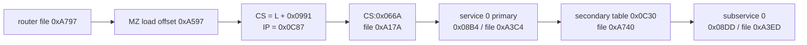
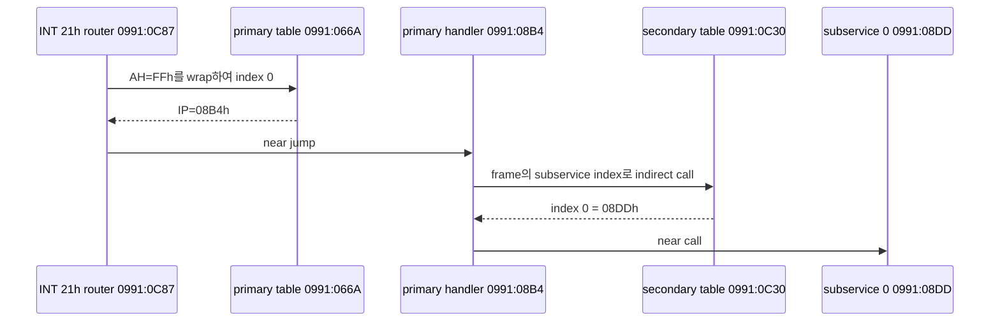

# DOS/16M loader symbolic replay 결과

## 결론

복원된 manifest를 symbolic replay한 결과 MZ relocation 78개와 BW RSI-2 relocation 1,110개를 모두 provenance와 함께 적용했다. 현재 module의 `OPT_ROTATE`가 꺼져 있어 BW selector mapping은 identity이며 1,110개 word는 값이 바뀌지 않지만, 각각이 relocation 대상임은 별도로 보존된다.

가장 중요한 결과는 resident INT 21h router의 runtime CS를 정적으로 유일하게 결정한 것이다.

전체 replay 결과는 [기계 판독 report](dos16m-symbolic-replay.json)에 저장했다.

## MZ symbolic state

MZ load segment를 `L`로 두고 각 relocation을 `original_word + L`로 기록했다. 따라서 초기 entry는 `(L + 0x01BD):0x2382`이고, 모든 relocation은 원본 file word까지 역추적할 수 있다. 실제 `L` 값은 provider의 module-relative IP와 file provenance를 결정하는 데 필요하지 않다.

## BW selector image

| Module | Entry selector:offset | Entry file offset | Relocations | Changed |
| --- | --- | ---: | ---: | ---: |
| EXPLOAD | `0080:2EF3` | `0x12437` | 160 | 0 |
| LINEXE | `0080:0013` | `0x156D7` | 236 | 0 |
| INT31W | `0080:0013` | `0x20837` | 163 | 0 |
| WVMM | `0080:7123` | `0x2C357` | 275 | 0 |
| DOS4GW | `0080:9253` | `0x3B847` | 276 | 0 |

각 selector image는 `B[module,selector]` base symbol을 갖고 file copy 또는 zero-filled BSS로 구성된다. 모든 entry point가 executable file provenance에 연결됨을 확인했다.

## resident CS 선택 근거

router signature와 `jmp word ptr cs:[di+066Ah]`가 함께 있는 MZ source는 file `0xA797` 한 곳뿐이다. 그 MZ load offset `0xA597`을 표현할 수 있는 2,650개 `segment:offset` 후보를 만들고, 각 후보의 `CS:066A`에서 104개 service target을 해석했다.

`segment=0x0991`, `IP=0x0C87` 후보만 다음 조건을 동시에 만족했다.

* 104개 target이 전부 MZ resident image 내부의 nonzero/non-`0xFF` opcode를 가리킨다.
* table은 42개의 distinct handler를 갖는다.
* service 0 target `0x08B4`의 code가 `call word ptr cs:[di+0C30h]` 2차 dispatch를 포함한다.
* 2차 table도 resident image 내부 handler `0x08DD`로 연결된다.

## 다음 분석 경계

runtime CS와 provider file mapping은 더 이상 미확정이 아니다. 다음 단계는 `0xA3C4` primary handler가 사용하는 saved register frame layout을 복원하고, `0xA3ED` 이하 subservice handler의 반환 `AL/EAX`, `GS`, flags 및 private environment root 설정을 데이터 흐름으로 추적하는 것이다. 여기서는 frame offset 의미를 근거 없이 AX/BP 등으로 단정하지 않는다.

# DOS/16M Loader Symbolic Replay Results

Symbolic replay applied all 78 MZ and 1,110 BW RSI-2 relocations with source provenance. Selector rotation is disabled, so BW selector mapping is identity and no stored selector words change.

The replay uniquely resolves the resident INT 21h router to `CS=L+0x0991`, `IP=0x0C87`. `CS:0x066A` maps to file `0xA17A`; service zero maps to primary handler `0x08B4` at file `0xA3C4`, whose secondary table at `0x0C30` maps subservice zero to `0x08DD` at file `0xA3ED`. This candidate uniquely provides 104 valid targets, 42 distinct handlers, and a coherent secondary dispatch. The next task is saved-frame and return-value data-flow recovery, not further runtime-CS mapping.
