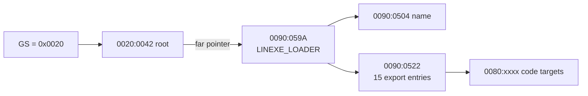
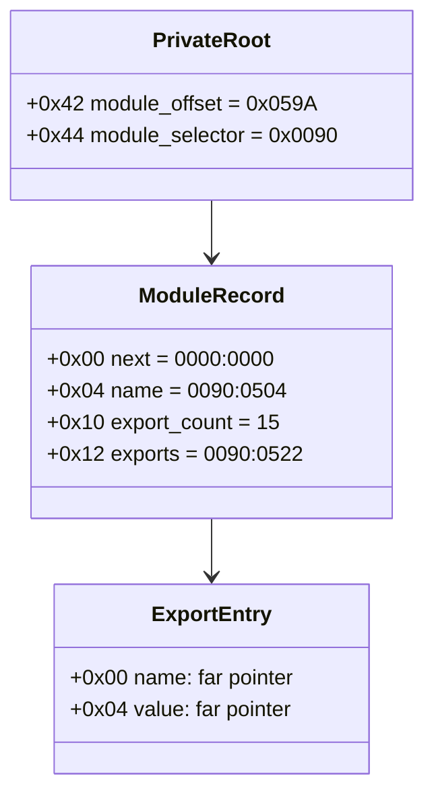

# DOS/4G client GS와 `GS:0x42` private environment

## 결론

service-zero가 보존하는 GS는 selector `0x20`이며 DOS/16M/DOS4G client private-data segment다. LINEXE 초기화는 `0020:0042`에 `0090:059A`를 기록한다. `0090:059A`는 이름 `LINEXE_LOADER`, export 15개를 가진 module record다.



machine-readable 구조와 전체 export는 [symbolic replay report](dos16m-symbolic-replay.json)의 `private_environment`에 포함돼 있다.

## selector와 root population

LINEXE data selector `0x90`의 global offset `0x1AB8`(file `0x202CC`)에는 private selector `0x20`이 정적으로 들어 있다. root 관리 routine은 file `0x1E562`에서 이 값을 읽어 ES로 설치하고, file `0x1E588`에서 다음 far pointer를 기록한다.

```asm
mov  ax, [1AB8h]       ; AX = 0020h
xor  bx, bx
mov  es, ax
mov  ax, [bp+06h]      ; module offset = 059Ah
mov  dx, [bp+08h]      ; module selector = 0090h
mov  es:[0042h], ax
mov  es:[0044h], dx
```

최초 call site는 `DS:059Ah`를 인자로 넘긴다. 따라서 초기화 후 root는 다음과 같다.

```text
0020:0042 = 059A 0090
```

service-zero wrapper, router, primary/secondary handler는 GS를 변경하지 않는다. client context switch의 restore routine은 `GS=ES:[DI+0Ah]`로 client GS를 복원하며, 이 값이 `0x20`인 상태에서 PIU가 실행된다.

## `LINEXE_LOADER` module record

| Offset | Width | Value | 의미 |
| ---: | ---: | --- | --- |
| `+00` | far | `0000:0000` | next module |
| `+04` | far | `0090:0504` | `LINEXE_LOADER` name |
| `+08` | word | `0001` | 내부 module field |
| `+0A` | word | `0002` | 내부 module field |
| `+0C` | far | `0090:0512` | 내부 name/info pointer |
| `+10` | word | `000F` | export count 15 |
| `+12` | far | `0090:0522` | export table |

이 layout은 PIU consumer에서 복원한 `next`, `name`, `export_count`, `export_table` offset과 정확히 일치한다.

## PIU가 요구하는 export

| Name | Original target |
| --- | --- |
| `GETLOADTABLE` | `0080:26B9` |
| `GETLOADNAME` | `0080:271F` |
| `LINEXE_LOADMODULE` | `0080:1B28` |
| `LINEXE_FREEMODULE` | `0080:1B43` |

각 export entry는 `name far pointer`와 `value far pointer`로 구성된 8 bytes다. 전체 15개 목록은 replay report에 보존했다.



## rePIU 최소 구현 경계

구조 탐색만 통과시키는 데 필요한 원본 형태는 세 selector 영역이다.

* `0x20`: offset `0x42`의 root far pointer
* `0x90`: module record, name, export name, export table
* `0x80`: 원본 16-bit export code 또는 동등한 guest-callable HLE entry

그러나 rePIU의 주 실행 경로는 32-bit original PIU code이며 원본 LINEXE export는 16-bit protected-mode code다. 단순히 원본 `0080:xxxx` 값을 노출하면 현재 Win32 trampoline이 이를 직접 실행할 수 없다. 반대로 값만 dummy로 채우면 PIU가 export를 호출할 때 잘못된 code로 이동한다.

따라서 다음 구현 의사결정은 다음 두 방식 사이에 있다.

1. 16-bit LINEXE code 실행 bridge를 추가한다.
2. PIU가 호출하는 네 export를 guest-callable HLE trap/call-gate로 제공하고 구조의 value pointer를 그 entry로 연결한다.

프로젝트의 HLE 방향과 최소 범위를 고려하면 2번이 적합하지만, `LOADMODULE/FREEMODULE/GETLOADTABLE/GETLOADNAME`의 calling convention과 실제 PIU call sequence를 먼저 복원해야 한다.

# DOS/4G Client GS and `GS:0x42` Private Environment

The preserved client GS is selector `0x20`. LINEXE initialization writes far pointer `0090:059A` at `0020:0042`. That record is `LINEXE_LOADER`, with 15 eight-byte exports at `0090:0522`. The four PIU-required targets are `GETLOADTABLE=0080:26B9`, `GETLOADNAME=0080:271F`, `LINEXE_LOADMODULE=0080:1B28`, and `LINEXE_FREEMODULE=0080:1B43`.

This exactly matches the independently recovered PIU consumer layout. A faithful rePIU environment needs a private root, module/export data, and callable implementations. The original targets are 16-bit protected-mode code, so exposing those pointers without a 16-bit bridge is unsafe. The architecture-aligned alternative is guest-callable HLE traps after recovering the four calling conventions and observed PIU call sequence.
