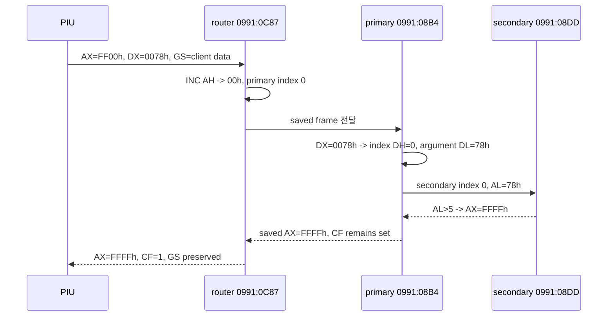
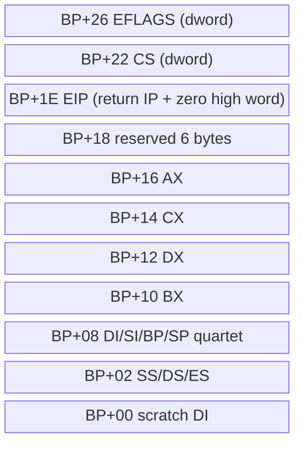

# DOS/4G `AX=FF00h, DX=0078h` frame과 반환 데이터 흐름

## 확정된 반환 계약

동일 DOS4GW.EXE의 resident handler를 정적으로 추적한 결과 PIU가 호출하는 입력의 반환은 다음과 같다.

| 항목 | 입력 | 반환 |
| --- | ---: | ---: |
| `EAX` | `0000FF00h` | `0000FFFFh` |
| `AL` | `00h` | `FFh` |
| `EDX` | `00000078h` | 보존 |
| Carry | 호출 전 값 | `1` |
| `GS` | DOS/4G client-data selector | 보존 |

따라서 PIU가 검사하는 `AL != 0`은 참이고, `GS`에는 interrupt가 새로 반환한 selector가 아니라 호출 전부터 설치돼 있던 DOS/4G client-data selector가 그대로 남는다. 이 경로는 carry를 set한 채 반환하지만 PIU startup은 carry를 검사하지 않는다.

## saved frame layout

wrapper `0991:0846`은 `PUSHFD`, operand-size override `PUSH CS`, `PUSH 0`, near `CALL 0C9Eh`로 `IRETD`용 32-bit return frame을 만든다. router는 6-byte reserve, `PUSHA`, `PUSH ES`, `PUSH DS`, `PUSH SS`, scratch `PUSH DI`를 수행한 뒤 `BP=SP`로 설정한다.

| BP offset | Field | 근거 |
| ---: | --- | --- |
| `+00` | scratch DI | `PUSH DI`, restore 시 discard |
| `+02` | SS | `PUSH SS` / restore stack 구조 |
| `+04` | DS | `PUSH DS` / `POP DS` |
| `+06` | ES | `PUSH ES` / `POP ES` |
| `+08` | DI | `PUSHA` / `POPA` |
| `+0A` | SI | `PUSHA` / `POPA` |
| `+0C` | BP | `PUSHA` / `POPA` |
| `+0E` | pre-PUSHA SP | x86 `PUSHA` 정의 |
| `+10` | BX | `PUSHA` / `POPA` |
| `+12` | DX | primary가 dispatch input으로 읽음 |
| `+14` | CX | `PUSHA` / `POPA` |
| `+16` | AX | primary가 반환 AX를 기록 |
| `+18..1D` | reserved | router의 `SUB SP,6` |
| `+1E` | IRETD EIP low | near call return IP |
| `+20` | IRETD EIP high | wrapper `PUSH 0` |
| `+22` | IRETD CS dword | operand-size `PUSH CS` |
| `+26` | IRETD EFLAGS dword | `PUSHFD`; handler가 CF bit 수정 |

## instruction-level data flow

1. router가 `AH=FFh`를 특별 경로로 받아 frame을 저장한다.
2. `INC AH`가 wrap되어 `00h`가 되고 primary jump table index 0을 선택한다.
3. primary `08B4h`가 `BP+26h`의 carry bit를 먼저 set한다.
4. `DI=[BP+12h]`로 saved `DX=0078h`를 읽고 `AX=DI`로 인자 전체를 보존한다.
5. `DI >>= 8` 결과 `DH=0`이므로 secondary table index 0, handler `08DDh`를 호출한다.
6. handler는 `AL=78h`를 `5`와 비교하고 범위를 넘으므로 `AX=FFFFh`를 만든다.
7. 이 분기는 primary의 `AND [BP+26h],FEh` carry-clear instruction을 건너뛰고 `BP+16h`에 `FFFFh`를 기록한다.
8. restore path의 `POPA`가 saved AX를 복원하므로 low 16-bit AX는 `FFFFh`가 된다. 16-bit `POPA`는 EAX 상위 16-bit를 바꾸지 않는다.
9. wrapper/router/두 handler/restore 어디에도 GS save 또는 write가 없으므로 GS는 보존된다.

## DOS/32A와의 차이

[DOS/32A 참고 구현](https://github.com/amindlost/dos32a/blob/master/src/dos32a/text/client/int21h.asm)은 같은 identification probe에 `EAX=FFFF3447h`를 명시적으로 반환하고 `GS`에 client-data selector를 넣는다. DOS4GW 원본은 이와 달리 일반 service-zero의 범위 오류 결과 `AX=FFFFh`, carry set을 사용하면서 이미 활성화된 `GS`를 보존한다.

두 구현은 PIU가 실제로 사용하는 조건에서는 호환된다.

* `AL`이 nonzero다.
* `GS`가 유효한 client-data selector다.

따라서 rePIU의 목표는 특정 DOS/32A signature를 흉내 내는 것이 아니라 DOS4GW 원본 관찰 계약인 **`AX=FFFFh`, CF=1, valid preserved GS**와 `GS:0x42` private environment를 함께 제공하는 것이다.

# DOS/4G `AX=FF00h, DX=0078h` Frame and Return Data Flow

The original DOS4GW resident handler returns low `AX=FFFFh`, carry set, preserves `DX=0078h`, and leaves the preinstalled client-data selector in `GS`. The wrapper constructs a 32-bit `IRETD` frame above a 16-bit `PUSHA` register frame; this proves `BP+12h=DX`, `BP+16h=AX`, and `BP+26h=EFLAGS`.

`AH=FFh` wraps to primary index zero. The primary splits saved `DX=0078h` into secondary index `DH=0` and argument `DL=78h`. Secondary handler zero rejects `AL>5`, writes `AX=FFFFh`, and skips the carry-clear path. No instruction in the wrapper, router, handler, or restore path touches GS. DOS/32A reaches the same consumer-visible nonzero-AL/valid-GS condition through a different explicit signature and GS assignment.
