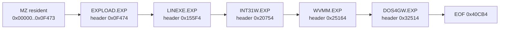
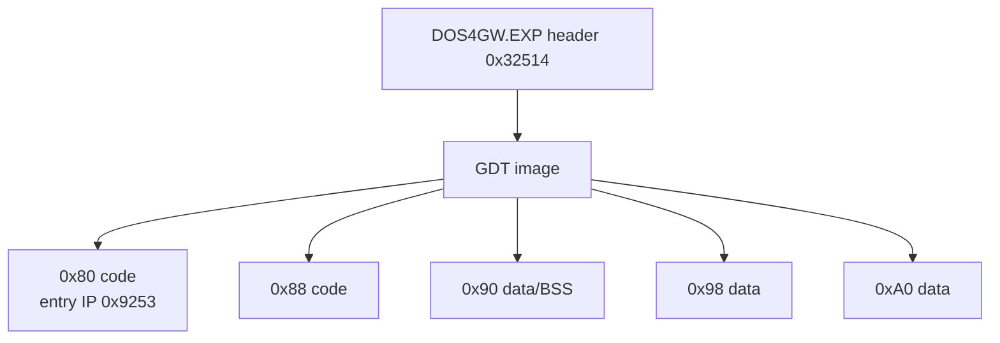

# DOS4GW 결합 EXP module과 segment map

## BW overlay chain

DOS4GW.EXE의 MZ 선언 크기는 `0xF474`이고, 정확히 그 위치에서 `BW` signature가 시작된다. Open Watcom 공식 `exe16m.h`에 따르면 `BW`는 DOS/16M EXP header이며 `next_header_pos`는 다음 결합 EXP의 절대 file offset이다.



| # | Header | Next | EXP | CS:IP | GDT image bytes |
| ---: | ---: | ---: | --- | --- | ---: |
| 0 | `0x0F474` | `0x155F4` | `EXPLOAD.EXP` | `0080:2EF3` | `0x009F` |
| 1 | `0x155F4` | `0x20754` | `LINEXE.EXP` | `0080:0013` | `0x009F` |
| 2 | `0x20754` | `0x25164` | `INT31W.EXP` | `0080:0013` | `0x009F` |
| 3 | `0x25164` | `0x32514` | `WVMM.EXP` | `0080:7123` | `0x009F` |
| 4 | `0x32514` | `0x40CB4` | `DOS4GW.EXP` | `0080:9253` | `0x00AF` |

각 EXP의 file size field도 다음 header와 일치하므로 chain은 **확인됨** 상태다.

## DOS4GW.EXP segment image

DOS4GW.EXP header는 first selector `0x80`, last selector `0xA0`을 선언한다. GDT image의 8-byte `gdt_info` entry는 selector `0x80`, `0x88`, `0x90`, `0x98`, `0xA0`에 대응하며 code/data access byte `0x9A`/`0x92`를 확인할 수 있다.



DOS4GW.EXP load image는 header와 GDT image 뒤에서 시작한다. selector `0x80` entry `0x9253`을 이 load image에 적용하면 기존에 정적으로 관찰한 DOS4GW startup code와 일치한다.

## AH=FFh router에서 확인된 것

MZ resident 16-bit INT 21h router는 다음 코드를 가진다.

```asm
cmp ah, 0FFh
je  special_dispatch
...
inc ah
cmp ah, 68h
ja  fallback
xor al, al
xchg ah, al
shl ax, 1
jmp word ptr cs:[di+066Ah]
```

따라서 `AH=FFh`는 wraparound로 service index 0이 된다. 이는 **확인됨**이다.

## 정적 mapping 후속 결과

의사결정 1번인 전체 정적 복원을 수행해 [DOS/16M resident copy/relocation table manifest](dos16m-resident-copy-relocation-table.md)를 만들었다. MZ relocation 78개, BW copy record 16개, RSI-2 relocation 1,110개가 전부 file offset과 selector 기준으로 복원됐다.

## 정적 mapping의 남은 경계

후속 [symbolic replay](dos16m-symbolic-replay.md)에서 이 경계를 해소했다. runtime CS는 `L+0x0991`, router IP는 `0x0C87`, `CS:0x066A`는 file `0xA17A`, service 0 primary handler는 file `0xA3C4`로 유일하게 연결된다. 아래 선택지 설명은 당시 의사결정 기록으로 유지한다.

router의 `CS`는 MZ 초기 header의 `CS`가 아니라 resident kernel이 runtime에 구성한 code segment다. `CS:[066Ah]` jump table과 그 target IP는 file에서 한 개의 고정 base로 연결되지 않는다. 단순히 router 주변에서 base를 역산하면 target이 instruction 중간을 가리키며, 이는 runtime copy/relocation을 반영하지 않은 잘못된 mapping이다.

따라서 정확한 service 0 provider 복원에는 다음 중 하나가 필요하다.

1. **완료:** DOS/16M resident loader가 소비하는 MZ/BW relocation/copy table을 정적으로 복원한다.
2. 실제 DOS4GW 실행에서 `AH=FFh` router 진입 시 `CS`, jump table 0번, 반환 직후 `AL/GS/flags`, `GS:0x42`를 캡처한다.

현재 구조상 2번이 더 직접적이고 오류 가능성이 낮다. 캡처 결과는 이미 복원한 PIU consumer field map과 즉시 대조할 수 있다.

## 외부 근거

* [Open Watcom `exe16m.h` — DOS/16M BW header와 GDT entry 정의](https://github.com/open-watcom/open-watcom-v2/blob/master/bld/watcom/h/exe16m.h)
* [Open Watcom `exesigns.h` — `EXESIGN_BW = 0x5742`](https://github.com/open-watcom/open-watcom-v2/blob/master/bld/watcom/h/exesigns.h)
* [Open Watcom Programming Guide — DOS/4G가 EXP(BW)를 지원](https://www.openwatcom.org/ftp/manuals/current/pguide.pdf)

# DOS4GW Bound EXP Modules and Segment Map

The MZ-declared size ends at `0xF474`, exactly where a `BW` DOS/16M EXP header begins. Following the official `next_header_pos` fields recovers the complete bound chain: `EXPLOAD.EXP`, `LINEXE.EXP`, `INT31W.EXP`, `WVMM.EXP`, and `DOS4GW.EXP`. Each EXP size lands on the next header.

DOS4GW.EXP declares selectors `0x80` through `0xA0`, with five GDT entries identifying code and data segments. Its selector-`0x80` entry IP maps consistently to the observed startup code.

The resident INT 21h router explicitly special-cases `AH=FFh`, increments it through wraparound, and dispatches service index zero. However, its runtime `CS` is assembled by the resident loader rather than being the MZ initial CS or one fixed contiguous file base. A naive base calculation lands in the middle of instructions. Exact service-zero recovery therefore requires either static reconstruction of the resident copy/relocation tables or a runtime capture of `CS`, jump-table entry zero, returned `AL/GS/flags`, and `GS:0x42`. Runtime capture is the more direct next step.
