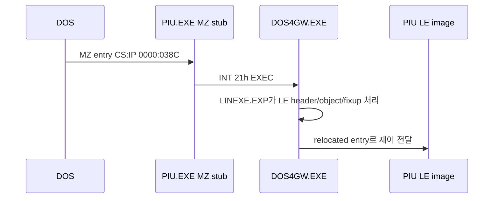

# DOS4GW loader와 selector 할당 분석

## 실행 파일 관계

PIU.EXE의 MZ load module은 파일 오프셋 `0x0000`~`0x2C8B`이고 LE 헤더는 `0x2C90`에서 시작한다. MZ stub에는 `DOS4GPATH`, `dos4gw.exe`, `Stub exec failed`가 포함되어 있어 실제 protected-mode loader를 외부에서 실행함을 확인했다.



PIU 배포본 두 개와 `tools/openwatcom/binw/dos4gw.exe`는 파일 크기 265,396바이트 및 SHA-256이 동일하다. 따라서 저장소 도구의 DOS4GW 구조를 PIU 실행 경로의 직접 근거로 사용할 수 있다.

## LINEXE.EXP의 DPMI 호출

Open Watcom `wdump`로 DOS4GW.EXE 내부의 `LINEXE.EXP`를 확인했다. code selector는 `0x80`, 파일 영역은 `0x156C4`부터 `0x1E813`까지이며 진입 IP는 `0x0013`이다.

역어셈블된 object descriptor 루틴의 핵심 위치는 다음과 같다.

| 파일 오프셋 | 동작 |
|---|---|
| `0x1B2EC` | `AX=0000h`, `CX=1`, `INT 31h`: descriptor 하나 할당 |
| `0x1B314` | `AX=0007h`, `INT 31h`: object linear base 설정 |
| `0x1B322` | AX 증가 후 function `0008h`: limit 설정 |
| `0x1B32B` | AX 증가 후 function `0009h`: access rights 설정 |

이 루틴은 selector를 object 번호에서 계산하지 않는다. DPMI가 AX로 반환한 selector를 저장하고 후속 설정 및 fixup에 사용한다.

## PIU selector 값 해석

실행 trace에서 object 2에 대응하는 `0x24`, object 3 far pointer에 대응하는 `0x2C`가 관찰되었다. descriptor가 8씩 증가하고 object 순서로 하나씩 할당되므로 다음 초기 상태를 역산할 수 있다.

```text
first object selector = 0x1C
object 1 = 0x1C
object 2 = 0x24
object 3 = 0x2C
object 4 = 0x34
```

이 수열은 PIU 실행 당시의 allocator 결과이며 LE 형식 자체의 상수 규칙은 아니다. 구현에서는 명시적인 allocator 상태로 관리해야 한다.

## 16:16 fixup

source kind `0x03`은 파일에 selector가 미리 보존된 구조가 아니다. loader가 target object의 할당 selector를 얻은 뒤 source에 다음 값을 기록한다.

```text
source + 0: target offset (16-bit)
source + 2: allocated object selector (16-bit)
```

# DOS4GW Loader and Selector Allocation Analysis

The PIU MZ stub invokes external DOS4GW.EXE. The PIU copies and the Open Watcom distribution binary are byte-identical by SHA-256. DOS4GW's embedded `LINEXE.EXP` allocates one descriptor per LE object using DPMI INT 31h function 0000h, then configures its base, limit, and access rights with functions 0007h, 0008h, and 0009h. Selector values are dynamic allocator results. PIU observations imply a first object selector of `0x1C`, producing `0x24` for object 2 and `0x2C` for object 3. Kind-03 16:16 fixups receive the target offset and allocated selector from the loader rather than preserving a selector in the file image.
