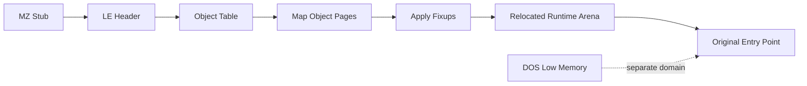

# 실행 파일 로딩과 relocation 분석

## 확인됨

* 대상은 MZ stub 뒤에 LE(Linear Executable) 이미지를 가진 DOS/4G 실행 파일이다.
* loader는 LE object를 파싱하고 object별 page를 runtime image에 배치한 뒤 fixup record를 적용한다.
* 원래 요구하는 저주소 범위는 Win32 프로세스의 기존 매핑과 충돌한다. 현재 host는 후보 base를 탐색하여 보통 `0x01000000` 또는 `0x02000000`에 이미지를 배치한다.
* 코드 주소와 image 내부 pointer에는 relocation delta가 필요하지만, DOS low memory offset에는 relocated image base를 더하면 안 된다.
* Win32 x86 host를 사용해야 원본 32-bit x86 명령을 직접 실행할 수 있다. x64 프로세스에서 같은 방식으로 원본 코드를 직접 호출하는 구조는 사용하지 않는다.

## 구현상 의미

주소는 적어도 relocated image/runtime arena, DOS low memory, selector 기반 memory, shadow-only out-of-arena memory로 구분해야 한다. 숫자가 작다는 이유만으로 image-relative 주소로 간주하거나, 모든 fault 주소에 relocation delta를 적용하면 안 된다.

## 미확정

일부 runtime pointer와 allocator metadata는 원본 DOS/4GW resize 결과를 반영한 주소 공간을 기대한다. 장기적으로 selector descriptor와 DOS memory block 소유권을 명시적인 공용 모델로 통합해야 한다.

# Executable Loading and Relocation Analysis

## Confirmed

The target is a DOS/4G executable containing an LE image after an MZ stub. The loader parses LE objects, places object pages into a runtime image, and applies fixup records. Because the original low address range collides with existing Win32 mappings, the x86 host selects a relocated base, commonly `0x01000000` or `0x02000000`.

Relocation delta applies to code addresses and image-internal pointers, but not to DOS low-memory offsets. Address domains must therefore remain distinct: relocated runtime image, DOS low memory, selector-based memory, and shadow-only out-of-arena memory.
