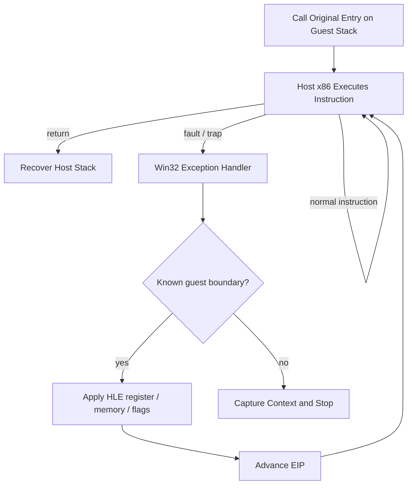

# Win32 실행 trampoline과 예외 기반 HLE 분석

## 확인됨

* host는 원본 entry point를 guest stack으로 호출하고 정상 return 또는 fault를 다시 host로 회수한다.
* Win32에서 직접 실행할 수 없는 privileged instruction, software interrupt, port I/O, 미매핑 memory access는 예외 handler가 instruction을 decode하여 HLE로 처리한다.
* guest `DS`, `ES`, `SS`, `FS`, `GS` selector는 Win32 selector로 실제 설치하지 않고 `ThreadContext`에 shadow state로 보존한다.
* observed segment load는 공용 `SelectorTable`에 provisional base-zero, 64 KiB descriptor를 등록한다. generic DS와 FS low-memory read는 descriptor translation 뒤 `DosLowMemory` backing을 사용한다.
* DOS environment scan은 아직 별도 synthetic environment view다. 같은 selector의 descriptor base와 environment block 위치가 확정되지 않아 low-memory backing에 합치지 않았다.
* single-step trace는 guest instruction 실행 전에 exception이 전달되는 특성을 이용해 HLE handler를 선처리한다.
* 진단 종료는 guest exception, 정상 return, 명시적 HLE exit, quiet timeout을 구분한다. store와 DOS 처리 진행량을 별도 counter로 기록한다.
* quiet timeout은 1초의 wall-clock 무진척으로 판정한다. timeout 시 guest를 terminate/join한 뒤 observation을 복사한다. 과거의 100,000회 busy-poll 기준은 guest 시작 전에 만료되어 실행 중 container를 복사하는 data race를 만들 수 있어 폐기했다.

## 안전 경계

handler는 관찰된 opcode와 addressing form만 처리한다. decode할 수 없는 SIB, 범위 밖 memory, 관련성이 입증되지 않은 out-of-arena access는 계속 fault로 남겨 잘못된 진행을 방지한다.

## 미확정

현재 trampoline에 opcode별 임시 정책이 집중되어 있다. 장기적으로 instruction decode, guest address translation, DOS/DPMI service dispatch를 교체 가능한 계층으로 분리해야 한다.

# Win32 Execution Trampoline and Exception-Driven HLE Analysis

The host calls the original entry point on a guest stack and recovers normal returns or faults. A Win32 exception handler decodes privileged instructions, software interrupts, port I/O, and unmapped memory operations that cannot execute directly. Guest segment selectors are retained in a shared selector table instead of being installed into the Win32 process. Provisional base-zero descriptors translate generic DS/FS low-memory reads into a fixed 64 KiB backing; the synthetic DOS environment view remains separate until its descriptor base is confirmed.

Quiet timeout now means one second of wall-clock inactivity. On timeout, the host terminates and joins the guest before copying observations. The previous 100,000-iteration busy-poll threshold could expire before guest startup and race with guest updates to non-atomic containers.

Handlers deliberately accept only observed opcodes and addressing forms. Unknown SIB forms, unrelated out-of-range memory, and unproven accesses remain faults. Long term, instruction decoding, guest address translation, and DOS/DPMI dispatch should become separate replaceable layers.
