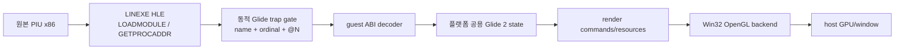
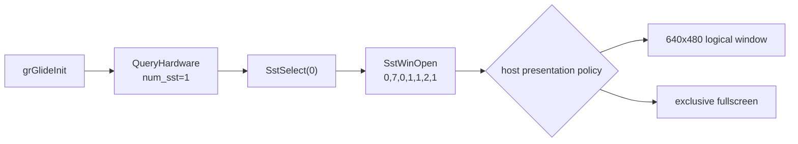
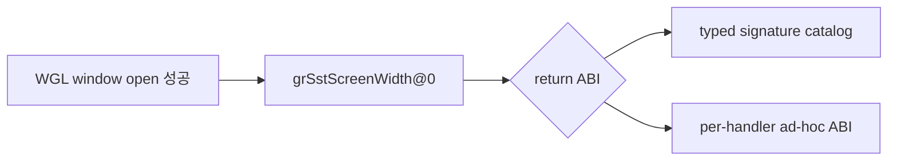
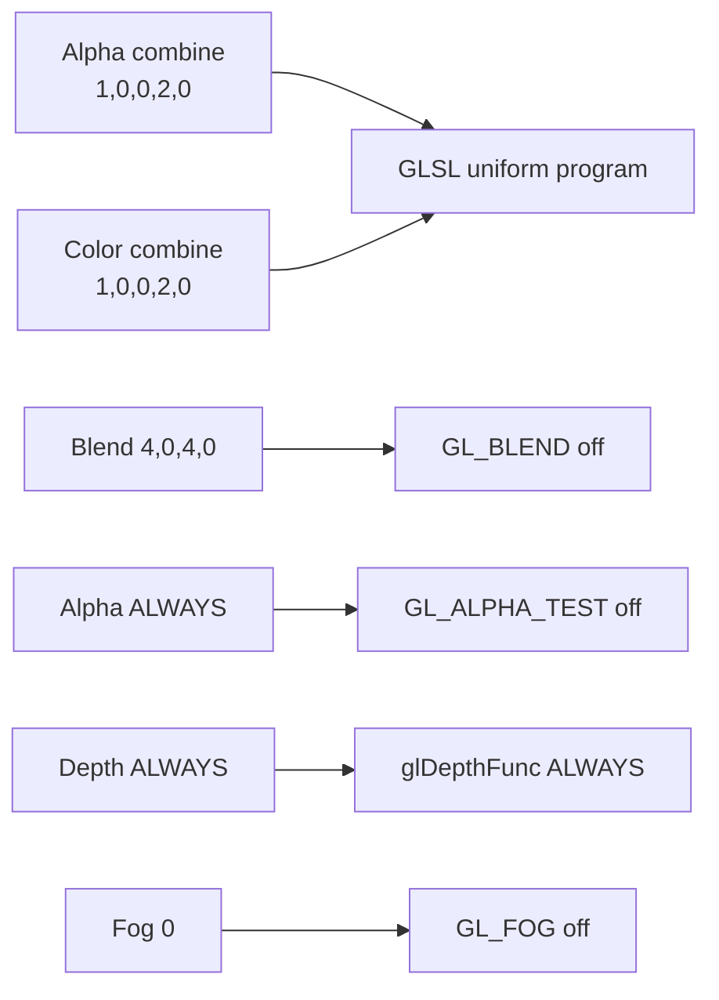
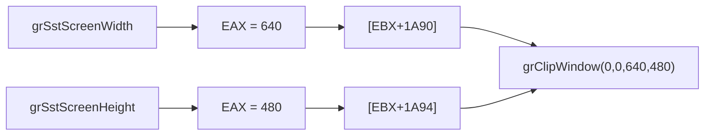
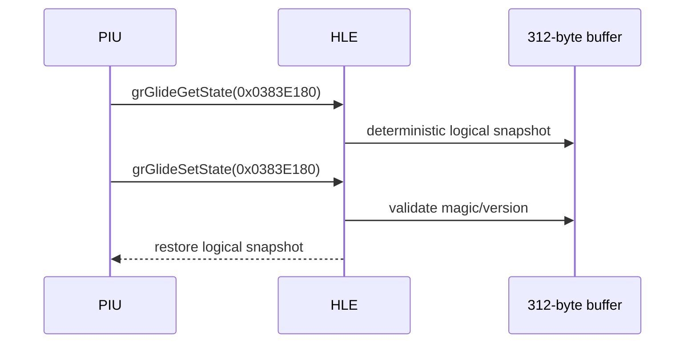
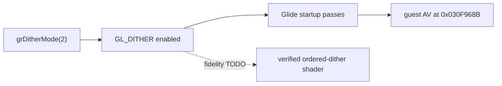

# Glide2x.ovl과 OpenGL HLE 분석

## 확인된 바이너리 구조

**확인됨.** 사용자 asset `PIU/Glide2x.ovl`은 MZ 뒤에 LE image를 가진 80386 OS/2 module입니다. 현재 LE parser로 3개 object, 78개 page, 3,419개 internal fixup을 해석할 수 있습니다. import module은 없습니다. 그러나 이 코드를 실행하면 원본 3Dfx 하드웨어·PCI·port I/O 경로까지 함께 요구하므로 host OpenGL 연동에는 module 전체 실행보다 export facade가 적합합니다.

resident-name table에는 module 이름 `glide2x`와 ordinal 1~172가 들어 있습니다. 주요 예는 다음과 같습니다.

| ordinal | decorated export | 확인 가능한 ABI |
|---:|---|---|
| 32 | `_GRGLIDEINIT@0` | 인자 0바이트 |
| 38 | `_GRSSTSELECT@4` | 인자 4바이트 |
| 71 | `_GRDRAWPOINT@4` | 인자 4바이트 |
| 72 | `_GRDRAWLINE@8` | 인자 8바이트 |
| 73 | `_GRDRAWTRIANGLE@12` | 인자 12바이트 |
| 74 | `_GRDRAWPLANARPOLYGON@12` | 인자 12바이트 |
| 75 | `_GRDRAWPLANARPOLYGONVERTEXLIST@8` | 인자 8바이트 |
| 76 | `_GRDRAWPOLYGON@12` | 인자 12바이트 |
| 77 | `_GRDRAWPOLYGONVERTEXLIST@8` | 인자 8바이트 |
| 85 | `_GRBUFFERSWAP@4` | 인자 4바이트 |
| 89 | `_GRCLIPWINDOW@16` | 인자 16바이트 |
| 94 | `_GRCULLMODE@4` | 인자 4바이트 |
| 112 | `_GRLFBLOCK@24` | 인자 24바이트 |
| 118 | `_GRSSTWINOPEN@28` | 인자 28바이트 |
| 138 | `_GRTEXSOURCE@16` | 인자 16바이트 |
| 144 | `_GRTEXDOWNLOADMIPMAPLEVELPARTIAL@40` | 인자 40바이트 |

**확인됨 (2026-07-14).** 그리기 API 71~77, `_GRCLIPWINDOW@16`(89), `_GRCULLMODE@4`(94)는 resident-name table 재파싱으로 ordinal과 인자 byte 수를 재확정했습니다. 이 중 71~76은 HLE stub이 등록되어 있고 77 `_GRDRAWPOLYGONVERTEXLIST@8`은 아직 미등록입니다.

`@N` suffix는 callee가 소비하는 인자 byte 수를 제공하므로, `GETPROCADDR`가 요청된 이름을 resident-name table과 대응시키면 executable별 고정 주소 없이 guest-callable trap ABI를 만들 수 있습니다. 실제 PIU가 요청하는 export 집합은 아직 동적 trace로 확정해야 합니다.

## 권장 연동 구조

`LINEXE_LOADMODULE("glide2x.ovl")`은 OVL 코드를 실행하지 않고 검증된 virtual module handle을 반환합니다. `LINEXE_GETPROCADDR`는 요청 이름 또는 ordinal을 export metadata와 대조하고, 처음 요청된 함수에 안정적인 합성 far pointer를 할당합니다. pointer의 trap은 서비스 id와 stack-byte count를 포함합니다. 실제 호출 시 dispatcher가 guest stack에서 인자를 복사하고 반환값과 callee stack cleanup을 원본 ABI에 맞게 적용합니다.

Glide 상태는 플랫폼 공용 계층에서 관리합니다. OpenGL backend는 다음을 담당합니다.

* `grSstWinOpen/Close`, `grBufferSwap`: host window, context, front/back buffer
* `grDrawTriangle`와 vertex list: `GrVertex`를 읽어 vertex buffer와 draw command 생성
* color/alpha/depth/fog/chroma/texture combine: Glide state key를 GLSL shader variant 또는 uniform으로 변환
* texture download/source: 3Dfx texture-memory address를 virtual allocation으로 관리하고 OpenGL texture에 upload
* `grLfbLock/Unlock`: guest arena의 staging buffer를 제공하고 lock 방향에 따라 framebuffer와 동기화
* query/status: 일관된 virtual Voodoo capability와 deterministic status 반환

OpenGL compatibility fixed-function 호출에 직접 매핑하면 초기 prototype은 짧지만 Glide의 color/alpha/texture combine을 정확히 표현하기 어렵고 OpenGL core/WebGL 확장을 막습니다. 플랫폼 공용 state translator와 shader 기반 backend가 장기 구조로 적합합니다. Khronos도 구식 fixed-function 기능이 core profile에서 제거되고 현대 구현에서는 shader로 대체된다고 설명합니다.

## 구현 순서와 검증 경계

1. `LOADMODULE` virtual handle과 `GETPROCADDR` 요청 trace만 구현합니다.
2. trace에서 실제 PIU export 집합, 호출 순서, stack/return ABI를 확정합니다.
3. init/query/window/clear/swap의 최소 backend로 첫 화면을 엽니다.
4. triangle, render state, texture 순으로 구현하여 frame hash와 screenshot을 비교합니다.
5. LFB, fog, gamma, movie helper처럼 실제 호출된 후순위 기능을 추가합니다.

OVL의 GPL 계열 공개 source나 기존 Glide wrapper 구현은 코드로 복사·번역·링크하지 않습니다. 명세, export metadata, PIU runtime trace를 이용한 clean-room 구현만 허용합니다.

## 외부 근거

* [3Dfx Glide 2.4 Programming Guide](https://www.bitsavers.org/components/3dfx/Glide_Programming_Guide_2.4_199707.pdf)
* [3Dfx Glide 2.0 API Reference](https://www.gamers.org/dEngine/xf3D/glide/glideref.htm)
* [Khronos OpenGL Registry](https://registry.khronos.org/OpenGL/index_gl.php)
* [Khronos OpenGL fixed-function pipeline 설명](https://wikis.khronos.org/opengl/Fixed_Function_Pipeline)
* [MAME machine record: Pump It Up 1st / Voodoo Banshee](https://arcade.vastheman.com/minimaws/machine/pumpit1)

## 600초 프레임 루프 관측과 검은 화면 근인 (2026-07-19 Task 249) / 600-Second Frame-Loop Observation and Black-Screen Root Cause

**확인됨.** aot-dynamic 600초 구동에서 Glide 초기화 시퀀스(게이트 전수 로그 96건:
init→queryHardware→select→winOpen→화면 크기→TMU 주소→상태 일괄 설정→state
round-trip→텍스처 mem/다운로드/샘플러→hints→프레임 루프 진입)가 거부 0건으로
통과했고, 78초부터 종료까지 프레임 루프
`grBufferClear→grColorMask→grBufferSwap→grBufferNumPending`(+ 프레임별 상태
재설정: cullMode/depthMask/fogMode/clipWindow/texMipMapMode 등)이 안정 순환했다.
창은 실제 WGL 창이다(`mode_supported=1 opened=1`).

**확인됨 (검은 화면 = 렌더 경로 3계층 no-op).** (1) `_GRBUFFERSWAP@4` 핸들러가
`SwapBuffers`를 호출하지 않으므로 `OpenWindowed`의 최초 1회 검정 clear+swap 이후
어떤 프레임도 제시되지 않는다. (2) `_GRBUFFERCLEAR@12`와 draw 계열(71~76)이
no-op이므로 백버퍼 내용이 없다. (3) 텍스처 다운로드/소스가 텍셀 데이터를 버린다.
단계별 보완 계획은 `docs/design/20260719-249-glide-render-path-completion.md`.

**미확정.** 600초 동안 draw(66~77)/LFB(110~117) ordinal이 1 Hz 샘플에 전혀 나타나지
않았다 — 게임이 Glide 밖 하위 시스템(입력 I/O, YMZ280B, CD 오디오, EEPROM) 대기로
콘텐츠 단계에 도달하지 못했을 가능성과 관측 캡(게이트 로그 96건, 1 Hz 샘플) 가능성이
남아 있으며, ordinal별 라이브 카운트 텔레메트리(계획 R0)로 확정한다.

**Confirmed (Task 249).** A 600 s aot-dynamic run passes the full Glide startup
sequence with zero rejected gates and settles from 78 s into a stable frame loop
(clear→colorMask→swap→numPending plus per-frame state resets) on a real WGL
window. The black screen is structural: no present (`grBufferSwap` never calls
`SwapBuffers` after the single black clear at open), no drawing (clear/draw
family are no-ops), no textures (downloads discarded). **Open:** no draw/LFB
ordinal appeared in ~560 samples — either the game is content-blocked on
non-Glide subsystems or the observation caps missed rare calls; the R0
per-ordinal live counts in design 249 settle this.

## PIU.EXE가 참조하는 전체 Glide export 집합 (2026-07-19 Task 249) / Full Glide Export Set Referenced by PIU.EXE

**확인됨.** `PIU.EXE` 바이너리 문자열 스캔으로 장식된 Glide 이름 **97개**를 확인했다
(`_GR[A-Z0-9]+@N` 패턴, GETPROCADDR 요청 후보 전체 집합). `glide2x.ovl`
resident-name table 전수 파싱으로 ordinal 0(모듈명 `glide2x`)~172를 확정했으며,
1~7·64·78·108·109·133·141·142·145는 내부 헬퍼(`__GRTEXDOWNLOAD_DEFAULT_*`,
`__GRTEXDOWNLOADPALETTE@16` 등), 9~28·51~55·57~63·65·146은 `_GU*` 유틸리티,
147~172는 PCI/포트 I/O 계열(`_PIO*`, `_PCI*`)로 HLE 대상이 아니다. 현재 HLE
시그니처 카탈로그는 44개이므로 PIU 참조 이름 기준 **53개가 미등록**이다. 미등록
기능군: LFB 계열 7개(grLfbLock@24/Unlock@8/WriteRegion@32/ReadRegion@28 등),
크로마키 2개, 상수색 2개, AA draw 5개, grDrawPolygonVertexList@8, 텍스처
다운로드/테이블 5개, 텍스처 파라미터 6개, SST 상태/동기화 12개, fog/감마/기타 6개,
유틸/진단 8개. 전체 목록과 ordinal은
`docs/design/20260719-249-glide-render-path-completion.md` §4 참조.

**Confirmed (2026-07-19 Task 249).** A string scan of `PIU.EXE` yields **97**
decorated Glide names (the full GETPROCADDR candidate set). A full parse of the
OVL resident-name table pins ordinals 0-172; internal helpers, `_GU*` utilities,
and the PCI/port-I/O family (147-172) are out of HLE scope. The current
44-signature catalog leaves **53 referenced names unregistered** (LFB, chroma
key, constant color, AA draws, texture download/table/parameter, SST
status/sync, fog/gamma, and diagnostics groups). See design 249 §4 for the full
table.

# Glide2x.ovl and OpenGL HLE Analysis

The user-provided `Glide2x.ovl` is an MZ-bound 80386 LE module with three objects, 78 pages, 3,419 internal fixups, and no imported modules. Its resident-name table exposes 172 decorated exports. Suffixes such as `_GRSSTWINOPEN@28`, `_GRDRAWTRIANGLE@12`, and `_GRBUFFERSWAP@4` provide the callee argument-byte count needed for dynamic guest trap gates.

**Confirmed (2026-07-14).** A resident-name table re-parse re-established the ordinals and argument-byte counts of the drawing group 71–77 (`_GRDRAWPOINT@4`, `_GRDRAWLINE@8`, `_GRDRAWTRIANGLE@12`, `_GRDRAWPLANARPOLYGON@12`, `_GRDRAWPLANARPOLYGONVERTEXLIST@8`, `_GRDRAWPOLYGON@12`, `_GRDRAWPOLYGONVERTEXLIST@8`), plus `_GRCLIPWINDOW@16` (89) and `_GRCULLMODE@4` (94). HLE stubs cover 71–76; ordinal 77 `_GRDRAWPOLYGONVERTEXLIST@8` is not registered yet.

The recommended design treats the OVL as export metadata rather than executing its 3Dfx PCI and port-I/O implementation. LINEXE returns a virtual module handle, resolves requested names/ordinals to stable synthetic far pointers, and dispatches traps through a platform-neutral Glide 2 state machine. A Win32 OpenGL backend translates draw state, textures, buffers, LFB staging, and queries. A shader-based translator is preferred over direct legacy fixed-function calls because it can model Glide combine behavior and later support core OpenGL and WebGL backends.

Implementation should first trace the exact PIU export set and ABI, then add initialization/window/clear/swap, triangle rendering, state, textures, and finally LFB or other observed helpers. Existing GPL-family Glide implementations remain behavioral references only; implementation must be clean-room from published documentation, asset metadata, and runtime evidence.

## 동적 HLE frontier (2026-07-11)

**확인됨.** LE resident-name parser와 ordinal별 동적 gate를 연결한 뒤 PIU의 초기 호출 순서는 다음과 같습니다.

1. `_GRGLIDEINIT@0`
2. `_GRSSTQUERYHARDWARE@4` — `GrHwConfiguration*`; `num_sst=1`만으로 통과
3. `_GRSSTSELECT@4` — board index `0`
4. `_GRSSTWINOPEN@28`

`GETPROCADDR` 출력은 packed 16:16 pointer가 아니라 `{32-bit linear address, 32-bit client CS}`입니다. PIU는 이를 읽어 자신의 code stub을 `E9 rel32`로 self-patch한 뒤 gate로 jump합니다. gate의 stack은 `[return EIP, arguments...]`이고 decorated `@N`과 일치하는 callee cleanup이 필요합니다.

관찰된 `grSstWinOpen` 인자는 `hWnd=0`, resolution `7`, refresh `0`, color format `1`, origin `1`, color buffer `2`, auxiliary buffer `1`입니다. 다음 결정은 논리 640×480 surface를 windowed presentation으로 제공할지, 원본에 가까운 exclusive fullscreen으로 제공할지입니다.

The dynamic path now confirms the startup sequence `grGlideInit`, `grSstQueryHardware`, `grSstSelect(0)`, and `grSstWinOpen`. `GETPROCADDR` returns an eight-byte `{linear address, client CS}` pair; PIU self-patches a near-jump stub to each synthetic gate. The observed open arguments are `0,7,0,1,1,2,1`. The next decision is windowed presentation of a 640×480 logical surface versus exclusive fullscreen.

## Windowed OpenGL 결과와 signature frontier

**확인됨.** 1번 정책으로 640×480 client window, double-buffered WGL context와 24-bit depth-capable pixel format을 생성했습니다. `grSstWinOpen`은 FXTRUE를 반환했고 다음 export는 ordinal 39 `_GRSSTSCREENWIDTH@0`입니다.

이 함수는 인자가 없지만 반환값은 x87 `ST(0)`의 floating-point 값입니다. resident export의 `@N` suffix는 stack cleanup 크기만 제공하며 반환 type, pointer target 구조, enum 의미를 제공하지 않습니다. 따라서 다음 구현 전에는 공식 Glide 2 문서에서 파생한 명시적 signature catalog를 유지할지, 개별 handler에 ABI 지식을 분산할지 결정해야 합니다.

The windowed policy successfully creates a 640×480 client window and double-buffered WGL context with a depth-capable pixel format. The next export is ordinal 39 `_GRSSTSCREENWIDTH@0`, which returns a floating-point value in x87 `ST(0)`. Decorated `@N` metadata provides stack cleanup only, making a typed Glide 2 signature catalog versus scattered per-handler ABI knowledge the next architectural decision.

## Typed catalog 이후 texture-memory frontier

**확인됨.** 점진적 typed catalog와 별도 x87 context helper를 추가한 뒤 `grSstScreenWidth()`의 `640.0f`, `grSstScreenHeight()`의 `480.0f`가 정상 소비됐습니다. 이어서 `grTexMinAddress(GR_TMU0)`가 호출됐고 0을 반환한 뒤 다음 frontier는 ordinal 45 `_GRTEXMAXADDRESS@4`, 인자 TMU 0입니다.

`grTexMaxAddress`는 memory byte count가 아니라 가장 작은 1×1 texture를 시작할 수 있는 마지막 8-byte aligned address입니다. PIU 1st hardware 자료는 Voodoo Banshee를 지목하지만, virtual TMU address space를 standard 2 MiB 호환값으로 제한할지 4 MiB로 노출할지는 host OpenGL resource 정책과 guest texture allocator를 함께 결정합니다.

The incremental typed catalog and separate x87 context helper successfully return `640.0f` and `480.0f`. After `grTexMinAddress(GR_TMU0)` returns zero, the next frontier is ordinal 45 `_GRTEXMAXADDRESS@4`. This value is the last 8-byte-aligned start address for the smallest texture, not a byte count. The next decision is a conservative 2 MiB or expanded 4 MiB virtual TMU address space.

## 8 MiB TMU 이후 초기 render state

**확인됨.** 선택된 8 MiB TMU는 `grTexMaxAddress(GR_TMU0)=0x007FFFF8`로 반환됐습니다. 이어지는 초기 상태 호출은 다음과 같습니다.

| API | 인자 | 처리 |
|---|---|---|
| `grColorMask` | `1,0` | RGB write on, alpha off |
| `grRenderBuffer` | `1` | OpenGL back buffer |
| `grDepthMask` | `1` | depth write on |
| `grDepthBufferMode` | `1` | Z-buffer mode |
| `grLfbWriteColorFormat` | `1` | 논리 LFB state에 보존 |

다음 frontier는 `_GRALPHACOMBINE@20`이며 인자는 `1,0,0,2,0`입니다. 이 시점부터 Glide combine equation을 legacy OpenGL fixed-function state로 근사할지 shader variant/uniform으로 정확히 표현할지 결정해야 합니다.

The selected 8 MiB TMU returns `0x007FFFF8`. PIU then enables RGB-only writes, selects the back buffer, enables depth writes and Z-buffering, and stores LFB color format 1. The next frontier is `_GRALPHACOMBINE@20` with arguments `1,0,0,2,0`, requiring a shader-state versus legacy fixed-function mapping decision.

## GLSL combine과 초기 raster state / GLSL combine and initial raster state

GLSL 1.10 program을 WGL context 생명주기 안에서 한 번 compile/link하고, 관찰된 alpha/color combine `1,0,0,2,0`을 uniform으로 전달했습니다. 두 식은 `LOCAL` iterated RGBA를 선택합니다. 이어서 `grAlphaBlendFunction(4,0,4,0)`은 `ONE,ZERO,ONE,ZERO`, alpha test와 depth compare의 값 `7`은 `ALWAYS`, fog mode `0`은 disabled로 확인했습니다. Blend 의미와 비활성 기준 호출은 [3dfx Glide Reference Manual 2.4](https://www.bitsavers.org/components/3dfx/Glide_Reference_Manual_2.4_199707.pdf)의 `grAlphaBlendFunction` 정의를 따릅니다.

live telemetry에 마지막 ordinal과 다섯 stack argument를 추가한 결과 다음 frontier는 ordinal 89 `_GRCLIPWINDOW@16`으로 확인됐습니다. 관찰 인자는 `(0,0,0x030FED90,0x030FED8B)`이며 뒤의 두 값은 유효한 640×480 좌표가 아니라 guest code 범위입니다. 호출 시점의 값 생성 경로 또는 import-stub/stack ABI를 역추적하기 전에는 scissor로 적용할 수 없습니다.

The WGL-owned GLSL 1.10 program is compiled and linked once, then receives the observed alpha/color combine `1,0,0,2,0` through uniforms. Both select local iterated RGBA. The following state resolves to `ONE,ZERO,ONE,ZERO` blending, `ALWAYS` alpha/depth comparisons, and disabled fog. Shared live telemetry identifies the next frontier as ordinal 89 `_GRCLIPWINDOW@16`; its observed `(0,0,0x030FED90,0x030FED8B)` contains guest-code addresses rather than valid 640×480 bounds, so no scissor mapping is applied pending producer/ABI tracing.

## Clip 좌표 손상과 반환 ABI 정정 / Clip Corruption and Return ABI Correction

위의 x87 반환 결론은 이후 원본 caller 역추적으로 반증됐습니다. return EIP `0x0304F7AF` 직전 코드는 `[EBX+0x1A90]`, `[EBX+0x1A94]`를 push하며, 초기화 루틴은 `grSstScreenWidth/Height` 직후 EAX를 이 필드에 저장합니다.

기존 HLE는 x87만 갱신하여 EAX에 import stub 주소를 남겼습니다. typed return을 `UInt32/EAX`로 정정하자 좌표가 `(0,0,0x280,0x1E0)`으로 복원됐습니다. 전체 clip을 OpenGL viewport/scissor로 적용하고 cull mode 0을 통과한 뒤 다음 frontier는 `_GRGLIDEGETSTATE@4`, 출력 포인터 `0x0383E180`입니다.

The earlier x87 conclusion was disproved by tracing the original caller. It stores EAX directly into integer width/height fields and later passes them to `grClipWindow`. Correcting the typed return to integer `UInt32/EAX` restored `(0,0,640,480)`. Full-window viewport/scissor and disabled culling then advance execution to `_GRGLIDEGETSTATE@4` with output pointer `0x0383E180`.

## Opaque Glide2 state round-trip

[Glide 2.4 reference manual](https://www.bitsavers.org/components/3dfx/Glide_Reference_Manual_2.4_199707.pdf)은 `GrState`를 공개 필드가 없는 Get/Set 쌍으로 정의합니다. [Glide 3.0 programming guide](https://www.bitsavers.org/components/3dfx/Glide_Programming_Guide_3.0_199806.pdf)는 이후 API에서 `GR_GLIDE_STATE_SIZE` 질의를 사용하도록 설명합니다. [공개 호환 구현의 312바이트 Glide2 관찰](https://www.zeus-software.com/forum/viewtopic.php?start=10&t=2232)은 PIU allocation 간격 336바이트와 교차 확인됐습니다. [DOS/32A 공식 저장소](https://github.com/amindlost/dos32a)에서는 Glide state 관련 근거를 찾지 못했으며 DOS runtime 호환성만으로 그래픽 API private layout을 추론하지 않습니다.

동일 포인터 Get/Set 사이에 다른 Glide gate나 직접 blob 접근은 관찰되지 않았습니다. round-trip 통과 후 다음 frontier는 `_GRDITHERMODE@4(2)`입니다.

The public 312-byte Glide2 candidate is corroborated by PIU's 336-byte allocation gap. PIU performs an immediate same-pointer Get/Set round-trip without observed direct access, allowing an independent deterministic state image rather than reproducing a private vendor layout. DOS/32A contains no relevant Glide-state evidence. The next frontier is `_GRDITHERMODE@4(2)`.

## Host dithering 1단계 / Host Dithering Stage 1

**확인됨:** `_GRDITHERMODE@4(2)`를 `GL_DITHER` 활성화로 처리하고 mode를 logical state와 state-image version 2에 보존했습니다. 호출 이후 미구현 Glide gate가 아니라 원본 guest `EIP=0x030F968B` 접근 위반까지 진행했습니다. 따라서 host dither 연결은 현재 startup 경로를 통과합니다.

**TODO:** 현대 32-bit OpenGL framebuffer의 `GL_DITHER`는 Voodoo의 16-bit ordered dithering과 픽셀 동일성을 보장하지 않습니다. mode-2 matrix, PIU color quantization, reference capture를 확보한 뒤 GLSL ordered dithering으로 교체하거나 선택 가능하게 만들어야 합니다.

**Confirmed:** `_GRDITHERMODE@4(2)` enables `GL_DITHER` and persists mode 2 in logical state and state-image version 2. Execution passes the Glide startup path and later reaches a guest access violation at `0x030F968B`, not an unimplemented Glide gate. Exact Voodoo ordered dithering remains a GLSL fidelity TODO requiring matrix, quantization, and reference-capture evidence.

## `grTexMaxAddress` 및 `grTexMinAddress` 인자 ABI 보정 / `grTexMaxAddress` and `grTexMinAddress` ABI Correction

**정정됨 (2026-07-18 Task 235, 이 절의 기존 cdecl 결론은 반증됨):** Task 234가 기록했던 "게임 바이너리가 cdecl로 컴파일되어 `ESP += 4`(인자 미pop)로 처리해야 한다"는 결론은 **오류였다.** xref 추적으로 두 thunk의 유일한 호출자가 `fxTMInit`임을 확인했고, `fxTMInit`은 `push arg; call grTexMin; push arg; call grTexMax; mov eax,[esp]`처럼 caller측 정리 없이 호출한다 — 즉 **stdcall(피호출자 인자 pop, `ESP += 8`)을 전제**한다. cdecl 처리(`ESP += 4`)는 잔여 인자 2개가 `mov eax,[esp]`를 오염시켜 fxTMInit NULL gc 크래시(0x0304DBF8)를 일으키는 회귀였다. 현재 HLE는 stdcall(`Esp += 2*4`)로 복원되어 있다. 상세: `docs/analysis/current-execution-frontier.md`의 Task 235 절.

**Corrected (2026-07-18 Task 235; the earlier cdecl conclusion in this section is disproved):** Task 234's claim that the game binary calls these as `cdecl` (requiring `ESP += 4`) was wrong. xref tracing shows `fxTMInit` is the sole caller of both thunks and issues `push arg; call ...` with no caller-side cleanup, i.e. it assumes **stdcall (callee pops, `ESP += 8`)**. The cdecl handling left two stale dwords that corrupted `mov eax,[esp]` and caused the fxTMInit NULL-gc crash at `0x0304DBF8`. The HLE has been restored to stdcall (`Esp += 2*4`). Details: the Task 235 entry in `docs/analysis/current-execution-frontier.md`.

## GrVertex first-call observation (2026-07-20)

**Confirmed.** Direct `pumpit1` loader execution with `aot-dynamic` reached `_GRDRAWTRIANGLE@12`. Its three readable guest pointers were `0x0383C640`, `0x0383C67C`, and `0x0383C6F4`. The first pointer difference is `0x3C` (60 bytes), not the previously assumed 72 bytes. The first dwords decode as plausible screen coordinates: `(288.0, 329.9375)`, `(296.0, 329.9375)`, `(288.0, 313.9375)`; dword 3 is `255.0` and dword 9 is `1.0` for all three.

**Inferred.** The triangle references entries 0, 1, and 3 of a 60-byte producer layout. The 72-byte Glide 2.4 layout must not be applied to this PIU call path without reconciling that stride; the 72-byte capture includes adjacent entry data.

**Unresolved.** The packing of the other fields and whether this is a PIU compact vertex format require more samples before OpenGL submission.