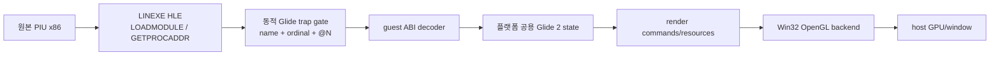
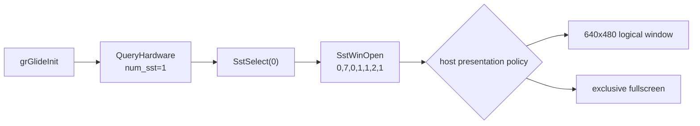
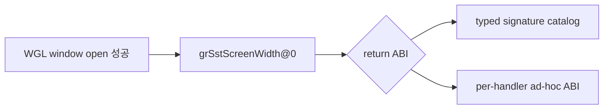
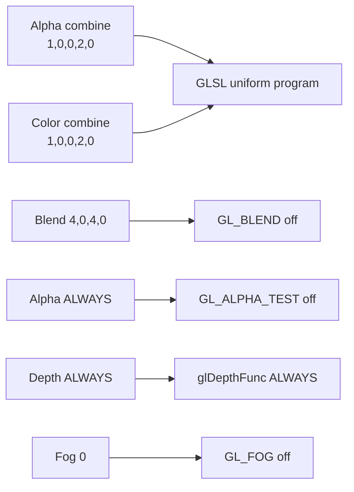
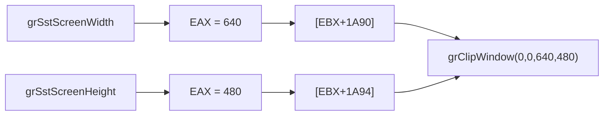
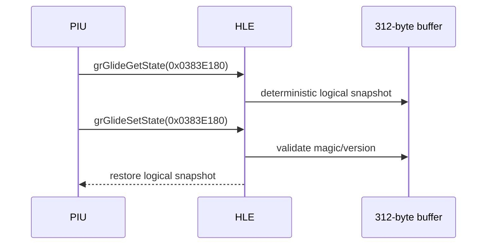
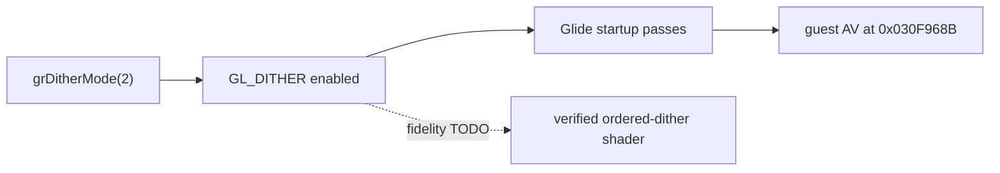

# Glide2x.ovl과 OpenGL HLE 분석

## 확인된 바이너리 구조

**확인됨.** 사용자 asset `PIU/Glide2x.ovl`은 MZ 뒤에 LE image를 가진 80386 OS/2 module입니다. 현재 LE parser로 3개 object, 78개 page, 3,419개 internal fixup을 해석할 수 있습니다. import module은 없습니다. 그러나 이 코드를 실행하면 원본 3Dfx 하드웨어·PCI·port I/O 경로까지 함께 요구하므로 host OpenGL 연동에는 module 전체 실행보다 export facade가 적합합니다.

resident-name table에는 module 이름 `glide2x`와 ordinal 1~172가 들어 있습니다. 주요 예는 다음과 같습니다.

| ordinal | decorated export | 확인 가능한 ABI |
|---:|---|---|
| 32 | `_GRGLIDEINIT@0` | 인자 0바이트 |
| 38 | `_GRSSTSELECT@4` | 인자 4바이트 |
| 71 | `_GRDRAWPOINT@4` | 인자 4바이트 |
| 72 | `_GRDRAWLINE@8` | 인자 8바이트 |
| 73 | `_GRDRAWTRIANGLE@12` | 인자 12바이트 |
| 74 | `_GRDRAWPLANARPOLYGON@12` | 인자 12바이트 |
| 75 | `_GRDRAWPLANARPOLYGONVERTEXLIST@8` | 인자 8바이트 |
| 76 | `_GRDRAWPOLYGON@12` | 인자 12바이트 |
| 77 | `_GRDRAWPOLYGONVERTEXLIST@8` | 인자 8바이트 |
| 85 | `_GRBUFFERSWAP@4` | 인자 4바이트 |
| 89 | `_GRCLIPWINDOW@16` | 인자 16바이트 |
| 94 | `_GRCULLMODE@4` | 인자 4바이트 |
| 112 | `_GRLFBLOCK@24` | 인자 24바이트 |
| 118 | `_GRSSTWINOPEN@28` | 인자 28바이트 |
| 138 | `_GRTEXSOURCE@16` | 인자 16바이트 |
| 144 | `_GRTEXDOWNLOADMIPMAPLEVELPARTIAL@40` | 인자 40바이트 |

**확인됨 (2026-07-14).** 그리기 API 71~77, `_GRCLIPWINDOW@16`(89), `_GRCULLMODE@4`(94)는 resident-name table 재파싱으로 ordinal과 인자 byte 수를 재확정했습니다. 이 중 71~76은 HLE stub이 등록되어 있고 77 `_GRDRAWPOLYGONVERTEXLIST@8`은 아직 미등록입니다.

`@N` suffix는 callee가 소비하는 인자 byte 수를 제공하므로, `GETPROCADDR`가 요청된 이름을 resident-name table과 대응시키면 executable별 고정 주소 없이 guest-callable trap ABI를 만들 수 있습니다. 실제 PIU가 요청하는 export 집합은 아직 동적 trace로 확정해야 합니다.

## 권장 연동 구조

`LINEXE_LOADMODULE("glide2x.ovl")`은 OVL 코드를 실행하지 않고 검증된 virtual module handle을 반환합니다. `LINEXE_GETPROCADDR`는 요청 이름 또는 ordinal을 export metadata와 대조하고, 처음 요청된 함수에 안정적인 합성 far pointer를 할당합니다. pointer의 trap은 서비스 id와 stack-byte count를 포함합니다. 실제 호출 시 dispatcher가 guest stack에서 인자를 복사하고 반환값과 callee stack cleanup을 원본 ABI에 맞게 적용합니다.

Glide 상태는 플랫폼 공용 계층에서 관리합니다. OpenGL backend는 다음을 담당합니다.

* `grSstWinOpen/Close`, `grBufferSwap`: host window, context, front/back buffer
* `grDrawTriangle`와 vertex list: `GrVertex`를 읽어 vertex buffer와 draw command 생성
* color/alpha/depth/fog/chroma/texture combine: Glide state key를 GLSL shader variant 또는 uniform으로 변환
* texture download/source: 3Dfx texture-memory address를 virtual allocation으로 관리하고 OpenGL texture에 upload
* `grLfbLock/Unlock`: guest arena의 staging buffer를 제공하고 lock 방향에 따라 framebuffer와 동기화
* query/status: 일관된 virtual Voodoo capability와 deterministic status 반환

OpenGL compatibility fixed-function 호출에 직접 매핑하면 초기 prototype은 짧지만 Glide의 color/alpha/texture combine을 정확히 표현하기 어렵고 OpenGL core/WebGL 확장을 막습니다. 플랫폼 공용 state translator와 shader 기반 backend가 장기 구조로 적합합니다. Khronos도 구식 fixed-function 기능이 core profile에서 제거되고 현대 구현에서는 shader로 대체된다고 설명합니다.

## 구현 순서와 검증 경계

1. `LOADMODULE` virtual handle과 `GETPROCADDR` 요청 trace만 구현합니다.
2. trace에서 실제 PIU export 집합, 호출 순서, stack/return ABI를 확정합니다.
3. init/query/window/clear/swap의 최소 backend로 첫 화면을 엽니다.
4. triangle, render state, texture 순으로 구현하여 frame hash와 screenshot을 비교합니다.
5. LFB, fog, gamma, movie helper처럼 실제 호출된 후순위 기능을 추가합니다.

OVL의 GPL 계열 공개 source나 기존 Glide wrapper 구현은 코드로 복사·번역·링크하지 않습니다. 명세, export metadata, PIU runtime trace를 이용한 clean-room 구현만 허용합니다.

## 외부 근거

* [3Dfx Glide 2.4 Programming Guide](https://www.bitsavers.org/components/3dfx/Glide_Programming_Guide_2.4_199707.pdf)
* [3Dfx Glide 2.0 API Reference](https://www.gamers.org/dEngine/xf3D/glide/glideref.htm)
* [Khronos OpenGL Registry](https://registry.khronos.org/OpenGL/index_gl.php)
* [Khronos OpenGL fixed-function pipeline 설명](https://wikis.khronos.org/opengl/Fixed_Function_Pipeline)
* [MAME machine record: Pump It Up 1st / Voodoo Banshee](https://arcade.vastheman.com/minimaws/machine/pumpit1)

## 600초 프레임 루프 관측과 검은 화면 근인 (2026-07-19 Task 249) / 600-Second Frame-Loop Observation and Black-Screen Root Cause

**확인됨.** aot-dynamic 600초 구동에서 Glide 초기화 시퀀스(게이트 전수 로그 96건:
init→queryHardware→select→winOpen→화면 크기→TMU 주소→상태 일괄 설정→state
round-trip→텍스처 mem/다운로드/샘플러→hints→프레임 루프 진입)가 거부 0건으로
통과했고, 78초부터 종료까지 프레임 루프
`grBufferClear→grColorMask→grBufferSwap→grBufferNumPending`(+ 프레임별 상태
재설정: cullMode/depthMask/fogMode/clipWindow/texMipMapMode 등)이 안정 순환했다.
창은 실제 WGL 창이다(`mode_supported=1 opened=1`).

**확인됨 (검은 화면 = 렌더 경로 3계층 no-op).** (1) `_GRBUFFERSWAP@4` 핸들러가
`SwapBuffers`를 호출하지 않으므로 `OpenWindowed`의 최초 1회 검정 clear+swap 이후
어떤 프레임도 제시되지 않는다. (2) `_GRBUFFERCLEAR@12`와 draw 계열(71~76)이
no-op이므로 백버퍼 내용이 없다. (3) 텍스처 다운로드/소스가 텍셀 데이터를 버린다.
단계별 보완 계획은 `docs/design/20260719-249-glide-render-path-completion.md`.

**미확정.** 600초 동안 draw(66~77)/LFB(110~117) ordinal이 1 Hz 샘플에 전혀 나타나지
않았다 — 게임이 Glide 밖 하위 시스템(입력 I/O, YMZ280B, CD 오디오, EEPROM) 대기로
콘텐츠 단계에 도달하지 못했을 가능성과 관측 캡(게이트 로그 96건, 1 Hz 샘플) 가능성이
남아 있으며, ordinal별 라이브 카운트 텔레메트리(계획 R0)로 확정한다.

**Confirmed (Task 249).** A 600 s aot-dynamic run passes the full Glide startup
sequence with zero rejected gates and settles from 78 s into a stable frame loop
(clear→colorMask→swap→numPending plus per-frame state resets) on a real WGL
window. The black screen is structural: no present (`grBufferSwap` never calls
`SwapBuffers` after the single black clear at open), no drawing (clear/draw
family are no-ops), no textures (downloads discarded). **Open:** no draw/LFB
ordinal appeared in ~560 samples — either the game is content-blocked on
non-Glide subsystems or the observation caps missed rare calls; the R0
per-ordinal live counts in design 249 settle this.

## PIU.EXE가 참조하는 전체 Glide export 집합 (2026-07-19 Task 249) / Full Glide Export Set Referenced by PIU.EXE

**확인됨.** `PIU.EXE` 바이너리 문자열 스캔으로 장식된 Glide 이름 **97개**를 확인했다
(`_GR[A-Z0-9]+@N` 패턴, GETPROCADDR 요청 후보 전체 집합). `glide2x.ovl`
resident-name table 전수 파싱으로 ordinal 0(모듈명 `glide2x`)~172를 확정했으며,
1~7·64·78·108·109·133·141·142·145는 내부 헬퍼(`__GRTEXDOWNLOAD_DEFAULT_*`,
`__GRTEXDOWNLOADPALETTE@16` 등), 9~28·51~55·57~63·65·146은 `_GU*` 유틸리티,
147~172는 PCI/포트 I/O 계열(`_PIO*`, `_PCI*`)로 HLE 대상이 아니다. 현재 HLE
시그니처 카탈로그는 44개이므로 PIU 참조 이름 기준 **53개가 미등록**이다. 미등록
기능군: LFB 계열 7개(grLfbLock@24/Unlock@8/WriteRegion@32/ReadRegion@28 등),
크로마키 2개, 상수색 2개, AA draw 5개, grDrawPolygonVertexList@8, 텍스처
다운로드/테이블 5개, 텍스처 파라미터 6개, SST 상태/동기화 12개, fog/감마/기타 6개,
유틸/진단 8개. 전체 목록과 ordinal은
`docs/design/20260719-249-glide-render-path-completion.md` §4 참조.

**Confirmed (2026-07-19 Task 249).** A string scan of `PIU.EXE` yields **97**
decorated Glide names (the full GETPROCADDR candidate set). A full parse of the
OVL resident-name table pins ordinals 0-172; internal helpers, `_GU*` utilities,
and the PCI/port-I/O family (147-172) are out of HLE scope. The current
44-signature catalog leaves **53 referenced names unregistered** (LFB, chroma
key, constant color, AA draws, texture download/table/parameter, SST
status/sync, fog/gamma, and diagnostics groups). See design 249 §4 for the full
table.

# Glide2x.ovl and OpenGL HLE Analysis

The user-provided `Glide2x.ovl` is an MZ-bound 80386 LE module with three objects, 78 pages, 3,419 internal fixups, and no imported modules. Its resident-name table exposes 172 decorated exports. Suffixes such as `_GRSSTWINOPEN@28`, `_GRDRAWTRIANGLE@12`, and `_GRBUFFERSWAP@4` provide the callee argument-byte count needed for dynamic guest trap gates.

**Confirmed (2026-07-14).** A resident-name table re-parse re-established the ordinals and argument-byte counts of the drawing group 71–77 (`_GRDRAWPOINT@4`, `_GRDRAWLINE@8`, `_GRDRAWTRIANGLE@12`, `_GRDRAWPLANARPOLYGON@12`, `_GRDRAWPLANARPOLYGONVERTEXLIST@8`, `_GRDRAWPOLYGON@12`, `_GRDRAWPOLYGONVERTEXLIST@8`), plus `_GRCLIPWINDOW@16` (89) and `_GRCULLMODE@4` (94). HLE stubs cover 71–76; ordinal 77 `_GRDRAWPOLYGONVERTEXLIST@8` is not registered yet.

The recommended design treats the OVL as export metadata rather than executing its 3Dfx PCI and port-I/O implementation. LINEXE returns a virtual module handle, resolves requested names/ordinals to stable synthetic far pointers, and dispatches traps through a platform-neutral Glide 2 state machine. A Win32 OpenGL backend translates draw state, textures, buffers, LFB staging, and queries. A shader-based translator is preferred over direct legacy fixed-function calls because it can model Glide combine behavior and later support core OpenGL and WebGL backends.

Implementation should first trace the exact PIU export set and ABI, then add initialization/window/clear/swap, triangle rendering, state, textures, and finally LFB or other observed helpers. Existing GPL-family Glide implementations remain behavioral references only; implementation must be clean-room from published documentation, asset metadata, and runtime evidence.

## 동적 HLE frontier (2026-07-11)

**확인됨.** LE resident-name parser와 ordinal별 동적 gate를 연결한 뒤 PIU의 초기 호출 순서는 다음과 같습니다.

1. `_GRGLIDEINIT@0`
2. `_GRSSTQUERYHARDWARE@4` — `GrHwConfiguration*`; `num_sst=1`만으로 통과
3. `_GRSSTSELECT@4` — board index `0`
4. `_GRSSTWINOPEN@28`

`GETPROCADDR` 출력은 packed 16:16 pointer가 아니라 `{32-bit linear address, 32-bit client CS}`입니다. PIU는 이를 읽어 자신의 code stub을 `E9 rel32`로 self-patch한 뒤 gate로 jump합니다. gate의 stack은 `[return EIP, arguments...]`이고 decorated `@N`과 일치하는 callee cleanup이 필요합니다.

관찰된 `grSstWinOpen` 인자는 `hWnd=0`, resolution `7`, refresh `0`, color format `1`, origin `1`, color buffer `2`, auxiliary buffer `1`입니다. 다음 결정은 논리 640×480 surface를 windowed presentation으로 제공할지, 원본에 가까운 exclusive fullscreen으로 제공할지입니다.

The dynamic path now confirms the startup sequence `grGlideInit`, `grSstQueryHardware`, `grSstSelect(0)`, and `grSstWinOpen`. `GETPROCADDR` returns an eight-byte `{linear address, client CS}` pair; PIU self-patches a near-jump stub to each synthetic gate. The observed open arguments are `0,7,0,1,1,2,1`. The next decision is windowed presentation of a 640×480 logical surface versus exclusive fullscreen.

## Windowed OpenGL 결과와 signature frontier

**확인됨.** 1번 정책으로 640×480 client window, double-buffered WGL context와 24-bit depth-capable pixel format을 생성했습니다. `grSstWinOpen`은 FXTRUE를 반환했고 다음 export는 ordinal 39 `_GRSSTSCREENWIDTH@0`입니다.

이 함수는 인자가 없지만 반환값은 x87 `ST(0)`의 floating-point 값입니다. resident export의 `@N` suffix는 stack cleanup 크기만 제공하며 반환 type, pointer target 구조, enum 의미를 제공하지 않습니다. 따라서 다음 구현 전에는 공식 Glide 2 문서에서 파생한 명시적 signature catalog를 유지할지, 개별 handler에 ABI 지식을 분산할지 결정해야 합니다.

The windowed policy successfully creates a 640×480 client window and double-buffered WGL context with a depth-capable pixel format. The next export is ordinal 39 `_GRSSTSCREENWIDTH@0`, which returns a floating-point value in x87 `ST(0)`. Decorated `@N` metadata provides stack cleanup only, making a typed Glide 2 signature catalog versus scattered per-handler ABI knowledge the next architectural decision.

## Typed catalog 이후 texture-memory frontier

**확인됨.** 점진적 typed catalog와 별도 x87 context helper를 추가한 뒤 `grSstScreenWidth()`의 `640.0f`, `grSstScreenHeight()`의 `480.0f`가 정상 소비됐습니다. 이어서 `grTexMinAddress(GR_TMU0)`가 호출됐고 0을 반환한 뒤 다음 frontier는 ordinal 45 `_GRTEXMAXADDRESS@4`, 인자 TMU 0입니다.

`grTexMaxAddress`는 memory byte count가 아니라 가장 작은 1×1 texture를 시작할 수 있는 마지막 8-byte aligned address입니다. PIU 1st hardware 자료는 Voodoo Banshee를 지목하지만, virtual TMU address space를 standard 2 MiB 호환값으로 제한할지 4 MiB로 노출할지는 host OpenGL resource 정책과 guest texture allocator를 함께 결정합니다.

The incremental typed catalog and separate x87 context helper successfully return `640.0f` and `480.0f`. After `grTexMinAddress(GR_TMU0)` returns zero, the next frontier is ordinal 45 `_GRTEXMAXADDRESS@4`. This value is the last 8-byte-aligned start address for the smallest texture, not a byte count. The next decision is a conservative 2 MiB or expanded 4 MiB virtual TMU address space.

## 8 MiB TMU 이후 초기 render state

**확인됨.** 선택된 8 MiB TMU는 `grTexMaxAddress(GR_TMU0)=0x007FFFF8`로 반환됐습니다. 이어지는 초기 상태 호출은 다음과 같습니다.

| API | 인자 | 처리 |
|---|---|---|
| `grColorMask` | `1,0` | RGB write on, alpha off |
| `grRenderBuffer` | `1` | OpenGL back buffer |
| `grDepthMask` | `1` | depth write on |
| `grDepthBufferMode` | `1` | Z-buffer mode |
| `grLfbWriteColorFormat` | `1` | 논리 LFB state에 보존 |

다음 frontier는 `_GRALPHACOMBINE@20`이며 인자는 `1,0,0,2,0`입니다. 이 시점부터 Glide combine equation을 legacy OpenGL fixed-function state로 근사할지 shader variant/uniform으로 정확히 표현할지 결정해야 합니다.

The selected 8 MiB TMU returns `0x007FFFF8`. PIU then enables RGB-only writes, selects the back buffer, enables depth writes and Z-buffering, and stores LFB color format 1. The next frontier is `_GRALPHACOMBINE@20` with arguments `1,0,0,2,0`, requiring a shader-state versus legacy fixed-function mapping decision.

## GLSL combine과 초기 raster state / GLSL combine and initial raster state

GLSL 1.10 program을 WGL context 생명주기 안에서 한 번 compile/link하고, 관찰된 alpha/color combine `1,0,0,2,0`을 uniform으로 전달했습니다. 두 식은 `LOCAL` iterated RGBA를 선택합니다. 이어서 `grAlphaBlendFunction(4,0,4,0)`은 `ONE,ZERO,ONE,ZERO`, alpha test와 depth compare의 값 `7`은 `ALWAYS`, fog mode `0`은 disabled로 확인했습니다. Blend 의미와 비활성 기준 호출은 [3dfx Glide Reference Manual 2.4](https://www.bitsavers.org/components/3dfx/Glide_Reference_Manual_2.4_199707.pdf)의 `grAlphaBlendFunction` 정의를 따릅니다.

live telemetry에 마지막 ordinal과 다섯 stack argument를 추가한 결과 다음 frontier는 ordinal 89 `_GRCLIPWINDOW@16`으로 확인됐습니다. 관찰 인자는 `(0,0,0x030FED90,0x030FED8B)`이며 뒤의 두 값은 유효한 640×480 좌표가 아니라 guest code 범위입니다. 호출 시점의 값 생성 경로 또는 import-stub/stack ABI를 역추적하기 전에는 scissor로 적용할 수 없습니다.

The WGL-owned GLSL 1.10 program is compiled and linked once, then receives the observed alpha/color combine `1,0,0,2,0` through uniforms. Both select local iterated RGBA. The following state resolves to `ONE,ZERO,ONE,ZERO` blending, `ALWAYS` alpha/depth comparisons, and disabled fog. Shared live telemetry identifies the next frontier as ordinal 89 `_GRCLIPWINDOW@16`; its observed `(0,0,0x030FED90,0x030FED8B)` contains guest-code addresses rather than valid 640×480 bounds, so no scissor mapping is applied pending producer/ABI tracing.

## Clip 좌표 손상과 반환 ABI 정정 / Clip Corruption and Return ABI Correction

위의 x87 반환 결론은 이후 원본 caller 역추적으로 반증됐습니다. return EIP `0x0304F7AF` 직전 코드는 `[EBX+0x1A90]`, `[EBX+0x1A94]`를 push하며, 초기화 루틴은 `grSstScreenWidth/Height` 직후 EAX를 이 필드에 저장합니다.

기존 HLE는 x87만 갱신하여 EAX에 import stub 주소를 남겼습니다. typed return을 `UInt32/EAX`로 정정하자 좌표가 `(0,0,0x280,0x1E0)`으로 복원됐습니다. 전체 clip을 OpenGL viewport/scissor로 적용하고 cull mode 0을 통과한 뒤 다음 frontier는 `_GRGLIDEGETSTATE@4`, 출력 포인터 `0x0383E180`입니다.

The earlier x87 conclusion was disproved by tracing the original caller. It stores EAX directly into integer width/height fields and later passes them to `grClipWindow`. Correcting the typed return to integer `UInt32/EAX` restored `(0,0,640,480)`. Full-window viewport/scissor and disabled culling then advance execution to `_GRGLIDEGETSTATE@4` with output pointer `0x0383E180`.

## Opaque Glide2 state round-trip

[Glide 2.4 reference manual](https://www.bitsavers.org/components/3dfx/Glide_Reference_Manual_2.4_199707.pdf)은 `GrState`를 공개 필드가 없는 Get/Set 쌍으로 정의합니다. [Glide 3.0 programming guide](https://www.bitsavers.org/components/3dfx/Glide_Programming_Guide_3.0_199806.pdf)는 이후 API에서 `GR_GLIDE_STATE_SIZE` 질의를 사용하도록 설명합니다. [공개 호환 구현의 312바이트 Glide2 관찰](https://www.zeus-software.com/forum/viewtopic.php?start=10&t=2232)은 PIU allocation 간격 336바이트와 교차 확인됐습니다. [DOS/32A 공식 저장소](https://github.com/amindlost/dos32a)에서는 Glide state 관련 근거를 찾지 못했으며 DOS runtime 호환성만으로 그래픽 API private layout을 추론하지 않습니다.

동일 포인터 Get/Set 사이에 다른 Glide gate나 직접 blob 접근은 관찰되지 않았습니다. round-trip 통과 후 다음 frontier는 `_GRDITHERMODE@4(2)`입니다.

The public 312-byte Glide2 candidate is corroborated by PIU's 336-byte allocation gap. PIU performs an immediate same-pointer Get/Set round-trip without observed direct access, allowing an independent deterministic state image rather than reproducing a private vendor layout. DOS/32A contains no relevant Glide-state evidence. The next frontier is `_GRDITHERMODE@4(2)`.

## Host dithering 1단계 / Host Dithering Stage 1

**확인됨:** `_GRDITHERMODE@4(2)`를 `GL_DITHER` 활성화로 처리하고 mode를 logical state와 state-image version 2에 보존했습니다. 호출 이후 미구현 Glide gate가 아니라 원본 guest `EIP=0x030F968B` 접근 위반까지 진행했습니다. 따라서 host dither 연결은 현재 startup 경로를 통과합니다.

**TODO:** 현대 32-bit OpenGL framebuffer의 `GL_DITHER`는 Voodoo의 16-bit ordered dithering과 픽셀 동일성을 보장하지 않습니다. mode-2 matrix, PIU color quantization, reference capture를 확보한 뒤 GLSL ordered dithering으로 교체하거나 선택 가능하게 만들어야 합니다.

**Confirmed:** `_GRDITHERMODE@4(2)` enables `GL_DITHER` and persists mode 2 in logical state and state-image version 2. Execution passes the Glide startup path and later reaches a guest access violation at `0x030F968B`, not an unimplemented Glide gate. Exact Voodoo ordered dithering remains a GLSL fidelity TODO requiring matrix, quantization, and reference-capture evidence.

## `grTexMaxAddress` 및 `grTexMinAddress` 인자 ABI 보정 / `grTexMaxAddress` and `grTexMinAddress` ABI Correction

**정정됨 (2026-07-18 Task 235, 이 절의 기존 cdecl 결론은 반증됨):** Task 234가 기록했던 "게임 바이너리가 cdecl로 컴파일되어 `ESP += 4`(인자 미pop)로 처리해야 한다"는 결론은 **오류였다.** xref 추적으로 두 thunk의 유일한 호출자가 `fxTMInit`임을 확인했고, `fxTMInit`은 `push arg; call grTexMin; push arg; call grTexMax; mov eax,[esp]`처럼 caller측 정리 없이 호출한다 — 즉 **stdcall(피호출자 인자 pop, `ESP += 8`)을 전제**한다. cdecl 처리(`ESP += 4`)는 잔여 인자 2개가 `mov eax,[esp]`를 오염시켜 fxTMInit NULL gc 크래시(0x0304DBF8)를 일으키는 회귀였다. 현재 HLE는 stdcall(`Esp += 2*4`)로 복원되어 있다. 상세: `docs/analysis/current-execution-frontier.md`의 Task 235 절.

**Corrected (2026-07-18 Task 235; the earlier cdecl conclusion in this section is disproved):** Task 234's claim that the game binary calls these as `cdecl` (requiring `ESP += 4`) was wrong. xref tracing shows `fxTMInit` is the sole caller of both thunks and issues `push arg; call ...` with no caller-side cleanup, i.e. it assumes **stdcall (callee pops, `ESP += 8`)**. The cdecl handling left two stale dwords that corrupted `mov eax,[esp]` and caused the fxTMInit NULL-gc crash at `0x0304DBF8`. The HLE has been restored to stdcall (`Esp += 2*4`). Details: the Task 235 entry in `docs/analysis/current-execution-frontier.md`.

## GrVertex first-call observation (2026-07-20)

**Confirmed.** Direct `pumpit1` loader execution with `aot-dynamic` reached `_GRDRAWTRIANGLE@12`. Its three readable guest pointers were `0x0383C640`, `0x0383C67C`, and `0x0383C6F4`. The first pointer difference is `0x3C` (60 bytes), not the previously assumed 72 bytes. The first dwords decode as plausible screen coordinates: `(288.0, 329.9375)`, `(296.0, 329.9375)`, `(288.0, 313.9375)`; dword 3 is `255.0` and dword 9 is `1.0` for all three.

**Inferred.** The triangle references entries 0, 1, and 3 of a 60-byte producer layout. The 72-byte Glide 2.4 layout must not be applied to this PIU call path without reconciling that stride; the 72-byte capture includes adjacent entry data.

## GrVertex 60바이트 레이아웃 확정 및 투영 근인 (2026-07-20/21 Task 254) / Confirmed 60-byte GrVertex Layout and Projection Root Cause

**확인됨 (정점 레이아웃).** 첫 삼각형 3정점의 15 dword(60바이트) stride를 실측
디코드한 결과, 표준 Glide GrVertex(2 TMU)와 정확히 일치한다. dword별 V0/V1/V2 실측값:

| dword | 필드 | V0 | V1 | V2 |
|---:|---|---|---|---|
| 0 | x (screen) | 288.0 | 296.0 | 288.0 |
| 1 | y (screen) | 329.9375 | 329.9375 | 313.9375 |
| 2 | z (Glide 무시) | 정크 | 정크 | 정크 |
| 3 | r [0..255] | 255.0 | 255.0 | 255.0 |
| 4 | g [0..255] | 0.0 | 0.0 | 0.0 |
| 5 | b [0..255] | 0.0 | 0.0 | 0.0 |
| 6 | ooz (65535/z) | 가변 | 가변 | 가변 |
| 7 | a [0..255] | 255.0 | 255.0 | 255.0 |
| 8 | oow (1/w) | 1.0 | 1.0 | 1.0 |
| 9 | tmu0.sow | 72.0 | 80.0 | 72.0 |
| 10 | tmu0.tow | 32.0 | 32.0 | 48.0 |
| 11..14 | tmu0.oow, tmu1.* | 가변 | 가변 | 가변 |

이 삼각형은 **불투명 빨강(r=255,g=0,b=0,a=255) + 텍스처 좌표**를 가진다. 즉 게임은
색과 텍스처를 갖춘 정상 지오메트리를 제출하고 있으며, 렌더 부재는 데이터 문제가
아니다.

**확인됨 (검은 화면 근인 = 투영 부재).** 정점 x/y는 640×480 화면 픽셀 좌표인데
`GlideOpenGlBackend`가 직교 투영(`glOrtho`)을 설정하지 않아, `ftransform()` 기반
정점 셰이더가 단위 투영행렬을 적용하면 픽셀 좌표가 NDC `[-1,1]` 밖으로 나가 모든
삼각형이 클리핑된다. 240초 구동에서 삼각형은 거부 0·미처리 0으로 안정 제출되지만
화면에 나타나지 않는 이유가 이것이다.

> **정정됨 (2026-07-22 Task 259).** 아래의 **"origin=1 = GR_ORIGIN_UPPER_LEFT"는
> 반증됐다.** 표준 `GrOriginLocation_t`는 `GR_ORIGIN_UPPER_LEFT`=0,
> `GR_ORIGIN_LOWER_LEFT`=1이므로 관측값 1은 **LOWER_LEFT**다. y 뒤집힌 투영을
> 고정으로 적용한 결과 화면 전체가 상하 반전되어 표시됐다(사용자 육안 확인).
> Task 254의 "투영 부재가 클리핑을 유발했다"는 근인 분석 자체는 유효하며, 잘못된
> 것은 방향뿐이다. 상세는 이 문서 하단 Task 259 절 참조.

**수정 (Task 254).** `OpenWindowed`에 ~~y 뒤집힌~~ 직교 투영을 추가한다
(~~`glOrtho(0, w, h, 0, -1, 1)`, 관측된 `grSstWinOpen` origin=1 =
GR_ORIGIN_UPPER_LEFT에 맞춤~~ → **Task 259에서 origin 인자를 실제로 존중하도록
정정**; `grCullMode(0)`으로 컬링이 꺼져 와인딩 반전 무해).
셰이더 Initialize에서 combine function uniform을 1(LOCAL)로 기본 설정해 흑색
프래그먼트를 예방한다. 색 반영(현재 흰색 고정)과 텍스처 샘플링은 후속 Task
255/256에서 다룬다. 상세: `docs/design/20260721-254-glide-screen-space-projection.md`.

**Confirmed (vertex layout).** Decoding the 15-dword (60-byte) stride of the first
triangle's three vertices matches the standard 2-TMU Glide GrVertex exactly (see
table). The triangle is opaque red (255,0,0,255) with texture coordinates, so the
game submits well-formed geometry — the absent rendering is not a data problem.

## R2 정점 색상 / R3 텍스처 combine 확정 (2026-07-21 Task 255) / R2 Vertex Color and R3 Texture Combine Confirmed

> **정정됨 (2026-07-22 Task 258).** 아래 절의 **"1×1 텍스처" 결론은 반증됐다.**
> 실제 텍스처는 **256×256**이며, 근거로 삼았던 "8바이트 간격"은 원본 게임의 성질이
> 아니라 **우리 `grTexTextureMemRequired` 버그가 만든 결과**였다. 상세는 이 문서
> 하단의 Task 258 절과 `docs/kb/glide-texture-lod-and-formats.md` 참조. 이 절의
> combine 전환·포맷·texel 값 관측은 유효하다.

**확인됨 (combine 전환).** 콘텐츠 draw는 `grColorCombine(function=3=SCALE_OTHER,
other=1=TEXTURE)`로 텍스처를 출력한다(init은 function=1=LOCAL=iterated 정점 색).
`grTexCombine(0,1,0,1,0,0,0)`도 관측. 텍스처는 startAddress 0(format 10=RGB565)과
8(format 12=ARGB4444), largeLod=0·aspect=3·evenOdd=3.
디코드 실측: addr=0 texel=(140,150,148,255) 불투명 회색, addr=8 texel=(0,0,0,0) 투명
검정. ~~largeLod=0·aspect=3 → **1×1**(8바이트 간격이 확증). 정점 텍스처 좌표는 1×1에서
wrap로 동일 texel을 샘플한다.~~ → **반증됨: 256×256이며 texel 값은 그 이미지의 첫
픽셀이다(Task 258).**

**구현 (Task 255).** 정점 색(r/g/b/a)을 `glColor4f`로 반영(R2), 플랫폼 공용 텍스처
디코드 모듈 + 백엔드 텍스처 캐시 + GLSL sampler2D로 SCALE_OTHER 텍스처를 샘플(R3).
투명 텍스처의 반투명 합성은 알파 블렌딩(후속)이 필요하다. 상세:
`docs/analysis/current-execution-frontier.md` Task 255,
`docs/design/20260721-255-glide-r2-r3-vertex-color-and-texture.md`.

**Confirmed (Task 255).** Content draws switch grColorCombine to function 3
(SCALE_OTHER, other = TEXTURE) to output the texture, versus init's function 1
(LOCAL, iterated vertex color). Textures at start addresses 0 (RGB565) and 8
(ARGB4444) are 1×1 (the 8-byte spacing confirms it); decode yields an opaque gray
texel at addr 0 and a transparent-black texel at addr 8. Implemented per-vertex
color (R2) and a platform-neutral decode module + backend texture cache + GLSL
sampler for SCALE_OTHER texture sampling (R3). Translucent compositing of
transparent textures needs alpha blending (follow-up).
**Confirmed (root cause = missing projection).** The x/y are 640×480 screen pixel
coordinates, but the backend sets no `glOrtho`, so the `ftransform()` vertex
shader with an identity projection pushes pixel coordinates outside NDC `[-1,1]`
and clips every triangle. **Fix (Task 254):** add a y-flipped
`glOrtho(0, w, h, 0, -1, 1)` in `OpenWindowed` (matching the observed
GR_ORIGIN_UPPER_LEFT; culling is disabled so reversed winding is harmless) and
seed the combine function uniforms to LOCAL. Color and texture sampling are
deferred to Tasks 255/256.
## PIU가 실제로 호출하는 Glide API 확정 (2026-07-21 Task 257) / Confirmed Set of Glide APIs PIU Actually Calls

**확인됨.** ordinal별 최초호출 감사(`REPIU_GLIDE_CALL_AUDIT`)로 `aot-dynamic
pumpit1` 300초 구동에서 카탈로그 97종 중 **39종 호출**, 거부 0건을 확정했다. 이전에는
게이트 진입 로그 96건 캡과 타임아웃 경로의 요약 누락 때문에 확정이 불가능했다.

런타임이 스스로 `unhandled (default)`로 기록한 것은 **정확히 3개**다:
`grConstantColorValue`(92), `grLfbLock`(112), `grLfbUnlock`(113). 나머지는 실동작
29종, 상태만 보존 2종, 전용 no-op 5종(`grHints`, `grTexClampMode/FilterMode/
MipMapMode`, `grTexCombine`)이다.

**반증됨 (드로우 계열 공백 가설).** "폴리곤·버텍스리스트 드로우 미구현이 BGA/UI
렌더 공백을 만든다"는 추정은 반증됐다. **드로우는 `grDrawTriangle`(73) 하나만
호출**되며 `grDrawPolygon`·`PlanarPolygon`·`PolygonVertexList`·`Point`·`Line`과
AA 계열 5종은 전부 미호출이다. 드로우 계열 확장은 실질 우선순위가 아니다.

**Confirmed (Task 257).** A per-ordinal first-call audit settles the reached set:
39 of 97 cataloged exports, zero rejected gates, and exactly three landing on the
default handler (`grConstantColorValue`, `grLfbLock`, `grLfbUnlock`). This also
disproves the earlier inference about missing polygon/vertex-list draws — only
`grDrawTriangle` is ever called.

## GrLOD_t 해석 오류와 첫 콘텐츠 렌더 (2026-07-22 Task 258) / GrLOD_t Misinterpretation and the First Real Content Render

**확인됨 (근인).** 게임이 정상 좌표의 콘텐츠 지오메트리를 제출해도 화면이 비던 근인은
`GrLOD_t`를 크기의 log2로 취급한 것이었다. `GrLOD_t`는 **열거값**이며 `GR_LOD_256`이
0, `GR_LOD_1`이 8이다(긴 변 = `256 >> lod`). 관측된 `largeLod=0·aspect=1x1` 다운로드는
**256×256**인데 **1×1**로 생성됐다 — 정확히 반전. 규약 상세는
`docs/kb/glide-texture-lod-and-formats.md`.

**결정적 증거.** 게임이 제출한 텍스처 좌표가 `st=(193,156)`, `(226,156)`, `(244,·)`로
1×1에는 존재할 수 없는 값이었다. 이 **불일치**가 근인으로 이끌었다.

**확인됨 (게스트 오염과 순환 논리).** `grTexTextureMemRequired`가 같은 계산을
공유하고 게임은 그 반환값으로 **자기 TMU 주소 공간을 배치**한다. 256×256 텍스처에
"8바이트"를 보고하자 게임이 텍스처를 8바이트 간격으로 쌓았고, Task 255는 그 간격을
1×1의 확증으로 기록했다. **우리 출력의 함수인 관측을 외부 사실로 취급**한 순환
논리였다. 수정 후 게임은 `0x2000` 간격으로 배치한다.

**수정과 검증.** LOD→변 길이 변환을 `8 - lod`로 정정하고, aspect ratio를 짧은 변에
적용하며, 유효성 검사를 `large_lod <= small_lod`로 반전했다. 콘텐츠 화면이 키 입력을
요구하므로(v0.0.77/78의 JAMMA 입력 수정 이후 정상 동작) `keybd_event` 합성 입력으로
구동했다: 텍스처 **256×256** 저장, 삼각형별 백버퍼 누적 `0 → 122 → … → 760`,
프레임 **1,765/307,200 비검정**(avg-rgb 133,133,133) swap #200까지 안정, 거부·미처리
0 유지. **이것이 rePIU의 첫 실제 콘텐츠 렌더다.**

**미확정.** (1) 정점 색 필드가 여전히 유효 범위 밖이다 — 현재 콘텐츠는 SCALE_OTHER라
정점색을 쓰지 않아 무해하나, 게임이 안 채우는 것인지 색 오프셋이 어긋난 것인지는
LOCAL combine 콘텐츠가 나와야 확정된다. (2) 텍스처 주소 간격 `0x2000`(8,192)은
256×256×2=131,072와 맞지 않아 mipmap/evenOdd 분할 또는 부분 다운로드 가능성이 있으며
`GrTexInfo` 실측이 필요하다. (3) LFB 경로는 실데이터 미검증이다.

**Confirmed (Task 258).** The black screen under valid geometry was a `GrLOD_t`
misinterpretation: it is an enumeration (`GR_LOD_256` = 0), not a log2 size, so
every texture was inverted — the observed `largeLod=0`/`1x1` download is 256x256
but was built 1x1. The decisive clue was a contradiction: textures were 1x1 while
the game submitted texture coordinates up to 244. Because
`grTexTextureMemRequired` shares the math and the guest lays out its own TMU
space from the answer, the error propagated into the game's 8-byte texture
spacing, which Task 255 had recorded as proof of 1x1 textures — a circular
argument built on our own output. After the fix the game spaces them 0x2000
apart. Verified with synthesized JAMMA input: 256x256 stores, per-triangle
readback climbing 0 → 760, and a frame stable at 1,765 non-black pixels — the
project's first real content render. Open: still-garbage vertex color fields, the
meaning of the 0x2000 spacing, and end-to-end LFB validation.

## 화면 상하 반전과 배경 미표시의 분리 (2026-07-22 Task 259) / Separating the Vertical Flip from the Missing Background

**확인됨 (반전 근인 = origin 인자 무시).** 화면 전체가 상하 반전되어 표시됐다.
근인은 두 겹이다. (1) `GrOriginLocation_t`는 `GR_ORIGIN_UPPER_LEFT`=0,
`GR_ORIGIN_LOWER_LEFT`=1인데 Task 254가 관측값 1을 UPPER_LEFT로 기록했다.
(2) 더 근본적으로 `origin` 인자가 백엔드로 **전달되지 않고** y 뒤집힌 투영이
하드코딩돼 있어, 게임이 어떤 값을 넘기든 같은 투영이 걸렸다. `OpenWindowed`가
origin을 받아 투영을 선택하도록 정정했다. LFB 블릿 쿼드는 lock origin과 창 투영
방향이 독립적으로 v를 뒤집으므로 XOR로 합쳤다(두 반전이 조용히 상쇄되는 것을 방지).

**확인됨 (배경 미표시 = Glide 밖 공백).** 참조 화면(파란 BGA 배경 + 로고)과 달리
배경 레이어 전체가 비었다. 전수 계측으로 렌더러 원인을 배제했다.

* **삼각형 센서스 4,000 draw 전수:** 단일 조합 `combine fn=3(SCALE_OTHER)
  other=1(TEXTURE) textured=1`, **최대 크기 232×39**. 640×480 배경도, 배경을
  구성할 타일도 존재하지 않는다.
* **배경 전달 가능 경로 전부 미호출:** `grTexDownloadMipMap@16`(47),
  `grTexDownloadMipMapLevelPartial@40`(144), `grLfbLock`(112)/`grLfbUnlock`(113).
* **포맷 센서스:** 이 화면이 쓰는 포맷은 `RGB_565`(10)와 `ARGB_4444`(12)뿐이며
  전부 지원·저장·디코드된다. 팔레트(`P_8`/`AP_88`)·NCC 포맷은 등장하지 않는다.

즉 **게임이 배경 draw를 발행하지 않는다.** 렌더러는 제출된 것을 정확히 그리며,
그 증거로 UI 텍스트가 참조 화면과 글자 모양·글로우·위치까지 일치한다.

**반증된 가설 2건 (이번 작업 중).** (1) "미지원 텍스처 포맷 때문" — 포맷 센서스로
반증. (2) "배경이 다른 combine 모드를 써서 텍스처가 꺼진다" — 삼각형 센서스로
반증(4,000 draw 전부 동일 조합·textured=1). 두 가설 모두 원인을 렌더러 쪽에서
찾으려는 편향이었고, 전수 집계가 이를 죽였다.

**미확정 (다음 과제).** 배경은 BGA(배경 동영상)로 보이며, 게임이 BGA 자산을
준비하지 못해 배경 렌더를 건너뛰는 것으로 **추정**되나 확인되지 않았다. 파일 I/O
경로 추적이 다음 작업이다. 이는 Glide 밖 영역이다.

**Confirmed (Task 259).** The upside-down screen had two layers: `GrOriginLocation_t`
has `GR_ORIGIN_UPPER_LEFT` = 0 and `GR_ORIGIN_LOWER_LEFT` = 1, so Task 254's
reading of the observed 1 as UPPER_LEFT was backwards — and more fundamentally
the argument never reached the backend, which hardcoded a y-flipped projection.
`OpenWindowed` now selects the projection from the origin it is given.

The missing background is *not* a renderer gap. A census over 4,000 draws shows a
single combine mode (SCALE_OTHER/TEXTURE, textured) and a maximum triangle of
232x39 — no background-sized geometry or tiles — while every alternative delivery
path (`grTexDownloadMipMap`, `...LevelPartial`, `grLfbLock`/`Unlock`) is never
called and every texture format in use is supported. The game simply never issues
background draws; the UI text matches the reference screen glyph for glyph, which
is what proves the renderer faithful. Two hypotheses were disproved along the way
(unsupported formats, and an unsupported combine mode disabling texturing), both
biased toward blaming the renderer. **Open:** whether the BGA asset path is what
blocks the background — a file-I/O investigation outside Glide.

## Task 302: depth comparison 3과 안전 gate decline / Depth comparison 3 and safe gate decline

**확인됨.** 사용자 장시간 로그는 약 880초에 `_GRDEPTHBUFFERFUNCTION@4(3)`을
처음 관찰했습니다. 기존 backend는 값 7만 받아 두 번 reject했고, 다음 depth-mask
frame 아래에 `0x0304F5A5, 3`이 남았습니다. guest는 이어서 `EAX=3`으로
`[eax+0x21F9]`, 즉 `0x000021FC`를 읽어 `0xC0000005`로 종료했습니다. 이는
Tasks 246-248의 미처리 gate stdcall frame 누수와 같은 구조입니다.

`SetDepthBufferFunction`은 이제 유효 Glide 비교 값 `0..7`을 OpenGL
`GL_NEVER..GL_ALWAYS`로 변환합니다. 또한 guest 반환 주소와 catalog signature가
검증된 이후의 specialized-handler 실패는 공용 safe-decline이 반환 kind에 따른
보수적 값과 정상 stdcall 정리를 수행합니다. hard reject는 반환 주소 불량과 signature
불일치만 남습니다.

Win32 x86 Debug 빌드가 성공했습니다. 30초 smoke run은 exit 0의 정상 timeout,
progress 542,996, Glide gate 49/49, `grDepthBufferFunction(7)` 3회 처리, reject/decline/
OpenGL error/caught exception 0을 기록했습니다. 인자 3의 실제 장시간 재현은 약 880초
frontier를 넘는 후속 interactive run으로 남습니다.

**Confirmed.** The user run first reaches `_GRDEPTHBUFFERFUNCTION@4(3)` at about
880 seconds. The former value-7-only backend rejected it twice, leaving
`0x0304F5A5, 3` beneath the next depth-mask frame. Guest code then read
`EAX(3) + 0x21F9 = 0x21FC` and terminated with `0xC0000005`, matching the
Tasks 246-248 unhandled-gate stdcall leak class.

The backend now maps valid Glide comparisons `0..7` to OpenGL
`GL_NEVER..GL_ALWAYS`. Every specialized-handler failure after return-address
and signature validation uses an ABI-preserving safe decline; only invalid
return addresses and signature mismatches remain hard rejects. Win32 x86 Debug
built successfully. A 30-second smoke run ended by normal timeout with exit 0,
progress 542,996, 49/49 handled Glide gates, three successful value-7 depth calls,
and zero reject, decline, OpenGL error, or caught exception. Direct value-3 live
confirmation still requires crossing the approximately 880-second frontier.

## Task 303: Glide 구현 공백 fatal 진단 / Glide implementation-gap fatal diagnostics

**확인됨.** 기존 코드는 catalog default와 safe decline만 전역 first-N debug로
출력했고, `_GRHINTS@8`, texture sampler 기본값, draw/LFB no-op 및 미지원
combine/blend retain은 구현 공백을 별도로 표시하지 않았습니다. 안전 반환은
`glide_gate_handled_count`에 포함되므로 기존 entries/handled 요약만으로는 이를
찾을 수 없었습니다.

플랫폼 공용 tracker가 이제 `GLIDE_UNIMPLEMENTED_FUNCTION`,
`GLIDE_UNSUPPORTED_ARGUMENT`, `GLIDE_BACKEND_FAILURE`, `GLIDE_ABI_REJECT`를
함수·인자 조합별로 기록합니다. 앞의 두 분류와 ABI reject는 fatal 진단이고 backend
실패는 error입니다. ABI가 검증된 구현 공백은 `action=continue`로 stdcall을 정상
정리하며, signature 미등록/불일치와 잘못된 반환 주소만 `action=terminate` hard
reject로 남습니다. 이 `fatal`은 구현 완성도 진단 등급이지 알려진 ABI 호출의 process
종료 정책이 아닙니다.

**검증됨.** 합성 probe는 중복 병합, 인자별 분리, 분류별 total, 128-record overflow와
공용 출력 문자열을 검증하고 exit 0으로 통과했습니다. Win32 x86 Debug loader/probe
빌드가 성공했습니다. 최종 30초 `pumpit1` smoke는 exit 0 정상 timeout,
progress 약 528,000, Glide gate 49/49였고 초기 구간에는 구현 공백 호출이 없어
total/unique/overflow가 모두 0이었습니다.

**미확정.** 현재 환경의 60초 smoke도 초기 49개 gate에 머물렀으므로 실제 콘텐츠
호출에서 즉시 line과 종료 summary가 같은 count를 갖는지는 장시간 실행에서 재확인해야
합니다. 다만 사용자 로그는 이후 `_GRTEXCLAMPMODE@12`,
`_GRTEXFILTERMODE@12`, `_GRTEXMIPMAPMODE@12`, `_GRTEXCOMBINE@28`,
`_GRHINTS@8`가 호출됨을 확인하므로 새 빌드에서는 해당 첫 조합마다
`[repiu-fatal]`이 출력됩니다.

**Confirmed.** The old code emitted only globally first-N debug lines for
catalog defaults and safe declines. Explicit `_GRHINTS@8`, texture-sampler
defaults, draw/LFB no-ops, and unsupported combine/blend retain paths were
silent. Safe returns also counted as handled, so entries/handled could not
identify implementation gaps.

The platform-neutral tracker now records `GLIDE_UNIMPLEMENTED_FUNCTION`,
`GLIDE_UNSUPPORTED_ARGUMENT`, `GLIDE_BACKEND_FAILURE`, and `GLIDE_ABI_REJECT`
by function/argument combination. The first two and ABI rejects are fatal
diagnostics; backend failures are errors. Verified-ABI gaps use
`action=continue` with normal stdcall cleanup, while uncataloged/mismatched
signatures and invalid return addresses remain `action=terminate` hard rejects.
Here fatal is implementation-completeness severity, not a process-termination
policy for known ABI calls.

**Verified.** The synthetic probe passed deduplication, argument separation,
per-category totals, 128-record overflow, and the shared exact log format with
exit 0. Win32 x86 Debug loader/probe builds succeeded. The final 30-second
`pumpit1` smoke ended by normal timeout with exit 0, progress about 528,000, and
49/49 Glide gates; no implementation-gap call occurred in that startup window,
so all issue totals remained zero.

**Unresolved.** This environment's 60-second smoke also remained at the first
49 gates, so agreement between immediate lines and final counts on real content
calls still needs a longer run. The user log does confirm later calls to the
texture sampler/combine no-ops and `_GRHINTS@8`; the rebuilt boundary will emit
`[repiu-fatal]` on each first unique combination.

## 텍스처 좌표 공간과 GrColor_t 형식 확정 (2026-07-28 Task 332) / Confirmed Texture Coordinate Space and GrColor_t Format

**확인됨:** 난이도 점이 몇 픽셀로만 보이던 근인은 **텍스처 좌표 정규화**였다.
Glide 좌표 공간은 텍셀 단위가 아니라 LOD와 무관하게 **긴 축이 항상 256**이고 짧은
축만 aspect ratio가 줄인다. 프레임 덤프에서 32×32 점 스프라이트(`largeLod=3`,
`aspect=1x1`)가 `st=(0,0)~(256,256)`으로, 64×64 화살표(`largeLod=2`)가
`st=(0,0)~(512,512)`로 제출되는 것을 직접 관측했다.

픽셀 크기로 정규화하면 긴 변이 256인 맵에서는 값이 같아 정상 동작하고, 그보다 작은
맵에서만 `256/크기` 배 초과가 되어 CLAMP로 quad의 그 비율만 덮인다. 40px quad에서
5px만 보이던 관측과 정확히 일치한다.

**확인됨:** 색상은 `grSstWinOpen`의 `cformat=1 = GR_COLORFORMAT_ABGR`이다.
`GrColor_t`를 ARGB로 읽으면 빨강과 파랑이 뒤바뀐다. 점의 상수색 `0xFE6565FE`는
ABGR로 빨강이며, ARGB로 읽어 파랗게 그려지던 것이 화면 관측과 일치했다.
게임이 쓰는 상수색은 대부분 무채색이라 이 결함을 가린다.

**확인됨:** `grTexTextureMemRequired`는 게스트 `GrTexInfo`를 읽지 않고 기본값(0)으로
계산해 **모든 텍스처에 8192바이트**를 답하고 있었다. 게스트는 그 답으로 자기 TMU
주소 공간을 배치하므로, 네 번의 계측에서 관측된 `0x2000` 균일 텍스처 간격은 원본
게임의 성질이 아니라 **우리 출력의 되먹임**이었다. 별도 결함으로 수정했으나 점
증상의 원인은 아니었다.

**기각됨:** `grDrawPoint`/`grDrawLine`/`grDrawPolygon`의 no-op 경로(게임이 호출하지
않음, 유일한 드로잉은 `grDrawTriangle`), 텍스처 미바인딩(`missing-sources=0`),
텍스처 디코드 불량(32×32 스프라이트 BMP·알파 정상), `chdir datas\texture` 실패
(원본 CHD에 없는 경로).

**Confirmed:** the difficulty dots rendered as a few pixels because Glide texture coordinates
are not texel units: the space is 256 along the longer axis whatever the LOD, with the shorter
axis scaled by the aspect ratio. A frame dump observed the 32x32 dot sprite submitted with st
spanning 0..256 and the 64x64 arrow with 0..512, so normalizing by pixel size overshoots by
`256 / size` for any map under 256 and clamps away the remainder. Colors follow
`GR_COLORFORMAT_ABGR` chosen at `grSstWinOpen`, so reading `GrColor_t` as ARGB swaps red and
blue — visible only on the dots' `0xFE6565FE` because the game's other constants are achromatic.
Separately, `grTexTextureMemRequired` never read the guest `GrTexInfo` and answered 8192 bytes
for every texture, making the observed uniform `0x2000` texture spacing a function of our own
output rather than evidence about the game. Rejected: the no-op point/line/polygon paths (never
called), missing texture bindings (no misses), texture decode faults (the sprite decodes
correctly), and the `datas\texture` chdir failure (absent from the original CHD).
