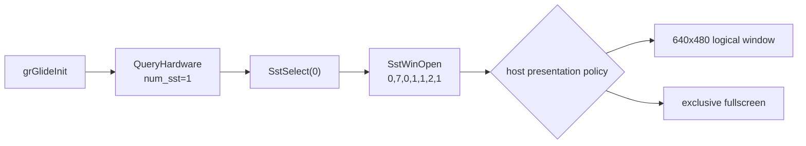
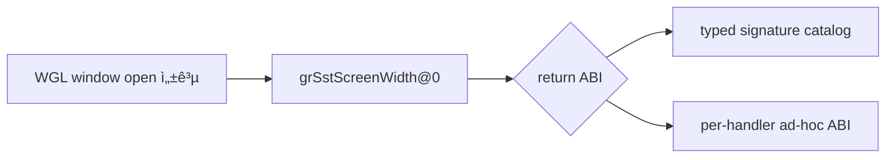
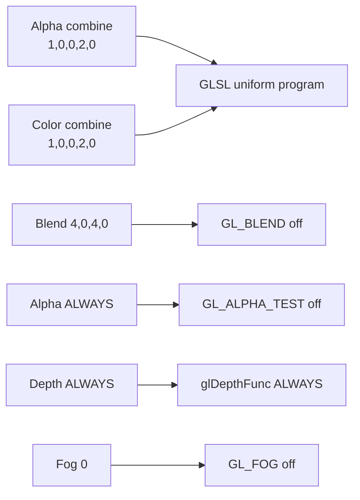
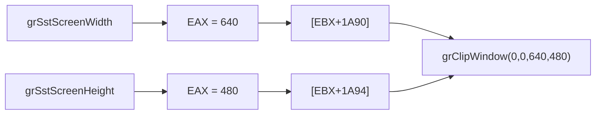
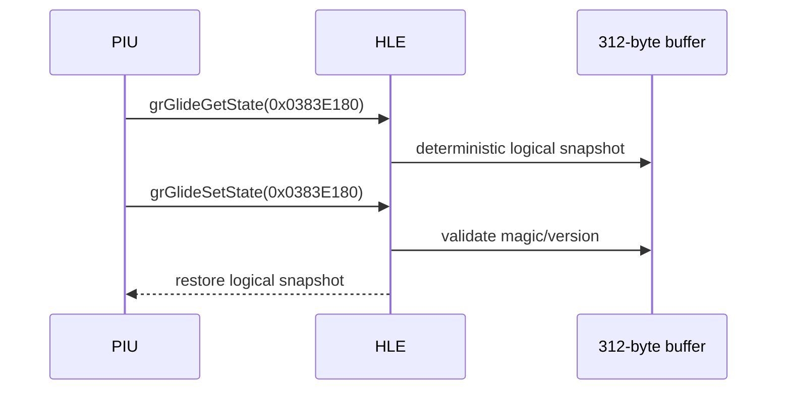
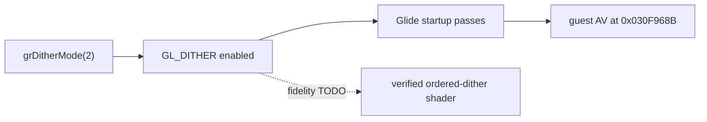

# Glide2x.ovl과 OpenGL HLE 분�

## 확�� 바�너리 구조

**확��.** 사용� asset `PIU/Glide2x.ovl`� MZ 뒤� LE image를 가진 80386 OS/2 module�니다. 현� LE parser로 3개 object, 78개 page, 3,419개 internal fixup� 해�할 수 �습니다. import module� 없습니다. 그러나 � 코드를 실행하면 �본 3Dfx 하드웨어·PCI·port I/O 경로까지 함께 요구하므로 host OpenGL 연��는 module 전체 실행보다 export facade가 �합합니다.

resident-name table�는 module �름 `glide2x`와 ordinal 1~172가 들어 �습니다. 주요 예는 다�과 같습니다.

| ordinal | decorated export | 확� 가능한 ABI |
|---:|---|---|
| 32 | `_GRGLIDEINIT@0` | �� 0바�트 |
| 38 | `_GRSSTSELECT@4` | �� 4바�트 |
| 73 | `_GRDRAWTRIANGLE@12` | �� 12바�트 |
| 85 | `_GRBUFFERSWAP@4` | �� 4바�트 |
| 112 | `_GRLFBLOCK@24` | �� 24바�트 |
| 118 | `_GRSSTWINOPEN@28` | �� 28바�트 |
| 138 | `_GRTEXSOURCE@16` | �� 16바�트 |
| 144 | `_GRTEXDOWNLOADMIPMAPLEVELPARTIAL@40` | �� 40바�트 |

`@N` suffix는 callee가 소비하는 �� byte 수를 제공하므로, `GETPROCADDR`가 요청� �름� resident-name table과 대�시키면 executable별 고정 주소 없� guest-callable trap ABI를 만들 수 �습니다. 실제 PIU가 요청하는 export 집합� 아� �� trace로 확정해야 합니다.

## 권� 연� 구조

```mermaid
flowchart LR
    PIU["�본 PIU x86"] --> LIN["LINEXE HLE<br/>LOADMODULE / GETPROCADDR"]
    LIN --> GATE["�� Glide trap gate<br/>name + ordinal + @N"]
    GATE --> ABI["guest ABI decoder"]
    ABI --> STATE["플�� 공용 Glide 2 state"]
    STATE --> CMD["render commands/resources"]
    CMD --> GL["Win32 OpenGL backend"]
    GL --> GPU["host GPU/window"]
```

`LINEXE_LOADMODULE("glide2x.ovl")`� OVL 코드를 실행하지 않고 검�� virtual module handle� 반환합니다. `LINEXE_GETPROCADDR`는 요청 �름 �는 ordinal� export metadata와 대조하고, 처� 요청� 함수� 안정�� 합성 far pointer를 할당합니다. pointer� trap� 서비스 id와 stack-byte count를 �함합니다. 실제 호출 시 dispatcher가 guest stack�서 ��를 복사하고 반환값과 callee stack cleanup� �본 ABI� �게 �용합니다.

Glide �태는 플�� 공용 계층�서 관리합니다. OpenGL backend는 다�� 담당합니다.

* `grSstWinOpen/Close`, `grBufferSwap`: host window, context, front/back buffer
* `grDrawTriangle`와 vertex list: `GrVertex`를 �어 vertex buffer와 draw command �성
* color/alpha/depth/fog/chroma/texture combine: Glide state key를 GLSL shader variant �는 uniform으로 변환
* texture download/source: 3Dfx texture-memory address를 virtual allocation으로 관리하고 OpenGL texture� upload
* `grLfbLock/Unlock`: guest arena� staging buffer를 제공하고 lock 방향� 따� framebuffer와 �기화
* query/status: �관� virtual Voodoo capability와 deterministic status 반환

OpenGL compatibility fixed-function 호출� �접 매핑하면 초기 prototype� 짧지만 Glide� color/alpha/texture combine� 정확� 표현하기 어렵고 OpenGL core/WebGL 확�� 막습니다. 플�� 공용 state translator와 shader 기반 backend가 �기 구조로 �합합니다. Khronos� 구� fixed-function 기능� core profile�서 제거�고 현대 구현�서는 shader로 대체�다고 설명합니다.

## 구현 순서와 검� 경계

1. `LOADMODULE` virtual handle과 `GETPROCADDR` 요청 trace만 구현합니다.
2. trace�서 실제 PIU export 집합, 호출 순서, stack/return ABI를 확정합니다.
3. init/query/window/clear/swap� 최소 backend로 첫 화면� 엽니다.
4. triangle, render state, texture 순으로 구현하여 frame hash와 screenshot� 비�합니다.
5. LFB, fog, gamma, movie helper처럼 실제 호출� 후순위 기능� 추가합니다.

OVL� GPL 계열 공개 source나 기존 Glide wrapper 구현� 코드로 복사·번역·��하지 않습니다. 명세, export metadata, PIU runtime trace를 �용한 clean-room 구현만 허용합니다.

## 외부 근거

* [3Dfx Glide 2.4 Programming Guide](https://www.bitsavers.org/components/3dfx/Glide_Programming_Guide_2.4_199707.pdf)
* [3Dfx Glide 2.0 API Reference](https://www.gamers.org/dEngine/xf3D/glide/glideref.htm)
* [Khronos OpenGL Registry](https://registry.khronos.org/OpenGL/index_gl.php)
* [Khronos OpenGL fixed-function pipeline 설명](https://wikis.khronos.org/opengl/Fixed_Function_Pipeline)
* [MAME machine record: Pump It Up 1st / Voodoo Banshee](https://arcade.vastheman.com/minimaws/machine/pumpit1)

# Glide2x.ovl and OpenGL HLE Analysis

The user-provided `Glide2x.ovl` is an MZ-bound 80386 LE module with three objects, 78 pages, 3,419 internal fixups, and no imported modules. Its resident-name table exposes 172 decorated exports. Suffixes such as `_GRSSTWINOPEN@28`, `_GRDRAWTRIANGLE@12`, and `_GRBUFFERSWAP@4` provide the callee argument-byte count needed for dynamic guest trap gates.

The recommended design treats the OVL as export metadata rather than executing its 3Dfx PCI and port-I/O implementation. LINEXE returns a virtual module handle, resolves requested names/ordinals to stable synthetic far pointers, and dispatches traps through a platform-neutral Glide 2 state machine. A Win32 OpenGL backend translates draw state, textures, buffers, LFB staging, and queries. A shader-based translator is preferred over direct legacy fixed-function calls because it can model Glide combine behavior and later support core OpenGL and WebGL backends.

Implementation should first trace the exact PIU export set and ABI, then add initialization/window/clear/swap, triangle rendering, state, textures, and finally LFB or other observed helpers. Existing GPL-family Glide implementations remain behavioral references only; implementation must be clean-room from published documentation, asset metadata, and runtime evidence.

## �� HLE frontier (2026-07-11)

**확��.** LE resident-name parser와 ordinal별 �� gate를 연결한 뒤 PIU� 초기 호출 순서는 다�과 같습니다.

1. `_GRGLIDEINIT@0`
2. `_GRSSTQUERYHARDWARE@4` — `GrHwConfiguration*`; `num_sst=1`만으로 통과
3. `_GRSSTSELECT@4` — board index `0`
4. `_GRSSTWINOPEN@28`

`GETPROCADDR` 출력� packed 16:16 pointer가 아니� `{32-bit linear address, 32-bit client CS}`�니다. PIU는 �를 �어 �신� code stub� `E9 rel32`로 self-patch한 뒤 gate로 jump합니다. gate� stack� `[return EIP, arguments...]`�고 decorated `@N`과 �치하는 callee cleanup� 필요합니다.

관찰� `grSstWinOpen` ��는 `hWnd=0`, resolution `7`, refresh `0`, color format `1`, origin `1`, color buffer `2`, auxiliary buffer `1`�니다. 다� 결정� 논리 640×480 surface를 windowed presentation으로 제공할지, �본� 가까운 exclusive fullscreen으로 제공할지�니다.

The dynamic path now confirms the startup sequence `grGlideInit`, `grSstQueryHardware`, `grSstSelect(0)`, and `grSstWinOpen`. `GETPROCADDR` returns an eight-byte `{linear address, client CS}` pair; PIU self-patches a near-jump stub to each synthetic gate. The observed open arguments are `0,7,0,1,1,2,1`. The next decision is windowed presentation of a 640×480 logical surface versus exclusive fullscreen.

## Windowed OpenGL 결과와 signature frontier

**확��.** 1번 정책으로 640×480 client window, double-buffered WGL context와 24-bit depth-capable pixel format� �성했습니다. `grSstWinOpen`� FXTRUE를 반환했고 다� export는 ordinal 39 `_GRSSTSCREENWIDTH@0`�니다.

� 함수는 ��가 없지만 반환값� x87 `ST(0)`� floating-point 값�니다. resident export� `@N` suffix는 stack cleanup �기만 제공하며 반환 type, pointer target 구조, enum �미를 제공하지 않습니다. 따�서 다� 구현 전�는 공� Glide 2 문서�서 파�한 명시� signature catalog를 유지할지, 개별 handler� ABI 지�� 분산할지 결정해야 합니다.

The windowed policy successfully creates a 640×480 client window and double-buffered WGL context with a depth-capable pixel format. The next export is ordinal 39 `_GRSSTSCREENWIDTH@0`, which returns a floating-point value in x87 `ST(0)`. Decorated `@N` metadata provides stack cleanup only, making a typed Glide 2 signature catalog versus scattered per-handler ABI knowledge the next architectural decision.

## Typed catalog �후 texture-memory frontier

**확��.** �진� typed catalog와 별� x87 context helper를 추가한 뒤 `grSstScreenWidth()`� `640.0f`, `grSstScreenHeight()`� `480.0f`가 정� 소비�습니다. �어서 `grTexMinAddress(GR_TMU0)`가 호출�고 0� 반환한 뒤 다� frontier는 ordinal 45 `_GRTEXMAXADDRESS@4`, �� TMU 0�니다.

`grTexMaxAddress`는 memory byte count가 아니� 가� �� 1×1 texture를 시�할 수 �는 마지막 8-byte aligned address�니다. PIU 1st hardware �료는 Voodoo Banshee를 지목하지만, virtual TMU address space를 standard 2 MiB 호환값으로 제한할지 4 MiB로 노출할지는 host OpenGL resource 정책과 guest texture allocator를 함께 결정합니다.

The incremental typed catalog and separate x87 context helper successfully return `640.0f` and `480.0f`. After `grTexMinAddress(GR_TMU0)` returns zero, the next frontier is ordinal 45 `_GRTEXMAXADDRESS@4`. This value is the last 8-byte-aligned start address for the smallest texture, not a byte count. The next decision is a conservative 2 MiB or expanded 4 MiB virtual TMU address space.

## 8 MiB TMU �후 초기 render state

**확��.** 선�� 8 MiB TMU는 `grTexMaxAddress(GR_TMU0)=0x007FFFF8`로 반환�습니다. �어지는 초기 �태 호출� 다�과 같습니다.

| API | �� | 처리 |
|---|---|---|
| `grColorMask` | `1,0` | RGB write on, alpha off |
| `grRenderBuffer` | `1` | OpenGL back buffer |
| `grDepthMask` | `1` | depth write on |
| `grDepthBufferMode` | `1` | Z-buffer mode |
| `grLfbWriteColorFormat` | `1` | 논리 LFB state� 보존 |

다� frontier는 `_GRALPHACOMBINE@20`�며 ��는 `1,0,0,2,0`�니다. � 시�부터 Glide combine equation� legacy OpenGL fixed-function state로 근사할지 shader variant/uniform으로 정확� 표현할지 결정해야 합니다.

The selected 8 MiB TMU returns `0x007FFFF8`. PIU then enables RGB-only writes, selects the back buffer, enables depth writes and Z-buffering, and stores LFB color format 1. The next frontier is `_GRALPHACOMBINE@20` with arguments `1,0,0,2,0`, requiring a shader-state versus legacy fixed-function mapping decision.

## GLSL combine과 초기 raster state / GLSL combine and initial raster state

GLSL 1.10 program� WGL context �명주기 안�서 한 번 compile/link하고, 관찰� alpha/color combine `1,0,0,2,0`� uniform으로 전달했습니다. � �� `LOCAL` iterated RGBA를 선�합니다. �어서 `grAlphaBlendFunction(4,0,4,0)`� `ONE,ZERO,ONE,ZERO`, alpha test와 depth compare� 값 `7`� `ALWAYS`, fog mode `0`� disabled로 확�했습니다. Blend �미와 비활성 기준 호출� [3dfx Glide Reference Manual 2.4](https://www.bitsavers.org/components/3dfx/Glide_Reference_Manual_2.4_199707.pdf)� `grAlphaBlendFunction` 정�를 따릅니다.

live telemetry� 마지막 ordinal과 다섯 stack argument를 추가한 결과 다� frontier는 ordinal 89 `_GRCLIPWINDOW@16`으로 확��습니다. 관찰 ��는 `(0,0,0x030FED90,0x030FED8B)`�며 뒤� � 값� 유효한 640×480 좌표가 아니� guest code 범위�니다. 호출 시�� 값 �성 경로 �는 import-stub/stack ABI를 역추�하기 전�는 scissor로 �용할 수 없습니다.

The WGL-owned GLSL 1.10 program is compiled and linked once, then receives the observed alpha/color combine `1,0,0,2,0` through uniforms. Both select local iterated RGBA. The following state resolves to `ONE,ZERO,ONE,ZERO` blending, `ALWAYS` alpha/depth comparisons, and disabled fog. Shared live telemetry identifies the next frontier as ordinal 89 `_GRCLIPWINDOW@16`; its observed `(0,0,0x030FED90,0x030FED8B)` contains guest-code addresses rather than valid 640×480 bounds, so no scissor mapping is applied pending producer/ABI tracing.

## Clip 좌표 ��과 반환 ABI 정정 / Clip Corruption and Return ABI Correction

위� x87 반환 결론� �후 �본 caller 역추�으로 반��습니다. return EIP `0x0304F7AF` �전 코드는 `[EBX+0x1A90]`, `[EBX+0x1A94]`를 push하며, 초기화 루틴� `grSstScreenWidth/Height` �후 EAX를 � 필드� 저�합니다.

기존 HLE는 x87만 갱신하여 EAX� import stub 주소를 남겼습니다. typed return� `UInt32/EAX`로 정정하� 좌표가 `(0,0,0x280,0x1E0)`으로 복��습니다. 전체 clip� OpenGL viewport/scissor로 �용하고 cull mode 0� 통과한 뒤 다� frontier는 `_GRGLIDEGETSTATE@4`, 출력 ��터 `0x0383E180`�니다.

The earlier x87 conclusion was disproved by tracing the original caller. It stores EAX directly into integer width/height fields and later passes them to `grClipWindow`. Correcting the typed return to integer `UInt32/EAX` restored `(0,0,640,480)`. Full-window viewport/scissor and disabled culling then advance execution to `_GRGLIDEGETSTATE@4` with output pointer `0x0383E180`.

## Opaque Glide2 state round-trip

[Glide 2.4 reference manual](https://www.bitsavers.org/components/3dfx/Glide_Reference_Manual_2.4_199707.pdf)� `GrState`를 공개 필드가 없는 Get/Set �으로 정�합니다. [Glide 3.0 programming guide](https://www.bitsavers.org/components/3dfx/Glide_Programming_Guide_3.0_199806.pdf)는 �후 API�서 `GR_GLIDE_STATE_SIZE` 질�를 사용하�� 설명합니다. [공개 호환 구현� 312바�트 Glide2 관찰](https://www.zeus-software.com/forum/viewtopic.php?start=10&t=2232)� PIU allocation 간격 336바�트와 �차 확��습니다. [DOS/32A 공� 저�소](https://github.com/amindlost/dos32a)�서는 Glide state 관련 근거를 찾지 못했으며 DOS runtime 호환성만으로 그�픽 API private layout� 추론하지 않습니다.

�� ��터 Get/Set 사�� 다른 Glide gate나 �접 blob 접근� 관찰�지 않았습니다. round-trip 통과 후 다� frontier는 `_GRDITHERMODE@4(2)`�니다.

The public 312-byte Glide2 candidate is corroborated by PIU's 336-byte allocation gap. PIU performs an immediate same-pointer Get/Set round-trip without observed direct access, allowing an independent deterministic state image rather than reproducing a private vendor layout. DOS/32A contains no relevant Glide-state evidence. The next frontier is `_GRDITHERMODE@4(2)`.

## Host dithering 1단계 / Host Dithering Stage 1

**확��:** `_GRDITHERMODE@4(2)`를 `GL_DITHER` 활성화로 처리하고 mode를 logical state와 state-image version 2� 보존했습니다. 호출 �후 미구현 Glide gate가 아니� �본 guest `EIP=0x030F968B` 접근 위반까지 진행했습니다. 따�서 host dither 연결� 현� startup 경로를 통과합니다.

**TODO:** 현대 32-bit OpenGL framebuffer� `GL_DITHER`는 Voodoo� 16-bit ordered dithering과 픽셀 ��성� 보�하지 않습니다. mode-2 matrix, PIU color quantization, reference capture를 확보한 뒤 GLSL ordered dithering으로 �체하거나 선� 가능하게 만들어야 합니다.

**Confirmed:** `_GRDITHERMODE@4(2)` enables `GL_DITHER` and persists mode 2 in logical state and state-image version 2. Execution passes the Glide startup path and later reaches a guest access violation at `0x030F968B`, not an unimplemented Glide gate. Exact Voodoo ordered dithering remains a GLSL fidelity TODO requiring matrix, quantization, and reference-capture evidence.

### `grTexMaxAddress` ¼ `grTexMinAddress` ¤ÂİĞ ABI P­È
\ÍÍ PIU Œ¬„Ç äÂ‰Õ Ó|ÇXÇ „½Á °¬ü¬ `_GRTEXMAXADDRESS@4` ¼ `_GRTEXMINADDRESS@4` 8ÖœÍ ü¬ÈĞÅÁ ÆxÆ è¸Õ(`0xC0000005`)¬ ­0Ì´ÈŵÂȲä². 
ĞÆxÇ@Ç Glide 2.x API¬ tÇ hÕÂä´DÇ `stdcall` Ó|·ø»0Ñ 4¼tÇ¸Ò Ȭ¹ÖİÂ<Ç\¸ ÈXÇXÕଠˆÇ<ǘ°, Œ¬„Ç TÏÜ´”² `cdecl` )¼İ 9Ö@Ç ¸ÀɤÂ0Ñ Ó|·ø»0Ñ 8ÖœÍ Ü­}ÅDÇ ¬À©ÆXÕìÅ ¤ÂİĞĞÅ xÇ�Ç|¹ ¼´Å#±ÀÉ JÅà¬(PUSH XÕÀÉ JÅLÇ) 8ÖœÍXÕ0® Lµ8»…ÇȲä². 
HLE ˜Ì¬¹€½ĞÅÁ Ü­}ÅĞÅ ޹°Í `ESP += 8`(¼XÖ üÈŒÁ 4 + xÇ�Ç 4)DÇ Ȭ¹XÕX³ €½„½DÇ `ESP += 4`(¼XÖ üÈŒÁ 4)̹ Ȭ¹XÕij]¸ ÂÈhÕ<Ç\¸hÃ, 
ä²LÇ HLE ”Æ­Ì ÜÂ(`_GRCLIPWINDOW@16`) ¼İÀXÕ”² xÇ�Ç $ÆÈ,¸(misalignment)ü¬ ˜Ç»º´ Return Point \¸XÇ „½0®|¹ )¼ÀɈյÂȲä².

