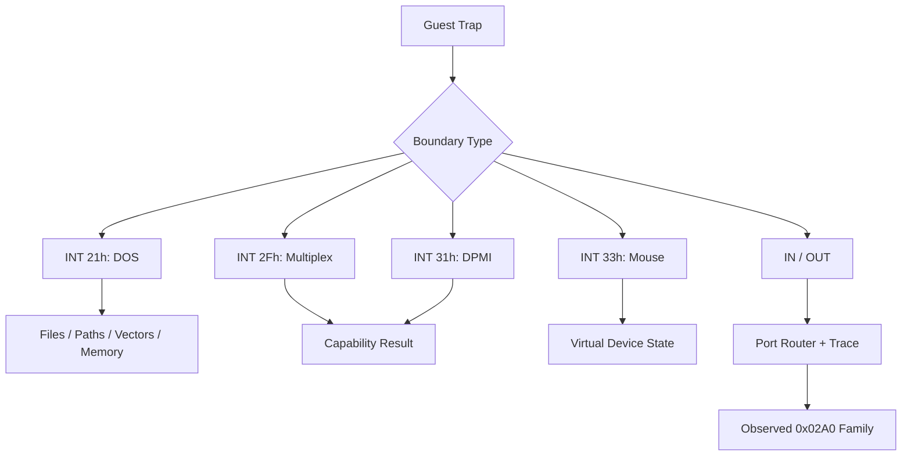

# Interrupt와 port I/O 관찰



## 확인된 software interrupt

* `INT 21h`: DOS version, path, file, IOCTL, resize, vector, system time service
* `INT 2Fh AX=1686h`: protected-mode/DPMI 환경 확인 경로
* `INT 31h AX=0400h`: DPMI version/capability 확인 경로
* `INT 33h AX=0000h`: mouse driver reset/presence 확인

각 service는 관찰된 register contract만 구현하며, 알 수 없는 subfunction을 성공으로 위장하지 않는다.

## Interrupt vector

`INT 21h AH=35h` get vector와 `AH=25h` set vector가 관찰되었다. 현재는 guest가 기대하는 vector state를 HLE table로 보존하며 실제 Win32 IDT를 수정하지 않는다.

## Port I/O

privileged `IN`/`OUT`은 Win32 user mode에서 직접 실행할 수 없다. port router와 trace buffer를 두고 관찰된 `0x02A0` 계열 초기화만 제한적으로 분류했다. 장치 의미가 확정되지 않은 port는 일반 성공으로 처리하지 않는다.

## 미확정

`0x02A0` 계열 장치의 정확한 하드웨어 역할과 read/write state machine은 추가 trace가 필요하다.

## 2026-07-26 Task 297: INT 8 타이머 주입 IF 게이트

**확인됨 (구현):** 선점형 경로와 VEH 경로는 이제 실제 게스트 `EFlags.IF`
(`0x00000200`)가 설정된 경우에만 INT 8 IRET 프레임을 게스트 스택에 기록한다. IF=0이면
`timer_interrupt_pending`을 소비하지 않고 최대 한 건으로 합쳐 보류한다. 주입 진입 시에는
기존과 같이 IF/TF를 지우며, CLI/STI 에뮬레이션과 두 주입 경로가 공용
`kEFlagsInterruptEnable` 상수를 사용한다. 따라서 ISR이 IF=0으로 실행되는 동안 같은 경로의
재주입이 차단되고, IRET 또는 STI로 IF가 다시 설정된 뒤에만 보류된 틱을 전달할 수 있다.

**확인됨 (25초 격리 실행):** `aot-dbt`, `REPIU_TIMER_INJECT_LOG=1` 조건에서 INT 8 주입
37회, 진행도 13,133, Glide 게이트 `84/84`, 창 생성 `1/640x480`을 기록하고 정상 타임아웃했다.
예외 포착과 malformed exception dispatch는 모두 0이었다. 주입 프레임은 깊은 호출 구간의
`0x035D6834`까지 내려간 뒤 `0x035D6DA4` 부근으로 복귀했으며, 수정 전의 지속적인 단조 하강
패턴은 관찰되지 않았다. 격리 EEPROM 해시는 원본 fixture와 일치했다.

**미확정:** 이 단일 25초 실행은 장시간·비결정적이던 296류 크래시 전체가 소멸했음을 증명하지
않는다. 다만 IF 게이트의 정적 순서, 스택 복귀 로그, gate 84 진행은 대상 결함과 busy-wait
회귀가 이 검증 범위에서 없음을 뒷받침한다. 명시적 in-flight 플래그는 중첩이 다시 관찰될
때만 추가한다.

# Interrupt and Port-I/O Observations

Observed software interrupts include DOS `INT 21h`, `INT 2Fh AX=1686h`, `INT 31h AX=0400h`, and mouse reset `INT 33h AX=0000h`. Only observed register contracts are emulated. DOS vector services are stored in guest HLE state and never modify the Win32 IDT.

Privileged port I/O is routed through a traceable HLE layer. Only the observed `0x02A0` initialization family is classified; the exact device and state machine remain unresolved.

## 2026-07-26 Task 297: INT 8 timer-injection IF gate

**Confirmed (implementation):** Both the preemptive and VEH paths now write an INT 8 IRET frame only
when the real guest `EFlags.IF` bit (`0x00000200`) is set. With IF clear, the paths preserve one
coalesced `timer_interrupt_pending` request. Injection still clears IF/TF on entry, while CLI/STI and
both injection paths share `kEFlagsInterruptEnable`. This blocks re-injection while the ISR runs with
IF clear and permits deferred delivery only after IRET or STI enables interrupts again.

**Confirmed (isolated 25-second run):** An `aot-dbt` run with `REPIU_TIMER_INJECT_LOG=1` recorded 37
INT 8 injections, progress 13,133, 84/84 Glide gates, and one 640x480 window before a clean timeout.
Caught exceptions and malformed exception dispatches were both zero. The injection frame descended to
`0x035D6834` during a deeper call and then returned near `0x035D6DA4`; the former continuously
descending pattern did not recur. The isolated EEPROM hash matched the fixture.

**Unresolved:** One 25-second run does not prove that every long-running, nondeterministic Task-296-era
crash is gone. It does show that the targeted nesting pattern and busy-wait regression are absent in
this verification window. Add an explicit in-flight guard only if nesting is observed again.

## 2026-07-26 Task 299: 선점 주입의 12바이트 frame 누수

**확인됨 (장기 로그):** Task 297 이후 약 29초 실행에서 guest `RET 0x030D8BB2`의
`[ESP]`는 `0x43F00000`(`480.0f`)이고, 정상 반환주소 `0x030F2739`는 정확히
`[ESP+12]`에 남았습니다. 호출자는 `0x030F2734: call 0x030D8B84`이며, wrapper의
`call [edx+0x2C4]; add esp,8; ret`와 실제 대상 `0x03062560`의 `ret 8`은 정적으로
균형이 맞습니다. 따라서 실패의 ESP 차이는 ABI 선언 오류가 아니라 **INT 8 IRET frame
한 개와 같은 12바이트**입니다. 종료 직전 마지막 타이머 사건도 선점 주입이었습니다.

**설계 결론:** IF 게이트는 중첩을 막았지만 poll thread가 중지된 guest의 stack/EIP를
직접 바꾸는 경로는 제거해야 합니다. poll thread는 pending을 세우고 TF만 arm하며, 실제
frame 작성과 ISR 전환은 다음 `EXCEPTION_SINGLE_STEP`의 guest-thread VEH 문맥에서 기존
공통 주입기로 수행합니다. 원본 ISR과 `IRETD`는 계속 주 실행 경로입니다.

**미확정:** frame이 직접 `SetThreadContext` 전환, AOT cache 재개 상태, 또는 둘의
상호작용 중 어느 지점에서 최종적으로 누수됐는지는 기존 로그만으로 더 세분할 수 없습니다.
VEH rendezvous 검증은 직접 poll-thread frame write를 제거했을 때 같은 `ESP-12` 형태가
사라지는지로 판정합니다.

## 2026-07-26 Task 299: 12-byte preemptive-frame leak

**Confirmed (long-run log):** After Task 297, a run ended with guest
`RET 0x030D8BB2` reading `0x43F00000` (`480.0f`) at `[ESP]`, while the correct
return `0x030F2739` remained exactly at `[ESP+12]`. The static caller,
wrapper, and indirect callee have a balanced `call`, `add esp,8`, and `ret 8`
contract. The displacement therefore matches one 12-byte INT 8 IRET frame,
not an ABI declaration error. The final timer event was also preemptive.

**Design conclusion:** Keep tick detection on the poll thread, but arm TF only.
Create the frame and enter the ISR through the existing injector on the guest
thread's next VEH single-step boundary. The original ISR and `IRETD` remain
the execution path.

**Unresolved:** The old log cannot separate whether direct
`SetThreadContext`, AOT-cache resumption, or their interaction caused the
final leak. Verification will test whether removing all poll-thread frame
writes eliminates the exact `ESP-12` shape.

**확인됨 (Task 299 검증):** 45초 격리 `aot-dbt` 실행에서 TF arm과 VEH wakeup이
3/3으로 대응했고 poll-thread 직접 frame write는 0건이었습니다. 이전 약 29초 실패
지점을 넘어 정상 timeout했으며 exception/malformed/non-guest return fallback은 모두
0건, INT 8 chain HLE는 333건, Glide gate는 2,212/2,212였습니다.

**Confirmed (Task 299 verification):** A 45-second isolated `aot-dbt` run
matched 3 TF arms to 3 VEH wakeups with zero direct poll-thread frame writes.
It passed the prior roughly 29-second failure point and timed out normally
with zero caught/malformed/non-guest-return failures, 333 INT 8 chain
completions, and 2,212/2,212 Glide gates.

## MSCDEX probe confirmed on 2026-07-12

The guest directly calls `INT 2Fh AX=1500h` to query the MSCDEX drive count, then uses DPMI `INT 31h AX=0300h, BL=2Fh` with a real-mode frame whose AX is `1510h`. The current minimal environment reports no CD-ROM drives (`BX=CX=0`) and rejects the device request with frame `AX=000Fh`, CF set. The outer DPMI call itself succeeds with CF clear.

## 2026-07-26 Task 301: 강제 TF 제거 / Remove forced TF wakeup

**확인됨:** Task 299의 TF rendezvous는 기존 12바이트 frame 누수를 없앴지만 장시간 실행
세 번에서 poll arm 직후 미처리 `0x80000004`로 프로세스를 종료했습니다. 마지막 guest
EIP와 무관하게 Windows fault 주소는 세 번 모두 `0x6FAC40B1`이었습니다.

**전달 정책:** poll thread는 DOS tick과 coalesced pending만 갱신합니다. guest thread의 기존
single-step VEH가 HLE/AOT 상태를 guest 경계로 복원한 뒤, native fast path 또는 linear span을
다시 시작하기 전에 pending INT 8을 전달합니다. 원본 ISR, `IRETD`, IF gate는 유지합니다.

**Confirmed and policy:** Task 299 removed the 12-byte frame leak, but three
long runs ended with an unhandled `0x80000004` immediately after a poll-thread
TF arm. The Windows fault address was `0x6FAC40B1` in all three runs despite
different guest EIPs. The poll thread now updates only the DOS tick and
coalesced pending flag. Existing guest-thread single-step VEH boundaries
deliver pending INT 8 after HLE/AOT reconciliation and before native re-entry,
while preserving the original ISR, `IRETD`, and IF gate.

**검증됨:** 150초 격리 실행에서 강제 TF arm은 0건이었고 자연 VEH 경계가 INT 8
2,283건을 모두 chain HLE까지 완료했습니다. progress 129,810과 Glide gate
13,932/13,932가 계속 증가했으며 exception/malformed/새 APPCRASH는 0건이었습니다.

**Verified:** In the isolated 150-second run, forced TF arms remained zero
while natural VEH boundaries delivered all 2,283 INT 8 requests through chain
HLE. Progress reached 129,810 and Glide gates 13,932/13,932, with zero caught
exception, malformed dispatch, or new APPCRASH.

## 2026-07-29 Task 348: AOT back-edge 타이머 rendezvous

**확인됨 (실패 원인):** 입력 재현 로그에서 약 37.4초 이후 heartbeat/dispatch/progress가
고정됐고, `0x0302FA08..0x0302FA10`의 tick 대기 루프는 전역
`0x032D9C84`가 1인 상태로 반복됐습니다. 원본 INT 8 ISR의 `0x03042F36`만 이 값을
증가시키지만, 순수 AOT back edge 안에는 두 번째 pending 틱을 전달할 자연 VEH 경계가
없었습니다.

**확인됨 (구현):** `aot-dbt` emitter는 direct/conditional back edge 앞에 flags 보존
request guard를 생성합니다. poll thread는 55ms 틱마다 placement 소유 request word만
설정하고, guest thread가 등록된 `INT3`에 도달하면 request를 지운 뒤 기존 공용
`InjectPendingInterrupts`를 호출합니다. Win32 breakpoint 컨텍스트는 이 소유 sentinel에서
EIP를 `ExceptionAddress + 1`로 명시적으로 옮겨야 합니다. 이를 생략한 첫 검증에서는 같은
`INT3`를 1.2초 동안 134,721회 다시 실행했고, 수정 후 5초 smoke에서는 50회로 정상화됐습니다.

**검증됨:** 입력을 포함한 50초 `aot-dbt` 실행에서 heartbeat는 37초 261,280에서
50초 278,446으로, dispatch는 130,640에서 139,223으로 계속 증가했습니다. 종료 카운터는
safe-point trap/injected/deferred `518/452/66`, original fatal 0이었습니다. 이는 이전
37.4초 무경계 정지를 통과하면서도 poll-thread TF/context/stack 변경을 복구하지 않았음을
확인합니다.

## 2026-07-29 Task 348: AOT back-edge timer rendezvous

**Confirmed (cause):** The interactive log froze heartbeat, dispatch, and progress after about
37.4 seconds. The tick wait at `0x0302FA08..0x0302FA10` repeated with global
`0x032D9C84` fixed at 1. Only the original INT 8 ISR at `0x03042F36` increments it, while
the pure AOT back edge had no natural VEH boundary for the second pending tick.

**Confirmed (implementation):** The `aot-dbt` emitter places a flag-preserving request guard
before direct and conditional back edges. The poll thread only sets a placement-owned request
word on each 55ms tick. The guest thread reaches the registered `INT3`, clears the request,
and invokes the existing common injector. For this owned Win32 breakpoint sentinel, VEH must
explicitly resume at `ExceptionAddress + 1`. Omitting that step retrapped 134,721 times in
1.2 seconds; after the correction, a five-second smoke run recorded the expected 50 traps.

**Verified:** In the 50-second interactive `aot-dbt` run, heartbeat continued from 261,280 at
37 seconds to 278,446 at 50 seconds, and dispatch from 130,640 to 139,223. Final safe-point
trap/injected/deferred counts were `518/452/66`, with zero original fatal events. The previous
boundary-free freeze was passed without restoring poll-thread TF, context edits, or stack writes.

## 2026-07-29 Task 349: PIT 채널 0 주기 확인

**확인됨 (원본 바이너리):** `PIU.EXE`는 `0x030250C0`과 `0x0302559C`에서
`EAX=240`으로 `0x030430B0`을 호출합니다. 하위 함수는 데이터 상수
`1,193,280.0f`를 요청값으로 나눠 reload `4,972`를 만들고, 제어 포트 `0x43`에
`0x36`, 채널 0 포트 `0x40`에 low/high `0x6C`, `0x13`을 기록합니다. 따라서
게임이 의도한 IRQ0는 정확히 `240Hz`입니다.

**확인됨 (기존 HLE 원인):** Win32 폴러는 IRQ0와 BDA `0x46C`를 같은
`elapsed / 55ms` 값으로 처리했고, 포트 `0x43`/`0x40`은
`unsupported-ignored` 뒤 공유 `OUT DX,AL` helper를 NOP으로 바꿨습니다. 원본의
240Hz 설정은 반영되지 않았고 두 tick 대기는 약 `8.33ms` 대신 명목상
`110ms`가 됐습니다.

**확인됨 (수정):** 공용 PIT HLE가 완성된 reload를 원자 snapshot으로 게시하고,
Win32 scheduler가 단조 증가 시간에서 `1,193,280 / divisor`로 IRQ 만료를
계산합니다. BDA tick은 기본 divisor `65,536`으로 분리했습니다. PIT 출력과
PIC EOI는 공유 helper를 보존하기 위해 NOP patch 없이 EIP만 전진합니다.
IF gate, pending 한 건 병합, guest-thread safe point, 원본 ISR/IRETD는 유지됩니다.

**검증됨:** 공용 probe는 divisor `4,972`, `240Hz`와 약 `4.167ms` cadence를
통과했습니다. 실제 50초 `aot-dbt` 실행은
`[repiu-pit] channel=0 divisor=4972 frequency=240.000000Hz generation=2`를
기록했고, 종료까지 heartbeat/dispatch/progress 증가, Glide
open/texture/draw/swap 도달, fatal 0을 유지했습니다.

## 2026-07-29 Task 349: PIT channel-0 cadence

**Confirmed (original binary):** `PIU.EXE` calls `0x030430B0` with
`EAX=240` at `0x030250C0` and `0x0302559C`. The callee divides its
`1,193,280.0f` reference by the requested rate, producing reload `4,972`,
then writes control `0x36` to port `0x43` and low/high `0x6C`, `0x13` to
port `0x40`. The intended IRQ0 rate is exactly `240Hz`.

**Confirmed (old HLE cause):** The Win32 poller tied IRQ0 and BDA `0x46C` to
the same `elapsed / 55ms` counter. Ports `0x43`/`0x40` fell through
`unsupported-ignored` and NOP-patched the shared `OUT DX,AL` helper. The
240Hz programming was lost, stretching a nominal two-tick wait from about
`8.33ms` to `110ms`.

**Confirmed (fix):** Shared PIT HLE publishes complete reloads atomically,
and the Win32 scheduler computes expirations from monotonic time using
`1,193,280 / divisor`. BDA time is separately derived with divisor `65,536`.
PIT output and PIC EOI preserve the shared helper by advancing EIP without a
NOP patch. Existing IF gating, one-request pending coalescing, guest-thread
safe points, and the original ISR/IRETD path remain in force.

**Verified:** The shared probe passed divisor `4,972`, `240Hz`, and the
approximately `4.167ms` cadence. A real 50-second `aot-dbt` run logged the
exact configuration, continuously advanced heartbeat/dispatch/progress,
reached Glide open/texture/draw/swap, and retained zero fatal events.

## 2026-07-29 Task 347: 현재 성능 축의 타이머 비중

**확인됨:** 현재 Release 60초 3회 모두 divisor `4,972`, `240Hz`를 기록했습니다.
타이머 safe-point trap은 5,535~5,539회(중앙값 5,537)이며 전체 breakpoint의
2.78~2.86%(중앙값 2.83%)입니다. 따라서 Task 348 safe point는 현재 breakpoint
인구의 지배 원인이 아닙니다.

새 same-machine 교정값과 현재 예외 census로 유도한 전체 커널 전이 비중은
6.74~6.92%(중앙값 6.83%)입니다. TF/VEH 제거는 Task 336 시기의 27.7~30.4% 후보에서
현재 우선순위 밖으로 내려갑니다. 이 값은 합성 전이 가격을 곱한 추정입니다.

## 2026-07-29 Task 347: Timer share on the current performance axis

**Confirmed:** All three current 60-second Release runs recorded divisor `4,972`
and `240Hz`. Timer-safe-point traps ranged from 5,535 to 5,539 (median 5,537),
only 2.78-2.86% of breakpoints (median 2.83%). Task 348 safe points therefore
do not dominate the current breakpoint population.

Applying the refreshed same-machine calibration to the current census puts all
kernel transitions at 6.74-6.92% of wall clock (median 6.83%). TF/VEH removal
falls from Task 336's 27.7-30.4% candidate range to a lower current priority.
The figure remains an estimate derived from synthetic transition prices.

## 2026-07-29 Task 351: timer safe-point source와 소비 tick

**확인됨 (전달 계측):** `REPIU_AOT_TIMER_SOURCE_PROFILE=1`은 initial placement와
dynamic append의 timer-safe-point breakpoint offset을 원본 guest back-edge source에
연결합니다. scheduler가 만료 PIT tick을 별도 atomic ledger에 누적하고 공용
`InjectPendingInterrupts`가 성공한 모든 경로에서 이를 소비합니다. natural VEH 주입은
ledger만 정리하며, safe-point handler는 자기 호출이 실제 소비한 tick만 source에
귀속합니다. deferred trap은 tick을 소비하지 않습니다.

고정 1,024-entry profile은 source별 trap/injected/deferred, 귀속 tick, 최초/최종
global tick을 VEH에서 할당이나 lock 없이 기록합니다. Release 60초 세 번에서
entry는 99/94/106개, overflow는 모두 0, 전체 귀속 tick은 5,658/5,674/5,638개였습니다.
이는 interrupt delivery context의 완전한 합이며 tick 주기 환산 중앙값 23.575초를
그대로 pacing으로 해석하지 않습니다.

**확인됨 (원본 wait):** `0x0303DE89`는 source별 1,414/1,416/1,430 tick을 소비했습니다.
원본 loop는 `0x0304318F`를 호출해 `0x032D9C80`을 읽고 2와 비교한 뒤
`0x0303DE81`로 돌아갑니다. INT 8 ISR의 `0x03042F3C`가 이 전역을 증가시키므로
정적 tick 의존성이 확인됩니다. 중앙값 1,416 tick은 divisor 4,972에서 5.900초,
wall-clock 9.83%의 pacing 상한입니다. Task 348의 `0x0302FA10`/`0x032D9C84`
wait는 이번 정상 60초 route의 source 합집합에 나타나지 않았습니다.

## 2026-07-29 Task 351: Timer-safe-point sources and consumed ticks

**Confirmed (delivery accounting):** With
`REPIU_AOT_TIMER_SOURCE_PROFILE=1`, initial placement and dynamic append map
each timer-safe-point breakpoint offset to its exact original guest back-edge
source. The scheduler accumulates expired PIT ticks in a separate atomic
ledger, and every successful common `InjectPendingInterrupts` path consumes
that ledger. Natural VEH injection clears it without attribution; the
safe-point handler attributes only ticks consumed by its own injector call.
Deferred traps consume none.

The fixed 1,024-entry profile records per-source trap/injected/deferred counts,
attributed ticks, and first/last global tick without allocation or locks in
VEH. Three 60-second Release runs recorded 99/94/106 entries, zero overflow,
and 5,658/5,674/5,638 total attributed ticks. Those totals completely describe
delivery contexts; their median 23.575-second period conversion is not itself
pacing time.

**Confirmed (original wait):** Source `0x0303DE89` consumed
1,414/1,416/1,430 ticks. The original loop calls `0x0304318F` to read
`0x032D9C80`, compares the result with two, and branches back to
`0x0303DE81`. The original INT 8 ISR increments that global at `0x03042F3C`.
The median 1,416 ticks therefore give a conservative pacing upper bound of
5.900 seconds, or 9.83% of wall clock at divisor 4,972. Task 348's former
`0x0302FA10`/`0x032D9C84` wait did not occur in the source union of this normal
60-second route.

## 2026-07-30 Task 366: INT 8 전달 결손과 프레임 pacing 기각

**확인됨: guest가 프로그램한 timer tick의 11.9%가 도달하지 않습니다.** Release 60초
3회에서 전달률(`injected/due`)은 78.5/88.1/88.2%, 중앙값 **88.1%** 입니다. guest는
divisor 4972 = 240Hz를 프로그램했고, schedule이 계산한 due는 216.9~219.4Hz(부팅 초반
저주파 구간이 평균을 낮춤), 실제 주입은 193.3~199.2Hz입니다.

**기전(코드 감사로 확정):** `PitIrqSchedule::Poll`은 catch-up 방식이라 밀린 tick 수를
정확히 돌려줍니다. 그러나 `timer_interrupt_pending`이 `std::atomic<bool>`이므로
due가 3이든 10이든 `InjectPendingInterrupts`는 `INT 8`을 **한 번만** 주입하고 flag를
내립니다. 나머지는 영구 손실입니다. `port_io_emulator.cpp`의 주석
"IRQ0 delivery is already coalesced by `timer_interrupt_pending`"이 이 설계가
의도적이었음을 확인해 줍니다.

실기 8259도 IRQ 라인당 pending 비트가 하나뿐이라 coalescing 자체는 하드웨어적으로
틀리지 않습니다. 다른 것은 **원인**입니다. 실기에서는 게임이 충분히 빨라 드물었고,
여기서는 상시 발생합니다.

**항등식:** `due == injected + coalesced + dropped + remaining`이 6회 실행 모두 정확히
성립했습니다(예: `13,162 = 11,597 + 1,466 + 99 + 0`).

**기각됨: 프레임은 tick 전달에 gated되지 않습니다.** 상한 있는 backlog로 전달률을
88.1% → 91.8%로 올리자 프레임 중앙값이 `1,400 → 1,171`(**-16.36%**)로 떨어졌습니다.
3회 범위는 1,179~1,438 대 1,151~1,175로 겹치지 않습니다. 프레임당 tick은 8.06~8.67에서
10.17~10.30으로 늘었는데 프레임이 줄었으므로 tick과 프레임의 관계는 인과가 아닙니다.

**확인됨(회귀의 진짜 원인은 주입이 아닙니다):** 밀린 tick이 남아 있으면
`timer_interrupt_pending`이 계속 서 있고 `ArmAotTimerSafePoint`가 사실상 상시
활성이 됩니다.

| 지표 | backlog OFF | backlog ON | 변화 |
|---|---:|---:|---:|
| timer safe-point trap | 5,375 | 6,454 | **+20.1%** |
| breakpoint 중 timer trap 비중 | 2.53% | 3.34% | +0.81%p |
| 프레임당 예외 | 308.4 | 329.4 | **+6.8%** |

즉 비싼 것은 tick을 더 주는 것이 아니라 **safe point를 계속 켜 두는 것**입니다.

**확인됨(T3):** backlog가 상한 64에 계속 붙고 1,029~1,076개가 폐기됐습니다. 호스트가
240Hz를 따라잡지 못합니다.

**미확정:** 손실 11.9%가 스텝-음악 어긋남을 만드는지. 게임의 스텝 타이밍이 `INT 8`
횟수에서 오는지 Task 350이 전달하는 CD 재생 위치에서 오는지 확인해야 판단할 수
있습니다. safe point 상시 arming의 단독 비용도 귀속되지 않았습니다.

[작업 로그](../work-logs/20260730-366-timer-tick-delivery-and-frame-pacing.md)

## 2026-07-30 Task 366: INT 8 delivery shortfall and the rejected pacing hypothesis

**Confirmed:** 11.9% of the timer ticks the guest programmed never reach it.
Delivery (`injected/due`) measured 78.5/88.1/88.2% across three 60-second Release
runs, a median of 88.1%. The guest programmed divisor 4972 — 240 Hz — the schedule
owed 216.9-219.4 Hz once the low-frequency boot period is averaged in, and
193.3-199.2 Hz was actually injected.

**Mechanism, from code audit:** `PitIrqSchedule::Poll` is a catch-up scheduler
returning the exact owed count, but `timer_interrupt_pending` is an
`std::atomic<bool>`, so `InjectPendingInterrupts` pushes one `INT 8` and clears the
flag whether three or ten were owed. The remainder is lost permanently, and the
comment in `port_io_emulator.cpp` confirms the coalescing was deliberate. A real
8259 also has one pending bit per IRQ line, so coalescing is not itself wrong;
what differs is the cause, since on original hardware the game was fast enough for
it to be rare and here it is constant. The partition identity
`due == injected + coalesced + dropped + remaining` held exactly in all six runs.

**Rejected: frame rate is not gated by tick delivery.** A bounded backlog raised
delivery from 88.1% to 91.8% and moved median frames from 1,400 to 1,171
(-16.36%), with non-overlapping ranges, while ticks per frame rose from 8.06-8.67
to 10.17-10.30 — so the relationship was not causal.

**Confirmed:** the regression is not the extra injections. An outstanding owed tick
keeps `timer_interrupt_pending` set, which keeps `ArmAotTimerSafePoint` effectively
always active: timer safe-point traps rose 20.1%, their share of breakpoints from
2.53% to 3.34%, and exceptions per frame 6.8%. Holding the safe point armed is the
cost. The backlog also pinned at its cap of 64 with 1,029-1,076 ticks dropped, so
the host cannot sustain 240 Hz.

**Unresolved:** whether the 11.9% loss desynchronises steps from music, which
requires knowing whether step timing derives from `INT 8` count or the CD playback
position; and what continuous safe-point arming costs on its own.

**해소됨 (사용자 관측, 2026-07-30):** 게임 타이밍의 근거는 **CD 재생 위치**입니다.
CD 재생 위치가 없을 때 노트가 아예 움직이지 않는 것이 과거에 관측됐고, 이것이 Task 350이
실제 재생 위치 전달을 구현한 배경입니다. 따라서 노트 진행은 `INT 8` 횟수가 아니라 CD
위치에 종속되며, **위 tick 손실 11.9%가 스텝-음악 어긋남의 주원인일 가능성은 낮습니다.**
손실 자체는 확정 사실로 유지하되 리듬 정확성 우선순위는 내립니다. `INT 8`이 관여하는
다른 항목(입력 polling 주기, 애니메이션, 내부 timeout)의 영향은 미측정입니다. 이 항목의
근거는 사용자 관측이며 Task 366에서 재측정하지 않았습니다.

**Resolved (user observation, 2026-07-30):** game timing derives from the **CD
playback position**. Notes did not move at all when the playback position was
absent, which is what motivated Task 350's real-position delivery. Note progression
therefore depends on CD position rather than `INT 8` count, so the 11.9% tick loss
above is unlikely to be a principal cause of step-to-music drift; the loss stays a
confirmed fact but rhythm accuracy drops in priority. Effects on other
`INT 8`-driven items — input polling cadence, animation, internal timeouts — remain
unmeasured. This rests on user observation and was not re-measured in Task 366.

## 2026-08-02 Task 397: INT 21h AH=2Ch가 pumpit3를 멈춘 지점

**확인됨 (정지 지점):** `pumpit3` 실행은 Glide direct dispatch `172/172` 이후
`0x030D3941`에서 `unhandled HLE trap candidate`로 멈췄습니다. 로그의 32바이트 window는
`build/runtime_mounts/pumpit3/PIU/PIU.EXE` offset `0xDEB31`과 바이트 단위로 일치하며,
faulting 명령은 `int 21h`(AH=2Ch, Get System Time)입니다.

**확인됨 (게스트 루틴):** `0xDEB3B`의 루틴은 `AH=2Ch`를 반복 호출해 `DH`(초)가 바뀔
때까지 대기한 뒤, **다음 1초 동안 호출 횟수를 세어 `0x0041CD2C`에 저장**합니다. 이어지는
`0xDEB86` 함수가 이 계수를 나누어 초 단위 delay를 구현합니다. 따라서 이 서비스는 값이
실제 시간에 따라 증가해야 하며, 고정 시각을 돌려주면 무한 루프가 됩니다.

**확인됨 (타겟별 차이):** `B4 2C CD 21` 패턴은 pumpit1 `0x10BD83`, pumpit2 `0x107A95`에
각각 1곳뿐이며 둘 다 Watcom `_dos_gettime` 라이브러리 영역으로 호출되지 않습니다.
pumpit3는 같은 라이브러리 지점 `0xDDED9` 외에 **게임 코드 4곳**(`0xDEB41` `0xDEB4B`
`0xDEB5B` `0xDEB97`)에서 직접 호출합니다. 이것이 pumpit1/pumpit2에서 드러나지 않은 이유입니다.

**확인됨 (수정):** `HandleDosGetSystemTime`이 호스트 local time을 읽어
`CH:CL` = 시:분, `DH:DL` = 초:1/100초를 반환하고 carry를 clear합니다. `ECX`/`EDX` 상위
16비트와 `EAX`는 보존합니다. INT 21h dispatch가 예외 trap 경로
(`HandleDosInterrupt21`)와 traced 경로(`HandleTracedDosInterrupt21`) 두 곳에 있으므로
양쪽 모두에 `case 0x2C`를 추가했습니다.

**미확정:** 보정 계수는 한 번의 `INT 21h` 왕복 비용에 의존하므로 원본 DOS와 값이
다릅니다. 보정 시점과 지연 시점의 실행 backend가 다르면(interpret ↔ AOT/DBT) 실제 지연
길이가 어긋날 수 있으며, 이는 실행 관측으로만 판정할 수 있습니다.

## 2026-08-02 Task 397: Where INT 21h AH=2Ch stopped pumpit3

**Confirmed (stop point):** `pumpit3` halted at `0x030D3941` with
`unhandled HLE trap candidate` after Glide direct dispatch reached `172/172`. The
32-byte window in the log matches offset `0xDEB31` of
`build/runtime_mounts/pumpit3/PIU/PIU.EXE` byte for byte; the faulting instruction
is `int 21h` with AH=2Ch (Get System Time).

**Confirmed (guest routine):** The routine at `0xDEB3B` calls AH=2Ch repeatedly
until `DH` (seconds) changes, then **counts calls for the following second and
stores the count at `0x0041CD2C`**. The function at `0xDEB86` divides that count to
implement a delay. The service must therefore report a clock that advances in real
time; a frozen value would loop forever.

**Confirmed (per-target difference):** The `B4 2C CD 21` pattern appears once in
pumpit1 (`0x10BD83`) and once in pumpit2 (`0x107A95`), both inside the uncalled
Watcom `_dos_gettime` library region. pumpit3 has that same library site
(`0xDDED9`) plus **four game-code sites** (`0xDEB41` `0xDEB4B` `0xDEB5B` `0xDEB97`),
which is why pumpit1 and pumpit2 never exposed the gap.

**Confirmed (fix):** `HandleDosGetSystemTime` reads host local time and returns
`CH:CL` = hour:minute, `DH:DL` = second:hundredths with carry cleared, preserving
the upper halves of `ECX`/`EDX` and all of `EAX`. INT 21h dispatch exists on both
the exception trap path (`HandleDosInterrupt21`) and the traced path
(`HandleTracedDosInterrupt21`), so `case 0x2C` was added to both.

**Unresolved:** The calibration constant depends on the cost of one `INT 21h` round
trip here and therefore differs from original DOS. If the execution backend differs
between calibration and delay (interpret vs AOT/DBT), actual delay lengths can
drift; only runtime observation can settle that.

## 2026-08-02 Task 397 2차: AH=2Ah와 진단 공백

**확인됨 (AH=2Ch 통과):** AH=2Ch 구현 후 실행 로그는
`Win32 DOS AH hotspots [2C:160022 00:1 04:1 30:1]`을 기록했습니다. 게스트 보정 루프가
160,022회 왕복하며 완주했고, 1차 정지 지점 `0x030D3941`은 해소됐습니다.

**확인됨 (다음 정지 지점):** 같은 실행이 `0x030D2CA8`에서 `AH=2Ah`(Get Date)로 멈췄습니다.
정적 호출 관계상 `0xDDE9D`는 `2Ah` → `2Ch` → `2Ah`를 순서대로 호출하는 Watcom `__getdt`이고,
유일한 호출자 `0xDB20A`는 `0xDDF60`으로 이어지는 `time()`입니다. **두 함수는 한 루틴이
쓰는 짝**입니다.

**정정:** 1차 기록의 "AH=2Ah는 호출되지 않는 라이브러리 영역에만 있다"는 pumpit1/pumpit2
기준 추론이었고 pumpit3에는 성립하지 않았습니다. 도달 여부는 호출 그래프로 판정해야 합니다.

**확인됨 (진단 공백):** 두 번 모두 로그에 함수 번호가 없었습니다. `HandleDosInterrupt21`의
`default`는 `hle_message`에 `unsupported DOS INT 21h AH=0xNN`을 남기지만, `aot-dbt`는
`enable_dos_hle`가 꺼져 있어 그 분기에 도달하지 않고 `HandleTracedDosInterrupt21`의 조용한
`default: return false;`로 끝납니다. traced `default`에도 같은 메시지를 기록하도록 했습니다.

## 2026-08-02 Task 397 round two: AH=2Ah and the diagnostic gap

**Confirmed (AH=2Ch cleared):** With AH=2Ch implemented, the run logged
`Win32 DOS AH hotspots [2C:160022 00:1 04:1 30:1]`. The guest calibration loop completed
160,022 round trips, clearing the first stop at `0x030D3941`.

**Confirmed (next stop):** The same run stopped at `0x030D2CA8` on `AH=2Ah` (Get Date).
Statically, `0xDDE9D` is the Watcom `__getdt` that calls `2Ah`, `2Ch`, then `2Ah`, and its
only caller `0xDB20A` is `time()`, continuing into `0xDDF60`. **The two functions are a
pair used by one routine.**

**Correction:** the first-round claim that AH=2Ah lived only in an uncalled library region
was an inference from pumpit1/pumpit2 that does not hold for pumpit3. Reachability must
come from the call graph.

**Confirmed (diagnostic gap):** Neither log named the function.
`HandleDosInterrupt21`'s `default` records `unsupported DOS INT 21h AH=0xNN` in
`hle_message`, but `aot-dbt` runs with `enable_dos_hle` off and never reaches it, ending at
the silent `default: return false;` in `HandleTracedDosInterrupt21`. The traced `default`
now records the same message.

## 2026-08-02 Task 398: INT 8 체인의 비실행 이전 핸들러, 그리고 AH=35h 절단

**확인됨 (정지 지점):** Task 397 이후 pumpit3는 Glide 창 생성(`640x480`)과 게이트 51회
진입까지 도달한 뒤 `0x0301F827`에서 `0xC0000005`로 종료했습니다. 이 주소는 게임의 INT 8
ISR(`AH=25h vector 0x08 set to 0023:0301F7BC`) 안에 있으며, 명령은 이전 핸들러로 체인하는
`pushf` + `call far [0x0343ED08]`입니다. 함수는 `out 0x20,al` / `sti` / `popad` / `iretd`로
끝납니다.

**확인됨 (기존 인식 조건 불일치):** `HandleTimerInterruptChainBoundary`는 이 관용구를 이미
처리하지만 `target_offset == 0 && target_selector != 0 && target_selector == DS`를
요구했습니다. pumpit3가 저장한 값은 `0000:03010000`이라 두 조건에서 어긋났습니다.

**확인됨 (AH=35h 32비트 절단 — 별개 결함):** 게스트 get-vector wrapper `0x030D0963`은
`int 21h`(AH=35h) 후 `mov eax, ebx`로 **EBX 전체 32비트**를 이전 offset으로 씁니다. 그런데
`HandleDosGetInterruptVector`는

```cpp
win32_context->Ebx = (win32_context->Ebx & 0xFFFF0000U) | offset;
```

로 하위 16비트만 기록하므로, 호출 시점 `EBX = 0x0301F7BC`의 상위 절반이 남아
`EBX = 0x03010000`이 반환됩니다. 같은 파일의 `HandleDosSetInterruptVector`는
`dpmi_entry.offset = win32_context->Edx`로 32비트 전체를 저장하므로 **get/set이
비대칭**입니다. 로그의 `0x03010000`이 직접 증거입니다. 이 수정은 pumpit1/pumpit2와 공유
경로를 바꾸므로 세 타이틀 회귀 검증을 포함한 별도 Task로 남깁니다.

**확인됨 (수정):** 인식 조건을 `target_selector != CS`로 교체했습니다. 게스트 코드
selector는 `CS`(`0x0023`)뿐이므로 `0`, `DS`(`0x002B`), `FS`(`0x0053`) 어느 것도 far call
대상이 될 수 없습니다. 한 규칙으로 pumpit1의 `002B:00000000`과 pumpit3의
`0000:03010000`을 모두 덮으며 타이틀별 offset에 의존하지 않습니다. selector가 `CS`인 진짜
체인은 계속 fail-closed입니다.

**미확정:** 이 far call 인식은 여전히 "`dpmi_interrupt_vectors[8]`이 유효하고 명령이
`pushf`+`call far [abs32]`"라는 조건만 쓰며, 문제의 사이트가 실제로 INT 8 ISR 내부인지는
검사하지 않습니다. 다른 벡터의 체인 관용구가 같은 형태로 등장하면 구분되지 않습니다.

## 2026-08-02 Task 398: a non-executable previous INT 8 handler, and AH=35h truncation

**Confirmed (stop point):** After Task 397, pumpit3 reached Glide window creation
(`640x480`) and 51 gate entries, then terminated at `0x0301F827` with `0xC0000005`. That
address is inside the game's INT 8 ISR (`AH=25h vector 0x08 set to 0023:0301F7BC`), and the
instruction is `pushf` + `call far [0x0343ED08]`, the chain-to-previous-handler idiom. The
function ends with `out 0x20,al`, `sti`, `popad`, `iretd`.

**Confirmed (existing condition did not match):** `HandleTimerInterruptChainBoundary`
already handles the idiom but required
`target_offset == 0 && target_selector != 0 && target_selector == DS`. pumpit3 saved
`0000:03010000`, failing both.

**Confirmed (AH=35h 32-bit truncation — separate defect):** The guest get-vector wrapper at
`0x030D0963` runs `int 21h` (AH=35h) then `mov eax, ebx`, taking the **full 32-bit EBX** as
the previous offset. `HandleDosGetInterruptVector` writes only the low 16 bits, so the high
half of the entry value `EBX = 0x0301F7BC` survives and `EBX = 0x03010000` is returned. The
neighbouring `HandleDosSetInterruptVector` stores the full 32 bits
(`dpmi_entry.offset = win32_context->Edx`), so **get and set are asymmetric**. The
`0x03010000` in the log is direct evidence. Fixing it touches a path shared with pumpit1 and
pumpit2, so it is left to its own task with three-title regression verification.

**Confirmed (fix):** The condition is now `target_selector != CS`. `CS` (`0x0023`) is the
only guest code selector, so `0`, `DS` (`0x002B`), and `FS` (`0x0053`) can none of them be
far-call targets. One rule covers pumpit1's `002B:00000000` and pumpit3's `0000:03010000`
without depending on per-title offsets, and a genuine chain through `CS` stays fail-closed.

**Unresolved:** recognition still rests only on `dpmi_interrupt_vectors[8]` being valid and
the instruction being `pushf` + `call far [abs32]`; it does not verify that the site is
inside the INT 8 ISR. A chain idiom for another vector with the same shape would not be
distinguished.

## 2026-08-02 Task 399: AH=35h 32비트 offset [Task 398 미해결 항목 해소]

**확인됨 (결함):** Task 398이 별도 Task로 남긴 `HandleDosGetInterruptVector`의 절단을
수정했습니다. 수정 전에는

```cpp
win32_context->Ebx = (win32_context->Ebx & 0xFFFF0000U) | offset;
```

로 `EBX` 하위 16비트만 기록했고 `offset`은 `std::uint16_t`였습니다. 게스트 wrapper
`0x030D0963`은 `mov eax, ebx`로 32비트 전체를 쓰므로, 진입 시 `EBX = 0x0301F7BC`의 상위
절반이 남아 `0x03010000`이 반환됐습니다. 실행 로그의
`INT 8 chain HLE ... target: 0x0000002B:0x03010000`이 그 값을 직접 보여줍니다.

**확인됨 (비대칭):** `AH=25h`는 `dpmi_entry.offset = win32_context->Edx`로, `AX=0205`는
`shadow.offset = win32_context->Edx`로, `AX=0204`는 `win32_context->Edx = shadow.offset`으로
모두 32비트를 다룹니다. `AH=35h`만 16비트였습니다.

**확인됨 (수정):** `AH=35h`가 `dpmi_interrupt_vectors`를 우선 조회하고(없으면 real-mode
shadow로 fallback) `EBX`에 32비트 offset 전체를 기록합니다. 미설치 벡터는 `0`입니다.
`AX=0205`로만 설정된 벡터도 이제 `AH=35h`에서 일관되게 보입니다.

Task 398의 `target_selector != CS` 규칙은 이 수정 이후에도 성립합니다. 저장 값은
`002B:00000000`이 되고 selector는 여전히 `CS`가 아닙니다.

## 2026-08-02 Task 399: 32-bit AH=35h offset [resolves the Task 398 open item]

**Confirmed (defect):** The truncation Task 398 deferred has been fixed. The handler
previously wrote only the low 16 bits of `EBX` from a `std::uint16_t` offset. The guest
wrapper at `0x030D0963` consumes all 32 bits via `mov eax, ebx`, so the high half of the
entry value `EBX = 0x0301F7BC` survived and `0x03010000` was returned — visible directly in
the run log as `INT 8 chain HLE ... target: 0x0000002B:0x03010000`.

**Confirmed (asymmetry):** `AH=25h`, `AX=0205`, and `AX=0204` all handle the offset in full
32 bits through `EDX`. Only `AH=35h` was 16-bit.

**Confirmed (fix):** `AH=35h` now reads `dpmi_interrupt_vectors` first, falling back to the
real-mode shadow, and writes the full 32-bit offset to `EBX`; an uninstalled vector yields
`0`. Vectors installed only through `AX=0205` are now visible to `AH=35h` as well.

Task 398's `target_selector != CS` rule still holds: the saved pointer becomes
`002B:00000000`, whose selector is still not `CS`.

## 2026-08-12 Task 470: pumpitpc 호출 래퍼형 포트 지연 루프

**확인됨:** `pumpitpc`의 공용 입력 래퍼는 `push edx; mov edx,eax; sub eax,eax;
in ax,dx; pop edx; ret`입니다. hot 호출자는 `mov eax,0x2A8; call wrapper; inc edx;
cmp edx,200; jl`이며, 다음 반복의 `mov eax,0x2A8`이 앞선 입력 결과를 폐기합니다.

**구현됨:** 주소 독립 matcher가 래퍼, guest stack 반환 주소, direct call target, 호출자
루프와 결과 폐기를 모두 검증합니다. 일치하면 래퍼가 stack에 저장한 EDX만 198로
전진시키며 원본 guest가 마지막 반복과 flags 계산을 수행합니다. EEPROM, YMZ280B,
PIU10/CAT702 경로에는 적용하지 않습니다.

**A/B 확인:** 동일 Release 바이너리가 같은 `INT 21h AH=08h` 미구현 지점에 도달할 때,
OFF 대비 ON은 JAMMA scan `233,280 -> 3,527`, 전체 port I/O `244,970 -> 14,110`,
`0xC0000096` 예외 `236,962 -> 7,936`을 기록했습니다. ON은 783개 loop에서 155,034회
반복을 생략했고 최대 생략은 198이었습니다. 도달 시간은 약 8.29초에서 6.86초로
줄었습니다. 두 arm의 동일한 `AH=08h` 종료는 이 batching과 별도인 기존 HLE 공백입니다.

## 2026-08-12 Task 470: call-wrapped pumpitpc port-delay loop

**Confirmed:** The shared `pumpitpc` input wrapper is `push edx; mov edx,eax; sub eax,eax;
in ax,dx; pop edx; ret`. Its hot caller is `mov eax,0x2A8; call wrapper; inc edx;
cmp edx,200; jl`; the next iteration's `mov eax,0x2A8` discards the previous input result.

**Implemented:** An address-independent matcher proves the wrapper, guest-stack return address,
direct call target, caller loop, and result discard. On a match it advances only the EDX value
saved by the wrapper to 198, leaving the final iteration and flag calculation to original guest
code. EEPROM, YMZ280B, and PIU10/CAT702 paths are excluded.

**A/B confirmed:** At the same unimplemented `INT 21h AH=08h` endpoint in the same Release binary,
ON versus OFF reduced JAMMA scans from 233,280 to 3,527, total port I/O from 244,970 to 14,110,
and `0xC0000096` exceptions from 236,962 to 7,936. ON skipped 155,034 iterations in 783 loops,
with a maximum batch of 198. Time to the common endpoint fell from about 8.29 to 6.86 seconds.
The common `AH=08h` endpoint is a separate pre-existing HLE gap, not a batching regression.

## 2026-08-15 Task 484: pumpitpr DOS 날짜 설정

**확인됨:** `repiu_log.txt`의 `pumpitpr` 실행은 `0x040ECB3D`의 `INT 21h`에서
`unsupported DOS INT 21h AH=0x2b`로 종료됐습니다. 직전 guest 명령은 날짜 구조체에서
`CX=2026`, `DH=8`, `DL=15`를 구성했으며, EDI가 가리키는 주변 문자열에는
`SAVE AND EXIT.DATE SETTING`이 있습니다. 이는 일반적인 Function 2Bh 날짜 설정 요청입니다.

**구현됨:** 공용 Gregorian 날짜 모듈이 DOS 범위 1980~2099의 유효성, 일수 차이,
날짜 이동과 요일을 계산합니다. Function 2Bh는 유효한 요청을 host local date 대비
일수 offset으로 실행 context에 저장하고 `AL=00h`를 반환합니다. 잘못된 요청은 상태를
유지하고 `AL=FFh`를 반환합니다. Function 2Ah는 이 offset을 적용합니다. 호스트 system
date는 변경하지 않습니다. 일반 DOS HLE와 traced/AOT 경로는 같은 handler를 사용합니다.

**검증됨:** Debug/Release `repiu`와 `repiu_aot_probe` 빌드가 성공했고, 두 구성의
`pumpipx3` 전체 coherence probe에서 `dos_date_probe=pass`, `coherence_all=true`,
종료 코드 0을 확인했습니다.

**미확정:** 실제 `pumpitpr` 재실행에서 이 blocker 이후의 실행 frontier는 아직 확인하지
않았습니다.

## 2026-08-15 Task 484: pumpitpr DOS Set Date

**Confirmed:** The `pumpitpr` run in `repiu_log.txt` stopped at `INT 21h` at
`0x040ECB3D` with `unsupported DOS INT 21h AH=0x2b`. The preceding guest code
formed `CX=2026`, `DH=8`, and `DL=15` from a date structure; nearby data reached
through EDI includes `SAVE AND EXIT.DATE SETTING`. This is a normal Function 2Bh
set-date request.

**Implemented:** A shared Gregorian date module validates the DOS range 1980
through 2099 and computes day differences, date shifts, and weekdays. Function
2Bh stores a valid request as a per-execution day offset from host local date and
returns `AL=00h`. An invalid request preserves state and returns `AL=FFh`.
Function 2Ah applies the offset. The host system date is never changed, and the
ordinary DOS HLE and traced/AOT paths share one handler.

**Verified:** Debug and Release `repiu` and `repiu_aot_probe` builds passed. The
full `pumpipx3` coherence probe reported `dos_date_probe=pass`,
`coherence_all=true`, and exit code zero in both configurations.

**Unresolved:** The execution frontier after this blocker still requires a real
`pumpitpr` rerun.
