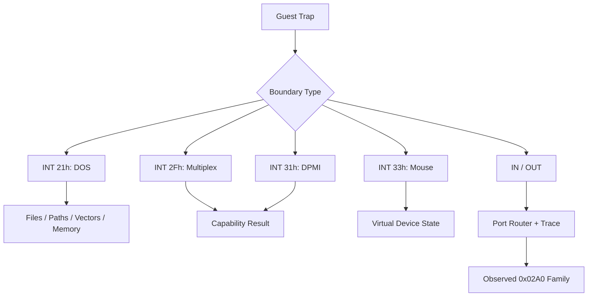

# Interrupt와 port I/O 관찰

## 확인된 software interrupt

* `INT 21h`: DOS version, path, file, IOCTL, resize, vector service
* `INT 2Fh AX=1686h`: protected-mode/DPMI 환경 확인 경로
* `INT 31h AX=0400h`: DPMI version/capability 확인 경로
* `INT 33h AX=0000h`: mouse driver reset/presence 확인

각 service는 관찰된 register contract만 구현하며, 알 수 없는 subfunction을 성공으로 위장하지 않는다.

## Interrupt vector

`INT 21h AH=35h` get vector와 `AH=25h` set vector가 관찰되었다. 현재는 guest가 기대하는 vector state를 HLE table로 보존하며 실제 Win32 IDT를 수정하지 않는다.

## Port I/O

privileged `IN`/`OUT`은 Win32 user mode에서 직접 실행할 수 없다. port router와 trace buffer를 두고 관찰된 `0x02A0` 계열 초기화만 제한적으로 분류했다. 장치 의미가 확정되지 않은 port는 일반 성공으로 처리하지 않는다.

## 미확정

`0x02A0` 계열 장치의 정확한 하드웨어 역할과 read/write state machine은 추가 trace가 필요하다.

# Interrupt and Port-I/O Observations

Observed software interrupts include DOS `INT 21h`, `INT 2Fh AX=1686h`, `INT 31h AX=0400h`, and mouse reset `INT 33h AX=0000h`. Only observed register contracts are emulated. DOS vector services are stored in guest HLE state and never modify the Win32 IDT.

Privileged port I/O is routed through a traceable HLE layer. Only the observed `0x02A0` initialization family is classified; the exact device and state machine remain unresolved.

## MSCDEX probe confirmed on 2026-07-12

The guest directly calls `INT 2Fh AX=1500h` to query the MSCDEX drive count, then uses DPMI `INT 31h AX=0300h, BL=2Fh` with a real-mode frame whose AX is `1510h`. The current minimal environment reports no CD-ROM drives (`BX=CX=0`) and rejects the device request with frame `AX=000Fh`, CF set. The outer DPMI call itself succeeds with CF clear.
