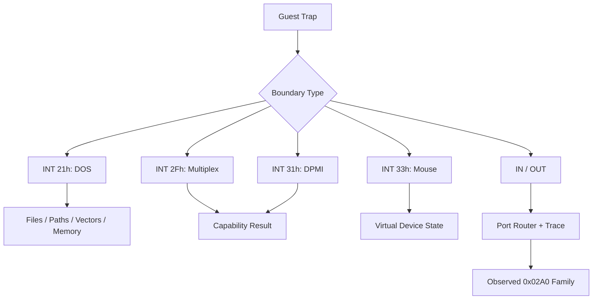

# Interrupt와 port I/O 관찰

## 확인된 software interrupt

* `INT 21h`: DOS version, path, file, IOCTL, resize, vector service
* `INT 2Fh AX=1686h`: protected-mode/DPMI 환경 확인 경로
* `INT 31h AX=0400h`: DPMI version/capability 확인 경로
* `INT 33h AX=0000h`: mouse driver reset/presence 확인

각 service는 관찰된 register contract만 구현하며, 알 수 없는 subfunction을 성공으로 위장하지 않는다.

## Interrupt vector

`INT 21h AH=35h` get vector와 `AH=25h` set vector가 관찰되었다. 현재는 guest가 기대하는 vector state를 HLE table로 보존하며 실제 Win32 IDT를 수정하지 않는다.

## Port I/O

privileged `IN`/`OUT`은 Win32 user mode에서 직접 실행할 수 없다. port router와 trace buffer를 두고 관찰된 `0x02A0` 계열 초기화만 제한적으로 분류했다. 장치 의미가 확정되지 않은 port는 일반 성공으로 처리하지 않는다.

## 미확정

`0x02A0` 계열 장치의 정확한 하드웨어 역할과 read/write state machine은 추가 trace가 필요하다.

## 2026-07-26 Task 297: INT 8 타이머 주입 IF 게이트

**확인됨 (구현):** 선점형 경로와 VEH 경로는 이제 실제 게스트 `EFlags.IF`
(`0x00000200`)가 설정된 경우에만 INT 8 IRET 프레임을 게스트 스택에 기록한다. IF=0이면
`timer_interrupt_pending`을 소비하지 않고 최대 한 건으로 합쳐 보류한다. 주입 진입 시에는
기존과 같이 IF/TF를 지우며, CLI/STI 에뮬레이션과 두 주입 경로가 공용
`kEFlagsInterruptEnable` 상수를 사용한다. 따라서 ISR이 IF=0으로 실행되는 동안 같은 경로의
재주입이 차단되고, IRET 또는 STI로 IF가 다시 설정된 뒤에만 보류된 틱을 전달할 수 있다.

**확인됨 (25초 격리 실행):** `aot-dbt`, `REPIU_TIMER_INJECT_LOG=1` 조건에서 INT 8 주입
37회, 진행도 13,133, Glide 게이트 `84/84`, 창 생성 `1/640x480`을 기록하고 정상 타임아웃했다.
예외 포착과 malformed exception dispatch는 모두 0이었다. 주입 프레임은 깊은 호출 구간의
`0x035D6834`까지 내려간 뒤 `0x035D6DA4` 부근으로 복귀했으며, 수정 전의 지속적인 단조 하강
패턴은 관찰되지 않았다. 격리 EEPROM 해시는 원본 fixture와 일치했다.

**미확정:** 이 단일 25초 실행은 장시간·비결정적이던 296류 크래시 전체가 소멸했음을 증명하지
않는다. 다만 IF 게이트의 정적 순서, 스택 복귀 로그, gate 84 진행은 대상 결함과 busy-wait
회귀가 이 검증 범위에서 없음을 뒷받침한다. 명시적 in-flight 플래그는 중첩이 다시 관찰될
때만 추가한다.

# Interrupt and Port-I/O Observations

Observed software interrupts include DOS `INT 21h`, `INT 2Fh AX=1686h`, `INT 31h AX=0400h`, and mouse reset `INT 33h AX=0000h`. Only observed register contracts are emulated. DOS vector services are stored in guest HLE state and never modify the Win32 IDT.

Privileged port I/O is routed through a traceable HLE layer. Only the observed `0x02A0` initialization family is classified; the exact device and state machine remain unresolved.

## 2026-07-26 Task 297: INT 8 timer-injection IF gate

**Confirmed (implementation):** Both the preemptive and VEH paths now write an INT 8 IRET frame only
when the real guest `EFlags.IF` bit (`0x00000200`) is set. With IF clear, the paths preserve one
coalesced `timer_interrupt_pending` request. Injection still clears IF/TF on entry, while CLI/STI and
both injection paths share `kEFlagsInterruptEnable`. This blocks re-injection while the ISR runs with
IF clear and permits deferred delivery only after IRET or STI enables interrupts again.

**Confirmed (isolated 25-second run):** An `aot-dbt` run with `REPIU_TIMER_INJECT_LOG=1` recorded 37
INT 8 injections, progress 13,133, 84/84 Glide gates, and one 640x480 window before a clean timeout.
Caught exceptions and malformed exception dispatches were both zero. The injection frame descended to
`0x035D6834` during a deeper call and then returned near `0x035D6DA4`; the former continuously
descending pattern did not recur. The isolated EEPROM hash matched the fixture.

**Unresolved:** One 25-second run does not prove that every long-running, nondeterministic Task-296-era
crash is gone. It does show that the targeted nesting pattern and busy-wait regression are absent in
this verification window. Add an explicit in-flight guard only if nesting is observed again.

## 2026-07-26 Task 299: 선점 주입의 12바이트 frame 누수

**확인됨 (장기 로그):** Task 297 이후 약 29초 실행에서 guest `RET 0x030D8BB2`의
`[ESP]`는 `0x43F00000`(`480.0f`)이고, 정상 반환주소 `0x030F2739`는 정확히
`[ESP+12]`에 남았습니다. 호출자는 `0x030F2734: call 0x030D8B84`이며, wrapper의
`call [edx+0x2C4]; add esp,8; ret`와 실제 대상 `0x03062560`의 `ret 8`은 정적으로
균형이 맞습니다. 따라서 실패의 ESP 차이는 ABI 선언 오류가 아니라 **INT 8 IRET frame
한 개와 같은 12바이트**입니다. 종료 직전 마지막 타이머 사건도 선점 주입이었습니다.

**설계 결론:** IF 게이트는 중첩을 막았지만 poll thread가 중지된 guest의 stack/EIP를
직접 바꾸는 경로는 제거해야 합니다. poll thread는 pending을 세우고 TF만 arm하며, 실제
frame 작성과 ISR 전환은 다음 `EXCEPTION_SINGLE_STEP`의 guest-thread VEH 문맥에서 기존
공통 주입기로 수행합니다. 원본 ISR과 `IRETD`는 계속 주 실행 경로입니다.

**미확정:** frame이 직접 `SetThreadContext` 전환, AOT cache 재개 상태, 또는 둘의
상호작용 중 어느 지점에서 최종적으로 누수됐는지는 기존 로그만으로 더 세분할 수 없습니다.
VEH rendezvous 검증은 직접 poll-thread frame write를 제거했을 때 같은 `ESP-12` 형태가
사라지는지로 판정합니다.

## 2026-07-26 Task 299: 12-byte preemptive-frame leak

**Confirmed (long-run log):** After Task 297, a run ended with guest
`RET 0x030D8BB2` reading `0x43F00000` (`480.0f`) at `[ESP]`, while the correct
return `0x030F2739` remained exactly at `[ESP+12]`. The static caller,
wrapper, and indirect callee have a balanced `call`, `add esp,8`, and `ret 8`
contract. The displacement therefore matches one 12-byte INT 8 IRET frame,
not an ABI declaration error. The final timer event was also preemptive.

**Design conclusion:** Keep tick detection on the poll thread, but arm TF only.
Create the frame and enter the ISR through the existing injector on the guest
thread's next VEH single-step boundary. The original ISR and `IRETD` remain
the execution path.

**Unresolved:** The old log cannot separate whether direct
`SetThreadContext`, AOT-cache resumption, or their interaction caused the
final leak. Verification will test whether removing all poll-thread frame
writes eliminates the exact `ESP-12` shape.

**확인됨 (Task 299 검증):** 45초 격리 `aot-dbt` 실행에서 TF arm과 VEH wakeup이
3/3으로 대응했고 poll-thread 직접 frame write는 0건이었습니다. 이전 약 29초 실패
지점을 넘어 정상 timeout했으며 exception/malformed/non-guest return fallback은 모두
0건, INT 8 chain HLE는 333건, Glide gate는 2,212/2,212였습니다.

**Confirmed (Task 299 verification):** A 45-second isolated `aot-dbt` run
matched 3 TF arms to 3 VEH wakeups with zero direct poll-thread frame writes.
It passed the prior roughly 29-second failure point and timed out normally
with zero caught/malformed/non-guest-return failures, 333 INT 8 chain
completions, and 2,212/2,212 Glide gates.

## MSCDEX probe confirmed on 2026-07-12

The guest directly calls `INT 2Fh AX=1500h` to query the MSCDEX drive count, then uses DPMI `INT 31h AX=0300h, BL=2Fh` with a real-mode frame whose AX is `1510h`. The current minimal environment reports no CD-ROM drives (`BX=CX=0`) and rejects the device request with frame `AX=000Fh`, CF set. The outer DPMI call itself succeeds with CF clear.

## 2026-07-26 Task 301: 강제 TF 제거 / Remove forced TF wakeup

**확인됨:** Task 299의 TF rendezvous는 기존 12바이트 frame 누수를 없앴지만 장시간 실행
세 번에서 poll arm 직후 미처리 `0x80000004`로 프로세스를 종료했습니다. 마지막 guest
EIP와 무관하게 Windows fault 주소는 세 번 모두 `0x6FAC40B1`이었습니다.

**전달 정책:** poll thread는 DOS tick과 coalesced pending만 갱신합니다. guest thread의 기존
single-step VEH가 HLE/AOT 상태를 guest 경계로 복원한 뒤, native fast path 또는 linear span을
다시 시작하기 전에 pending INT 8을 전달합니다. 원본 ISR, `IRETD`, IF gate는 유지합니다.

**Confirmed and policy:** Task 299 removed the 12-byte frame leak, but three
long runs ended with an unhandled `0x80000004` immediately after a poll-thread
TF arm. The Windows fault address was `0x6FAC40B1` in all three runs despite
different guest EIPs. The poll thread now updates only the DOS tick and
coalesced pending flag. Existing guest-thread single-step VEH boundaries
deliver pending INT 8 after HLE/AOT reconciliation and before native re-entry,
while preserving the original ISR, `IRETD`, and IF gate.

**검증됨:** 150초 격리 실행에서 강제 TF arm은 0건이었고 자연 VEH 경계가 INT 8
2,283건을 모두 chain HLE까지 완료했습니다. progress 129,810과 Glide gate
13,932/13,932가 계속 증가했으며 exception/malformed/새 APPCRASH는 0건이었습니다.

**Verified:** In the isolated 150-second run, forced TF arms remained zero
while natural VEH boundaries delivered all 2,283 INT 8 requests through chain
HLE. Progress reached 129,810 and Glide gates 13,932/13,932, with zero caught
exception, malformed dispatch, or new APPCRASH.

## 2026-07-29 Task 348: AOT back-edge 타이머 rendezvous

**확인됨 (실패 원인):** 입력 재현 로그에서 약 37.4초 이후 heartbeat/dispatch/progress가
고정됐고, `0x0302FA08..0x0302FA10`의 tick 대기 루프는 전역
`0x032D9C84`가 1인 상태로 반복됐습니다. 원본 INT 8 ISR의 `0x03042F36`만 이 값을
증가시키지만, 순수 AOT back edge 안에는 두 번째 pending 틱을 전달할 자연 VEH 경계가
없었습니다.

**확인됨 (구현):** `aot-dbt` emitter는 direct/conditional back edge 앞에 flags 보존
request guard를 생성합니다. poll thread는 55ms 틱마다 placement 소유 request word만
설정하고, guest thread가 등록된 `INT3`에 도달하면 request를 지운 뒤 기존 공용
`InjectPendingInterrupts`를 호출합니다. Win32 breakpoint 컨텍스트는 이 소유 sentinel에서
EIP를 `ExceptionAddress + 1`로 명시적으로 옮겨야 합니다. 이를 생략한 첫 검증에서는 같은
`INT3`를 1.2초 동안 134,721회 다시 실행했고, 수정 후 5초 smoke에서는 50회로 정상화됐습니다.

**검증됨:** 입력을 포함한 50초 `aot-dbt` 실행에서 heartbeat는 37초 261,280에서
50초 278,446으로, dispatch는 130,640에서 139,223으로 계속 증가했습니다. 종료 카운터는
safe-point trap/injected/deferred `518/452/66`, original fatal 0이었습니다. 이는 이전
37.4초 무경계 정지를 통과하면서도 poll-thread TF/context/stack 변경을 복구하지 않았음을
확인합니다.

## 2026-07-29 Task 348: AOT back-edge timer rendezvous

**Confirmed (cause):** The interactive log froze heartbeat, dispatch, and progress after about
37.4 seconds. The tick wait at `0x0302FA08..0x0302FA10` repeated with global
`0x032D9C84` fixed at 1. Only the original INT 8 ISR at `0x03042F36` increments it, while
the pure AOT back edge had no natural VEH boundary for the second pending tick.

**Confirmed (implementation):** The `aot-dbt` emitter places a flag-preserving request guard
before direct and conditional back edges. The poll thread only sets a placement-owned request
word on each 55ms tick. The guest thread reaches the registered `INT3`, clears the request,
and invokes the existing common injector. For this owned Win32 breakpoint sentinel, VEH must
explicitly resume at `ExceptionAddress + 1`. Omitting that step retrapped 134,721 times in
1.2 seconds; after the correction, a five-second smoke run recorded the expected 50 traps.

**Verified:** In the 50-second interactive `aot-dbt` run, heartbeat continued from 261,280 at
37 seconds to 278,446 at 50 seconds, and dispatch from 130,640 to 139,223. Final safe-point
trap/injected/deferred counts were `518/452/66`, with zero original fatal events. The previous
boundary-free freeze was passed without restoring poll-thread TF, context edits, or stack writes.

## 2026-07-29 Task 349: PIT 채널 0 주기 확인

**확인됨 (원본 바이너리):** `PIU.EXE`는 `0x030250C0`과 `0x0302559C`에서
`EAX=240`으로 `0x030430B0`을 호출합니다. 하위 함수는 데이터 상수
`1,193,280.0f`를 요청값으로 나눠 reload `4,972`를 만들고, 제어 포트 `0x43`에
`0x36`, 채널 0 포트 `0x40`에 low/high `0x6C`, `0x13`을 기록합니다. 따라서
게임이 의도한 IRQ0는 정확히 `240Hz`입니다.

**확인됨 (기존 HLE 원인):** Win32 폴러는 IRQ0와 BDA `0x46C`를 같은
`elapsed / 55ms` 값으로 처리했고, 포트 `0x43`/`0x40`은
`unsupported-ignored` 뒤 공유 `OUT DX,AL` helper를 NOP으로 바꿨습니다. 원본의
240Hz 설정은 반영되지 않았고 두 tick 대기는 약 `8.33ms` 대신 명목상
`110ms`가 됐습니다.

**확인됨 (수정):** 공용 PIT HLE가 완성된 reload를 원자 snapshot으로 게시하고,
Win32 scheduler가 단조 증가 시간에서 `1,193,280 / divisor`로 IRQ 만료를
계산합니다. BDA tick은 기본 divisor `65,536`으로 분리했습니다. PIT 출력과
PIC EOI는 공유 helper를 보존하기 위해 NOP patch 없이 EIP만 전진합니다.
IF gate, pending 한 건 병합, guest-thread safe point, 원본 ISR/IRETD는 유지됩니다.

**검증됨:** 공용 probe는 divisor `4,972`, `240Hz`와 약 `4.167ms` cadence를
통과했습니다. 실제 50초 `aot-dbt` 실행은
`[repiu-pit] channel=0 divisor=4972 frequency=240.000000Hz generation=2`를
기록했고, 종료까지 heartbeat/dispatch/progress 증가, Glide
open/texture/draw/swap 도달, fatal 0을 유지했습니다.

## 2026-07-29 Task 349: PIT channel-0 cadence

**Confirmed (original binary):** `PIU.EXE` calls `0x030430B0` with
`EAX=240` at `0x030250C0` and `0x0302559C`. The callee divides its
`1,193,280.0f` reference by the requested rate, producing reload `4,972`,
then writes control `0x36` to port `0x43` and low/high `0x6C`, `0x13` to
port `0x40`. The intended IRQ0 rate is exactly `240Hz`.

**Confirmed (old HLE cause):** The Win32 poller tied IRQ0 and BDA `0x46C` to
the same `elapsed / 55ms` counter. Ports `0x43`/`0x40` fell through
`unsupported-ignored` and NOP-patched the shared `OUT DX,AL` helper. The
240Hz programming was lost, stretching a nominal two-tick wait from about
`8.33ms` to `110ms`.

**Confirmed (fix):** Shared PIT HLE publishes complete reloads atomically,
and the Win32 scheduler computes expirations from monotonic time using
`1,193,280 / divisor`. BDA time is separately derived with divisor `65,536`.
PIT output and PIC EOI preserve the shared helper by advancing EIP without a
NOP patch. Existing IF gating, one-request pending coalescing, guest-thread
safe points, and the original ISR/IRETD path remain in force.

**Verified:** The shared probe passed divisor `4,972`, `240Hz`, and the
approximately `4.167ms` cadence. A real 50-second `aot-dbt` run logged the
exact configuration, continuously advanced heartbeat/dispatch/progress,
reached Glide open/texture/draw/swap, and retained zero fatal events.
