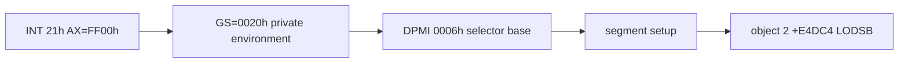

# LINEXE arena 활성화 후 실행 frontier

## 확인 결과

세 전용 페이지와 selector `0020h/0080h/0090h`를 설치하고 `AX=FF00h` 원본 계약을 활성화한 결과, PIU는 이전 fatal DLL-loader 경로 대신 다음 순서로 진행했습니다.

첫 실행에서는 object 2 `+0xE4D10`의 DPMI `AX=0006h`가 새 blocker였습니다. selector base 조회와 설정 `0006h/0007h`를 구현한 뒤 object 2 `+0xE4DC4`까지 진행했습니다. 마지막 예외는 opcode `ACh`(`LODSB`)이며, 당시 software guest DS는 0이고 `ESI=0`, `EDI=0x023D6E61`이었습니다.

selector descriptor 수가 4개에서 7개로 증가했으므로 LINEXE 환경의 세 descriptor가 모두 원자적으로 등록됐음도 확인했습니다.

## Environment selector 원인 복원

`+0xE4DC4`의 원인은 `LODSB`가 아니라 PSP `ES:[002Ch]`를 0으로 반환하던 임시 HLE였습니다. `002Ch`를 반환하고 software DS 기반 `LODSB`를 처리한 뒤 환경 scan과 DOS resize를 통과했으며 새 frontier는 object 2 `+0xF8405`의 SIB memory store입니다.

# Runtime Frontier after LINEXE Arena Activation

After installing three owned pages and selectors `0020h/0080h/0090h`, PIU followed the DOS/4GW identification path instead of the prior fatal loader path. Implementing DPMI functions `0006h/0007h` moved execution from object 2 `+0xE4D10` to `+0xE4DC4`, where `LODSB` now requires reconstruction of the guest DS/address-size semantics.

The root cause was the temporary PSP `ES:[002Ch]` response of zero. Restoring selector `002Ch` and software-DS `LODSB` semantics passed the environment scan and DOS resize. The new frontier is the independent SIB-addressed allocator store at object 2 `+0xF8405`.

SIB decoding passed `+0xF8405` and moved the frontier to object 2 `+0xF7AD4` (`83 0E 01`, memory OR with immediate 1) after about 29,083 dispatches and successful `intro.ani` open/read activity.

실제 OR 적용 시 allocator 주소 `0x025D83E4`가 초기 LINEXE private page와 겹치는 것이 확인됐습니다. HLE 페이지를 arena 상단으로 이동한 뒤 1,150,295 dispatch 동안 예외 entry/exit가 일치했고 host AV가 사라졌습니다. 이후 `+0xF3438` DLL-loader fatal에 다시 도달하므로 다음 분석 범위는 private structure 탐색과 gate 호출입니다.

후속 관찰에서 prefixed `mov ax,gs`를 HLE 처리해 saved GS를 `0020h`으로 교정했습니다. 그러나 scan entry/module candidate/module match/export match/return 계수는 `1/0/0/0/1`입니다. 따라서 현재 실패는 이름이나 export table이 아니라 `GS:0042h` root far pointer read 이전/자체에 있습니다.

direct descriptor 관찰은 `0020h base=0x035D4000 limit=0x0FFF`, root `0090:059A`를 확인했습니다. GS word-load를 single-step dispatch에 추가하자 계수는 `scan=1, module candidate=1, module match=0`으로 이동했습니다. 현재 실패는 selector `0090h`의 module-name pointer/byte 비교 단계입니다.

selector `0090h base=0x035D5000`, module name pointer `0090:0504`, direct `LINEXE_LOADER`도 확인했습니다. 하지만 GS byte-load는 0회이고 module candidate 시점 `[ESP+10h]` selector는 0입니다. 따라서 현재 blocker는 `GS:0044h` root selector word가 AX/stack에 반영되지 않는 segment word-load dispatch입니다.
