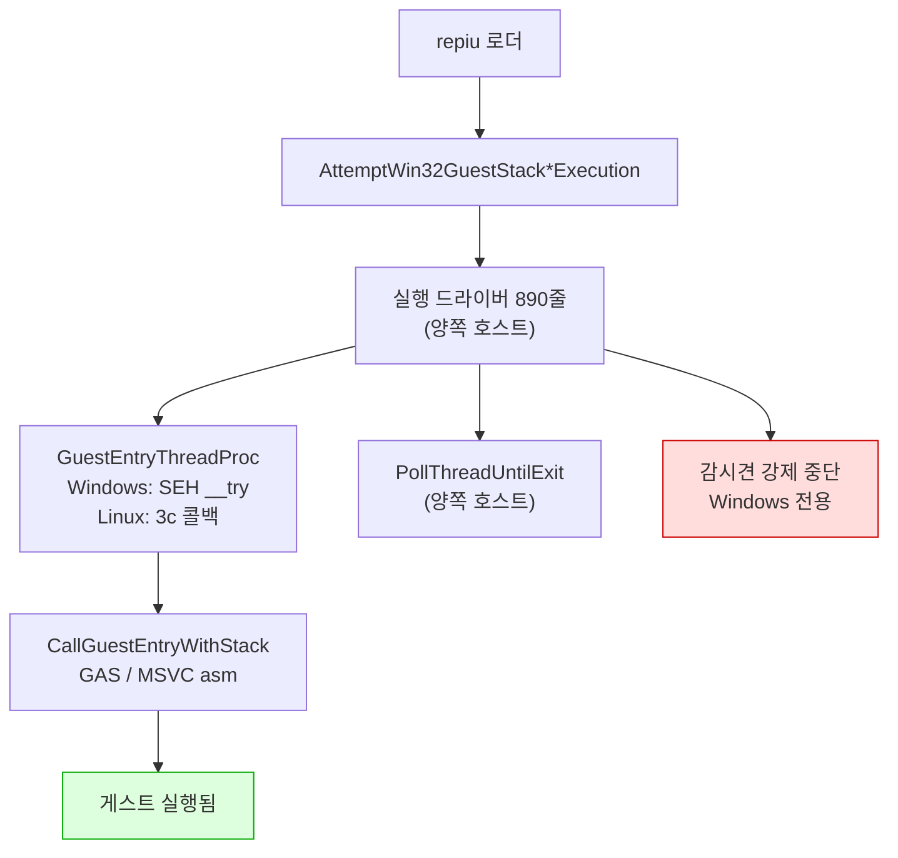
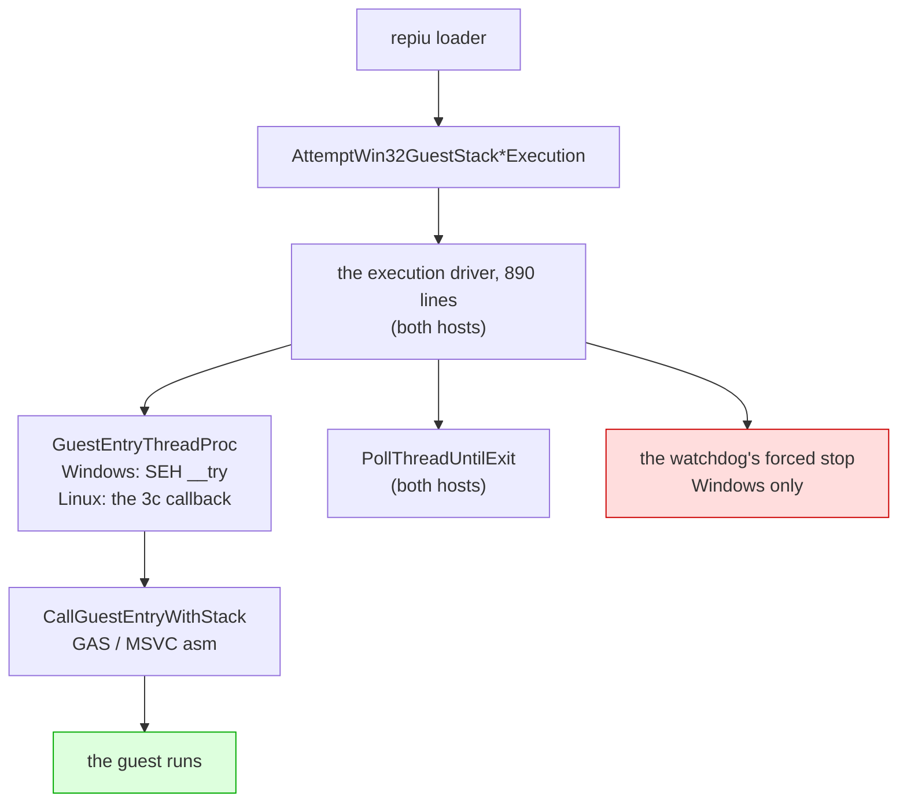

# Linux 이식 frontier / Linux port frontier

설계: [20260822-503](../design/20260822-503-linux-execution-engine.md) ·
작업 지시: [20260822-503](../work-orders/20260822-503-linux-execution-engine.md) ·
작업 로그: [20260822-503](../work-logs/20260822-503-linux-execution-engine.md) ·
측정 절차: [linux-engine-port-measurement](../guides/linux-engine-port-measurement.md)

이 문서는 **Linux 이식이 지금 어디까지 왔는지와 다음에 무엇이 필요한지**만 유지합니다.
단계별 증거는 작업 로그에 있습니다. 표기는 이 디렉터리의 규칙을 따릅니다 — **확인됨**,
**추정**, **미확정**.

## 1. 한 줄 요약

**게스트 코드와 기본 `dynamic` AOT backend가 Linux에서 실행됩니다.** DOS/4GW 샘플은
`legacy`와 `dynamic` 모두 같은 종료 코드 2·초점 오프셋 0x10·opcode 0x80에서 멈춥니다.

**화면도 열렸습니다(Task 506).** WSLg `pumpit1`은 약 45.1초에 첫 버퍼 스왑, 약 51.7초에
69,263/307,200 non-black 픽셀을 기록했고 이후 스왑이 계속되었습니다. 오디오 장치도 열립니다.

**종료도 스스로 됩니다(Task 507).** 예산 만료·SIGTERM 여덟 번 모두 프로세스가 스스로
끝났습니다 — 이전에는 TERM을 받고도 영원히 기다렸습니다.

**그리고 코어 덤프 없이 끝납니다(Task 508).** 507 뒤에 남아 있던 것은 회수를 거절당한 실행이
SIGTRAP으로 끝나는 경우였습니다. 60초 예산 6회에서 거절 6회 중 2회가 그렇게 끝났고, 수정 후
같은 6회에서 거절은 그대로 6회·SIGTRAP은 0회입니다. **이제 Linux에서 `exit=133`을 보면 그것은
회귀입니다.**

**화면이 나오는 것을 사람이 확인했습니다(2026-08-28, 사용자 관측).** 같은 관측이 남긴 다음
과제는 **속도**입니다 — "아주 느리다". Linux 프레임률은 아직 한 번도 측정된 적이 없으므로,
다음 축은 4절에 적은 대로 **먼저 재는 것**입니다.

## 2. 확인됨 — 지금 서 있는 것

| 항목 | 상태 | 근거 |
|---|---|---|
| `src/platform/win32` 81개 소스 Linux 컴파일 | **81 / 81** | 3d-16, 3d-17 측정 |
| `repiu` 로더 Linux 링크 | ELF 32-bit `EXEC`, 텍스트 0x40000000, 쓰기 불가 | 3d-17 |
| 엔진 수준 미정의 심볼 | **0** (라이브러리 배선 9개뿐이었고 해결됨) | 3d-17 측정 |
| `repiu_core_probe` | 양쪽 호스트 **15 / 15** | 3d-18 |
| 게스트 스택 전환·폴트 복구 | 양쪽에서 같은 probe 통과 | 3d-16 |
| 스레드 생성·조회·대기·해제 | 양쪽에서 같은 probe 통과 | 3d-18 |
| **게스트 실행** | **샘플 실행, Windows와 같은 명령에서 정지** | **3d-19** |
| 폴트 18건·종료 코드·blocker | 두 호스트 일치 | 3d-19 |
| **Linux dynamic AOT** | 캐시 배치·인라인 패치·pumpit1 스왑/non-black 픽셀 | **Task 506** |
| **Linux 종료 경로** | 예산 만료·SIGTERM 모두 프로세스가 스스로 종료 | **Task 507** |
| **Linux 종료 경로 — 코어 덤프 없음** | 회수 거절 6/6에서 SIGTRAP **0회** (수정 전 2회) | **Task 508** |

계층으로 내려간 것들입니다.

| 계층 | 헤더 | 단계 |
|---|---|---|
| 게스트 레지스터 컨텍스트 | `platform/guest_cpu_context.h` | 3a |
| 가상 메모리 | `platform/virtual_memory.h` | 3b |
| 폴트 전달 | `platform/fault_handler.h` | 3c |
| 워커 신호 | `platform/worker_signal.h` | 3d-6 |
| 안전한 메모리 복사 | `platform/safe_memory_copy.h` | 3d-7 |
| 시간·사이클 카운터 | `platform/host_time.h` | 3d-8 |
| 환경 변수 읽기·열거·쓰기 | `platform/host_environment.h` | 3d-9, 3d-16, 3d-17 |
| 진단 출력 | `platform/host_error_stream.h` | 3d-14 |
| 스레드 번호·생성·조회·대기 | `platform/host_thread.h` | 3d-15, 3d-18 |
| 게스트 스택 전환 오프셋과 전역 | `platform/guest_stack_switch.h` | 3d-16 |
| 자식 프로세스 재실행 | `platform/host_process.h` | 3d-17 |
| 양보·짧은 대기 | `platform/host_time.h` | 3d-19 |

어셈블리는 GAS로 옮겨졌습니다 — 다섯 디스패치 thunk(`stack_bridge.inc.S` 매크로 하나,
3d-12)와 트램폴린의 세 진입점(`guest_stack_switch.S`, 3d-16).

## 3. 벽은 열렸습니다 (3d-19)



`IsGuestStackSwitchSupported()`와 `IsDirectX86ExecutionSupported()`는 이제 컴파일러가 아니라
**아키텍처**를 묻습니다 — 3d-16이 스택 전환을 GAS로 쓴 뒤로 컴파일러에 달려 있지 않습니다.

## 3.5 2026-08-27 main 병합 인계

이 날 main에 들어간 것은 다섯입니다. 종합 설계는 없고, 각 작업의 설계·지시서·로그가 정본입니다.

| 커밋 | 무엇 |
|---|---|
| `6f9ac34` | 503d-22 마감 — 포기한 인터럽트가 다시 오지 못함을 probe로 고정, 그 과정에서 드러난 교차 스레드 구멍을 닫음 |
| `9acbabe` | `SA_NODEFER`를 **후보에서 제외** — 증상을 원인으로 읽고 있었음. 같은 플래그를 두고 자기모순이던 주석도 정정 |
| `bd6e736` | 503d-23 — **9초 정지 해결.** `native_fast_path`가 복귀 브레이크포인트를 무장하면서 트랩 플래그를 해제하는데 Linux에서 무장만 버려짐 |
| `db234db` | Task 505 — **Glide 창이 Linux에서 열림.** 이식이 아니라 울타리 57개 해제 |
| `486fe09` | `0x010EE1xx`를 "대기 루프"라 한 것 정정 — Task 219가 이미 확정한 비트스트림 디코더 |

### 이 날 반복해서 걸린 것

**성공 신호 하나로 성공을 판정한 것**이 세 번입니다.

| 무엇을 봤나 | 무엇으로 읽었나 | 실제 |
|---|---|---|
| `exit 0` | 정상 완주 | 창을 못 열어 게임이 포기 |
| `opened=1` | 창이 열림 | 더미 폴백도 같은 값을 반환 |
| `dispatch_entry` 폭증 | 전진 중 | 일하는 중이지 나아가는 중이 아님 |

그리고 **관측 창보다 긴 주기는 보이지 않는다**에 두 번 걸렸습니다 — 30초는 "느리다",
240초는 "갇혔다", 1,200초에서야 실상.

세 경우 모두 **한 걸음 더 갔으면** 잡혔습니다. 종료 코드 대신 로그를, 반환값 대신 메시지를,
카운터 대신 EIP 궤적과 코드를 봤어야 했습니다. `0x010EE1xx`는 특히 그렇습니다 — 답이
저장소 안에 두 달 전부터 있었습니다.

### 다음

**감시견과 종료 경로의 강제 중단을 안전한 Linux 복구 경로로 바꾸는 작업**입니다. Task 506
검증에서도 측정을 마치고 종료를 요청했을 때 TERM에 응답하지 않아 측정 프로세스를 PID 확인 후
강제 종료했습니다.

> 이 항목은 Task 507·508로 끝났습니다. **현재의 다음 항목은 아래 4절**에 있습니다. 이 절은
> 2026-08-27 시점의 기록으로 남깁니다.

## 4. 다음에 필요한 것

> 이 절은 3d-20을 가리키고 있었습니다. 3d-20(다른 스레드의 레지스터)·3d-21(표본기)·
> 3d-22(시한이 지난 인터럽트)는 끝났고, 목록에서 **빠지지 않은 둘**이 아래에 그대로
> 남습니다. 인터럽트 계층 자체는 양쪽 호스트에서 probe를 통과합니다.

1. ~~**AOT 코드 캐시**~~ — **해결 (Task 506).** Win32 메모리 호출 62곳을 3b 계층으로 옮겼고,
   Linux `dynamic`에서 배치·동적 실행·인라인 패치·페이지 retirement가 동작합니다. `pumpit1`은
   45.1초에 첫 스왑, 51.7초에 첫 non-black 스왑을 기록했습니다.
2. ~~**감시견의 강제 중단.**~~ — **해결 (Task 507).** 종료 블록을 `InterruptHostThread`로
   옮겼습니다. 회수에 성공하면 정상 종료하고, 회수가 거절되면 `DetachHostThread`로 기다리지
   않고 내려가며 AOT 캐시 해제를 건너뛰고 `_Exit`로 프로세스를 즉시 끝냅니다. `pumpit1`에서
   예산 만료·SIGTERM 여덟 번 모두 스스로 종료했습니다(더 이상 매달리지 않음). 회수가 거절된
   경로에서 SIGTRAP으로 끝나는 경우가 남아 있고, 그 원인은 위 6절에 적었습니다 — 프로세스가
   끝나는 것 자체는 507의 조건을 만족합니다.
3. ~~**회수를 거절당한 종료의 코어 덤프.**~~ — **해결 (Task 508).** 근인은 트랩이 아니라
   **순서**였습니다. 종료 블록이 회수 성공 여부와 무관하게 `RemoveFaultHandler()`를 부르는데,
   거절당한 실행에서는 그 뒤로도 게스트 스레드가 돌면서 AOT 엔진이 평소처럼 심는 INT3을
   밟습니다. 508은 거절된 갈래에서 정리를 통째로 건너뛰고(핸들러도 떼지 않고) 파일로 나가는
   두 진단과 detach만 남긴 뒤 `_Exit` 합니다. 60초 예산 6회에서 거절 6/6·SIGTRAP 0회.

### 그다음은 속도입니다

세 항목이 모두 닫히면서 **Linux에서 게스트가 돌고, 창이 열리고, 종료가 됩니다.**

**그리고 화면이 나오는 것을 사람이 확인했습니다 (2026-08-28, 사용자 관측).** 계측이 닿는
데까지는 non-black 픽셀 수였고, "실제로 게임 화면이 보이는가"는 사람이 봐야 하는
질문이었습니다 — 그 답이 예입니다. 같은 관측이 남긴 것은 **"속도가 아주 느리다"**입니다.

그래서 다음 축은 렌더 정확성이 아니라 **Linux 실행 속도**입니다. 아직 **측정된 적이
없습니다** — Windows에는 프레임률·`guest-run` 예산 귀속·ordinal 시간 귀속이 모두 있는데
Linux에는 하나도 없습니다. 순서는 이렇습니다.

1. **Linux 프레임률을 먼저 잽니다.** Windows와 같은 장면·같은 계측으로 잡아야 "몇 배
   느린가"라는 문장이 성립합니다. 비교 대상이 없으면 "느리다"는 고칠 수 없습니다.
2. 그다음 **어디에서 느린가**를 귀속합니다. Windows에서 이미 쓰는 노브가 그대로 있습니다 —
   `REPIU_GLIDE_ORDINAL_TIME_PROFILE`, `REPIU_AOT_RETURN_STAGE_PROFILE`. 다만 Windows의
   순위(return 약 27%, Glide 게이트 약 24%)를 **Linux에 그대로 옮겨 읽으면 안 됩니다.**
   호스트가 다르면 예외·시그널·GL 드라이버 비용이 전부 다릅니다.
3. WSLg인지 실제 데스크톱인지도 나눠야 합니다. WSLg는 X11을 한 겹 더 지나므로 present
   비용이 다를 수 있습니다.

**무엇이 그려지는가**(Task 506이 "별도 검증"으로 남긴 것)는 사람이 화면을 본 것으로 절반이
닫혔고, Windows와 같은 장면인지 프레임 단위로 대조하는 것은 남아 있습니다.
`REPIU_GLIDE_FRAME_DUMP`가 두 호스트에 다 있으므로 대조 자체는 가능합니다.

6절의 나머지(핸들러 미반환, 자식 프로세스 재실행, CHD 마운트)는 게스트 구동을 막고 있지
않으므로 그 뒤입니다.

## 5. 실행 확인 방법 (3d-19에서 확립)

게임 자산 없이 "게스트가 도는가"를 확인하는 절차입니다. `build/openwatcom_samples/`의 DOS/4GW
샘플과 direct executable 경로를 씁니다.

```bash
cd build/linux_i386
REPIU_EXECUTION_BACKEND=legacy ./repiu     ../../build/openwatcom_samples/clibexam__bprintf_c/sample.exe
```

같은 샘플을 Windows에서 돌려 **대조하는 것이 요점**입니다. 3d-19 시점의 기준값:

| 항목 | 값 |
|---|---|
| 폴트 총계 | 18 (양쪽) |
| 스레드 종료 코드 | 2 (양쪽) |
| 정지 지점 | `… 8E C1 89 D6 42 [26] 80 3E 00 …`, focus offset 0x10, opcode 0x80 (양쪽) |
| 예외 코드 | Linux `0x0000000B` / Windows `0xC0000005` — 호스트 번호이고 기록용 |
| census 칸 | Linux 18/0 / Windows 17/1 — Windows에만 구분되는 코드가 있어서 |

주소는 재배치 이미지 베이스만큼 다릅니다(Linux 0x01000000, Windows 0x03000000). **오프셋으로
비교하십시오.**

## 6. 미확정 — 확인하지 않고 넘어온 것들

| 항목 | 상태 | 어디에 |
|---|---|---|
| 자식 프로세스 재실행이 Linux에도 필요한가 | **미측정** | Task 500의 근거(GPU 드라이버의 주소 공간 선점)가 Linux에도 해당하는지 확인한 적 없음. 되돌릴 자리는 `host_process.h` |
| 자산 경로와 CHD 마운트의 Linux 검증 | **범위 밖** | 설계의 "범위 밖" 절. 실행 시도 전에 다시 볼 것 |
| ~~렌더 백엔드 (창)~~ | **해결 (Task 505)** | 이식할 것이 없었습니다 — 두 파일 모두 이미 SDL3이고 진짜 Win32 API는 **0개**였습니다. 503d-10이 컴파일용으로 세운 울타리 57개(backend 44 + shader 13)가 전부였고, 실제 수정은 각 파일 한 줄(`SDL_FunctionPointer`)입니다. 이제 `opened=1`, 640x480 논리 창 2배(1280x960), 깊이 24비트 승인 |
| ~~첫 프레임에 도달하지 못함 (화면)~~ | **해결 (Task 506)** | `dynamic` AOT가 legacy의 명령 단위 단일 스텝 병목을 우회했습니다. `pumpit1`은 약 45.1초에 첫 스왑(검정), 약 51.7초에 69,263/307,200 non-black 픽셀, 이후 40회 이상의 연속 스왑을 기록했습니다. 무엇이 정확히 그려지는지는 별도 검증입니다. |
| 오디오 출력 셋 | **정정됨** | 아래 8절 |
| 하드웨어 디버그 레지스터 | **불가 — 이제 술어로 강제** | Linux 사용자 공간은 자기 스레드의 것을 쓸 수 없습니다. **`native_linear_span`만이 아니라** `native_fast_path`·`native_region`도 이 위에 서 있었고, 그 중 `native_fast_path`는 **기본 켜짐**이라 9초 정지를 냈습니다(3d-23). `HardwareDebugRegistersAvailable()`이 셋 모두를 env 설정보다 앞에서 막습니다 |
| 교차 프로세스 텔레메트리 | **울타리 안** | `live_telemetry_snapshot.cpp`의 공유 섹션·정지 스냅샷. 게스트 구동에 불필요 |
| `CaptureSuspendedThreadSnapshot` | **호출자 없음** | 정의만 있고 선언도 호출도 없음. 지우는 것은 의도 확인 후 |
| ~~종료 시 SIGTRAP~~ | **해결 (Task 508)** | 507이 재현했고 508이 근인을 확정했습니다 — **트랩이 아니라 순서**입니다. 종료 블록은 회수 성공 여부와 무관하게 같은 정리 순서를 밟고, 그 세 번째 단계가 `RemoveFaultHandler()`입니다. 회수를 거절당했다는 것은 게스트 스레드가 계속 돈다는 뜻이고, `dynamic` backend는 정상 동작으로 INT3과 트랩 플래그를 심으므로 핸들러가 사라진 뒤 그중 하나를 밟으면 커널 기본 처분(코어 덤프)이 실행됩니다. 507이 넣어 둔 단계 표시가 증거였습니다 — **두 번의 SIGTRAP 모두 마지막 줄이 `step=translation-worker`**, 곧 `step=fault-handler` 바로 다음이었습니다. 508은 거절된 갈래에서 정리를 하지 않습니다: `probe-dump` → `DetachHostThread` → `_Exit`. 60초 예산 6회에서 거절 6/6, SIGTRAP 0회 (수정 전 같은 조건 6회에서 2회). 507이 걱정한 "해제된 AOT 캐시를 가리키는 EIP"는 발생하지 않습니다 — **해제 자체를 하지 않기 때문**입니다. |
| ~~pumpit1의 9초 정지~~ | **해결 (3d-23)** | 근인은 `native_fast_path`가 복귀 브레이크포인트를 무장하면서 트랩 플래그를 해제하는데, Linux에서 무장만 버려진 것. 게스트가 되돌릴 것 없이 풀려났습니다. `fast=18/0/17`(복귀 0)이 카운터에 그대로 있었습니다. 디버그 레지스터가 없는 곳에서 세 경로를 차단해 수정 |
| 인터럽트 핸들러가 반환하지 않는 것 | **원인 미상** | 정지한 게스트에서 첫 배달이 핸들러로 들어간 뒤 반환하지 않았고, 그래서 이후 46건이 전부 보류·시한 초과가 됐습니다. **`SA_NODEFER`는 답이 아닙니다** — 아래를 볼 것 |
| ~~인터럽트 핸들러의 `SA_NODEFER`~~ | **후보에서 제외 (2026-08-27)** | 이것을 "고칠 거리"로 적어 둔 것이 오해였습니다. 이 플래그가 **없어서** 시그널 하나가 한 스레드에서 차단된 채 남고, 그것이 "핸들러가 반환하지 않았다"를 읽게 해 준 **진단 신호**입니다. 붙이면 멈춘 핸들러가 반환하게 되는 게 아니라 그 안으로 배달이 중첩되고, 이 스레드는 이미 3c의 대체 스택 위에 있어 그 스택이 조용히 넘칩니다. 근거는 `host_thread.cpp`의 `EnsureInterruptHandler` 주석에 있습니다 |

## 7. 정정 — 오디오 출력은 이미 이식되어 있었습니다

이 문서의 이전 판은 오디오 출력 셋을 "Linux 백엔드 없음, 무음"으로 적었습니다. **틀렸습니다.**
세 파일 모두 이미 SDL을 쓰고 있고 waveOut 호출이 하나도 없습니다.

| 파일 | `SDL_` 호출 | waveOut 호출 |
|---|---|---|
| `ymz280b_audio_out.cpp` | 16 | **0** |
| `piu10_mp3_audio_out.cpp` | 31 | **0** |
| `cd_audio_wave_out.cpp` | 24 | **0** |

`cd_audio_wave_out`은 **이름만** waveOut입니다. 설계의 "정정 1"이 `Win32AotPageWriteWatchSet`
이름을 보고 `GetWriteWatch`를 쓴다고 단정했다 틀린 것과 **같은 함정**이고, 그 교훈은 이미
설계에 적혀 있었습니다 — **이름이 아니라 구현을 봐야 합니다.**

소리가 나지 않은 진짜 이유는 SDL 쪽이었습니다. i386 빌드인데 `libpulse`의 32비트 판이 없어
SDL이 PulseAudio 백엔드를 빼고 ALSA만 컴파일했고, WSL에는 ALSA가 직접 열 장치가 없습니다.

```
#define SDL_AUDIO_DRIVER_ALSA 1     ← 이것만 있었음
#define SDL_AUDIO_DRIVER_DISK 1
#define SDL_AUDIO_DRIVER_DUMMY 1
```

`libpulse-dev:i386`을 넣고 트리를 **버리고 다시 구성**해야 합니다 — SDL의 드라이버 감지는
구성 시점에 캐시되므로, 남은 캐시가 "안 고쳐졌다"처럼 보이게 만듭니다.

### 7.1 그래서 갖춰야 하는 구성 (2026-08-26 확인)

위가 진단이고, 여기는 **실제로 세워 놓고 확인한 결과**입니다. 다음 세션이 데스크톱에서
돌려 보려면 이 절만 보면 됩니다.

패키지는 전부 `:i386`입니다. 32비트 프로세스가 링크하고 `dlopen` 하는 것들이라 amd64 판은
설치돼 있어도 쓰이지 않습니다.

```bash
sudo dpkg --add-architecture i386
sudo apt update && sudo apt install -y pkg-config \
    libpulse-dev:i386 libasound2-dev:i386 libgl-dev:i386 \
    libx11-dev:i386 libxext-dev:i386 libxrandr-dev:i386 libxi-dev:i386 \
    libxfixes-dev:i386 libxcursor-dev:i386 libxrender-dev:i386 \
    libxkbcommon-dev:i386
```

`libxss-dev`와 `libxtst-dev`는 **필요 없습니다.** 빌드 스크립트가 XSCRNSAVER와 XTEST를 끄고,
그 주석이 이유를 적어 두었습니다 — 켜 둔 확장 하나가 곧 찾아야 할 32비트 패키지 하나입니다.

`pkg-config`가 빠지기 쉽습니다. 없으면 SDL이 PulseAudio를 **조용히** 빼고, 있어도 i386 `.pc`가
`/usr/lib/i386-linux-gnu/pkgconfig`에 있어 기본 검색 경로에 안 잡힙니다. 그래서 패키지를 깔아도
"없다"는 답이 나옵니다. 빌드 스크립트가 `PKG_CONFIG_PATH`로 그 디렉터리를 앞에 붙입니다.

확인된 것:

| 항목 | 결과 |
|---|---|
| SDL 오디오 드라이버 | `PULSEAUDIO` + `ALSA` (이전엔 `DUMMY`뿐) |
| SDL 비디오 드라이버 | `X11` (+ XCURSOR·XFIXES·XINPUT2·XRANDR·XSHAPE·XSYNC·XDBE) |
| 런처 | WSLg에서 창 실행, 롬셋 22개 중 16개 인식 |
| **오디오 장치** | `[repiu-ymz] YMZ280B ready through SDL3 at 88200 Hz` |
| 게스트 실행 (pumpit1, legacy) | 8초 동안 dispatch 167,776회, EIP가 재배치 이미지 안에서 이동 |

소리가 실제로 **들리는지**는 사람이 들어야 합니다. 측정이 답할 수 있는 것은 장치가 열렸다는
데까지입니다.

두 가지가 이 확인을 반복할 때 걸립니다.

* **`--headless`로 구성된 트리는 창도 소리도 만들지 못합니다.** 그 옵션이 켜는
  `SDL_UNIX_CONSOLE_BUILD=ON`은 X11/Wayland 요구를 통째로 건너뜁니다. 데스크톱에서 쓰려면
  `--headless` 없이 구성하고, SDL이 감지 결과를 캐시하므로 **트리를 지우고** 다시 해야 합니다.
* **WSLg 자체가 없을 수 있습니다.** `/mnt/wslg`가 없거나 `DISPLAY`·`PULSE_SERVER`가 비어 있으면
  패키지가 아니라 WSL이 문제입니다. `wsl --update` 후 `wsl --shutdown`입니다. 오래된 커널
  (5.10 대)에는 WSLg가 아예 없습니다.

## 8. 반복해서 겪은 함정 — 그리고 컴파일로는 못 잡는 것

**막고 있는 것 하나가 그 뒤의 숫자를 전부 가립니다.** 네 번 겪었습니다.

| 단계 | 막고 있던 것 | 겉보기 | 실제 |
|---|---|---|---|
| 3d-15 | 2,000줄 `#if defined(_WIN32)` | 실패 84 | 97 (숨은 것은 13개뿐) |
| 3d-16 | `#include <psapi.h>` 한 줄 | fatal error 1 | 17개, 네 곳 |
| 3d-17 | 빠진 spdlog include 경로 | fatal error 1 | 19개, 두 곳 |
| 3d-19 | 함수 **반환 타입**의 `DWORD` | 오류 2 | 69개 (시그니처가 본문을 가림) |

**파일 크기도 오류 개수도 남은 작업량의 지표가 아닙니다.** 절차는
[측정 가이드](../guides/linux-engine-port-measurement.md)에 있습니다 — 저장소를 고치지 말고
**막고 있는 것을 치운 사본**으로 다시 재십시오.

**그리고 3d-19가 다른 종류를 하나 더 찾았습니다.** `runtime_memory_policy.cpp`는 컴파일 측정을
**늘 통과했습니다** — 컴파일되고 `#if !defined(_WIN32)`에서 조기 반환만 했기 때문입니다.
조기 반환 넷을 찾은 것은 어떤 측정도 아니고 **실제 실행**이었습니다.

> 컴파일되는 코드가 아무것도 하지 않는 것은 컴파일로 볼 수 없습니다.

같은 모양이 남아 있는 곳은 **넷**이고, 전부 AOT 경로입니다(`grep -rn "requires Win32"`).

| 파일 | 함수가 답하지 않는 것 |
|---|---|
| `aot_code_cache_win32.cpp:812` | 코드 캐시 배치 |
| `aot_code_cache_win32.cpp:1023` | 동적 번역 |
| `aot_code_cache_win32.cpp:1775` | inline-cache 패치 |
| `aot_page_coherence_win32.cpp:637` | 게스트 페이지 회수 |

3d-20의 목록이 이것입니다.

### 8.1 빌드 스크립트가 스스로를 가린 경우

**빌드가 죽은 자리가 빌드가 잘못한 자리는 아닙니다.**

`cmake --build --parallel`을 숫자 없이 부르면 make에 `-j`가 숫자 없이 전달됩니다. 그것은
코어 수가 아니라 **무제한**이고, 4코어 VM에서 `cc1plus` **58개**가 측정됐습니다. Debug의 큰
번역 단위가 1 GB 넘게 쓰므로 VM 메모리가 고갈됐고, WSL이 세 번 통째로 멈췄습니다 — 그때마다
**서로 다른 고장으로 보였습니다.**

| 겉보기 | 실제 |
|---|---|
| `cc1plus`가 OOM으로 죽음 | 무제한 병렬 |
| `Wsl/Service/E_UNEXPECTED` | 무제한 병렬 |
| `Wsl/Service/0x8007274c` | 무제한 병렬 |

가린 것을 하나 더 겹치게 만든 것은 **분명해 보이는 조절 수단이 아무 일도 하지 않는다**는
점이었습니다. CMake는 `--parallel`이 붙어 있으면 `CMAKE_BUILD_PARALLEL_LEVEL`을 **보지
않습니다.** 그래서 병렬도를 1이나 2로 낮췄다고 믿은 세 번의 시도가 전부 무제한이었고, 그 결과
"이 머신이 이 프로젝트에는 작다"는 잘못된 결론이 두 번 나왔습니다. 커밋 `d838ce1`이 잡 수를
명시합니다.

호스트가 8 GB급이면 `.wslconfig`로 상한과 스왑을 주는 편이 안전합니다 — 죽는 대신 느려집니다.

```ini
[wsl2]
memory=4GB
swap=8GB
```

---

# Linux port frontier

Design: [20260822-503](../design/20260822-503-linux-execution-engine.md) ·
Work order: [20260822-503](../work-orders/20260822-503-linux-execution-engine.md) ·
Work log: [20260822-503](../work-logs/20260822-503-linux-execution-engine.md) ·
Measurement: [linux-engine-port-measurement](../guides/linux-engine-port-measurement.md)

This document keeps only **where the Linux port stands and what the next step needs**. Per-sub-stage
evidence is in the work log. Status labels follow this directory's convention: **Confirmed**,
**Inferred**, **Unresolved**.

## 1. In one line

**Guest code and the default `dynamic` AOT backend execute on Linux.** The DOS/4GW sample stops under
both `legacy` and `dynamic` with exit code 2, focus offset 0x10, and opcode 0x80.

**The screen opens too (Task 506).** WSLg `pumpit1` recorded its first buffer swap at about 45.1
seconds and 69,263 of 307,200 non-black pixels at about 51.7 seconds, followed by continuing swaps.
The audio device opens as well.

**Shutdown ends by itself too (Task 507).** Eight budget-expiry and SIGTERM runs all ended the
process by itself -- before this, TERM was accepted and then waited on forever.

**And it ends without a core dump (Task 508).** What 507 left was that a run whose recovery was
refused sometimes ended in SIGTRAP. Two of six refused runs on a 60-second budget ended that way;
after the fix, the same six were still refused six times with zero SIGTRAPs. **An `exit=133` on Linux
is now a regression.**

**A person has confirmed the screen appears (2026-08-28, user observation).** What the same
observation left is **speed**: "very slow". The Linux frame rate has never been measured, so the next
axis is, as section 4 records, **to measure it first**.

**A window and sound are confirmed on WSLg too** — the launcher's window, and `YMZ280B ready through
SDL3 at 88200 Hz`. The 32-bit packages this needs, and the traps around them, are collected in 7.1.

## 2. Confirmed — what stands today

| Item | State | Evidence |
|---|---|---|
| The 81 `src/platform/win32` sources compiling on Linux | **81 of 81** | 3d-16, 3d-17 measurements |
| The `repiu` loader linking on Linux | ELF 32-bit `EXEC`, text at 0x40000000, not writable | 3d-17 |
| Undefined symbols of the engine's own | **none** (nine were library wiring, resolved) | 3d-17 measurement |
| `repiu_core_probe` | **15 of 15** on both hosts | 3d-18 |
| The guest stack switch and fault recovery | the same probe passes on both | 3d-16 |
| Thread create, query, join, release | the same probe passes on both | 3d-18 |
| **Guest execution** | **the sample runs, stopping where Windows does** | **3d-19** |
| 18 faults, exit code, blocker | the two hosts agree | 3d-19 |
| **Linux dynamic AOT** | cache placement, inline patching, pumpit1 swaps/non-black pixels | **Task 506** |
| **The Linux shutdown path** | budget expiry and SIGTERM both end the process by itself | **Task 507** |
| **The Linux shutdown path, no core dump** | **zero** SIGTRAPs across 6 of 6 refused runs (two before the fix) | **Task 508** |

What moved into the platform layer:

| Layer | Header | Sub-stage |
|---|---|---|
| Guest register context | `platform/guest_cpu_context.h` | 3a |
| Virtual memory | `platform/virtual_memory.h` | 3b |
| Fault delivery | `platform/fault_handler.h` | 3c |
| Worker signal | `platform/worker_signal.h` | 3d-6 |
| Safe memory copy | `platform/safe_memory_copy.h` | 3d-7 |
| Time and cycle counter | `platform/host_time.h` | 3d-8 |
| Environment read, enumerate, write | `platform/host_environment.h` | 3d-9, 3d-16, 3d-17 |
| Diagnostic output | `platform/host_error_stream.h` | 3d-14 |
| Thread id, create, query, join | `platform/host_thread.h` | 3d-15, 3d-18 |
| Stack-switch offsets and globals | `platform/guest_stack_switch.h` | 3d-16 |
| Child-process relaunch | `platform/host_process.h` | 3d-17 |
| Yielding and short waits | `platform/host_time.h` | 3d-19 |

The assembly is in GAS: the five dispatch thunks as one macro in `stack_bridge.inc.S` (3d-12), and
the trampoline's three entries in `guest_stack_switch.S` (3d-16).

## 3. The wall is open (3d-19)



`IsGuestStackSwitchSupported()` and `IsDirectX86ExecutionSupported()` now ask about the
**architecture** rather than the compiler — since 3d-16 wrote the stack switch in GAS, the compiler
stopped being the question.

## 3.5 Main-merge handoff, 2026-08-27

Five things landed on main this day. There is no consolidated design; each task's design, work order
and log are the record.

| Commit | What |
|---|---|
| `6f9ac34` | Closing out 503d-22 — a probe pins that an abandoned interrupt cannot come back, and the cross-thread hole that surfaced while writing it is closed |
| `9acbabe` | `SA_NODEFER` **struck as a candidate** — a symptom had been read as a cause. A comment that contradicted itself about the same flag is corrected |
| `bd6e736` | 503d-23 — **the nine-second stall resolved.** `native_fast_path` arms a return breakpoint and clears the trap flag; on Linux only the arming was discarded |
| `db234db` | Task 505 — **a Glide window opens on Linux.** Not a port but 57 fences taken down |
| `486fe09` | Correcting "wait loop" for `0x010EE1xx` — it is the bitstream decoder Task 219 already identified |

### What caught me repeatedly

**Judging success from a single success signal**, three times.

| What was seen | How it was read | What it was |
|---|---|---|
| `exit 0` | a clean finish | the game giving up for want of a window |
| `opened=1` | a window opened | the dummy fallback returns the same value |
| a soaring `dispatch_entry` | advancing | working, not advancing |

And twice by **a window showing nothing with a period longer than itself** — thirty seconds said
"slow", 240 said "trapped", and only 1,200 showed what was happening.

All three would have been caught by **going one step further**: the log rather than the exit code,
the message rather than the return value, the EIP trajectory and the code rather than the counter.
`0x010EE1xx` most of all — the answer had been in this repository for two months.

### Next

**Replace the watchdog and shutdown forced-stop path with safe Linux recovery.** When measurement
ended, the Task 506 run also stopped responding to TERM and had to be killed after confirming the
exact PID.

> This item was finished by Tasks 507 and 508. **The current next item is in section 4 below.** This
> section is kept as the record it was on 2026-08-27.

## 4. What is needed next

> This section used to point at 3d-20. 3d-20 (another thread's registers), 3d-21 (the sampler) and
> 3d-22 (what a timed-out interrupt leaves behind) are done, and **the two items that were never
> struck off** are still below. The interrupt layer itself passes its probe on both hosts.

1. ~~**The AOT code cache**~~ — **resolved in Task 506.** Its 62 Win32 memory calls moved onto the 3b
   layer, and placement, dynamic execution, inline patching, and page retirement now run under
   Linux. `pumpit1` reached its first swap at 45.1 seconds and first non-black swap at 51.7 seconds.
2. ~~**The watchdog's forced interruption.**~~ — **resolved in Task 507.** The shutdown block moved
   onto `InterruptHostThread`. A successful recovery ends the run normally; a refused recovery goes
   down through `DetachHostThread` without waiting, skips releasing the AOT cache, and ends the
   process immediately with `_Exit`. Eight budget-expiry and SIGTERM runs on `pumpit1` all ended by
   themselves -- none hung. A refused-recovery run sometimes ends in a SIGTRAP instead of a clean
   exit; section 6 above records why. The process ending either way satisfies 507's criterion.
3. ~~**The core dump on a refused-recovery shutdown.**~~ — **resolved in Task 508.** The cause was
   the **ordering**, not the trap: the shutdown block called `RemoveFaultHandler()` whether or not
   recovery had succeeded, and on a refused run the guest thread kept going and hit an INT3 the AOT
   engine plants in the ordinary course of dispatching. 508 skips the cleanup wholesale on the
   refused arm -- the handler included -- keeping only the two diagnostics that write a file, plus
   the detach, before `_Exit`. Six 60-second-budget runs: 6 of 6 refused, zero SIGTRAPs.

### After this, speed

With those three closed, **the guest runs on Linux, a window opens, and shutdown works.**

**And a person has confirmed the screen appears (2026-08-28, user observation).** Measurement reached
as far as a non-black pixel count; whether a game screen is actually visible was a question only a
person could answer, and the answer is yes. What the same observation added is that **it is very
slow**.

So the next axis is not rendering accuracy but **Linux execution speed**, which has **never been
measured**. Windows has a frame rate, a `guest-run` budget attribution and an ordinal time
attribution; Linux has none of them. In order:

1. **Measure the Linux frame rate first.** It has to be the same scene and the same instrument as
   Windows for "how many times slower" to be a sentence at all. Without a comparison, "slow" is not
   something that can be fixed.
2. Then attribute **where** it is slow. The knobs Windows already uses are right there --
   `REPIU_GLIDE_ORDINAL_TIME_PROFILE`, `REPIU_AOT_RETURN_STAGE_PROFILE`. But **Windows' ranking
   (return about 27%, the Glide gate about 24%) must not be carried over and read as Linux's.**
   Different host, different exception, signal and GL driver costs.
3. WSLg and a real desktop have to be separated too: WSLg goes through one more layer of X11, so
   present cost may differ.

**What is drawn** -- Task 506's "separate verification" -- is half closed by a person having seen the
screen; comparing frame by frame against Windows remains. `REPIU_GLIDE_FRAME_DUMP` exists on both
hosts, so the comparison itself is available.

The rest of section 6 -- the handler that does not return, the child-process relaunch, the CHD mount
-- is not blocking the guest from running, so it comes after.

## 5. How to check that the guest runs (established in 3d-19)

The procedure for establishing that the guest executes, with no game assets: a DOS/4GW sample from
`build/openwatcom_samples/` through the direct-executable path.

```bash
cd build/linux_i386
REPIU_EXECUTION_BACKEND=legacy ./repiu     ../../build/openwatcom_samples/clibexam__bprintf_c/sample.exe
```

**Comparing against the same sample on Windows is the point.** The baseline as of 3d-19:

| Item | Value |
|---|---|
| Faults in total | 18 on both |
| Thread exit code | 2 on both |
| Stopping point | `… 8E C1 89 D6 42 [26] 80 3E 00 …`, focus offset 0x10, opcode 0x80, on both |
| Exception code | Linux `0x0000000B` / Windows `0xC0000005` — the host's number, for the record |
| Census bucket | Linux 18/0 / Windows 17/1 — Windows has distinct codes where Linux has one |

Addresses differ by the relocated image base (Linux 0x01000000, Windows 0x03000000). **Compare
offsets.**

## 6. Unresolved — carried across without confirmation

| Item | State | Where |
|---|---|---|
| Whether Linux needs the child-process relaunch | **not measured** | Task 500's reason (a GPU driver claiming the guest's address space) has never been checked on Linux. `host_process.h` is where it comes out |
| Asset paths and the CHD mount on Linux | **out of scope** | the design's out-of-scope section; revisit before attempting a run |
| ~~The render backend (the window)~~ | **resolved (Task 505)** | There was nothing to port — both files were already SDL3 with **zero** real Win32 API calls. All of it was 57 fences 503d-10 raised to get them compiling (44 backend + 13 shader); the actual fix was one line each (`SDL_FunctionPointer`). Now `opened=1`, a 640x480 logical window at 2x (1280x960), depth 24 bits granted |
| ~~No first frame is reached (the screen)~~ | **resolved in Task 506** | `dynamic` AOT bypassed legacy's per-instruction single-step bottleneck. `pumpit1` produced its first black swap at about 45.1 seconds, 69,263/307,200 non-black pixels at about 51.7 seconds, and more than forty continuing swaps. What is drawn accurately remains a separate verification question. |
| The three audio outputs | **corrected** | see section 8 |
| Hardware debug registers | **unavailable — now enforced by a predicate** | Linux user space cannot write its own thread's. **Not only `native_linear_span`** stood on them but `native_fast_path` and `native_region` too, and `native_fast_path` is **on by default**, which is what produced the nine-second stall (3d-23). `HardwareDebugRegistersAvailable()` now gates all three ahead of their environment settings |
| Cross-process telemetry | **fenced** | the shared section and suspended snapshot in `live_telemetry_snapshot.cpp`; not needed to run the guest |
| `CaptureSuspendedThreadSnapshot` | **no callers** | defined, never declared or called; removing it wants its intent confirmed first |
| ~~A SIGTRAP on teardown~~ | **resolved (Task 508)** | 507 reproduced it and 508 settled the cause: **the ordering, not the trap**. The shutdown block walks the same cleanup sequence whether or not recovery succeeded, and its third step is `RemoveFaultHandler()`. A refused recovery means the guest thread keeps running, and the `dynamic` backend plants INT3s and sets the trap flag in the ordinary course of dispatching, so hitting one after the handler is gone runs the kernel's default disposition -- a core dump. 507's own step markers were the evidence: **both SIGTRAPs printed `step=translation-worker` last**, the step immediately after `step=fault-handler`. 508 does no cleanup on the refused arm: `probe-dump`, `DetachHostThread`, `_Exit`. Six 60-second-budget runs gave 6 of 6 refused and zero SIGTRAPs (two under the same conditions before the fix). The "EIP pointing into an already-released AOT cache" 507 worried about does not arise -- **because nothing is released**. |
| ~~pumpit1's nine-second stall~~ | **resolved (3d-23)** | `native_fast_path` armed a return breakpoint and cleared the trap flag; on Linux only the arming was discarded, so the guest was released with nothing to bring it back. `fast=18/0/17` (zero returns) had been sitting in the counters. Fixed by blocking all three such paths where there are no debug registers |
| The interrupt handler not returning | **cause unknown** | on the stalled guest the first delivery entered the handler and never came back, which is why the 46 requests after it all went pending and timed out. **`SA_NODEFER` is not the answer** — see below |
| ~~`SA_NODEFER` on the interrupt handler~~ | **struck as a candidate (2026-08-27)** | listing this as something to fix was a misreading. The flag's **absence** is what leaves one signal blocked on one thread, and that is the **diagnostic** that says "the handler did not return". Adding it would not make a stuck handler return; it would nest deliveries into one that already is, on a thread already running on 3c's alternate stack, which that nesting can quietly overflow. The reasoning is in the `EnsureInterruptHandler` comment in `host_thread.cpp` |

## 7. Correction — the audio outputs were already portable

An earlier revision of this document recorded the three audio outputs as "silent, with no Linux
backend". **That was wrong.** All three already use SDL, with no waveOut call between them.

| File | `SDL_` calls | waveOut calls |
|---|---|---|
| `ymz280b_audio_out.cpp` | 16 | **0** |
| `piu10_mp3_audio_out.cpp` | 31 | **0** |
| `cd_audio_wave_out.cpp` | 24 | **0** |

Only the *name* `cd_audio_wave_out` says waveOut. This is the **same trap** the design's first
correction records — assuming `Win32AotPageWriteWatchSet` used `GetWriteWatch` because of its name —
and its lesson was already written down: **read the implementation, not the name.**

The real reason there was no sound is on the SDL side. This is an i386 build, and with no 32-bit
`libpulse` present SDL compiled the PulseAudio backend out and left only ALSA, which has no device
to open under WSL.

```
#define SDL_AUDIO_DRIVER_ALSA 1     ← the only one
#define SDL_AUDIO_DRIVER_DISK 1
#define SDL_AUDIO_DRIVER_DUMMY 1
```

The fix is `libpulse-dev:i386` and then **discarding and reconfiguring** the tree: SDL caches its
driver detection at configure time, so a surviving cache makes this look as though it had not worked.

### 7.1 What the environment has to be (verified 2026-08-26)

The above is the diagnosis; this is **what was actually stood up and confirmed**. A session that
wants to run on a desktop needs only this subsection.

Every package is `:i386`. A 32-bit process links and `dlopen`s these, so an amd64 copy goes unused
even when installed.

```bash
sudo dpkg --add-architecture i386
sudo apt update && sudo apt install -y pkg-config \
    libpulse-dev:i386 libasound2-dev:i386 libgl-dev:i386 \
    libx11-dev:i386 libxext-dev:i386 libxrandr-dev:i386 libxi-dev:i386 \
    libxfixes-dev:i386 libxcursor-dev:i386 libxrender-dev:i386 \
    libxkbcommon-dev:i386
```

`libxss-dev` and `libxtst-dev` are **not** needed: the build script turns XSCRNSAVER and XTEST off,
and its comment says why — every extension left on is one more 32-bit package to hunt down.

`pkg-config` is easy to miss. Without it SDL drops PulseAudio **silently**, and with it the i386
`.pc` files still sit in `/usr/lib/i386-linux-gnu/pkgconfig`, which is not on the default search
path — which is how an installed package still reports as missing. The build script prepends that
directory through `PKG_CONFIG_PATH`.

What was confirmed:

| Item | Result |
|---|---|
| SDL audio drivers | `PULSEAUDIO` + `ALSA` (previously `DUMMY` alone) |
| SDL video drivers | `X11` (+ XCURSOR, XFIXES, XINPUT2, XRANDR, XSHAPE, XSYNC, XDBE) |
| The launcher | a window on WSLg; 22 ROM sets listed, 16 runnable |
| **The audio device** | `[repiu-ymz] YMZ280B ready through SDL3 at 88200 Hz` |
| The guest running (pumpit1, legacy) | 167,776 dispatches in 8 seconds, EIP moving inside the relocated image |

Whether sound is **audible** is for a person to hear. What measurement reaches is that the device
opened.

Two things get in the way of repeating this check.

* **A tree configured with `--headless` can produce neither a window nor a sound.** The
  `SDL_UNIX_CONSOLE_BUILD=ON` it sets skips the X11/Wayland requirement outright. Configure without
  `--headless`, and **discard the tree** first, because SDL caches what it detected.
* **WSLg may simply not be there.** If `/mnt/wslg` is missing, or `DISPLAY` and `PULSE_SERVER` are
  unset, the problem is WSL rather than the packages: `wsl --update`, then `wsl --shutdown`. An old
  kernel (the 5.10 series) has no WSLg at all.

## 8. One trap met four times

**A single obstruction hides every number behind it.**

| Sub-stage | The obstruction | Apparent | Actual |
|---|---|---|---|
| 3d-15 | a 2,000-line `#if defined(_WIN32)` | 84 failures | 97 (only 13 were hidden) |
| 3d-16 | one `#include <psapi.h>` | 1 fatal error | 17, in four places |
| 3d-17 | a missing spdlog include directory | 1 fatal error | 19, in two places |
| 3d-19 | `DWORD` in a function's **return type** | 2 errors | 69 (the signature hid the body) |

**Neither file size nor error count measures the work remaining.** The procedure is in the
[measurement guide](../guides/linux-engine-port-measurement.md): measure a **copy with the
obstruction removed**, without editing the repository to find out.

**And 3d-19 found a different kind.** `runtime_memory_policy.cpp` had **always passed** the compile
measurement, because it compiles and merely returns early at `#if !defined(_WIN32)`. What found its
four early returns was not a measurement but an actual run.

> Code that compiles and does nothing cannot be seen by compiling.

Four of that shape remain, all on the AOT path (`grep -rn "requires Win32"`):

| File | What the function does not answer |
|---|---|
| `aot_code_cache_win32.cpp:812` | placing the code cache |
| `aot_code_cache_win32.cpp:1023` | dynamic translation |
| `aot_code_cache_win32.cpp:1775` | inline-cache patching |
| `aot_page_coherence_win32.cpp:637` | retiring a guest page |

That is 3d-20's list.

### 8.1 When the build script hid itself

**Where a build dies is not where the build went wrong.**

`cmake --build --parallel` with no number passes `-j` bare to make. That does not mean one job per
core but **unlimited**, and on a four-core VM it was measured at **58** concurrent `cc1plus`
processes. The engine's larger translation units take over a gigabyte each in Debug, so the VM ran
out of memory and WSL went down with it three times — **looking like three different faults.**

| Apparent | Actual |
|---|---|
| an OOM-killed `cc1plus` | unlimited parallelism |
| `Wsl/Service/E_UNEXPECTED` | unlimited parallelism |
| `Wsl/Service/0x8007274c` | unlimited parallelism |

What layered a second concealment on top is that **the obvious control does nothing**: CMake
consults `CMAKE_BUILD_PARALLEL_LEVEL` only when `--parallel` is absent. Three attempts believed to
be running at parallel level 1 or 2 were all unlimited, and twice that produced the wrong
conclusion — that the machine was too small for the project. Commit `d838ce1` names the job count.

On a host with 8 GB or so, a ceiling and a swap file in `.wslconfig` are worth having: the build
then slows instead of dying.

```ini
[wsl2]
memory=4GB
swap=8GB
```
